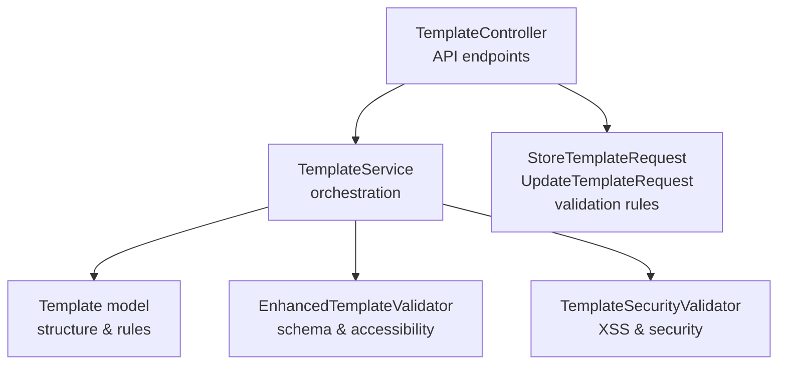
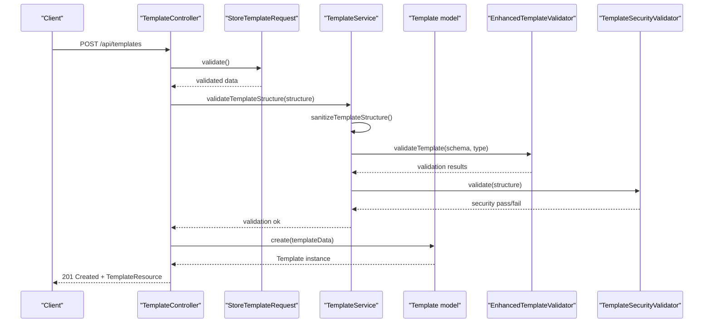
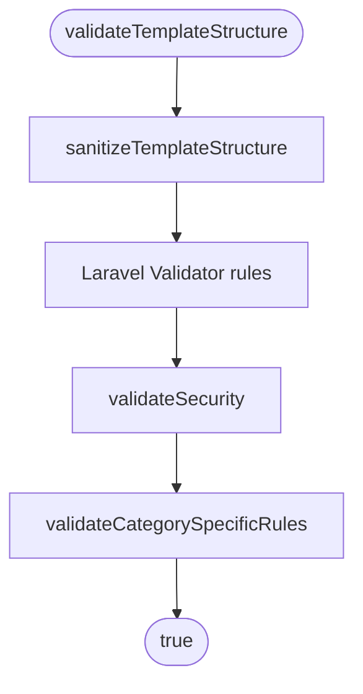
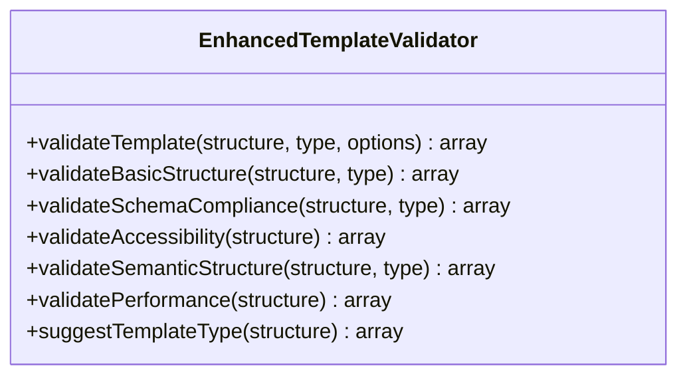
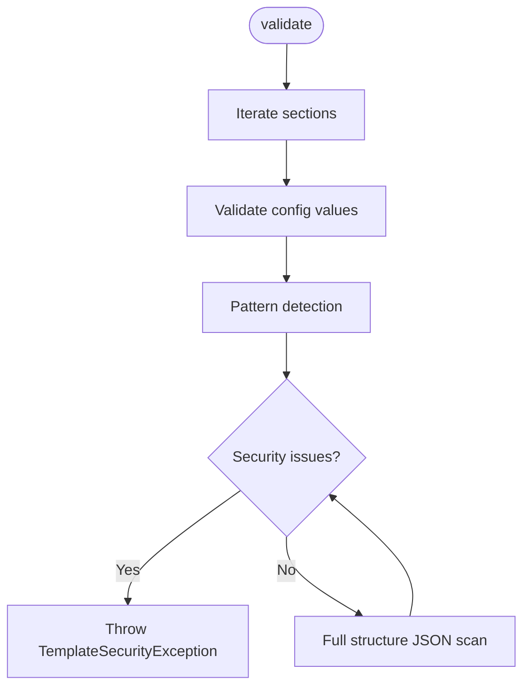
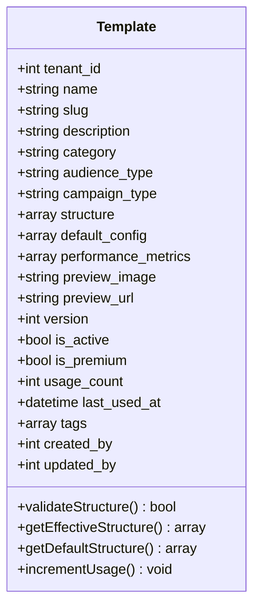
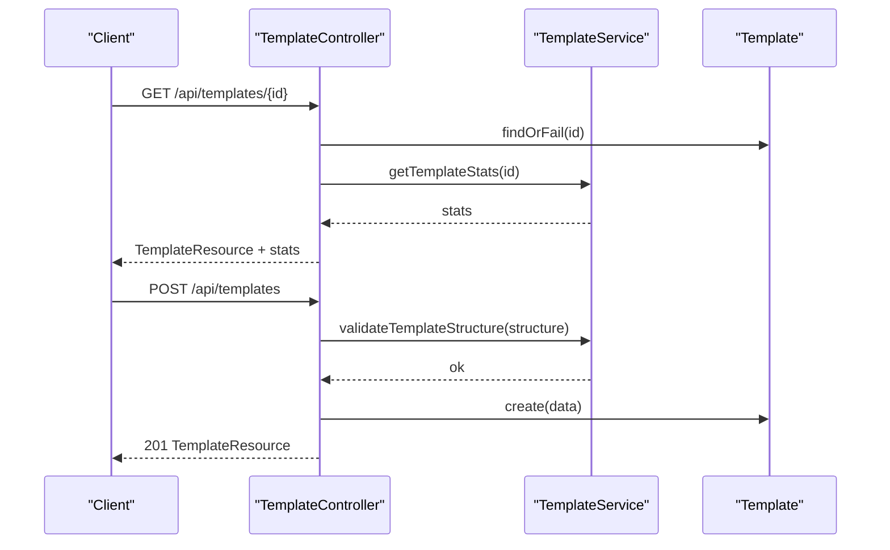
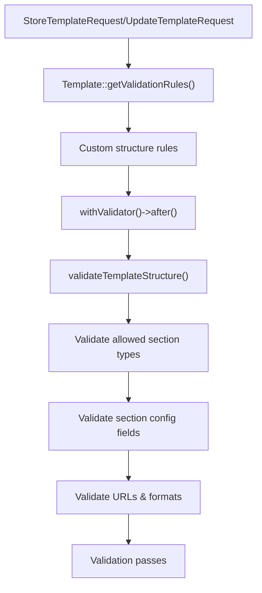
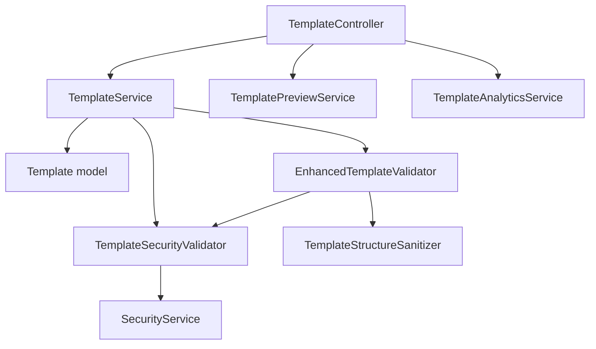

# Template Creation and Validation

<cite>
**Referenced Files in This Document**
- [TemplateService.php](file://app/Services/TemplateService.php)
- [EnhancedTemplateValidator.php](file://app/Services/EnhancedTemplateValidator.php)
- [TemplateSecurityValidator.php](file://app/Services/TemplateSecurityValidator.php)
- [Template.php](file://app/Models/Template.php)
- [LandingPageTemplate.php](file://app/Models/LandingPageTemplate.php)
- [TemplateController.php](file://app/Http/Controllers/Api/TemplateController.php)
- [StoreTemplateRequest.php](file://app/Http/Requests/Api/StoreTemplateRequest.php)
- [UpdateTemplateRequest.php](file://app/Http/Requests/Api/UpdateTemplateRequest.php)
</cite>

## Table of Contents
1. [Introduction](#introduction)
2. [Project Structure](#project-structure)
3. [Core Components](#core-components)
4. [Architecture Overview](#architecture-overview)
5. [Detailed Component Analysis](#detailed-component-analysis)
6. [Dependency Analysis](#dependency-analysis)
7. [Performance Considerations](#performance-considerations)
8. [Troubleshooting Guide](#troubleshooting-guide)
9. [Conclusion](#conclusion)

## Introduction
This document explains the template creation and validation processes in the system. It covers the template structure validation workflow, including JSON schema validation, security checks, and XSS prevention mechanisms. It documents the template creation process from configuration to structured components, category-specific validation rules, and sanitization procedures. It also details the security validation system that prevents malicious content injection, including pattern detection and content sanitization. Practical examples of template validation scenarios, common validation errors, and troubleshooting approaches are included, along with implementation details for template structure configuration, validation rule customization, and security policy enforcement.

## Project Structure
The template system spans models, services, controllers, and requests. The primary components involved in template creation and validation are:
- Template model: Defines structure, categories, and validation rules
- TemplateService: Orchestrates validation, sanitization, and template operations
- EnhancedTemplateValidator: Performs comprehensive schema, accessibility, and performance validation
- TemplateSecurityValidator: Enforces XSS prevention and content security policies
- TemplateController: Handles API endpoints for template CRUD operations
- StoreTemplateRequest/UpdateTemplateRequest: Define validation rules and custom validations for template creation and updates

**Diagram sources**
- [TemplateController.php:103-149](file://app/Http/Controllers/Api/TemplateController.php#L103-L149)
- [TemplateService.php:235-263](file://app/Services/TemplateService.php#L235-L263)
- [EnhancedTemplateValidator.php:76-143](file://app/Services/EnhancedTemplateValidator.php#L76-L143)
- [TemplateSecurityValidator.php:60-85](file://app/Services/TemplateSecurityValidator.php#L60-L85)
- [StoreTemplateRequest.php:26-45](file://app/Http/Requests/Api/StoreTemplateRequest.php#L26-L45)
- [UpdateTemplateRequest.php:26-66](file://app/Http/Requests/Api/UpdateTemplateRequest.php#L26-L66)

**Section sources**
- [TemplateController.php:103-149](file://app/Http/Controllers/Api/TemplateController.php#L103-L149)
- [TemplateService.php:235-263](file://app/Services/TemplateService.php#L235-L263)
- [EnhancedTemplateValidator.php:76-143](file://app/Services/EnhancedTemplateValidator.php#L76-L143)
- [TemplateSecurityValidator.php:60-85](file://app/Services/TemplateSecurityValidator.php#L60-L85)
- [StoreTemplateRequest.php:26-45](file://app/Http/Requests/Api/StoreTemplateRequest.php#L26-L45)
- [UpdateTemplateRequest.php:26-66](file://app/Http/Requests/Api/UpdateTemplateRequest.php#L26-L66)

## Core Components
This section outlines the core components responsible for template creation and validation.

- Template model
  - Maintains template metadata, structure, and validation rules
  - Provides default structures per category and validation helpers
  - Implements tenant scoping for multi-tenancy

- TemplateService
  - Validates template structure via Laravel Validator and custom rules
  - Sanitizes structures using TemplateStructureSanitizer
  - Enforces security checks via TemplateSecurityValidator
  - Supports category-specific validation hooks
  - Manages caching and performance metrics

- EnhancedTemplateValidator
  - Defines schema definitions for common and category-specific sections
  - Validates basic structure, schema compliance, accessibility, and performance
  - Produces detailed validation results with suggestions and warnings

- TemplateSecurityValidator
  - Detects XSS and injection patterns using regex-based checks
  - Validates URLs, file types, and redirects
  - Enforces tenant isolation and logs security events

- TemplateController
  - Coordinates template creation and updates
  - Invokes TemplateService.validateTemplateStructure during store/update
  - Returns structured responses with template data and previews

- StoreTemplateRequest/UpdateTemplateRequest
  - Define base validation rules inherited from Template model
  - Add custom validations for structure format and section types
  - Validate URLs and configuration fields for sections

**Section sources**
- [Template.php:17-60](file://app/Models/Template.php#L17-L60)
- [TemplateService.php:235-263](file://app/Services/TemplateService.php#L235-L263)
- [EnhancedTemplateValidator.php:22-50](file://app/Services/EnhancedTemplateValidator.php#L22-L50)
- [TemplateSecurityValidator.php:25-53](file://app/Services/TemplateSecurityValidator.php#L25-L53)
- [TemplateController.php:103-149](file://app/Http/Controllers/Api/TemplateController.php#L103-L149)
- [StoreTemplateRequest.php:26-45](file://app/Http/Requests/Api/StoreTemplateRequest.php#L26-L45)
- [UpdateTemplateRequest.php:26-66](file://app/Http/Requests/Api/UpdateTemplateRequest.php#L26-L66)

## Architecture Overview
The template creation and validation architecture follows a layered approach:
- API layer: TemplateController handles incoming requests
- Validation layer: StoreTemplateRequest/UpdateTemplateRequest define and enforce validation rules
- Business logic layer: TemplateService orchestrates validation, sanitization, and security checks
- Validation services: EnhancedTemplateValidator and TemplateSecurityValidator provide specialized checks
- Persistence layer: Template model manages data and default structures

**Diagram sources**
- [TemplateController.php:103-121](file://app/Http/Controllers/Api/TemplateController.php#L103-L121)
- [StoreTemplateRequest.php:113-125](file://app/Http/Requests/Api/StoreTemplateRequest.php#L113-L125)
- [TemplateService.php:235-263](file://app/Services/TemplateService.php#L235-L263)
- [EnhancedTemplateValidator.php:76-143](file://app/Services/EnhancedTemplateValidator.php#L76-L143)
- [TemplateSecurityValidator.php:60-85](file://app/Services/TemplateSecurityValidator.php#L60-L85)
- [Template.php:120-124](file://app/Models/Template.php#L120-L124)

## Detailed Component Analysis

### TemplateService: Validation and Orchestration
TemplateService coordinates the validation workflow:
- Structure validation: Uses Laravel Validator with rules for sections, types, and order
- Sanitization: Delegates to TemplateStructureSanitizer
- Security: Delegates to TemplateSecurityValidator
- Category-specific rules: Placeholder for future category-specific validation logic
- Structure creation: Applies configuration overrides to effective structure

**Diagram sources**
- [TemplateService.php:235-263](file://app/Services/TemplateService.php#L235-L263)

**Section sources**
- [TemplateService.php:235-263](file://app/Services/TemplateService.php#L235-L263)

### EnhancedTemplateValidator: Schema and Accessibility Validation
EnhancedTemplateValidator performs comprehensive validation:
- Schema definitions: Common and category-specific section schemas
- Basic structure validation: Required fields and section arrays
- Schema compliance: Max sections, required section types, allowed types
- Accessibility validation: Alt text, semantic structure, keyboard navigation
- Performance validation: Section counts, media optimization suggestions
- Suggestions: Template type suggestions based on content

**Diagram sources**
- [EnhancedTemplateValidator.php:76-143](file://app/Services/EnhancedTemplateValidator.php#L76-L143)

**Section sources**
- [EnhancedTemplateValidator.php:22-50](file://app/Services/EnhancedTemplateValidator.php#L22-L50)
- [EnhancedTemplateValidator.php:148-184](file://app/Services/EnhancedTemplateValidator.php#L148-L184)
- [EnhancedTemplateValidator.php:272-302](file://app/Services/EnhancedTemplateValidator.php#L272-L302)
- [EnhancedTemplateValidator.php:307-343](file://app/Services/EnhancedTemplateValidator.php#L307-L343)
- [EnhancedTemplateValidator.php:348-368](file://app/Services/EnhancedTemplateValidator.php#L348-L368)
- [EnhancedTemplateValidator.php:373-401](file://app/Services/EnhancedTemplateValidator.php#L373-L401)
- [EnhancedTemplateValidator.php:460-492](file://app/Services/EnhancedTemplateValidator.php#L460-L492)

### TemplateSecurityValidator: XSS and Injection Prevention
TemplateSecurityValidator enforces security:
- Pattern detection: Regex-based checks for script tags, event handlers, dangerous hrefs, and more
- Suspicious keywords: Detection of potentially dangerous terms
- Full structure scanning: JSON-encoded structure pattern matching
- Allowed tags/attributes: Whitelist for HTML sanitization
- Comprehensive validation: URL validation, file type checks, tenant isolation, XSS prevention
- Logging: Security events with severity and context

**Diagram sources**
- [TemplateSecurityValidator.php:60-85](file://app/Services/TemplateSecurityValidator.php#L60-L85)
- [TemplateSecurityValidator.php:94-111](file://app/Services/TemplateSecurityValidator.php#L94-L111)
- [TemplateSecurityValidator.php:120-152](file://app/Services/TemplateSecurityValidator.php#L120-L152)
- [TemplateSecurityValidator.php:184-200](file://app/Services/TemplateSecurityValidator.php#L184-L200)

**Section sources**
- [TemplateSecurityValidator.php:25-53](file://app/Services/TemplateSecurityValidator.php#L25-L53)
- [TemplateSecurityValidator.php:60-85](file://app/Services/TemplateSecurityValidator.php#L60-L85)
- [TemplateSecurityValidator.php:120-152](file://app/Services/TemplateSecurityValidator.php#L120-L152)
- [TemplateSecurityValidator.php:184-200](file://app/Services/TemplateSecurityValidator.php#L184-L200)
- [TemplateSecurityValidator.php:252-274](file://app/Services/TemplateSecurityValidator.php#L252-L274)
- [TemplateSecurityValidator.php:305-321](file://app/Services/TemplateSecurityValidator.php#L305-L321)
- [TemplateSecurityValidator.php:341-378](file://app/Services/TemplateSecurityValidator.php#L341-L378)
- [TemplateSecurityValidator.php:470-492](file://app/Services/TemplateSecurityValidator.php#L470-L492)
- [TemplateSecurityValidator.php:532-549](file://app/Services/TemplateSecurityValidator.php#L532-L549)
- [TemplateSecurityValidator.php:666-685](file://app/Services/TemplateSecurityValidator.php#L666-L685)

### Template Model: Structure and Categories
Template model defines:
- Fillable attributes and casts
- Audience types, campaign types, and categories
- Global scopes for tenant isolation
- Slug generation and uniqueness
- Validation rules and unique rules
- Structure validation helpers and default structures per category

**Diagram sources**
- [Template.php:17-60](file://app/Models/Template.php#L17-L60)
- [Template.php:285-324](file://app/Models/Template.php#L285-L324)
- [Template.php:329-344](file://app/Models/Template.php#L329-L344)
- [Template.php:349-373](file://app/Models/Template.php#L349-L373)
- [Template.php:378-509](file://app/Models/Template.php#L378-L509)
- [Template.php:514-519](file://app/Models/Template.php#L514-L519)

**Section sources**
- [Template.php:65-95](file://app/Models/Template.php#L65-L95)
- [Template.php:100-125](file://app/Models/Template.php#L100-L125)
- [Template.php:285-324](file://app/Models/Template.php#L285-L324)
- [Template.php:329-344](file://app/Models/Template.php#L329-L344)
- [Template.php:349-373](file://app/Models/Template.php#L349-L373)
- [Template.php:378-509](file://app/Models/Template.php#L378-L509)
- [Template.php:514-519](file://app/Models/Template.php#L514-L519)

### TemplateController: API Workflow
TemplateController coordinates template operations:
- Index/search/filter templates
- Show template with stats
- Store template with structure validation
- Update template with structure validation
- Preview and responsive rendering
- Activation/deactivation with constraints

**Diagram sources**
- [TemplateController.php:83-95](file://app/Http/Controllers/Api/TemplateController.php#L83-L95)
- [TemplateController.php:103-121](file://app/Http/Controllers/Api/TemplateController.php#L103-L121)

**Section sources**
- [TemplateController.php:42-75](file://app/Http/Controllers/Api/TemplateController.php#L42-L75)
- [TemplateController.php:83-95](file://app/Http/Controllers/Api/TemplateController.php#L83-L95)
- [TemplateController.php:103-121](file://app/Http/Controllers/Api/TemplateController.php#L103-L121)
- [TemplateController.php:130-149](file://app/Http/Controllers/Api/TemplateController.php#L130-L149)

### Request Validation: Store and Update Templates
StoreTemplateRequest and UpdateTemplateRequest define validation rules:
- Base rules from Template model
- Custom structure validation for sections and types
- URL and configuration field validations
- Unique slug handling for updates

**Diagram sources**
- [StoreTemplateRequest.php:26-45](file://app/Http/Requests/Api/StoreTemplateRequest.php#L26-L45)
- [StoreTemplateRequest.php:113-125](file://app/Http/Requests/Api/StoreTemplateRequest.php#L113-L125)
- [StoreTemplateRequest.php:133-166](file://app/Http/Requests/Api/StoreTemplateRequest.php#L133-L166)
- [UpdateTemplateRequest.php:26-66](file://app/Http/Requests/Api/UpdateTemplateRequest.php#L26-L66)
- [UpdateTemplateRequest.php:114-126](file://app/Http/Requests/Api/UpdateTemplateRequest.php#L114-L126)
- [UpdateTemplateRequest.php:134-164](file://app/Http/Requests/Api/UpdateTemplateRequest.php#L134-L164)

**Section sources**
- [StoreTemplateRequest.php:26-45](file://app/Http/Requests/Api/StoreTemplateRequest.php#L26-L45)
- [StoreTemplateRequest.php:113-125](file://app/Http/Requests/Api/StoreTemplateRequest.php#L113-L125)
- [StoreTemplateRequest.php:133-166](file://app/Http/Requests/Api/StoreTemplateRequest.php#L133-L166)
- [UpdateTemplateRequest.php:26-66](file://app/Http/Requests/Api/UpdateTemplateRequest.php#L26-L66)
- [UpdateTemplateRequest.php:114-126](file://app/Http/Requests/Api/UpdateTemplateRequest.php#L114-L126)
- [UpdateTemplateRequest.php:134-164](file://app/Http/Requests/Api/UpdateTemplateRequest.php#L134-L164)

## Dependency Analysis
The template system exhibits clear separation of concerns:
- TemplateController depends on TemplateService, TemplatePreviewService, and TemplateAnalyticsService
- TemplateService depends on Template model, TemplateCacheService, and rendering services
- EnhancedTemplateValidator depends on TemplateStructureSanitizer and TemplateSecurityValidator
- TemplateSecurityValidator integrates with SecurityService and logs events
- Requests depend on Template model for validation rules

**Diagram sources**
- [TemplateController.php:27-34](file://app/Http/Controllers/Api/TemplateController.php#L27-L34)
- [TemplateService.php:28-42](file://app/Services/TemplateService.php#L28-L42)
- [EnhancedTemplateValidator.php:62-66](file://app/Services/EnhancedTemplateValidator.php#L62-L66)
- [TemplateSecurityValidator.php:282-285](file://app/Services/TemplateSecurityValidator.php#L282-L285)

**Section sources**
- [TemplateController.php:27-34](file://app/Http/Controllers/Api/TemplateController.php#L27-L34)
- [TemplateService.php:28-42](file://app/Services/TemplateService.php#L28-L42)
- [EnhancedTemplateValidator.php:62-66](file://app/Services/EnhancedTemplateValidator.php#L62-L66)
- [TemplateSecurityValidator.php:282-285](file://app/Services/TemplateSecurityValidator.php#L282-L285)

## Performance Considerations
- Caching: TemplateService uses cache keys and durations to optimize template retrieval and search results
- Validation timing: EnhancedTemplateValidator tracks validation duration for performance insights
- Section limits: Category-specific max sections reduce rendering overhead
- Media optimization: Performance validation suggests optimizing large images and videos
- Tenant scoping: Global scopes avoid unnecessary queries outside tenant context

[No sources needed since this section provides general guidance]

## Troubleshooting Guide
Common validation errors and resolutions:
- Empty or malformed structure
  - Ensure structure contains required sections array
  - Verify each section has a valid type and configuration
- Invalid section types
  - Use allowed section types per category
  - Check EnhancedTemplateValidator allowed types
- Missing required configuration fields
  - Provide required fields for each section type
  - Validate URLs and formats as per request rules
- Security violations
  - Remove script tags and event handlers
  - Use allowed HTML tags and attributes
  - Ensure tenant isolation and secure URLs
- Performance warnings
  - Reduce number of sections
  - Optimize media assets

Practical examples:
- Hero section requires title
- Image section requires url and alt
- Button section requires text and url
- Video section requires url
- Color fields must be valid hex codes
- Email fields must be valid email addresses

**Section sources**
- [EnhancedTemplateValidator.php:164-173](file://app/Services/EnhancedTemplateValidator.php#L164-L173)
- [EnhancedTemplateValidator.php:234-254](file://app/Services/EnhancedTemplateValidator.php#L234-L254)
- [StoreTemplateRequest.php:177-190](file://app/Http/Requests/Api/StoreTemplateRequest.php#L177-L190)
- [StoreTemplateRequest.php:193-200](file://app/Http/Requests/Api/StoreTemplateRequest.php#L193-L200)
- [UpdateTemplateRequest.php:175-182](file://app/Http/Requests/Api/UpdateTemplateRequest.php#L175-L182)
- [UpdateTemplateRequest.php:191-213](file://app/Http/Requests/Api/UpdateTemplateRequest.php#L191-L213)
- [TemplateSecurityValidator.php:124-151](file://app/Services/TemplateSecurityValidator.php#L124-L151)
- [TemplateSecurityValidator.php:252-274](file://app/Services/TemplateSecurityValidator.php#L252-L274)

## Conclusion
The template creation and validation system combines robust request validation, comprehensive schema and accessibility checks, and strong security measures to ensure safe and reliable template management. The modular design enables extensibility for category-specific rules, performance optimizations, and enhanced security policies. By following the documented workflows and troubleshooting guidance, developers can implement secure and maintainable template systems tailored to various use cases.