# Template Management System

<cite>
**Referenced Files in This Document**
- [Template.php](file://app/Models/Template.php)
- [TemplateService.php](file://app/Services/TemplateService.php)
- [TemplateCacheService.php](file://app/Services/TemplateCacheService.php)
- [TemplatePerformanceMonitor.php](file://app/Services/TemplatePerformanceMonitor.php)
- [TemplatePerformanceOptimizer.php](file://app/Services/TemplatePerformanceOptimizer.php)
- [TemplateStructureSanitizer.php](file://app/Services/TemplateStructureSanitizer.php)
- [TemplateXssPreventionService.php](file://app/Services/TemplateXssPreventionService.php)
- [ComponentService.php](file://app/Services/ComponentService.php)
- [ComponentThemeService.php](file://app/Services/ComponentThemeService.php)
- [MobileTemplateRenderer.php](file://app/Services/MobileTemplateRenderer.php)
- [VariantService.php](file://app/Services/VariantService.php)
- [TemplatePerformanceDashboardService.php](file://app/Services/TemplatePerformanceDashboardService.php)
- [TemplateAnalyticsService.php](file://app/Services/TemplateAnalyticsService.php)
- [TemplatePreviewService.php](file://app/Services/TemplatePreviewService.php)
- [TemplateImportExportService.php](file://app/Services/TemplateImportExportService.php)
- [TemplateSecurityRequest.php](file://app/Http/Requests/Api/TemplateSecurityRequest.php)
- [TemplateSecurityValidator.php](file://app/Services/TemplateSecurityValidator.php)
- [2025_09_05_082500_create_template_ab_tests_table.php](file://database/migrations/2025_09_05_082500_create_template_ab_tests_table.php)
- [cache.php](file://config/cache.php)
</cite>

## Table of Contents
1. [Introduction](#introduction)
2. [Project Structure](#project-structure)
3. [Core Components](#core-components)
4. [Architecture Overview](#architecture-overview)
5. [Detailed Component Analysis](#detailed-component-analysis)
6. [Dependency Analysis](#dependency-analysis)
7. [Performance Considerations](#performance-considerations)
8. [Security Measures](#security-measures)
9. [Component Library System](#component-library-system)
10. [Mobile Rendering System](#mobile-rendering-system)
11. [Template Versioning and A/B Testing](#template-versioning-and-ab-testing)
12. [Performance Monitoring](#performance-monitoring)
13. [Template Creation Workflows](#template-creation-workflows)
14. [Troubleshooting Guide](#troubleshooting-guide)
15. [Conclusion](#conclusion)

## Introduction

The Template Management System is a comprehensive solution for dynamic content creation, mobile rendering, and performance monitoring. This system provides a robust framework for managing templates across multiple categories, implementing advanced caching strategies, ensuring security validation, and enabling real-time performance tracking. The system supports component-based design, mobile-responsive rendering, and sophisticated analytics capabilities.

The platform focuses on four core pillars: **Dynamic Content Creation**, **Mobile Responsiveness**, **Performance Optimization**, and **Security Assurance**. It provides developers and content creators with powerful tools to build, manage, and optimize templates for various use cases including landing pages, email campaigns, and social media content.

## Project Structure

The template management system follows a modular architecture with clear separation of concerns:

```mermaid
graph TB
subgraph "Core Models"
Template[Template Model]
Component[Component Model]
Theme[ComponentTheme Model]
Variant[TemplateVariant Model]
AbTest[TemplateAbTest Model]
end
subgraph "Service Layer"
TemplateService[TemplateService]
ComponentService[ComponentService]
CacheService[TemplateCacheService]
PerformanceMonitor[TemplatePerformanceMonitor]
MobileRenderer[MobileTemplateRenderer]
VariantService[VariantService]
AnalyticsService[TemplateAnalyticsService]
end
subgraph "Security Layer"
SecurityValidator[TemplateSecurityValidator]
XssPrevention[TemplateXssPreventionService]
StructureSanitizer[TemplateStructureSanitizer]
SecurityRequest[TemplateSecurityRequest]
end
subgraph "Performance Layer"
PerformanceOptimizer[TemplatePerformanceOptimizer]
PerformanceDashboard[TemplatePerformanceDashboardService]
PreviewService[TemplatePreviewService]
ImportExportService[TemplateImportExportService]
end
Template --> TemplateService
Component --> ComponentService
Theme --> ComponentService
Variant --> VariantService
AbTest --> VariantService
TemplateService --> CacheService
TemplateService --> PerformanceMonitor
TemplateService --> MobileRenderer
TemplateService --> AnalyticsService
SecurityValidator --> TemplateService
XssPrevention --> TemplateService
StructureSanitizer --> TemplateService
PerformanceOptimizer --> CacheService
PerformanceDashboard --> AnalyticsService
PreviewService --> TemplateService
```

**Diagram sources**
- [Template.php:1-519](file://app/Models/Template.php#L1-L519)
- [TemplateService.php:1-585](file://app/Services/TemplateService.php#L1-L585)
- [ComponentService.php:1-851](file://app/Services/ComponentService.php#L1-L851)

**Section sources**
- [Template.php:1-519](file://app/Models/Template.php#L1-L519)
- [TemplateService.php:1-585](file://app/Services/TemplateService.php#L1-L585)

## Core Components

### Template Management Core

The system centers around the Template model, which serves as the foundation for all template operations. The model implements comprehensive validation, tenant isolation, and performance tracking capabilities.

**Template Categories and Types:**
- **Landing Pages**: Hero sections, forms, statistics
- **Homepage Templates**: Hero, statistics, testimonials
- **Form Templates**: Contact forms, registration forms
- **Email Templates**: Header, content, footer layouts
- **Social Templates**: Image galleries, text content

**Key Features:**
- Multi-tenant isolation with automatic tenant scoping
- Comprehensive validation rules for template structure
- Performance metrics tracking with conversion rate analysis
- Usage statistics with popularity indicators
- Automatic slug generation and uniqueness validation

### Component-Based Design System

The component system provides reusable UI elements with theme support and configuration management.

**Component Categories:**
- **Hero Components**: Headlines, subheadings, CTAs
- **Form Components**: Text inputs, dropdowns, checkboxes
- **Testimonial Components**: Quote displays, author information
- **Statistics Components**: Counters, progress bars, charts
- **CTA Components**: Buttons, links, call-to-action elements
- **Media Components**: Images, videos, galleries

**Component Features:**
- Configurable layouts with validation
- Theme inheritance and customization
- Preview generation with sample data
- Performance optimization with lazy loading
- Accessibility compliance checking

**Section sources**
- [Template.php:65-95](file://app/Models/Template.php#L65-L95)
- [ComponentService.php:338-414](file://app/Services/ComponentService.php#L338-L414)

## Architecture Overview

The template management system implements a layered architecture with clear separation between presentation, business logic, and data persistence layers.

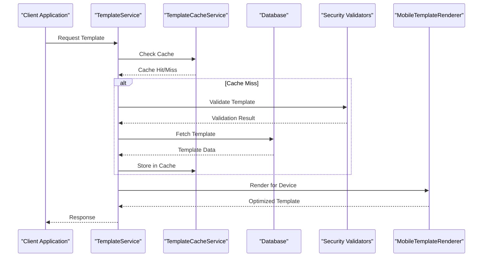

**Diagram sources**
- [TemplateService.php:76-99](file://app/Services/TemplateService.php#L76-L99)
- [TemplateCacheService.php:39-41](file://app/Services/TemplateCacheService.php#L39-L41)
- [MobileTemplateRenderer.php:40-66](file://app/Services/MobileTemplateRenderer.php#L40-L66)

The architecture emphasizes:
- **Caching Strategy**: Multi-level caching with L1/L2/L3 tiers
- **Security Validation**: Comprehensive input sanitization and XSS prevention
- **Mobile Optimization**: Device-specific rendering and responsive design
- **Performance Monitoring**: Real-time metrics and analytics integration

## Detailed Component Analysis

### Template Service Layer

The TemplateService acts as the central orchestrator for all template operations, implementing business logic for template retrieval, validation, and performance optimization.

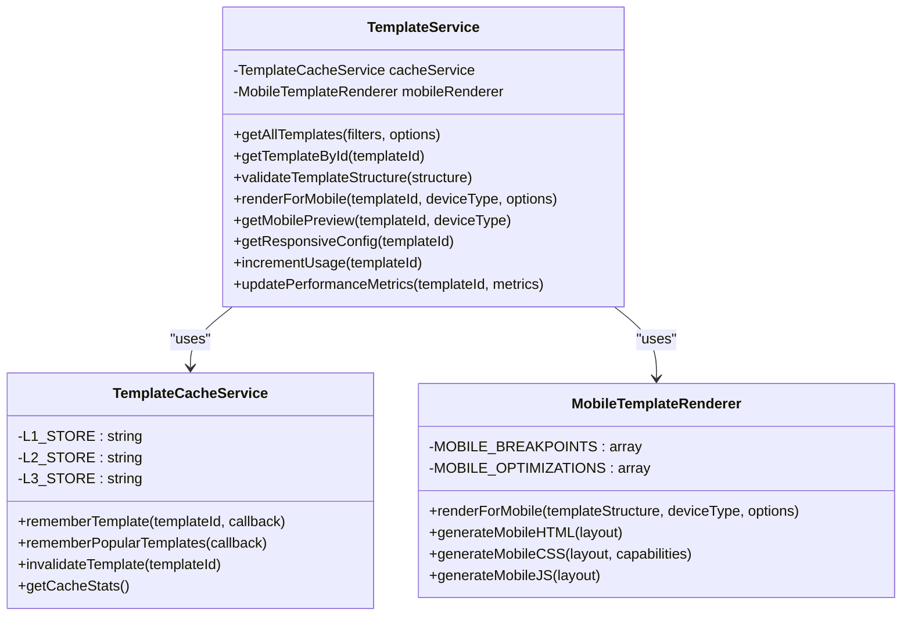

**Diagram sources**
- [TemplateService.php:23-42](file://app/Services/TemplateService.php#L23-L42)
- [TemplateCacheService.php:16-41](file://app/Services/TemplateCacheService.php#L16-L41)
- [MobileTemplateRenderer.php:14-31](file://app/Services/MobileTemplateRenderer.php#L14-L31)

**Key Responsibilities:**
- Template retrieval with caching and tenant isolation
- Structure validation with security checks
- Mobile rendering optimization
- Performance metrics collection and updates
- Analytics event tracking integration

### Security Validation System

The security system implements multiple layers of protection against XSS attacks, input validation, and tenant isolation violations.

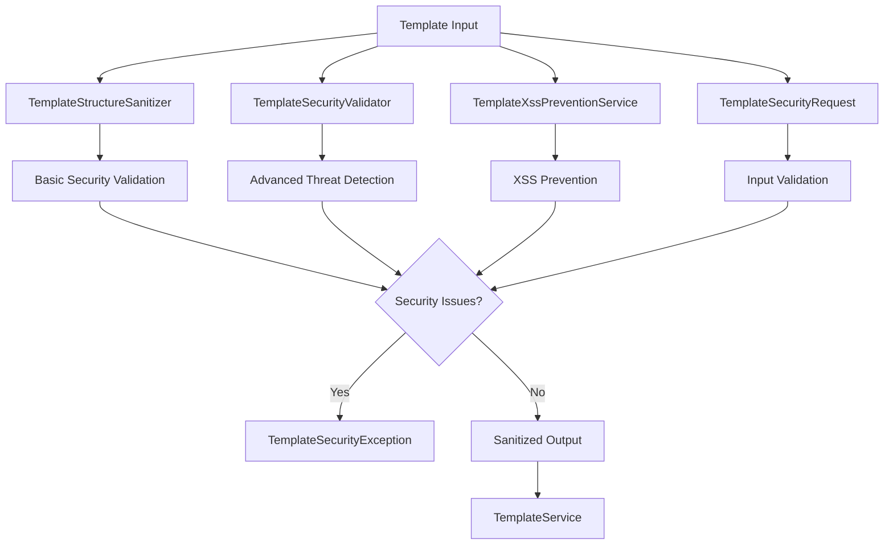

**Diagram sources**
- [TemplateStructureSanitizer.php:29-38](file://app/Services/TemplateStructureSanitizer.php#L29-L38)
- [TemplateSecurityValidator.php:305-321](file://app/Services/TemplateSecurityValidator.php#L305-L321)
- [TemplateXssPreventionService.php:47-71](file://app/Services/TemplateXssPreventionService.php#L47-L71)

**Security Features:**
- Comprehensive XSS prevention with pattern matching
- Input sanitization with HTML entity encoding
- Tenant isolation validation
- Advanced threat detection algorithms
- Security event logging and monitoring

**Section sources**
- [TemplateService.php:235-263](file://app/Services/TemplateService.php#L235-L263)
- [TemplateSecurityValidator.php:298-462](file://app/Services/TemplateSecurityValidator.php#L298-L462)
- [TemplateXssPreventionService.php:15-38](file://app/Services/TemplateXssPreventionService.php#L15-L38)

## Dependency Analysis

The system maintains loose coupling between components through well-defined interfaces and dependency injection patterns.

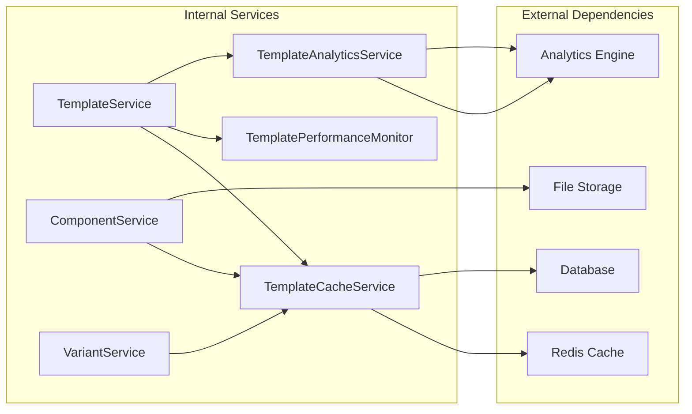

**Diagram sources**
- [TemplateService.php:38-42](file://app/Services/TemplateService.php#L38-L42)
- [TemplateCacheService.php:5-8](file://app/Services/TemplateCacheService.php#L5-L8)

**Dependency Characteristics:**
- **High Cohesion**: Each service has a single responsibility
- **Low Coupling**: Services communicate through well-defined interfaces
- **Testability**: Services are easily mockable for unit testing
- **Extensibility**: New services can be added without modifying existing code

**Section sources**
- [TemplateService.php:1-585](file://app/Services/TemplateService.php#L1-L585)
- [TemplateCacheService.php:1-41](file://app/Services/TemplateCacheService.php#L1-L41)

## Performance Considerations

The system implements comprehensive performance optimization strategies across multiple layers.

### Multi-Level Caching Strategy

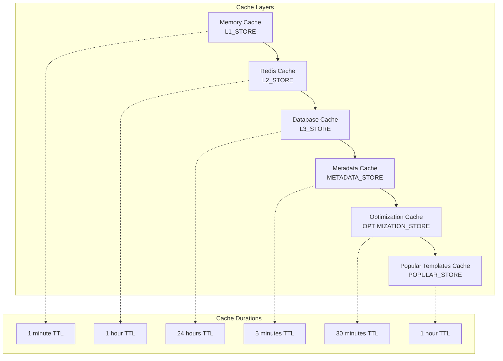

**Diagram sources**
- [TemplateCacheService.php:18-31](file://app/Services/TemplateCacheService.php#L18-L31)
- [cache.php:59-71](file://config/cache.php#L59-L71)

### Performance Monitoring and Analytics

The system provides comprehensive performance monitoring with real-time metrics and historical analysis.

**Performance Metrics Collected:**
- Template rendering time (milliseconds)
- Cache hit ratios
- Memory usage patterns
- Conversion rates and engagement metrics
- Device-specific performance data

**Monitoring Features:**
- Real-time performance dashboards
- Historical trend analysis
- Automated performance alerts
- Bottleneck identification
- Optimization recommendations

**Section sources**
- [TemplatePerformanceMonitor.php:19-28](file://app/Services/TemplatePerformanceMonitor.php#L19-L28)
- [TemplatePerformanceOptimizer.php:49-54](file://app/Services/TemplatePerformanceOptimizer.php#L49-L54)
- [TemplatePerformanceDashboardService.php:25-28](file://app/Services/TemplatePerformanceDashboardService.php#L25-L28)

## Security Measures

The template management system implements defense-in-depth security measures to protect against various attack vectors.

### XSS Prevention and Input Validation

The XSS prevention system employs multiple validation layers:

**Input Validation Pipeline:**
1. **TemplateSecurityRequest**: Basic input validation and sanitization
2. **TemplateSecurityValidator**: Comprehensive security validation with threat detection
3. **TemplateStructureSanitizer**: Recursive structure sanitization
4. **TemplateXssPreventionService**: Advanced XSS prevention with pattern matching

**Security Validation Features:**
- Script tag removal and validation
- Event handler detection and removal
- URL protocol validation
- CSS injection prevention
- Attribute sanitization
- Content security policy enforcement

### Tenant Isolation and Access Control

The system ensures complete tenant isolation through:

**Tenant Scoping:**
- Automatic tenant filtering in all queries
- Tenant ID validation for all operations
- Secure cross-tenant access prevention
- Audit logging for tenant boundary violations

**Access Control Mechanisms:**
- Role-based permissions
- Resource-level access controls
- API endpoint security
- File system access restrictions

**Section sources**
- [TemplateSecurityRequest.php:233-286](file://app/Http/Requests/Api/TemplateSecurityRequest.php#L233-L286)
- [TemplateSecurityValidator.php:328-451](file://app/Services/TemplateSecurityValidator.php#L328-L451)
- [TemplateXssPreventionService.php:81-126](file://app/Services/TemplateXssPreventionService.php#L81-L126)

## Component Library System

The component library system provides a comprehensive framework for reusable UI components with extensive customization options.

### Component Architecture

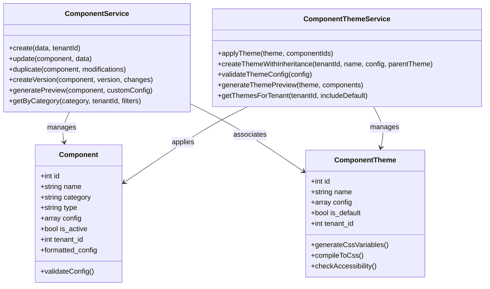

**Diagram sources**
- [ComponentService.php:19-54](file://app/Services/ComponentService.php#L19-L54)
- [ComponentThemeService.php:17-39](file://app/Services/ComponentThemeService.php#L17-L39)

### Theme Management System

The theme system provides comprehensive styling capabilities with accessibility compliance:

**Theme Features:**
- Color scheme management with accessibility validation
- Typography configuration with font management
- Spacing and layout customization
- CSS variable generation for dynamic theming
- Responsive design support
- Accessibility compliance checking

**Theme Validation:**
- Contrast ratio calculations for WCAG compliance
- Color accessibility testing
- Responsive breakpoint validation
- Cross-browser compatibility verification

**Section sources**
- [ComponentService.php:14-158](file://app/Services/ComponentService.php#L14-L158)
- [ComponentThemeService.php:79-118](file://app/Services/ComponentThemeService.php#L79-L118)

## Mobile Rendering System

The mobile rendering system provides comprehensive responsive design capabilities with device-specific optimizations.

### Mobile Rendering Architecture

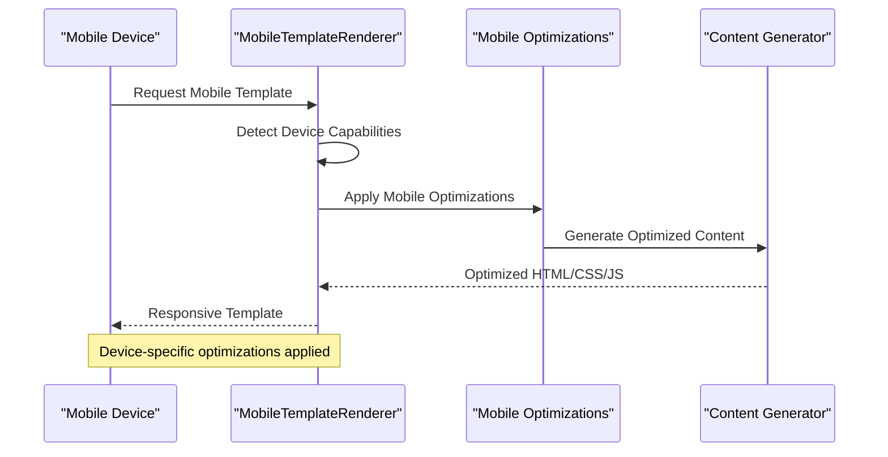

**Diagram sources**
- [MobileTemplateRenderer.php:40-66](file://app/Services/MobileTemplateRenderer.php#L40-L66)
- [TemplateService.php:509-534](file://app/Services/TemplateService.php#L509-L534)

### Mobile Optimization Features

**Device Detection and Capabilities:**
- Touch capability detection
- High DPI support
- Connection type awareness
- Viewport dimension detection
- Accelerometer and sensor availability

**Content Optimizations:**
- Lazy loading for images and media
- Font preloading and optimization
- Critical CSS inlining
- Touch-friendly sizing
- Reduced animations for battery conservation

**Responsive Design Elements:**
- Breakpoint-based layouts
- Flexible grid systems
- Adaptive typography
- Mobile-first design principles
- Gesture-based interactions

**Section sources**
- [MobileTemplateRenderer.php:74-104](file://app/Services/MobileTemplateRenderer.php#L74-L104)
- [TemplateService.php:527-584](file://app/Services/TemplateService.php#L527-L584)

## Template Versioning and A/B Testing

The system provides comprehensive versioning and A/B testing capabilities for template optimization and experimentation.

### A/B Testing Architecture

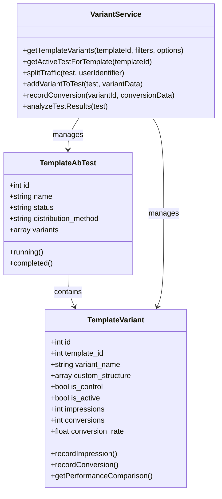

**Diagram sources**
- [VariantService.php:48-81](file://app/Services/VariantService.php#L48-L81)
- [VariantService.php:206-232](file://app/Services/VariantService.php#L206-L232)

### Version Management System

**Version Control Features:**
- Semantic versioning support (x.y.z format)
- Automatic version incrementing
- Change tracking and audit trails
- Rollback capabilities
- Compatibility validation

**Traffic Splitting Algorithms:**
- **Even Distribution**: Consistent hashing for stable assignments
- **Weighted Distribution**: Proportional traffic allocation
- **Random Distribution**: Unbiased random assignment
- **Percentage-Based**: Configurable percentage splits

**Statistical Analysis:**
- Conversion rate comparison
- Confidence interval calculations
- Statistical significance testing
- Win/loss determination
- Performance impact assessment

**Section sources**
- [VariantService.php:90-197](file://app/Services/VariantService.php#L90-L197)
- [2025_09_05_082500_create_template_ab_tests_table.php:59-68](file://database/migrations/2025_09_05_082500_create_template_ab_tests_table.php#L59-L68)

## Performance Monitoring

The performance monitoring system provides comprehensive real-time and historical performance tracking.

### Performance Dashboard Architecture

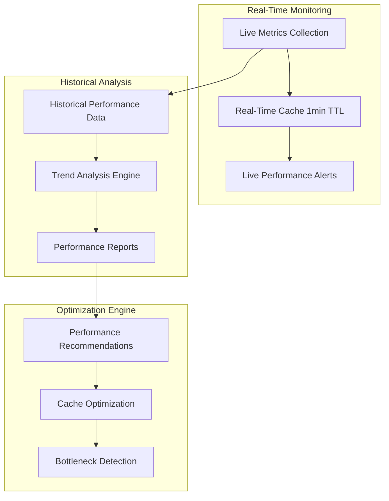

**Diagram sources**
- [TemplatePerformanceDashboardService.php:90-113](file://app/Services/TemplatePerformanceDashboardService.php#L90-L113)
- [TemplatePerformanceMonitor.php:38-56](file://app/Services/TemplatePerformanceMonitor.php#L38-L56)

### Analytics and Reporting

**Analytics Features:**
- Real-time event tracking
- Conversion funnel analysis
- Device and browser breakdown
- Geographic performance tracking
- Custom event definition and tracking

**Reporting Capabilities:**
- Automated performance reports
- Customizable dashboard widgets
- Exportable analytics data
- Historical trend visualization
- Executive summary generation

**Performance Insights:**
- Template performance comparisons
- Engagement pattern analysis
- Conversion optimization suggestions
- Resource utilization tracking
- Scalability performance indicators

**Section sources**
- [TemplatePerformanceDashboardService.php:143-176](file://app/Services/TemplatePerformanceDashboardService.php#L143-L176)
- [TemplateAnalyticsService.php:35-64](file://app/Services/TemplateAnalyticsService.php#L35-L64)

## Template Creation Workflows

The system provides comprehensive template creation workflows with validation, preview, and publishing capabilities.

### Template Creation Workflow

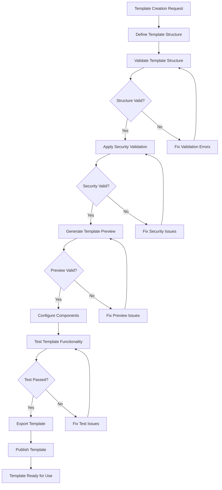

### Component-Based Template Creation

**Component Integration Process:**
1. **Component Selection**: Choose appropriate components for template structure
2. **Configuration**: Customize component settings and appearance
3. **Theme Application**: Apply brand themes and styling
4. **Preview Generation**: Generate live preview with component variations
5. **Validation**: Validate component interactions and responsiveness
6. **Optimization**: Optimize component performance and loading

**Template Validation Workflow:**
- Structure validation against JSON schema
- Security validation for XSS prevention
- Mobile responsiveness testing
- Performance impact assessment
- Cross-browser compatibility verification

**Section sources**
- [TemplatePreviewService.php:45-101](file://app/Services/TemplatePreviewService.php#L45-L101)
- [ComponentService.php:19-85](file://app/Services/ComponentService.php#L19-L85)

## Troubleshooting Guide

### Common Issues and Solutions

**Template Loading Issues:**
- **Symptom**: Templates not loading or displaying errors
- **Causes**: Cache corruption, tenant isolation issues, validation failures
- **Solutions**: Clear template cache, verify tenant context, check validation rules

**Mobile Rendering Problems:**
- **Symptom**: Templates not displaying properly on mobile devices
- **Causes**: Responsive CSS conflicts, device detection failures, optimization issues
- **Solutions**: Verify mobile breakpoints, check device capabilities, review optimization settings

**Performance Degradation:**
- **Symptom**: Slow template loading and poor performance metrics
- **Causes**: Cache misses, inefficient queries, missing optimizations
- **Solutions**: Implement cache warming, optimize database queries, enable performance optimizations

**Security Validation Failures:**
- **Symptom**: Template validation errors or security exceptions
- **Causes**: XSS attempts, invalid input, security policy violations
- **Solutions**: Review security logs, sanitize input data, update validation rules

**A/B Testing Issues:**
- **Symptom**: Traffic not splitting correctly or test results not appearing
- **Causes**: Distribution algorithm errors, user identifier issues, test configuration problems
- **Solutions**: Verify traffic splitting logic, check user identification, validate test setup

**Section sources**
- [TemplateService.php:95-98](file://app/Services/TemplateService.php#L95-L98)
- [TemplatePerformanceMonitor.php:167-187](file://app/Services/TemplatePerformanceMonitor.php#L167-L187)

## Conclusion

The Template Management System provides a comprehensive solution for dynamic content creation, mobile rendering, and performance monitoring. The system's modular architecture, comprehensive security measures, and performance optimization capabilities make it suitable for enterprise-scale template management.

**Key Strengths:**
- **Robust Security**: Multi-layered security validation prevents XSS and other attacks
- **Performance Optimization**: Advanced caching strategies and performance monitoring
- **Mobile Responsiveness**: Comprehensive mobile rendering and optimization
- **Component-Based Design**: Reusable components with extensive customization
- **Analytics and Insights**: Real-time monitoring and performance analysis
- **A/B Testing**: Sophisticated experimentation and optimization capabilities

**Future Enhancement Opportunities:**
- Machine learning-based template optimization
- Advanced personalization and targeting
- Enhanced collaborative editing capabilities
- Integration with external content management systems
- Advanced analytics and predictive modeling

The system's extensible design and comprehensive feature set position it as a strong foundation for building scalable template management solutions across various industries and use cases.