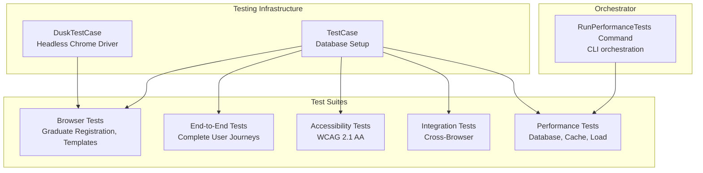
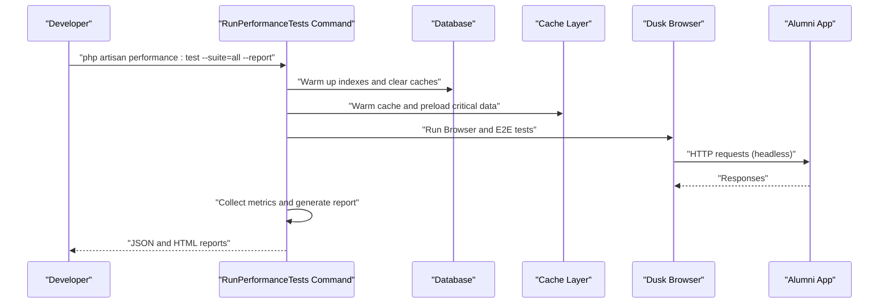
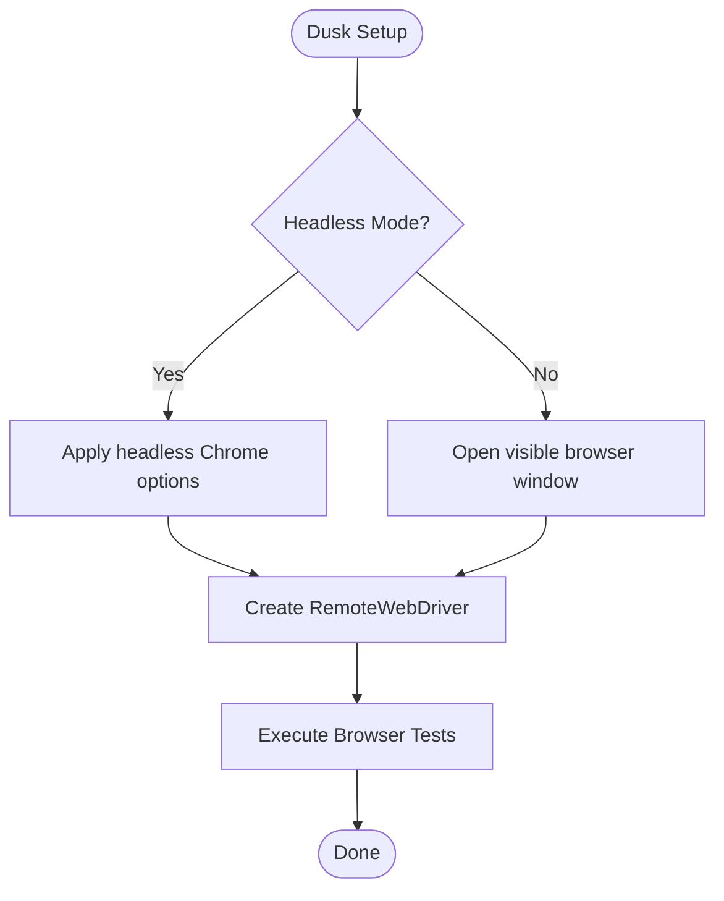
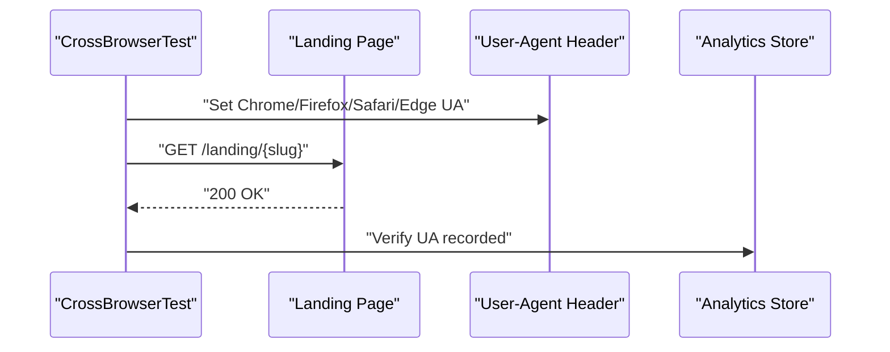
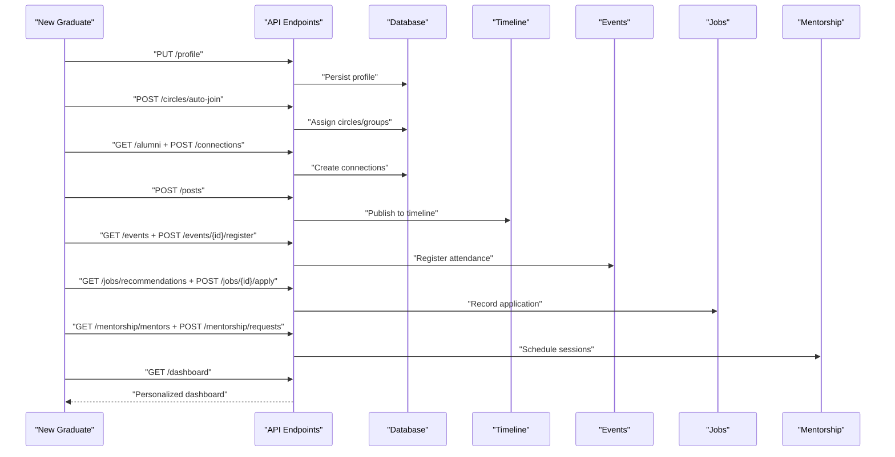
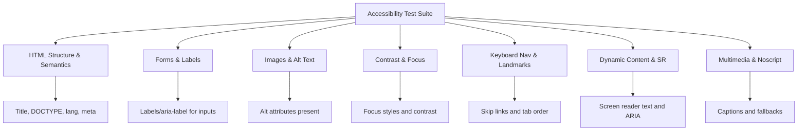
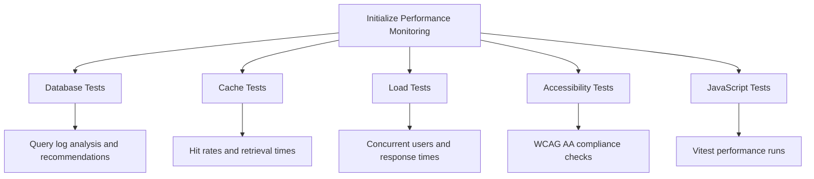
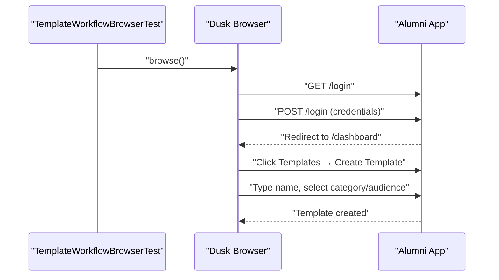
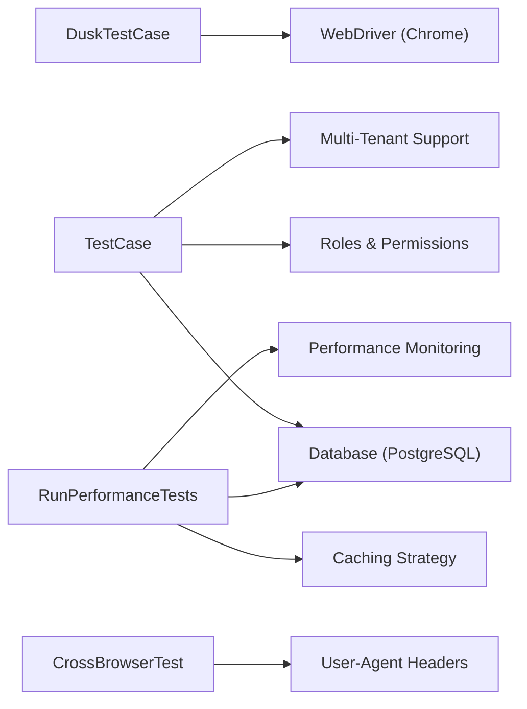

# End-to-End & Performance Testing

<cite>
**Referenced Files in This Document**
- [DuskTestCase.php](file://tests/DuskTestCase.php)
- [TestCase.php](file://tests/TestCase.php)
- [Browser README.md](file://tests/Browser/README.md)
- [CrossBrowserTest.php](file://tests/Integration/CrossBrowserTest.php)
- [TemplateWorkflowBrowserTest.php](file://tests/Browser/TemplateWorkflowBrowserTest.php)
- [CompleteUserJourneyTest.php](file://tests/EndToEnd/CompleteUserJourneyTest.php)
- [WCAGComplianceTest.php](file://tests/Accessibility/WCAGComplianceTest.php)
- [RunPerformanceTests.php](file://app/Console/Commands/RunPerformanceTests.php)
- [DatabasePerformanceTest.php](file://tests/Performance/DatabasePerformanceTest.php)
</cite>

## Table of Contents
1. [Introduction](#introduction)
2. [Project Structure](#project-structure)
3. [Core Components](#core-components)
4. [Architecture Overview](#architecture-overview)
5. [Detailed Component Analysis](#detailed-component-analysis)
6. [Dependency Analysis](#dependency-analysis)
7. [Performance Considerations](#performance-considerations)
8. [Troubleshooting Guide](#troubleshooting-guide)
9. [Conclusion](#conclusion)
10. [Appendices](#appendices)

## Introduction
This document provides comprehensive guidance for end-to-end and performance testing across the Alumni Management System. It explains browser testing with Laravel Dusk (including headless mode and cross-browser validation), performance testing methodologies (load, stress, and scalability), accessibility testing aligned with WCAG 2.1 AA, and performance benchmarking with metrics collection and regression detection. It also includes practical examples of complex user journeys, concurrent scenarios, and resource optimization strategies.

## Project Structure
The testing ecosystem is organized into cohesive categories:
- Browser tests using Laravel Dusk for real user workflows
- End-to-end tests validating complete user journeys
- Accessibility tests enforcing WCAG 2.1 AA
- Integration tests for cross-browser compatibility
- Performance tests covering database, caching, and load scenarios
- A CLI command orchestrating performance test suites and generating reports

**Diagram sources**
- [DuskTestCase.php:10-57](file://tests/DuskTestCase.php#L10-L57)
- [TestCase.php:14-158](file://tests/TestCase.php#L14-L158)
- [RunPerformanceTests.php:43-102](file://app/Console/Commands/RunPerformanceTests.php#L43-L102)

**Section sources**
- [DuskTestCase.php:10-57](file://tests/DuskTestCase.php#L10-L57)
- [TestCase.php:14-158](file://tests/TestCase.php#L14-L158)
- [Browser README.md:1-471](file://tests/Browser/README.md#L1-L471)

## Core Components
- DuskTestCase: Centralized setup for headless Chrome, driver configuration, and optional headful mode via environment flags.
- TestCase: Shared database initialization, role/permission setup, and multi-tenancy support for isolated testing.
- Browser tests: Real user workflows using Laravel Dusk with robust assertions and debugging helpers.
- End-to-end tests: Multi-step journeys spanning profiles, connections, events, jobs, mentorship, and analytics.
- Accessibility tests: Automated checks for semantic HTML, headings, forms, contrast, focus, ARIA, and screen reader compatibility.
- Cross-browser tests: Browser header simulation to validate landing pages across Chrome, Firefox, Safari, and Edge.
- Performance command: Orchestrates database, cache, load, accessibility, and JavaScript performance tests, and generates JSON/HTML reports.

**Section sources**
- [DuskTestCase.php:15-57](file://tests/DuskTestCase.php#L15-L57)
- [TestCase.php:20-158](file://tests/TestCase.php#L20-L158)
- [Browser README.md:45-129](file://tests/Browser/README.md#L45-L129)
- [CrossBrowserTest.php:13-36](file://tests/Integration/CrossBrowserTest.php#L13-L36)
- [RunPerformanceTests.php:43-102](file://app/Console/Commands/RunPerformanceTests.php#L43-L102)

## Architecture Overview
The testing architecture integrates Laravel Dusk for browser automation, Laravel’s base TestCase for database and role scaffolding, and a dedicated CLI command to coordinate performance suites. Cross-browser validation is achieved by simulating user agents, while performance monitoring collects metrics and generates reports.

**Diagram sources**
- [RunPerformanceTests.php:104-118](file://app/Console/Commands/RunPerformanceTests.php#L104-L118)
- [DuskTestCase.php:25-39](file://tests/DuskTestCase.php#L25-L39)
- [DatabasePerformanceTest.php:19-25](file://tests/Performance/DatabasePerformanceTest.php#L19-L25)

## Detailed Component Analysis

### Browser Testing with Laravel Dusk
- Headless mode: Enabled by default with Chrome options including window size and sandbox settings.
- Headful mode: Toggle via environment flags for visual debugging.
- Driver URL: Configured to localhost ChromeDriver port; supports Selenium Grid via environment variable.
- Test execution: Supports parallel processes, timeouts, and custom Chrome arguments.

**Diagram sources**
- [DuskTestCase.php:25-48](file://tests/DuskTestCase.php#L25-L48)
- [Browser README.md:74-128](file://tests/Browser/README.md#L74-L128)

**Section sources**
- [DuskTestCase.php:15-57](file://tests/DuskTestCase.php#L15-L57)
- [Browser README.md:74-128](file://tests/Browser/README.md#L74-L128)

### Cross-Browser Compatibility Validation
- Validates landing pages across Chrome, Firefox, Safari, and Edge by injecting user agent headers.
- Ensures analytics capture reflects the originating browser for tracking and reporting.

**Diagram sources**
- [CrossBrowserTest.php:17-36](file://tests/Integration/CrossBrowserTest.php#L17-L36)

**Section sources**
- [CrossBrowserTest.php:13-36](file://tests/Integration/CrossBrowserTest.php#L13-L36)

### Complex User Journeys (End-to-End)
- New graduate onboarding: profile setup, automatic circle/group assignment, connections, posts, events, job search/applications, mentorship, and analytics.
- Experienced alumni giving back: becoming a mentor, organizing events, sharing content, and accepting requests.
- Cross-platform integration: network-driven job discovery, introductions, and success stories.

**Diagram sources**
- [CompleteUserJourneyTest.php:122-451](file://tests/EndToEnd/CompleteUserJourneyTest.php#L122-L451)

**Section sources**
- [CompleteUserJourneyTest.php:41-451](file://tests/EndToEnd/CompleteUserJourneyTest.php#L41-L451)

### Accessibility Testing (WCAG 2.1 AA)
- Semantic HTML and heading hierarchy validation.
- Form accessibility: labels, ARIA attributes, required indicators.
- Images: alt attributes and meaningful text.
- Color contrast and focus indicators.
- Keyboard navigation and skip links.
- ARIA landmarks and button labeling.
- Dynamic content and screen reader compatibility.
- Multimedia accessibility for virtual events.
- Progressive enhancement and noscript fallbacks.

**Diagram sources**
- [WCAGComplianceTest.php:24-479](file://tests/Accessibility/WCAGComplianceTest.php#L24-L479)

**Section sources**
- [WCAGComplianceTest.php:17-564](file://tests/Accessibility/WCAGComplianceTest.php#L17-L564)

### Performance Testing Methodologies
- Database performance: Large dataset creation, search and matching benchmarks, bulk operations, pagination, and connection pooling.
- Cache performance: Warm-up, retrieval speed, and hit-rate validation.
- Load performance: CLI-driven concurrency and duration configuration.
- Accessibility and JavaScript performance: Integrated via the performance command runner.

**Diagram sources**
- [RunPerformanceTests.php:104-129](file://app/Console/Commands/RunPerformanceTests.php#L104-L129)
- [DatabasePerformanceTest.php:19-369](file://tests/Performance/DatabasePerformanceTest.php#L19-L369)

**Section sources**
- [RunPerformanceTests.php:104-129](file://app/Console/Commands/RunPerformanceTests.php#L104-L129)
- [DatabasePerformanceTest.php:27-369](file://tests/Performance/DatabasePerformanceTest.php#L27-L369)

### Browser Workflow Example: Template Creation Across Browsers
- Demonstrates headless Chrome automation for login and template creation.
- Includes a placeholder for simulating other browsers by overriding navigator.userAgent.

**Diagram sources**
- [TemplateWorkflowBrowserTest.php:403-426](file://tests/Browser/TemplateWorkflowBrowserTest.php#L403-L426)

**Section sources**
- [TemplateWorkflowBrowserTest.php:403-426](file://tests/Browser/TemplateWorkflowBrowserTest.php#L403-L426)

## Dependency Analysis
- DuskTestCase depends on Laravel Dusk and Facebook WebDriver to configure Chrome options and driver creation.
- TestCase initializes PostgreSQL for tests, sets up roles/permissions, and supports multi-tenancy.
- CrossBrowserTest injects user-agent headers to simulate different browsers.
- RunPerformanceTests orchestrates multiple test suites and integrates with caching and database optimization services.

**Diagram sources**
- [DuskTestCase.php:5-39](file://tests/DuskTestCase.php#L5-L39)
- [TestCase.php:32-76](file://tests/TestCase.php#L32-L76)
- [CrossBrowserTest.php:24-34](file://tests/Integration/CrossBrowserTest.php#L24-L34)
- [RunPerformanceTests.php:24-41](file://app/Console/Commands/RunPerformanceTests.php#L24-L41)

**Section sources**
- [DuskTestCase.php:5-39](file://tests/DuskTestCase.php#L5-L39)
- [TestCase.php:32-76](file://tests/TestCase.php#L32-L76)
- [CrossBrowserTest.php:24-34](file://tests/Integration/CrossBrowserTest.php#L24-L34)
- [RunPerformanceTests.php:24-41](file://app/Console/Commands/RunPerformanceTests.php#L24-L41)

## Performance Considerations
- Headless vs. headful: Use headless for CI and parallel runs; enable headful mode for debugging.
- Parallel execution: Leverage Dusk processes flag to speed up large suites.
- Database optimization: Index creation and query logging for performance analysis.
- Caching: Warm caches before tests and measure hit rates and retrieval times.
- Timeouts and waits: Configure appropriate timeouts and explicit waits for asynchronous content.
- Resource cleanup: Clear caches and reset database state between tests.

[No sources needed since this section provides general guidance]

## Troubleshooting Guide
- Chrome/ChromeDriver compatibility: Ensure versions match; use the documented compatibility steps.
- Element not found: Use explicit waits, verify visibility, and refine selectors.
- Database connection issues: Confirm test database configuration and clear caches.
- Timeouts: Increase global timeout, use explicit waits for AJAX, and check external dependencies.
- Flaky tests: Add retries, improve selector specificity, and stabilize environment conditions.
- Visual debugging: Run with visible browser for inspection and capture screenshots on failure.
- Console logs: Retrieve browser and performance logs for diagnostics.

**Section sources**
- [Browser README.md:369-428](file://tests/Browser/README.md#L369-L428)

## Conclusion
The testing framework combines robust browser automation, comprehensive end-to-end workflows, rigorous accessibility validation, and performance orchestration. By leveraging headless Dusk, cross-browser simulation, and CLI-driven performance suites, teams can validate both functional correctness and system performance at scale while maintaining WCAG 2.1 AA compliance.

[No sources needed since this section summarizes without analyzing specific files]

## Appendices

### Practical Examples and Scenarios
- End-to-end: Complete new graduate journey from onboarding to mentorship and event participation.
- Concurrent: Bulk job applications and pagination under load.
- Cross-browser: Landing page rendering and analytics tracking across major browsers.
- Accessibility: Automated checks for headings, forms, contrast, ARIA, and screen reader compatibility.

**Section sources**
- [CompleteUserJourneyTest.php:122-594](file://tests/EndToEnd/CompleteUserJourneyTest.php#L122-L594)
- [DatabasePerformanceTest.php:185-221](file://tests/Performance/DatabasePerformanceTest.php#L185-L221)
- [CrossBrowserTest.php:17-36](file://tests/Integration/CrossBrowserTest.php#L17-L36)
- [WCAGComplianceTest.php:24-479](file://tests/Accessibility/WCAGComplianceTest.php#L24-L479)