# Testing Strategy

<cite>
**Referenced Files in This Document**
- [Pest.php](file://tests/Pest.php)
- [TestCase.php](file://tests/TestCase.php)
- [TestRunner.php](file://tests/TestRunner.php)
- [TestReportGenerator.php](file://tests/TestReportGenerator.php)
- [testing-strategy.md](file://testing-strategy.md)
- [phpunit.xml](file://phpunit.xml)
- [composer.json](file://composer.json)
- [package.json](file://package.json)
- [vitest.config.ts](file://vitest.config.ts)
- [vite.config.ts](file://vite.config.ts)
</cite>

## Table of Contents
1. [Introduction](#introduction)
2. [Project Structure](#project-structure)
3. [Core Components](#core-components)
4. [Architecture Overview](#architecture-overview)
5. [Detailed Component Analysis](#detailed-component-analysis)
6. [Dependency Analysis](#dependency-analysis)
7. [Performance Considerations](#performance-considerations)
8. [Troubleshooting Guide](#troubleshooting-guide)
9. [Conclusion](#conclusion)
10. [Appendices](#appendices)

## Introduction
This document defines the comprehensive testing strategy for the platform, covering unit, integration, feature, end-to-end, performance, and security testing. It explains how Pest PHP, Laravel feature tests, and Vitest are used for backend and frontend component testing, respectively. It documents test organization, best practices around factories and seeders, continuous integration and automated execution, coverage reporting, debugging tools, and performance benchmarking. Practical examples are linked via file references to real implementations in the repository.

## Project Structure
The testing suite is organized into distinct categories aligned with the testing pyramid:
- Unit tests: Focused on models, services, and pure functions
- Integration tests: Validate API endpoints and database interactions
- Feature tests: Behavioral tests for major workflows
- End-to-end tests: Browser automation for user journeys
- Performance tests: Load, stress, and resource usage validations
- Security tests: Authentication, authorization, and vulnerability checks
- Accessibility tests: WCAG and compliance validations

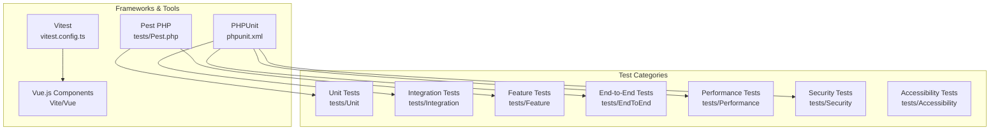

**Diagram sources**
- [Pest.php:14-16](file://tests/Pest.php#L14-L16)
- [phpunit.xml:10-29](file://phpunit.xml#L10-L29)
- [vitest.config.ts:5-11](file://vitest.config.ts#L5-L11)

**Section sources**
- [phpunit.xml:10-29](file://phpunit.xml#L10-L29)
- [composer.json:32-33](file://composer.json#L32-L33)
- [package.json:11](file://package.json#L11)

## Core Components
- Centralized Laravel test base class initializes database, roles/permissions, optional tenancy, and reusable assertions/helpers.
- Pest configuration extends the base test case and applies database refresh for feature tests.
- A dedicated test runner aggregates results across categories and generates a consolidated report.
- A report generator analyzes coverage and produces structured JSON reports for CI dashboards.
- Frontend testing uses Vitest with jsdom and Vue plugin for component-level tests.

**Section sources**
- [TestCase.php:14-158](file://tests/TestCase.php#L14-L158)
- [Pest.php:14-16](file://tests/Pest.php#L14-L16)
- [TestRunner.php:7-55](file://tests/TestRunner.php#L7-L55)
- [TestReportGenerator.php:21-38](file://tests/TestReportGenerator.php#L21-L38)
- [vitest.config.ts:5-11](file://vitest.config.ts#L5-L11)

## Architecture Overview
The testing architecture integrates Pest and PHPUnit for backend, Vitest for frontend, and a reporting pipeline for insights and CI.

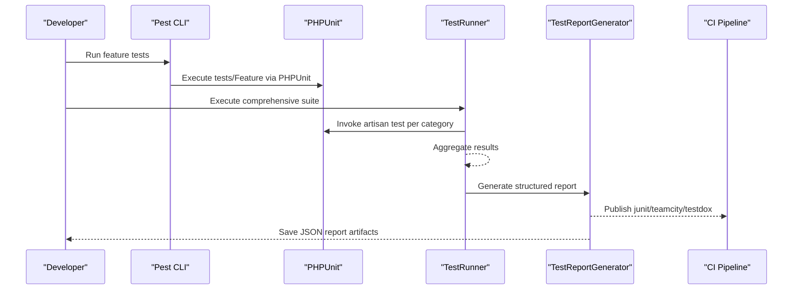

**Diagram sources**
- [Pest.php:14-16](file://tests/Pest.php#L14-L16)
- [phpunit.xml:10-29](file://phpunit.xml#L10-L29)
- [TestRunner.php:39](file://tests/TestRunner.php#L39)
- [TestReportGenerator.php:359-374](file://tests/TestReportGenerator.php#L359-L374)

## Detailed Component Analysis

### Pest PHP Configuration and Usage
- Extends the shared Laravel test base and enables database refresh for feature tests.
- Provides expectation extensions and global helpers for concise assertions.

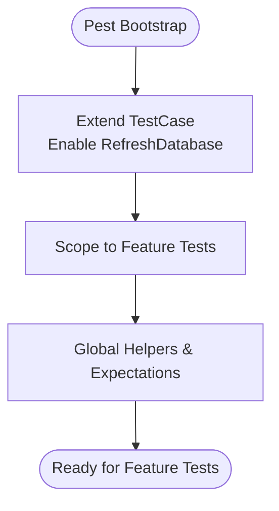

**Diagram sources**
- [Pest.php:14-16](file://tests/Pest.php#L14-L16)
- [Pest.php:29-31](file://tests/Pest.php#L29-L31)

**Section sources**
- [Pest.php:14-16](file://tests/Pest.php#L14-L16)
- [Pest.php:29-31](file://tests/Pest.php#L29-L31)

### Laravel Feature Testing Patterns
- Uses the shared test base to set up roles, permissions, and optional tenancy.
- Demonstrates authenticated requests, tenant isolation, validation, and JSON responses.

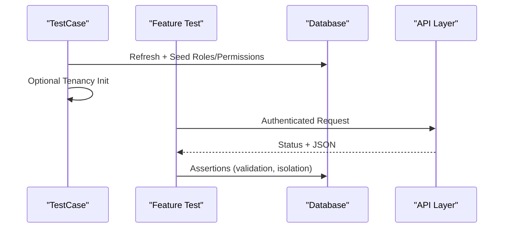

**Diagram sources**
- [TestCase.php:20-76](file://tests/TestCase.php#L20-L76)
- [TestCase.php:118-147](file://tests/TestCase.php#L118-L147)

**Section sources**
- [TestCase.php:20-76](file://tests/TestCase.php#L20-L76)
- [TestCase.php:118-147](file://tests/TestCase.php#L118-L147)

### Vitest for Vue.js Component Testing
- Configured with jsdom environment and Vue plugin for DOM rendering.
- Aliased module resolution supports component library imports.
- Scripts enable running component tests and UI mode.

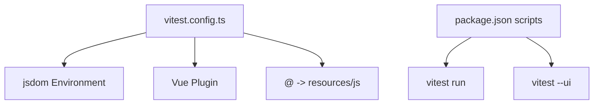

**Diagram sources**
- [vitest.config.ts:5-17](file://vitest.config.ts#L5-L17)
- [package.json:11-15](file://package.json#L11-L15)

**Section sources**
- [vitest.config.ts:5-17](file://vitest.config.ts#L5-L17)
- [package.json:11-15](file://package.json#L11-L15)

### Test Organization and Categories
- PHPUnit test suites define categories for Unit, Feature, Integration, Performance, Security, and EndToEnd.
- Pest scopes feature tests to the Feature directory automatically.

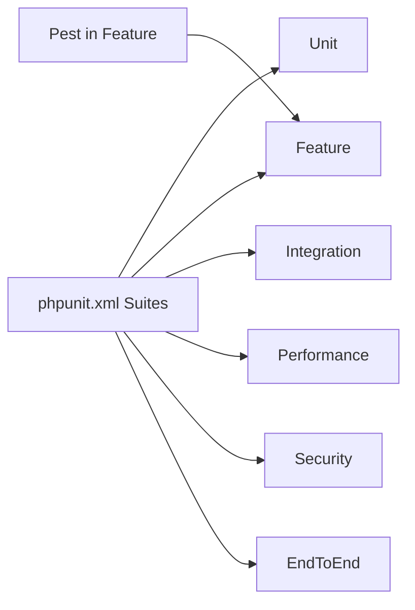

**Diagram sources**
- [phpunit.xml:10-29](file://phpunit.xml#L10-L29)
- [Pest.php:14-16](file://tests/Pest.php#L14-L16)

**Section sources**
- [phpunit.xml:10-29](file://phpunit.xml#L10-L29)
- [Pest.php:14-16](file://tests/Pest.php#L14-L16)

### Test Data Management: Factories and Seeders
- Factories are used extensively in tests to create deterministic records.
- The shared test base seeds roles and permissions for authorization scenarios.
- Tenancy initialization ensures tenant-scoped isolation in tests.

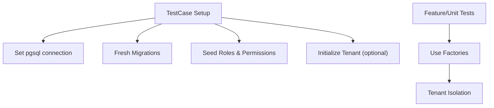

**Diagram sources**
- [TestCase.php:32-76](file://tests/TestCase.php#L32-L76)

**Section sources**
- [TestCase.php:32-76](file://tests/TestCase.php#L32-L76)

### Continuous Integration and Automated Execution
- Composer script delegates to Artisan test command for unified execution.
- A custom TestRunner executes targeted categories and aggregates results.
- Reports are persisted for CI consumption.

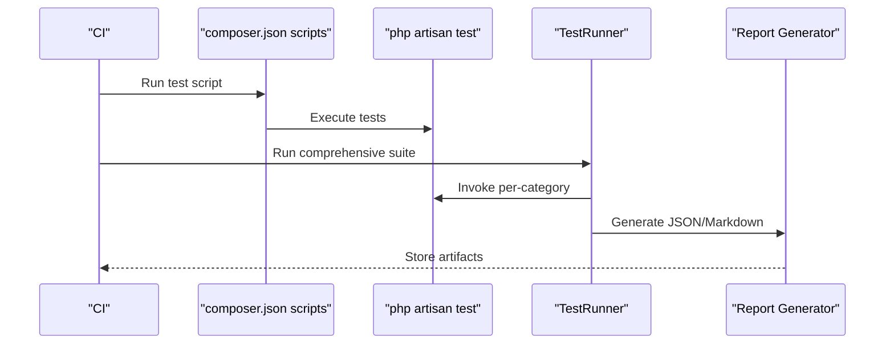

**Diagram sources**
- [composer.json:72-75](file://composer.json#L72-L75)
- [TestRunner.php:39](file://tests/TestRunner.php#L39)
- [TestReportGenerator.php:359-374](file://tests/TestReportGenerator.php#L359-L374)

**Section sources**
- [composer.json:72-75](file://composer.json#L72-L75)
- [TestRunner.php:39](file://tests/TestRunner.php#L39)
- [TestReportGenerator.php:359-374](file://tests/TestReportGenerator.php#L359-L374)

### Test Coverage Reporting
- PHPUnit configured to emit JUnit, TeamCity, and testdox outputs.
- A report generator reads coverage XML and produces structured JSON reports with recommendations.

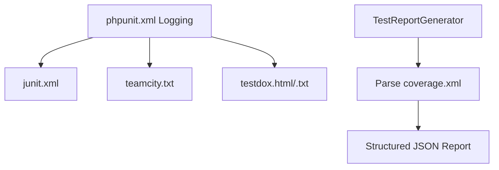

**Diagram sources**
- [phpunit.xml:58-63](file://phpunit.xml#L58-L63)
- [TestReportGenerator.php:196-215](file://tests/TestReportGenerator.php#L196-L215)

**Section sources**
- [phpunit.xml:58-63](file://phpunit.xml#L58-L63)
- [TestReportGenerator.php:196-215](file://tests/TestReportGenerator.php#L196-L215)

### Debugging Tools and Utilities
- Shared assertions for validation errors, success/redirect responses simplify assertions.
- Helper methods for role-based actors streamline authorization tests.
- Vite/Vitest support for frontend debugging and UI mode.

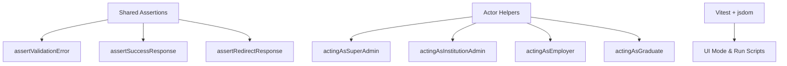

**Diagram sources**
- [TestCase.php:134-147](file://tests/TestCase.php#L134-L147)
- [TestCase.php:86-116](file://tests/TestCase.php#L86-L116)
- [package.json:11-15](file://package.json#L11-L15)

**Section sources**
- [TestCase.php:134-147](file://tests/TestCase.php#L134-L147)
- [TestCase.php:86-116](file://tests/TestCase.php#L86-L116)
- [package.json:11-15](file://package.json#L11-L15)

### Performance Benchmarking
- Dedicated Performance category with placeholders for load/stress/memory tests.
- Vite/Vitest scripts enable performance-oriented test runs and optional Lighthouse reporting.

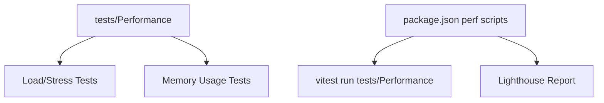

**Diagram sources**
- [package.json:19-20](file://package.json#L19-L20)

**Section sources**
- [package.json:19-20](file://package.json#L19-L20)

## Dependency Analysis
- Backend testing depends on Pest and PHPUnit, with Pest extending the Laravel base test case.
- Frontend testing depends on Vitest and Vue plugin, with jsdom environment.
- Composer and package scripts orchestrate test execution and artifact generation.

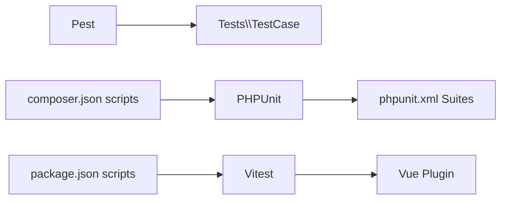

**Diagram sources**
- [Pest.php:14-16](file://tests/Pest.php#L14-L16)
- [phpunit.xml:10-29](file://phpunit.xml#L10-L29)
- [vitest.config.ts:5-11](file://vitest.config.ts#L5-L11)
- [composer.json:72-75](file://composer.json#L72-L75)
- [package.json:11](file://package.json#L11)

**Section sources**
- [Pest.php:14-16](file://tests/Pest.php#L14-L16)
- [phpunit.xml:10-29](file://phpunit.xml#L10-L29)
- [vitest.config.ts:5-11](file://vitest.config.ts#L5-L11)
- [composer.json:72-75](file://composer.json#L72-L75)
- [package.json:11](file://package.json#L11)

## Performance Considerations
- Use database refresh judiciously; prefer lightweight factories and targeted migrations.
- Separate heavy performance tests from unit/integration suites to avoid CI timeouts.
- Leverage Vite/Vitest caching and chunking for frontend test builds.
- Keep assertion counts reasonable; prefer focused tests to maintain fast feedback loops.

## Troubleshooting Guide
- Database connectivity: Ensure PostgreSQL connection settings align with the test environment.
- Pest vs PHPUnit: Feature tests run via Pest, while other categories run via PHPUnit; confirm suite mappings.
- Coverage parsing: Verify coverage XML exists before parsing; otherwise, the generator reports an error.
- Tenancy: When tenancy is enabled in tests, ensure proper initialization and teardown.

**Section sources**
- [phpunit.xml:39-57](file://phpunit.xml#L39-L57)
- [Pest.php:14-16](file://tests/Pest.php#L14-L16)
- [TestReportGenerator.php:200-202](file://tests/TestReportGenerator.php#L200-L202)
- [TestCase.php:62-76](file://tests/TestCase.php#L62-L76)

## Conclusion
The testing strategy leverages Pest for expressive feature tests, PHPUnit for broader categories, and Vitest for Vue component tests. The shared Laravel test base centralizes setup, roles/permissions, and tenancy. A robust reporting pipeline and CI-friendly scripts enable automated execution and insights. Adhering to factory-driven data management and role-based actor helpers ensures reliable, maintainable tests across the stack.

## Appendices

### Practical Examples Index
- Unit model/service examples: See [testing-strategy.md](file://testing-strategy.md) for representative unit test patterns.
- Integration API/database examples: See [testing-strategy.md](file://testing-strategy.md) for feature test patterns.
- End-to-end browser workflows: See [testing-strategy.md](file://testing-strategy.md) for Dusk-based journey tests.
- Performance and security tests: See [testing-strategy.md](file://testing-strategy.md) for placeholders and guidance.

**Section sources**
- [testing-strategy.md:1-123](file://testing-strategy.md#L1-L123)
- [testing-strategy.md:477-565](file://testing-strategy.md#L477-L565)
- [testing-strategy.md:617-727](file://testing-strategy.md#L617-L727)
- [testing-strategy.md:729-770](file://testing-strategy.md#L729-L770)
- [testing-strategy.md:772-800](file://testing-strategy.md#L772-L800)