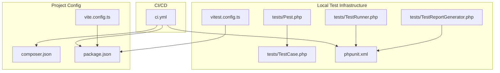
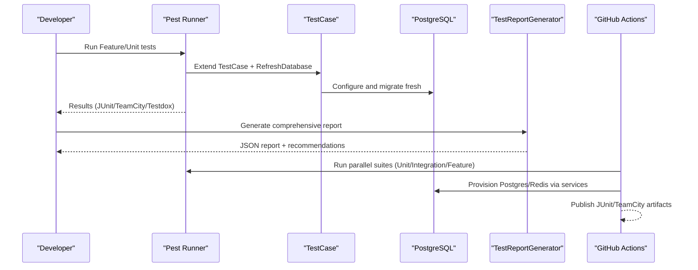
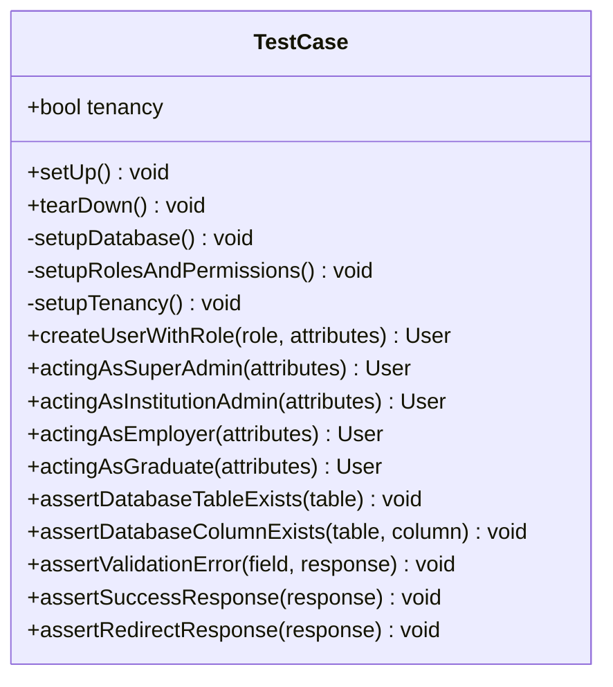
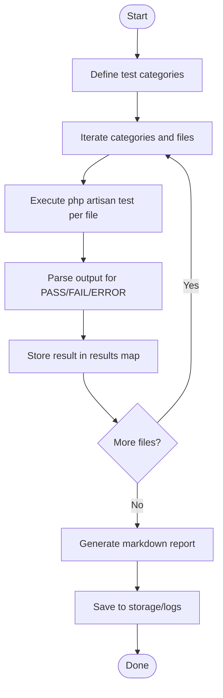
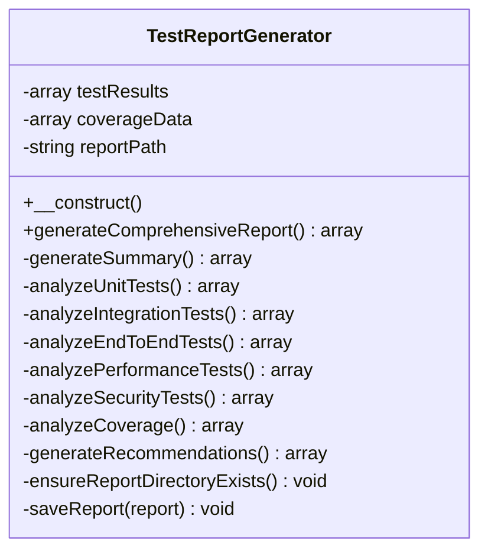
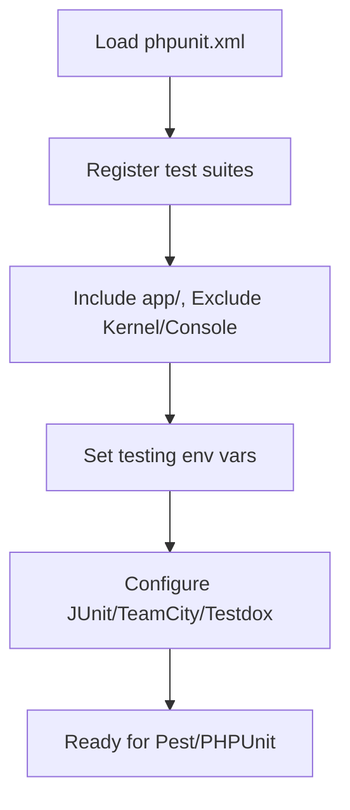
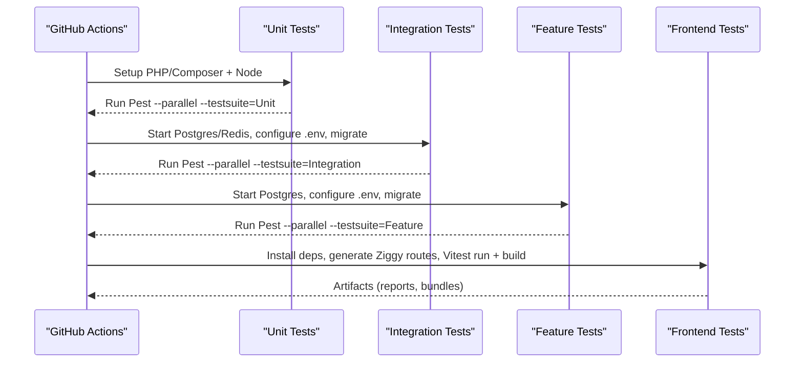
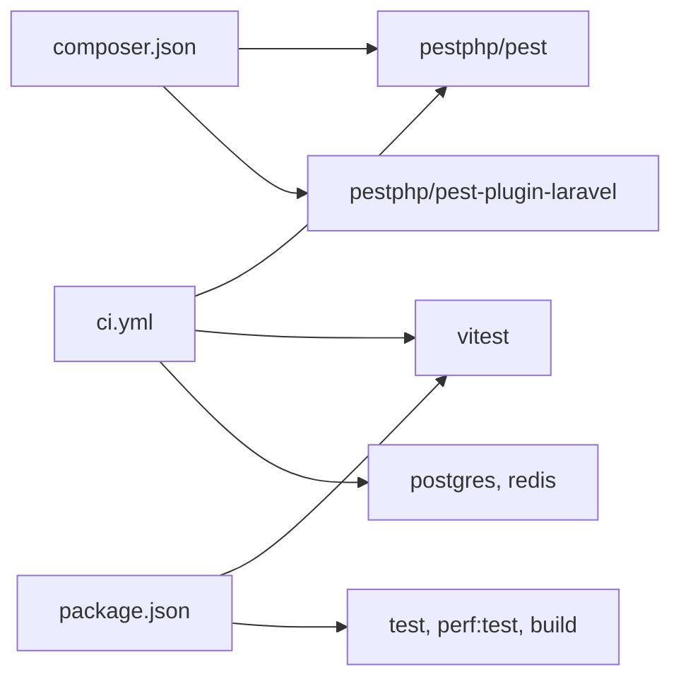

# Testing Utilities & Best Practices

<cite>
**Referenced Files in This Document**
- [TestCase.php](file://tests/TestCase.php)
- [TestRunner.php](file://tests/TestRunner.php)
- [TestReportGenerator.php](file://tests/TestReportGenerator.php)
- [phpunit.xml](file://phpunit.xml)
- [ci.yml](file://.github/workflows/ci.yml)
- [composer.json](file://composer.json)
- [package.json](file://package.json)
- [Pest.php](file://tests/Pest.php)
- [README.md](file://tests/README.md)
- [vitest.config.ts](file://vitest.config.ts)
- [vite.config.ts](file://vite.config.ts)
</cite>

## Table of Contents
1. [Introduction](#introduction)
2. [Project Structure](#project-structure)
3. [Core Components](#core-components)
4. [Architecture Overview](#architecture-overview)
5. [Detailed Component Analysis](#detailed-component-analysis)
6. [Dependency Analysis](#dependency-analysis)
7. [Performance Considerations](#performance-considerations)
8. [Troubleshooting Guide](#troubleshooting-guide)
9. [Conclusion](#conclusion)
10. [Appendices](#appendices)

## Introduction
This document consolidates testing utilities and best practices for the Alumate project’s test infrastructure, automation, and quality assurance. It explains test runner configuration, parallel execution setup, and CI/CD integration patterns. It documents test data management via factories and database refresh strategies, test environment setup, reporting and coverage analysis, debugging and profiling techniques, and test maintenance practices. It also outlines continuous integration setup, automated test execution, and artifact management, along with performance optimization and resource cleanup strategies.

## Project Structure
The testing ecosystem is organized around:
- A shared base test case for database setup, role/permission initialization, and reusable helpers
- A test runner that orchestrates suites and generates human-readable reports
- A comprehensive report generator that analyzes coverage and quality metrics
- PHPUnit configuration for test suites, logging, and environment variables
- GitHub Actions workflows for linting, unit/integration/feature/frontend jobs, and parallelized execution
- Pest configuration extending the base test case and enabling RefreshDatabase for Feature tests
- Frontend Vitest configuration for Vue/JS testing

**Diagram sources**
- [TestCase.php:14-158](file://tests/TestCase.php#L14-L158)
- [TestRunner.php:1-148](file://tests/TestRunner.php#L1-L148)
- [TestReportGenerator.php:1-642](file://tests/TestReportGenerator.php#L1-L642)
- [phpunit.xml:1-65](file://phpunit.xml#L1-L65)
- [.github/workflows/ci.yml:1-280](file://.github/workflows/ci.yml#L1-L280)
- [composer.json:1-94](file://composer.json#L1-L94)
- [package.json:1-90](file://package.json#L1-L90)
- [Pest.php:1-48](file://tests/Pest.php#L1-L48)
- [vitest.config.ts:1-17](file://vitest.config.ts#L1-L17)
- [vite.config.ts:1-163](file://vite.config.ts#L1-L163)

**Section sources**
- [README.md:1-237](file://tests/README.md#L1-L237)
- [phpunit.xml:10-29](file://phpunit.xml#L10-L29)
- [.github/workflows/ci.yml:54-234](file://.github/workflows/ci.yml#L54-L234)
- [composer.json:24-34](file://composer.json#L24-L34)
- [package.json:4-21](file://package.json#L4-L21)

## Core Components
- Shared base test case initializes PostgreSQL for tests, migrates fresh when needed, seeds roles/permissions, supports multi-tenant setup, and provides helper methods for assertions and user role fixtures.
- Test runner executes categorized suites, aggregates pass/fail/error outcomes, and produces markdown reports.
- Report generator compiles summary statistics, counts tests across categories, extracts coverage metadata, and provides recommendations.
- PHPUnit configuration defines test suites, source inclusion/exclusion, environment variables, and logging outputs.
- CI workflows orchestrate linting, unit, integration, feature, and frontend jobs, including parallel execution and Docker-managed services.
- Pest configuration extends the base test case and enables RefreshDatabase for Feature tests.
- Vitest configuration sets up jsdom environment, global setup files, and aliases for frontend testing.

**Section sources**
- [TestCase.php:14-158](file://tests/TestCase.php#L14-L158)
- [TestRunner.php:7-55](file://tests/TestRunner.php#L7-L55)
- [TestReportGenerator.php:21-38](file://tests/TestReportGenerator.php#L21-L38)
- [phpunit.xml:10-63](file://phpunit.xml#L10-L63)
- [.github/workflows/ci.yml:54-234](file://.github/workflows/ci.yml#L54-L234)
- [Pest.php:14-16](file://tests/Pest.php#L14-L16)
- [vitest.config.ts:5-17](file://vitest.config.ts#L5-L17)

## Architecture Overview
The testing architecture integrates local and CI-driven workflows:
- Local execution uses Pest with PHPUnit under the hood, leveraging the base test case and optional coverage via Xdebug.
- CI runs parallelized suites with Dockerized services (Postgres, Redis) for integration/feature tests.
- Reports are generated locally and persisted as artifacts in CI for traceability.

**Diagram sources**
- [Pest.php:14-16](file://tests/Pest.php#L14-L16)
- [TestCase.php:20-42](file://tests/TestCase.php#L20-L42)
- [TestReportGenerator.php:21-38](file://tests/TestReportGenerator.php#L21-L38)
- [.github/workflows/ci.yml:54-234](file://.github/workflows/ci.yml#L54-L234)

## Detailed Component Analysis

### Base Test Case: TestCase
- Responsibilities:
  - Database setup switching to PostgreSQL for tests and migrating fresh when needed
  - Role and permission seeding for super-admin, institution-admin, employer, graduate
  - Multi-tenant initialization for tenant-scoped tests
  - Helper methods for user creation with roles and acting-as convenience methods
  - Assertion helpers for database existence and HTTP response semantics
  - Proper teardown to end tenant lifecycle

**Diagram sources**
- [TestCase.php:14-158](file://tests/TestCase.php#L14-L158)

**Section sources**
- [TestCase.php:20-76](file://tests/TestCase.php#L20-L76)
- [TestCase.php:78-116](file://tests/TestCase.php#L78-L116)
- [TestCase.php:118-147](file://tests/TestCase.php#L118-L147)
- [TestCase.php:149-156](file://tests/TestCase.php#L149-L156)

### Test Runner: TestRunner
- Responsibilities:
  - Orchestrates a curated set of test categories (Feature, End-to-End, Performance, Accessibility, Integration)
  - Executes individual test files via artisan test with stop-on-failure behavior
  - Aggregates results and generates a markdown report with counts and summaries
  - Saves a timestamped report to storage/logs

**Diagram sources**
- [TestRunner.php:7-55](file://tests/TestRunner.php#L7-L55)
- [TestRunner.php:57-146](file://tests/TestRunner.php#L57-L146)

**Section sources**
- [TestRunner.php:7-55](file://tests/TestRunner.php#L7-L55)
- [TestRunner.php:57-146](file://tests/TestRunner.php#L57-L146)

### Report Generator: TestReportGenerator
- Responsibilities:
  - Generates a comprehensive JSON report with summary, unit/integration/e2e/performance/security analyses
  - Parses coverage XML when present and extracts coverage metrics
  - Provides recommendations based on thresholds for coverage, performance, security, and integration ratios
  - Ensures report directory exists and persists latest and timestamped reports

**Diagram sources**
- [TestReportGenerator.php:7-642](file://tests/TestReportGenerator.php#L7-L642)

**Section sources**
- [TestReportGenerator.php:21-38](file://tests/TestReportGenerator.php#L21-L38)
- [TestReportGenerator.php:196-215](file://tests/TestReportGenerator.php#L196-L215)
- [TestReportGenerator.php:217-267](file://tests/TestReportGenerator.php#L217-L267)
- [TestReportGenerator.php:359-374](file://tests/TestReportGenerator.php#L359-L374)

### PHPUnit Configuration
- Defines five test suites (Unit, Feature, Integration, Performance, Security, EndToEnd)
- Includes application source directories and excludes console commands and kernel
- Sets environment variables for testing (memory limit, cache, queues, sessions, DB connection, tenancy flag)
- Configures logging to JUnit, TeamCity, and testdox outputs

**Diagram sources**
- [phpunit.xml:10-63](file://phpunit.xml#L10-L63)

**Section sources**
- [phpunit.xml:10-29](file://phpunit.xml#L10-L29)
- [phpunit.xml:30-38](file://phpunit.xml#L30-L38)
- [phpunit.xml:39-57](file://phpunit.xml#L39-L57)
- [phpunit.xml:58-63](file://phpunit.xml#L58-L63)

### CI/CD Integration: GitHub Actions
- Linting and formatting job runs PHP and JS linting
- Unit tests job runs Pest with parallel execution against SQLite-backed tests
- Integration and Feature tests jobs provision Postgres and Redis, configure environment, wait for readiness, run migrations, and execute parallel Pest suites
- Frontend tests and build job installs Node dependencies, generates Ziggy routes, runs Vitest, and builds assets

**Diagram sources**
- [.github/workflows/ci.yml:14-280](file://.github/workflows/ci.yml#L14-L280)

**Section sources**
- [.github/workflows/ci.yml:14-53](file://.github/workflows/ci.yml#L14-L53)
- [.github/workflows/ci.yml:54-92](file://.github/workflows/ci.yml#L54-L92)
- [.github/workflows/ci.yml:93-166](file://.github/workflows/ci.yml#L93-L166)
- [.github/workflows/ci.yml:167-234](file://.github/workflows/ci.yml#L167-L234)
- [.github/workflows/ci.yml:235-280](file://.github/workflows/ci.yml#L235-L280)

### Pest Configuration
- Extends the base TestCase and applies RefreshDatabase trait to Feature tests
- Enables in-place test execution for Feature suite

**Section sources**
- [Pest.php:14-16](file://tests/Pest.php#L14-L16)

### Frontend Testing: Vitest and Vite
- Vitest configuration sets jsdom environment, global APIs, and setup files for frontend tests
- Vite configuration optimizes bundling, chunking, and asset naming for performance and maintainability

**Section sources**
- [vitest.config.ts:5-17](file://vitest.config.ts#L5-L17)
- [vite.config.ts:25-108](file://vite.config.ts#L25-L108)

## Dependency Analysis
- Composer dev dependencies include Pest and Laravel plugin, enabling Pest-based test execution
- Package.json scripts include Vitest commands and performance testing targets
- CI depends on Pest, PHPUnit, Docker services, and Node tooling

**Diagram sources**
- [composer.json:24-34](file://composer.json#L24-L34)
- [package.json:4-21](file://package.json#L4-L21)
- [.github/workflows/ci.yml:98-114](file://.github/workflows/ci.yml#L98-L114)

**Section sources**
- [composer.json:24-34](file://composer.json#L24-L34)
- [package.json:4-21](file://package.json#L4-L21)
- [.github/workflows/ci.yml:98-114](file://.github/workflows/ci.yml#L98-L114)

## Performance Considerations
- Database refresh and migrations are executed per test suite; ensure migrations are idempotent and fast
- Parallel execution reduces total runtime; tune worker counts and database connection limits
- Use lightweight environments for unit tests and dedicated services for integration/feature tests
- Prefer factories and seeded roles/permissions to avoid heavy setup overhead
- Monitor memory usage and adjust PHP memory_limit in CI as needed

[No sources needed since this section provides general guidance]

## Troubleshooting Guide
Common issues and remedies:
- Database migration conflicts: run a fresh migration in the test environment
- Factory relationship issues: verify model relationships and factory definitions
- Performance test failures: review system resources and database optimization
- Accessibility test failures: validate HTML structure and ARIA attributes
- CI flakiness: confirm service readiness (Postgres/Redis) and environment variable overrides

**Section sources**
- [README.md:225-236](file://tests/README.md#L225-L236)

## Conclusion
The Alumate project employs a robust, layered testing strategy combining a shared base test case, a test runner for orchestration, a comprehensive report generator, and CI/CD pipelines with parallel execution. The setup emphasizes database isolation, role/permission scaffolding, and multi-tenant support, while providing structured reporting and actionable recommendations. Together with Pest and Vitest configurations, this foundation supports scalable, maintainable, and high-quality testing across the platform.

[No sources needed since this section summarizes without analyzing specific files]

## Appendices

### Test Data Management and Factories
- Factories are used for generating consistent test data across models (users, posts, engagements, circles/groups, jobs, events)
- Database refresh strategies ensure isolation and deterministic test runs

**Section sources**
- [README.md:108-121](file://tests/README.md#L108-L121)

### Test Reporting and Coverage
- PHPUnit logging captures JUnit, TeamCity, and testdox outputs
- Coverage analysis is integrated via a coverage XML parser in the report generator
- Recommendations are derived from coverage thresholds and test counts

**Section sources**
- [phpunit.xml:58-63](file://phpunit.xml#L58-L63)
- [TestReportGenerator.php:196-215](file://tests/TestReportGenerator.php#L196-L215)
- [TestReportGenerator.php:217-267](file://tests/TestReportGenerator.php#L217-L267)

### CI/CD Automation and Artifacts
- CI workflows automate linting, unit, integration, feature, and frontend tasks
- Artifacts include JUnit/TeamCity/Testdox reports and built frontend assets

**Section sources**
- [.github/workflows/ci.yml:14-280](file://.github/workflows/ci.yml#L14-L280)

### Test Utilities and Helpers
- Custom assertions and acting-as helpers streamline test authoring
- Global Pest expectations and helper functions reduce duplication

**Section sources**
- [TestCase.php:118-147](file://tests/TestCase.php#L118-L147)
- [Pest.php:29-31](file://tests/Pest.php#L29-L31)