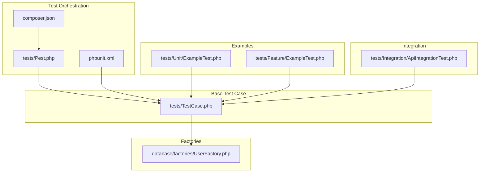
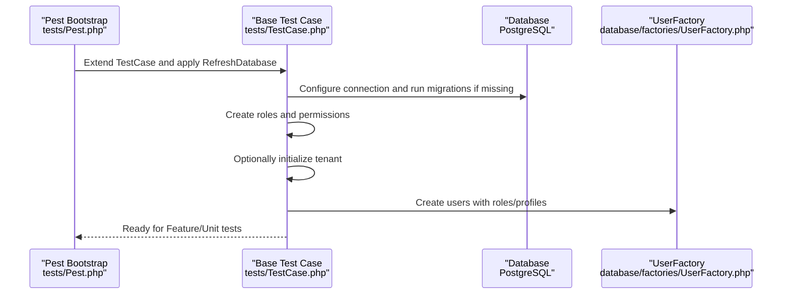
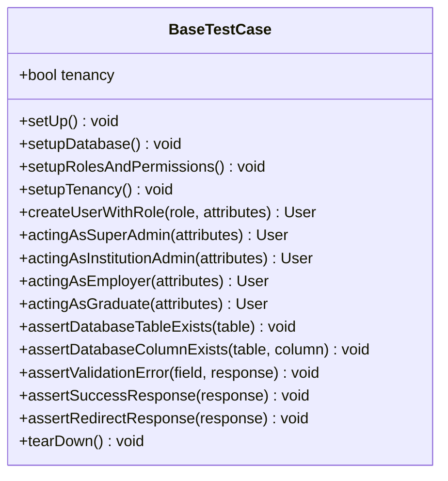
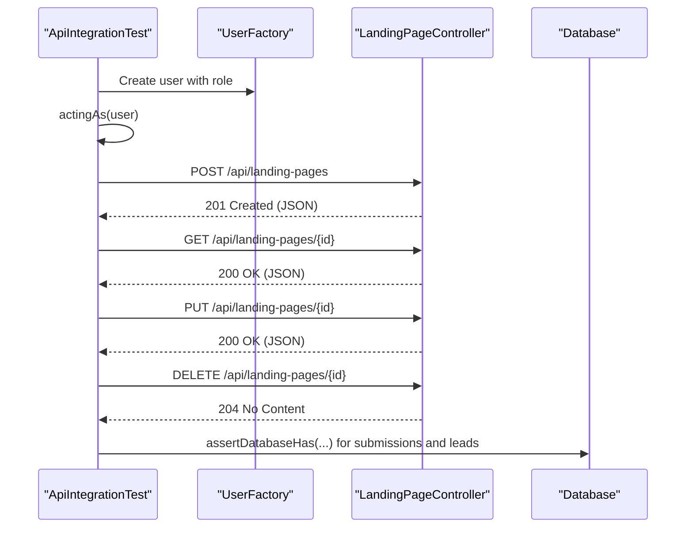
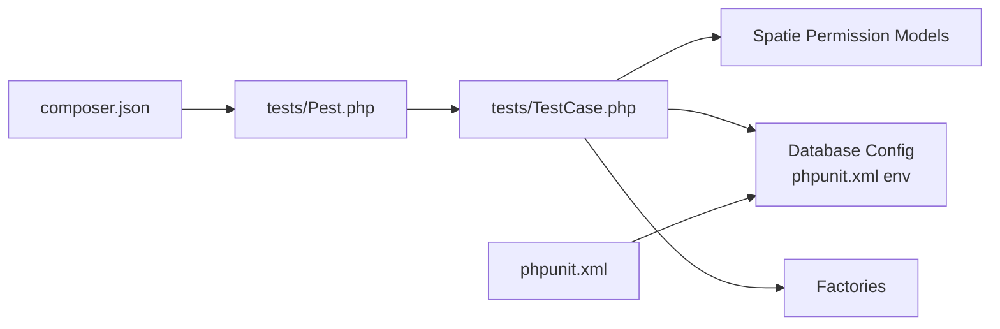

# Unit & Integration Testing

<cite>
**Referenced Files in This Document**
- [Pest.php](file://tests/Pest.php)
- [TestCase.php](file://tests/TestCase.php)
- [phpunit.xml](file://phpunit.xml)
- [composer.json](file://composer.json)
- [UserFactory.php](file://database/factories/UserFactory.php)
- [ApiIntegrationTest.php](file://tests/Integration/ApiIntegrationTest.php)
- [ExampleTest.php (Unit)](file://tests/Unit/ExampleTest.php)
- [ExampleTest.php (Feature)](file://tests/Feature/ExampleTest.php)
</cite>

## Table of Contents
1. [Introduction](#introduction)
2. [Project Structure](#project-structure)
3. [Core Components](#core-components)
4. [Architecture Overview](#architecture-overview)
5. [Detailed Component Analysis](#detailed-component-analysis)
6. [Dependency Analysis](#dependency-analysis)
7. [Performance Considerations](#performance-considerations)
8. [Troubleshooting Guide](#troubleshooting-guide)
9. [Conclusion](#conclusion)
10. [Appendices](#appendices)

## Introduction
This document explains how unit and integration tests are organized and executed in the Alumate Laravel application. It covers the Pest PHP testing framework usage, Laravel testing traits, factory patterns, and how to implement unit tests for models, services, and controllers, as well as integration tests for API endpoints, database operations, and service interactions. It also documents best practices for test isolation, data setup with factories, assertion strategies, and maintainability.

## Project Structure
The testing setup leverages Pest for concise, expressive tests and a shared base test case that configures database migrations, roles/permissions, and optional multi-tenancy for tests. PHPUnit configuration defines test suites and environment variables for reliable test execution.

**Diagram sources**
- [Pest.php:14-16](file://tests/Pest.php#L14-L16)
- [TestCase.php:14-30](file://tests/TestCase.php#L14-L30)
- [phpunit.xml:10-29](file://phpunit.xml#L10-L29)
- [composer.json:24-34](file://composer.json#L24-L34)
- [UserFactory.php:13-26](file://database/factories/UserFactory.php#L13-L26)
- [ExampleTest.php (Unit):1-6](file://tests/Unit/ExampleTest.php#L1-L6)
- [ExampleTest.php (Feature):1-8](file://tests/Feature/ExampleTest.php#L1-L8)
- [ApiIntegrationTest.php:12-23](file://tests/Integration/ApiIntegrationTest.php#L12-L23)

**Section sources**
- [Pest.php:14-16](file://tests/Pest.php#L14-L16)
- [TestCase.php:14-30](file://tests/TestCase.php#L14-L30)
- [phpunit.xml:10-29](file://phpunit.xml#L10-L29)
- [composer.json:24-34](file://composer.json#L24-L34)

## Core Components
- Pest configuration extends the base test case and enables database refresh for Feature tests.
- A shared base test case sets up PostgreSQL for tests, runs migrations if needed, seeds basic roles/permissions, supports multi-tenancy initialization, and provides helper assertions and user creation helpers.
- Factories define realistic default states for models and include role-specific and profile variants.
- PHPUnit configuration defines test suites and environment variables for consistent execution.

Key capabilities:
- Database isolation via RefreshDatabase trait and per-test migrations.
- Role-based user creation helpers for authenticated tests.
- Assertions for validation errors, success, and redirect responses.
- Multi-tenancy support for tenant-scoped tests.

**Section sources**
- [Pest.php:14-16](file://tests/Pest.php#L14-L16)
- [TestCase.php:16-30](file://tests/TestCase.php#L16-L30)
- [TestCase.php:32-42](file://tests/TestCase.php#L32-L42)
- [TestCase.php:44-60](file://tests/TestCase.php#L44-L60)
- [TestCase.php:62-76](file://tests/TestCase.php#L62-L76)
- [TestCase.php:78-116](file://tests/TestCase.php#L78-L116)
- [TestCase.php:118-147](file://tests/TestCase.php#L118-L147)
- [UserFactory.php:25-68](file://database/factories/UserFactory.php#L25-L68)
- [UserFactory.php:83-131](file://database/factories/UserFactory.php#L83-L131)
- [phpunit.xml:10-29](file://phpunit.xml#L10-L29)

## Architecture Overview
The testing architecture centers on Pest’s expressive DSL and a reusable base test case. Pest extends the base test case and applies the RefreshDatabase trait to Feature tests. The base test case ensures a clean database state, creates roles/permissions, optionally initializes a tenant, and exposes convenient helpers.

**Diagram sources**
- [Pest.php:14-16](file://tests/Pest.php#L14-L16)
- [TestCase.php:20-30](file://tests/TestCase.php#L20-L30)
- [TestCase.php:32-42](file://tests/TestCase.php#L32-L42)
- [TestCase.php:44-60](file://tests/TestCase.php#L44-L60)
- [TestCase.php:62-76](file://tests/TestCase.php#L62-L76)
- [UserFactory.php:83-131](file://database/factories/UserFactory.php#L83-L131)

## Detailed Component Analysis

### Pest Configuration and Test Suites
- Pest extends the base test case and applies RefreshDatabase to Feature tests, ensuring database isolation per test.
- Global expectations and helper functions can be registered in Pest for reuse across tests.

Best practices:
- Keep Pest extensions minimal and focused.
- Prefer Feature tests for HTTP/API coverage and Unit tests for isolated logic.

**Section sources**
- [Pest.php:14-16](file://tests/Pest.php#L14-L16)
- [Pest.php:29-31](file://tests/Pest.php#L29-L31)
- [Pest.php:44-47](file://tests/Pest.php#L44-L47)

### Base Test Case: Setup, Teardown, and Helpers
Responsibilities:
- Database setup: switch to PostgreSQL, ensure migrations are fresh.
- Roles and permissions seeding for authorization tests.
- Optional multi-tenancy initialization for tenant-scoped tests.
- Helper methods for user creation with roles and acting-as helpers.
- Assertion helpers for validation errors, success, and redirect responses.
- Proper teardown to end tenant sessions.

**Diagram sources**
- [TestCase.php:14-30](file://tests/TestCase.php#L14-L30)
- [TestCase.php:32-42](file://tests/TestCase.php#L32-L42)
- [TestCase.php:44-60](file://tests/TestCase.php#L44-L60)
- [TestCase.php:62-76](file://tests/TestCase.php#L62-L76)
- [TestCase.php:78-116](file://tests/TestCase.php#L78-L116)
- [TestCase.php:118-147](file://tests/TestCase.php#L118-L147)
- [TestCase.php:149-156](file://tests/TestCase.php#L149-L156)

**Section sources**
- [TestCase.php:14-30](file://tests/TestCase.php#L14-L30)
- [TestCase.php:32-42](file://tests/TestCase.php#L32-L42)
- [TestCase.php:44-60](file://tests/TestCase.php#L44-L60)
- [TestCase.php:62-76](file://tests/TestCase.php#L62-L76)
- [TestCase.php:78-116](file://tests/TestCase.php#L78-L116)
- [TestCase.php:118-147](file://tests/TestCase.php#L118-L147)
- [TestCase.php:149-156](file://tests/TestCase.php#L149-L156)

### Factory Patterns: UserFactory
UserFactory provides realistic defaults and role-specific variants:
- Default state includes personal info, preferences, status, and timestamps.
- Role-specific factories: super admin, institution admin, employer, graduate.
- Additional states: suspended, inactive, two-factor enabled, complete profile, recent activity, custom preferences.

Usage patterns:
- Create users with roles for authenticated tests.
- Combine states to simulate complex scenarios (e.g., institution admin with complete profile).

**Section sources**
- [UserFactory.php:25-68](file://database/factories/UserFactory.php#L25-L68)
- [UserFactory.php:83-131](file://database/factories/UserFactory.php#L83-L131)
- [UserFactory.php:136-153](file://database/factories/UserFactory.php#L136-L153)
- [UserFactory.php:158-169](file://database/factories/UserFactory.php#L158-L169)
- [UserFactory.php:174-196](file://database/factories/UserFactory.php#L174-L196)
- [UserFactory.php:201-206](file://database/factories/UserFactory.php#L201-L206)
- [UserFactory.php:211-217](file://database/factories/UserFactory.php#L211-L217)
- [UserFactory.php:222-242](file://database/factories/UserFactory.php#L222-L242)

### Unit Tests: Models, Services, Controllers
Scope:
- Unit tests validate isolated logic without external dependencies.
- Use Pest’s expressive syntax and Mockery for stubbing collaborators.
- Dependency injection allows replacing services with mocks for precise assertions.

Recommended patterns:
- Arrange: create minimal inputs using factories.
- Act: call the method under test.
- Assert: verify outputs, exceptions, and interactions with mocks.
- Clean up: rely on RefreshDatabase for database state.

Example patterns by component type:
- Models: validate fillable, casts, scopes, and relationships.
- Services: isolate business logic and mock external integrations.
- Controllers: test routing, validation, authorization, and response shapes.

Note: The repository includes a minimal unit example and a feature example to demonstrate Pest usage and HTTP assertions.

**Section sources**
- [ExampleTest.php (Unit):1-6](file://tests/Unit/ExampleTest.php#L1-L6)
- [ExampleTest.php (Feature):1-8](file://tests/Feature/ExampleTest.php#L1-L8)

### Integration Tests: API Endpoints, Database, and Services
Scope:
- Integration tests validate end-to-end flows across controllers, middleware, services, and database.
- They use the base test case to ensure a clean database and seeded roles/permissions.

Representative flow:
- Create authenticated user via factory and actingAs.
- Exercise API endpoints (CRUD, analytics, submissions).
- Assert HTTP status codes, JSON structure, and persisted records.

**Diagram sources**
- [ApiIntegrationTest.php:14-23](file://tests/Integration/ApiIntegrationTest.php#L14-L23)
- [ApiIntegrationTest.php:25-55](file://tests/Integration/ApiIntegrationTest.php#L25-L55)
- [ApiIntegrationTest.php:57-86](file://tests/Integration/ApiIntegrationTest.php#L57-L86)
- [ApiIntegrationTest.php:88-113](file://tests/Integration/ApiIntegrationTest.php#L88-L113)

**Section sources**
- [ApiIntegrationTest.php:12-23](file://tests/Integration/ApiIntegrationTest.php#L12-L23)
- [ApiIntegrationTest.php:25-55](file://tests/Integration/ApiIntegrationTest.php#L25-L55)
- [ApiIntegrationTest.php:57-86](file://tests/Integration/ApiIntegrationTest.php#L57-L86)
- [ApiIntegrationTest.php:88-113](file://tests/Integration/ApiIntegrationTest.php#L88-L113)

## Dependency Analysis
- Pest depends on the base test case and Laravel’s RefreshDatabase trait for Feature tests.
- The base test case depends on:
  - Database configuration and migrations.
  - Spatie Permission models for roles/permissions.
  - Optional tenancy initialization.
  - Factories for user creation.
- PHPUnit configuration defines environment variables and test suite locations.

**Diagram sources**
- [Pest.php:14-16](file://tests/Pest.php#L14-L16)
- [TestCase.php:16-30](file://tests/TestCase.php#L16-L30)
- [TestCase.php:44-60](file://tests/TestCase.php#L44-L60)
- [phpunit.xml:39-57](file://phpunit.xml#L39-L57)
- [composer.json:24-34](file://composer.json#L24-L34)

**Section sources**
- [Pest.php:14-16](file://tests/Pest.php#L14-L16)
- [TestCase.php:16-30](file://tests/TestCase.php#L16-L30)
- [TestCase.php:44-60](file://tests/TestCase.php#L44-L60)
- [phpunit.xml:39-57](file://phpunit.xml#L39-L57)
- [composer.json:24-34](file://composer.json#L24-L34)

## Performance Considerations
- Use Pest’s lightweight syntax to keep tests fast and readable.
- Leverage RefreshDatabase to avoid costly manual cleanup.
- Prefer factories for realistic yet controlled data generation.
- Run tests in parallel where possible using PHPUnit’s built-in capabilities.
- Limit external service calls in unit tests; mock them to reduce flakiness and speed.

## Troubleshooting Guide
Common issues and resolutions:
- Database schema errors during tests:
  - Ensure migrations are run automatically by the base test case or via artisan commands before running tests.
- Role/permission failures:
  - Confirm roles and permissions are created in the base test case setup.
- Multi-tenancy test failures:
  - Verify tenant initialization and proper teardown in the base test case.
- Assertion mismatches:
  - Use dedicated helpers for validation errors, success, and redirects to improve reliability.

**Section sources**
- [TestCase.php:32-42](file://tests/TestCase.php#L32-L42)
- [TestCase.php:44-60](file://tests/TestCase.php#L44-L60)
- [TestCase.php:62-76](file://tests/TestCase.php#L62-L76)
- [TestCase.php:118-147](file://tests/TestCase.php#L118-L147)

## Conclusion
The Alumate application employs Pest for expressive tests, a robust base test case for database and role setup, and factories for realistic data. Unit tests focus on isolated logic and dependency injection, while integration tests validate end-to-end API flows and persistence. Following the outlined patterns ensures maintainable, fast, and reliable tests across the codebase.

## Appendices

### Best Practices Checklist
- Isolation: Use RefreshDatabase and avoid global state.
- Factories: Prefer factories for realistic, repeatable data.
- Assertions: Favor explicit helpers and structured JSON assertions.
- Organization: Place unit tests alongside source code; feature/integration tests in dedicated directories.
- Naming: Use descriptive names indicating scenario and expected outcome.
- Maintainability: Keep test setup centralized in the base test case; avoid duplication.

### Example References
- Pest extension and expectations registration: [Pest.php:14-16](file://tests/Pest.php#L14-L16), [Pest.php:29-31](file://tests/Pest.php#L29-L31), [Pest.php:44-47](file://tests/Pest.php#L44-L47)
- Base test case setup and helpers: [TestCase.php:20-30](file://tests/TestCase.php#L20-L30), [TestCase.php:32-42](file://tests/TestCase.php#L32-L42), [TestCase.php:44-60](file://tests/TestCase.php#L44-L60), [TestCase.php:62-76](file://tests/TestCase.php#L62-L76), [TestCase.php:78-116](file://tests/TestCase.php#L78-L116), [TestCase.php:118-147](file://tests/TestCase.php#L118-L147), [TestCase.php:149-156](file://tests/TestCase.php#L149-L156)
- Factory usage patterns: [UserFactory.php:25-68](file://database/factories/UserFactory.php#L25-L68), [UserFactory.php:83-131](file://database/factories/UserFactory.php#L83-L131), [UserFactory.php:174-196](file://database/factories/UserFactory.php#L174-L196)
- Integration test example: [ApiIntegrationTest.php:14-23](file://tests/Integration/ApiIntegrationTest.php#L14-L23), [ApiIntegrationTest.php:25-55](file://tests/Integration/ApiIntegrationTest.php#L25-L55), [ApiIntegrationTest.php:57-86](file://tests/Integration/ApiIntegrationTest.php#L57-L86), [ApiIntegrationTest.php:88-113](file://tests/Integration/ApiIntegrationTest.php#L88-L113)