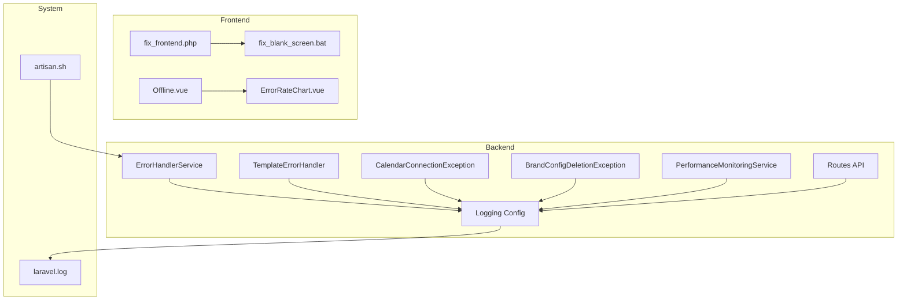
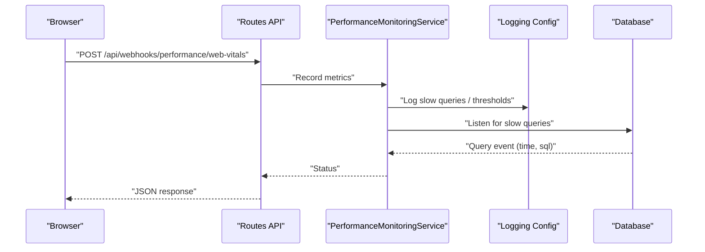
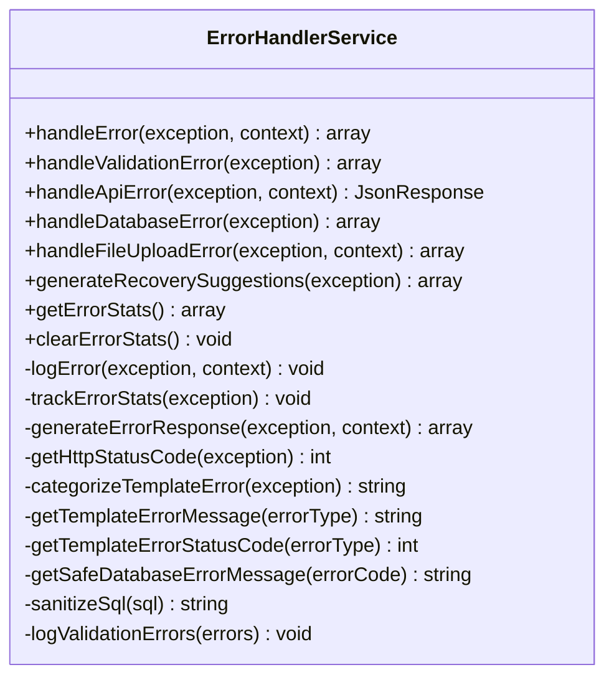
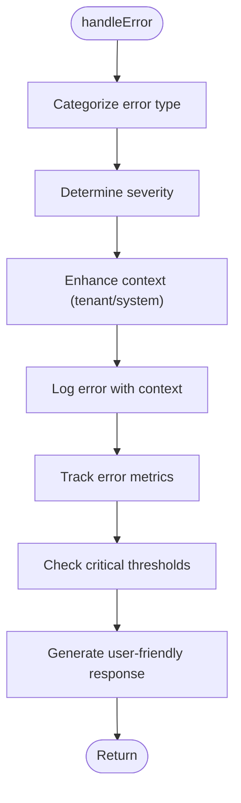
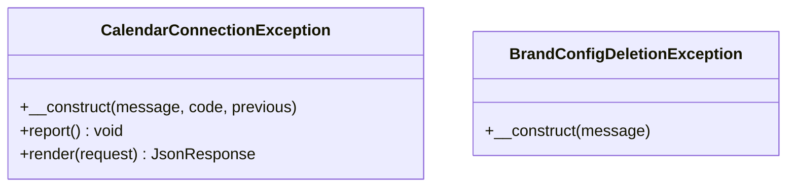
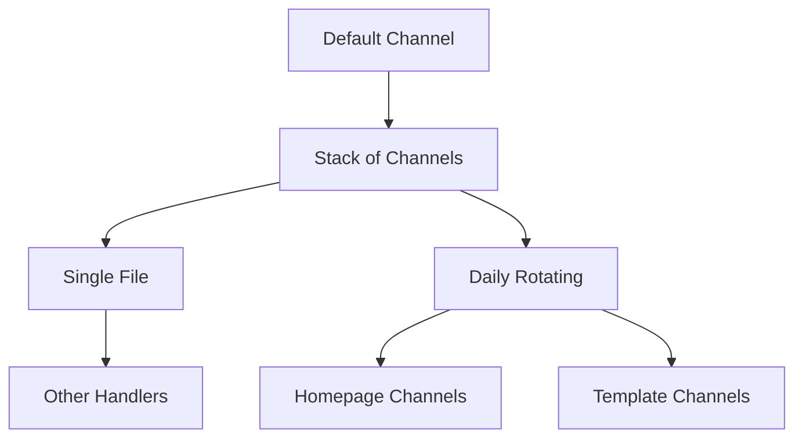
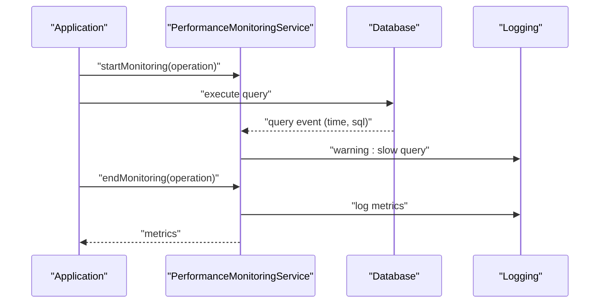
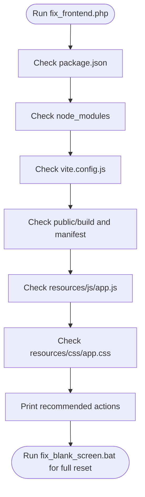
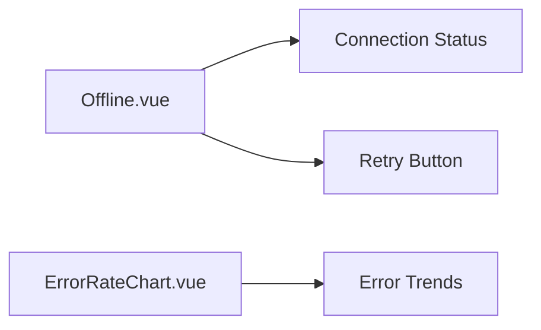
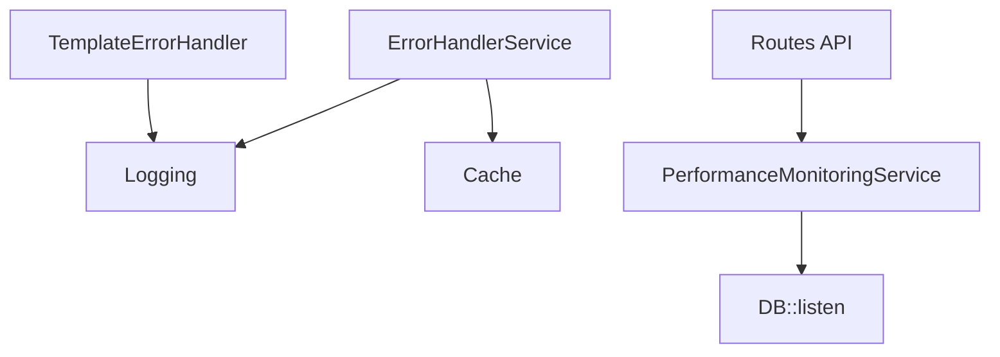

# Troubleshooting & Debugging

<cite>
**Referenced Files in This Document**
- [ErrorHandlerService.php](file://app/Services/ErrorHandlerService.php)
- [TemplateErrorHandler.php](file://app/Services/TemplateErrorHandler.php)
- [CalendarConnectionException.php](file://app/Exceptions/CalendarConnectionException.php)
- [BrandConfigDeletionException.php](file://app/Exceptions/BrandConfigDeletionException.php)
- [logging.php](file://config/logging.php)
- [app.php](file://config/app.php)
- [laravel.log](file://storage/logs/laravel.log)
- [api.php](file://routes/api.php)
- [fix_frontend.php](file://scripts/debugging/fix_frontend.php)
- [fix_blank_screen.bat](file://scripts/debugging/fix_blank_screen.bat)
- [artisan.sh](file://artisan.sh)
- [task-17-performance-optimization-recap.md](file://docs/task-17-performance-optimization-recap.md)
- [troubleshooting-guide.md](file://docs/component-library/troubleshooting-guide.md)
- [Offline.vue](file://resources/js/Pages/Offline.vue)
- [ErrorRateChart.vue](file://resources/js/components/monitoring/ErrorRateChart.vue)
</cite>

## Table of Contents
1. [Introduction](#introduction)
2. [Project Structure](#project-structure)
3. [Core Components](#core-components)
4. [Architecture Overview](#architecture-overview)
5. [Detailed Component Analysis](#detailed-component-analysis)
6. [Dependency Analysis](#dependency-analysis)
7. [Performance Considerations](#performance-considerations)
8. [Troubleshooting Guide](#troubleshooting-guide)
9. [Conclusion](#conclusion)
10. [Appendices](#appendices)

## Introduction
This document provides a comprehensive troubleshooting and debugging guide tailored to the Alumate platform. It focuses on diagnosing and resolving common issues such as blank screens, database connection failures, and frontend build problems. It also covers debugging tools (Laravel Debugbar, browser developer tools, and log analysis), performance troubleshooting (slow queries, memory usage, caching), error handling strategies, exception management, system monitoring, diagnostic scripts, health checks, and verification workflows. Practical, step-by-step procedures are included to help developers quickly isolate and resolve issues.

## Project Structure
The troubleshooting workflow spans backend services, frontend assets, logging configuration, and CLI helpers:
- Backend error handling and logging are centralized via dedicated services and exception classes.
- Logging is configured per functional domain (e.g., homepage, templates) for targeted diagnostics.
- Frontend asset pipeline issues are diagnosed and fixed using automated scripts.
- Performance monitoring and slow query detection are integrated into runtime services and routes.

**Diagram sources**
- [ErrorHandlerService.php:1-449](file://app/Services/ErrorHandlerService.php#L1-L449)
- [TemplateErrorHandler.php:31-70](file://app/Services/TemplateErrorHandler.php#L31-L70)
- [CalendarConnectionException.php:1-51](file://app/Exceptions/CalendarConnectionException.php#L1-L51)
- [BrandConfigDeletionException.php:1-13](file://app/Exceptions/BrandConfigDeletionException.php#L1-L13)
- [logging.php:1-206](file://config/logging.php#L1-L206)
- [task-17-performance-optimization-recap.md:267-388](file://docs/task-17-performance-optimization-recap.md#L267-L388)
- [api.php:1140-1166](file://routes/api.php#L1140-L1166)
- [fix_frontend.php:1-84](file://scripts/debugging/fix_frontend.php#L1-L84)
- [fix_blank_screen.bat:1-49](file://scripts/debugging/fix_blank_screen.bat#L1-L49)
- [artisan.sh:1-43](file://artisan.sh#L1-L43)
- [laravel.log:1-530](file://storage/logs/laravel.log#L1-L530)
- [Offline.vue:20-39](file://resources/js/Pages/Offline.vue#L20-L39)
- [ErrorRateChart.vue:252-308](file://resources/js/components/monitoring/ErrorRateChart.vue#L252-L308)

**Section sources**
- [logging.php:1-206](file://config/logging.php#L1-L206)
- [app.php:1-179](file://config/app.php#L1-L179)
- [laravel.log:1-530](file://storage/logs/laravel.log#L1-L530)

## Core Components
- Centralized error handling and user-friendly responses are implemented in a robust service that logs context, tracks statistics, and generates recovery suggestions.
- Template-specific error handling enriches context with tenant and system metadata, logs detailed information, and triggers monitoring alerts.
- Domain exceptions encapsulate reporting and rendering logic for consistent API responses.
- Logging configuration supports multiple channels for different domains (homepage, templates) enabling targeted diagnostics.
- Performance monitoring integrates slow query detection and resource usage tracking.

**Section sources**
- [ErrorHandlerService.php:29-338](file://app/Services/ErrorHandlerService.php#L29-L338)
- [TemplateErrorHandler.php:45-70](file://app/Services/TemplateErrorHandler.php#L45-L70)
- [CalendarConnectionException.php:27-50](file://app/Exceptions/CalendarConnectionException.php#L27-L50)
- [logging.php:130-203](file://config/logging.php#L130-L203)
- [task-17-performance-optimization-recap.md:315-387](file://docs/task-17-performance-optimization-recap.md#L315-L387)

## Architecture Overview
The debugging architecture combines backend services, frontend diagnostics, and system-level logging and monitoring.

**Diagram sources**
- [api.php:1148-1166](file://routes/api.php#L1148-L1166)
- [task-17-performance-optimization-recap.md:315-346](file://docs/task-17-performance-optimization-recap.md#L315-L346)

## Detailed Component Analysis

### Error Handling Service
The centralized error handler:
- Logs full context including user, IP, user agent, URL, and stack trace.
- Tracks error statistics in cache for trending analysis.
- Generates user-friendly responses and recovery suggestions.
- Supports specialized handlers for validation, database, file uploads, and templates.

**Diagram sources**
- [ErrorHandlerService.php:29-449](file://app/Services/ErrorHandlerService.php#L29-L449)

**Section sources**
- [ErrorHandlerService.php:29-338](file://app/Services/ErrorHandlerService.php#L29-L338)

### Template Error Handler
Template error handling:
- Categorizes and determines severity.
- Enriches context with tenant/system info.
- Logs detailed error and tracks metrics.
- Checks critical thresholds and generates user-friendly responses.

**Diagram sources**
- [TemplateErrorHandler.php:45-70](file://app/Services/TemplateErrorHandler.php#L45-L70)

**Section sources**
- [TemplateErrorHandler.php:45-70](file://app/Services/TemplateErrorHandler.php#L45-L70)

### Exception Classes
Domain exceptions:
- CalendarConnectionException: Reports and renders standardized API responses for calendar connectivity issues.
- BrandConfigDeletionException: Provides a consistent exception for brand configuration deletion constraints.

**Diagram sources**
- [CalendarConnectionException.php:19-50](file://app/Exceptions/CalendarConnectionException.php#L19-L50)
- [BrandConfigDeletionException.php:9-12](file://app/Exceptions/BrandConfigDeletionException.php#L9-L12)

**Section sources**
- [CalendarConnectionException.php:27-50](file://app/Exceptions/CalendarConnectionException.php#L27-L50)
- [BrandConfigDeletionException.php:7-12](file://app/Exceptions/BrandConfigDeletionException.php#L7-L12)

### Logging Configuration
Logging channels:
- Stack-based default logging.
- Daily rotation with configurable retention.
- Specialized channels for homepage and template domains.
- Placeholder replacement for structured logs.

**Diagram sources**
- [logging.php:54-203](file://config/logging.php#L54-L203)

**Section sources**
- [logging.php:54-203](file://config/logging.php#L54-L203)

### Performance Monitoring Service
Runtime performance monitoring:
- Starts/stops timers and captures memory usage.
- Listens for slow database queries and logs warnings.
- Tracks user experience metrics and alerts on thresholds.
- Generates performance reports aggregating database, cache, application, and user experience metrics.

**Diagram sources**
- [task-17-performance-optimization-recap.md:281-387](file://docs/task-17-performance-optimization-recap.md#L281-L387)

**Section sources**
- [task-17-performance-optimization-recap.md:281-387](file://docs/task-17-performance-optimization-recap.md#L281-L387)

### Frontend Diagnostics
Frontend troubleshooting scripts:
- fix_frontend.php validates presence of package.json, node_modules, vite.config.js, and build artifacts.
- fix_blank_screen.bat orchestrates dependency installation, asset building, cache clearing, and optional sample data creation.

**Diagram sources**
- [fix_frontend.php:6-84](file://scripts/debugging/fix_frontend.php#L6-L84)
- [fix_blank_screen.bat:9-49](file://scripts/debugging/fix_blank_screen.bat#L9-L49)

**Section sources**
- [fix_frontend.php:6-84](file://scripts/debugging/fix_frontend.php#L6-L84)
- [fix_blank_screen.bat:9-49](file://scripts/debugging/fix_blank_screen.bat#L9-L49)

### Offline Page and Error Monitoring
- Offline.vue displays connection status and retry controls.
- ErrorRateChart.vue visualizes error trends across categories (total, 4xx, 5xx, database).

**Diagram sources**
- [Offline.vue:23-38](file://resources/js/Pages/Offline.vue#L23-L38)
- [ErrorRateChart.vue:252-308](file://resources/js/components/monitoring/ErrorRateChart.vue#L252-L308)

**Section sources**
- [Offline.vue:23-38](file://resources/js/Pages/Offline.vue#L23-L38)
- [ErrorRateChart.vue:252-308](file://resources/js/components/monitoring/ErrorRateChart.vue#L252-L308)

## Dependency Analysis
- ErrorHandlerService depends on logging and cache facades for persistent statistics.
- TemplateErrorHandler depends on LogManager and internal metric tracking.
- PerformanceMonitoringService listens to database query events and logs warnings.
- Routes expose webhook endpoints for performance data ingestion.

**Diagram sources**
- [ErrorHandlerService.php:5-9](file://app/Services/ErrorHandlerService.php#L5-L9)
- [TemplateErrorHandler.php:31-34](file://app/Services/TemplateErrorHandler.php#L31-L34)
- [task-17-performance-optimization-recap.md:315-328](file://docs/task-17-performance-optimization-recap.md#L315-L328)
- [api.php:1148-1166](file://routes/api.php#L1148-L1166)

**Section sources**
- [ErrorHandlerService.php:5-9](file://app/Services/ErrorHandlerService.php#L5-L9)
- [TemplateErrorHandler.php:31-34](file://app/Services/TemplateErrorHandler.php#L31-L34)
- [task-17-performance-optimization-recap.md:315-328](file://docs/task-17-performance-optimization-recap.md#L315-L328)
- [api.php:1148-1166](file://routes/api.php#L1148-L1166)

## Performance Considerations
- Slow query identification: The performance service logs slow queries and can trigger alerts for sustained performance degradation.
- Memory usage analysis: Execution time and peak memory are captured per monitored operation.
- Caching issues: Error statistics are cached; clear cache to reset counters during diagnostics.

Practical tips:
- Use artisan.sh to run maintenance and diagnostics commands.
- Review laravel.log for slow query warnings and connection errors.
- Utilize domain-specific logging channels to isolate issues.

**Section sources**
- [task-17-performance-optimization-recap.md:315-387](file://docs/task-17-performance-optimization-recap.md#L315-L387)
- [artisan.sh:1-43](file://artisan.sh#L1-L43)
- [laravel.log:135-136](file://storage/logs/laravel.log#L135-L136)

## Troubleshooting Guide

### Blank Screen Problems
Symptoms:
- No visible content after loading the application.
- Assets missing or not built.

Resolution steps:
1. Run the frontend diagnostics script to validate dependencies and build artifacts.
2. Execute the blank-screen fix script to reinstall dependencies, rebuild assets, clear caches, and optionally seed sample data.
3. Inspect browser console for JavaScript errors and network tab for failed asset loads.
4. Verify Vite configuration and build manifest presence.

Verification checklist:
- Confirm package.json and node_modules exist.
- Ensure vite.config.js is present.
- Check public/build directory and manifest.json.
- Validate app.js and app.css resources exist.
- After fixes, revisit home, login, and analytics pages.

**Section sources**
- [fix_frontend.php:6-84](file://scripts/debugging/fix_frontend.php#L6-L84)
- [fix_blank_screen.bat:9-49](file://scripts/debugging/fix_blank_screen.bat#L9-L49)
- [Offline.vue:23-38](file://resources/js/Pages/Offline.vue#L23-L38)

### Database Connection Errors
Symptoms:
- Application fails to connect to the database.
- Session reads fail with connection refused errors.

Resolution steps:
1. Check laravel.log for connection refused and PDO exceptions.
2. Verify database service availability and credentials.
3. Confirm environment configuration for database connection.
4. If using SQLite, review syntax compatibility and UUID functions noted in logs.

Verification checklist:
- Confirm database server is running.
- Validate connection parameters in environment.
- Review logs for repeated connection errors.
- For SQLite migrations, adjust syntax to supported dialect.

**Section sources**
- [laravel.log:2-61](file://storage/logs/laravel.log#L2-L61)
- [laravel.log:135-136](file://storage/logs/laravel.log#L135-L136)
- [laravel.log:137-176](file://storage/logs/laravel.log#L137-L176)
- [app.php:29](file://config/app.php#L29)

### Frontend Build Issues
Symptoms:
- Missing assets, broken styles, or unresponsive UI.

Resolution steps:
1. Validate presence of package.json, node_modules, vite.config.js, and build artifacts.
2. Rebuild assets using the frontend script and confirm manifest generation.
3. Clear Laravel caches to avoid serving stale assets.

Verification checklist:
- node_modules and vite.config.js must exist.
- public/build and manifest.json must be present.
- After rebuild, clear Laravel caches and refresh browser.

**Section sources**
- [fix_frontend.php:6-84](file://scripts/debugging/fix_frontend.php#L6-L84)

### Slow Query Identification
Symptoms:
- Long page load times or timeouts.
- Database warnings in logs.

Resolution steps:
1. Enable performance monitoring and review slow query logs.
2. Identify queries exceeding configured thresholds.
3. Add indexes, optimize joins, and reduce N+1 queries.
4. Use eager loading and query scopes to improve performance.

Verification checklist:
- Review logs for slow query warnings.
- Confirm indexes exist for frequent filters.
- Validate query plans and remove unnecessary joins.

**Section sources**
- [task-17-performance-optimization-recap.md:315-328](file://docs/task-17-performance-optimization-recap.md#L315-L328)
- [troubleshooting-guide.md:686-729](file://docs/component-library/troubleshooting-guide.md#L686-L729)

### Memory Usage Analysis
Symptoms:
- High memory consumption leading to degraded performance.

Resolution steps:
1. Monitor execution time and peak memory via performance service.
2. Identify operations with high memory usage.
3. Optimize loops, reduce object allocations, and leverage streaming where possible.

Verification checklist:
- Compare memory usage deltas across operations.
- Set alerts for memory thresholds.

**Section sources**
- [task-17-performance-optimization-recap.md:292-313](file://docs/task-17-performance-optimization-recap.md#L292-L313)

### Caching Issues
Symptoms:
- Stale UI, inconsistent error counts, or delayed updates.

Resolution steps:
1. Clear application caches using the blank-screen fix script.
2. Reset error statistics if using cached metrics.
3. Rebuild frontend assets to ensure latest bundle.

Verification checklist:
- Confirm cache clearing commands executed.
- Validate error statistics reset.

**Section sources**
- [fix_blank_screen.bat:21-30](file://scripts/debugging/fix_blank_screen.bat#L21-L30)
- [ErrorHandlerService.php:200-219](file://app/Services/ErrorHandlerService.php#L200-L219)

### Error Handling Strategies and Exception Management
- Centralized error handling: Use the error handler service to log context, track statistics, and generate user-friendly responses.
- Template-specific handling: Leverage template error handler for enriched context and tenant-aware metrics.
- Domain exceptions: Standardize API responses for calendar and brand configuration errors.

Verification checklist:
- Ensure exceptions are caught and routed to the error handler.
- Confirm domain exceptions render appropriate HTTP status codes.

**Section sources**
- [ErrorHandlerService.php:29-338](file://app/Services/ErrorHandlerService.php#L29-L338)
- [TemplateErrorHandler.php:45-70](file://app/Services/TemplateErrorHandler.php#L45-L70)
- [CalendarConnectionException.php:27-50](file://app/Exceptions/CalendarConnectionException.php#L27-L50)

### System Monitoring Approaches
- Webhook ingestion: Submit performance metrics via API routes for centralized logging and alerting.
- Error rate visualization: Use charts to monitor total, 4xx, 5xx, and database error trends.
- Offline diagnostics: Display connection status and retry controls.

Verification checklist:
- Confirm webhook endpoints receive data.
- Validate charts reflect recent error trends.

**Section sources**
- [api.php:1148-1166](file://routes/api.php#L1148-L1166)
- [ErrorRateChart.vue:252-308](file://resources/js/components/monitoring/ErrorRateChart.vue#L252-L308)
- [Offline.vue:23-38](file://resources/js/Pages/Offline.vue#L23-L38)

### Diagnostic Scripts and Health Checks
- Frontend diagnostics: Validate dependencies and build artifacts.
- Full reset: Reinstall dependencies, rebuild assets, clear caches, and seed sample data.
- CLI helper: Use artisan.sh wrapper to execute artisan commands consistently.

Verification checklist:
- Run fix_frontend.php and address missing prerequisites.
- Execute fix_blank_screen.bat for a clean slate.
- Use artisan.sh for reliable command execution.

**Section sources**
- [fix_frontend.php:6-84](file://scripts/debugging/fix_frontend.php#L6-L84)
- [fix_blank_screen.bat:9-49](file://scripts/debugging/fix_blank_screen.bat#L9-L49)
- [artisan.sh:1-43](file://artisan.sh#L1-L43)

### System Verification Workflows
- Database connectivity: Confirm successful session reads and absence of connection refused errors.
- Frontend health: Verify assets are built and served, and UI responds to user interactions.
- Performance baseline: Ensure slow query warnings are addressed and memory usage remains within thresholds.

Verification checklist:
- Review laravel.log for connectivity and performance entries.
- Validate frontend pages load without blank screens.
- Monitor performance metrics and alerts.

**Section sources**
- [laravel.log:2-61](file://storage/logs/laravel.log#L2-L61)
- [Offline.vue:23-38](file://resources/js/Pages/Offline.vue#L23-L38)
- [task-17-performance-optimization-recap.md:315-387](file://docs/task-17-performance-optimization-recap.md#L315-L387)

## Conclusion
By combining centralized error handling, domain-specific logging, performance monitoring, and automated diagnostic scripts, Alumate provides a robust foundation for troubleshooting and debugging. Use the outlined workflows to quickly isolate and resolve blank screens, database connectivity issues, and frontend build problems, while maintaining strong observability through logs, charts, and webhook-based metrics.

## Appendices

### Quick Reference: Common Commands
- Clear caches and rebuild frontend:
  - Clear caches: [fix_blank_screen.bat:21-30](file://scripts/debugging/fix_blank_screen.bat#L21-L30)
  - Rebuild assets: [fix_frontend.php:63-66](file://scripts/debugging/fix_frontend.php#L63-L66)
- Run artisan commands via wrapper:
  - [artisan.sh:36-40](file://artisan.sh#L36-L40)

**Section sources**
- [fix_blank_screen.bat:21-30](file://scripts/debugging/fix_blank_screen.bat#L21-L30)
- [fix_frontend.php:63-66](file://scripts/debugging/fix_frontend.php#L63-L66)
- [artisan.sh:36-40](file://artisan.sh#L36-L40)