# Authentication & Authorization

<cite>
**Referenced Files in This Document**
- [AuthServiceProvider.php](file://app/Providers/AuthServiceProvider.php)
- [auth.php](file://config/auth.php)
- [session.php](file://config/session.php)
- [security.php](file://config/security.php)
- [sso.php](file://config/sso.php)
- [routes/auth.php](file://routes/auth.php)
- [routes/api.php](file://routes/api.php)
- [routes/web.php](file://routes/web.php)
- [TwoFactorAuth.php](file://app/Models/TwoFactorAuth.php)
- [User.php](file://app/Models/User.php)
- [SsoConfiguration.php](file://app/Models/SsoConfiguration.php)
- [ApiKey.php](file://app/Models/ApiKey.php)
- [OAuthService.php](file://app/Services/OAuthService.php)
- [SSOIntegrationService.php](file://app/Services/SSOIntegrationService.php)
- [SocialAuthService.php](file://app/Services/SocialAuthService.php)
- [SecurityService.php](file://app/Services/SecurityService.php)
- [FailedLoginAttempt.php](file://app/Models/FailedLoginAttempt.php)
- [SessionSecurity.php](file://app/Models/SessionSecurity.php)
- [RateLimitValidation.php](file://app/Rules/RateLimitValidation.php)
- [SpamProtection.php](file://app/Rules/SpamProtection.php)
- [InstitutionalDomain.php](file://app/Rules/InstitutionalDomain.php)
- [UserPolicy.php](file://app/Policies/UserPolicy.php)
- [RolePolicy.php](file://app/Policies/RolePolicy.php)
- [TenancyServiceProvider.php](file://app/Providers/TenancyServiceProvider.php)
- [Tenant.php](file://app/Models/Tenant.php)
- [bootstrap/app.php](file://bootstrap/app.php)
- [AppServiceProvider.php](file://app/Providers/AppServiceProvider.php)
</cite>

## Table of Contents
1. [Introduction](#introduction)
2. [Project Structure](#project-structure)
3. [Core Components](#core-components)
4. [Architecture Overview](#architecture-overview)
5. [Detailed Component Analysis](#detailed-component-analysis)
6. [Dependency Analysis](#dependency-analysis)
7. [Performance Considerations](#performance-considerations)
8. [Troubleshooting Guide](#troubleshooting-guide)
9. [Conclusion](#conclusion)

## Introduction
This document provides comprehensive coverage of the authentication and authorization system, focusing on multi-factor authentication (2FA), email verification, password reset, social authentication, SSO integrations, API token authentication, JWT implementation, session management, security middleware, rate limiting, brute force protection, tenant-aware authentication, and cross-institution access controls. It synthesizes configuration-driven behavior with service-layer implementations and model relationships to present a practical guide for administrators, developers, and operators.

## Project Structure
The authentication system spans configuration files, route definitions, service classes, policies, models, and validation rules. Key areas include:
- Configuration: authentication guards, providers, password resets, session behavior, security thresholds, and SSO defaults
- Routes: web and API endpoints for authentication flows
- Services: OAuth, SSO integration, social auth, and security utilities
- Models: User, TwoFactorAuth, SsoConfiguration, ApiKey, FailedLoginAttempt, SessionSecurity
- Policies: authorization rules for resources
- Validation rules: rate limits, spam protection, institutional domains

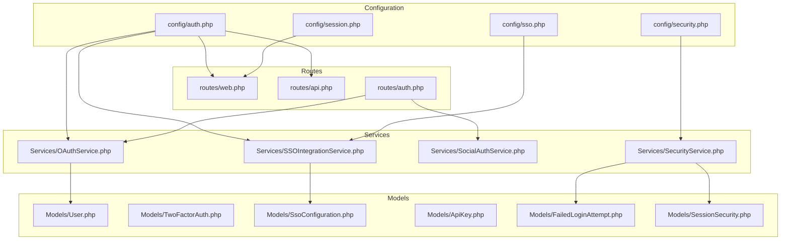

**Diagram sources**
- [auth.php:1-116](file://config/auth.php#L1-L116)
- [session.php:1-218](file://config/session.php#L1-L218)
- [security.php:1-76](file://config/security.php#L1-L76)
- [sso.php:1-265](file://config/sso.php#L1-L265)
- [routes/web.php](file://routes/web.php)
- [routes/api.php](file://routes/api.php)
- [routes/auth.php](file://routes/auth.php)
- [OAuthService.php](file://app/Services/OAuthService.php)
- [SSOIntegrationService.php](file://app/Services/SSOIntegrationService.php)
- [SocialAuthService.php](file://app/Services/SocialAuthService.php)
- [SecurityService.php](file://app/Services/SecurityService.php)
- [User.php](file://app/Models/User.php)
- [TwoFactorAuth.php](file://app/Models/TwoFactorAuth.php)
- [SsoConfiguration.php](file://app/Models/SsoConfiguration.php)
- [ApiKey.php](file://app/Models/ApiKey.php)
- [FailedLoginAttempt.php](file://app/Models/FailedLoginAttempt.php)
- [SessionSecurity.php](file://app/Models/SessionSecurity.php)

**Section sources**
- [auth.php:1-116](file://config/auth.php#L1-L116)
- [session.php:1-218](file://config/session.php#L1-L218)
- [security.php:1-76](file://config/security.php#L1-L76)
- [sso.php:1-265](file://config/sso.php#L1-L265)
- [routes/auth.php](file://routes/auth.php)
- [routes/api.php](file://routes/api.php)
- [routes/web.php](file://routes/web.php)

## Core Components
- Authentication Guards and Providers: Session-based guard with Eloquent user provider configured for the User model
- Password Reset: Broker configuration with token table, expiry, and throttling
- Session Management: Driver selection, lifetime, cookie attributes, and encryption
- Security Controls: Max login attempts, lockout duration, rate limits, session timeouts, and suspicious session tracking
- SSO Configuration: Defaults, SAML 2.0, OAuth 2.0/OpenID Connect, attribute and role mapping, provisioning, session management, and security settings
- Policies: Model-to-policy mappings for authorization decisions
- Validation Rules: Rate limit validation, spam protection, and institutional domain checks

**Section sources**
- [auth.php:16-116](file://config/auth.php#L16-L116)
- [session.php:21-218](file://config/session.php#L21-L218)
- [security.php:9-38](file://config/security.php#L9-L38)
- [sso.php:26-265](file://config/sso.php#L26-L265)
- [AuthServiceProvider.php:14-24](file://app/Providers/AuthServiceProvider.php#L14-L24)

## Architecture Overview
The authentication architecture integrates configuration-driven behavior with service-layer orchestration and model persistence. The system supports:
- Local authentication via session guard
- Social authentication through OAuth providers
- Enterprise SSO via SAML 2.0 and OAuth 2.0/OpenID Connect
- Multi-factor authentication with backup codes
- Tenant-aware access control and cross-institution boundaries
- Robust security middleware including rate limiting and brute force protection

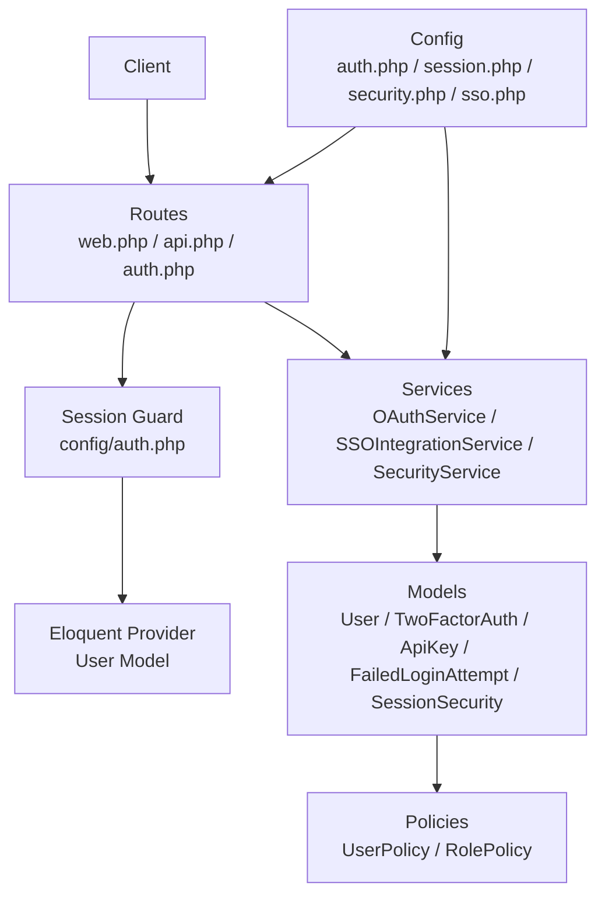

**Diagram sources**
- [auth.php:38-72](file://config/auth.php#L38-L72)
- [session.php:21-90](file://config/session.php#L21-L90)
- [security.php:9-38](file://config/security.php#L9-L38)
- [sso.php:26-229](file://config/sso.php#L26-L229)
- [routes/web.php](file://routes/web.php)
- [routes/api.php](file://routes/api.php)
- [routes/auth.php](file://routes/auth.php)
- [OAuthService.php](file://app/Services/OAuthService.php)
- [SSOIntegrationService.php](file://app/Services/SSOIntegrationService.php)
- [SecurityService.php](file://app/Services/SecurityService.php)
- [User.php](file://app/Models/User.php)
- [TwoFactorAuth.php](file://app/Models/TwoFactorAuth.php)
- [ApiKey.php](file://app/Models/ApiKey.php)
- [FailedLoginAttempt.php](file://app/Models/FailedLoginAttempt.php)
- [SessionSecurity.php](file://app/Models/SessionSecurity.php)
- [UserPolicy.php](file://app/Policies/UserPolicy.php)
- [RolePolicy.php](file://app/Policies/RolePolicy.php)

## Detailed Component Analysis

### Multi-Factor Authentication (2FA)
- Requirement: Roles requiring 2FA are defined in security configuration
- Backup Codes: Configurable count for recovery codes
- Implementation Pattern: TwoFactorAuth model paired with User model; backup codes generated and validated during authentication flow

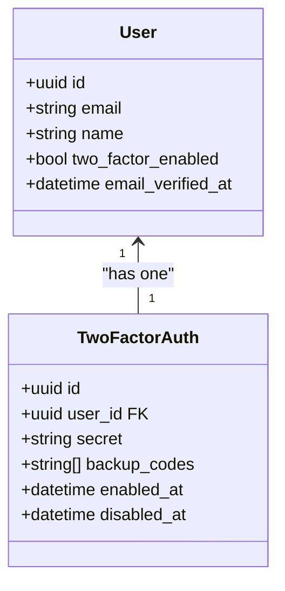

**Diagram sources**
- [TwoFactorAuth.php](file://app/Models/TwoFactorAuth.php)
- [User.php](file://app/Models/User.php)
- [security.php:33-37](file://config/security.php#L33-L37)

**Section sources**
- [security.php:33-37](file://config/security.php#L33-L37)
- [TwoFactorAuth.php](file://app/Models/TwoFactorAuth.php)
- [User.php](file://app/Models/User.php)

### Email Verification Workflow
- Verification Status: User model tracks email verification timestamp
- Trigger Points: Verified during registration and manual resends
- Integration: Email sending service coordinates verification emails

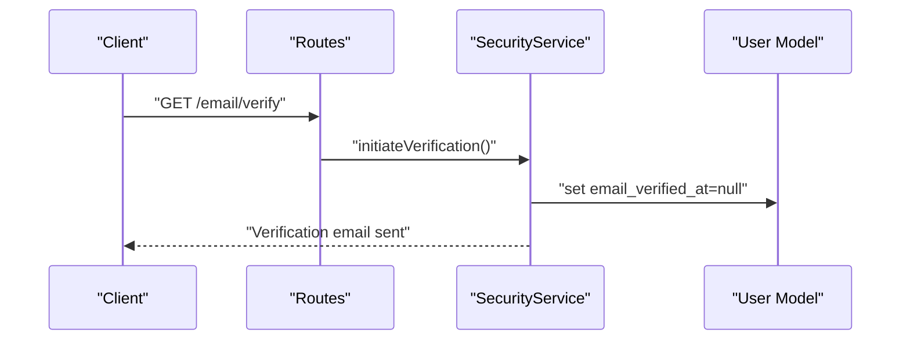

**Diagram sources**
- [SecurityService.php](file://app/Services/SecurityService.php)
- [User.php](file://app/Models/User.php)

**Section sources**
- [User.php](file://app/Models/User.php)
- [SecurityService.php](file://app/Services/SecurityService.php)

### Password Reset Mechanisms
- Broker: Users broker with token table, expiry, and throttle
- Flow: Request reset -> send token -> validate token -> reset password

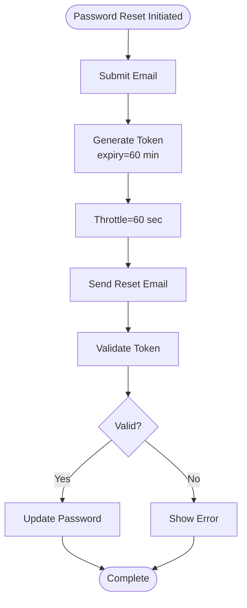

**Diagram sources**
- [auth.php:93-100](file://config/auth.php#L93-L100)

**Section sources**
- [auth.php:93-100](file://config/auth.php#L93-L100)

### Social Authentication Integration
- OAuth Providers: Managed by OAuthService with provider-specific flows
- Attribute Mapping: Maps external claims to internal User fields
- Provisioning: Optional creation/update of users based on SSO attributes

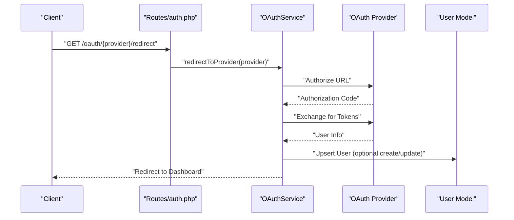

**Diagram sources**
- [routes/auth.php](file://routes/auth.php)
- [OAuthService.php](file://app/Services/OAuthService.php)
- [sso.php:106-134](file://config/sso.php#L106-L134)

**Section sources**
- [routes/auth.php](file://routes/auth.php)
- [OAuthService.php](file://app/Services/OAuthService.php)
- [sso.php:106-134](file://config/sso.php#L106-L134)

### SSO Integrations (SAML 2.0 and OAuth 2.0/OpenID Connect)
- Defaults: Auto-provision, auto-update, session timeout, remember-me
- SAML: SP metadata, bindings, signing, and security options
- OAuth/OIDC: Scopes, PKCE, response types, state lifetime
- Attribute and Role Mapping: Translates external identities to internal roles
- Provisioning: Create missing users, sync roles and attributes
- Session Management: SSO session keys, logout redirect, single logout
- Security: Issuer/audience validation, signature validation, timestamps, max auth age

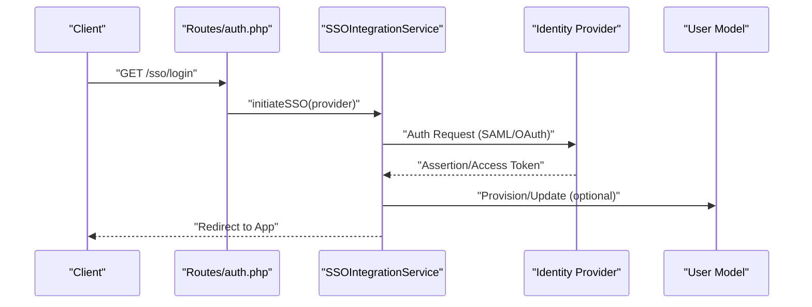

**Diagram sources**
- [routes/auth.php](file://routes/auth.php)
- [SSOIntegrationService.php](file://app/Services/SSOIntegrationService.php)
- [sso.php:26-229](file://config/sso.php#L26-L229)

**Section sources**
- [sso.php:26-229](file://config/sso.php#L26-L229)
- [SSOIntegrationService.php](file://app/Services/SSOIntegrationService.php)

### API Token Authentication and JWT
- API Keys: ApiKey model supports long-lived tokens for programmatic access
- JWT: Not explicitly configured in provided files; consult service implementations for token issuance and validation patterns
- Scope and Rotation: Consider implementing scopes and refresh token rotation in service layer

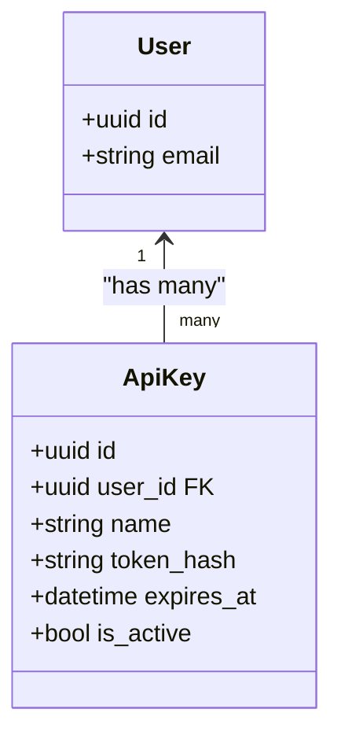

**Diagram sources**
- [ApiKey.php](file://app/Models/ApiKey.php)
- [User.php](file://app/Models/User.php)

**Section sources**
- [ApiKey.php](file://app/Models/ApiKey.php)
- [User.php](file://app/Models/User.php)

### Session Management
- Driver: Database-backed sessions by default
- Lifetime: Configurable idle timeout and close behavior
- Cookie Security: Secure, HttpOnly, SameSite, optional partitioned cookies
- Encryption: Optional transparent encryption of session payloads

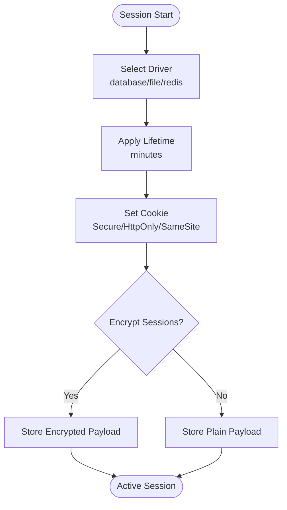

**Diagram sources**
- [session.php:21-218](file://config/session.php#L21-L218)

**Section sources**
- [session.php:21-218](file://config/session.php#L21-L218)

### Security Middleware, Rate Limiting, and Brute Force Protection
- Login Attempts: Max attempts and lockout duration configurable
- Rate Limits: Separate authenticated and unauthenticated limits
- Suspicious Sessions: Optional tracking of suspicious activity
- Validation Rules: RateLimitValidation, SpamProtection, InstitutionalDomain

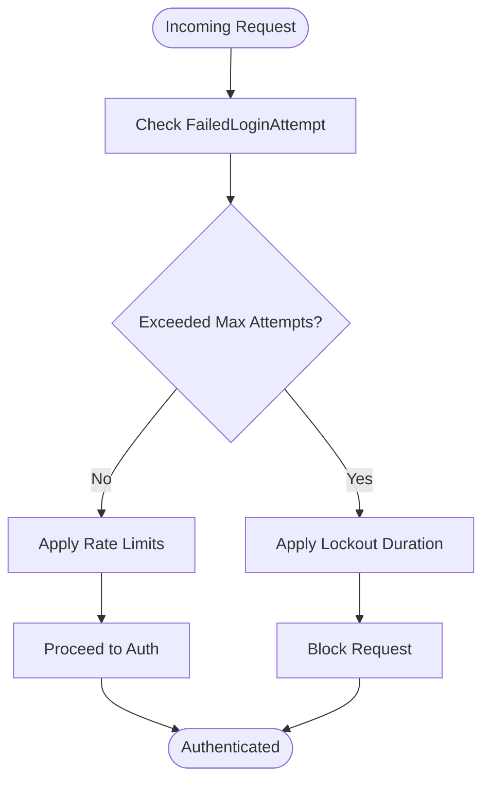

**Diagram sources**
- [security.php:9-26](file://config/security.php#L9-L26)
- [FailedLoginAttempt.php](file://app/Models/FailedLoginAttempt.php)

**Section sources**
- [security.php:9-26](file://config/security.php#L9-L26)
- [RateLimitValidation.php](file://app/Rules/RateLimitValidation.php)
- [SpamProtection.php](file://app/Rules/SpamProtection.php)
- [InstitutionalDomain.php](file://app/Rules/InstitutionalDomain.php)

### Tenant-Aware Authentication and Cross-Institution Access Controls
- Tenancy: Tenant model and tenancy provider enable multi-tenant isolation
- Cross-Institution Access: Policies and guards enforce institution boundaries
- Role-Based Access: Policies map to roles and resources for authorization

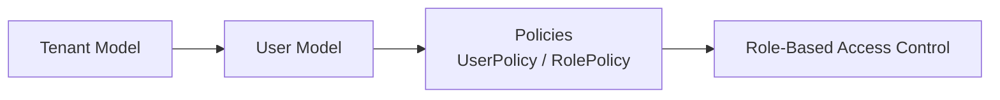

**Diagram sources**
- [Tenant.php](file://app/Models/Tenant.php)
- [User.php](file://app/Models/User.php)
- [UserPolicy.php](file://app/Policies/UserPolicy.php)
- [RolePolicy.php](file://app/Policies/RolePolicy.php)
- [TenancyServiceProvider.php](file://app/Providers/TenancyServiceProvider.php)

**Section sources**
- [Tenant.php](file://app/Models/Tenant.php)
- [UserPolicy.php](file://app/Policies/UserPolicy.php)
- [RolePolicy.php](file://app/Policies/RolePolicy.php)
- [TenancyServiceProvider.php](file://app/Providers/TenancyServiceProvider.php)

### Login Attempt Tracking, Failed Login Handling, and Account Lockout
- Tracking: FailedLoginAttempt model records IP, user agent, and timestamps
- Lockout: Automatic lockout after exceeding max attempts for duration
- Recovery: Manual unlock or automatic release after lockout period

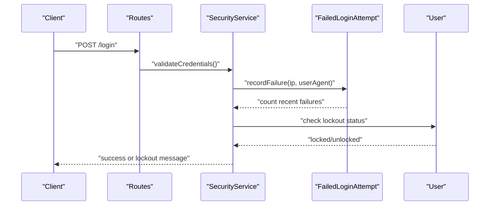

**Diagram sources**
- [SecurityService.php](file://app/Services/SecurityService.php)
- [FailedLoginAttempt.php](file://app/Models/FailedLoginAttempt.php)
- [User.php](file://app/Models/User.php)

**Section sources**
- [FailedLoginAttempt.php](file://app/Models/FailedLoginAttempt.php)
- [SecurityService.php](file://app/Services/SecurityService.php)
- [User.php](file://app/Models/User.php)

### Security Best Practices, Session Hijacking Prevention, and Secure Credential Storage
- Session Hijacking: Rotate session ID after login, enforce SameSite cookies, secure flags, and optional partitioned cookies
- Credential Storage: Hash passwords via Eloquent provider; encrypt sensitive session data if enabled
- Audit and Monitoring: Track suspicious sessions and log critical events as configured

**Section sources**
- [session.php:172-215](file://config/session.php#L172-L215)
- [security.php:25-26](file://config/security.php#L25-L26)
- [SecurityService.php](file://app/Services/SecurityService.php)

## Dependency Analysis
Authentication components depend on configuration, routes, services, models, and policies. The following diagram highlights key dependencies:

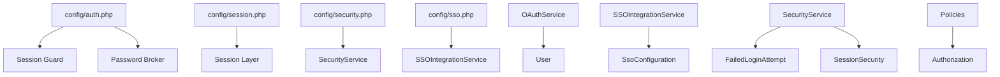

**Diagram sources**
- [auth.php:16-116](file://config/auth.php#L16-L116)
- [session.php:21-218](file://config/session.php#L21-L218)
- [security.php:9-38](file://config/security.php#L9-L38)
- [sso.php:26-229](file://config/sso.php#L26-L229)
- [OAuthService.php](file://app/Services/OAuthService.php)
- [SSOIntegrationService.php](file://app/Services/SSOIntegrationService.php)
- [SecurityService.php](file://app/Services/SecurityService.php)
- [User.php](file://app/Models/User.php)
- [SsoConfiguration.php](file://app/Models/SsoConfiguration.php)
- [FailedLoginAttempt.php](file://app/Models/FailedLoginAttempt.php)
- [SessionSecurity.php](file://app/Models/SessionSecurity.php)

**Section sources**
- [auth.php:16-116](file://config/auth.php#L16-L116)
- [session.php:21-218](file://config/session.php#L21-L218)
- [security.php:9-38](file://config/security.php#L9-L38)
- [sso.php:26-229](file://config/sso.php#L26-L229)
- [OAuthService.php](file://app/Services/OAuthService.php)
- [SSOIntegrationService.php](file://app/Services/SSOIntegrationService.php)
- [SecurityService.php](file://app/Services/SecurityService.php)

## Performance Considerations
- Session Storage: Prefer database or Redis for horizontal scaling; tune sweep lottery and connection settings
- Rate Limiting: Apply per-IP and per-user limits to reduce load from abuse
- 2FA Costs: Backup code generation and validation add CPU overhead; cache frequently accessed secrets
- SSO: Offload token validation to provider; enable caching for metadata and JWKS where applicable
- Password Resets: Keep token expiry short; throttle to prevent token flooding

## Troubleshooting Guide
- 2FA Issues: Verify role requirements, check backup code counts, and confirm secret validity
- Email Verification: Confirm email sending configuration and verify user email_verified_at transitions
- Password Reset: Validate token table exists, check expiry and throttle settings
- Social/SAML/OAuth Failures: Review provider credentials, callback URLs, and attribute mapping
- Session Problems: Check cookie domain/path/same-site settings and session driver connectivity
- Rate Limiting: Inspect RateLimitValidation rule and client-side retry behavior
- SSO Provisioning: Enable auto-provision and attribute sync; validate required attributes

**Section sources**
- [security.php:9-38](file://config/security.php#L9-L38)
- [sso.php:184-192](file://config/sso.php#L184-L192)
- [session.php:130-215](file://config/session.php#L130-L215)
- [RateLimitValidation.php](file://app/Rules/RateLimitValidation.php)

## Conclusion
The authentication and authorization system combines configuration-driven defaults with robust service-layer implementations to support local, social, and enterprise SSO authentication. It enforces strong security controls including 2FA, rate limiting, brute force protection, and tenant-aware access. Proper configuration of session cookies, secure storage, and monitoring ensures resilient and compliant operation across institutions.