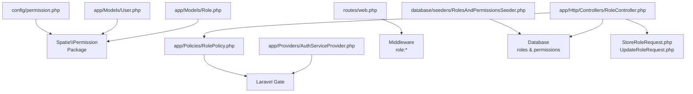
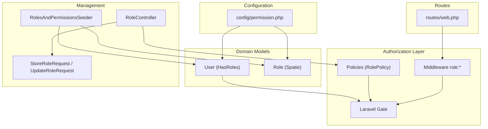
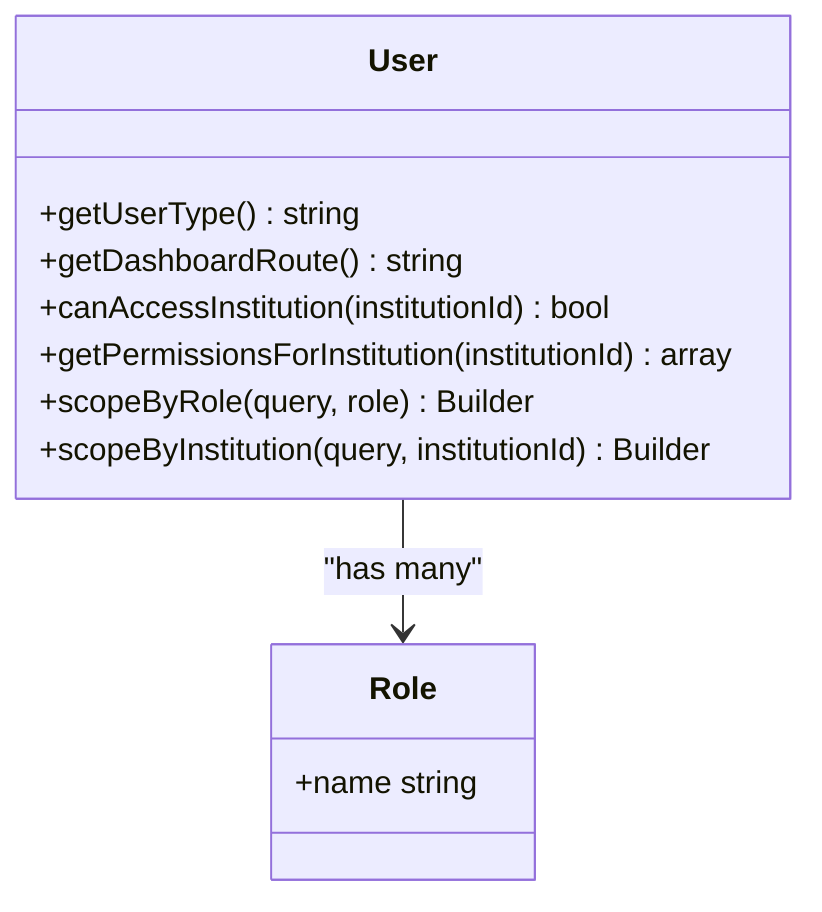
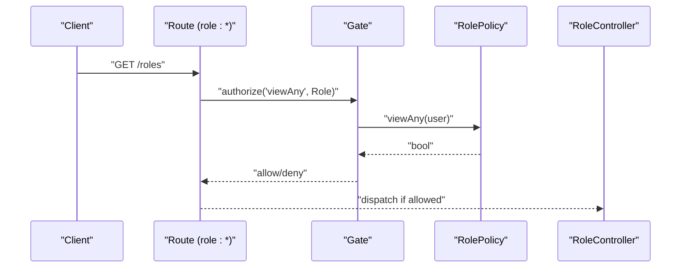
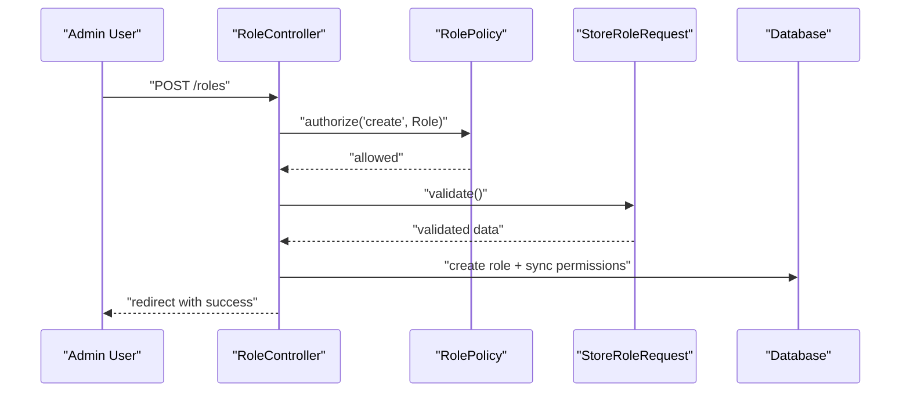
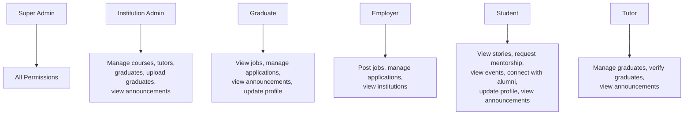
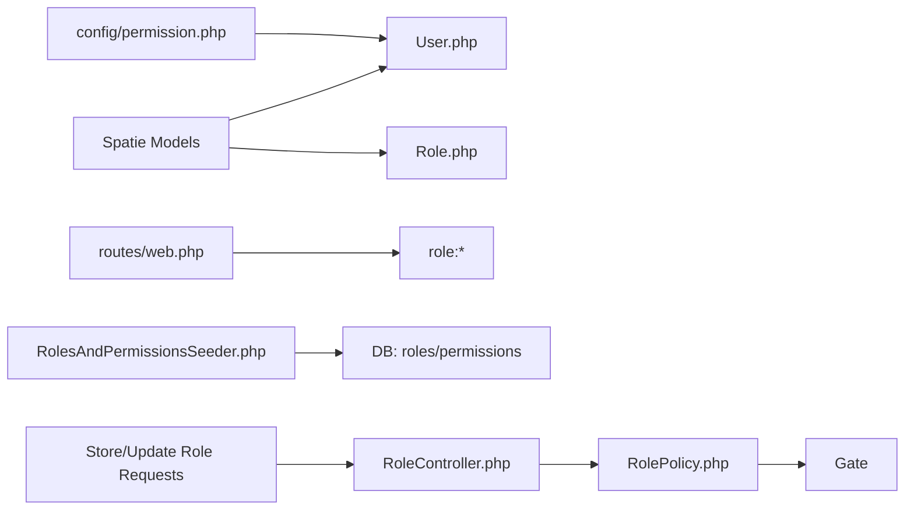

# Role-Based Access Control

<cite>
**Referenced Files in This Document**
- [permission.php](file://config/permission.php)
- [Role.php](file://app/Models/Role.php)
- [User.php](file://app/Models/User.php)
- [RolePolicy.php](file://app/Policies/RolePolicy.php)
- [AuthServiceProvider.php](file://app/Providers/AuthServiceProvider.php)
- [web.php](file://routes/web.php)
- [RolesAndPermissionsSeeder.php](file://database/seeders/RolesAndPermissionsSeeder.php)
- [RoleController.php](file://app/Http/Controllers/RoleController.php)
- [StoreRoleRequest.php](file://app/Http/Requests/Role/StoreRoleRequest.php)
- [UpdateRoleRequest.php](file://app/Http/Requests/Role/UpdateRoleRequest.php)
</cite>

## Table of Contents
1. [Introduction](#introduction)
2. [Project Structure](#project-structure)
3. [Core Components](#core-components)
4. [Architecture Overview](#architecture-overview)
5. [Detailed Component Analysis](#detailed-component-analysis)
6. [Dependency Analysis](#dependency-analysis)
7. [Performance Considerations](#performance-considerations)
8. [Troubleshooting Guide](#troubleshooting-guide)
9. [Conclusion](#conclusion)

## Introduction
This document explains the role-based access control (RBAC) system built on Spatie Permissions. It covers user roles, permissions, policy enforcement, middleware-driven authorization, and multi-tenant institutional access controls. It also documents role-based dashboards, permission inheritance, capability assignment, and practical examples for assigning roles, checking permissions, and enforcing access.

## Project Structure
The RBAC implementation spans configuration, models, policies, routes, seeders, controllers, and requests:
- Configuration defines Spatie Permissions behavior and caching.
- Models extend Spatie’s Role and User to integrate permissions and add helpers.
- Policies map abilities to permissions for authorization checks.
- Routes enforce roles via middleware.
- Seeders define baseline roles and permissions.
- Controllers and requests manage role CRUD with authorization and validation.

**Diagram sources**
- [permission.php:1-203](file://config/permission.php#L1-L203)
- [User.php:11-15](file://app/Models/User.php#L11-L15)
- [Role.php:7-11](file://app/Models/Role.php#L7-L11)
- [RolePolicy.php:13-64](file://app/Policies/RolePolicy.php#L13-L64)
- [AuthServiceProvider.php:14-24](file://app/Providers/AuthServiceProvider.php#L14-L24)
- [web.php:27-41](file://routes/web.php#L27-L41)
- [RolesAndPermissionsSeeder.php:16-90](file://database/seeders/RolesAndPermissionsSeeder.php#L16-L90)
- [RoleController.php:20-141](file://app/Http/Controllers/RoleController.php#L20-L141)
- [StoreRoleRequest.php:12-29](file://app/Http/Requests/Role/StoreRoleRequest.php#L12-L29)
- [UpdateRoleRequest.php:12-31](file://app/Http/Requests/Role/UpdateRoleRequest.php#L12-L31)

**Section sources**
- [permission.php:1-203](file://config/permission.php#L1-L203)
- [User.php:11-15](file://app/Models/User.php#L11-L15)
- [Role.php:7-11](file://app/Models/Role.php#L7-L11)
- [RolePolicy.php:13-64](file://app/Policies/RolePolicy.php#L13-L64)
- [AuthServiceProvider.php:14-24](file://app/Providers/AuthServiceProvider.php#L14-L24)
- [web.php:27-41](file://routes/web.php#L27-L41)
- [RolesAndPermissionsSeeder.php:16-90](file://database/seeders/RolesAndPermissionsSeeder.php#L16-L90)
- [RoleController.php:20-141](file://app/Http/Controllers/RoleController.php#L20-L141)
- [StoreRoleRequest.php:12-29](file://app/Http/Requests/Role/StoreRoleRequest.php#L12-L29)
- [UpdateRoleRequest.php:12-31](file://app/Http/Requests/Role/UpdateRoleRequest.php#L12-L31)

## Core Components
- Spatie Permissions configuration governs model bindings, table names, caching, and wildcard support.
- User model integrates Spatie’s HasRoles trait and adds helpers for role-based dashboards, institutional access checks, and permission retrieval.
- Role model extends Spatie’s Role and adds searchable/sortable columns for admin UI.
- Policies connect abilities to permissions for authorization gates.
- Routes enforce roles via middleware patterns.
- Seeders establish baseline roles and permissions.
- RoleController manages role CRUD with authorization and validation.
- Requests authorize and validate role creation/update.

**Section sources**
- [permission.php:3-27](file://config/permission.php#L3-L27)
- [User.php:11-15](file://app/Models/User.php#L11-L15)
- [Role.php:7-11](file://app/Models/Role.php#L7-L11)
- [RolePolicy.php:13-64](file://app/Policies/RolePolicy.php#L13-L64)
- [web.php:27-41](file://routes/web.php#L27-L41)
- [RolesAndPermissionsSeeder.php:16-90](file://database/seeders/RolesAndPermissionsSeeder.php#L16-L90)
- [RoleController.php:20-141](file://app/Http/Controllers/RoleController.php#L20-L141)
- [StoreRoleRequest.php:12-29](file://app/Http/Requests/Role/StoreRoleRequest.php#L12-L29)
- [UpdateRoleRequest.php:12-31](file://app/Http/Requests/Role/UpdateRoleRequest.php#L12-L31)

## Architecture Overview
The RBAC architecture combines Spatie Permissions with Laravel’s Gate and middleware:
- Configuration sets up Spatie models, tables, caching, and optional wildcard permissions.
- User model uses HasRoles and exposes helpers for dashboard routing and institutional access.
- Policies translate abilities into permission checks.
- Routes apply role middleware to protect dashboards and features.
- Seeders populate roles and permissions.
- Controllers and requests enforce authorization and validation.

**Diagram sources**
- [permission.php:1-203](file://config/permission.php#L1-L203)
- [User.php:11-15](file://app/Models/User.php#L11-L15)
- [Role.php:7-11](file://app/Models/Role.php#L7-L11)
- [RolePolicy.php:13-64](file://app/Policies/RolePolicy.php#L13-L64)
- [web.php:27-41](file://routes/web.php#L27-L41)
- [RolesAndPermissionsSeeder.php:16-90](file://database/seeders/RolesAndPermissionsSeeder.php#L16-L90)
- [RoleController.php:20-141](file://app/Http/Controllers/RoleController.php#L20-L141)
- [StoreRoleRequest.php:12-29](file://app/Http/Requests/Role/StoreRoleRequest.php#L12-L29)
- [UpdateRoleRequest.php:12-31](file://app/Http/Requests/Role/UpdateRoleRequest.php#L12-L31)

## Detailed Component Analysis

### Spatie Permissions Configuration
- Model bindings: Permission and Role models are configured.
- Table names: Roles, permissions, and pivot tables are configurable.
- Column names: Pivot keys and morph keys can be customized.
- Gate registration: Permission checks can be registered on the Gate.
- Teams: Teams feature is disabled by default.
- Passport client credentials: Disabled by default.
- Exception messaging: Role and permission names can be hidden in exceptions.
- Wildcard permissions: Disabled by default.
- Cache: 24-hour cache with configurable store.

**Section sources**
- [permission.php:3-27](file://config/permission.php#L3-L27)
- [permission.php:31-72](file://config/permission.php#L31-L72)
- [permission.php:74-97](file://config/permission.php#L74-L97)
- [permission.php:104](file://config/permission.php#L104)
- [permission.php:134](file://config/permission.php#L134)
- [permission.php:146](file://config/permission.php#L146)
- [permission.php:154](file://config/permission.php#L154)
- [permission.php:162](file://config/permission.php#L162)
- [permission.php:169](file://config/permission.php#L169)
- [permission.php:179-201](file://config/permission.php#L179-L201)

### User Model Enhancements
- Integrates Spatie’s HasRoles trait.
- Provides helpers:
  - Role-based dashboard routing.
  - Institutional access checks.
  - Permission retrieval scoped to an institution.
  - Role-scoped queries and type detection.

**Diagram sources**
- [User.php:478-489](file://app/Models/User.php#L478-L489)
- [User.php:458-476](file://app/Models/User.php#L458-L476)
- [User.php:298-308](file://app/Models/User.php#L298-L308)
- [Role.php:7-11](file://app/Models/Role.php#L7-L11)

**Section sources**
- [User.php:11-15](file://app/Models/User.php#L11-L15)
- [User.php:458-476](file://app/Models/User.php#L458-L476)
- [User.php:478-489](file://app/Models/User.php#L478-L489)
- [User.php:298-308](file://app/Models/User.php#L298-L308)

### Role Model
- Extends Spatie’s Role.
- Adds searchable and sortable columns for admin UI.

**Section sources**
- [Role.php:7-11](file://app/Models/Role.php#L7-L11)

### Policies and Authorization Gates
- RolePolicy maps CRUD actions to permission checks.
- AuthServiceProvider registers policies; note that the Role model is not mapped in the current provider.

**Diagram sources**
- [web.php:27-41](file://routes/web.php#L27-L41)
- [RolePolicy.php:13-16](file://app/Policies/RolePolicy.php#L13-L16)
- [AuthServiceProvider.php:14](file://app/Providers/AuthServiceProvider.php#L14)

**Section sources**
- [RolePolicy.php:13-64](file://app/Policies/RolePolicy.php#L13-L64)
- [AuthServiceProvider.php:14-24](file://app/Providers/AuthServiceProvider.php#L14-L24)

### Routes and Role Middleware
- Super Admin dashboard protected by role:super-admin.
- Institution Admin dashboard protected by role:institution-admin.
- Employer dashboard protected by role:employer.
- Graduate dashboard protected by role:graduate.
- Student dashboard protected by role:student.
- Some routes permit multiple roles (e.g., super-admin|institution-admin).

**Section sources**
- [web.php:118-133](file://routes/web.php#L118-L133)
- [web.php:230-272](file://routes/web.php#L230-L272)
- [web.php:275-288](file://routes/web.php#L275-L288)
- [web.php:291-300](file://routes/web.php#L291-L300)
- [web.php:404-410](file://routes/web.php#L404-L410)
- [web.php:666-682](file://routes/web.php#L666-L682)
- [web.php:685-696](file://routes/web.php#L685-L696)
- [web.php:700-722](file://routes/web.php#L700-L722)
- [web.php:726-744](file://routes/web.php#L726-L744)

### Role Management Workflow
- RoleController enforces authorization for all actions.
- StoreRoleRequest authorizes creation via permission check.
- UpdateRoleRequest authorizes updates via permission check.

**Diagram sources**
- [RoleController.php:20-85](file://app/Http/Controllers/RoleController.php#L20-L85)
- [RolePolicy.php:29-32](file://app/Policies/RolePolicy.php#L29-L32)
- [StoreRoleRequest.php:12-15](file://app/Http/Requests/Role/StoreRoleRequest.php#L12-L15)

**Section sources**
- [RoleController.php:20-141](file://app/Http/Controllers/RoleController.php#L20-L141)
- [StoreRoleRequest.php:12-29](file://app/Http/Requests/Role/StoreRoleRequest.php#L12-L29)
- [UpdateRoleRequest.php:12-31](file://app/Http/Requests/Role/UpdateRoleRequest.php#L12-L31)

### Roles, Permissions, and Hierarchies
- Baseline roles and permissions are seeded, including Super Admin, Institution Admin, Graduate, Employer, Student, and Tutor.
- Super Admin receives all permissions.
- Other roles receive narrowly scoped permissions aligned with their responsibilities.

**Diagram sources**
- [RolesAndPermissionsSeeder.php:47-90](file://database/seeders/RolesAndPermissionsSeeder.php#L47-L90)

**Section sources**
- [RolesAndPermissionsSeeder.php:16-90](file://database/seeders/RolesAndPermissionsSeeder.php#L16-L90)

### Multi-Tenant Institutional Access Controls
- User.canAccessInstitution restricts access to institution-scoped resources.
- User.getPermissionsForInstitution returns effective permissions for a given institution.
- These helpers enable per-institution permission scoping.

**Section sources**
- [User.php:458-476](file://app/Models/User.php#L458-L476)

### Role-Based Dashboard Routing
- User.getDashboardRoute selects the appropriate dashboard route based on the user’s primary role.
- Routes define named endpoints for each dashboard.

**Section sources**
- [User.php:478-489](file://app/Models/User.php#L478-L489)
- [web.php:118-133](file://routes/web.php#L118-L133)
- [web.php:230-272](file://routes/web.php#L230-L272)
- [web.php:275-288](file://routes/web.php#L275-L288)
- [web.php:291-300](file://routes/web.php#L291-L300)
- [web.php:404-410](file://routes/web.php#L404-L410)

## Dependency Analysis
- User depends on Spatie’s Role model via HasRoles.
- Policies depend on permission names defined in configuration and seeders.
- Routes depend on middleware to enforce roles.
- Controllers depend on policies and requests for authorization and validation.
- Seeders depend on Spatie models to create roles and permissions.

**Diagram sources**
- [permission.php:1-203](file://config/permission.php#L1-L203)
- [User.php:11-15](file://app/Models/User.php#L11-L15)
- [Role.php:7-11](file://app/Models/Role.php#L7-L11)
- [RolePolicy.php:13-64](file://app/Policies/RolePolicy.php#L13-L64)
- [web.php:27-41](file://routes/web.php#L27-L41)
- [RolesAndPermissionsSeeder.php:16-90](file://database/seeders/RolesAndPermissionsSeeder.php#L16-L90)
- [RoleController.php:20-141](file://app/Http/Controllers/RoleController.php#L20-L141)
- [StoreRoleRequest.php:12-29](file://app/Http/Requests/Role/StoreRoleRequest.php#L12-L29)
- [UpdateRoleRequest.php:12-31](file://app/Http/Requests/Role/UpdateRoleRequest.php#L12-L31)

**Section sources**
- [permission.php:1-203](file://config/permission.php#L1-L203)
- [User.php:11-15](file://app/Models/User.php#L11-L15)
- [Role.php:7-11](file://app/Models/Role.php#L7-L11)
- [RolePolicy.php:13-64](file://app/Policies/RolePolicy.php#L13-L64)
- [web.php:27-41](file://routes/web.php#L27-L41)
- [RolesAndPermissionsSeeder.php:16-90](file://database/seeders/RolesAndPermissionsSeeder.php#L16-L90)
- [RoleController.php:20-141](file://app/Http/Controllers/RoleController.php#L20-L141)
- [StoreRoleRequest.php:12-29](file://app/Http/Requests/Role/StoreRoleRequest.php#L12-L29)
- [UpdateRoleRequest.php:12-31](file://app/Http/Requests/Role/UpdateRoleRequest.php#L12-L31)

## Performance Considerations
- Spatie Permissions caches permissions for 24 hours by default; cache invalidation occurs on role/permission changes.
- Use the cache store configured in the permissions config for optimal performance.
- Prefer role-based middleware for coarse-grained checks; reserve fine-grained policy checks for resource-level decisions.

[No sources needed since this section provides general guidance]

## Troubleshooting Guide
Common issues and resolutions:
- Unauthorized access to dashboards:
  - Verify the user has the correct role assigned and that the route middleware matches the role name.
  - Confirm the user’s primary role determines dashboard routing.
- Permission denied errors:
  - Ensure the role has the required permission; seeders grant baseline permissions.
  - Check that policies map abilities to permissions and that the Gate is enabled.
- Institutional access failures:
  - Confirm the user belongs to the target institution or is Super Admin.
  - Use the helper methods to check access and retrieve permissions for an institution.
- Role management failures:
  - Validate requests authorize via permission checks and that controllers enforce authorization.

**Section sources**
- [web.php:118-133](file://routes/web.php#L118-L133)
- [web.php:230-272](file://routes/web.php#L230-L272)
- [web.php:275-288](file://routes/web.php#L275-L288)
- [web.php:291-300](file://routes/web.php#L291-L300)
- [web.php:404-410](file://routes/web.php#L404-L410)
- [User.php:458-476](file://app/Models/User.php#L458-L476)
- [User.php:478-489](file://app/Models/User.php#L478-L489)
- [RolesAndPermissionsSeeder.php:47-90](file://database/seeders/RolesAndPermissionsSeeder.php#L47-L90)
- [RolePolicy.php:13-64](file://app/Policies/RolePolicy.php#L13-L64)
- [StoreRoleRequest.php:12-15](file://app/Http/Requests/Role/StoreRoleRequest.php#L12-L15)
- [UpdateRoleRequest.php:12-15](file://app/Http/Requests/Role/UpdateRoleRequest.php#L12-L15)

## Conclusion
The platform implements a robust RBAC system using Spatie Permissions, with clear role hierarchies, permission scoping, and middleware-driven enforcement. User and Role models provide convenient helpers for dashboards and institutional access. Policies and controllers enforce authorization consistently, while seeders establish baseline capabilities. This foundation supports secure, scalable multi-tenant access control across dashboards and features.