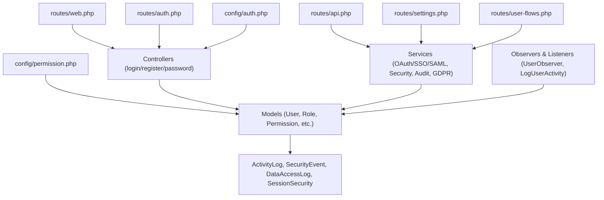
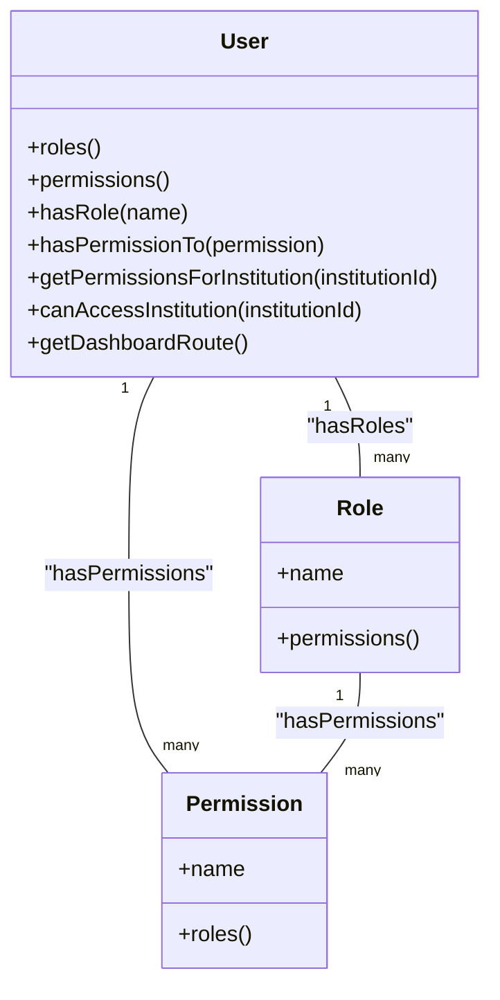
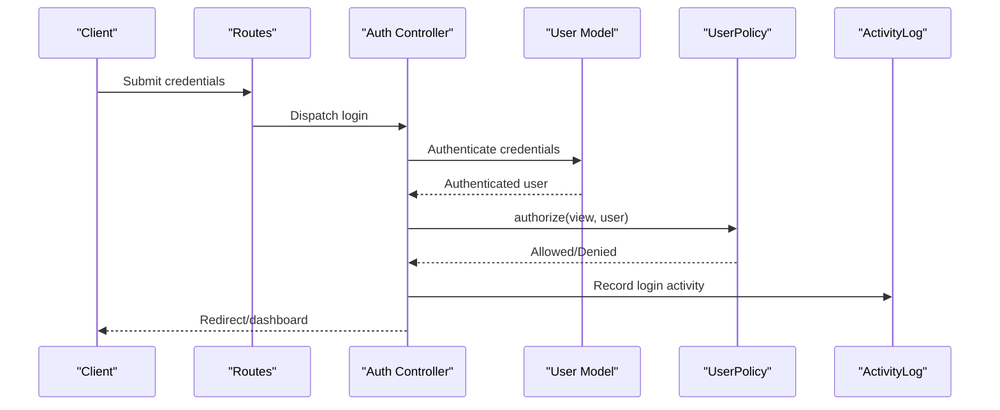
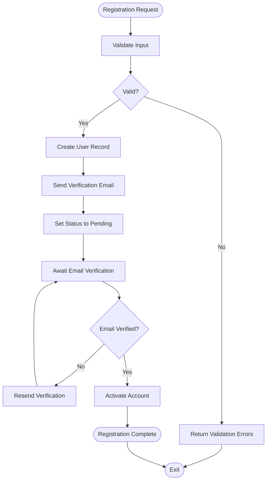
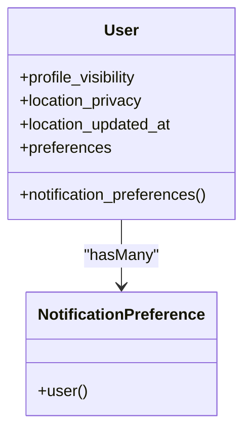
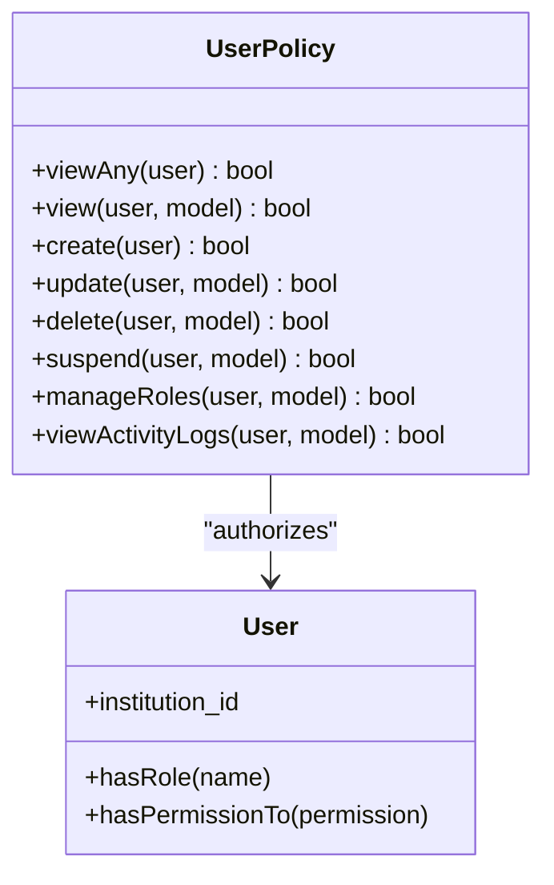
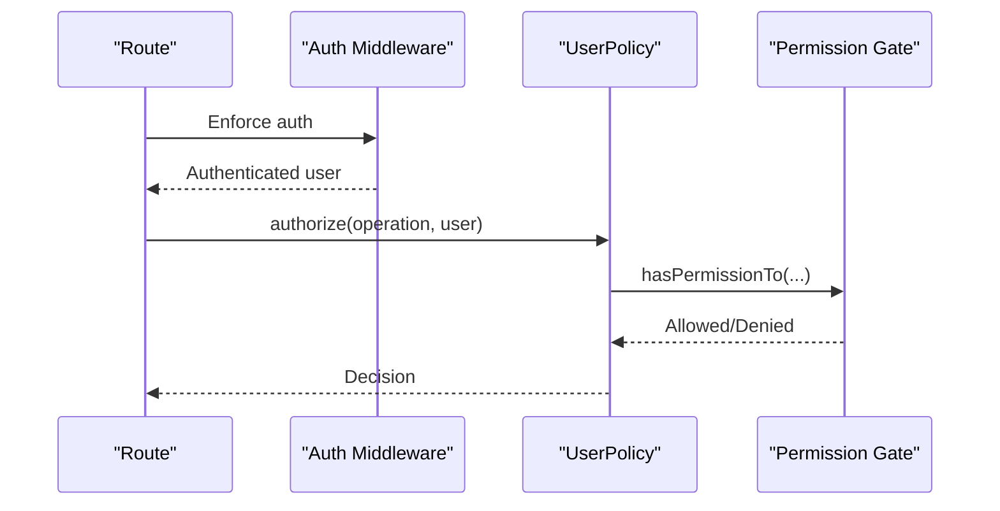
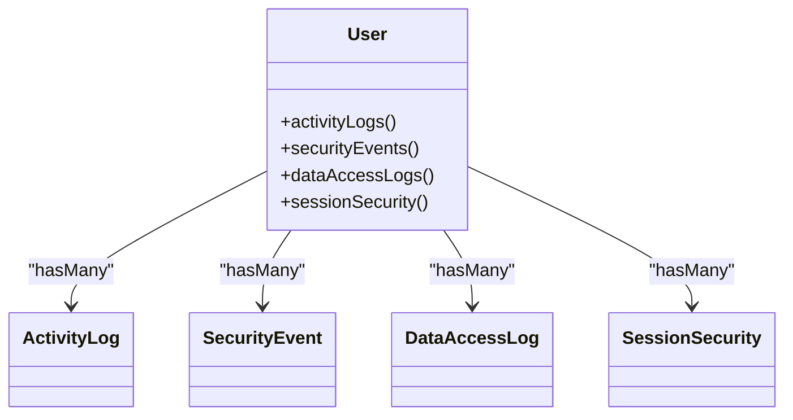
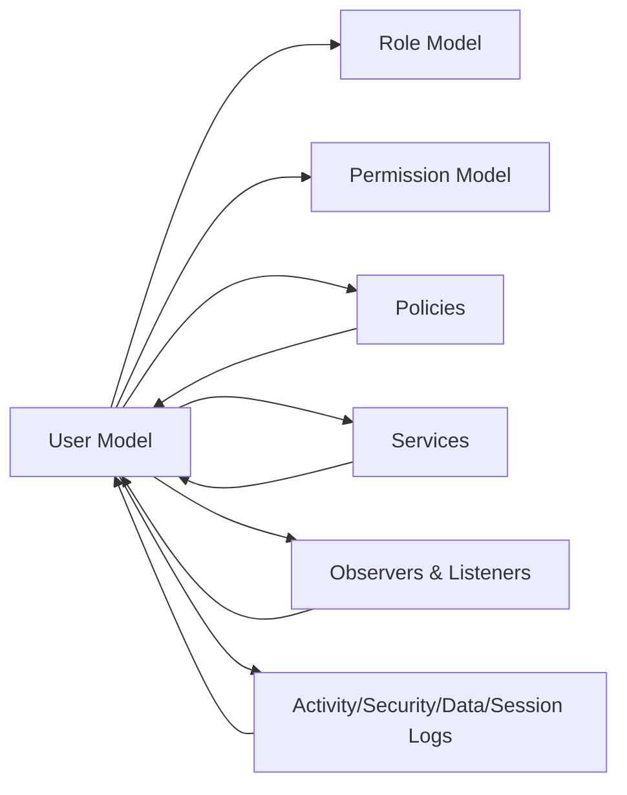

# User Management System

<cite>
**Referenced Files in This Document**
- [User.php](file://app/Models/User.php)
- [permission.php](file://config/permission.php)
- [auth.php](file://config/auth.php)
- [UserPolicy.php](file://app/Policies/UserPolicy.php)
- [ActivityLog.php](file://app/Models/ActivityLog.php)
- [SecurityEvent.php](file://app/Models/SecurityEvent.php)
- [DataAccessLog.php](file://app/Models/DataAccessLog.php)
- [SessionSecurity.php](file://app/Models/SessionSecurity.php)
- [TwoFactorAuth.php](file://app/Models/TwoFactorAuth.php)
- [OAuthService.php](file://app/Services/SocialAuthService.php)
- [SSOIntegrationService.php](file://app/Services/SSOIntegrationService.php)
- [SamlService.php](file://app/Services/SamlService.php)
- [UserObserver.php](file://app/Observers/UserObserver.php)
- [LogUserActivity.php](file://app/Listeners/LogUserActivity.php)
- [routes/web.php](file://routes/web.php)
- [routes/auth.php](file://routes/auth.php)
- [routes/api.php](file://routes/api.php)
- [routes/settings.php](file://routes/settings.php)
- [routes/user-flows.php](file://routes/user-flows.php)
- [User.php](file://app/Models/User.php)
- [Role.php](file://app/Models/Role.php)
- [Permission.php](file://app/Models/Permission.php)
- [Graduate.php](file://app/Models/Graduate.php)
- [Employer.php](file://app/Models/Employer.php)
- [Institution.php](file://app/Models/Institution.php)
- [Tenant.php](file://app/Models/Tenant.php)
- [UserOnboardingState.php](file://app/Models/UserOnboardingState.php)
- [OnboardingEvent.php](file://app/Models/OnboardingEvent.php)
- [NotificationPreference.php](file://app/Models/NotificationPreference.php)
- [SocialProfile.php](file://app/Models/SocialProfile.php)
- [Circle.php](file://app/Models/Circle.php)
- [Group.php](file://app/Models/Group.php)
- [Connection.php](file://app/Models/Connection.php)
- [Post.php](file://app/Models/Post.php)
- [Comment.php](file://app/Models/Comment.php)
- [PostEngagement.php](file://app/Models/PostEngagement.php)
- [EducationHistory.php](file://app/Models/EducationHistory.php)
- [CareerTimeline.php](file://app/Models/CareerTimeline.php)
- [Achievement.php](file://app/Models/Achievement.php)
- [UserAchievement.php](file://app/Models/UserAchievement.php)
- [MentorProfile.php](file://app/Models/MentorProfile.php)
- [MentorshipRequest.php](file://app/Models/MentorshipRequest.php)
- [MentorshipSession.php](file://app/Models/MentorshipSession.php)
- [VideoCall.php](file://app/Models/VideoCall.php)
- [VideoCallParticipant.php](file://app/Models/VideoCallParticipant.php)
- [CoffeeChatRequest.php](file://app/Models/CoffeeChatRequest.php)
- [ScreenSharingSession.php](file://app/Models/ScreenSharingSession.php)
- [CalendarConnection.php](file://app/Models/CalendarConnection.php)
- [Event.php](file://app/Models/Event.php)
- [ApiKey.php](file://app/Models/ApiKey.php)
- [Webhook.php](file://app/Models/Webhook.php)
- [FailedLoginAttempt.php](file://app/Models/FailedLoginAttempt.php)
- [SsoConfiguration.php](file://app/Models/SsoConfiguration.php)
- [SsoConfiguration.php](file://app/Models/SsoConfiguration.php)
- [SamlService.php](file://app/Services/SamlService.php)
- [OAuthService.php](file://app/Services/SocialAuthService.php)
- [SSOIntegrationService.php](file://app/Services/SSOIntegrationService.php)
- [SecurityAuditService.php](file://app/Services/SecurityAuditService.php)
- [SecurityService.php](file://app/Services/SecurityService.php)
- [GdprComplianceService.php](file://app/Services/GdprComplianceService.php)
- [BehaviorTrackingService.php](file://app/Services/BehaviorTrackingService.php)
- [UserTestingService.php](file://app/Services/UserTestingService.php)
- [UserTrainingService.php](file://app/Services/UserTrainingService.php)
- [UserFactory.php](file://database/factories/UserFactory.php)
- [UserSeeder.php](file://database/seeders/UserSeeder.php)
- [CreateUsersTable.php](file://database/migrations/.../CreateUsersTable.php)
- [CreateActivityLogsTable.php](file://database/migrations/.../CreateActivityLogsTable.php)
- [CreateSecurityLogsTable.php](file://database/migrations/.../CreateSecurityLogsTable.php)
- [CreateDataAccessLogsTable.php](file://database/migrations/.../CreateDataAccessLogsTable.php)
- [CreateSessionSecurityTable.php](file://database/migrations/.../CreateSessionSecurityTable.php)
- [CreateTwoFactorAuthTable.php](file://database/migrations/.../CreateTwoFactorAuthTable.php)
- [CreateOAuthProvidersTable.php](file://database/migrations/.../CreateOAuthProvidersTable.php)
- [CreateSsoConfigurationsTable.php](file://database/migrations/.../CreateSsoConfigurationsTable.php)
- [CreateFailedLoginAttemptsTable.php](file://database/migrations/.../CreateFailedLoginAttemptsTable.php)
- [CreateSocialProfilesTable.php](file://database/migrations/.../CreateSocialProfilesTable.php)
- [CreateUserOnboardingTable.php](file://database/migrations/.../CreateUserOnboardingTable.php)
- [CreateNotificationPreferencesTable.php](file://database/migrations/.../CreateNotificationPreferencesTable.php)
- [CreateConnectionsTable.php](file://database/migrations/.../CreateConnectionsTable.php)
- [CreatePostsTable.php](file://database/migrations/.../CreatePostsTable.php)
- [CreateCommentsTable.php](file://database/migrations/.../CreateCommentsTable.php)
- [CreatePostEngagementsTable.php](file://database/migrations/.../CreatePostEngagementsTable.php)
- [CreateEducationHistoriesTable.php](file://database/migrations/.../CreateEducationHistoriesTable.php)
- [CreateCareerTimelinesTable.php](file://database/migrations/.../CreateCareerTimelinesTable.php)
- [CreateAchievementsTable.php](file://database/migrations/.../CreateAchievementsTable.php)
- [CreateUserAchievementsTable.php](file://database/migrations/.../CreateUserAchievementsTable.php)
- [CreateMentorProfilesTable.php](file://database/migrations/.../CreateMentorProfilesTable.php)
- [CreateMentorshipRequestsTable.php](file://database/migrations/.../CreateMentorshipRequestsTable.php)
- [CreateMentorshipSessionsTable.php](file://database/migrations/.../CreateMentorshipSessionsTable.php)
- [CreateVideoCallsTable.php](file://database/migrations/.../CreateVideoCallsTable.php)
- [CreateVideoCallParticipantsTable.php](file://database/migrations/.../CreateVideoCallParticipantsTable.php)
- [CreateCoffeeChatRequestsTable.php](file://database/migrations/.../CreateCoffeeChatRequestsTable.php)
- [CreateScreenSharingSessionsTable.php](file://database/migrations/.../CreateScreenSharingSessionsTable.php)
- [CreateCalendarConnectionsTable.php](file://database/migrations/.../CreateCalendarConnectionsTable.php)
- [CreateEventsTable.php](file://database/migrations/.../CreateEventsTable.php)
- [CreateApiKeysTable.php](file://database/migrations/.../CreateApiKeysTable.php)
- [CreateWebhooksTable.php](file://database/migrations/.../CreateWebhooksTable.php)
</cite>

## Table of Contents
1. [Introduction](#introduction)
2. [Project Structure](#project-structure)
3. [Core Components](#core-components)
4. [Architecture Overview](#architecture-overview)
5. [Detailed Component Analysis](#detailed-component-analysis)
6. [Dependency Analysis](#dependency-analysis)
7. [Performance Considerations](#performance-considerations)
8. [Troubleshooting Guide](#troubleshooting-guide)
9. [Conclusion](#conclusion)
10. [Appendices](#appendices)

## Introduction
This document describes the user management system with a focus on role-based access control (RBAC) and authentication mechanisms. The platform leverages Spatie Permissions for RBAC, integrates social authentication and SSO, supports multi-factor authentication, and provides robust user lifecycle management including registration, email verification, and account activation. It also documents profile management, privacy controls, permission inheritance, policies, authorization gates, middleware, activity tracking, audit logging, and security monitoring.

## Project Structure
The user management system spans several layers:
- Models: User-centric domain models including User, Roles, Permissions, and related entities
- Policies: Authorization rules per domain entity
- Services: Authentication integrations (OAuth, SSO, SAML), security, and compliance
- Configurations: Authentication and permission settings
- Routes: Authentication, user flows, and settings endpoints
- Observers and Listeners: Automatic activity logging and state updates
- Migrations and Factories: Database schema and seeding for user-related entities

```mermaid
graph TB
subgraph "Configuration"
CFG_AUTH["auth.php"]
CFG_PERM["permission.php"]
end
subgraph "Core Models"
MODEL_USER["User"]
MODEL_ROLE["Role"]
MODEL_PERM["Permission"]
MODEL_INST["Institution"]
MODEL_TENANT["Tenant"]
end
subgraph "Related Models"
MODEL_GRAD["Graduate"]
MODEL_EMP["Employer"]
MODEL_SOCIAL["SocialProfile"]
MODEL_NOTIF["NotificationPreference"]
MODEL_CIRCLE["Circle"]
MODEL_GROUP["Group"]
MODEL_CONN["Connection"]
MODEL_POST["Post"]
MODEL_COMMENT["Comment"]
MODEL_ENG["PostEngagement"]
MODEL_EDU["EducationHistory"]
MODEL_CAREER["CareerTimeline"]
MODEL_ACH["Achievement"]
MODEL_UACH["UserAchievement"]
MODEL_MENTOR["MentorProfile"]
MODEL_MREQ["MentorshipRequest"]
MODEL_MSESS["MentorshipSession"]
MODEL_VIDEO["VideoCall"]
MODEL_VPART["VideoCallParticipant"]
MODEL_COFFEE["CoffeeChatRequest"]
MODEL_SCREEN["ScreenSharingSession"]
MODEL_CAL["CalendarConnection"]
MODEL_EVENT["Event"]
MODEL_APIKEY["ApiKey"]
MODEL_WEBHOOK["Webhook"]
end
subgraph "Policies"
POL_USER["UserPolicy"]
end
subgraph "Services"
SVC_OAUTH["SocialAuthService"]
SVC_SSO["SSOIntegrationService"]
SVC_SAML["SamlService"]
SVC_SEC["SecurityService"]
SVC_AUD["SecurityAuditService"]
SVC_GDPR["GdprComplianceService"]
SVC_BEHAVIOR["BehaviorTrackingService"]
SVC_TRAIN["UserTrainingService"]
SVC_TEST["UserTestingService"]
end
subgraph "Observers & Listeners"
OBS_USER["UserObserver"]
LST_ACT["LogUserActivity"]
end
subgraph "Logging"
LOG_ACT["ActivityLog"]
LOG_SEC["SecurityEvent"]
LOG_DATA["DataAccessLog"]
LOG_SESS["SessionSecurity"]
end
CFG_AUTH --> MODEL_USER
CFG_PERM --> MODEL_ROLE
CFG_PERM --> MODEL_PERM
MODEL_USER --> MODEL_ROLE
MODEL_USER --> MODEL_INST
MODEL_USER --> MODEL_TENANT
MODEL_USER --> MODEL_GRAD
MODEL_USER --> MODEL_EMP
MODEL_USER --> MODEL_SOCIAL
MODEL_USER --> MODEL_NOTIF
MODEL_USER --> MODEL_CIRCLE
MODEL_USER --> MODEL_GROUP
MODEL_USER --> MODEL_CONN
MODEL_USER --> MODEL_POST
MODEL_USER --> MODEL_COMMENT
MODEL_USER --> MODEL_ENG
MODEL_USER --> MODEL_EDU
MODEL_USER --> MODEL_CAREER
MODEL_USER --> MODEL_ACH
MODEL_USER --> MODEL_UACH
MODEL_USER --> MODEL_MENTOR
MODEL_USER --> MODEL_MREQ
MODEL_USER --> MODEL_MSESS
MODEL_USER --> MODEL_VIDEO
MODEL_USER --> MODEL_VPART
MODEL_USER --> MODEL_COFFEE
MODEL_USER --> MODEL_SCREEN
MODEL_USER --> MODEL_CAL
MODEL_USER --> MODEL_EVENT
MODEL_USER --> MODEL_APIKEY
MODEL_USER --> MODEL_WEBHOOK
POL_USER --> MODEL_USER
SVC_OAUTH --> MODEL_USER
SVC_SSO --> MODEL_USER
SVC_SAML --> MODEL_USER
SVC_SEC --> MODEL_USER
SVC_AUD --> MODEL_USER
SVC_GDPR --> MODEL_USER
SVC_BEHAVIOR --> MODEL_USER
SVC_TRAIN --> MODEL_USER
SVC_TEST --> MODEL_USER
OBS_USER --> MODEL_USER
LST_ACT --> MODEL_USER
MODEL_USER --> LOG_ACT
MODEL_USER --> LOG_SEC
MODEL_USER --> LOG_DATA
MODEL_USER --> LOG_SESS
```

**Diagram sources**
- [auth.php:1-116](file://config/auth.php#L1-L116)
- [permission.php:1-203](file://config/permission.php#L1-L203)
- [User.php:1-818](file://app/Models/User.php#L1-L818)
- [UserPolicy.php:1-185](file://app/Policies/UserPolicy.php#L1-L185)
- [SocialAuthService.php](file://app/Services/SocialAuthService.php)
- [SSOIntegrationService.php](file://app/Services/SSOIntegrationService.php)
- [SamlService.php](file://app/Services/SamlService.php)
- [UserObserver.php](file://app/Observers/UserObserver.php)
- [LogUserActivity.php](file://app/Listeners/LogUserActivity.php)
- [ActivityLog.php](file://app/Models/ActivityLog.php)
- [SecurityEvent.php](file://app/Models/SecurityEvent.php)
- [DataAccessLog.php](file://app/Models/DataAccessLog.php)
- [SessionSecurity.php](file://app/Models/SessionSecurity.php)

**Section sources**
- [auth.php:1-116](file://config/auth.php#L1-L116)
- [permission.php:1-203](file://config/permission.php#L1-L203)
- [User.php:1-818](file://app/Models/User.php#L1-L818)
- [UserPolicy.php:1-185](file://app/Policies/UserPolicy.php#L1-L185)

## Core Components
- User Model: Central identity with Spatie Roles integration, extensive relationships, scopes, and helper methods for roles, permissions, and dashboard routing.
- Spatie Permissions: Configuration for models, tables, caching, and permission checks.
- Policies: Authorization rules for user CRUD, role management, suspension, and activity log access.
- Authentication: Traditional session-based login, password reset, and guard/provider configuration.
- Social Authentication and SSO: Services for OAuth, SAML, and SSO integrations.
- Multi-Factor Authentication: Support via dedicated model/table for two-factor secrets and recovery codes.
- Activity and Security Logging: Comprehensive logging of user actions, security events, data access, and session security.
- Privacy Controls: Profile visibility, location privacy, and notification preferences.

**Section sources**
- [User.php:1-818](file://app/Models/User.php#L1-L818)
- [permission.php:1-203](file://config/permission.php#L1-L203)
- [UserPolicy.php:1-185](file://app/Policies/UserPolicy.php#L1-L185)
- [auth.php:1-116](file://config/auth.php#L1-L116)

## Architecture Overview
The system follows a layered architecture:
- Presentation: Routes define endpoints for authentication, user flows, and settings.
- Application: Services encapsulate authentication integrations, security, and compliance.
- Domain: Models represent users, roles, permissions, and related entities.
- Infrastructure: Observers and listeners automate activity logging and state changes.
- Persistence: Migrations define schema for users, roles, permissions, and related entities.

**Diagram sources**
- [routes/web.php](file://routes/web.php)
- [routes/auth.php](file://routes/auth.php)
- [routes/api.php](file://routes/api.php)
- [routes/settings.php](file://routes/settings.php)
- [routes/user-flows.php](file://routes/user-flows.php)
- [auth.php:1-116](file://config/auth.php#L1-L116)
- [permission.php:1-203](file://config/permission.php#L1-L203)
- [User.php:1-818](file://app/Models/User.php#L1-L818)
- [UserObserver.php](file://app/Observers/UserObserver.php)
- [LogUserActivity.php](file://app/Listeners/LogUserActivity.php)
- [ActivityLog.php](file://app/Models/ActivityLog.php)
- [SecurityEvent.php](file://app/Models/SecurityEvent.php)
- [DataAccessLog.php](file://app/Models/DataAccessLog.php)
- [SessionSecurity.php](file://app/Models/SessionSecurity.php)

## Detailed Component Analysis

### Role-Based Access Control (RBAC) with Spatie Permissions
- Models and Tables: The configuration maps Permission and Role models and defines pivot tables for roles, permissions, and model relationships.
- Caching: Permissions are cached for 24 hours by default to improve performance.
- Permission Checks: Gate registration is enabled, allowing policy checks against permissions.
- Teams: The configuration disables team scoping by default.

Implementation highlights:
- User model includes Spatie Roles trait and exposes helpers for role and permission checks.
- Policies enforce role-based access for user management operations.

**Diagram sources**
- [User.php:1-818](file://app/Models/User.php#L1-L818)
- [permission.php:1-203](file://config/permission.php#L1-L203)
- [Role.php](file://app/Models/Role.php)
- [Permission.php](file://app/Models/Permission.php)

**Section sources**
- [permission.php:1-203](file://config/permission.php#L1-L203)
- [User.php:1-818](file://app/Models/User.php#L1-L818)
- [UserPolicy.php:1-185](file://app/Policies/UserPolicy.php#L1-L185)

### Authentication Mechanisms
- Traditional Login and Password Reset: Guard and provider configured for session-based authentication with Eloquent user provider. Password reset broker uses a token table and expiry/throttle settings.
- Social Authentication: Services for OAuth and SAML integrations support external identity providers.
- Single Sign-On: Dedicated SSO integration service supports enterprise SSO configurations.
- Multi-Factor Authentication: Two-factor authentication model/table exists for storing secrets and recovery codes.

**Diagram sources**
- [auth.php:1-116](file://config/auth.php#L1-L116)
- [User.php:1-818](file://app/Models/User.php#L1-L818)
- [UserPolicy.php:1-185](file://app/Policies/UserPolicy.php#L1-L185)
- [ActivityLog.php](file://app/Models/ActivityLog.php)

**Section sources**
- [auth.php:1-116](file://config/auth.php#L1-L116)
- [OAuthService.php](file://app/Services/SocialAuthService.php)
- [SSOIntegrationService.php](file://app/Services/SSOIntegrationService.php)
- [SamlService.php](file://app/Services/SamlService.php)
- [TwoFactorAuth.php](file://app/Models/TwoFactorAuth.php)

### User Registration, Email Verification, and Account Activation
- Registration: Routes and controllers handle user registration flows.
- Email Verification: User model includes an email verification timestamp field; policies and routes enforce verified status where applicable.
- Account Activation: Status and suspension fields control activation state; observers/listeners can trigger activation workflows.

**Diagram sources**
- [User.php:1-818](file://app/Models/User.php#L1-L818)
- [routes/auth.php](file://routes/auth.php)
- [routes/web.php](file://routes/web.php)

**Section sources**
- [User.php:1-818](file://app/Models/User.php#L1-L818)
- [routes/auth.php](file://routes/auth.php)
- [routes/web.php](file://routes/web.php)

### Profile Management and Privacy Controls
- Profile Fields: Name, email, phone, avatar, bio, location, website, interests, and preferences are stored with privacy controls.
- Location Privacy: Separate privacy flag and last updated timestamp for location data.
- Notification Preferences: Per-user preference model for controlling notifications.
- Profile Visibility: Field for controlling profile visibility across the platform.

**Diagram sources**
- [User.php:1-818](file://app/Models/User.php#L1-L818)
- [NotificationPreference.php](file://app/Models/NotificationPreference.php)

**Section sources**
- [User.php:1-818](file://app/Models/User.php#L1-L818)
- [NotificationPreference.php](file://app/Models/NotificationPreference.php)

### Permission Inheritance and Policy Enforcement
- Role-Based Inheritance: Users inherit permissions through roles; policies check roles and permissions for authorization decisions.
- Institution Scope: Policies restrict access to users within the same institution for institution admins.
- Self-Service Limitations: Users can update themselves but cannot delete or suspend themselves; self-service CRUD is limited.

**Diagram sources**
- [UserPolicy.php:1-185](file://app/Policies/UserPolicy.php#L1-L185)
- [User.php:1-818](file://app/Models/User.php#L1-L818)

**Section sources**
- [UserPolicy.php:1-185](file://app/Policies/UserPolicy.php#L1-L185)
- [User.php:1-818](file://app/Models/User.php#L1-L818)

### Implementation Details: Policies, Gates, and Middleware
- Policies: Implemented per domain model; UserPolicy governs user CRUD, role management, suspension, and activity log access.
- Gates: Spatie Permission check method registration is enabled, allowing policies to delegate to permission checks.
- Middleware: Authentication guards and providers are configured; additional middleware can be applied to protect routes.

**Diagram sources**
- [permission.php:100-105](file://config/permission.php#L100-L105)
- [UserPolicy.php:1-185](file://app/Policies/UserPolicy.php#L1-L185)
- [auth.php:1-116](file://config/auth.php#L1-L116)

**Section sources**
- [permission.php:100-105](file://config/permission.php#L100-L105)
- [UserPolicy.php:1-185](file://app/Policies/UserPolicy.php#L1-L185)
- [auth.php:1-116](file://config/auth.php#L1-L116)

### User Activity Tracking, Audit Logging, and Security Monitoring
- Activity Logs: User actions logged via ActivityLog model; observer/listener pattern records activities.
- Security Events: Dedicated SecurityEvent model captures security-relevant events.
- Data Access Logs: DataAccessLog tracks data access patterns.
- Session Security: SessionSecurity model stores session-level security metadata.
- Security Services: SecurityService, SecurityAuditService, and GdprComplianceService provide monitoring and compliance capabilities.

**Diagram sources**
- [User.php:1-818](file://app/Models/User.php#L1-L818)
- [ActivityLog.php](file://app/Models/ActivityLog.php)
- [SecurityEvent.php](file://app/Models/SecurityEvent.php)
- [DataAccessLog.php](file://app/Models/DataAccessLog.php)
- [SessionSecurity.php](file://app/Models/SessionSecurity.php)

**Section sources**
- [User.php:1-818](file://app/Models/User.php#L1-L818)
- [ActivityLog.php](file://app/Models/ActivityLog.php)
- [SecurityEvent.php](file://app/Models/SecurityEvent.php)
- [DataAccessLog.php](file://app/Models/DataAccessLog.php)
- [SessionSecurity.php](file://app/Models/SessionSecurity.php)
- [SecurityService.php](file://app/Services/SecurityService.php)
- [SecurityAuditService.php](file://app/Services/SecurityAuditService.php)
- [GdprComplianceService.php](file://app/Services/GdprComplianceService.php)

### Practical Examples: Role Assignments and Permission Management
- Super Admin: Full access across the system; can manage roles and suspend users.
- Institution Admin: Can manage users and roles within their institution; limited to institution scope.
- Employer: Access to employer-specific dashboards and features.
- Graduate: Access to graduate-specific dashboards and features.

Examples of role assignment and permission management:
- Assign roles to users via Spatie Roles.
- Use policies to enforce role-based access.
- Leverage institution-scoped helpers to limit cross-institution access.

**Section sources**
- [User.php:458-489](file://app/Models/User.php#L458-L489)
- [UserPolicy.php:1-185](file://app/Policies/UserPolicy.php#L1-L185)
- [permission.php:1-203](file://config/permission.php#L1-L203)

## Dependency Analysis
The user management system exhibits strong cohesion around the User model and Spatie Permissions while maintaining loose coupling through services and policies.

**Diagram sources**
- [User.php:1-818](file://app/Models/User.php#L1-L818)
- [UserPolicy.php:1-185](file://app/Policies/UserPolicy.php#L1-L185)
- [permission.php:1-203](file://config/permission.php#L1-L203)

**Section sources**
- [User.php:1-818](file://app/Models/User.php#L1-L818)
- [UserPolicy.php:1-185](file://app/Policies/UserPolicy.php#L1-L185)
- [permission.php:1-203](file://config/permission.php#L1-L203)

## Performance Considerations
- Permission Caching: Spatie Permissions caches permissions for 24 hours by default; adjust cache expiration and store according to operational needs.
- Indexing: Ensure indexes on frequently queried columns such as email, institution_id, and status.
- Lazy Loading: Use eager loading for relationships in high-throughput scenarios to reduce N+1 queries.
- Observers and Listeners: Keep logging lightweight; consider asynchronous logging for high-volume activity.

[No sources needed since this section provides general guidance]

## Troubleshooting Guide
Common issues and resolutions:
- Permission Denied Errors: Verify user roles and permissions; confirm Spatie Permission cache is fresh after role/permission changes.
- Authentication Failures: Check guard/provider configuration and session storage; review failed login attempts.
- Email Verification Issues: Confirm verification email delivery and token validity; ensure routes for verification are properly mapped.
- Activity Logging Gaps: Validate observer/listener registration and logging service availability.

**Section sources**
- [permission.php:177-201](file://config/permission.php#L177-L201)
- [auth.php:1-116](file://config/auth.php#L1-L116)
- [User.php:1-818](file://app/Models/User.php#L1-L818)
- [FailedLoginAttempt.php](file://app/Models/FailedLoginAttempt.php)

## Conclusion
The user management system integrates Spatie Permissions for robust RBAC, supports modern authentication flows including social and SSO, and provides comprehensive activity and security logging. Policies and guards enforce role-based access, while privacy controls and profile management offer granular user control. The architecture supports scalability through caching, modular services, and clean separation of concerns.

[No sources needed since this section summarizes without analyzing specific files]

## Appendices
- Database Schema References: Migrations for users, roles, permissions, and related entities define the foundational schema for user management.
- Seeding and Factories: Factories and seeders support development and testing environments with realistic user data.

[No sources needed since this section aggregates references without analyzing specific files]