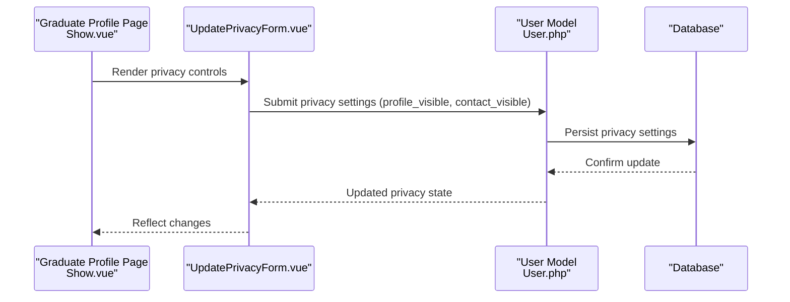
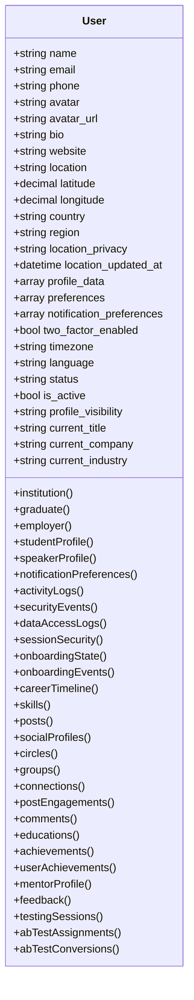
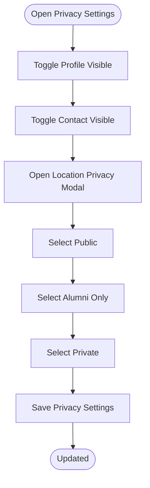
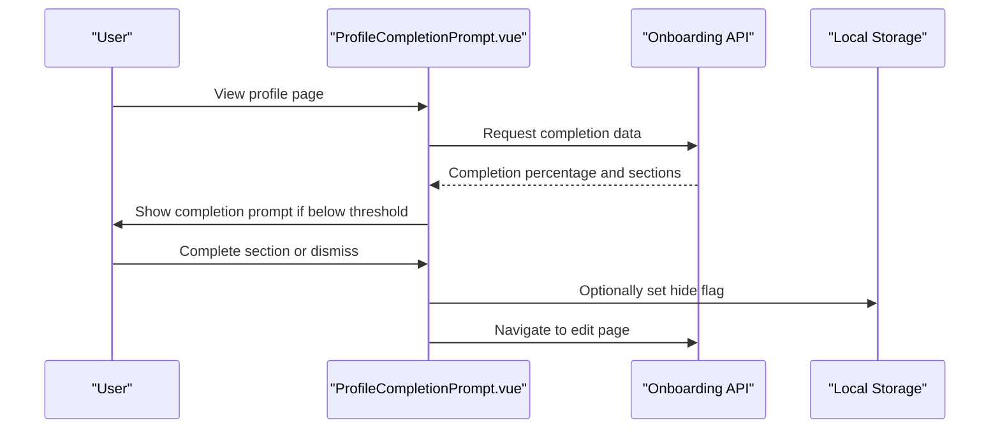
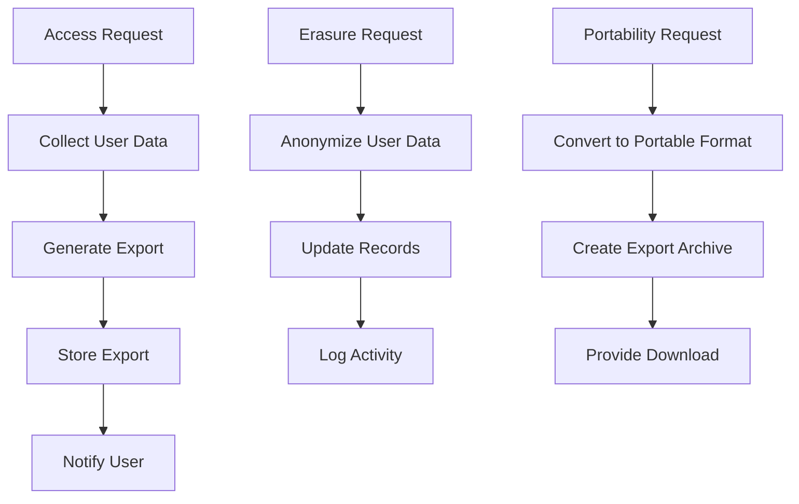
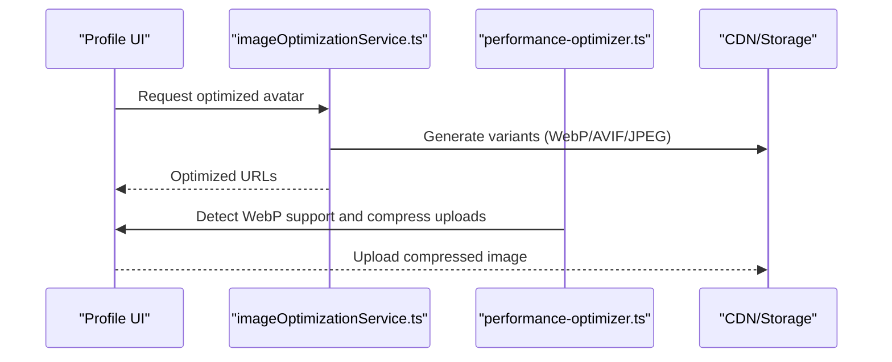
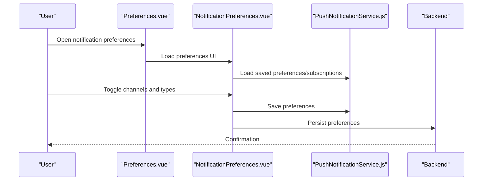
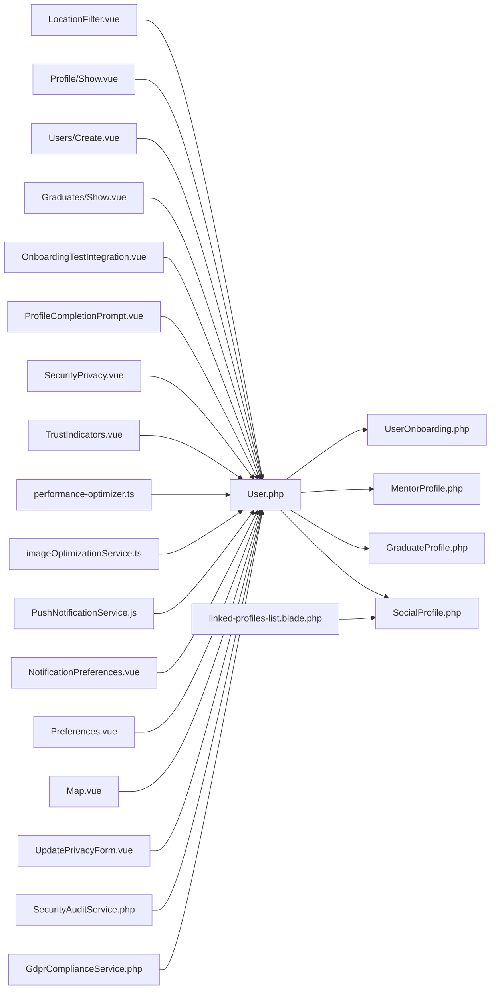

# User Profiles & Privacy

<cite>
**Referenced Files in This Document**
- [User.php](file://app/Models/User.php)
- [SocialProfile.php](file://app/Models/SocialProfile.php)
- [GraduateProfile.php](file://app/Models/GraduateProfile.php)
- [MentorProfile.php](file://app/Models/MentorProfile.php)
- [GdprComplianceService.php](file://app/Services/GdprComplianceService.php)
- [SecurityAuditService.php](file://app/Services/SecurityAuditService.php)
- [UserOnboarding.php](file://app/Models/UserOnboarding.php)
- [UpdatePrivacyForm.vue](file://resources/js/Pages/Graduates/Partials/UpdatePrivacyForm.vue)
- [Map.vue](file://resources/js/Pages/Alumni/Map.vue)
- [Preferences.vue](file://resources/js/Pages/Notifications/Preferences.vue)
- [NotificationPreferences.vue](file://resources/js/components/NotificationPreferences.vue)
- [PushNotificationService.js](file://resources/js/services/PushNotificationService.js)
- [imageOptimizationService.ts](file://resources/js/services/imageOptimizationService.ts)
- [performance-optimizer.ts](file://resources/js/utils/performance-optimizer.ts)
- [TrustIndicators.vue](file://resources/js/components/homepage/TrustIndicators.vue)
- [SecurityPrivacy.vue](file://resources/js/components/homepage/SecurityPrivacy.vue)
- [ProfileCompletionPrompt.vue](file://resources/js/components/onboarding/ProfileCompletionPrompt.vue)
- [OnboardingTestIntegration.vue](file://resources/js/components/onboarding/OnboardingTestIntegration.vue)
- [Show.vue](file://resources/js/Pages/Graduates/Show.vue)
- [Create.vue](file://resources/js/Pages/Users/Create.vue)
- [Show.vue](file://resources/js/Pages/Profile/Show.vue)
- [LocationFilter.vue](file://resources/js/components/LocationFilter.vue)
- [linked-profiles-list.blade.php](file://resources/views/components/linked-profiles-list.blade.php)
</cite>

## Table of Contents
1. [Introduction](#introduction)
2. [Project Structure](#project-structure)
3. [Core Components](#core-components)
4. [Architecture Overview](#architecture-overview)
5. [Detailed Component Analysis](#detailed-component-analysis)
6. [Dependency Analysis](#dependency-analysis)
7. [Performance Considerations](#performance-considerations)
8. [Troubleshooting Guide](#troubleshooting-guide)
9. [Conclusion](#conclusion)
10. [Appendices](#appendices)

## Introduction
This document provides comprehensive coverage of user profile management and privacy controls across the platform. It documents the profile structure (personal, professional, and social), privacy settings (visibility, location privacy, contact restrictions), onboarding and profile completion tracking, engagement metrics, data validation and sanitization, GDPR compliance, avatar upload and optimization, notification preferences, searchability and directory visibility, and data portability/account deletion procedures.

## Project Structure
The profile and privacy system spans Laravel backend models and services, along with Vue frontend components and JavaScript services. Key areas include:
- Backend models for user, social profiles, graduate/mentor profiles, and onboarding state
- Frontend pages and components for editing privacy, managing notifications, and displaying profile data
- Services for image optimization and GDPR compliance
- Audit and trust indicators for security and compliance

```mermaid
graph TB
subgraph "Backend"
U["User Model<br/>User.php"]
SP["SocialProfile Model<br/>SocialProfile.php"]
GP["GraduateProfile Model<br/>GraduateProfile.php"]
MP["MentorProfile Model<br/>MentorProfile.php"]
GO["UserOnboarding Model<br/>UserOnboarding.php"]
GCS["GdprComplianceService<br/>GdprComplianceService.php"]
SAS["SecurityAuditService<br/>SecurityAuditService.php"]
end
subgraph "Frontend"
UPF["UpdatePrivacyForm.vue"]
MAP["Map.vue"]
NPREF["Preferences.vue"]
NCOMP["NotificationPreferences.vue"]
PNJS["PushNotificationService.js"]
IMG["imageOptimizationService.ts"]
PERF["performance-optimizer.ts"]
TIND["TrustIndicators.vue"]
SPRIV["SecurityPrivacy.vue"]
PCP["ProfileCompletionPrompt.vue"]
OTI["OnboardingTestIntegration.vue"]
GSHOW["Graduates/Show.vue"]
PCREATE["Users/Create.vue"]
PPROFILE["Profile/Show.vue"]
LFILTER["LocationFilter.vue"]
LPVIEW["linked-profiles-list.blade.php"]
end
U --> SP
U --> GP
U --> MP
U --> GO
GCS -.-> U
SAS -.-> U
UPF --> U
MAP --> U
NPREF --> U
NCOMP --> U
PNJS --> U
IMG --> U
PERF --> U
TIND --> U
SPRIV --> U
PCP --> U
OTI --> U
GSHOW --> U
PCREATE --> U
PPROFILE --> U
LFILTER --> U
LPVIEW --> SP
```

**Diagram sources**
- [User.php:13-87](file://app/Models/User.php#L13-L87)
- [SocialProfile.php:9-31](file://app/Models/SocialProfile.php#L9-L31)
- [GraduateProfile.php:8-25](file://app/Models/GraduateProfile.php#L8-L25)
- [MentorProfile.php:10-27](file://app/Models/MentorProfile.php#L10-L27)
- [UserOnboarding.php:9-38](file://app/Models/UserOnboarding.php#L9-L38)
- [GdprComplianceService.php:11-437](file://app/Services/GdprComplianceService.php#L11-L437)
- [SecurityAuditService.php:40-245](file://app/Services/SecurityAuditService.php#L40-L245)
- [UpdatePrivacyForm.vue:32-112](file://resources/js/Pages/Graduates/Partials/UpdatePrivacyForm.vue#L32-L112)
- [Map.vue:171-249](file://resources/js/Pages/Alumni/Map.vue#L171-L249)
- [Preferences.vue:41-174](file://resources/js/Pages/Notifications/Preferences.vue#L41-L174)
- [NotificationPreferences.vue:1-198](file://resources/js/components/NotificationPreferences.vue#L1-L198)
- [PushNotificationService.js:314-360](file://resources/js/services/PushNotificationService.js#L314-L360)
- [imageOptimizationService.ts:43-457](file://resources/js/services/imageOptimizationService.ts#L43-L457)
- [performance-optimizer.ts:228-258](file://resources/js/utils/performance-optimizer.ts#L228-L258)
- [TrustIndicators.vue:194-316](file://resources/js/components/homepage/TrustIndicators.vue#L194-L316)
- [SecurityPrivacy.vue:144-190](file://resources/js/components/homepage/SecurityPrivacy.vue#L144-L190)
- [ProfileCompletionPrompt.vue:25-208](file://resources/js/components/onboarding/ProfileCompletionPrompt.vue#L25-L208)
- [OnboardingTestIntegration.vue:1-280](file://resources/js/components/onboarding/OnboardingTestIntegration.vue#L1-L280)
- [Show.vue:285-302](file://resources/js/Pages/Graduates/Show.vue#L285-L302)
- [Create.vue:227-266](file://resources/js/Pages/Users/Create.vue#L227-L266)
- [Show.vue:195-299](file://resources/js/Pages/Profile/Show.vue#L195-L299)
- [LocationFilter.vue:170-204](file://resources/js/components/LocationFilter.vue#L170-L204)
- [linked-profiles-list.blade.php:1-23](file://resources/views/components/linked-profiles-list.blade.php#L1-L23)

**Section sources**
- [User.php:13-121](file://app/Models/User.php#L13-L121)
- [UpdatePrivacyForm.vue:32-112](file://resources/js/Pages/Graduates/Partials/UpdatePrivacyForm.vue#L32-L112)
- [Map.vue:171-249](file://resources/js/Pages/Alumni/Map.vue#L171-L249)
- [Preferences.vue:41-174](file://resources/js/Pages/Notifications/Preferences.vue#L41-L174)
- [NotificationPreferences.vue:1-198](file://resources/js/components/NotificationPreferences.vue#L1-L198)
- [PushNotificationService.js:314-360](file://resources/js/services/PushNotificationService.js#L314-L360)
- [imageOptimizationService.ts:43-457](file://resources/js/services/imageOptimizationService.ts#L43-L457)
- [performance-optimizer.ts:228-258](file://resources/js/utils/performance-optimizer.ts#L228-L258)
- [GdprComplianceService.php:11-437](file://app/Services/GdprComplianceService.php#L11-L437)
- [SecurityAuditService.php:40-245](file://app/Services/SecurityAuditService.php#L40-L245)
- [TrustIndicators.vue:194-316](file://resources/js/components/homepage/TrustIndicators.vue#L194-L316)
- [SecurityPrivacy.vue:144-190](file://resources/js/components/homepage/SecurityPrivacy.vue#L144-L190)
- [ProfileCompletionPrompt.vue:25-208](file://resources/js/components/onboarding/ProfileCompletionPrompt.vue#L25-L208)
- [OnboardingTestIntegration.vue:1-280](file://resources/js/components/onboarding/OnboardingTestIntegration.vue#L1-L280)
- [Show.vue:285-302](file://resources/js/Pages/Graduates/Show.vue#L285-L302)
- [Create.vue:227-266](file://resources/js/Pages/Users/Create.vue#L227-L266)
- [Show.vue:195-299](file://resources/js/Pages/Profile/Show.vue#L195-L299)
- [LocationFilter.vue:170-204](file://resources/js/components/LocationFilter.vue#L170-L204)
- [linked-profiles-list.blade.php:1-23](file://resources/views/components/linked-profiles-list.blade.php#L1-L23)

## Core Components
- User model encapsulates profile data, preferences, privacy settings, and relationships to roles, onboarding, notifications, and social profiles.
- SocialProfile model stores external provider profile data and exposes derived attributes for avatar, profile URL, and display name.
- GraduateProfile and MentorProfile models represent specialized profile data for graduates and mentors respectively.
- Onboarding model tracks user onboarding progress and preferences.
- GDPR compliance service handles consent, access requests, erasure/anonymization, portability, and retention.
- Notification preferences components manage granular notification settings across channels.
- Image optimization service and performance utilities handle avatar uploads, resizing, and delivery.

**Section sources**
- [User.php:13-121](file://app/Models/User.php#L13-L121)
- [SocialProfile.php:9-96](file://app/Models/SocialProfile.php#L9-L96)
- [GraduateProfile.php:8-25](file://app/Models/GraduateProfile.php#L8-L25)
- [MentorProfile.php:10-79](file://app/Models/MentorProfile.php#L10-L79)
- [UserOnboarding.php:9-78](file://app/Models/UserOnboarding.php#L9-L78)
- [GdprComplianceService.php:11-437](file://app/Services/GdprComplianceService.php#L11-L437)
- [Preferences.vue:41-174](file://resources/js/Pages/Notifications/Preferences.vue#L41-L174)
- [NotificationPreferences.vue:1-198](file://resources/js/components/NotificationPreferences.vue#L1-L198)
- [imageOptimizationService.ts:43-457](file://resources/js/services/imageOptimizationService.ts#L43-L457)
- [performance-optimizer.ts:228-258](file://resources/js/utils/performance-optimizer.ts#L228-L258)

## Architecture Overview
The profile and privacy architecture integrates frontend UI with backend models and services. Privacy settings are persisted in the User model, while notification preferences are managed via dedicated components and services. GDPR operations are handled by a dedicated service with storage-backed exports and anonymization routines.

**Diagram sources**
- [Show.vue:285-302](file://resources/js/Pages/Graduates/Show.vue#L285-L302)
- [UpdatePrivacyForm.vue:32-112](file://resources/js/Pages/Graduates/Partials/UpdatePrivacyForm.vue#L32-L112)
- [User.php:13-121](file://app/Models/User.php#L13-L121)

**Section sources**
- [Show.vue:285-302](file://resources/js/Pages/Graduates/Show.vue#L285-L302)
- [UpdatePrivacyForm.vue:32-112](file://resources/js/Pages/Graduates/Partials/UpdatePrivacyForm.vue#L32-L112)
- [User.php:13-121](file://app/Models/User.php#L13-L121)

## Detailed Component Analysis

### User Profile Structure
The User model defines the core profile schema including personal info, professional details, and social attributes. It includes:
- Basic identity: name, email, phone
- Profile metadata: bio, website, location, interests
- Location privacy and coordinates: latitude, longitude, country, region, location_privacy, location_updated_at
- Professional context: current_title, current_company, current_industry
- Preferences and visibility: profile_visibility, preferences, notification_preferences
- Account lifecycle: is_active, status, two_factor_enabled, timezone, language
- Relationships: roles, onboarding, notifications, activity logs, social profiles, connections, posts, skills, and more

**Diagram sources**
- [User.php:13-279](file://app/Models/User.php#L13-L279)

**Section sources**
- [User.php:13-121](file://app/Models/User.php#L13-L121)

### Privacy Settings Implementation
Privacy controls include:
- Profile visibility toggles for employers and contact information exposure
- Location privacy levels (public, alumni_only, private) with UI and API persistence
- Directory visibility and connection privacy settings surfaced in profile and filters

**Diagram sources**
- [UpdatePrivacyForm.vue:32-112](file://resources/js/Pages/Graduates/Partials/UpdatePrivacyForm.vue#L32-L112)
- [Map.vue:171-249](file://resources/js/Pages/Alumni/Map.vue#L171-L249)

**Section sources**
- [UpdatePrivacyForm.vue:32-112](file://resources/js/Pages/Graduates/Partials/UpdatePrivacyForm.vue#L32-L112)
- [Map.vue:171-249](file://resources/js/Pages/Alumni/Map.vue#L171-L249)
- [LocationFilter.vue:170-204](file://resources/js/components/LocationFilter.vue#L170-L204)

### Profile Completion Tracking and Onboarding
The system tracks profile completion percentage and prompts users to complete missing sections. The onboarding model maintains progress, preferences, and exploration history.

**Diagram sources**
- [ProfileCompletionPrompt.vue:25-208](file://resources/js/components/onboarding/ProfileCompletionPrompt.vue#L25-L208)
- [OnboardingTestIntegration.vue:242-264](file://resources/js/components/onboarding/OnboardingTestIntegration.vue#L242-L264)

**Section sources**
- [ProfileCompletionPrompt.vue:25-208](file://resources/js/components/onboarding/ProfileCompletionPrompt.vue#L25-L208)
- [OnboardingTestIntegration.vue:242-264](file://resources/js/components/onboarding/OnboardingTestIntegration.vue#L242-L264)
- [UserOnboarding.php:67-78](file://app/Models/UserOnboarding.php#L67-L78)

### User Engagement Metrics
The User model exposes helper methods for activity summaries and recent logins, enabling dashboards and insights.

**Section sources**
- [User.php:537-557](file://app/Models/User.php#L537-L557)

### Data Validation, Sanitization, and GDPR Compliance
The platform implements:
- Consent recording and marketing consent withdrawal
- Access and portability requests with structured export generation
- Erasure/anonymization with retention checks
- Security audit reporting and compliance checks

**Diagram sources**
- [GdprComplianceService.php:68-232](file://app/Services/GdprComplianceService.php#L68-L232)

**Section sources**
- [GdprComplianceService.php:11-437](file://app/Services/GdprComplianceService.php#L11-L437)
- [SecurityAuditService.php:62-71](file://app/Services/SecurityAuditService.php#L62-L71)

### Avatar Upload Handling, Image Optimization, and Storage
Avatar handling supports:
- Default avatar fallback and storage-based avatar URLs
- Image optimization service for responsive variants, WebP/AVIF, and CDN integration
- Automatic compression and lazy loading utilities

**Diagram sources**
- [User.php:364-371](file://app/Models/User.php#L364-L371)
- [imageOptimizationService.ts:43-457](file://resources/js/services/imageOptimizationService.ts#L43-L457)
- [performance-optimizer.ts:228-258](file://resources/js/utils/performance-optimizer.ts#L228-L258)

**Section sources**
- [User.php:364-371](file://app/Models/User.php#L364-L371)
- [imageOptimizationService.ts:43-457](file://resources/js/services/imageOptimizationService.ts#L43-L457)
- [performance-optimizer.ts:228-258](file://resources/js/utils/performance-optimizer.ts#L228-L258)

### User Preferences Management and Notification Settings
Users can manage notification preferences across channels (email, SMS, in-app, push) and types (reactions, comments, likes, connections, messages, events, jobs, mentions). Push subscriptions and preferences are persisted locally and server-side.

**Diagram sources**
- [Preferences.vue:41-174](file://resources/js/Pages/Notifications/Preferences.vue#L41-L174)
- [NotificationPreferences.vue:1-198](file://resources/js/components/NotificationPreferences.vue#L1-L198)
- [PushNotificationService.js:314-360](file://resources/js/services/PushNotificationService.js#L314-L360)

**Section sources**
- [Preferences.vue:41-174](file://resources/js/Pages/Notifications/Preferences.vue#L41-L174)
- [NotificationPreferences.vue:1-198](file://resources/js/components/NotificationPreferences.vue#L1-L198)
- [PushNotificationService.js:314-360](file://resources/js/services/PushNotificationService.js#L314-L360)

### Profile Searchability Controls, Directory Visibility, and Connection Privacy
- Directory visibility: filter components allow filtering by profile visibility (public/alumni-only)
- Connection privacy: connection status helpers and UI affordances for accepting/declining requests
- Location privacy: granular controls for map visibility

**Section sources**
- [LocationFilter.vue:170-204](file://resources/js/components/LocationFilter.vue#L170-L204)
- [User.php:559-623](file://app/Models/User.php#L559-L623)
- [Map.vue:171-249](file://resources/js/Pages/Alumni/Map.vue#L171-L249)

### Data Portability, Profile Export, and Account Deletion Procedures
- Data portability: structured export creation for access and portability requests
- Account deletion: anonymization of user data and retention-based cleanup
- Compliance reporting: automated checks for GDPR and security measures

**Section sources**
- [GdprComplianceService.php:199-232](file://app/Services/GdprComplianceService.php#L199-L232)
- [GdprComplianceService.php:136-195](file://app/Services/GdprComplianceService.php#L136-L195)
- [GdprComplianceService.php:389-437](file://app/Services/GdprComplianceService.php#L389-L437)
- [SecurityAuditService.php:62-71](file://app/Services/SecurityAuditService.php#L62-L71)

### Additional Profile Details and Social Attributes
- Additional information capture during user creation (bio, location, website)
- Linked social profiles display and provider-specific attributes
- Profile showcase with projects gallery and overview sections

**Section sources**
- [Create.vue:227-266](file://resources/js/Pages/Users/Create.vue#L227-L266)
- [linked-profiles-list.blade.php:1-23](file://resources/views/components/linked-profiles-list.blade.php#L1-L23)
- [Show.vue:195-299](file://resources/js/Pages/Profile/Show.vue#L195-L299)

## Dependency Analysis
The profile and privacy system exhibits clear separation of concerns:
- Models define data contracts and relationships
- Services encapsulate business logic (GDPR, audit)
- Frontend components manage UI state and user interactions
- Utilities provide cross-cutting concerns (image optimization, performance)

**Diagram sources**
- [User.php:13-279](file://app/Models/User.php#L13-L279)
- [SocialProfile.php:9-96](file://app/Models/SocialProfile.php#L9-L96)
- [GraduateProfile.php:8-25](file://app/Models/GraduateProfile.php#L8-L25)
- [MentorProfile.php:10-79](file://app/Models/MentorProfile.php#L10-L79)
- [UserOnboarding.php:9-78](file://app/Models/UserOnboarding.php#L9-L78)
- [GdprComplianceService.php:11-437](file://app/Services/GdprComplianceService.php#L11-L437)
- [SecurityAuditService.php:40-245](file://app/Services/SecurityAuditService.php#L40-L245)
- [UpdatePrivacyForm.vue:32-112](file://resources/js/Pages/Graduates/Partials/UpdatePrivacyForm.vue#L32-L112)
- [Map.vue:171-249](file://resources/js/Pages/Alumni/Map.vue#L171-L249)
- [Preferences.vue:41-174](file://resources/js/Pages/Notifications/Preferences.vue#L41-L174)
- [NotificationPreferences.vue:1-198](file://resources/js/components/NotificationPreferences.vue#L1-L198)
- [PushNotificationService.js:314-360](file://resources/js/services/PushNotificationService.js#L314-L360)
- [imageOptimizationService.ts:43-457](file://resources/js/services/imageOptimizationService.ts#L43-L457)
- [performance-optimizer.ts:228-258](file://resources/js/utils/performance-optimizer.ts#L228-L258)
- [TrustIndicators.vue:194-316](file://resources/js/components/homepage/TrustIndicators.vue#L194-L316)
- [SecurityPrivacy.vue:144-190](file://resources/js/components/homepage/SecurityPrivacy.vue#L144-L190)
- [ProfileCompletionPrompt.vue:25-208](file://resources/js/components/onboarding/ProfileCompletionPrompt.vue#L25-L208)
- [OnboardingTestIntegration.vue:1-280](file://resources/js/components/onboarding/OnboardingTestIntegration.vue#L1-L280)
- [Show.vue:285-302](file://resources/js/Pages/Graduates/Show.vue#L285-L302)
- [Create.vue:227-266](file://resources/js/Pages/Users/Create.vue#L227-L266)
- [Show.vue:195-299](file://resources/js/Pages/Profile/Show.vue#L195-L299)
- [LocationFilter.vue:170-204](file://resources/js/components/LocationFilter.vue#L170-L204)
- [linked-profiles-list.blade.php:1-23](file://resources/views/components/linked-profiles-list.blade.php#L1-L23)

**Section sources**
- [User.php:13-279](file://app/Models/User.php#L13-L279)
- [GdprComplianceService.php:11-437](file://app/Services/GdprComplianceService.php#L11-L437)
- [SecurityAuditService.php:40-245](file://app/Services/SecurityAuditService.php#L40-L245)

## Performance Considerations
- Image optimization reduces bandwidth and improves load times using WebP/AVIF and responsive variants.
- Lazy loading and CDN integration minimize latency for avatar and gallery assets.
- Notification preferences are cached locally to reduce server calls and improve responsiveness.

[No sources needed since this section provides general guidance]

## Troubleshooting Guide
Common issues and resolutions:
- Privacy settings not persisting: verify submission flow and backend persistence in the User model.
- Location privacy not updating on map: confirm API endpoint for location privacy and client-side refresh.
- Notification preferences not applying: check local storage persistence and server-side sync.
- GDPR export failures: review storage permissions and request validation.
- Image upload errors: validate file types, sizes, and optimization pipeline.

**Section sources**
- [UpdatePrivacyForm.vue:32-112](file://resources/js/Pages/Graduates/Partials/UpdatePrivacyForm.vue#L32-L112)
- [Map.vue:426-440](file://resources/js/Pages/Alumni/Map.vue#L426-L440)
- [Preferences.vue:73-172](file://resources/js/Pages/Notifications/Preferences.vue#L73-L172)
- [NotificationPreferences.vue:21-198](file://resources/js/components/NotificationPreferences.vue#L21-L198)
- [PushNotificationService.js:314-360](file://resources/js/services/PushNotificationService.js#L314-L360)
- [GdprComplianceService.php:68-131](file://app/Services/GdprComplianceService.php#L68-L131)
- [imageOptimizationService.ts:43-457](file://resources/js/services/imageOptimizationService.ts#L43-L457)

## Conclusion
The platform’s user profile and privacy system combines robust backend models with flexible frontend controls, comprehensive GDPR compliance, and performance-focused asset handling. Privacy settings, onboarding, notifications, and data portability are integrated to provide a secure, transparent, and user-centric experience.

[No sources needed since this section summarizes without analyzing specific files]

## Appendices
- Security and compliance indicators are prominently displayed to reinforce transparency and trust.
- Administrative views expose notification statistics and user preferences for oversight.

**Section sources**
- [TrustIndicators.vue:194-316](file://resources/js/components/homepage/TrustIndicators.vue#L194-L316)
- [SecurityPrivacy.vue:144-190](file://resources/js/components/homepage/SecurityPrivacy.vue#L144-L190)
- [Show.vue:93-116](file://resources/js/Pages/SuperAdmin/Notifications.vue#L93-L116)