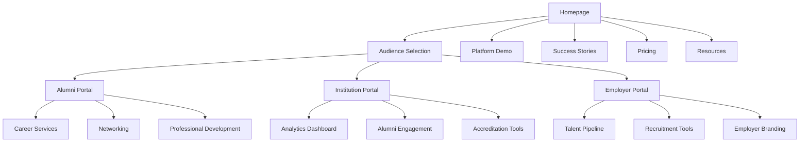

# Alumni Platform Homepage Redesign - Product Requirements Document

## 1. Product Overview

The Alumni Platform is a comprehensive graduate tracking and career development system that connects educational institutions, alumni, and employers in a powerful ecosystem for lifelong career success. <mcreference link="https://12twenty.com/" index="1">1</mcreference> <mcreference link="https://www.peoplegrove.com/solutions/universities/alumni-and-advancement/" index="2">2</mcreference>

The platform addresses critical gaps in post-graduation career support, institutional outcome tracking, and employer talent acquisition by providing a unified solution that benefits all stakeholders through data-driven connections and comprehensive career services. <mcreference link="https://blog.alumniaccess.com/member_marketing_statistics_ultimate_collection_alumni-2015" index="3">3</mcreference>

Target market value: $2.8B global alumni management software market with 15%+ annual growth, serving 4,000+ educational programs and 350K+ employers seeking early-career talent. <mcreference link="https://12twenty.com/" index="1">1</mcreference>

## 2. Core Features

### 2.1 User Roles

| Role | Registration Method | Core Permissions |
|------|---------------------|------------------|
| Alumni/Graduate | Email registration with institution verification | Profile management, job search, networking, mentorship participation |
| Institution Admin | Institution-based invitation system | Full platform management, analytics access, alumni tracking, employer relations |
| Employer/Recruiter | Company registration with verification | Job posting, candidate search, event hosting, talent pipeline access |
| Career Services Staff | Institution-based role assignment | Student/alumni support, outcome tracking, employer coordination |
| Super Admin | System-level access | Platform-wide management, multi-tenant oversight, system configuration |

### 2.2 Feature Module

Our redesigned alumni platform consists of the following main pages:

1. **Homepage**: Dynamic audience selector, value proposition showcase, success metrics, platform preview
2. **For Alumni**: Career services, networking tools, job board, mentorship programs, success stories
3. **For Institutions**: Outcome tracking, analytics dashboard, alumni engagement tools, fundraising support
4. **For Employers**: Talent pipeline access, recruitment tools, diversity hiring, campus partnerships
5. **Platform Demo**: Interactive product showcase, feature walkthroughs, ROI calculator
6. **Success Stories**: Case studies, testimonials, outcome metrics, institutional achievements
7. **Pricing & Plans**: Tiered pricing, feature comparison, ROI calculator, implementation support
8. **Resources**: Best practices, industry insights, implementation guides, support documentation

### 2.3 Page Details

| Page Name | Module Name | Feature description |
|-----------|-------------|---------------------|
| Homepage | Audience Selector | Dynamic content switching between Alumni, Institution, and Employer views with personalized value propositions |
| Homepage | Hero Section | Compelling headline, key statistics (55M+ students/alumni, 4000+ programs), primary CTA for each audience |
| Homepage | Value Proposition Matrix | Three-column layout showcasing specific benefits for each stakeholder with outcome metrics |
| Homepage | Platform Preview | Interactive dashboard mockups, feature highlights, success metrics visualization |
| Homepage | Social Proof | Customer logos, testimonials, case study highlights, industry recognition |
| Homepage | Trust Indicators | Security certifications, compliance badges, uptime guarantees, data protection assurances |
| For Alumni | Career Services Hub | Job board integration, resume tools, interview prep, salary insights, career coaching |
| For Alumni | Networking Platform | Alumni directory, mentorship matching, industry groups, local chapter connections |
| For Alumni | Professional Development | Skill assessments, learning resources, certification tracking, career pathway guidance |
| For Institutions | Analytics Dashboard | Real-time outcome tracking, employment rates, salary progression, geographic distribution |
| For Institutions | Alumni Engagement | Event management, communication tools, volunteer coordination, giving campaign integration |
| For Institutions | Accreditation Support | Automated reporting, compliance tracking, outcome documentation, stakeholder dashboards |
| For Employers | Talent Pipeline | University partnerships, candidate filtering, diversity metrics, hiring analytics |
| For Employers | Recruitment Tools | Multi-school job posting, event hosting, candidate assessment, interview scheduling |
| For Employers | Employer Branding | Company profiles, culture showcases, employee testimonials, campus presence tools |
| Platform Demo | Interactive Showcase | Guided product tours, feature demonstrations, use case scenarios, ROI calculations |
| Success Stories | Case Studies | Detailed institutional success stories, outcome improvements, implementation journeys |
| Success Stories | Testimonials | Video testimonials, written reviews, success metrics, before/after comparisons |
| Pricing & Plans | Tiered Pricing | Clear pricing structure, feature comparison matrix, implementation timelines, support levels |
| Resources | Implementation Guides | Best practices, setup instructions, training materials, change management support |
| Resources | Industry Insights | Market research, trend analysis, benchmark data, thought leadership content |

## 3. Core Process

### Alumni User Flow
Alumni discover the platform through institutional communications or job search, register with institutional verification, complete their professional profile, access career services including job boards and networking tools, participate in mentorship programs, and engage with their alma mater through events and giving opportunities.

### Institution Admin Flow
Institution administrators access comprehensive analytics dashboards, track alumni career outcomes for accreditation and reporting, manage alumni engagement campaigns, coordinate with employers for recruitment partnerships, and utilize automated reporting tools for stakeholder communications.

### Employer Flow
Employers register and verify their company credentials, access talent pipelines from target universities, post jobs across multiple institutions, host virtual and in-person recruitment events, utilize diversity hiring tools, and track recruitment ROI through comprehensive analytics.

## 4. User Interface Design

### 4.1 Design Style
- **Primary Colors**: Professional blue (#2563EB) for trust and reliability, accent green (#10B981) for growth and success
- **Secondary Colors**: Warm gray (#6B7280) for text, light blue (#EFF6FF) for backgrounds
- **Button Style**: Modern rounded corners (8px radius), subtle shadows, hover animations
- **Typography**: Inter font family, 16px base size, clear hierarchy with 24px/32px/48px headings
- **Layout Style**: Clean card-based design, generous white space, mobile-first responsive grid
- **Icons**: Heroicons for consistency, professional line style, 24px standard size
- **Animations**: Subtle fade-ins, smooth transitions, micro-interactions for engagement

### 4.2 Page Design Overview

| Page Name | Module Name | UI Elements |
|-----------|-------------|-------------|
| Homepage | Hero Section | Full-width background with gradient overlay, centered content, prominent CTA buttons, animated statistics counter |
| Homepage | Audience Selector | Three-column card layout with hover effects, icon representations, clear value propositions |
| Homepage | Platform Preview | Interactive dashboard mockups with animated data, tabbed interface, screenshot carousels |
| For Alumni | Career Services | Dashboard-style layout, job card grid, filter sidebar, search functionality with autocomplete |
| For Institutions | Analytics Dashboard | Data visualization charts, KPI cards, interactive filters, export functionality |
| For Employers | Talent Pipeline | University partner logos, candidate profile cards, advanced search filters, recruitment analytics |
| Platform Demo | Interactive Showcase | Step-by-step guided tour, clickable hotspots, progress indicators, feature callouts |
| Success Stories | Case Studies | Story card grid, before/after metrics, video testimonials, downloadable case studies |
| Pricing & Plans | Tiered Pricing | Comparison table, feature checkmarks, popular plan highlighting, contact sales CTAs |

### 4.3 Responsiveness
The platform is designed mobile-first with adaptive layouts for desktop, tablet, and mobile devices. Touch-optimized interactions include larger tap targets, swipe gestures for carousels, and simplified navigation for mobile users. Progressive enhancement ensures core functionality works across all devices and browsers.