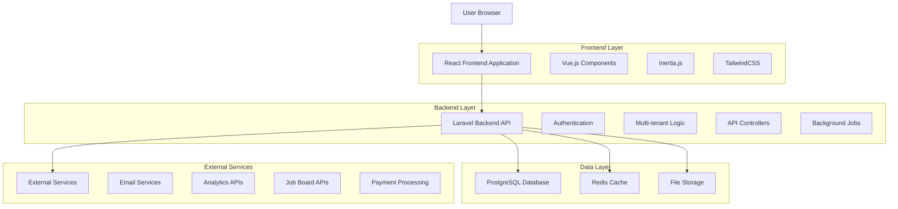
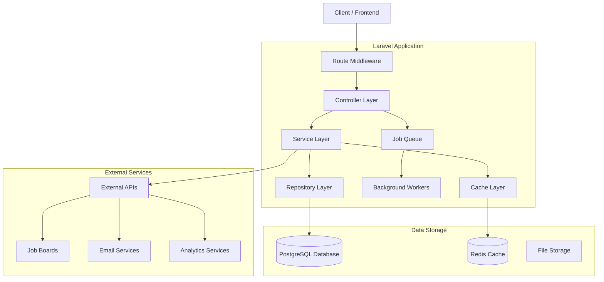
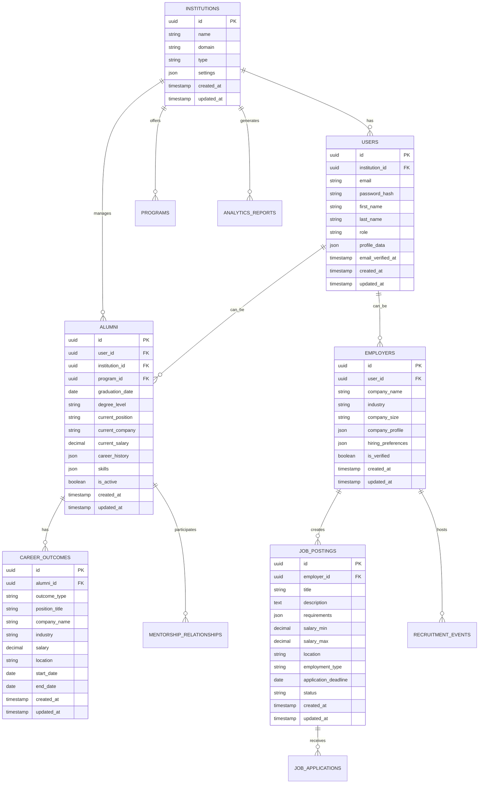

# Alumni Platform Technical Architecture Document

## 1. Architecture Design



## 2. Technology Description

- **Frontend**: Vue.js@3 + Inertia.js + TailwindCSS@3 + Vite
- **Backend**: Laravel@10 + PHP@8.2
- **Database**: PostgreSQL@15 (primary), Redis@7 (cache/sessions)
- **Storage**: Local filesystem with S3-compatible storage option
- **Authentication**: Laravel Sanctum with multi-tenant support
- **Real-time**: Laravel WebSockets + Pusher
- **Search**: Laravel Scout with database driver
- **Queue**: Redis-based job queuing
- **Testing**: PHPUnit + Playwright for E2E

## 3. Route Definitions

| Route | Purpose |
|-------|---------|
| / | Dynamic homepage with audience selector and personalized content |
| /alumni | Alumni-focused landing page with career services and networking features |
| /institutions | Institution-focused page highlighting analytics and engagement tools |
| /employers | Employer-focused page showcasing talent pipeline and recruitment features |
| /demo | Interactive platform demonstration with guided tours |
| /success-stories | Case studies, testimonials, and success metrics showcase |
| /pricing | Tiered pricing plans with feature comparison and ROI calculator |
| /resources | Implementation guides, best practices, and industry insights |
| /login | Multi-tenant authentication with role-based redirects |
| /register | Registration flow with institution verification |
| /dashboard/{role} | Role-specific dashboards (alumni, institution, employer, admin) |
| /api/v1/* | RESTful API endpoints for all platform functionality |

## 4. API Definitions

### 4.1 Core API

**Homepage Content API**
```
GET /api/v1/homepage/content
```

Request:
| Param Name | Param Type | isRequired | Description |
|------------|------------|------------|-------------|
| audience | string | false | Target audience (alumni, institution, employer) |
| institution_id | integer | false | Institution context for personalization |

Response:
| Param Name | Param Type | Description |
|------------|------------|-------------|
| hero_content | object | Dynamic hero section content based on audience |
| statistics | object | Real-time platform statistics and metrics |
| testimonials | array | Relevant testimonials for the target audience |
| features | array | Feature highlights tailored to audience |

**Alumni Career Services API**
```
POST /api/v1/alumni/career-services
```

Request:
| Param Name | Param Type | isRequired | Description |
|------------|------------|------------|-------------|
| service_type | string | true | Type of career service (job_search, mentorship, coaching) |
| preferences | object | false | User preferences and filters |
| institution_id | integer | true | Alumni's institution identifier |

Response:
| Param Name | Param Type | Description |
|------------|------------|-------------|
| services | array | Available career services and resources |
| recommendations | array | Personalized recommendations based on profile |
| next_steps | array | Suggested actions for career development |

**Institution Analytics API**
```
GET /api/v1/institutions/{id}/analytics
```

Request:
| Param Name | Param Type | isRequired | Description |
|------------|------------|------------|-------------|
| date_range | string | false | Analytics date range (30d, 90d, 1y, all) |
| metrics | array | false | Specific metrics to retrieve |
| export_format | string | false | Export format (json, csv, pdf) |

Response:
| Param Name | Param Type | Description |
|------------|------------|-------------|
| employment_rates | object | Graduate employment statistics |
| salary_data | object | Salary progression and industry breakdown |
| geographic_distribution | object | Alumni location and mobility data |
| engagement_metrics | object | Alumni platform engagement statistics |

**Employer Talent Pipeline API**
```
POST /api/v1/employers/talent-search
```

Request:
| Param Name | Param Type | isRequired | Description |
|------------|------------|------------|-------------|
| criteria | object | true | Search criteria (skills, experience, location) |
| institutions | array | false | Target institutions for recruitment |
| diversity_goals | object | false | Diversity and inclusion hiring targets |

Response:
| Param Name | Param Type | Description |
|------------|------------|-------------|
| candidates | array | Matching candidate profiles (anonymized) |
| pipeline_metrics | object | Talent pipeline statistics and insights |
| recommendations | array | Suggested recruitment strategies |

## 5. Server Architecture Diagram



## 6. Data Model

### 6.1 Data Model Definition



### 6.2 Data Definition Language

**Institutions Table**
```sql
-- Create institutions table
CREATE TABLE institutions (
    id UUID PRIMARY KEY DEFAULT gen_random_uuid(),
    name VARCHAR(255) NOT NULL,
    domain VARCHAR(255) UNIQUE NOT NULL,
    type VARCHAR(50) NOT NULL CHECK (type IN ('university', 'college', 'community_college', 'trade_school')),
    settings JSONB DEFAULT '{}',
    logo_url VARCHAR(500),
    website_url VARCHAR(500),
    is_active BOOLEAN DEFAULT true,
    created_at TIMESTAMP WITH TIME ZONE DEFAULT NOW(),
    updated_at TIMESTAMP WITH TIME ZONE DEFAULT NOW()
);

-- Create indexes
CREATE INDEX idx_institutions_domain ON institutions(domain);
CREATE INDEX idx_institutions_type ON institutions(type);
CREATE INDEX idx_institutions_active ON institutions(is_active);
```

**Users Table**
```sql
-- Create users table
CREATE TABLE users (
    id UUID PRIMARY KEY DEFAULT gen_random_uuid(),
    institution_id UUID REFERENCES institutions(id) ON DELETE CASCADE,
    email VARCHAR(255) UNIQUE NOT NULL,
    password_hash VARCHAR(255) NOT NULL,
    first_name VARCHAR(100) NOT NULL,
    last_name VARCHAR(100) NOT NULL,
    role VARCHAR(50) NOT NULL CHECK (role IN ('alumni', 'institution_admin', 'employer', 'career_services', 'super_admin')),
    profile_data JSONB DEFAULT '{}',
    email_verified_at TIMESTAMP WITH TIME ZONE,
    last_login_at TIMESTAMP WITH TIME ZONE,
    is_active BOOLEAN DEFAULT true,
    created_at TIMESTAMP WITH TIME ZONE DEFAULT NOW(),
    updated_at TIMESTAMP WITH TIME ZONE DEFAULT NOW()
);

-- Create indexes
CREATE INDEX idx_users_email ON users(email);
CREATE INDEX idx_users_institution_id ON users(institution_id);
CREATE INDEX idx_users_role ON users(role);
CREATE INDEX idx_users_active ON users(is_active);
```

**Alumni Table**
```sql
-- Create alumni table
CREATE TABLE alumni (
    id UUID PRIMARY KEY DEFAULT gen_random_uuid(),
    user_id UUID UNIQUE REFERENCES users(id) ON DELETE CASCADE,
    institution_id UUID REFERENCES institutions(id) ON DELETE CASCADE,
    program_id UUID REFERENCES programs(id) ON DELETE SET NULL,
    graduation_date DATE NOT NULL,
    degree_level VARCHAR(50) NOT NULL CHECK (degree_level IN ('associate', 'bachelor', 'master', 'doctoral', 'certificate')),
    major VARCHAR(255),
    current_position VARCHAR(255),
    current_company VARCHAR(255),
    current_salary DECIMAL(12,2),
    career_history JSONB DEFAULT '[]',
    skills JSONB DEFAULT '[]',
    linkedin_url VARCHAR(500),
    is_public BOOLEAN DEFAULT false,
    is_active BOOLEAN DEFAULT true,
    created_at TIMESTAMP WITH TIME ZONE DEFAULT NOW(),
    updated_at TIMESTAMP WITH TIME ZONE DEFAULT NOW()
);

-- Create indexes
CREATE INDEX idx_alumni_user_id ON alumni(user_id);
CREATE INDEX idx_alumni_institution_id ON alumni(institution_id);
CREATE INDEX idx_alumni_graduation_date ON alumni(graduation_date DESC);
CREATE INDEX idx_alumni_degree_level ON alumni(degree_level);
CREATE INDEX idx_alumni_active ON alumni(is_active);
```

**Job Postings Table**
```sql
-- Create job_postings table
CREATE TABLE job_postings (
    id UUID PRIMARY KEY DEFAULT gen_random_uuid(),
    employer_id UUID REFERENCES employers(id) ON DELETE CASCADE,
    title VARCHAR(255) NOT NULL,
    description TEXT NOT NULL,
    requirements JSONB DEFAULT '{}',
    salary_min DECIMAL(12,2),
    salary_max DECIMAL(12,2),
    location VARCHAR(255),
    employment_type VARCHAR(50) CHECK (employment_type IN ('full_time', 'part_time', 'contract', 'internship')),
    experience_level VARCHAR(50) CHECK (experience_level IN ('entry', 'mid', 'senior', 'executive')),
    application_deadline DATE,
    status VARCHAR(50) DEFAULT 'active' CHECK (status IN ('draft', 'active', 'paused', 'closed')),
    view_count INTEGER DEFAULT 0,
    application_count INTEGER DEFAULT 0,
    created_at TIMESTAMP WITH TIME ZONE DEFAULT NOW(),
    updated_at TIMESTAMP WITH TIME ZONE DEFAULT NOW()
);

-- Create indexes
CREATE INDEX idx_job_postings_employer_id ON job_postings(employer_id);
CREATE INDEX idx_job_postings_status ON job_postings(status);
CREATE INDEX idx_job_postings_created_at ON job_postings(created_at DESC);
CREATE INDEX idx_job_postings_deadline ON job_postings(application_deadline);
```

**Initial Data**
```sql
-- Insert sample institutions
INSERT INTO institutions (name, domain, type, website_url) VALUES
('Stanford University', 'stanford.edu', 'university', 'https://www.stanford.edu'),
('MIT', 'mit.edu', 'university', 'https://www.mit.edu'),
('Harvard University', 'harvard.edu', 'university', 'https://www.harvard.edu');

-- Insert sample programs
INSERT INTO programs (institution_id, name, degree_level, department) 
SELECT id, 'Computer Science', 'bachelor', 'Engineering' FROM institutions WHERE domain = 'stanford.edu'
UNION ALL
SELECT id, 'Business Administration', 'master', 'Business School' FROM institutions WHERE domain = 'harvard.edu';
```