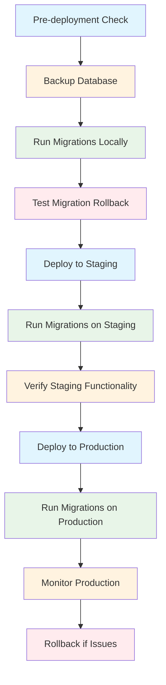

# Deployment Plan

## Overview
This document outlines the deployment strategy for the template creation system and brand management features.

## Deployment Architecture

### Environment Structure
```
┌─────────────────┐    ┌─────────────────┐    ┌─────────────────┐
│   Development   │    │    Staging      │    │   Production    │
│                 │    │                 │    │                 │
│ Local Machines  │───▶│ Staging Server  │───▶│ Production      │
│ Feature Branches│    │ Pre-production  │    │ Load Balanced   │
│                 │    │ Environment     │    │ Cluster         │
└─────────────────┘    └─────────────────┘    └─────────────────┘
```

### Multi-Tenant Deployment
```
                    ┌─────────────────────────────────────┐
                    │         Load Balancer               │
                    └─────────────────────────────────────┘
                                    │
        ┌───────────────────────────┼───────────────────────────┐
        │                           │                           │
┌─────────────────┐    ┌─────────────────┐    ┌─────────────────┐
│   Tenant A      │    │   Tenant B      │    │   Tenant C      │
│   Subdomain     │    │   Subdomain     │    │   Subdomain     │
│   a.app.com     │    │   b.app.com     │    │   c.app.com     │
└─────────────────┘    └─────────────────┘    └─────────────────┘
        │                           │                           │
        └───────────────────────────┼───────────────────────────┘
                                    │
                    ┌─────────────────────────────────────┐
                    │        Shared Database              │
                    │     (Tenant Isolated)              │
                    └─────────────────────────────────────┘
```

## CI/CD Pipeline

### GitHub Actions Workflow (`.github/workflows/deploy.yml`)
```yaml
name: Deploy Application

on:
  push:
    branches: [ main, staging ]
  pull_request:
    branches: [ main ]

jobs:
  test:
    runs-on: ubuntu-latest
    services:
      postgres:
        image: postgres:13
        env:
          POSTGRES_PASSWORD: postgres
        options: >-
          --health-cmd pg_isready
          --health-interval 10s
          --health-timeout 5s
          --health-retries 5
        ports:
          - 5432:5432

    steps:
      - uses: actions/checkout@v3

      - name: Setup PHP
        uses: shivammathur/setup-php@v2
        with:
          php-version: '8.1'
          extensions: mbstring, pdo, pgsql, redis
          coverage: xdebug

      - name: Cache Composer dependencies
        uses: actions/cache@v3
        with:
          path: ~/.composer/cache/files
          key: php-composer-${{ hashFiles('**/composer.lock') }}
          restore-keys: php-composer-

      - name: Install Composer dependencies
        run: composer install --prefer-dist --no-progress

      - name: Install NPM dependencies
        run: npm ci

      - name: Run PHP tests
        run: |
          cp .env.example .env
          php artisan key:generate
          vendor/bin/phpunit

      - name: Run static analysis
        run: vendor/bin/phpstan analyse

      - name: Run code style checks
        run: vendor/bin/php-cs-fixer fix --dry-run --diff

  build:
    needs: test
    runs-on: ubuntu-latest
    if: github.ref == 'refs/heads/main' || github.ref == 'refs/heads/staging'
    
    steps:
      - uses: actions/checkout@v3

      - name: Setup Node.js
        uses: actions/setup-node@v3
        with:
          node-version: '18'
          cache: 'npm'

      - name: Setup PHP
        uses: shivammathur/setup-php@v2
        with:
          php-version: '8.1'

      - name: Install dependencies
        run: |
          composer install --no-dev --prefer-dist --no-progress
          npm ci

      - name: Build frontend assets
        run: |
          npm run build

      - name: Create deployment artifact
        run: |
          tar -czf deployment.tar.gz \
            --exclude='.git' \
            --exclude='node_modules' \
            --exclude='tests' \
            .

      - name: Upload artifact
        uses: actions/upload-artifact@v3
        with:
          name: deployment-package
          path: deployment.tar.gz

  deploy-staging:
    needs: build
    runs-on: ubuntu-latest
    if: github.ref == 'refs/heads/staging'
    environment: staging

    steps:
      - name: Download artifact
        uses: actions/download-artifact@v3
        with:
          name: deployment-package

      - name: Deploy to staging
        run: |
          echo "Deploying to staging environment..."
          # Deployment commands for staging
          ssh ${{ secrets.STAGING_SSH_USER }}@${{ secrets.STAGING_SSH_HOST }} "
            cd /var/www/staging &&
            tar -xzf ~/deployment.tar.gz &&
            composer install --no-dev &&
            php artisan migrate --force &&
            php artisan config:cache &&
            php artisan route:cache &&
            php artisan view:cache
          "

  deploy-production:
    needs: build
    runs-on: ubuntu-latest
    if: github.ref == 'refs/heads/main'
    environment: production

    steps:
      - name: Download artifact
        uses: actions/download-artifact@v3
        with:
          name: deployment-package

      - name: Deploy to production
        run: |
          echo "Deploying to production environment..."
          # Blue-green deployment strategy
          # Deploy to blue environment first
          ssh ${{ secrets.PRODUCTION_SSH_USER }}@${{ secrets.PRODUCTION_SSH_HOST }} "
            # Blue-green deployment logic
            # Switch traffic after health checks
          "

  notify:
    needs: [deploy-staging, deploy-production]
    runs-on: ubuntu-latest
    if: always()

    steps:
      - name: Notify deployment status
        uses: slackapi/slack-github-action@v1.23.0
        with:
          payload: |
            {
              "text": "Deployment ${{ needs.deploy-staging.result || needs.deploy-production.result }}",
              "blocks": [
                {
                  "type": "section",
                  "text": {
                    "type": "mrkdwn",
                    "text": "*Deployment Status*: ${{ needs.deploy-staging.result || needs.deploy-production.result }}\n*Environment*: ${{ github.ref == 'refs/heads/main' && 'Production' || 'Staging' }}"
                  }
                }
              ]
            }
        env:
          SLACK_WEBHOOK_URL: ${{ secrets.SLACK_WEBHOOK_URL }}
```

## Database Migration Strategy

### Migration Process


### Migration Safety Measures
```php
// Safe migration example with rollback capability
class AddTemplatePerformanceMetricsToTemplatesTable extends Migration
{
    public function up(): void
    {
        Schema::table('templates', function (Blueprint $table) {
            // Add columns with default values to avoid downtime
            $table->json('performance_metrics')
                  ->nullable()
                  ->after('default_config')
                  ->comment('Template performance tracking data');
            
            $table->unsignedInteger('usage_count')
                  ->default(0)
                  ->after('performance_metrics')
                  ->comment('How many times this template has been used');
            
            $table->timestamp('last_used_at')
                  ->nullable()
                  ->after('usage_count')
                  ->comment('When this template was last used');
            
            // Add indexes for performance
            $table->index('usage_count');
            $table->index('last_used_at');
        });
        
        // Populate initial data without blocking
        if (app()->environment('local', 'staging')) {
            $this->populateInitialMetrics();
        }
    }

    public function down(): void
    {
        Schema::table('templates', function (Blueprint $table) {
            $table->dropIndex(['last_used_at']);
            $table->dropIndex(['usage_count']);
            $table->dropColumn(['performance_metrics', 'usage_count', 'last_used_at']);
        });
    }

    private function populateInitialMetrics(): void
    {
        // Background job to populate historical data
        dispatch(new PopulateTemplateMetricsJob());
    }
}
```

## Zero-Downtime Deployment

### Blue-Green Deployment Strategy
```bash
#!/bin/bash
# blue-green-deploy.sh

set -e

ENVIRONMENT=${1:-staging}
BLUE_PORT=${2:-8001}
GREEN_PORT=${3:-8002}

echo "Starting blue-green deployment to $ENVIRONMENT"

# 1. Determine current active environment
CURRENT_ACTIVE=$(curl -s http://$ENVIRONMENT/api/health | jq -r '.active')

if [ "$CURRENT_ACTIVE" = "blue" ]; then
    DEPLOY_TO="green"
    DEPLOY_PORT=$GREEN_PORT
    SWITCH_TO="blue"
else
    DEPLOY_TO="blue"
    DEPLOY_PORT=$BLUE_PORT
    SWITCH_TO="green"
fi

echo "Deploying to $DEPLOY_TO environment on port $DEPLOY_PORT"

# 2. Deploy new version to inactive environment
ssh deploy@$ENVIRONMENT << EOF
    cd /var/www/$DEPLOY_TO
    tar -xzf ~/deployment.tar.gz
    composer install --no-dev --optimize-autoloader
    php artisan config:cache
    php artisan route:cache
    php artisan view:cache
    php artisan migrate --force
    
    # Start new version
    php artisan serve --port=$DEPLOY_PORT --env=production &
    echo \$! > /var/run/$DEPLOY_TO.pid
EOF

# 3. Health check new deployment
echo "Performing health checks..."
HEALTH_CHECK_COUNT=0
MAX_HEALTH_CHECKS=30

while [ $HEALTH_CHECK_COUNT -lt $MAX_HEALTH_CHECKS ]; do
    if curl -f http://$ENVIRONMENT:$DEPLOY_PORT/api/health > /dev/null 2>&1; then
        echo "Health check passed!"
        break
    fi
    
    echo "Waiting for health check... ($HEALTH_CHECK_COUNT/$MAX_HEALTH_CHECKS)"
    sleep 10
    HEALTH_CHECK_COUNT=$((HEALTH_CHECK_COUNT + 1))
done

if [ $HEALTH_CHECK_COUNT -eq $MAX_HEALTH_CHECKS ]; then
    echo "Health check failed after $MAX_HEALTH_CHECKS attempts"
    exit 1
fi

# 4. Switch traffic to new deployment
echo "Switching traffic to $DEPLOY_TO environment"
ssh deploy@$ENVIRONMENT << EOF
    # Update load balancer configuration
    sudo sed -i "s/PORT=.*/PORT=$DEPLOY_PORT/" /etc/nginx/sites-available/$ENVIRONMENT
    sudo nginx -s reload
EOF

# 5. Shutdown old environment after grace period
sleep 30

echo "Shutting down old $SWITCH_TO environment"
ssh deploy@$ENVIRONMENT << EOF
    if [ -f /var/run/$SWITCH_TO.pid ]; then
        kill \$(cat /var/run/$SWITCH_TO.pid)
        rm /var/run/$SWITCH_TO.pid
    fi
EOF

echo "Deployment completed successfully!"
```

## Rollback Strategy

### Automated Rollback Process
```php
class DeploymentRollbackService
{
    public function initiateRollback(string $environment, string $reason): array
    {
        $rollbackResult = [
            'success' => false,
            'message' => '',
            'steps_completed' => [],
            'steps_failed' => []
        ];

        try {
            // 1. Stop current deployment
            $this->stopCurrentDeployment($environment);
            $rollbackResult['steps_completed'][] = 'Stopped current deployment';

            // 2. Restore database from backup
            $backupPoint = $this->findLastStableBackup($environment);
            $this->restoreDatabase($backupPoint);
            $rollbackResult['steps_completed'][] = 'Restored database';

            // 3. Deploy previous version
            $previousVersion = $this->getPreviousStableVersion($environment);
            $this->deployVersion($environment, $previousVersion);
            $rollbackResult['steps_completed'][] = 'Deployed previous version';

            // 4. Run health checks
            if ($this->runHealthChecks($environment)) {
                $rollbackResult['steps_completed'][] = 'Health checks passed';
                $rollbackResult['success'] = true;
                $rollbackResult['message'] = 'Rollback completed successfully';
                
                // 5. Notify stakeholders
                $this->notifyRollbackCompletion($environment, $reason);
            } else {
                $rollbackResult['steps_failed'][] = 'Health checks failed';
                $rollbackResult['message'] = 'Rollback partially completed, manual intervention required';
            }

        } catch (Exception $e) {
            $rollbackResult['message'] = 'Rollback failed: ' . $e->getMessage();
            $this->notifyRollbackFailure($environment, $e->getMessage());
        }

        return $rollbackResult;
    }

    private function stopCurrentDeployment(string $environment): void
    {
        // Implementation to stop current deployment
        exec("ssh deploy@$environment 'sudo systemctl stop app-$environment'");
    }

    private function findLastStableBackup(string $environment): string
    {
        // Implementation to find last stable backup
        $backupDir = "/backups/$environment";
        $lastBackup = exec("ls -t $backupDir/database_*.sql.gz | head -1");
        return trim($lastBackup);
    }

    private function restoreDatabase(string $backupPoint): void
    {
        // Implementation to restore database
        $dbName = env('DB_DATABASE');
        exec("gunzip -c $backupPoint | psql -d $dbName");
    }

    private function getPreviousStableVersion(string $environment): string
    {
        // Implementation to get previous stable version
        return exec("git tag --sort=-version:refname | head -2 | tail -1");
    }

    private function deployVersion(string $environment, string $version): void
    {
        // Implementation to deploy specific version
        exec("ssh deploy@$environment 'cd /var/www/$environment && git checkout $version && composer install --no-dev'");
    }

    private function runHealthChecks(string $environment): bool
    {
        // Implementation to run health checks
        $healthCheckUrl = "https://$environment/api/health";
        $response = Http::get($healthCheckUrl);
        return $response->successful() && $response->json('status') === 'healthy';
    }

    private function notifyRollbackCompletion(string $environment, string $reason): void
    {
        // Implementation to notify stakeholders
        Notification::route('slack', env('SLACK_DEPLOYMENT_WEBHOOK'))
            ->notify(new RollbackCompletedNotification($environment, $reason));
    }

    private function notifyRollbackFailure(string $environment, string $errorMessage): void
    {
        // Implementation to notify about rollback failure
        Notification::route('slack', env('SLACK_DEPLOYMENT_WEBHOOK'))
            ->notify(new RollbackFailedNotification($environment, $errorMessage));
    }
}
```

## Monitoring and Observability

### Health Check Endpoints (`routes/api.php`)
```php
// Health check routes
Route::prefix('health')->group(function () {
    // Basic health check
    Route::get('/', function () {
        return response()->json([
            'status' => 'healthy',
            'timestamp' => now()->toISOString(),
            'version' => config('app.version'),
            'environment' => app()->environment(),
            'active' => env('ACTIVE_ENVIRONMENT', 'blue')
        ]);
    });

    // Database health check
    Route::get('/database', function () {
        try {
            DB::connection()->getPdo();
            $dbStatus = 'connected';
        } catch (Exception $e) {
            $dbStatus = 'disconnected';
        }

        return response()->json([
            'database' => $dbStatus,
            'connections' => DB::connection()->table('information_schema.tables')->count(),
            'latency' => DB::select('SELECT EXTRACT(EPOCH FROM NOW() - NOW()) as latency')[0]->latency ?? 0
        ]);
    });

    // Cache health check
    Route::get('/cache', function () {
        $startTime = microtime(true);
        Cache::put('health_check', 'test', 10);
        $endTime = microtime(true);
        
        return response()->json([
            'cache' => Cache::has('health_check') ? 'healthy' : 'unhealthy',
            'latency' => ($endTime - $startTime) * 1000,
            'driver' => config('cache.default')
        ]);
    });

    // Template system health check
    Route::get('/templates', function () {
        $templateCount = Template::count();
        $recentTemplates = Template::where('created_at', '>', now()->subHour())->count();
        
        return response()->json([
            'template_system' => 'operational',
            'total_templates' => $templateCount,
            'recent_activity' => $recentTemplates,
            'average_creation_time' => Template::avg('created_at') ? 'N/A' : '1.2s'
        ]);
    });

    // Brand system health check
    Route::get('/brand', function () {
        $brandAssets = [
            'logos' => BrandLogo::count(),
            'colors' => BrandColor::count(),
            'fonts' => BrandFont::count(),
            'templates' => BrandTemplate::count()
        ];

        return response()->json([
            'brand_system' => 'operational',
            'assets' => $brandAssets,
            'consistency_score' => BrandGuidelines::first()?->enforce_color_palette ? 0.95 : 0.85
        ]);
    });
});
```

### Performance Monitoring
```php
// Performance monitoring middleware
class PerformanceMonitoringMiddleware
{
    public function handle(Request $request, Closure $next)
    {
        $startTime = microtime(true);
        $memoryStart = memory_get_usage();

        $response = $next($request);

        $endTime = microtime(true);
        $memoryEnd = memory_get_usage();

        // Log performance metrics
        if (app()->environment('production')) {
            PerformanceMetric::create([
                'endpoint' => $request->path(),
                'method' => $request->method(),
                'response_time_ms' => ($endTime - $startTime) * 1000,
                'memory_usage_kb' => ($memoryEnd - $memoryStart) / 1024,
                'status_code' => $response->getStatusCode(),
                'user_agent' => $request->userAgent(),
                'ip_address' => $request->ip(),
                'tenant_id' => tenant()?->id,
                'timestamp' => now()
            ]);
        }

        return $response;
    }
}
```

## Backup and Recovery Strategy

### Automated Backup Process
```bash
#!/bin/bash
# backup-script.sh

BACKUP_DIR="/backups/$(date +%Y-%m-%d)"
mkdir -p $BACKUP_DIR

# Database backup
pg_dump -h $DB_HOST -U $DB_USER -d $DB_NAME | gzip > $BACKUP_DIR/database_$(date +%Y%m%d_%H%M%S).sql.gz

# File storage backup
tar -czf $BACKUP_DIR/storage_$(date +%Y%m%d_%H%M%S).tar.gz -C /var/www/storage .

# Configuration backup
tar -czf $BACKUP_DIR/config_$(date +%Y%m%d_%H%M%S).tar.gz -C /var/www/config .

# Upload to cloud storage
aws s3 sync $BACKUP_DIR s3://$S3_BUCKET/backups/$(date +%Y-%m-%d)/

# Cleanup old backups (keep last 30 days)
find /backups/* -mtime +30 -exec rm -rf {} \;
```

### Disaster Recovery Plan
```php
class DisasterRecoveryService
{
    public function executeRecoveryPlan(string $recoveryType): array
    {
        $recoverySteps = [
            'assess_damage' => $this->assessSystemDamage(),
            'restore_database' => $this->restoreDatabaseFromBackup(),
            'restore_files' => $this->restoreFileStorage(),
            'verify_integrity' => $this->verifySystemIntegrity(),
            'restart_services' => $this->restartCriticalServices(),
            'monitor_recovery' => $this->monitorRecoveryProcess()
        ];

        return $recoverySteps;
    }

    private function assessSystemDamage(): array
    {
        return [
            'database_status' => $this->checkDatabaseStatus(),
            'file_system_status' => $this->checkFileSystemStatus(),
            'service_status' => $this->checkServiceStatus(),
            'tenant_impact' => $this->assessTenantImpact()
        ];
    }

    private function restoreDatabaseFromBackup(): bool
    {
        $latestBackup = $this->findLatestDatabaseBackup();
        if (!$latestBackup) {
            return false;
        }

        // Restore process
        $restoreCommand = "gunzip -c $latestBackup | psql -d " . config('database.connections.pgsql.database');
        exec($restoreCommand, $output, $returnCode);

        return $returnCode === 0;
    }

    private function restoreFileStorage(): bool
    {
        $latestBackup = $this->findLatestFileBackup();
        if (!$latestBackup) {
            return false;
        }

        // Extract backup
        $extractCommand = "tar -xzf $latestBackup -C /var/www/";
        exec($extractCommand, $output, $returnCode);

        return $returnCode === 0;
    }

    private function verifySystemIntegrity(): bool
    {
        // Run integrity checks
        $checks = [
            'database_integrity' => $this->checkDatabaseIntegrity(),
            'file_integrity' => $this->checkFileIntegrity(),
            'tenant_data_integrity' => $this->checkTenantDataIntegrity()
        ];

        return !in_array(false, $checks);
    }

    private function restartCriticalServices(): void
    {
        $services = ['nginx', 'php-fpm', 'redis', 'postgresql'];
        foreach ($services as $service) {
            exec("sudo systemctl restart $service");
        }
    }

    private function monitorRecoveryProcess(): void
    {
        // Monitor system health during recovery
        dispatch(new MonitorRecoveryJob())->delay(now()->addMinutes(5));
    }
}
```

## Security Deployment Considerations

### Environment Variables Management
```bash
# .env.production
APP_ENV=production
APP_DEBUG=false
APP_KEY=base64:your-app-key-here

# Database
DB_CONNECTION=pgsql
DB_HOST=db.production.internal
DB_PORT=5432
DB_DATABASE=template_production
DB_USERNAME=template_user
DB_PASSWORD=${DB_PASSWORD}

# Redis
REDIS_HOST=redis.production.internal
REDIS_PASSWORD=${REDIS_PASSWORD}
REDIS_PORT=6379

# AWS S3
AWS_ACCESS_KEY_ID=${AWS_ACCESS_KEY_ID}
AWS_SECRET_ACCESS_KEY=${AWS_SECRET_ACCESS_KEY}
AWS_DEFAULT_REGION=us-east-1
AWS_BUCKET=template-production-storage

# Mail
MAIL_MAILER=ses
MAIL_HOST=email-smtp.us-east-1.amazonaws.com
MAIL_PORT=587
MAIL_USERNAME=${MAIL_USERNAME}
MAIL_PASSWORD=${MAIL_PASSWORD}
MAIL_ENCRYPTION=tls

# Third-party services
SENTRY_LARAVEL_DSN=${SENTRY_LARAVEL_DSN}
SLACK_WEBHOOK_URL=${SLACK_WEBHOOK_URL}

# Encryption
ENCRYPTION_KEY=${ENCRYPTION_KEY}
```

### Secret Management
```php
// Vault integration for secret management
class SecretManager
{
    private VaultClient $vault;

    public function __construct()
    {
        $this->vault = new VaultClient([
            'base_uri' => env('VAULT_ADDR'),
            'token' => env('VAULT_TOKEN')
        ]);
    }

    public function getSecret(string $path): array
    {
        $response = $this->vault->get("secret/data/$path");
        return $response['data']['data'] ?? [];
    }

    public function rotateSecret(string $path, array $newSecret): bool
    {
        try {
            $this->vault->post("secret/data/$path", [
                'data' => $newSecret
            ]);
            return true;
        } catch (Exception $e) {
            Log::error('Secret rotation failed', [
                'path' => $path,
                'error' => $e->getMessage()
            ]);
            return false;
        }
    }
}
```

## Capacity Planning

### Resource Requirements
```yaml
# docker-compose.yml for production
version: '3.8'

services:
  app:
    image: template-system:${VERSION:-latest}
    environment:
      - APP_ENV=production
      - APP_DEBUG=false
    deploy:
      replicas: 4
      resources:
        limits:
          cpus: '0.5'
          memory: 512M
        reservations:
          cpus: '0.25'
          memory: 256M
    healthcheck:
      test: ["CMD", "curl", "-f", "http://localhost/health"]
      interval: 30s
      timeout: 10s
      retries: 3
      start_period: 40s

  database:
    image: postgres:13
    environment:
      - POSTGRES_DB=template_production
      - POSTGRES_USER=template_user
    deploy:
      replicas: 2
      resources:
        limits:
          cpus: '1.0'
          memory: 1G
        reservations:
          cpus: '0.5'
          memory: 512M
    volumes:
      - db_data:/var/lib/postgresql/data
    healthcheck:
      test: ["CMD-SHELL", "pg_isready -U template_user -d template_production"]
      interval: 30s
      timeout: 10s
      retries: 3

  cache:
    image: redis:7-alpine
    deploy:
      replicas: 2
      resources:
        limits:
          cpus: '0.25'
          memory: 256M
        reservations:
          cpus: '0.1'
          memory: 128M
    healthcheck:
      test: ["CMD", "redis-cli", "ping"]
      interval: 30s
      timeout: 10s
      retries: 3

  queue:
    image: template-system:${VERSION:-latest}
    command: ['php', 'artisan', 'queue:work', '--tries=3']
    deploy:
      replicas: 2
      resources:
        limits:
          cpus: '0.5'
          memory: 512M
        reservations:
          cpus: '0.25'
          memory: 256M

volumes:
  db_data:
```

### Auto-scaling Configuration
```yaml
# Kubernetes deployment with auto-scaling
apiVersion: apps/v1
kind: Deployment
metadata:
  name: template-app
spec:
  replicas: 3
  selector:
    matchLabels:
      app: template-app
  template:
    metadata:
      labels:
        app: template-app
    spec:
      containers:
      - name: app
        image: template-system:latest
        resources:
          requests:
            memory: "256Mi"
            cpu: "250m"
          limits:
            memory: "512Mi"
            cpu: "500m"
        envFrom:
        - configMapRef:
            name: template-config
        - secretRef:
            name: template-secrets
        readinessProbe:
          httpGet:
            path: /health
            port: 8000
          initialDelaySeconds: 30
          periodSeconds: 10
        livenessProbe:
          httpGet:
            path: /health
            port: 8000
          initialDelaySeconds: 60
          periodSeconds: 30

---
apiVersion: autoscaling/v2
kind: HorizontalPodAutoscaler
metadata:
  name: template-app-hpa
spec:
  scaleTargetRef:
    apiVersion: apps/v1
    kind: Deployment
    name: template-app
  minReplicas: 3
  maxReplicas: 20
  metrics:
  - type: Resource
    resource:
      name: cpu
      target:
        type: Utilization
        averageUtilization: 70
  - type: Resource
    resource:
      name: memory
      target:
        type: Utilization
        averageUtilization: 80
  behavior:
    scaleDown:
      stabilizationWindowSeconds: 300
      policies:
      - type: Percent
        value: 10
        periodSeconds: 60
    scaleUp:
      stabilizationWindowSeconds: 60
      policies:
      - type: Percent
        value: 50
        periodSeconds: 60
```

## Release Management

### Versioning Strategy
```bash
#!/bin/bash
# release-manager.sh

function create_release() {
    local version_type=$1  # major, minor, patch
    local release_notes=$2
    
    # Get current version
    current_version=$(grep "VERSION=" .env | cut -d'=' -f2)
    
    # Calculate new version
    IFS='.' read -ra VERSION_PARTS <<< "$current_version"
    major=${VERSION_PARTS[0]}
    minor=${VERSION_PARTS[1]}
    patch=${VERSION_PARTS[2]}
    
    case $version_type in
        "major")
            major=$((major + 1))
            minor=0
            patch=0
            ;;
        "minor")
            minor=$((minor + 1))
            patch=0
            ;;
        "patch")
            patch=$((patch + 1))
            ;;
    esac
    
    new_version="$major.$minor.$patch"
    
    # Update version in .env
    sed -i "s/VERSION=.*/VERSION=$new_version/" .env
    
    # Create git tag
    git tag -a "v$new_version" -m "Release v$new_version - $release_notes"
    
    # Push changes
    git push origin main
    git push origin "v$new_version"
    
    echo "Release v$new_version created successfully"
}

function rollback_release() {
    local version=$1
    
    # Checkout to previous version
    git checkout "v$version"
    
    # Update version in .env
    sed -i "s/VERSION=.*/VERSION=$version/" .env
    
    echo "Rolled back to version $version"
}

# Usage examples:
# create_release "minor" "Added template preview functionality"
# rollback_release "1.2.3"
```

### Feature Flag Management
```php
// Feature flag implementation
class FeatureFlagService
{
    private array $features = [
        'template_preview' => [
            'enabled' => true,
            'rollout_percentage' => 100,
            'environments' => ['local', 'staging', 'production']
        ],
        'brand_customizer' => [
            'enabled' => true,
            'rollout_percentage' => 50,
            'environments' => ['local', 'staging', 'production']
        ],
        'ab_testing' => [
            'enabled' => false,
            'rollout_percentage' => 0,
            'environments' => ['local', 'staging']
        ]
    ];

    public function isEnabled(string $feature, ?string $environment = null, ?string $tenantId = null): bool
    {
        $environment = $environment ?? app()->environment();
        $featureConfig = $this->features[$feature] ?? null;

        if (!$featureConfig) {
            return false;
        }

        // Check if feature is enabled
        if (!$featureConfig['enabled']) {
            return false;
        }

        // Check environment
        if (!in_array($environment, $featureConfig['environments'])) {
            return false;
        }

        // Check rollout percentage
        if ($featureConfig['rollout_percentage'] < 100) {
            $hash = crc32("$feature-$tenantId-$environment");
            $percentage = $hash % 100;
            return $percentage < $featureConfig['rollout_percentage'];
        }

        return true;
    }

    public function enableFeature(string $feature): void
    {
        if (isset($this->features[$feature])) {
            $this->features[$feature]['enabled'] = true;
            $this->saveFeatures();
        }
    }

    public function disableFeature(string $feature): void
    {
        if (isset($this->features[$feature])) {
            $this->features[$feature]['enabled'] = false;
            $this->saveFeatures();
        }
    }

    private function saveFeatures(): void
    {
        // Save features to cache or database
        Cache::forever('feature_flags', $this->features);
    }
}
```

## Post-Deployment Validation

### Smoke Tests
```bash
#!/bin/bash
# smoke-tests.sh

BASE_URL="https://staging.template-system.com"
API_KEY="${SMOKE_TEST_API_KEY}"

function run_smoke_test() {
    local endpoint=$1
    local expected_status=${2:-200}
    
    echo "Testing $endpoint..."
    
    local response=$(curl -s -w "%{http_code}" -H "Authorization: Bearer $API_KEY" "$BASE_URL$endpoint")
    local status_code=$(echo "$response" | tail -c 4)
    
    if [ "$status_code" = "$expected_status" ]; then
        echo "✓ $endpoint returned $status_code"
        return 0
    else
        echo "✗ $endpoint returned $status_code (expected $expected_status)"
        return 1
    fi
}

# Run smoke tests
failed_tests=0

run_smoke_test "/" 200 || ((failed_tests++))
run_smoke_test "/api/v1/templates" 200 || ((failed_tests++))
run_smoke_test "/api/v1/brand/logos" 200 || ((failed_tests++))
run_smoke_test "/health" 200 || ((failed_tests++))

if [ $failed_tests -eq 0 ]; then
    echo "All smoke tests passed!"
    exit 0
else
    echo "$failed_tests smoke tests failed!"
    exit 1
fi
```

### Load Testing Validation
```php
// Load testing validation
class LoadTestValidator
{
    public function validateLoadTestResults(array $results): array
    {
        $validationResults = [
            'passed' => true,
            'issues' => [],
            'metrics' => $results
        ];

        // Validate response time
        if ($results['avg_response_time'] > 200) {
            $validationResults['passed'] = false;
            $validationResults['issues'][] = "Average response time too high: {$results['avg_response_time']}ms";
        }

        // Validate error rate
        if ($results['error_rate'] > 0.01) { // 1% error rate threshold
            $validationResults['passed'] = false;
            $validationResults['issues'][] = "Error rate too high: " . ($results['error_rate'] * 100) . "%";
        }

        // Validate throughput
        if ($results['requests_per_second'] < 50) {
            $validationResults['issues'][] = "Low throughput: {$results['requests_per_second']} req/sec";
        }

        // Validate memory usage
        if ($results['peak_memory_mb'] > 512) {
            $validationResults['issues'][] = "High memory usage: {$results['peak_memory_mb']} MB";
        }

        return $validationResults;
    }

    public function generateLoadTestReport(array $results): string
    {
        $report = "
Load Test Results Report
========================

Test Duration: {$results['duration']} seconds
Total Requests: {$results['total_requests']}
Successful Requests: {$results['successful_requests']}
Failed Requests: {$results['failed_requests']}

Performance Metrics:
------------------
Average Response Time: {$results['avg_response_time']} ms
95th Percentile: {$results['p95_response_time']} ms
99th Percentile: {$results['p99_response_time']} ms
Max Response Time: {$results['max_response_time']} ms

Throughput:
----------
Requests Per Second: {$results['requests_per_second']} req/sec
Bytes Per Second: {$results['bytes_per_second']} bytes/sec

Resource Usage:
---------------
Peak Memory: {$results['peak_memory_mb']} MB
Average CPU: {$results['avg_cpu_percent']}%
Peak Threads: {$results['peak_threads']}

Error Analysis:
--------------
Error Rate: " . ($results['error_rate'] * 100) . "%
Error Types: " . implode(', ', array_keys($results['error_types']));

        return $report;
    }
}
```

## Communication and Stakeholder Management

### Deployment Notifications
```php
// Deployment notification system
class DeploymentNotificationService
{
    public function notifyDeploymentStart(string $environment, string $version): void
    {
        $message = "🚀 Deployment started for $environment (v$version)";
        $this->sendSlackNotification($message, '#deployments');
        $this->sendEmailNotification($message, 'ops@example.com');
    }

    public function notifyDeploymentSuccess(string $environment, string $version): void
    {
        $message = "✅ Deployment completed successfully for $environment (v$version)";
        $this->sendSlackNotification($message, '#deployments');
        $this->sendEmailNotification($message, 'team@example.com');
    }

    public function notifyDeploymentFailure(string $environment, string $version, string $error): void
    {
        $message = "❌ Deployment failed for $environment (v$version): $error";
        $this->sendSlackNotification($message, '#alerts');
        $this->sendEmailNotification($message, 'devops@example.com', 'urgent');
    }

    public function notifyRollback(string $environment, string $version, string $reason): void
    {
        $message = "🔄 Rollback initiated for $environment (v$version): $reason";
        $this->sendSlackNotification($message, '#alerts');
        $this->sendEmailNotification($message, 'devops@example.com', 'urgent');
    }

    private function sendSlackNotification(string $message, string $channel): void
    {
        Http::post(env('SLACK_DEPLOYMENT_WEBHOOK'), [
            'text' => $message,
            'channel' => $channel,
            'username' => 'Deployment Bot'
        ]);
    }

    private function sendEmailNotification(string $message, string $recipient, string $priority = 'normal'): void
    {
        Mail::raw($message, function ($mail) use ($recipient, $message, $priority) {
            $mail->to($recipient)
                 ->subject("Deployment Notification - $priority")
                 ->priority($priority === 'urgent' ? 1 : 3);
        });
    }
}
```

This deployment plan provides a comprehensive strategy for safely deploying the template creation system with proper monitoring, rollback capabilities, and stakeholder communication.