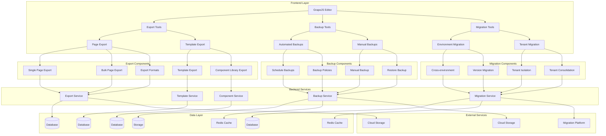

# Export, Backup, and Migration Capabilities Design

## Overview

This document outlines the design for implementing comprehensive export, backup, and migration capabilities in the Vue.js Page Builder System. These features will enable marketing administrators to securely export their pages and templates, create backups for disaster recovery, and migrate content between different environments or tenants.

## Architecture

### Export, Backup, and Migration System Architecture



## Core Components

### 1. Export Tools

```typescript
interface ExportTools {
  // Page export
  exportPage(pageId: string, options?: ExportOptions): Promise<ExportResult>
  exportPages(pageIds: string[], options?: ExportOptions): Promise<ExportResult>
  exportAllPages(options?: ExportOptions): Promise<ExportResult>
  
  // Template export
  exportTemplate(templateId: string, options?: ExportOptions): Promise<ExportResult>
  exportTemplates(templateIds: string[], options?: ExportOptions): Promise<ExportResult>
  exportAllTemplates(options?: ExportOptions): Promise<ExportResult>
  
  // Component export
  exportComponent(componentId: string, options?: ExportOptions): Promise<ExportResult>
  exportComponents(componentIds: string[], options?: ExportOptions): Promise<ExportResult>
  exportAllComponents(options?: ExportOptions): Promise<ExportResult>
  
  // Export management
  getExportHistory(options?: ExportHistoryOptions): Promise<ExportRecord[]>
  getExport(exportId: string): Promise<ExportRecord>
  deleteExport(exportId: string): Promise<void>
  downloadExport(exportId: string): Promise<Blob>
}

interface ExportOptions {
  format: ExportFormat
  includeDependencies?: boolean
  includeAssets?: boolean
  compress?: boolean
  encryption?: EncryptionOptions
  metadata?: ExportMetadata
}

type ExportFormat = 
  'json' | 'xml' | 'yaml' | 'zip' | 'tar' | 'tar.gz' | 
  'html' | 'pdf' | 'markdown' | 'grapejs'

interface ExportMetadata {
  name?: string
  description?: string
  version?: string
  author?: string
  createdAt?: Date
  tags?: string[]
}

interface EncryptionOptions {
  enabled: boolean
  algorithm?: 'AES-256' | 'RSA-2048' | 'RSA-4096'
  password?: string
  publicKey?: string
  privateKey?: string
}

interface ExportResult {
  id: string
  fileName: string
  fileSize: number
  format: ExportFormat
  downloadUrl?: string
  createdAt: Date
  expiresAt?: Date
  status: ExportStatus
  metadata: ExportMetadata
}

type ExportStatus = 'pending' | 'processing' | 'completed' | 'failed' | 'expired'

interface ExportRecord {
  id: string
  fileName: string
  fileSize: number
  format: ExportFormat
  downloadUrl?: string
  createdAt: Date
  expiresAt?: Date
  status: ExportStatus
  metadata: ExportMetadata
  initiatedBy: string
  initiatedAt: Date
  completedAt?: Date
  error?: string
}

interface ExportHistoryOptions {
  limit?: number
  offset?: number
  status?: ExportStatus
  format?: ExportFormat
  startDate?: Date
  endDate?: Date
  initiatedBy?: string
}
```

### 2. Backup Tools

```typescript
interface BackupTools {
  // Automated backups
  scheduleBackup(config: BackupSchedule): Promise<BackupSchedule>
  unscheduleBackup(scheduleId: string): Promise<void>
  getBackupSchedules(): Promise<BackupSchedule[]>
  updateBackupSchedule(scheduleId: string, config: BackupSchedule): Promise<BackupSchedule>
  
  // Manual backups
  createBackup(options?: BackupOptions): Promise<BackupResult>
  restoreBackup(backupId: string, options?: RestoreOptions): Promise<RestoreResult>
  
  // Backup management
  getBackups(options?: BackupQueryOptions): Promise<BackupRecord[]>
  getBackup(backupId: string): Promise<BackupRecord>
  deleteBackup(backupId: string): Promise<void>
  downloadBackup(backupId: string): Promise<Blob>
  
  // Backup policies
  createBackupPolicy(policy: BackupPolicy): Promise<BackupPolicy>
  updateBackupPolicy(policyId: string, policy: BackupPolicy): Promise<BackupPolicy>
  deleteBackupPolicy(policyId: string): Promise<void>
  getBackupPolicies(): Promise<BackupPolicy[]>
}

interface BackupSchedule {
  id: string
  name: string
  description?: string
  frequency: BackupFrequency
  timeOfDay?: string
  dayOfWeek?: number
  dayOfMonth?: number
  retention: RetentionPolicy
  targets: BackupTarget[]
  status: ScheduleStatus
  createdAt: Date
  updatedAt: Date
  createdBy: string
}

type BackupFrequency = 'hourly' | 'daily' | 'weekly' | 'monthly' | 'custom'

interface RetentionPolicy {
  maxBackups?: number
  maxAgeDays?: number
  storageQuota?: number // in bytes
}

interface BackupTarget {
  type: BackupTargetType
  id?: string
  name?: string
  includeDependencies?: boolean
  includeAssets?: boolean
}

type BackupTargetType = 'all_pages' | 'all_templates' | 'specific_pages' | 'specific_templates' | 'component_library'

interface BackupOptions {
  name?: string
  description?: string
  targets?: BackupTarget[]
  encryption?: EncryptionOptions
  compression?: boolean
  metadata?: BackupMetadata
}

interface BackupMetadata {
  name?: string
  description?: string
  version?: string
  author?: string
  createdAt?: Date
  tags?: string[]
  environment?: string
  tenantId?: string
}

interface BackupResult {
  id: string
  fileName: string
  fileSize: number
  downloadUrl?: string
  createdAt: Date
  expiresAt?: Date
  status: BackupStatus
  metadata: BackupMetadata
}

type BackupStatus = 'pending' | 'processing' | 'completed' | 'failed' | 'expired'

interface RestoreOptions {
  overwrite?: boolean
  skipValidation?: boolean
  restoreDependencies?: boolean
  restoreAssets?: boolean
  targetEnvironment?: string
}

interface RestoreResult {
  success: boolean
  restoredItems: RestoredItem[]
  skippedItems: SkippedItem[]
  errors: RestoreError[]
  warnings: RestoreWarning[]
}

interface RestoredItem {
  type: ItemType
  id: string
  name: string
  restoredAt: Date
}

interface SkippedItem {
  type: ItemType
  id: string
  name: string
  reason: string
}

interface RestoreError {
  type: ItemType
  id?: string
  name?: string
  message: string
  severity: 'low' | 'medium' | 'high' | 'critical'
}

interface RestoreWarning {
  type: ItemType
  id?: string
  name?: string
  message: string
  severity: 'low' | 'medium' | 'high'
}

type ItemType = 
  'page' | 'template' | 'component' | 'asset' | 
  'style' | 'script' | 'configuration'

interface BackupRecord {
  id: string
  fileName: string
  fileSize: number
  downloadUrl?: string
  createdAt: Date
  expiresAt?: Date
  status: BackupStatus
  metadata: BackupMetadata
  initiatedBy: string
  initiatedAt: Date
  completedAt?: Date
  error?: string
}

interface BackupQueryOptions {
  limit?: number
  offset?: number
  status?: BackupStatus
  startDate?: Date
  endDate?: Date
  initiatedBy?: string
  environment?: string
  tenantId?: string
}

type ScheduleStatus = 'active' | 'paused' | 'disabled' | 'error'

interface BackupPolicy {
  id: string
  name: string
  description?: string
  rules: BackupRule[]
  defaultRetention: RetentionPolicy
  encryption: EncryptionPolicy
  compression: boolean
  notifications: NotificationSettings
  createdAt: Date
  updatedAt: Date
  createdBy: string
}

interface BackupRule {
  name: string
  condition: BackupCondition
  action: BackupAction
  priority: number
}

interface BackupCondition {
  type: ConditionType
  parameters: Record<string, any>
}

type ConditionType = 
  'size_limit' | 'age_limit' | 'item_type' | 'environment' | 
  'tenant' | 'tag' | 'custom_function'

interface BackupAction {
  type: ActionType
  parameters: Record<string, any>
}

type ActionType = 
  'include' | 'exclude' | 'compress' | 'encrypt' | 
  'notify' | 'archive' | 'custom_action'

interface EncryptionPolicy {
  enabled: boolean
  algorithm: 'AES-256' | 'RSA-2048' | 'RSA-4096'
  keyRotationDays?: number
  keyStorage: KeyStorageLocation
}

type KeyStorageLocation = 'local' | 'cloud' | 'hardware_security_module'

interface NotificationSettings {
  email: boolean
  slack: boolean
  webhook: boolean
  emailAddresses?: string[]
  slackWebhookUrl?: string
  customWebhookUrl?: string
  notificationEvents: NotificationEvent[]
}

type NotificationEvent = 
  'backup_completed' | 'backup_failed' | 'restore_started' | 
  'restore_completed' | 'restore_failed' | 'policy_violation'
}
```

### 3. Migration Tools

```typescript
interface MigrationTools {
  // Environment migration
  createMigration(config: MigrationConfig): Promise<Migration>
  executeMigration(migrationId: string): Promise<MigrationResult>
  cancelMigration(migrationId: string): Promise<void>
  getMigration(migrationId: string): Promise<Migration>
  getMigrations(options?: MigrationQueryOptions): Promise<Migration[]>
  
  // Tenant migration
  migrateTenant(sourceTenantId: string, targetTenantId: string, options?: TenantMigrationOptions): Promise<TenantMigrationResult>
  consolidateTenants(tenantIds: string[], targetTenantId: string, options?: ConsolidationOptions): Promise<ConsolidationResult>
  
  // Migration validation
  validateMigration(migrationId: string): Promise<MigrationValidation>
  validateTenantMigration(sourceTenantId: string, targetTenantId: string): Promise<TenantMigrationValidation>
  
  // Migration management
  pauseMigration(migrationId: string): Promise<void>
  resumeMigration(migrationId: string): Promise<void>
  rollbackMigration(migrationId: string): Promise<RollbackResult>
}

interface MigrationConfig {
  name: string
  description?: string
  source: MigrationSource
  target: MigrationTarget
  items: MigrationItem[]
  options: MigrationOptions
  schedule?: MigrationSchedule
}

interface MigrationSource {
  environment: string
  tenantId?: string
  connection: ConnectionDetails
}

interface MigrationTarget {
  environment: string
  tenantId?: string
  connection: ConnectionDetails
}

interface ConnectionDetails {
  host: string
  port: number
  username: string
  password: string
  database: string
  ssl?: boolean
  certificate?: string
}

interface MigrationItem {
  type: MigrationItemType
  id?: string
  name?: string
  filters?: MigrationFilter[]
  transformations?: Transformation[]
}

type MigrationItemType = 
  'pages' | 'templates' | 'components' | 'assets' | 
  'styles' | 'scripts' | 'configurations' | 'users'

interface MigrationFilter {
  type: FilterType
  parameters: Record<string, any>
}

type FilterType = 
  'tag' | 'category' | 'date_range' | 'status' | 
  'author' | 'custom_query'

interface Transformation {
  type: TransformationType
  sourceField: string
  targetField: string
  parameters: Record<string, any>
}

type TransformationType = 
  'rename' | 'convert' | 'map' | 'default_value' | 
  'custom_function'

interface MigrationOptions {
  validateBeforeMigration: boolean
  backupBeforeMigration: boolean
  rollbackOnError: boolean
  parallelProcessing: boolean
  batchSize?: number
  timeoutMinutes?: number
}

interface MigrationSchedule {
  type: 'immediate' | 'scheduled' | 'recurring'
  dateTime?: Date
  recurrence?: RecurrencePattern
}

interface RecurrencePattern {
  frequency: 'daily' | 'weekly' | 'monthly'
  dayOfWeek?: number
  dayOfMonth?: number
  timeOfDay: string
}

interface Migration {
  id: string
  config: MigrationConfig
  status: MigrationStatus
  progress: MigrationProgress
  results?: MigrationResult
  createdAt: Date
  updatedAt: Date
  createdBy: string
  startedAt?: Date
  completedAt?: Date
  cancelledAt?: Date
}

type MigrationStatus = 
  'draft' | 'scheduled' | 'running' | 'paused' | 
  'completed' | 'failed' | 'cancelled' | 'rolled_back'

interface MigrationProgress {
  totalItems: number
  processedItems: number
  successfulItems: number
  failedItems: number
  currentItem?: string
  percentage: number
  eta?: Date
}

interface MigrationResult {
  success: boolean
  migratedItems: MigratedItem[]
  failedItems: FailedItem[]
  skippedItems: SkippedItem[]
  errors: MigrationError[]
  warnings: MigrationWarning[]
  duration: number // in milliseconds
  startedAt: Date
  completedAt: Date
}

interface MigratedItem {
  type: MigrationItemType
  id: string
  name: string
  migratedAt: Date
  targetId?: string
}

interface FailedItem {
  type: MigrationItemType
  id?: string
  name?: string
  error: string
  failedAt: Date
}

interface MigrationError {
  type: ErrorType
  message: string
  details?: any
  occurredAt: Date
}

type ErrorType = 
  'connection_error' | 'authentication_error' | 
  'validation_error' | 'transformation_error' | 
  'conflict_error' | 'timeout_error' | 'custom_error'

interface MigrationWarning {
  type: WarningType
  message: string
  details?: any
  occurredAt: Date
}

type WarningType = 
  'data_loss_warning' | 'performance_warning' | 
  'compatibility_warning' | 'custom_warning'

interface MigrationQueryOptions {
  status?: MigrationStatus
  limit?: number
  offset?: number
  sortBy?: 'createdAt' | 'updatedAt' | 'name'
  sortOrder?: 'asc' | 'desc'
  startDate?: Date
  endDate?: Date
  createdBy?: string
  environment?: string
}

interface TenantMigrationOptions {
  includeUsers: boolean
  includePermissions: boolean
  includeCustomizations: boolean
  validateTenantIsolation: boolean
  handleConflicts: ConflictResolutionStrategy
}

type ConflictResolutionStrategy = 
  'skip' | 'overwrite' | 'merge' | 'prefix' | 'suffix'

interface TenantMigrationResult {
  success: boolean
  migratedTenants: string[]
  failedTenants: FailedTenantMigration[]
  duration: number
  startedAt: Date
  completedAt: Date
}

interface FailedTenantMigration {
  tenantId: string
  error: string
  failedAt: Date
}

interface ConsolidationOptions {
  mergeStrategy: MergeStrategy
  handleDuplicates: DuplicateHandlingStrategy
  preserveHistory: boolean
}

type MergeStrategy = 'union' | 'intersection' | 'source_priority' | 'target_priority'

type DuplicateHandlingStrategy = 'skip' | 'overwrite' | 'merge' | 'rename'

interface ConsolidationResult {
  success: boolean
  consolidatedTenants: string[]
  failedConsolidations: FailedConsolidation[]
  duration: number
  startedAt: Date
  completedAt: Date
}

interface FailedConsolidation {
  sourceTenantId: string
  targetTenantId: string
  error: string
  failedAt: Date
}

interface MigrationValidation {
  isValid: boolean
  issues: ValidationIssue[]
  recommendations: ValidationRecommendation[]
}

interface ValidationIssue {
  type: IssueType
  severity: 'low' | 'medium' | 'high' | 'critical'
  message: string
  details?: any
  location?: string
}

type IssueType = 
  'connection_issue' | 'authentication_issue' | 
  'schema_mismatch' | 'data_conflict' | 'permission_issue' | 
  'dependency_issue' | 'custom_issue'

interface ValidationRecommendation {
  type: RecommendationType
  priority: 'low' | 'medium' | 'high'
  message: string
  remediation?: string
}

type RecommendationType = 
  'configuration_fix' | 'schema_update' | 
  'permission_adjustment' | 'dependency_resolution' | 
  'custom_recommendation'

interface TenantMigrationValidation {
  isValid: boolean
  tenantIssues: TenantValidationIssue[]
  recommendations: TenantValidationRecommendation[]
}

interface TenantValidationIssue {
  tenantId: string
  issues: ValidationIssue[]
}

interface TenantValidationRecommendation {
  tenantId: string
  recommendations: ValidationRecommendation[]
}

interface RollbackResult {
  success: boolean
  rolledBackItems: RolledBackItem[]
  failedRollbacks: FailedRollback[]
  duration: number
  startedAt: Date
  completedAt: Date
}

interface RolledBackItem {
  type: MigrationItemType
  id: string
  name: string
  rolledBackAt: Date
}

interface FailedRollback {
  type: MigrationItemType
  id: string
  name: string
  error: string
  failedAt: Date
}
```

## Implementation Details

### 1. Export Tools Implementation

#### Page Export

```typescript
class PageExporter {
  private exportQueue: Map<string, ExportJob> = new Map()
  
  async exportPage(pageId: string, options?: ExportOptions): Promise<ExportResult> {
    // Validate page exists
    const page = await this.getPage(pageId)
    if (!page) {
      throw new Error(`Page with ID ${pageId} not found`)
    }
    
    // Create export job
    const jobId = this.generateId()
    const exportJob: ExportJob = {
      id: jobId,
      pageId,
      options: options || { format: 'json' },
      status: 'pending',
      createdAt: new Date(),
      initiatedBy: 'current-user' // Would come from auth context
    }
    
    this.exportQueue.set(jobId, exportJob)
    
    // Process export asynchronously
    this.processExportJob(jobId)
    
    // Create export record
    const exportResult: ExportResult = {
      id: jobId,
      fileName: `${page.slug || pageId}.${this.getFileExtension(options?.format || 'json')}`,
      fileSize: 0, // Will be updated after export
      format: options?.format || 'json',
      createdAt: new Date(),
      status: 'pending',
      metadata: {
        name: page.title,
        description: page.description,
        version: '1.0.0',
        author: 'current-user',
        createdAt: new Date(),
        tags: []
      }
    }
    
    // Save to backend
    try {
      const response = await fetch('/api/exports', {
        method: 'POST',
        headers: {
          'Content-Type': 'application/json',
        },
        body: JSON.stringify(exportResult)
      })
      
      if (!response.ok) {
        throw new Error('Failed to create export record')
      }
      
      console.log(`Export job ${jobId} created for page ${pageId}`)
      return exportResult
    } catch (error) {
      console.error('Failed to create export record:', error)
      throw error
    }
  }
  
  async exportPages(pageIds: string[], options?: ExportOptions): Promise<ExportResult> {
    // Validate all pages exist
    const pages = await Promise.all(pageIds.map(id => this.getPage(id)))
    const invalidPages = pages.filter((page, index) => !page)
    
    if (invalidPages.length > 0) {
      throw new Error(`Invalid page IDs: ${invalidPages.map((_, index) => pageIds[index]).join(', ')}`)
    }
    
    // Create bulk export job
    const jobId = this.generateId()
    const exportJob: ExportJob = {
      id: jobId,
      pageIds,
      options: options || { format: 'json' },
      status: 'pending',
      createdAt: new Date(),
      initiatedBy: 'current-user'
    }
    
    this.exportQueue.set(jobId, exportJob)
    
    // Process bulk export asynchronously
    this.processBulkExportJob(jobId)
    
    // Create export record
    const exportResult: ExportResult = {
      id: jobId,
      fileName: `pages-bulk-export-${Date.now()}.${this.getFileExtension(options?.format || 'json')}`,
      fileSize: 0,
      format: options?.format || 'json',
      createdAt: new Date(),
      status: 'pending',
      metadata: {
        name: 'Bulk Page Export',
        description: `Export of ${pageIds.length} pages`,
        version: '1.0.0',
        author: 'current-user',
        createdAt: new Date(),
        tags: ['bulk-export']
      }
    }
    
    // Save to backend
    try {
      const response = await fetch('/api/exports', {
        method: 'POST',
        headers: {
          'Content-Type': 'application/json',
        },
        body: JSON.stringify(exportResult)
      })
      
      if (!response.ok) {
        throw new Error('Failed to create bulk export record')
      }
      
      console.log(`Bulk export job ${jobId} created for ${pageIds.length} pages`)
      return exportResult
    } catch (error) {
      console.error('Failed to create bulk export record:', error)
      throw error
    }
  }
  
  async exportAllPages(options?: ExportOptions): Promise<ExportResult> {
    // Get all pages for current tenant
    const pages = await this.getAllPages()
    const pageIds = pages.map(page => page.id)
    
    return await this.exportPages(pageIds, options)
  }
  
  private async processExportJob(jobId: string): Promise<void> {
    const exportJob = this.exportQueue.get(jobId)
    if (!exportJob) {
      console.error(`Export job ${jobId} not found`)
      return
    }
    
    try {
      exportJob.status = 'processing'
      this.exportQueue.set(jobId, exportJob)
      
      // Get page data
      const page = await this.getPage(exportJob.pageId!)
      if (!page) {
        throw new Error(`Page not found: ${exportJob.pageId}`)
      }
      
      // Export page based on format
      let exportData: string | Blob
      let fileName: string
      
      switch (exportJob.options?.format) {
        case 'json':
          exportData = JSON.stringify(page)
          fileName = `${page.slug || page.id}.json`
          break
        case 'xml':
          exportData = this.convertToXML(page)
          fileName = `${page.slug || page.id}.xml`
          break
        case 'yaml':
          exportData = this.convertToYAML(page)
          fileName = `${page.slug || page.id}.yaml`
          break
        case 'html':
          exportData = await this.convertToHTML(page)
          fileName = `${page.slug || page.id}.html`
          break
        case 'pdf':
          exportData = await this.convertToPDF(page)
          fileName = `${page.slug || page.id}.pdf`
          break
        case 'markdown':
          exportData = this.convertToMarkdown(page)
          fileName = `${page.slug || page.id}.md`
          break
        case 'grapejs':
          exportData = this.convertToGrapeJSFormat(page)
          fileName = `${page.slug || page.id}.grapejs.json`
          break
        default:
          exportData = JSON.stringify(page)
          fileName = `${page.slug || page.id}.json`
      }
      
      // Handle compression if requested
      if (exportJob.options?.compress) {
        exportData = await this.compressData(exportData)
        fileName += '.gz'
      }
      
      // Handle encryption if requested
      if (exportJob.options?.encryption?.enabled) {
        exportData = await this.encryptData(exportData, exportJob.options.encryption)
        fileName += '.enc'
      }
      
      // Save export data
      const blob = new Blob([exportData], { type: this.getMimeType(exportJob.options?.format || 'json') })
      const fileSize = blob.size
      
      // Upload to storage (in a real implementation, this would go to cloud storage)
      const downloadUrl = await this.uploadExportData(blob, fileName)
      
      // Update export record
      await this.updateExportRecord(jobId, {
        status: 'completed',
        fileName,
        fileSize,
        downloadUrl,
        completedAt: new Date()
      })
      
      exportJob.status = 'completed'
      this.exportQueue.set(jobId, exportJob)
      
      console.log(`Export job ${jobId} completed successfully`)
    } catch (error) {
      console.error(`Export job ${jobId} failed:`, error)
      
      // Update export record with error
      await this.updateExportRecord(jobId, {
        status: 'failed',
        error: error instanceof Error ? error.message : 'Unknown error',
        completedAt: new Date()
      })
      
      exportJob.status = 'failed'
      this.exportQueue.set(jobId, exportJob)
    }
  }
  
  private async processBulkExportJob(jobId: string): Promise<void> {
    const exportJob = this.exportQueue.get(jobId)
    if (!exportJob) {
      console.error(`Bulk export job ${jobId} not found`)
      return
    }
    
    try {
      exportJob.status = 'processing'
      this.exportQueue.set(jobId, exportJob)
      
      // Get all pages
      const pages = await Promise.all(
        exportJob.pageIds!.map(id => this.getPage(id))
      )
      
      // Create archive
      const archive = await this.createArchive(pages, exportJob.options)
      const fileName = `pages-export-${Date.now()}.${this.getFileExtension(exportJob.options?.format || 'zip')}`
      const fileSize = archive.size
      
      // Upload to storage
      const downloadUrl = await this.uploadExportData(archive, fileName)
      
      // Update export record
      await this.updateExportRecord(jobId, {
        status: 'completed',
        fileName,
        fileSize,
        downloadUrl,
        completedAt: new Date()
      })
      
      exportJob.status = 'completed'
      this.exportQueue.set(jobId, exportJob)
      
      console.log(`Bulk export job ${jobId} completed successfully`)
    } catch (error) {
      console.error(`Bulk export job ${jobId} failed:`, error)
      
      // Update export record with error
      await this.updateExportRecord(jobId, {
        status: 'failed',
        error: error instanceof Error ? error.message : 'Unknown error',
        completedAt: new Date()
      })
      
      exportJob.status = 'failed'
      this.exportQueue.set(jobId, exportJob)
    }
  }
  
  private async updateExportRecord(exportId: string, updates: Partial<ExportResult>): Promise<void> {
    try {
      const response = await fetch(`/api/exports/${exportId}`, {
        method: 'PATCH',
        headers: {
          'Content-Type': 'application/json',
        },
        body: JSON.stringify(updates)
      })
      
      if (!response.ok) {
        throw new Error('Failed to update export record')
      }
    } catch (error) {
      console.error('Failed to update export record:', error)
      throw error
    }
  }
  
  private async getPage(pageId: string): Promise<Page | null> {
    try {
      const response = await fetch(`/api/pages/${pageId}`)
      if (!response.ok) {
        return null
      }
      
      return await response.json()
    } catch (error) {
      console.error(`Failed to fetch page ${pageId}:`, error)
      return null
    }
  }
  
  private async getAllPages(): Promise<Page[]> {
    try {
      const response = await fetch('/api/pages')
      if (!response.ok) {
        throw new Error('Failed to fetch pages')
      }
      
      return await response.json()
    } catch (error) {
      console.error('Failed to fetch pages:', error)
      throw error
    }
  }
  
  private convertToXML(data: any): string {
    // In a real implementation, this would use an XML serializer
    console.log('Converting to XML:', data)
    return JSON.stringify(data) // Placeholder
  }
  
  private convertToYAML(data: any): string {
    // In a real implementation, this would use a YAML serializer
    console.log('Converting to YAML:', data)
    return JSON.stringify(data) // Placeholder
  }
  
  private async convertToHTML(page: Page): Promise<string> {
    // In a real implementation, this would render the page to HTML
    console.log('Converting to HTML:', page)
    return `<html><body><h1>${page.title}</h1><p>${page.description}</p></body></html>`
  }
  
  private async convertToPDF(page: Page): Promise<Blob> {
    // In a real implementation, this would use a PDF generator
    console.log('Converting to PDF:', page)
    return new Blob(['PDF content'], { type: 'application/pdf' })
  }
  
  private convertToMarkdown(page: Page): string {
    // In a real implementation, this would convert the page to Markdown
    console.log('Converting to Markdown:', page)
    return `# ${page.title}\n\n${page.description}`
  }
  
  private convertToGrapeJSFormat(page: Page): string {
    // In a real implementation, this would convert the page to GrapeJS format
    console.log('Converting to GrapeJS format:', page)
    return JSON.stringify(page)
  }
  
  private async compressData(data: string | Blob): Promise<Blob> {
    // In a real implementation, this would compress the data
    console.log('Compressing data:', data)
    return new Blob([data], { type: 'application/gzip' })
  }
  
  private async encryptData(data: string | Blob, encryption: EncryptionOptions): Promise<Blob> {
    // In a real implementation, this would encrypt the data
    console.log('Encrypting data:', data)
    return new Blob([data], { type: 'application/octet-stream' })
  }
  
  private async uploadExportData(data: Blob, fileName: string): Promise<string> {
    // In a real implementation, this would upload to cloud storage
    console.log(`Uploading export data ${fileName}:`, data)
    return `https://storage.example.com/exports/${fileName}`
  }
  
  private async createArchive(pages: Page[], options?: ExportOptions): Promise<Blob> {
    // In a real implementation, this would create a ZIP archive
    console.log('Creating archive for pages:', pages)
    return new Blob(['archive content'], { type: 'application/zip' })
  }
  
  private getFileExtension(format: ExportFormat): string {
    const extensions: Record<ExportFormat, string> = {
      'json': 'json',
      'xml': 'xml',
      'yaml': 'yaml',
      'zip': 'zip',
      'tar': 'tar',
      'tar.gz': 'tar.gz',
      'html': 'html',
      'pdf': 'pdf',
      'markdown': 'md',
      'grapejs': 'json'
    }
    
    return extensions[format] || 'dat'
  }
  
  private getMimeType(format: ExportFormat): string {
    const mimeTypes: Record<ExportFormat, string> = {
      'json': 'application/json',
      'xml': 'application/xml',
      'yaml': 'application/yaml',
      'zip': 'application/zip',
      'tar': 'application/x-tar',
      'tar.gz': 'application/gzip',
      'html': 'text/html',
      'pdf': 'application/pdf',
      'markdown': 'text/markdown',
      'grapejs': 'application/json'
    }
    
    return mimeTypes[format] || 'application/octet-stream'
  }
  
  private generateId(): string {
    return 'export-' + Math.random().toString(36).substr(2, 9)
  }
}

interface ExportJob {
  id: string
  pageId?: string
  pageIds?: string[]
  options?: ExportOptions
  status: ExportStatus
  createdAt: Date
  initiatedBy: string
  completedAt?: Date
  error?: string
}

interface Page {
  id: string
  title: string
  slug: string
  description: string
  content: any
  configuration: any
  styles: any
  createdAt: Date
  updatedAt: Date
  tenantId: string
  [key: string]: any
}
```

### 2. Backup Tools Implementation

#### Automated Backup Management

```typescript
class BackupManager {
  private backupSchedules: Map<string, BackupSchedule> = new Map()
  private backupJobs: Map<string, BackupJob> = new Map()
  private backupPolicies: Map<string, BackupPolicy> = new Map()
  
  async scheduleBackup(config: BackupSchedule): Promise<BackupSchedule> {
    // Validate backup schedule configuration
    await this.validateBackupSchedule(config)
    
    const schedule: BackupSchedule = {
      ...config,
      id: this.generateId(),
      status: 'active',
      createdAt: new Date(),
      updatedAt: new Date(),
      createdBy: 'current-user' // Would come from auth context
    }
    
    this.backupSchedules.set(schedule.id, schedule)
    
    // Set up recurring backup if applicable
    if (schedule.frequency !== 'custom') {
      this.setupRecurringBackup(schedule)
    }
    
    // Save to backend
    try {
      const response = await fetch('/api/backup-schedules', {
        method: 'POST',
        headers: {
          'Content-Type': 'application/json',
        },
        body: JSON.stringify(schedule)
      })
      
      if (!response.ok) {
        throw new Error('Failed to create backup schedule')
      }
      
      console.log(`Backup schedule ${schedule.name} created successfully`)
      return schedule
    } catch (error) {
      console.error('Failed to create backup schedule:', error)
      throw error
    }
  }
  
  async unscheduleBackup(scheduleId: string): Promise<void> {
    const schedule = this.backupSchedules.get(scheduleId)
    if (!schedule) {
      throw new Error(`Backup schedule with ID ${scheduleId} not found`)
    }
    
    // Cancel any pending backups for this schedule
    this.cancelScheduledBackups(scheduleId)
    
    // Remove from schedules
    this.backupSchedules.delete(scheduleId)
    
    // Update in backend
    try {
      const response = await fetch(`/api/backup-schedules/${scheduleId}`, {
        method: 'DELETE'
      })
      
      if (!response.ok) {
        throw new Error('Failed to remove backup schedule')
      }
      
      console.log(`Backup schedule ${scheduleId} removed successfully`)
    } catch (error) {
      console.error('Failed to remove backup schedule:', error)
      throw error
    }
  }
  
  async getBackupSchedules(): Promise<BackupSchedule[]> {
    try {
      const response = await fetch('/api/backup-schedules')
      if (!response.ok) {
        throw new Error('Failed to fetch backup schedules')
      }
      
      const schedules = await response.json()
      
      // Cache schedules
      schedules.forEach((schedule: BackupSchedule) => {
        this.backupSchedules.set(schedule.id, schedule)
      })
      
      return schedules
    } catch (error) {
      console.error('Failed to fetch backup schedules:', error)
      throw error
    }
  }
  
  async updateBackupSchedule(scheduleId: string, config: BackupSchedule): Promise<BackupSchedule> {
    const schedule = this.backupSchedules.get(scheduleId)
    if (!schedule) {
      throw new Error(`Backup schedule with ID ${scheduleId} not found`)
    }
    
    const updatedSchedule: BackupSchedule = {
      ...schedule,
      ...config,
      updatedAt: new Date()
    }
    
    this.backupSchedules.set(scheduleId, updatedSchedule)
    
    // Update in backend
    try {
      const response = await fetch(`/api/backup-schedules/${scheduleId}`, {
        method: 'PUT',
        headers: {
          'Content-Type': 'application/json',
        },
        body: JSON.stringify(updatedSchedule)
      })
      
      if (!response.ok) {
        throw new Error('Failed to update backup schedule')
      }
      
      console.log(`Backup schedule ${scheduleId} updated successfully`)
      return updatedSchedule
    } catch (error) {
      console.error('Failed to update backup schedule:', error)
      throw error
    }
  }
  
  async createBackup(options?: BackupOptions): Promise<BackupResult> {
    // Create backup job
    const jobId = this.generateId()
    const backupJob: BackupJob = {
      id: jobId,
      options: options || {},
      status: 'pending',
      createdAt: new Date(),
      initiatedBy: 'current-user'
    }
    
    this.backupJobs.set(jobId, backupJob)
    
    // Process backup asynchronously
    this.processBackupJob(jobId)
    
    // Create backup record
    const backupResult: BackupResult = {
      id: jobId,
      fileName: `backup-${Date.now()}.zip`,
      fileSize: 0,
      createdAt: new Date(),
      status: 'pending',
      metadata: {
        name: options?.name || 'Manual Backup',
        description: options?.description,
        version: '1.0.0',
        author: 'current-user',
        createdAt: new Date(),
        tags: options?.metadata?.tags || []
      }
    }
    
    // Save to backend
    try {
      const response = await fetch('/api/backups', {
        method: 'POST',
        headers: {
          'Content-Type': 'application/json',
        },
        body: JSON.stringify(backupResult)
      })
      
      if (!response.ok) {
        throw new Error('Failed to create backup record')
      }
      
      console.log(`Backup job ${jobId} created successfully`)
      return backupResult
    } catch (error) {
      console.error('Failed to create backup record:', error)
      throw error
    }
  }
  
  async restoreBackup(backupId: string, options?: RestoreOptions): Promise<RestoreResult> {
    // Get backup record
    const backup = await this.getBackup(backupId)
    if (!backup) {
      throw new Error(`Backup with ID ${backupId} not found`)
    }
    
    // Validate backup is available for restore
    if (backup.status !== 'completed') {
      throw new Error(`Backup ${backupId} is not available for restore (status: ${backup.status})`)
    }
    
    // Create restore job
    const jobId = this.generateId()
    const restoreJob: RestoreJob = {
      id: jobId,
      backupId,
      options: options || {},
      status: 'pending',
      createdAt: new Date(),
      initiatedBy: 'current-user'
    }
    
    this.restoreJobs.set(jobId, restoreJob)
    
    // Process restore asynchronously
    const result = await this.processRestoreJob(jobId)
    
    console.log(`Restore job ${jobId} completed`)
    return result
  }
  
  private async validateBackupSchedule(config: BackupSchedule): Promise<void> {
    if (!config.name || config.name.trim() === '') {
      throw new Error('Backup schedule name is required')
    }
    
    if (!config.frequency) {
      throw new Error('Backup frequency is required')
    }
    
    if (!config.targets || config.targets.length === 0) {
      throw new Error('At least one backup target is required')
    }
    
    // Validate retention policy
    if (config.retention) {
      if (config.retention.maxBackups && config.retention.maxBackups < 1) {
        throw new Error('Maximum backups must be at least 1')
      }
      
      if (config.retention.maxAgeDays && config.retention.maxAgeDays < 1) {
        throw new Error('Maximum age days must be at least 1')
      }
    }
  }
  
  private setupRecurringBackup(schedule: BackupSchedule): void {
    // Set up recurring backup based on schedule frequency
    console.log(`Setting up recurring backup for schedule ${schedule.name}`)
    
    // In a real implementation, this would use a scheduler like node-cron
    // For now, we'll just log the setup
  }
  
  private cancelScheduledBackups(scheduleId: string): void {
    // Cancel any pending backups for this schedule
    console.log(`Canceling scheduled backups for schedule ${scheduleId}`)
    
    // In a real implementation, this would cancel pending jobs
  }
  
  private async processBackupJob(jobId: string): Promise<void> {
    const backupJob = this.backupJobs.get(jobId)
    if (!backupJob) {
      console.error(`Backup job ${jobId} not found`)
      return
    }
    
    try {
      backupJob.status = 'processing'
      this.backupJobs.set(jobId, backupJob)
      
      // Determine backup targets
      const targets = backupJob.options?.targets || [
        { type: 'all_pages' },
        { type: 'all_templates' },
        { type: 'component_library' }
      ]
      
      // Create backup archive
      const archive = await this.createBackupArchive(targets, backupJob.options)
      const fileName = `backup-${Date.now()}.zip`
      const fileSize = archive.size
      
      // Upload to storage
      const downloadUrl = await this.uploadBackupData(archive, fileName)
      
      // Update backup record
      await this.updateBackupRecord(jobId, {
        status: 'completed',
        fileName,
        fileSize,
        downloadUrl,
        completedAt: new Date()
      })
      
      backupJob.status = 'completed'
      this.backupJobs.set(jobId, backupJob)
      
      console.log(`Backup job ${jobId} completed successfully`)
    } catch (error) {
      console.error(`Backup job ${jobId} failed:`, error)
      
      // Update backup record with error
      await this.updateBackupRecord(jobId, {
        status: 'failed',
        error: error instanceof Error ? error.message : 'Unknown error',
        completedAt: new Date()
      })
      
      backupJob.status = 'failed'
      this.backupJobs.set(jobId, backupJob)
    }
  }
  
  private async processRestoreJob(jobId: string): Promise<RestoreResult> {
    const restoreJob = this.restoreJobs.get(jobId)
    if (!restoreJob) {
      throw new Error(`Restore job ${jobId} not found`)
    }
    
    try {
      restoreJob.status = 'processing'
      this.restoreJobs.set(jobId, restoreJob)
      
      // Get backup data
      const backupData = await this.downloadBackupData(restoreJob.backupId)
      
      // Extract and validate backup
      const extractedData = await this.extractBackupData(backupData)
      
      // Apply restore options
      const restoreOptions = restoreJob.options || {}
      
      // Restore data
      const result = await this.restoreBackupData(extractedData, restoreOptions)
      
      // Update restore record
      await this.updateRestoreRecord(jobId, {
        status: 'completed',
        completedAt: new Date()
      })
      
      restoreJob.status = 'completed'
      this.restoreJobs.set(jobId, restoreJob)
      
      console.log(`Restore job ${jobId} completed successfully`)
      return result
    } catch (error) {
      console.error(`Restore job ${jobId} failed:`, error)
      
      // Update restore record with error
      await this.updateRestoreRecord(jobId, {
        status: 'failed',
        error: error instanceof Error ? error.message : 'Unknown error',
        completedAt: new Date()
      })
      
      restoreJob.status = 'failed'
      this.restoreJobs.set(jobId, restoreJob)
      
      throw error
    }
  }
  
  private async createBackupArchive(targets: BackupTarget[], options?: BackupOptions): Promise<Blob> {
    // In a real implementation, this would create a backup archive
    console.log('Creating backup archive for targets:', targets)
    return new Blob(['backup content'], { type: 'application/zip' })
  }
  
  private async uploadBackupData(data: Blob, fileName: string): Promise<string> {
    // In a real implementation, this would upload to cloud storage
    console.log(`Uploading backup data ${fileName}:`, data)
    return `https://storage.example.com/backups/${fileName}`
  }
  
  private async updateBackupRecord(backupId: string, updates: Partial<BackupResult>): Promise<void> {
    try {
      const response = await fetch(`/api/backups/${backupId}`, {
        method: 'PATCH',
        headers: {
          'Content-Type': 'application/json',
        },
        body: JSON.stringify(updates)
      })
      
      if (!response.ok) {
        throw new Error('Failed to update backup record')
      }
    } catch (error) {
      console.error('Failed to update backup record:', error)
      throw error
    }
  }
  
  private async getBackup(backupId: string): Promise<BackupRecord | null> {
    try {
      const response = await fetch(`/api/backups/${backupId}`)
      if (!response.ok) {
        return null
      }
      
      return await response.json()
    } catch (error) {
      console.error(`Failed to fetch backup ${backupId}:`, error)
      return null
    }
  }
  
  private async downloadBackupData(backupId: string): Promise<Blob> {
    // In a real implementation, this would download from storage
    console.log(`Downloading backup data for backup ${backupId}`)
    return new Blob(['backup data'], { type: 'application/zip' })
  }
  
  private async extractBackupData(data: Blob): Promise<any> {
    // In a real implementation, this would extract the backup data
    console.log('Extracting backup data:', data)
    return {}
  }
  
  private async restoreBackupData(data: any, options: RestoreOptions): Promise<RestoreResult> {
    // In a real implementation, this would restore the backup data
    console.log('Restoring backup data:', data)
    
    return {
      success: true,
      restoredItems: [],
      skippedItems: [],
      errors: [],
      warnings: []
    }
  }
  
  private async updateRestoreRecord(restoreId: string, updates: Partial<RestoreResult>): Promise<void> {
    try {
      const response = await fetch(`/api/restores/${restoreId}`, {
        method: 'PATCH',
        headers: {
          'Content-Type': 'application/json',
        },
        body: JSON.stringify(updates)
      })
      
      if (!response.ok) {
        throw new Error('Failed to update restore record')
      }
    } catch (error) {
      console.error('Failed to update restore record:', error)
      throw error
    }
  }
  
  private generateId(): string {
    return 'backup-' + Math.random().toString(36).substr(2, 9)
  }
}

interface BackupJob {
  id: string
  options?: BackupOptions
  status: BackupStatus
  createdAt: Date
  initiatedBy: string
  completedAt?: Date
  error?: string
}

interface RestoreJob {
  id: string
  backupId: string
  options?: RestoreOptions
  status: 'pending' | 'processing' | 'completed' | 'failed'
  createdAt: Date
  initiatedBy: string
  completedAt?: Date
  error?: string
}

class RestoreManager {
  private restoreJobs: Map<string, RestoreJob> = new Map()
  
  // Restore job management would be implemented here
}
```

### 3. Migration Tools Implementation

#### Environment Migration

```typescript
class MigrationManager {
  private migrations: Map<string, Migration> = new Map()
  private migrationJobs: Map<string, MigrationJob> = new Map()
  
  async createMigration(config: MigrationConfig): Promise<Migration> {
    // Validate migration configuration
    await this.validateMigrationConfig(config)
    
    const migration: Migration = {
      id: this.generateId(),
      config,
      status: 'draft',
      progress: {
        totalItems: 0,
        processedItems: 0,
        successfulItems: 0,
        failedItems: 0,
        percentage: 0
      },
      createdAt: new Date(),
      updatedAt: new Date(),
      createdBy: 'current-user'
    }
    
    this.migrations.set(migration.id, migration)
    
    // Save to backend
    try {
      const response = await fetch('/api/migrations', {
        method: 'POST',
        headers: {
          'Content-Type': 'application/json',
        },
        body: JSON.stringify(migration)
      })
      
      if (!response.ok) {
        throw new Error('Failed to create migration')
      }
      
      console.log(`Migration ${migration.config.name} created successfully`)
      return migration
    } catch (error) {
      console.error('Failed to create migration:', error)
      throw error
    }
  }
  
  async executeMigration(migrationId: string): Promise<MigrationResult> {
    const migration = this.migrations.get(migrationId)
    if (!migration) {
      throw new Error(`Migration with ID ${migrationId} not found`)
    }
    
    // Update migration status
    migration.status = 'running'
    migration.startedAt = new Date()
    migration.updatedAt = new Date()
    this.migrations.set(migrationId, migration)
    
    // Update in backend
    await this.updateMigrationStatus(migrationId, 'running')
    
    // Create migration job
    const jobId = this.generateId()
    const migrationJob: MigrationJob = {
      id: jobId,
      migrationId,
      status: 'pending',
      createdAt: new Date(),
      initiatedBy: 'current-user'
    }
    
    this.migrationJobs.set(jobId, migrationJob)
    
    // Process migration asynchronously
    const result = await this.processMigrationJob(jobId)
    
    console.log(`Migration job ${jobId} completed`)
    return result
  }
  
  async cancelMigration(migrationId: string): Promise<void> {
    const migration = this.migrations.get(migrationId)
    if (!migration) {
      throw new Error(`Migration with ID ${migrationId} not found`)
    }
    
    // Update migration status
    migration.status = 'cancelled'
    migration.cancelledAt = new Date()
    migration.updatedAt = new Date()
    this.migrations.set(migrationId, migration)
    
    // Update in backend
    await this.updateMigrationStatus(migrationId, 'cancelled')
    
    // Cancel any running migration jobs
    this.cancelMigrationJobs(migrationId)
    
    console.log(`Migration ${migrationId} cancelled`)
  }
  
  async getMigration(migrationId: string): Promise<Migration> {
    const migration = this.migrations.get(migrationId)
    if (migration) {
      return migration
    }
    
    // Fetch from backend
    try {
      const response = await fetch(`/api/migrations/${migrationId}`)
      if (!response.ok) {
        throw new Error('Failed to fetch migration')
      }
      
      const migrationData = await response.json()
      this.migrations.set(migrationId, migrationData)
      return migrationData
    } catch (error) {
      console.error('Failed to fetch migration:', error)
      throw error
    }
  }
  
  async getMigrations(options?: MigrationQueryOptions): Promise<Migration[]> {
    try {
      const params = new URLSearchParams()
      if (options?.status) params.append('status', options.status)
      if (options?.limit) params.append('limit', options.limit.toString())
      if (options?.offset) params.append('offset', options.offset.toString())
      if (options?.sortBy) params.append('sortBy', options.sortBy)
      if (options?.sortOrder) params.append('sortOrder', options.sortOrder)
      if (options?.startDate) params.append('startDate', options.startDate.toISOString())
      if (options?.endDate) params.append('endDate', options.endDate.toISOString())
      if (options?.createdBy) params.append('createdBy', options.createdBy)
      if (options?.environment) params.append('environment', options.environment)
      
      const response = await fetch(`/api/migrations?${params.toString()}`)
      if (!response.ok) {
        throw new Error('Failed to fetch migrations')
      }
      
      const migrations = await response.json()
      
      // Cache migrations
      migrations.forEach((migration: Migration) => {
        this.migrations.set(migration.id, migration)
      })
      
      return migrations
    } catch (error) {
      console.error('Failed to fetch migrations:', error)
      throw error
    }
  }
  
  private async validateMigrationConfig(config: MigrationConfig): Promise<void> {
    if (!config.name || config.name.trim() === '') {
      throw new Error('Migration name is required')
    }
    
    if (!config.source || !config.target) {
      throw new Error('Source and target environments are required')
    }
    
    if (!config.items || config.items.length === 0) {
      throw new Error('At least one migration item is required')
    }
    
    // Validate connection details
    await this.validateConnection(config.source.connection)
    await this.validateConnection(config.target.connection)
  }
  
  private async validateConnection(connection: ConnectionDetails): Promise<void> {
    // In a real implementation, this would test the connection
    console.log('Validating connection:', connection)
  }
  
  private async processMigrationJob(jobId: string): Promise<MigrationResult> {
    const migrationJob = this.migrationJobs.get(jobId)
    if (!migrationJob) {
      throw new Error(`Migration job ${jobId} not found`)
    }
    
    const migration = this.migrations.get(migrationJob.migrationId)
    if (!migration) {
      throw new Error(`Migration ${migrationJob.migrationId} not found`)
    }
    
    try {
      migrationJob.status = 'processing'
      this.migrationJobs.set(jobId, migrationJob)
      
      // Update migration progress
      await this.updateMigrationProgress(migrationJob.migrationId, {
        totalItems: migration.config.items.length,
        processedItems: 0,
        successfulItems: 0,
        failedItems: 0,
        percentage: 0
      })
      
      // Process migration items
      const results: MigrationItemResult[] = []
      
      for (const item of migration.config.items) {
        try {
          const itemResult = await this.processMigrationItem(item, migration.config)
          results.push(itemResult)
          
          // Update progress
          const progress = this.calculateProgress(results, migration.config.items.length)
          await this.updateMigrationProgress(migrationJob.migrationId, progress)
        } catch (error) {
          console.error(`Failed to process migration item ${item.type}:`, error)
          
          // Record failure
          results.push({
            type: item.type,
            success: false,
            error: error instanceof Error ? error.message : 'Unknown error'
          })
        }
      }
      
      // Compile final result
      const successfulItems = results.filter(r => r.success)
      const failedItems = results.filter(r => !r.success)
      
      const migrationResult: MigrationResult = {
        success: failedItems.length === 0,
        migratedItems: successfulItems.filter(r => r.migratedItem).map(r => r.migratedItem!),
        failedItems: failedItems.map((r, index) => ({
          type: migration.config.items[index].type,
          error: r.error || 'Unknown error',
          failedAt: new Date()
        })),
        skippedItems: [],
        errors: failedItems.map(r => ({
          type: 'custom_error',
          message: r.error || 'Unknown error',
          occurredAt: new Date()
        })),
        warnings: [],
        duration: Date.now() - migration.startedAt!.getTime(),
        startedAt: migration.startedAt!,
        completedAt: new Date()
      }
      
      // Update migration with result
      migration.status = 'completed'
      migration.results = migrationResult
      migration.completedAt = new Date()
      migration.updatedAt = new Date()
      this.migrations.set(migrationJob.migrationId, migration)
      
      // Update in backend
      await this.updateMigrationResult(migrationJob.migrationId, migrationResult)
      
      migrationJob.status = 'completed'
      this.migrationJobs.set(jobId, migrationJob)
      
      console.log(`Migration job ${jobId} completed successfully`)
      return migrationResult
    } catch (error) {
      console.error(`Migration job ${jobId} failed:`, error)
      
      // Update migration with error
      migration.status = 'failed'
      migration.completedAt = new Date()
      migration.updatedAt = new Date()
      this.migrations.set(migrationJob.migrationId, migration)
      
      await this.updateMigrationStatus(migrationJob.migrationId, 'failed')
      
      migrationJob.status = 'failed'
      this.migrationJobs.set(jobId, migrationJob)
      
      throw error
    }
  }
  
  private async processMigrationItem(item: MigrationItem, config: MigrationConfig): Promise<MigrationItemResult> {
    // In a real implementation, this would process the specific migration item
    console.log(`Processing migration item ${item.type}:`, item)
    
    // Simulate processing time
    await new Promise(resolve => setTimeout(resolve, 1000))
    
    return {
      type: item.type,
      success: true,
      migratedItem: {
        type: item.type,
        id: this.generateId(),
        name: `Migrated ${item.type}`,
        migratedAt: new Date(),
        targetId: this.generateId()
      }
    }
  }
  
  private calculateProgress(results: MigrationItemResult[], totalItems: number): MigrationProgress {
    const successfulItems = results.filter(r => r.success).length
    const failedItems = results.filter(r => !r.success).length
    const processedItems = results.length
    const percentage = totalItems > 0 ? Math.round((processedItems / totalItems) * 100) : 0
    
    return {
      totalItems,
      processedItems,
      successfulItems,
      failedItems,
      percentage
    }
  }
  
  private async updateMigrationProgress(migrationId: string, progress: MigrationProgress): Promise<void> {
    try {
      const response = await fetch(`/api/migrations/${migrationId}/progress`, {
        method: 'PATCH',
        headers: {
          'Content-Type': 'application/json',
        },
        body: JSON.stringify({ progress })
      })
      
      if (!response.ok) {
        throw new Error('Failed to update migration progress')
      }
    } catch (error) {
      console.error('Failed to update migration progress:', error)
      throw error
    }
  }
  
  private async updateMigrationStatus(migrationId: string, status: MigrationStatus): Promise<void> {
    try {
      const response = await fetch(`/api/migrations/${migrationId}/status`, {
        method: 'PATCH',
        headers: {
          'Content-Type': 'application/json',
        },
        body: JSON.stringify({ status })
      })
      
      if (!response.ok) {
        throw new Error('Failed to update migration status')
      }
    } catch (error) {
      console.error('Failed to update migration status:', error)
      throw error
    }
  }
  
  private async updateMigrationResult(migrationId: string, result: MigrationResult): Promise<void> {
    try {
      const response = await fetch(`/api/migrations/${migrationId}/result`, {
        method: 'PATCH',
        headers: {
          'Content-Type': 'application/json',
        },
        body: JSON.stringify({ results: result })
      })
      
      if (!response.ok) {
        throw new Error('Failed to update migration result')
      }
    } catch (error) {
      console.error('Failed to update migration result:', error)
      throw error
    }
  }
  
  private cancelMigrationJobs(migrationId: string): void {
    // Cancel any running migration jobs for this migration
    console.log(`Cancelling migration jobs for migration ${migrationId}`)
  }
  
  private generateId(): string {
    return 'migration-' + Math.random().toString(36).substr(2, 9)
  }
}

interface MigrationJob {
  id: string
  migrationId: string
  status: MigrationStatus
  createdAt: Date
  initiatedBy: string
  startedAt?: Date
  completedAt?: Date
  error?: string
}

interface MigrationItemResult {
  type: MigrationItemType
  success: boolean
  migratedItem?: MigratedItem
  error?: string
}
```

## Integration with Vue Wrapper Component

### Export, Backup, and Migration Tools Integration

```vue
<script setup lang="ts">
import { ref, computed, onMounted, watch } from 'vue'
import { useExportBackupMigration } from '@/composables/useExportBackupMigration'
import type { 
  ExportResult, 
  BackupResult, 
  Migration, 
  ExportOptions,
  BackupOptions,
  MigrationConfig,
  ExportRecord,
  BackupRecord,
  MigrationRecord
} from '@/types/export-backup-migration'

const { 
  exportPage,
  exportPages,
  exportAllPages,
  exportTemplates,
  exportAllTemplates,
  getExportHistory,
  getExport,
  deleteExport,
  downloadExport,
  scheduleBackup,
  unscheduleBackup,
  getBackupSchedules,
  createBackup,
  restoreBackup,
  getBackups,
  getBackup,
  deleteBackup,
  downloadBackup,
  createMigration,
  executeMigration,
  cancelMigration,
  getMigration,
  getMigrations,
  validateMigration
} = useExportBackupMigration()

const selectedPageId = ref<string | null>(null)
const selectedTemplateId = ref<string | null>(null)
const exports = ref<ExportRecord[]>([])
const backups = ref<BackupRecord[]>([])
const migrations = ref<MigrationRecord[]>([])
const backupSchedules = ref<any[]>([])
const showExportBackupMigrationPanel = ref(true)
const activeTab = ref<'export' | 'backup' | 'migration'>('export')

// Form models
const exportOptions = ref<ExportOptions>({
  format: 'json',
  includeDependencies: true,
  includeAssets: true,
  compress: true,
  metadata: {
    name: '',
    description: '',
    tags: []
  }
})

const backupOptions = ref<BackupOptions>({
  name: '',
  description: '',
  targets: [
    { type: 'all_pages' },
    { type: 'all_templates' },
    { type: 'component_library' }
  ],
  compression: true,
  metadata: {
    tags: []
  }
})

const migrationConfig = ref<MigrationConfig>({
  name: '',
  description: '',
  source: {
    environment: '',
    connection: {
      host: '',
      port: 5432,
      username: '',
      password: '',
      database: '',
      ssl: false
    }
  },
  target: {
    environment: '',
    connection: {
      host: '',
      port: 5432,
      username: '',
      password: '',
      database: '',
      ssl: false
    }
  },
  items: [
    { type: 'pages' },
    { type: 'templates' },
    { type: 'components' }
  ],
  options: {
    validateBeforeMigration: true,
    backupBeforeMigration: true,
    rollbackOnError: true,
    parallelProcessing: true
  }
})

// Computed properties
const exportFormats = computed(() => {
  return [
    { value: 'json', label: 'JSON' },
    { value: 'xml', label: 'XML' },
    { value: 'yaml', label: 'YAML' },
    { value: 'html', label: 'HTML' },
    { value: 'pdf', label: 'PDF' },
    { value: 'markdown', label: 'Markdown' },
    { value: 'grapejs', label: 'GrapeJS Format' }
  ]
})

const backupTargets = computed(() => {
  return [
    { value: 'all_pages', label: 'All Pages' },
    { value: 'all_templates', label: 'All Templates' },
    { value: 'component_library', label: 'Component Library' },
    { value: 'specific_pages', label: 'Specific Pages' },
    { value: 'specific_templates', label: 'Specific Templates' }
  ]
})

const migrationItemTypes = computed(() => {
  return [
    { value: 'pages', label: 'Pages' },
    { value: 'templates', label: 'Templates' },
    { value: 'components', label: 'Components' },
    { value: 'assets', label: 'Assets' },
    { value: 'styles', label: 'Styles' },
    { value: 'scripts', label: 'Scripts' },
    { value: 'configurations', label: 'Configurations' },
    { value: 'users', label: 'Users' }
  ]
})

// Lifecycle
onMounted(() => {
  loadExports()
  loadBackups()
  loadMigrations()
  loadBackupSchedules()
})

// Methods
const loadExports = async () => {
  try {
    exports.value = await getExportHistory()
  } catch (error) {
    console.error('Failed to load exports:', error)
  }
}

const loadBackups = async () => {
  try {
    backups.value = await getBackups()
  } catch (error) {
    console.error('Failed to load backups:', error)
  }
}

const loadMigrations = async () => {
  try {
    migrations.value = await getMigrations()
  } catch (error) {
    console.error('Failed to load migrations:', error)
  }
}

const loadBackupSchedules = async () => {
  try {
    backupSchedules.value = await getBackupSchedules()
  } catch (error) {
    console.error('Failed to load backup schedules:', error)
  }
}

const exportSelectedPage = async () => {
  if (!selectedPageId.value) {
    alert('Please select a page to export')
    return
  }
  
  try {
    const result = await exportPage(selectedPageId.value, exportOptions.value)
    exports.value.push(result)
    alert('Page exported successfully!')
  } catch (error) {
    console.error('Failed to export page:', error)
    alert('Failed to export page')
  }
}

const exportSelectedPages = async (pageIds: string[]) => {
  if (pageIds.length === 0) {
    alert('Please select pages to export')
    return
  }
  
  try {
    const result = await exportPages(pageIds, exportOptions.value)
    exports.value.push(result)
    alert('Pages exported successfully!')
  } catch (error) {
    console.error('Failed to export pages:', error)
    alert('Failed to export pages')
  }
}

const exportAllPagesFunc = async () => {
  try {
    const result = await exportAllPages(exportOptions.value)
    exports.value.push(result)
    alert('All pages exported successfully!')
  } catch (error) {
    console.error('Failed to export all pages:', error)
    alert('Failed to export all pages')
  }
}

const exportSelectedTemplate = async () => {
  if (!selectedTemplateId.value) {
    alert('Please select a template to export')
    return
  }
  
  try {
    const result = await exportTemplate(selectedTemplateId.value, exportOptions.value)
    exports.value.push(result)
    alert('Template exported successfully!')
  } catch (error) {
    console.error('Failed to export template:', error)
    alert('Failed to export template')
  }
}

const exportSelectedTemplates = async (templateIds: string[]) => {
  if (templateIds.length === 0) {
    alert('Please select templates to export')
    return
  }
  
  try {
    const result = await exportTemplates(templateIds, exportOptions.value)
    exports.value.push(result)
    alert('Templates exported successfully!')
  } catch (error) {
    console.error('Failed to export templates:', error)
    alert('Failed to export templates')
  }
}

const exportAllTemplatesFunc = async () => {
  try {
    const result = await exportAllTemplates(exportOptions.value)
    exports.value.push(result)
    alert('All templates exported successfully!')
  } catch (error) {
    console.error('Failed to export all templates:', error)
    alert('Failed to export all templates')
  }
}

const downloadSelectedExport = async (exportId: string) => {
  try {
    const blob = await downloadExport(exportId)
    
    // Create download link
    const url = URL.createObjectURL(blob)
    const a = document.createElement('a')
    a.href = url
    a.download = `export-${exportId}.${exportOptions.value.format || 'json'}`
    document.body.appendChild(a)
    a.click()
    document.body.removeChild(a)
    URL.revokeObjectURL(url)
    
    alert('Export downloaded successfully!')
  } catch (error) {
    console.error('Failed to download export:', error)
    alert('Failed to download export')
  }
}

const deleteSelectedExport = async (exportId: string) => {
  if (!confirm('Are you sure you want to delete this export?')) return
  
  try {
    await deleteExport(exportId)
    
    // Remove from exports list
    exports.value = exports.value.filter(e => e.id !== exportId)
    
    alert('Export deleted successfully!')
  } catch (error) {
    console.error('Failed to delete export:', error)
    alert('Failed to delete export')
  }
}

const scheduleNewBackup = async (scheduleConfig: any) => {
  try {
    const schedule = await scheduleBackup(scheduleConfig)
    backupSchedules.value.push(schedule)
    alert('Backup scheduled successfully!')
  } catch (error) {
    console.error('Failed to schedule backup:', error)
    alert('Failed to schedule backup')
  }
}

const unscheduleSelectedBackup = async (scheduleId: string) => {
  if (!confirm('Are you sure you want to unschedule this backup?')) return
  
  try {
    await unscheduleBackup(scheduleId)
    
    // Remove from schedules list
    backupSchedules.value = backupSchedules.value.filter(s => s.id !== scheduleId)
    
    alert('Backup unscheduled successfully!')
  } catch (error) {
    console.error('Failed to unschedule backup:', error)
    alert('Failed to unschedule backup')
  }
}

const createNewBackup = async () => {
  try {
    const result = await createBackup(backupOptions.value)
    backups.value.push(result)
    alert('Backup created successfully!')
  } catch (error) {
    console.error('Failed to create backup:', error)
    alert('Failed to create backup')
  }
}

const restoreSelectedBackup = async (backupId: string, restoreOptions?: any) => {
  if (!confirm('Are you sure you want to restore this backup? This will overwrite current data.')) return
  
  try {
    const result = await restoreBackup(backupId, restoreOptions)
    
    if (result.success) {
      alert('Backup restored successfully!')
    } else {
      alert(`Backup restoration completed with ${result.errors.length} errors`)
    }
    
    // Refresh backups list
    await loadBackups()
  } catch (error) {
    console.error('Failed to restore backup:', error)
    alert('Failed to restore backup')
  }
}

const downloadSelectedBackup = async (backupId: string) => {
  try {
    const blob = await downloadBackup(backupId)
    
    // Create download link
    const url = URL.createObjectURL(blob)
    const a = document.createElement('a')
    a.href = url
    a.download = `backup-${backupId}.zip`
    document.body.appendChild(a)
    a.click()
    document.body.removeChild(a)
    URL.revokeObjectURL(url)
    
    alert('Backup downloaded successfully!')
  } catch (error) {
    console.error('Failed to download backup:', error)
    alert('Failed to download backup')
  }
}

const deleteSelectedBackup = async (backupId: string) => {
  if (!confirm('Are you sure you want to delete this backup?')) return
  
  try {
    await deleteBackup(backupId)
    
    // Remove from backups list
    backups.value = backups.value.filter(b => b.id !== backupId)
    
    alert('Backup deleted successfully!')
  } catch (error) {
    console.error('Failed to delete backup:', error)
    alert('Failed to delete backup')
  }
}

const createNewMigration = async () => {
  if (!migrationConfig.value.name) {
    alert('Migration name is required')
    return
  }
  
  try {
    const migration = await createMigration(migrationConfig.value)
    migrations.value.push(migration)
    alert('Migration created successfully!')
  } catch (error) {
    console.error('Failed to create migration:', error)
    alert('Failed to create migration')
  }
}

const executeSelectedMigration = async (migrationId: string) => {
  if (!confirm('Are you sure you want to execute this migration? This cannot be undone.')) return
  
  try {
    const result = await executeMigration(migrationId)
    
    if (result.success) {
      alert('Migration executed successfully!')
    } else {
      alert(`Migration completed with ${result.failedItems.length} failures`)
    }
    
    // Refresh migrations list
    await loadMigrations()
  } catch (error) {
    console.error('Failed to execute migration:', error)
    alert('Failed to execute migration')
  }
}

const cancelSelectedMigration = async (migrationId: string) => {
  if (!confirm('Are you sure you want to cancel this migration?')) return
  
  try {
    await cancelMigration(migrationId)
    
    // Refresh migrations list
    await loadMigrations()
    
    alert('Migration cancelled successfully!')
  } catch (error) {
    console.error('Failed to cancel migration:', error)
    alert('Failed to cancel migration')
  }
}

const validateSelectedMigration = async (migrationId: string) => {
  try {
    const validation = await validateMigration(migrationId)
    
    if (validation.isValid) {
      alert('Migration validation passed!')
    } else {
      alert(`Migration validation found ${validation.issues.length} issues`)
    }
    
    return validation
  } catch (error) {
    console.error('Failed to validate migration:', error)
    alert('Failed to validate migration')
  }
}

const resetExportForm = () => {
  exportOptions.value = {
    format: 'json',
    includeDependencies: true,
    includeAssets: true,
    compress: true,
    metadata: {
      name: '',
      description: '',
      tags: []
    }
  }
}

const resetBackupForm = () => {
  backupOptions.value = {
    name: '',
    description: '',
    targets: [
      { type: 'all_pages' },
      { type: 'all_templates' }, 
      { type: 'component_library' }
    ],
    compression: true,
    metadata: {
      tags: []
    }
  }
}

const resetMigrationForm = () => {
  migrationConfig.value = {
    name: '',
    description: '',
    source: {
      environment: '',
      connection: {
        host: '',
        port: 5432,
        username: '',
        password: '',
        database: '',
        ssl: false
      }
    },
    target: {
      environment: '',
      connection: {
        host: '',
        port: 5432,
        username: '',
        password: '',
        database: '',
        ssl: false
      }
    },
    items: [
      { type: 'pages' },
      { type: 'templates' },
      { type: 'components' }
    ],
    options: {
      validateBeforeMigration: true,
      backupBeforeMigration: true,
      rollbackOnError: true,
      parallelProcessing: true
    }
  }
}
</script>
```

## Performance Optimization

### 1. Export Data Streaming

```typescript
class ExportDataStreamer {
  private streams: Map<string, ExportStream> = new Map()
  
  async createExportStream(exportId: string, options: StreamOptions): Promise<ExportStream> {
    const stream: ExportStream = {
      id: exportId,
      options,
      status: 'initializing',
      progress: 0,
      createdAt: new Date(),
      chunks: []
    }
    
    this.streams.set(exportId, stream)
    
    // Start streaming export data
    this.startStreaming(exportId)
    
    return stream
  }
  
  private async startStreaming(exportId: string): Promise<void> {
    const stream = this.streams.get(exportId)
    if (!stream) return
    
    try {
      stream.status = 'streaming'
      
      // Get export data in chunks
      const chunkSize = stream.options.chunkSize || 1024 * 1024 // 1MB default
      let offset = 0
      let hasMore = true
      
      while (hasMore) {
        // Get next chunk of export data
        const chunk = await this.getExportChunk(exportId, offset, chunkSize)
        
        if (chunk.data.length === 0) {
          hasMore = false
        } else {
          // Add chunk to stream
          stream.chunks.push(chunk)
          
          // Update progress
          stream.progress = chunk.progress
          
          // Emit chunk event
          this.emitChunkEvent(exportId, chunk)
          
          offset += chunkSize
        }
        
        // Small delay to prevent blocking
        await new Promise(resolve => setTimeout(resolve, 10))
      }
      
      stream.status = 'completed'
      stream.completedAt = new Date()
      
      console.log(`Export stream ${exportId} completed`)
    } catch (error) {
      console.error(`Export stream ${exportId} failed:`, error)
      stream.status = 'failed'
      stream.error = error instanceof Error ? error.message : 'Unknown error'
      stream.completedAt = new Date()
    }
  }
  
  private async getExportChunk(exportId: string, offset: number, size: number): Promise<ExportChunk> {
    // In a real implementation, this would fetch a chunk of export data
    console.log(`Getting export chunk for ${exportId} at offset ${offset}`)
    
    // Simulate chunk data
    const data = new Uint8Array(size)
    crypto.getRandomValues(data)
    
    return {
      offset,
      size,
      data,
      progress: Math.min(100, Math.round((offset / (10 * 1024 * 1024)) * 100)), // Simulate 10MB export
      timestamp: new Date()
    }
  }
  
  private emitChunkEvent(exportId: string, chunk: ExportChunk): void {
    // Emit chunk event to subscribers
    console.log(`Emitting chunk event for export ${exportId}`, chunk)
  }
  
  async cancelStream(exportId: string): Promise<void> {
    const stream = this.streams.get(exportId)
    if (stream) {
      stream.status = 'cancelled'
      stream.completedAt = new Date()
      console.log(`Export stream ${exportId} cancelled`)
    }
  }
}

interface StreamOptions {
  chunkSize?: number
  compression?: boolean
  encryption?: EncryptionOptions
  format?: ExportFormat
}

interface ExportStream {
  id: string
  options: StreamOptions
  status: 'initializing' | 'streaming' | 'completed' | 'failed' | 'cancelled'
  progress: number
  createdAt: Date
  completedAt?: Date
  error?: string
  chunks: ExportChunk[]
}

interface ExportChunk {
  offset: number
  size: number
  data: Uint8Array
  progress: number
  timestamp: Date
}
```

### 2. Backup Compression and Deduplication

```typescript
class BackupOptimizer {
  private compressionCache: Map<string, CompressedData> = new Map()
  private deduplicationIndex: Map<string, string> = new Map() // checksum -> dataId
  
  async compressAndDeduplicate(data: BackupData): Promise<OptimizedBackupData> {
    // Generate checksum for deduplication
    const checksum = await this.generateChecksum(data.content)
    
    // Check if we already have this data
    const existingDataId = this.deduplicationIndex.get(checksum)
    if (existingDataId) {
      // Return reference to existing data
      return {
        id: this.generateId(),
        type: data.type,
        referenceTo: existingDataId,
        checksum,
        size: data.content.length,
        compressedSize: 0,
        compressionRatio: 0,
        createdAt: new Date()
      }
    }
    
    // Check compression cache
    const cached = this.compressionCache.get(checksum)
    if (cached) {
      return {
        id: this.generateId(),
        type: data.type,
        content: cached.data,
        checksum,
        size: data.content.length,
        compressedSize: cached.size,
        compressionRatio: cached.ratio,
        createdAt: new Date()
      }
    }
    
    // Compress data
    const compressed = await this.compressData(data.content)
    
    // Cache compressed data
    this.compressionCache.set(checksum, {
      data: compressed.data,
      size: compressed.size,
      ratio: compressed.ratio,
      createdAt: new Date()
    })
    
    // Add to deduplication index
    const dataId = this.generateId()
    this.deduplicationIndex.set(checksum, dataId)
    
    return {
      id: dataId,
      type: data.type,
      content: compressed.data,
      checksum,
      size: data.content.length,
      compressedSize: compressed.size,
      compressionRatio: compressed.ratio,
      createdAt: new Date()
    }
  }
  
  private async generateChecksum(content: string): Promise<string> {
    // In a real implementation, this would use a cryptographic hash function
    // For now, we'll use a simple hash
    let hash = 0
    for (let i = 0; i < content.length; i++) {
      const char = content.charCodeAt(i)
      hash = ((hash << 5) - hash) + char
      hash = hash & hash // Convert to 32bit integer
    }
    return hash.toString()
  }
  
  private async compressData(content: string): Promise<CompressedData> {
    // In a real implementation, this would use a compression library like zlib
    // For now, we'll simulate compression
    const compressedSize = Math.floor(content.length * 0.7) // 30% compression
    const ratio = content.length > 0 ? compressedSize / content.length : 0
    
    return {
      data: content, // In reality, this would be compressed
      size: compressedSize,
      ratio,
      createdAt: new Date()
    }
  }
  
  private generateId(): string {
    return 'opt-' + Math.random().toString(36).substr(2, 9)
  }
  
  async clearCache(): Promise<void> {
    this.compressionCache.clear()
    this.deduplicationIndex.clear()
  }
  
  getCacheStats(): CacheStats {
    return {
      compressionCacheSize: this.compressionCache.size,
      deduplicationIndexSize: this.deduplicationIndex.size,
      cacheMemoryUsage: this.estimateMemoryUsage()
    }
  }
  
  private estimateMemoryUsage(): number {
    // Estimate memory usage of caches
    let usage = 0
    
    // Compression cache
    for (const [_, data] of this.compressionCache) {
      usage += data.data.length + 100 // Rough estimate including metadata
    }
    
    // Deduplication index
    usage += this.deduplicationIndex.size * 100 // Rough estimate per entry
    
    return usage
  }
}

interface BackupData {
  type: string
  content: string
  metadata?: Record<string, any>
}

interface OptimizedBackupData {
  id: string
  type: string
  content?: string
  referenceTo?: string
  checksum: string
  size: number
  compressedSize: number
  compressionRatio: number
  createdAt: Date
}

interface CompressedData {
  data: string
  size: number
  ratio: number
  createdAt: Date
}

interface CacheStats {
  compressionCacheSize: number
  deduplicationIndexSize: number
  cacheMemoryUsage: number
}
```

## Error Handling and Recovery

### 1. Export Error Handling

```typescript
class ExportErrorHandler {
  handleExportCreationError(error: Error, pageId?: string, templateId?: string): void {
    console.error(`Failed to create export for page ${pageId} or template ${templateId}:`, error)
    
    // Show user-friendly error message
    // Suggest validation or alternative export options
  }
  
  handleExportProcessingError(error: Error, exportId: string): void {
    console.error(`Failed to process export ${exportId}:`, error)
    
    // Show error and suggest retry or alternative processing
  }
  
  handleExportDownloadError(error: Error, exportId: string): void {
    console.error(`Failed to download export ${exportId}:`, error)
    
    // Show error and suggest retry or alternative download method
  }
  
  handleExportDeletionError(error: Error, exportId: string): void {
    console.error(`Failed to delete export ${exportId}:`, error)
    
    // Show error and suggest manual cleanup
  }
}
```

### 2. Backup Error Handling

```typescript
class BackupErrorHandler {
  handleBackupScheduleError(error: Error, config: any): void {
    console.error('Failed to schedule backup:', error)
    
    // Show user-friendly error message
    // Suggest validation or alternative scheduling options
  }
  
  handleBackupCreationError(error: Error, backupId: string): void {
    console.error(`Failed to create backup ${backupId}:`, error)
    
    // Show error and suggest retry or alternative backup method
  }
  
  handleBackupRestoreError(error: Error, backupId: string): void {
    console.error(`Failed to restore backup ${backupId}:`, error)
    
    // Show error and suggest recovery options
    // Possibly initiate rollback procedures
  }
  
  handleBackupDeletionError(error: Error, backupId: string): void {
    console.error(`Failed to delete backup ${backupId}:`, error)
    
    // Show error and suggest manual cleanup
  }
}
```

### 3. Migration Error Handling

```typescript
class MigrationErrorHandler {
  handleMigrationCreationError(error: Error, config: MigrationConfig): void {
    console.error('Failed to create migration:', error)
    
    // Show user-friendly error message
    // Suggest validation or alternative migration configuration
  }
  
  handleMigrationExecutionError(error: Error, migrationId: string): void {
    console.error(`Failed to execute migration ${migrationId}:`, error)
    
    // Show error and suggest recovery actions
    // Possibly initiate rollback procedures
  }
  
  handleMigrationCancellationError(error: Error, migrationId: string): void {
    console.error(`Failed to cancel migration ${migrationId}:`, error)
    
    // Show error and suggest manual intervention
  }
  
  handleMigrationValidationError(error: Error, migrationId: string): void {
    console.error(`Failed to validate migration ${migrationId}:`, error)
    
    // Show validation errors and suggest corrections
  }
}
```

## Testing Strategy

### Unit Tests

1. Export functionality for different formats
2. Backup scheduling and management
3. Migration configuration and execution
4. Data compression and deduplication
5. Error handling and recovery mechanisms
6. Security validation for export/import
7. Performance optimization algorithms
8. Cache management and invalidation

### Integration Tests

1. Export tools with GrapeJS integration
2. Backup system with storage services
3. Migration tools with database connections
4. Stream processing with large datasets
5. Security scanning with malicious data
6. Performance testing with concurrent operations
7. Error recovery with failing components
8. Cache invalidation with data changes

### End-to-End Tests

1. Complete export workflow from creation to download
2. Backup scheduling and automated execution
3. Migration process from source to target environment
4. Data integrity verification after restore
5. Performance benchmarking with large datasets
6. Security testing with various attack vectors
7. Error recovery scenarios with system failures
8. Cross-platform compatibility testing

## Implementation Plan

### Phase 1: Core Infrastructure
- Implement export functionality for pages and templates
- Create backup scheduling and management system
- Set up migration configuration and validation
- Implement basic data compression

### Phase 2: Advanced Features
- Add support for multiple export formats
- Implement automated backup policies
- Create cross-environment migration capabilities
- Add data deduplication and optimization

### Phase 3: Vue Integration
- Integrate export tools with Vue wrapper
- Add backup management interface
- Implement migration workflow UI
- Add real-time progress tracking

### Phase 4: Performance Optimization
- Add export data streaming
- Implement backup compression and deduplication
- Optimize migration processing
- Add caching for frequently accessed data

### Phase 5: Error Handling and Testing
- Implement comprehensive error handling
- Add recovery mechanisms
- Create unit tests
- Add integration tests

### Phase 6: Advanced Features
- Add advanced export filtering and transformation
- Implement intelligent backup scheduling
- Add predictive migration analysis
- Add collaborative backup and migration features

## Dependencies

- `grapesjs` - Core page builder engine
- `vue` - Vue.js framework
- `pinia` - State management
- `jszip` - ZIP archive creation and extraction
- `pako` - Compression library for gzip
- `crypto-js` - Cryptographic functions for encryption
- `node-cron` - Cron-like job scheduler
- `aws-sdk` - AWS SDK for cloud storage integration
- `ssh2` - SSH client for remote connections
- `pg` - PostgreSQL client for database migrations

## Security Considerations

- Validate all export/import data
- Implement proper access controls for backup operations
- Sanitize migration data and configurations
- Encrypt sensitive backup and export data
- Implement rate limiting for export operations
- Validate user permissions for migration actions
- Protect against injection attacks in migration SQL
- Implement proper authentication for remote connections
- Scan exported data for sensitive information
- Implement audit logging for all backup and migration operations