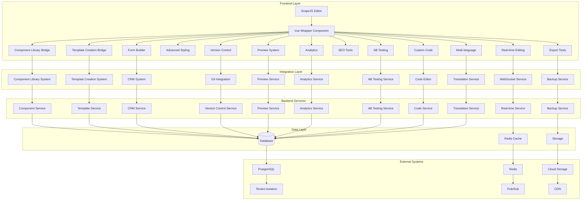
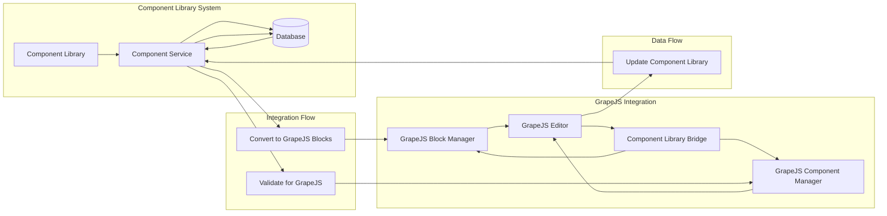
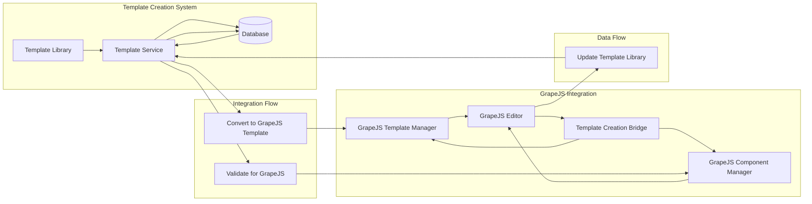

# Vue.js Page Builder System Architecture

## Overview

This document outlines the architecture of the Vue.js Page Builder System, which integrates GrapeJS as the core page building engine with existing Component Library and Template Creation Systems. The system provides a comprehensive solution for marketing administrators to create, customize, and manage landing pages with advanced features like real-time editing, responsive design, A/B testing, and analytics integration.

## System Architecture

### High-Level Architecture



## Core Components

### 1. Vue Wrapper Component

The Vue Wrapper Component serves as the primary integration point between the Vue.js application and GrapeJS. It provides:

- A Vue 3 Composition API wrapper around GrapeJS
- Reactivity integration with Vue's reactivity system
- Component lifecycle management
- Event handling and propagation
- State synchronization between Vue and GrapeJS

```typescript
interface VueGrapeJSWrapper {
  // Initialization
  initialize(config: GrapeJSConfig): Promise<GrapeJSEditor>
  destroy(): void
  
  // Editor management
  getEditor(): GrapeJSEditor | null
  setEditor(editor: GrapeJSEditor): void
  
  // Component integration
  registerComponent(component: VueComponent): void
  unregisterComponent(componentId: string): void
  getRegisteredComponents(): VueComponent[]
  
  // State management
  getState(): GrapeJSState
  setState(state: GrapeJSState): void
  subscribeToStateChanges(callback: (state: GrapeJSState) => void): () => void
  
  // Event handling
  on(event: string, callback: (...args: any[]) => void): void
  off(event: string, callback: (...args: any[]) => void): void
  emit(event: string, ...args: any[]): void
  
  // Lifecycle
  mounted(): void
  unmounted(): void
  updated(): void
}

interface GrapeJSConfig {
  container: string | HTMLElement
  components: VueComponent[]
  plugins: string[]
  storageManager: StorageManagerConfig
  blockManager: BlockManagerConfig
  styleManager: StyleManagerConfig
  deviceManager: DeviceManagerConfig
  assetManager: AssetManagerConfig
  layerManager: LayerManagerConfig
  traitManager: TraitManagerConfig
  selectorManager: SelectorManagerConfig
  modal: ModalConfig
  panels: PanelConfig
  canvas: CanvasConfig
  richTextEditor: RichTextEditorConfig
  [key: string]: any
}

interface VueComponent {
  id: string
  name: string
  component: any
  config: ComponentConfig
}

interface ComponentConfig {
  category: string
  label: string
  media?: string
  content: string | ComponentDefinition
  attributes?: Record<string, any>
  traits?: TraitDefinition[]
  styles?: StyleDefinition[]
  [key: string]: any
}

interface GrapeJSEditor {
  // Core editor methods
  setComponents(components: any[]): void
  getComponents(): any[]
  addComponent(component: any): any
  removeComponent(component: any): void
  getHtml(): string
  getCss(): string
  getJs(): string
  runCommand(command: string, options?: any): any
  stopCommand(command: string): void
  store(): void
  load(): void
  
  // Managers
  DomComponents: any
  BlockManager: any
  StyleManager: any
  DeviceManager: any
  AssetManager: any
  LayerManager: any
  TraitManager: any
  SelectorManager: any
  Modal: any
  Panels: any
  Canvas: any
  RichTextEditor: any
  StorageManager: any
  
  // Events
  on(event: string, callback: (...args: any[]) => void): void
  off(event: string, callback: (...args: any[]) => void): void
  trigger(event: string, ...args: any[]): void
  
  // Configuration
  getConfig(): any
  setConfig(config: any): void
  
  // State
  getSelected(): any
  select(component: any): void
  deselect(): void
}

interface GrapeJSState {
  components: any[]
  selectedComponent: any | null
  device: string
  html: string
  css: string
  js: string
  isDirty: boolean
  lastSaved: Date | null
  [key: string]: any
}
```

### 2. Component Library Bridge

The Component Library Bridge integrates the existing Component Library System with GrapeJS, enabling the use of pre-built components within the page builder.

```typescript
interface ComponentLibraryBridge {
  // Component conversion
  convertToGrapeJSBlock(component: Component): GrapeJSBlock
  convertFromGrapeJSBlock(block: GrapeJSBlock): Component
  
  // Component management
  loadComponents(): Promise<Component[]>
  getComponent(componentId: string): Promise<Component>
  searchComponents(query: string, filters?: ComponentFilters): Promise<Component[]>
  getComponentCategories(): Promise<ComponentCategory[]>
  
  // Component registration
  registerComponentWithGrapeJS(component: Component): void
  unregisterComponentFromGrapeJS(componentId: string): void
  updateComponentInGrapeJS(componentId: string, component: Component): void
  
  // Component synchronization
  syncComponentUpdates(componentId: string): Promise<void>
  syncAllComponents(): Promise<void>
  
  // Component validation
  validateComponent(component: Component): ValidationResult
  validateComponentForGrapeJS(component: Component): ValidationResult
}

interface Component {
  id: string
  name: string
  description?: string
  category: ComponentCategory
  type: ComponentType
  config: ComponentConfig
  metadata: ComponentMetadata
  tenantId: string
  version: string
  isActive: boolean
  createdAt: Date
  updatedAt: Date
}

interface ComponentCategory {
  id: string
  name: string
  description?: string
  icon?: string
  order: number
  parentId?: string
}

type ComponentType = 
  'hero' | 'form' | 'testimonial' | 'statistic' | 
  'cta' | 'media' | 'navigation' | 'layout' | 
  'interactive' | 'ecommerce' | 'social' | 'custom'

interface ComponentConfig {
  template: string
  script?: string
  style?: string
  props?: ComponentProp[]
  slots?: ComponentSlot[]
  events?: ComponentEvent[]
  dependencies?: ComponentDependency[]
  customizableProperties?: Record<string, CustomizableProperty>
  [key: string]: any
}

interface ComponentProp {
  name: string
  type: PropType
  required?: boolean
  default?: any
  description?: string
  validator?: string
}

type PropType = 'string' | 'number' | 'boolean' | 'array' | 'object' | 'function' | 'custom'

interface ComponentSlot {
  name: string
  description?: string
  props?: ComponentProp[]
}

interface ComponentEvent {
  name: string
  description?: string
  payload?: any
}

interface ComponentDependency {
  name: string
  version: string
  type: DependencyType
}

type DependencyType = 'npm' | 'cdn' | 'local'

interface CustomizableProperty {
  type: PropertyType
  label: string
  description?: string
  defaultValue?: any
  options?: PropertyOption[]
  validation?: PropertyValidation
}

type PropertyType = 
  'text' | 'number' | 'boolean' | 'select' | 'color' | 
  'image' | 'url' | 'date' | 'time' | 'range' | 'custom'

interface PropertyOption {
  value: any
  label: string
}

interface PropertyValidation {
  required?: boolean
  minLength?: number
  maxLength?: number
  pattern?: string
  custom?: string
}

interface ComponentMetadata {
  tags?: string[]
  previewImage?: string
  documentation?: string
  examples?: ComponentExample[]
  changelog?: ComponentChangelog[]
  [key: string]: any
}

interface ComponentExample {
  title: string
  description: string
  config: any
  previewUrl?: string
}

interface ComponentChangelog {
  version: string
  date: Date
  changes: ChangelogEntry[]
}

interface ChangelogEntry {
  type: 'feature' | 'bugfix' | 'improvement' | 'breaking'
  description: string
}

interface GrapeJSBlock {
  id: string
  label: string
  category: string
  content: string | ComponentDefinition
  media?: string
  attributes?: Record<string, any>
  traits?: TraitDefinition[]
  styles?: StyleDefinition[]
}

interface ComponentDefinition {
  tagName: string
  attributes?: Record<string, any>
  content?: string
  components?: ComponentDefinition[]
  traits?: TraitDefinition[]
  styles?: StyleDefinition[]
  [key: string]: any
}

interface TraitDefinition {
  type: TraitType
  name: string
  label: string
  defaultValue?: any
  options?: TraitOption[]
  placeholder?: string
  [key: string]: any
}

type TraitType = 
  'text' | 'number' | 'select' | 'checkbox' | 'radio' | 
  'color' | 'slider' | 'file' | 'button' | 'custom'

interface TraitOption {
  id: string
  name: string
}

interface StyleDefinition {
  selector: string
  properties: Record<string, any>
}

interface ComponentFilters {
  category?: string
  type?: ComponentType
  tags?: string[]
  tenantId?: string
  isActive?: boolean
  searchQuery?: string
}

interface ValidationResult {
  isValid: boolean
  errors: ValidationError[]
  warnings: ValidationWarning[]
}

interface ValidationError {
  field: string
  message: string
  code: string
}

interface ValidationWarning {
  field: string
  message: string
  code: string
}
```

### 3. Template Creation Bridge

The Template Creation Bridge integrates the existing Template Creation System with GrapeJS, enabling the use of pre-built templates within the page builder.

```typescript
interface TemplateCreationBridge {
  // Template conversion
  convertToGrapeJSTemplate(template: Template): GrapeJSTemplate
  convertFromGrapeJSTemplate(grapeJSTemplate: GrapeJSTemplate): Template
  
  // Template management
  loadTemplates(): Promise<Template[]>
  getTemplate(templateId: string): Promise<Template>
  searchTemplates(query: string, filters?: TemplateFilters): Promise<Template[]>
  getTemplateCategories(): Promise<TemplateCategory[]>
  
  // Template registration
  registerTemplateWithGrapeJS(template: Template): void
  unregisterTemplateFromGrapeJS(templateId: string): void
  updateTemplateInGrapeJS(templateId: string, template: Template): void
  
  // Template synchronization
  syncTemplateUpdates(templateId: string): Promise<void>
  syncAllTemplates(): Promise<void>
  
  // Template validation
  validateTemplate(template: Template): ValidationResult
  validateTemplateForGrapeJS(template: Template): ValidationResult
}

interface Template {
  id: string
  name: string
  description?: string
  category: TemplateCategory
  type: TemplateType
  structure: TemplateStructure
  defaultConfig: TemplateConfig
  metadata: TemplateMetadata
  tenantId: string
  version: string
  isActive: boolean
  createdAt: Date
  updatedAt: Date
}

interface TemplateCategory {
  id: string
  name: string
  description?: string
  icon?: string
  order: number
  parentId?: string
}

type TemplateType = 
  'landing-page' | 'email-template' | 'blog-post' | 
  'product-page' | 'checkout-page' | 'dashboard' | 
  'portfolio' | 'resume' | 'custom'

interface TemplateStructure {
  sections: TemplateSection[]
  layout: TemplateLayout
  components: TemplateComponent[]
}

interface TemplateSection {
  id: string
  name: string
  description?: string
  type: SectionType
  config: SectionConfig
  order: number
}

type SectionType = 
  'hero' | 'content' | 'features' | 'testimonials' | 
  'pricing' | 'faq' | 'contact' | 'footer' | 'custom'

interface SectionConfig {
  layout: SectionLayout
  components: SectionComponent[]
  styles?: SectionStyle[]
  responsive?: ResponsiveConfig
  [key: string]: any
}

interface SectionLayout {
  type: LayoutType
  columns?: number
  rows?: number
  grid?: GridLayout
  flex?: FlexLayout
}

type LayoutType = 'grid' | 'flex' | 'float' | 'custom'

interface GridLayout {
  columns: number
  rows: number
  gaps?: GridGap
  areas?: string[][]
}

interface GridGap {
  row: number
  column: number
}

interface FlexLayout {
  direction: 'row' | 'column'
  wrap: 'wrap' | 'nowrap' | 'wrap-reverse'
  justifyContent: 'flex-start' | 'flex-end' | 'center' | 'space-between' | 'space-around' | 'space-evenly'
  alignItems: 'flex-start' | 'flex-end' | 'center' | 'baseline' | 'stretch'
}

interface SectionComponent {
  id: string
  componentId: string
  config: ComponentConfig
  order: number
}

interface SectionStyle {
  selector: string
  properties: Record<string, any>
}

interface ResponsiveConfig {
  breakpoints: BreakpointConfig[]
  mobileFirst?: boolean
}

interface BreakpointConfig {
  name: string
  minWidth: number
  maxWidth?: number
  styles: Record<string, any>
}

interface TemplateComponent {
  id: string
  componentId: string
  config: ComponentConfig
  position: ComponentPosition
}

interface ComponentPosition {
  sectionId: string
  order: number
  gridArea?: string
  gridColumn?: string
  gridRow?: string
  alignSelf?: string
  justifySelf?: string
}

interface TemplateConfig {
  theme: ThemeConfig
  styles: StyleConfig
  scripts: ScriptConfig
  seo: SEOConfig
  analytics: AnalyticsConfig
  integrations: IntegrationConfig
  [key: string]: any
}

interface ThemeConfig {
  colors: ColorPalette
  typography: TypographyConfig
  spacing: SpacingConfig
  breakpoints: BreakpointConfig[]
  [key: string]: any
}

interface ColorPalette {
  primary: string
  secondary: string
  accent: string
  background: string
  text: string
  [key: string]: string
}

interface TypographyConfig {
  fontFamily: string
  fontSizeBase: string
  lineHeightBase: string
  headings: HeadingConfig
  [key: string]: any
}

interface HeadingConfig {
  h1: HeadingStyle
  h2: HeadingStyle
  h3: HeadingStyle
  h4: HeadingStyle
  h5: HeadingStyle
  h6: HeadingStyle
}

interface HeadingStyle {
  fontSize: string
  fontWeight: string | number
  lineHeight: string
  marginBottom: string
}

interface SpacingConfig {
  base: string
  scale: SpacingScale
}

interface SpacingScale {
  xs: string
  sm: string
  md: string
  lg: string
  xl: string
  xxl: string
}

interface StyleConfig {
  global: string
  components: Record<string, string>
  utilities: string
  [key: string]: any
}

interface ScriptConfig {
  head: string[]
  body: string[]
  footer: string[]
  [key: string]: any
}

interface SEOConfig {
  title: string
  description: string
  keywords: string[]
  openGraph: OpenGraphConfig
  twitter: TwitterConfig
  [key: string]: any
}

interface OpenGraphConfig {
  title: string
  description: string
  image: string
  url: string
  type: string
  siteName: string
}

interface TwitterConfig {
  card: string
  site: string
  title: string
  description: string
  image: string
}

interface AnalyticsConfig {
  googleAnalytics: GoogleAnalyticsConfig
  facebookPixel: FacebookPixelConfig
  custom: CustomAnalyticsConfig[]
  [key: string]: any
}

interface GoogleAnalyticsConfig {
  trackingId: string
  anonymizeIp: boolean
  enhancedLinkAttribution: boolean
}

interface FacebookPixelConfig {
  pixelId: string
  autoConfig: boolean
  debug: boolean
}

interface CustomAnalyticsConfig {
  name: string
  script: string
  events: AnalyticsEvent[]
}

interface AnalyticsEvent {
  name: string
  trigger: EventTrigger
  parameters: Record<string, any>
}

interface EventTrigger {
  type: TriggerType
  selector?: string
  event?: string
  condition?: string
}

type TriggerType = 'click' | 'view' | 'form_submit' | 'custom'

interface IntegrationConfig {
  crm: CRMIntegrationConfig
  email: EmailIntegrationConfig
  payment: PaymentIntegrationConfig
  social: SocialIntegrationConfig
  [key: string]: any
}

interface CRMIntegrationConfig {
  provider: CRMProvider
  apiKey: string
  endpoint: string
  syncContacts: boolean
  syncLeads: boolean
}

type CRMProvider = 'salesforce' | 'hubspot' | 'zoho' | 'custom'

interface EmailIntegrationConfig {
  provider: EmailProvider
  apiKey: string
  senderEmail: string
  senderName: string
}

type EmailProvider = 'sendgrid' | 'mailgun' | 'ses' | 'smtp' | 'custom'

interface PaymentIntegrationConfig {
  provider: PaymentProvider
  publicKey: string
  secretKey: string
  testMode: boolean
}

type PaymentProvider = 'stripe' | 'paypal' | 'square' | 'custom'

interface SocialIntegrationConfig {
  facebook: SocialConfig
  twitter: SocialConfig
  linkedin: SocialConfig
  instagram: SocialConfig
}

interface SocialConfig {
  appId: string
  appSecret: string
  redirectUri: string
  scopes: string[]
}

interface TemplateMetadata {
  tags?: string[]
  previewImage?: string
  documentation?: string
  examples?: TemplateExample[]
  changelog?: TemplateChangelog[]
  [key: string]: any
}

interface TemplateExample {
  title: string
  description: string
  config: any
  previewUrl?: string
}

interface TemplateChangelog {
  version: string
  date: Date
  changes: ChangelogEntry[]
}

interface ChangelogEntry {
  type: 'feature' | 'bugfix' | 'improvement' | 'breaking'
  description: string
}

interface GrapeJSTemplate {
  html: string
  css: string
  components: ComponentDefinition[]
  styles: StyleDefinition[]
  metadata: TemplateMetadata
}

interface TemplateFilters {
  category?: string
  type?: TemplateType
  tags?: string[]
  tenantId?: string
  isActive?: boolean
  searchQuery?: string
}

interface ValidationResult {
  isValid: boolean
  errors: ValidationError[]
  warnings: ValidationWarning[]
}

interface ValidationError {
  field: string
  message: string
  code: string
}

interface ValidationWarning {
  field: string
  message: string
  code: string
}
```

## Integration Points

### 1. GrapeJS and Component Library System

The integration between GrapeJS and the Component Library System is achieved through the Component Library Bridge, which:

- Converts Component Library components to GrapeJS blocks
- Manages component registration and synchronization
- Handles component updates and validation
- Provides search and filtering capabilities



### 2. GrapeJS and Template Creation System

The integration between GrapeJS and the Template Creation System is achieved through the Template Creation Bridge, which:

- Converts Template Creation System templates to GrapeJS format
- Manages template registration and synchronization
- Handles template updates and validation
- Provides search and filtering capabilities



## System Shortcomings and Missing Components

### Current System Shortcomings

1. **Limited Real-time Collaboration**
   - No real-time editing capabilities
   - No user presence indicators
   - No conflict resolution mechanisms

2. **Basic Styling Tools**
   - Limited customization options
   - No advanced CSS editing
   - No responsive design tools

3. **Missing Form Builder**
   - No integrated form creation
   - No CRM connectivity
   - No form validation tools

4. **No Version Control**
   - No page versioning
   - No collaboration features
   - No rollback capabilities

5. **Basic Preview System**
   - No device simulation
   - No testing capabilities
   - No publishing workflow

6. **Limited SEO Tools**
   - No SEO optimization features
   - No performance monitoring
   - No analytics integration

7. **No A/B Testing**
   - No experimentation capabilities
   - No statistical analysis
   - No reporting features

8. **Limited Custom Code**
   - No code injection capabilities
   - No extensibility options
   - No plugin system

9. **Basic Export Tools**
   - No backup capabilities
   - No migration tools
   - No multi-format export

10. **No Multi-language Support**
    - No internationalization features
    - No translation tools
    - No localization capabilities

### Missing Components

1. **Real-time Editing System**
   - WebSocket integration
   - User presence tracking
   - Conflict resolution
   - Collaborative editing

2. **Advanced Styling Tools**
   - Visual style editor
   - CSS code editor
   - Responsive design controls
   - Theme management

3. **Form Builder**
   - Drag-and-drop form creation
   - Field validation
   - CRM integration
   - Form analytics

4. **Version Control System**
   - Git integration
   - Page versioning
   - Collaboration features
   - Rollback capabilities

5. **Preview System**
   - Device simulation
   - Testing tools
   - Publishing workflow
   - Approval system

6. **SEO Tools**
   - Meta tag management
   - Performance optimization
   - Analytics integration
   - Reporting tools

7. **A/B Testing System**
   - Experiment creation
   - Statistical analysis
   - Reporting dashboard
   - Winner declaration

8. **Custom Code System**
   - Code injection
   - Plugin management
   - Extensibility framework
   - Security controls

9. **Export System**
   - Multi-format export
   - Backup capabilities
   - Migration tools
   - Import functionality

10. **Multi-language System**
    - Translation management
    - Localization tools
    - Internationalization
    - Language switching

## Implementation Plan

### Phase 1: Core Infrastructure
1. Implement Vue Wrapper Component
2. Create Component Library Bridge
3. Create Template Creation Bridge
4. Set up basic integration between systems

### Phase 2: Essential Features
1. Implement real-time editing capabilities
2. Add advanced styling tools
3. Create form builder with CRM connectivity
4. Implement version control system

### Phase 3: Enhancement Features
1. Build preview, testing, and publishing system
2. Add SEO and performance optimization tools
3. Implement analytics and tracking capabilities
4. Create A/B testing integration system

### Phase 4: Advanced Features
1. Add custom code integration and extensibility
2. Implement export, backup, and migration capabilities
3. Build multi-language support system
4. Create comprehensive testing suite

### Phase 5: Production Features
1. Implement security and access control measures
2. Build deployment and production optimization
3. Document implementation and create handoff materials
4. Conduct final testing and quality assurance

## Dependencies

- `grapesjs` - Core page builder engine
- `vue` - Vue.js framework
- `pinia` - State management
- `axios` - HTTP client
- `socket.io-client` - WebSocket client
- `codemirror` - Code editor
- `chart.js` - Charting library
- `moment` - Date/time library
- `lodash` - Utility functions
- `uuid` - UUID generation
- `jszip` - ZIP archive creation
- `file-saver` - File saving utilities
- `i18next` - Internationalization framework
- `validator` - Validation library
- `dompurify` - HTML sanitization
- `marked` - Markdown processing
- `prismjs` - Syntax highlighting

## Security Considerations

- Validate all user inputs
- Sanitize HTML content
- Implement proper authentication
- Use secure WebSocket connections
- Encrypt sensitive data
- Implement rate limiting
- Validate file uploads
- Sanitize CSS and JavaScript
- Implement CSRF protection
- Use secure coding practices
- Follow OWASP guidelines
- Implement proper access controls
- Use environment variables for secrets
- Implement audit logging
- Regular security scanning

## Performance Considerations

- Implement caching strategies
- Optimize asset loading
- Use lazy loading for components
- Minimize bundle size
- Optimize database queries
- Implement pagination
- Use compression
- Optimize images
- Implement CDN integration
- Use service workers
- Implement progressive loading
- Optimize rendering performance
- Use virtual scrolling
- Implement code splitting
- Optimize network requests

## Accessibility Considerations

- Follow WCAG 2.1 guidelines
- Implement keyboard navigation
- Support screen readers
- Maintain color contrast
- Provide text alternatives
- Use semantic HTML
- Implement ARIA attributes
- Support zoom functionality
- Test with accessibility tools
- Provide skip links
- Implement focus management
- Support high contrast mode
- Provide captions for media
- Implement landmark roles
- Test with assistive technologies

## Testing Requirements

### Unit Tests
1. Vue Wrapper Component functionality
2. Component Library Bridge conversion
3. Template Creation Bridge conversion
4. Integration point validation
5. Error handling scenarios
6. Data validation and sanitization
7. Security feature implementation
8. Performance optimization

### Integration Tests
1. GrapeJS and Component Library integration
2. GrapeJS and Template Creation integration
3. Real-time editing with WebSocket
4. Form builder with CRM connectivity
5. Version control with Git integration
6. Preview system with device simulation
7. SEO tools with analytics integration
8. A/B testing with statistical analysis

### End-to-End Tests
1. Complete page building workflow
2. Component library integration
3. Template creation workflow
4. Real-time collaboration
5. Form building and submission
6. Version control operations
7. Preview and publishing
8. SEO optimization
9. A/B testing experiments
10. Custom code integration
11. Export and backup
12. Multi-language support

## Development Rules

### Critical Requirements
1. Never stage/commit files automatically
2. Always verify file creation in Windows
3. Maintain tenant data isolation
4. Follow existing patterns
5. Test thoroughly before completion

### File Operations
1. Use `.\artisan` for Laravel commands
2. Verify file paths work in Windows
3. Check file permissions
4. Validate file existence
5. Handle paths consistently

### Security Practices
1. Never expose sensitive data
2. Use environment variables
3. Validate user input
4. Maintain tenant boundaries
5. Follow security protocols

## Troubleshooting Guide

### Common Issues
1. **Tenant Identification**
   - Check domain access
   - Verify tenant context
   - Use correct URLs

2. **PHP Command Issues**
   - Use `.\artisan` on Windows
   - Verify PHP in PATH
   - Use full PHP path if needed

3. **Development Server**
   - Use correct ports
   - Check file permissions
   - Verify environment setup

## Project Structure

### Key Directories
```
resources/js/
├── components/    # Vue components
├── composables/   # Vue composables
├── layouts/       # Page layouts
├── Pages/         # Inertia.js pages
├── services/      # Business logic
├── stores/        # Pinia stores
└── types/         # TypeScript types
```

### Important Files
- `artisan`: Laravel CLI tool
- `package.json`: Node dependencies
- `composer.json`: PHP dependencies
- `tsconfig.json`: TypeScript config
- `vite.config.ts`: Build config

## Continuous Integration

### Before Submitting Changes
1. Run all tests
2. Check code style
3. Verify tenant isolation
4. Test all environments
5. Update documentation

### Quality Checks
```bash
# PHP checks
./vendor/bin/phpstan analyse
./vendor/bin/php-cs-fixer fix

# JavaScript/TypeScript
npm run lint
npm run format
```

## Accessibility Requirements
- Follow WCAG 2.1 guidelines
- Test with screen readers
- Support keyboard navigation
- Maintain color contrast
- Provide text alternatives