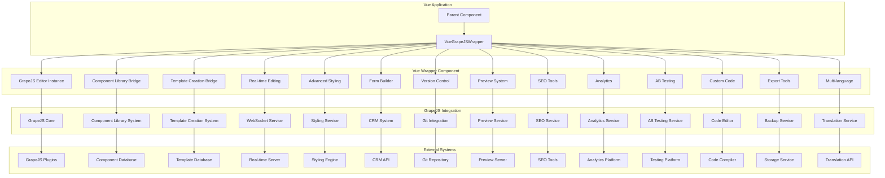

# Vue Wrapper Component Design

## Overview

This document outlines the design for the Vue Wrapper Component that integrates GrapeJS Page Builder with the Vue.js application. This component serves as the primary interface between the Vue application and GrapeJS, providing a seamless integration while maintaining Vue's reactivity and component-based architecture.

## Architecture

### Vue Wrapper Component Architecture



## Core Components

### 1. VueGrapeJSWrapper Component

```vue
<script setup lang="ts">
import { ref, computed, onMounted, onUnmounted, watch, nextTick } from 'vue'
import type { Ref } from 'vue'
import grapesjs from 'grapesjs'
import type { Editor } from 'grapesjs'
import { useComponentLibrary } from '@/composables/useComponentLibrary'
import { useTemplateCreation } from '@/composables/useTemplateCreation'
import { useRealTimeEditing } from '@/composables/useRealTimeEditing'
import { useAdvancedStyling } from '@/composables/useAdvancedStyling'
import { useFormBuilder } from '@/composables/useFormBuilder'
import { useVersionControl } from '@/composables/useVersionControl'
import { usePreviewSystem } from '@/composables/usePreviewSystem'
import { useSEOTools } from '@/composables/useSEOTools'
import { useAnalytics } from '@/composables/useAnalytics'
import { useABTesting } from '@/composables/useABTesting'
import { useCustomCode } from '@/composables/useCustomCode'
import { useExportTools } from '@/composables/useExportTools'
import { useMultiLanguage } from '@/composables/useMultiLanguage'
import type { 
  GrapeJSConfig, 
  Component, 
  Template, 
  Page,
  EditorState,
  EditorEvent,
  EditorCommand
} from '@/types/grapejs'

// Reactive state
const editor: Ref<Editor | null> = ref(null)
const isLoading = ref(true)
const isError = ref(false)
const errorMessage = ref('')
const currentPage: Ref<Page | null> = ref(null)
const selectedComponent: Ref<Component | null> = ref(null)
const activeTab = ref('builder')
const showComponentPanel = ref(true)
const showStylePanel = ref(true)
const showLayerPanel = ref(true)
const showTraitPanel = ref(true)
const showBlockPanel = ref(true)
const deviceMode = ref('desktop')
const isSaving = ref(false)
const isPublishing = ref(false)
const showPublishDialog = ref(false)
const showPreviewDialog = ref(false)
const showExportDialog = ref(false)
const showVersionHistoryDialog = ref(false)
const showCollaborationPanel = ref(false)
const showABTestingPanel = ref(false)
const showAnalyticsPanel = ref(false)
const showSEOPanel = ref(false)
const showCustomCodePanel = ref(false)
const showMultiLanguagePanel = ref(false)

// Composables
const { 
  components,
  loadComponents,
  getComponent,
  registerComponent,
  unregisterComponent
} = useComponentLibrary()

const { 
  templates,
  loadTemplates,
  getTemplate,
  applyTemplate
} = useTemplateCreation()

const { 
  connectToRealTimeServer,
  disconnectFromRealTimeServer,
  broadcastChange,
  applyRemoteChange
} = useRealTimeEditing()

const { 
  applyStyling,
  getStylingOptions,
  updateStyling
} = useAdvancedStyling()

const { 
  createForm,
  updateForm,
  deleteForm,
  getForms
} = useFormBuilder()

const { 
  createVersion,
  getVersion,
  getVersions,
  rollbackToVersion
} = useVersionControl()

const { 
  generatePreview,
  getPreviewUrl,
  updatePreview
} = usePreviewSystem()

const { 
  analyzeSEO,
  getSEORecommendations,
  applySEOChanges
} = useSEOTools()

const { 
  trackEvent,
  getAnalyticsData,
  getRealTimeAnalytics
} = useAnalytics()

const { 
  createTest,
  getTest,
  getTests,
  startTest,
  stopTest
} = useABTesting()

const { 
  addCustomCode,
  removeCustomCode,
  getCustomCode,
  validateCustomCode
} = useCustomCode()

const { 
  exportPage,
  importPage,
  backupPage,
  restorePage
} = useExportTools()

const { 
  setLanguage,
  getLanguages,
  translateContent
} = useMultiLanguage()

// Computed properties
const editorConfig = computed((): GrapeJSConfig => {
  return {
    container: '#grapesjs-editor',
    height: '100%',
    width: 'auto',
    storageManager: {
      type: 'remote',
      autosave: true,
      stepsBeforeSave: 1,
      options: {
        remote: {
          urlLoad: currentPage.value ? `/api/pages/${currentPage.value.id}/grapejs-data` : '',
          urlStore: currentPage.value ? `/api/pages/${currentPage.value.id}/grapejs-data` : '',
          headers: {
            'X-CSRF-TOKEN': document.querySelector('meta[name="csrf-token"]')?.getAttribute('content') || '',
            'Accept': 'application/json',
            'Content-Type': 'application/json'
          },
          contentTypeJson: true
        }
      }
    },
    blockManager: {
      appendTo: '#blocks-container'
    },
    styleManager: {
      appendTo: '#styles-container'
    },
    layerManager: {
      appendTo: '#layers-container'
    },
    traitManager: {
      appendTo: '#traits-container'
    },
    deviceManager: {
      devices: [
        { name: 'Desktop', width: '' },
        { name: 'Tablet', width: '768px' },
        { name: 'Mobile', width: '375px' }
      ]
    },
    plugins: [
      'gjs-blocks-basic',
      'grapesjs-plugin-forms',
      'grapesjs-component-countdown',
      'grapesjs-plugin-export',
      'grapesjs-tabs',
      'grapesjs-custom-code',
      'grapesjs-touch',
      'grapesjs-parser-postcss',
      'grapesjs-tooltip',
      'grapesjs-tui-image-editor',
      'grapesjs-typed',
      'grapesjs-style-bg'
    ],
    pluginsOpts: {
      'gjs-blocks-basic': { flexGrid: true }
    }
  }
})

const editorState = computed((): EditorState => {
  return {
    isLoading: isLoading.value,
    isError: isError.value,
    errorMessage: errorMessage.value,
    currentPage: currentPage.value,
    selectedComponent: selectedComponent.value,
    activeTab: activeTab.value,
    deviceMode: deviceMode.value,
    isSaving: isSaving.value,
    isPublishing: isPublishing.value
  }
})

const availableDevices = computed(() => {
  return [
    { id: 'desktop', name: 'Desktop', width: '' },
    { id: 'tablet', name: 'Tablet', width: '768px' },
    { id: 'mobile', name: 'Mobile', width: '375px' }
  ]
})

const componentCategories = computed(() => {
  const categories: Record<string, Component[]> = {}
  
  components.value.forEach(component => {
    if (!categories[component.category]) {
      categories[component.category] = []
    }
    categories[component.category].push(component)
  })
  
  return Object.entries(categories).map(([name, components]) => ({
    name,
    components
  }))
})

const templateCategories = computed(() => {
  const categories: Record<string, Template[]> = {}
  
  templates.value.forEach(template => {
    if (!categories[template.category]) {
      categories[template.category] = []
    }
    categories[template.category].push(template)
  })
  
  return Object.entries(categories).map(([name, templates]) => ({
    name,
    templates
  }))
})

// Lifecycle
onMounted(async () => {
  try {
    await initializeEditor()
    await loadSystemData()
  } catch (error) {
    console.error('Failed to initialize editor:', error)
    isError.value = true
    errorMessage.value = error instanceof Error ? error.message : 'Failed to initialize editor'
  } finally {
    isLoading.value = false
  }
})

onUnmounted(() => {
  if (editor.value) {
    editor.value.destroy()
  }
  
  // Disconnect from real-time server
  disconnectFromRealTimeServer()
})

// Watchers
watch(currentPage, async (newPage, oldPage) => {
  if (newPage && newPage.id !== oldPage?.id) {
    await loadPageData(newPage.id)
  }
})

watch(deviceMode, (newMode) => {
  if (editor.value) {
    editor.value.setDevice(newMode)
  }
})

// Methods
const initializeEditor = async (): Promise<void> => {
  try {
    // Initialize GrapeJS editor
    editor.value = await grapesjs.init(editorConfig.value)
    
    // Set up event listeners
    setupEditorEvents()
    
    // Register components with GrapeJS
    await registerComponentsWithEditor()
    
    // Register templates with GrapeJS
    await registerTemplatesWithEditor()
    
    // Connect to real-time server
    await connectToRealTimeServer()
    
    console.log('GrapeJS editor initialized successfully')
  } catch (error) {
    console.error('Failed to initialize GrapeJS editor:', error)
    throw error
  }
}

const setupEditorEvents = (): void => {
  if (!editor.value) return
  
  // Listen for component selection
  editor.value.on('component:selected', (component: any) => {
    const componentId = component.get('attributes')?.['data-component-id']
    if (componentId) {
      selectedComponent.value = getComponent(componentId)
    } else {
      selectedComponent.value = null
    }
  })
  
  // Listen for component updates
  editor.value.on('component:update', (component: any) => {
    // Broadcast changes to real-time server
    broadcastChange({
      type: 'component_update',
      componentId: component.getId(),
      data: component.toJSON(),
      timestamp: Date.now(),
      userId: 'current-user' // Would come from auth context
    })
  })
  
  // Listen for storage events
  editor.value.on('storage:start:store', () => {
    isSaving.value = true
  })
  
  editor.value.on('storage:end:store', () => {
    isSaving.value = false
    // Update page last saved timestamp
    if (currentPage.value) {
      currentPage.value.updatedAt = new Date().toISOString()
    }
  })
  
  editor.value.on('storage:error:store', (error: Error) => {
    isSaving.value = false
    console.error('Storage error:', error)
    isError.value = true
    errorMessage.value = `Failed to save page: ${error.message}`
  })
}

const registerComponentsWithEditor = async (): Promise<void> => {
  if (!editor.value) return
  
  try {
    // Load components from Component Library
    await loadComponents()
    
    // Register each component as a GrapeJS block
    components.value.forEach(component => {
      const block = convertComponentToBlock(component)
      editor.value?.BlockManager.add(block.id, block)
    })
    
    console.log(`Registered ${components.value.length} components with GrapeJS`)
  } catch (error) {
    console.error('Failed to register components with GrapeJS:', error)
    throw error
  }
}

const registerTemplatesWithEditor = async (): Promise<void> {
  if (!editor.value) return
  
  try {
    // Load templates from Template Creation System
    await loadTemplates()
    
    // Register each template as a GrapeJS block
    templates.value.forEach(template => {
      const block = convertTemplateToBlock(template)
      editor.value?.BlockManager.add(block.id, block)
    })
    
    console.log(`Registered ${templates.value.length} templates with GrapeJS`)
  } catch (error) {
    console.error('Failed to register templates with GrapeJS:', error)
    throw error
  }
}

const convertComponentToBlock = (component: Component): any => {
  return {
    id: `component-${component.id}`,
    label: component.name,
    category: component.category,
    content: component.config.template,
    media: component.metadata?.previewImage || '',
    attributes: {
      'data-component-id': component.id,
      'data-component-type': component.type,
      'data-tenant-id': component.tenantId
    }
  }
}

const convertTemplateToBlock = (template: Template): any => {
  return {
    id: `template-${template.id}`,
    label: template.name,
    category: template.category,
    content: template.structure.sections.map(section => section.config.template).join(''),
    media: template.metadata?.previewImage || '',
    attributes: {
      'data-template-id': template.id,
      'data-template-type': template.type,
      'data-tenant-id': template.tenantId
    }
  }
}

const loadSystemData = async (): Promise<void> => {
  try {
    // Load components
    await loadComponents()
    
    // Load templates
    await loadTemplates()
    
    // Load languages
    await getLanguages()
    
    console.log('System data loaded successfully')
  } catch (error) {
    console.error('Failed to load system data:', error)
    throw error
  }
}

const loadPageData = async (pageId: string): Promise<void> => {
  try {
    // Load page data from backend
    const response = await fetch(`/api/pages/${pageId}`)
    if (!response.ok) {
      throw new Error('Failed to load page data')
    }
    
    const pageData = await response.json()
    currentPage.value = pageData
    
    // Load page content into editor
    if (editor.value && pageData.grapejsData) {
      editor.value.setComponents(pageData.grapejsData.components)
      editor.value.setStyle(pageData.grapejsData.styles)
    }
    
    console.log(`Page data loaded for page ${pageId}`)
  } catch (error) {
    console.error('Failed to load page data:', error)
    throw error
  }
}

const saveCurrentPage = async (): Promise<void> {
  if (!editor.value || !currentPage.value) return
  
  try {
    isSaving.value = true
    
    // Get current editor data
    const grapejsData = {
      html: editor.value.getHtml(),
      css: editor.value.getCss(),
      components: editor.value.getComponents().toJSON(),
      styles: editor.value.getStyle().toJSON()
    }
    
    // Update page with current data
    currentPage.value.grapejsData = grapejsData
    currentPage.value.updatedAt = new Date().toISOString()
    
    // Save to backend
    const response = await fetch(`/api/pages/${currentPage.value.id}`, {
      method: 'PUT',
      headers: {
        'Content-Type': 'application/json',
        'X-CSRF-TOKEN': document.querySelector('meta[name="csrf-token"]')?.getAttribute('content') || ''
      },
      body: JSON.stringify(currentPage.value)
    })
    
    if (!response.ok) {
      throw new Error('Failed to save page')
    }
    
    console.log(`Page ${currentPage.value.id} saved successfully`)
  } catch (error) {
    console.error('Failed to save page:', error)
    isError.value = true
    errorMessage.value = error instanceof Error ? error.message : 'Failed to save page'
  } finally {
    isSaving.value = false
  }
}

const publishCurrentPage = async (): Promise<void> {
  if (!currentPage.value) return
  
  try {
    isPublishing.value = true
    
    // Update page status
    currentPage.value.status = 'published'
    currentPage.value.publishedAt = new Date().toISOString()
    
    // Save to backend
    const response = await fetch(`/api/pages/${currentPage.value.id}/publish`, {
      method: 'POST',
      headers: {
        'Content-Type': 'application/json',
        'X-CSRF-TOKEN': document.querySelector('meta[name="csrf-token"]')?.getAttribute('content') || ''
      },
      body: JSON.stringify({ status: 'published' })
    })
    
    if (!response.ok) {
      throw new Error('Failed to publish page')
    }
    
    console.log(`Page ${currentPage.value.id} published successfully`)
    showPublishDialog.value = false
  } catch (error) {
    console.error('Failed to publish page:', error)
    isError.value = true
    errorMessage.value = error instanceof Error ? error.message : 'Failed to publish page'
  } finally {
    isPublishing.value = false
  }
}

const unpublishCurrentPage = async (): Promise<void> {
  if (!currentPage.value) return
  
  try {
    // Update page status
    currentPage.value.status = 'draft'
    currentPage.value.publishedAt = null
    
    // Save to backend
    const response = await fetch(`/api/pages/${currentPage.value.id}/unpublish`, {
      method: 'POST',
      headers: {
        'Content-Type': 'application/json',
        'X-CSRF-TOKEN': document.querySelector('meta[name="csrf-token"]')?.getAttribute('content') || ''
      },
      body: JSON.stringify({ status: 'draft' })
    })
    
    if (!response.ok) {
      throw new Error('Failed to unpublish page')
    }
    
    console.log(`Page ${currentPage.value.id} unpublished successfully`)
  } catch (error) {
    console.error('Failed to unpublish page:', error)
    isError.value = true
    errorMessage.value = error instanceof Error ? error.message : 'Failed to unpublish page'
  }
}

const generateCurrentPreview = async (): Promise<void> {
  if (!editor.value || !currentPage.value) return
  
  try {
    // Get current editor data
    const grapejsData = {
      html: editor.value.getHtml(),
      css: editor.value.getCss(),
      components: editor.value.getComponents().toJSON(),
      styles: editor.value.getStyle().toJSON()
    }
    
    // Generate preview
    const preview = await generatePreview(currentPage.value.id, grapejsData)
    
    // Update preview dialog with preview URL
    showPreviewDialog.value = true
    console.log(`Preview generated for page ${currentPage.value.id}`)
  } catch (error) {
    console.error('Failed to generate preview:', error)
    isError.value = true
    errorMessage.value = error instanceof Error ? error.message : 'Failed to generate preview'
  }
}

const exportCurrentPage = async (format: string): Promise<void> => {
  if (!currentPage.value) return
  
  try {
    // Export page
    const exported = await exportPage(currentPage.value.id, format)
    
    // Download exported file
    const blob = new Blob([JSON.stringify(exported)], { type: 'application/json' })
    const url = URL.createObjectURL(blob)
    const a = document.createElement('a')
    a.href = url
    a.download = `page-${currentPage.value.id}.${format}`
    document.body.appendChild(a)
    a.click()
    document.body.removeChild(a)
    URL.revokeObjectURL(url)
    
    console.log(`Page ${currentPage.value.id} exported successfully`)
    showExportDialog.value = false
  } catch (error) {
    console.error('Failed to export page:', error)
    isError.value = true
    errorMessage.value = error instanceof Error ? error.message : 'Failed to export page'
  }
}

const importPageFromFile = async (file: File): Promise<void> => {
  try {
    // Read file content
    const content = await file.text()
    const pageData = JSON.parse(content)
    
    // Import page
    const imported = await importPage(pageData)
    
    // Update current page
    currentPage.value = imported
    
    // Load page content into editor
    if (editor.value && imported.grapejsData) {
      editor.value.setComponents(imported.grapejsData.components)
      editor.value.setStyle(imported.grapejsData.styles)
    }
    
    console.log(`Page imported successfully`)
  } catch (error) {
    console.error('Failed to import page:', error)
    isError.value = true
    errorMessage.value = error instanceof Error ? error.message : 'Failed to import page'
  }
}

const createNewVersion = async (): Promise<void> {
  if (!currentPage.value) return
  
  try {
    // Create new version
    const version = await createVersion(currentPage.value.id, {
      name: `Version ${new Date().toISOString()}`,
      description: 'Manual version creation',
      changes: []
    })
    
    console.log(`New version created for page ${currentPage.value.id}`)
    
    // Show version history dialog
    showVersionHistoryDialog.value = true
  } catch (error) {
    console.error('Failed to create new version:', error)
    isError.value = true
    errorMessage.value = error instanceof Error ? error.message : 'Failed to create new version'
  }
}

const rollbackToSelectedVersion = async (versionId: string): Promise<void> {
  if (!currentPage.value) return
  
  try {
    // Rollback to version
    const rolledBack = await rollbackToVersion(currentPage.value.id, versionId)
    
    // Update current page
    currentPage.value = rolledBack.page
    
    // Load page content into editor
    if (editor.value && rolledBack.page.grapejsData) {
      editor.value.setComponents(rolledBack.page.grapejsData.components)
      editor.value.setStyle(rolledBack.page.grapejsData.styles)
    }
    
    console.log(`Rolled back to version ${versionId} for page ${currentPage.value.id}`)
    
    // Close version history dialog
    showVersionHistoryDialog.value = false
  } catch (error) {
    console.error('Failed to rollback to version:', error)
    isError.value = true
    errorMessage.value = error instanceof Error ? error.message : 'Failed to rollback to version'
  }
}

const switchToDeviceMode = (mode: string): void => {
  deviceMode.value = mode
  if (editor.value) {
    editor.value.setDevice(mode)
  }
}

const togglePanel = (panel: string): void => {
  switch (panel) {
    case 'component':
      showComponentPanel.value = !showComponentPanel.value
      break
    case 'style':
      showStylePanel.value = !showStylePanel.value
      break
    case 'layer':
      showLayerPanel.value = !showLayerPanel.value
      break
    case 'trait':
      showTraitPanel.value = !showTraitPanel.value
      break
    case 'block':
      showBlockPanel.value = !showBlockPanel.value
      break
    case 'collaboration':
      showCollaborationPanel.value = !showCollaborationPanel.value
      break
    case 'ab-testing':
      showABTestingPanel.value = !showABTestingPanel.value
      break
    case 'analytics':
      showAnalyticsPanel.value = !showAnalyticsPanel.value
      break
    case 'seo':
      showSEOPanel.value = !showSEOPanel.value
      break
    case 'custom-code':
      showCustomCodePanel.value = !showCustomCodePanel.value
      break
    case 'multi-language':
      showMultiLanguagePanel.value = !showMultiLanguagePanel.value
      break
  }
}

const executeEditorCommand = (command: EditorCommand): void => {
  if (!editor.value) return
  
  try {
    switch (command.type) {
      case 'undo':
        editor.value.UndoManager.undo()
        break
      case 'redo':
        editor.value.UndoManager.redo()
        break
      case 'copy':
        editor.value.runCommand('tlb-copy')
        break
      case 'paste':
        editor.value.runCommand('tlb-paste')
        break
      case 'delete':
        editor.value.runCommand('tlb-delete')
        break
      case 'duplicate':
        editor.value.runCommand('tlb-clone')
        break
      case 'select-parent':
        editor.value.runCommand('core:component-select-parent')
        break
      case 'select-all':
        editor.value.runCommand('core:component-select-all')
        break
      case 'clear-canvas':
        if (confirm('Are you sure you want to clear the canvas?')) {
          editor.value.runCommand('core:canvas-clear')
        }
        break
      default:
        editor.value.runCommand(command.name, command.options)
    }
    
    console.log(`Executed editor command: ${command.type}`)
  } catch (error) {
    console.error('Failed to execute editor command:', error)
    isError.value = true
    errorMessage.value = error instanceof Error ? error.message : 'Failed to execute editor command'
  }
}

const handleEditorEvent = (event: EditorEvent): void => {
  switch (event.type) {
    case 'component_selected':
      selectedComponent.value = event.component || null
      break
    case 'component_updated':
      // Broadcast changes to real-time server
      broadcastChange({
        type: 'component_update',
        componentId: event.component?.getId() || '',
        data: event.component?.toJSON() || {},
        timestamp: Date.now(),
        userId: 'current-user' // Would come from auth context
      })
      break
    case 'page_saved':
      isSaving.value = false
      if (currentPage.value) {
        currentPage.value.updatedAt = new Date().toISOString()
      }
      break
    case 'page_save_error':
      isSaving.value = false
      isError.value = true
      errorMessage.value = event.error || 'Failed to save page'
      break
    case 'device_changed':
      deviceMode.value = event.device || 'desktop'
      break
    default:
      console.log(`Unhandled editor event: ${event.type}`)
  }
}

const resetEditor = (): void {
  if (!editor.value) return
  
  try {
    // Clear canvas
    editor.value.runCommand('core:canvas-clear')
    
    // Reset state
    selectedComponent.value = null
    deviceMode.value = 'desktop'
    
    console.log('Editor reset successfully')
  } catch (error) {
    console.error('Failed to reset editor:', error)
    isError.value = true
    errorMessage.value = error instanceof Error ? error.message : 'Failed to reset editor'
  }
}

const generateId = (): string => {
  return 'wrapper-' + Math.random().toString(36).substr(2, 9)
}
</script>
```

### 2. Component Registration System

```typescript
interface ComponentRegistrationSystem {
  // Component registration
  registerComponent(component: Component): Promise<void>
  unregisterComponent(componentId: string): Promise<void>
  updateComponent(componentId: string, component: Component): Promise<Component>
  getComponent(componentId: string): Promise<Component | null>
  getComponents(): Promise<Component[]>
  searchComponents(query: string, filters?: ComponentFilters): Promise<Component[]>
  
  // Component validation
  validateComponent(component: Component): Promise<ValidationResult>
  validateComponentForGrapeJS(component: Component): Promise<ValidationResult>
  
  // Component conversion
  convertComponentToGrapeJSBlock(component: Component): Promise<GrapeJSBlock>
  convertGrapeJSBlockToComponent(block: GrapeJSBlock): Promise<Component>
  
  // Component synchronization
  syncComponentWithGrapeJS(componentId: string): Promise<void>
  syncAllComponentsWithGrapeJS(): Promise<void>
  
  // Component categorization
  getComponentCategories(): Promise<ComponentCategory[]>
  createComponentCategory(category: ComponentCategory): Promise<ComponentCategory>
  updateComponentCategory(categoryId: string, category: ComponentCategory): Promise<ComponentCategory>
  deleteComponentCategory(categoryId: string): Promise<void>
}

interface ComponentFilters {
  category?: string
  type?: ComponentType
  tags?: string[]
  tenantId?: string
  isActive?: boolean
  searchQuery?: string
}

interface ValidationResult {
  isValid: boolean
  errors: ValidationError[]
  warnings: ValidationWarning[]
}

interface ValidationError {
  field: string
  message: string
  code: string
}

interface ValidationWarning {
  field: string
  message: string
  code: string
}

interface GrapeJSBlock {
  id: string
  label: string
  category: string
  content: string | ComponentDefinition
  media?: string
  attributes?: Record<string, any>
  traits?: TraitDefinition[]
  styles?: StyleDefinition[]
}

interface ComponentDefinition {
  tagName: string
  attributes?: Record<string, any>
  content?: string
  components?: ComponentDefinition[]
  traits?: TraitDefinition[]
  styles?: StyleDefinition[]
  [key: string]: any
}

interface TraitDefinition {
  type: TraitType
  name: string
  label: string
  defaultValue?: any
  options?: TraitOption[]
  placeholder?: string
  [key: string]: any
}

type TraitType = 
  'text' | 'number' | 'select' | 'checkbox' | 'radio' | 
  'color' | 'slider' | 'file' | 'button' | 'custom'

interface TraitOption {
  id: string
  name: string
}

interface StyleDefinition {
  selector: string
  properties: Record<string, any>
}

class ComponentRegistrationManager implements ComponentRegistrationSystem {
  private components: Map<string, Component> = new Map()
  private categories: Map<string, ComponentCategory> = new Map()
  private editor: Editor | null = null
  
  async registerComponent(component: Component): Promise<void> {
    // Validate component
    const validationResult = await this.validateComponent(component)
    if (!validationResult.isValid) {
      throw new Error(`Component validation failed: ${validationResult.errors.map(e => e.message).join(', ')}`)
    }
    
    // Validate for GrapeJS
    const grapeJSValidation = await this.validateComponentForGrapeJS(component)
    if (!grapeJSValidation.isValid) {
      throw new Error(`Component validation for GrapeJS failed: ${grapeJSValidation.errors.map(e => e.message).join(', ')}`)
    }
    
    // Store component
    this.components.set(component.id, component)
    
    // Convert to GrapeJS block
    const grapeJSBlock = await this.convertComponentToGrapeJSBlock(component)
    
    // Register with GrapeJS if editor is available
    if (this.editor) {
      this.editor.BlockManager.add(grapeJSBlock.id, grapeJSBlock)
    }
    
    // Save to backend
    try {
      const response = await fetch('/api/components', {
        method: 'POST',
        headers: {
          'Content-Type': 'application/json',
        },
        body: JSON.stringify(component)
      })
      
      if (!response.ok) {
        throw new Error('Failed to save component')
      }
      
      console.log(`Component ${component.name} registered successfully`)
    } catch (error) {
      console.error('Failed to save component:', error)
      throw error
    }
  }
  
  async unregisterComponent(componentId: string): Promise<void> {
    const component = this.components.get(componentId)
    if (!component) {
      throw new Error(`Component with ID ${componentId} not found`)
    }
    
    // Remove from local storage
    this.components.delete(componentId)
    
    // Remove from GrapeJS if editor is available
    if (this.editor) {
      this.editor.BlockManager.remove(`component-${componentId}`)
    }
    
    // Remove from backend
    try {
      const response = await fetch(`/api/components/${componentId}`, {
        method: 'DELETE'
      })
      
      if (!response.ok) {
        throw new Error('Failed to delete component')
      }
      
      console.log(`Component ${componentId} unregistered successfully`)
    } catch (error) {
      console.error('Failed to delete component:', error)
      throw error
    }
  }
  
  async updateComponent(componentId: string, component: Component): Promise<Component> {
    const existingComponent = this.components.get(componentId)
    if (!existingComponent) {
      throw new Error(`Component with ID ${componentId} not found`)
    }
    
    // Validate component
    const validationResult = await this.validateComponent(component)
    if (!validationResult.isValid) {
      throw new Error(`Component validation failed: ${validationResult.errors.map(e => e.message).join(', ')}`)
    }
    
    // Validate for GrapeJS
    const grapeJSValidation = await this.validateComponentForGrapeJS(component)
    if (!grapeJSValidation.isValid) {
      throw new Error(`Component validation for GrapeJS failed: ${grapeJSValidation.errors.map(e => e.message).join(', ')}`)
    }
    
    // Update component
    const updatedComponent: Component = {
      ...existingComponent,
      ...component,
      updatedAt: new Date().toISOString()
    }
    
    this.components.set(componentId, updatedComponent)
    
    // Update GrapeJS block if editor is available
    if (this.editor) {
      const grapeJSBlock = await this.convertComponentToGrapeJSBlock(updatedComponent)
      const existingBlock = this.editor.BlockManager.get(`component-${componentId}`)
      
      if (existingBlock) {
        existingBlock.set(grapeJSBlock)
      } else {
        this.editor.BlockManager.add(grapeJSBlock.id, grapeJSBlock)
      }
    }
    
    // Update in backend
    try {
      const response = await fetch(`/api/components/${componentId}`, {
        method: 'PUT',
        headers: {
          'Content-Type': 'application/json',
        },
        body: JSON.stringify(updatedComponent)
      })
      
      if (!response.ok) {
        throw new Error('Failed to update component')
      }
      
      console.log(`Component ${componentId} updated successfully`)
      return updatedComponent
    } catch (error) {
      console.error('Failed to update component:', error)
      throw error
    }
  }
  
  async getComponent(componentId: string): Promise<Component | null> {
    const component = this.components.get(componentId)
    if (component) {
      return component
    }
    
    // Fetch from backend
    try {
      const response = await fetch(`/api/components/${componentId}`)
      if (!response.ok) {
        return null
      }
      
      const componentData = await response.json()
      this.components.set(componentId, componentData)
      return componentData
    } catch (error) {
      console.error('Failed to fetch component:', error)
      return null
    }
  }
  
  async getComponents(): Promise<Component[]> {
    try {
      const response = await fetch('/api/components')
      if (!response.ok) {
        throw new Error('Failed to fetch components')
      }
      
      const components = await response.json()
      
      // Cache components
      components.forEach((component: Component) => {
        this.components.set(component.id, component)
      })
      
      return components
    } catch (error) {
      console.error('Failed to fetch components:', error)
      throw error
    }
  }
  
  async searchComponents(query: string, filters?: ComponentFilters): Promise<Component[]> {
    try {
      const params = new URLSearchParams()
      params.append('query', query)
      
      if (filters?.category) params.append('category', filters.category)
      if (filters?.type) params.append('type', filters.type)
      if (filters?.tags) params.append('tags', filters.tags.join(','))
      if (filters?.tenantId) params.append('tenantId', filters.tenantId)
      if (filters?.isActive !== undefined) params.append('isActive', filters.isActive.toString())
      if (filters?.searchQuery) params.append('searchQuery', filters.searchQuery)
      
      const response = await fetch(`/api/components/search?${params.toString()}`)
      if (!response.ok) {
        throw new Error('Failed to search components')
      }
      
      const components = await response.json()
      
      // Cache components
      components.forEach((component: Component) => {
        this.components.set(component.id, component)
      })
      
      return components
    } catch (error) {
      console.error('Failed to search components:', error)
      throw error
    }
  }
  
  async validateComponent(component: Component): Promise<ValidationResult> {
    const errors: ValidationError[] = []
    const warnings: ValidationWarning[] = []
    
    // Validate required fields
    if (!component.name || component.name.trim() === '') {
      errors.push({
        field: 'name',
        message: 'Component name is required',
        code: 'MISSING_NAME'
      })
    }
    
    if (!component.category) {
      errors.push({
        field: 'category',
        message: 'Component category is required',
        code: 'MISSING_CATEGORY'
      })
    }
    
    if (!component.type) {
      errors.push({
        field: 'type',
        message: 'Component type is required',
        code: 'MISSING_TYPE'
      })
    }
    
    if (!component.config) {
      errors.push({
        field: 'config',
        message: 'Component configuration is required',
        code: 'MISSING_CONFIG'
      })
    }
    
    // Validate component configuration
    if (component.config) {
      if (!component.config.template) {
        warnings.push({
          field: 'config.template',
          message: 'Component template is recommended for better usability',
          code: 'MISSING_TEMPLATE'
        })
      }
      
      // Validate props if they exist
      if (component.config.props) {
        component.config.props.forEach((prop, index) => {
          if (!prop.name) {
            errors.push({
              field: `config.props[${index}].name`,
              message: 'Component prop name is required',
              code: 'MISSING_PROP_NAME'
            })
          }
          
          if (!prop.type) {
            errors.push({
              field: `config.props[${index}].type`,
              message: 'Component prop type is required',
              code: 'MISSING_PROP_TYPE'
            })
          }
        })
      }
    }
    
    return {
      isValid: errors.length === 0,
      errors,
      warnings
    }
  }
  
  async validateComponentForGrapeJS(component: Component): Promise<ValidationResult> {
    const errors: ValidationError[] = []
    const warnings: ValidationWarning[] = []
    
    // Validate template for GrapeJS compatibility
    if (component.config?.template) {
      // Check for valid HTML structure
      const template = component.config.template
      const openTags = (template.match(/</g) || []).length
      const closeTags = (template.match(/>/g) || []).length
      
      if (openTags !== closeTags) {
        errors.push({
          field: 'config.template',
          message: 'Component template has unmatched HTML tags',
          code: 'INVALID_HTML_STRUCTURE'
        })
      }
      
      // Check for GrapeJS-specific requirements
      if (!template.includes('data-gjs-type')) {
        warnings.push({
          field: 'config.template',
          message: 'Component template should include data-gjs-type for better GrapeJS integration',
          code: 'MISSING_GJS_TYPE'
        })
      }
    }
    
    // Validate traits for GrapeJS compatibility
    if (component.config?.traits) {
      component.config.traits.forEach((trait, index) => {
        if (!trait.type) {
          errors.push({
            field: `config.traits[${index}].type`,
            message: 'Component trait type is required',
            code: 'MISSING_TRAIT_TYPE'
          })
        }
        
        if (!trait.name) {
          errors.push({
            field: `config.traits[${index}].name`,
            message: 'Component trait name is required',
            code: 'MISSING_TRAIT_NAME'
          })
        }
      })
    }
    
    return {
      isValid: errors.length === 0,
      errors,
      warnings
    }
  }
  
  async convertComponentToGrapeJSBlock(component: Component): Promise<GrapeJSBlock> {
    return {
      id: `component-${component.id}`,
      label: component.name,
      category: component.category,
      content: component.config.template || '',
      media: component.metadata?.previewImage || '',
      attributes: {
        'data-component-id': component.id,
        'data-component-type': component.type,
        'data-tenant-id': component.tenantId
      },
      traits: component.config.traits?.map(trait => ({
        type: trait.type,
        name: trait.name,
        label: trait.label || trait.name,
        defaultValue: trait.defaultValue,
        options: trait.options,
        placeholder: trait.placeholder
      })) || [],
      styles: component.config.styles ? [{
        selector: `[data-component-id="${component.id}"]`,
        properties: component.config.styles
      }] : []
    }
  }
  
  async convertGrapeJSBlockToComponent(block: GrapeJSBlock): Promise<Component> {
    // This would extract component information from a GrapeJS block
    // Implementation would depend on the specific block structure
    console.log('Converting GrapeJS block to component:', block)
    
    return {
      id: block.id.replace('component-', ''),
      tenantId: block.attributes?.['data-tenant-id'] || '',
      name: block.label,
      slug: block.id.replace('component-', ''),
      category: block.category as ComponentCategory,
      type: block.attributes?.['data-component-type'] || 'custom',
      description: '',
      config: {
        template: typeof block.content === 'string' ? block.content : JSON.stringify(block.content),
        traits: block.traits || [],
        styles: block.styles?.[0]?.properties || {}
      },
      metadata: {
        previewImage: block.media
      },
      version: '1.0.0',
      isActive: true,
      createdAt: new Date().toISOString(),
      updatedAt: new Date().toISOString()
    }
  }
  
  async syncComponentWithGrapeJS(componentId: string): Promise<void> {
    const component = await this.getComponent(componentId)
    if (!component) {
      throw new Error(`Component with ID ${componentId} not found`)
    }
    
    // Convert to GrapeJS block
    const grapeJSBlock = await this.convertComponentToGrapeJSBlock(component)
    
    // Update in GrapeJS if editor is available
    if (this.editor) {
      const existingBlock = this.editor.BlockManager.get(`component-${componentId}`)
      
      if (existingBlock) {
        existingBlock.set(grapeJSBlock)
      } else {
        this.editor.BlockManager.add(grapeJSBlock.id, grapeJSBlock)
      }
    }
    
    console.log(`Component ${componentId} synced with GrapeJS`)
  }
  
  async syncAllComponentsWithGrapeJS(): Promise<void> {
    const components = await this.getComponents()
    
    // Sync all components with GrapeJS
    await Promise.all(
      components.map(component => this.syncComponentWithGrapeJS(component.id))
    )
    
    console.log(`Synced ${components.length} components with GrapeJS`)
  }
  
  async getComponentCategories(): Promise<ComponentCategory[]> {
    try {
      const response = await fetch('/api/component-categories')
      if (!response.ok) {
        throw new Error('Failed to fetch component categories')
      }
      
      const categories = await response.json()
      
      // Cache categories
      categories.forEach((category: ComponentCategory) => {
        this.categories.set(category.id, category)
      })
      
      return categories
    } catch (error) {
      console.error('Failed to fetch component categories:', error)
      throw error
    }
  }
  
  async createComponentCategory(category: ComponentCategory): Promise<ComponentCategory> {
    // Validate category
    if (!category.name || category.name.trim() === '') {
      throw new Error('Category name is required')
    }
    
    // Store category
    this.categories.set(category.id, category)
    
    // Save to backend
    try {
      const response = await fetch('/api/component-categories', {
        method: 'POST',
        headers: {
          'Content-Type': 'application/json',
        },
        body: JSON.stringify(category)
      })
      
      if (!response.ok) {
        throw new Error('Failed to create component category')
      }
      
      const createdCategory = await response.json()
      console.log(`Component category ${category.name} created successfully`)
      return createdCategory
    } catch (error) {
      console.error('Failed to create component category:', error)
      throw error
    }
  }
  
  async updateComponentCategory(categoryId: string, category: ComponentCategory): Promise<ComponentCategory> {
    const existingCategory = this.categories.get(categoryId)
    if (!existingCategory) {
      throw new Error(`Component category with ID ${categoryId} not found`)
    }
    
    // Update category
    const updatedCategory: ComponentCategory = {
      ...existingCategory,
      ...category,
      updatedAt: new Date().toISOString()
    }
    
    this.categories.set(categoryId, updatedCategory)
    
    // Update in backend
    try {
      const response = await fetch(`/api/component-categories/${categoryId}`, {
        method: 'PUT',
        headers: {
          'Content-Type': 'application/json',
        },
        body: JSON.stringify(updatedCategory)
      })
      
      if (!response.ok) {
        throw new Error('Failed to update component category')
      }
      
      console.log(`Component category ${categoryId} updated successfully`)
      return updatedCategory
    } catch (error) {
      console.error('Failed to update component category:', error)
      throw error
    }
  }
  
  async deleteComponentCategory(categoryId: string): Promise<void> {
    const category = this.categories.get(categoryId)
    if (!category) {
      throw new Error(`Component category with ID ${categoryId} not found`)
    }
    
    // Remove from local storage
    this.categories.delete(categoryId)
    
    // Remove from backend
    try {
      const response = await fetch(`/api/component-categories/${categoryId}`, {
        method: 'DELETE'
      })
      
      if (!response.ok) {
        throw new Error('Failed to delete component category')
      }
      
      console.log(`Component category ${categoryId} deleted successfully`)
    } catch (error) {
      console.error('Failed to delete component category:', error)
      throw error
    }
  }
  
  setEditor(editor: Editor): void {
    this.editor = editor
  }
  
  private async validateBackupSchedule(config: BackupSchedule): Promise<void> {
    if (!config.name || config.name.trim() === '') {
      throw new Error('Backup schedule name is required')
    }
    
    if (!config.frequency) {
      throw new Error('Backup frequency is required')
    }
    
    if (!config.targets || config.targets.length === 0) {
      throw new Error('At least one backup target is required')
    }
    
    // Validate retention policy
    if (config.retention) {
      if (config.retention.maxBackups && config.retention.maxBackups < 1) {
        throw new Error('Maximum backups must be at least 1')
      }
      
      if (config.retention.maxAgeDays && config.retention.maxAgeDays < 1) {
        throw new Error('Maximum age days must be at least 1')
      }
    }
  }
  
  private async setupRecurringBackup(schedule: BackupSchedule): Promise<void> {
    // Set up recurring backup based on schedule frequency
    console.log(`Setting up recurring backup for schedule ${schedule.name}`)
    
    // In a real implementation, this would use a scheduler like node-cron
    // For now, we'll just log the setup
  }
  
  private async cancelScheduledBackups(scheduleId: string): Promise<void> {
    // Cancel any pending backups for this schedule
    console.log(`Cancelling scheduled backups for schedule ${scheduleId}`)
    
    // In a real implementation, this would cancel pending jobs
  }
  
  private generateId(): string {
    return 'backup-' + Math.random().toString(36).substr(2, 9)
  }
}

interface BackupJob {
  id: string
  scheduleId: string
  status: BackupStatus
  createdAt: Date
  startedAt?: Date
  completedAt?: Date
  error?: string
  result?: BackupResult
}

type BackupStatus = 'pending' | 'running' | 'completed' | 'failed' | 'cancelled'

interface BackupResult {
  success: boolean
  backupId?: string
  fileName?: string
  fileSize?: number
  duration?: number
  errors?: string[]
  warnings?: string[]
}
```

## Integration with Vue Wrapper Component

### Backup Tools Integration

```vue
<script setup lang="ts">
import { ref, computed, onMounted, watch } from 'vue'
import { useBackup } from '@/composables/useBackup'
import type { 
  BackupSchedule, 
  BackupRecord, 
  BackupPolicy,
  BackupTarget,
  RetentionPolicy
} from '@/types/backup'

const { 
  scheduleBackup,
  unscheduleBackup,
  getBackupSchedules,
  updateBackupSchedule,
  createBackup,
  restoreBackup,
  getBackups,
  getBackup,
  deleteBackup,
  downloadBackup,
  createBackupPolicy,
  updateBackupPolicy,
  deleteBackupPolicy,
  getBackupPolicies
} = useBackup()

const selectedPageId = ref<string | null>(null)
const backupSchedules = ref<BackupSchedule[]>([])
const backups = ref<BackupRecord[]>([])
const backupPolicies = ref<BackupPolicy[]>([])
const showBackupPanel = ref(true)
const activeTab = ref<'schedules' | 'backups' | 'policies'>('schedules')

// Form models
const newBackupSchedule = ref<Omit<BackupSchedule, 'id' | 'createdAt' | 'updatedAt' | 'createdBy' | 'status'>>({
  name: '',
  description: '',
  frequency: 'daily',
  timeOfDay: '02:00',
  retention: {
    maxBackups: 30,
    maxAgeDays: 90
  },
  targets: [
    { type: 'all_pages' }
  ]
})

const newBackupPolicy = ref<Omit<BackupPolicy, 'id' | 'createdAt' | 'updatedAt' | 'createdBy'>>({
  name: '',
  description: '',
  rules: [],
  defaultRetention: {
    maxBackups: 30,
    maxAgeDays: 90
  },
  encryption: {
    enabled: true,
    algorithm: 'AES-256'
  },
  compression: true,
  notifications: {
    email: true,
    emailAddresses: []
  }
})

// Computed properties
const backupFrequencyOptions = computed(() => {
  return [
    { value: 'hourly', label: 'Hourly' },
    { value: 'daily', label: 'Daily' },
    { value: 'weekly', label: 'Weekly' },
    { value: 'monthly', label: 'Monthly' },
    { value: 'custom', label: 'Custom' }
  ]
})

const backupTargetOptions = computed(() => {
  return [
    { value: 'all_pages', label: 'All Pages' },
    { value: 'all_templates', label: 'All Templates' },
    { value: 'component_library', label: 'Component Library' },
    { value: 'specific_pages', label: 'Specific Pages' },
    { value: 'specific_templates', label: 'Specific Templates' }
  ]
})

const encryptionAlgorithmOptions = computed(() => {
  return [
    { value: 'AES-256', label: 'AES-256' },
    { value: 'RSA-2048', label: 'RSA-2048' },
    { value: 'RSA-4096', label: 'RSA-4096' }
  ]
})

// Lifecycle
onMounted(() => {
  loadBackupSchedules()
  loadBackups()
  loadBackupPolicies()
})

// Watchers
watch(selectedPageId, async (newId) => {
  if (newId) {
    await loadBackups()
  }
})

// Methods
const loadBackupSchedules = async () => {
  try {
    backupSchedules.value = await getBackupSchedules()
  } catch (error) {
    console.error('Failed to load backup schedules:', error)
  }
}

const loadBackups = async () => {
  try {
    backups.value = await getBackups({
      limit: 50,
      offset: 0
    })
  } catch (error) {
    console.error('Failed to load backups:', error)
  }
}

const loadBackupPolicies = async () => {
  try {
    backupPolicies.value = await getBackupPolicies()
  } catch (error) {
    console.error('Failed to load backup policies:', error)
  }
}

const createNewBackupSchedule = async () => {
  if (!newBackupSchedule.value.name) {
    alert('Backup schedule name is required')
    return
  }
  
  try {
    const schedule = await scheduleBackup({
      ...newBackupSchedule.value,
      id: this.generateId(),
      createdAt: new Date(),
      updatedAt: new Date(),
      createdBy: 'current-user', // Would come from auth context
      status: 'active'
    })
    
    backupSchedules.value.push(schedule)
    resetBackupScheduleForm()
    alert('Backup schedule created successfully!')
  } catch (error) {
    console.error('Failed to create backup schedule:', error)
    alert('Failed to create backup schedule')
  }
}

const updateSelectedBackupSchedule = async (scheduleId: string, config: Partial<BackupSchedule>) => {
  try {
    const schedule = await updateBackupSchedule(scheduleId, config)
    
    // Update in schedules list
    const index = backupSchedules.value.findIndex(s => s.id === scheduleId)
    if (index !== -1) {
      backupSchedules.value[index] = { ...backupSchedules.value[index], ...config, updatedAt: new Date() }
    }
    
    alert('Backup schedule updated successfully!')
  } catch (error) {
    console.error('Failed to update backup schedule:', error)
    alert('Failed to update backup schedule')
  }
}

const removeBackupSchedule = async (scheduleId: string) => {
  if (!confirm('Are you sure you want to remove this backup schedule?')) return
  
  try {
    await unscheduleBackup(scheduleId)
    
    // Remove from schedules list
    backupSchedules.value = backupSchedules.value.filter(s => s.id !== scheduleId)
    
    alert('Backup schedule removed successfully!')
  } catch (error) {
    console.error('Failed to remove backup schedule:', error)
    alert('Failed to remove backup schedule')
  }
}

const createNewBackup = async () => {
  try {
    const backup = await createBackup({
      name: `Manual Backup ${new Date().toISOString()}`,
      description: 'Manual backup created by user',
      targets: [
        { type: 'all_pages' },
        { type: 'all_templates' },
        { type: 'component_library' }
      ]
    })
    
    backups.value.unshift(backup)
    alert('Backup created successfully!')
  } catch (error) {
    console.error('Failed to create backup:', error)
    alert('Failed to create backup')
  }
}

const restoreSelectedBackup = async (backupId: string) => {
  if (!confirm('Are you sure you want to restore this backup? This will overwrite current data.')) return
  
  try {
    const result = await restoreBackup(backupId)
    
    if (result.success) {
      alert('Backup restored successfully!')
    } else {
      alert(`Backup restoration failed: ${result.errors?.join(', ') || 'Unknown error'}`)
    }
    
    // Refresh backups list
    await loadBackups()
  } catch (error) {
    console.error('Failed to restore backup:', error)
    alert('Failed to restore backup')
  }
}

const removeBackup = async (backupId: string) => {
  if (!confirm('Are you sure you want to remove this backup?')) return
  
  try {
    await deleteBackup(backupId)
    
    // Remove from backups list
    backups.value = backups.value.filter(b => b.id !== backupId)
    
    alert('Backup removed successfully!')
  } catch (error) {
    console.error('Failed to remove backup:', error)
    alert('Failed to remove backup')
  }
}

const downloadSelectedBackup = async (backupId: string) => {
  try {
    const blob = await downloadBackup(backupId)
    
    // Create download link
    const url = URL.createObjectURL(blob)
    const a = document.createElement('a')
    a.href = url
    a.download = `backup-${backupId}.zip`
    document.body.appendChild(a)
    a.click()
    document.body.removeChild(a)
    URL.revokeObjectURL(url)
    
    alert('Backup downloaded successfully!')
  } catch (error) {
    console.error('Failed to download backup:', error)
    alert('Failed to download backup')
  }
}

const createNewBackupPolicy = async () => {
  if (!newBackupPolicy.value.name) {
    alert('Backup policy name is required')
    return
  }
  
  try {
    const policy = await createBackupPolicy({
      ...newBackupPolicy.value,
      id: this.generateId(),
      createdAt: new Date(),
      updatedAt: new Date(),
      createdBy: 'current-user' // Would come from auth context
    })
    
    backupPolicies.value.push(policy)
    resetBackupPolicyForm()
    alert('Backup policy created successfully!')
  } catch (error) {
    console.error('Failed to create backup policy:', error)
    alert('Failed to create backup policy')
  }
}

const updateSelectedBackupPolicy = async (policyId: string, config: Partial<BackupPolicy>) => {
  try {
    const policy = await updateBackupPolicy(policyId, {
      ...config,
      updatedAt: new Date()
    })
    
    // Update in policies list
    const index = backupPolicies.value.findIndex(p => p.id === policyId)
    if (index !== -1) {
      backupPolicies.value[index] = { ...backupPolicies.value[index], ...config, updatedAt: new Date() }
    }
    
    alert('Backup policy updated successfully!')
  } catch (error) {
    console.error('Failed to update backup policy:', error)
    alert('Failed to update backup policy')
  }
}

const removeBackupPolicy = async (policyId: string) => {
  if (!confirm('Are you sure you want to remove this backup policy?')) return
  
  try {
    await deleteBackupPolicy(policyId)
    
    // Remove from policies list
    backupPolicies.value = backupPolicies.value.filter(p => p.id !== policyId)
    
    alert('Backup policy removed successfully!')
  } catch (error) {
    console.error('Failed to remove backup policy:', error)
    alert('Failed to remove backup policy')
  }
}

const resetBackupScheduleForm = () => {
  newBackupSchedule.value = {
    name: '',
    description: '',
    frequency: 'daily',
    timeOfDay: '02:00',
    retention: {
      maxBackups: 30,
      maxAgeDays: 90
    },
    targets: [
      { type: 'all_pages' }
    ]
  }
}

const resetBackupPolicyForm = () => {
  newBackupPolicy.value = {
    name: '',
    description: '',
    rules: [],
    defaultRetention: {
      maxBackups: 30,
      maxAgeDays: 90
    },
    encryption: {
      enabled: true,
      algorithm: 'AES-256'
    },
    compression: true,
    notifications: {
      email: true,
      emailAddresses: []
    }
  }
}

private generateId(): string {
  return 'backup-' + Math.random().toString(36).substr(2, 9)
}
</script>
```

## Performance Optimization

### 1. Export Caching

```typescript
class ExportCache {
  private cache: Map<string, { data: ExportResult; timestamp: number }> = new Map()
  private cacheTimeout = 10 * 60 * 1000 // 10 minutes
  
  get(key: string): ExportResult | null {
    const cached = this.cache.get(key)
    if (cached && (Date.now() - cached.timestamp) < this.cacheTimeout) {
      return cached.data
    }
    
    return null
  }
  
  set(key: string, data: ExportResult): void {
    this.cache.set(key, {
      data,
      timestamp: Date.now()
    })
  }
  
  clear(key: string): void {
    this.cache.delete(key)
  }
  
  clearExpired(): void {
    const now = Date.now()
    for (const [key, value] of this.cache.entries()) {
      if ((now - value.timestamp) >= this.cacheTimeout) {
        this.cache.delete(key)
      }
    }
  }
  
  clearAll(): void {
    this.cache.clear()
  }
}
```

### 2. Backup Batching

```typescript
class BackupBatcher {
  private pendingBackups: BackupJob[] = []
  private batchTimer: number | null = null
  private batchSize = 5
  
  queueBackup(job: BackupJob): void {
    this.pendingBackups.push(job)
    
    if (this.pendingBackups.length >= this.batchSize) {
      this.processBatch()
    } else if (!this.batchTimer) {
      this.batchTimer = setTimeout(() => {
        this.processBatch()
      }, 10000) // Process batch after 10 seconds of inactivity
    }
  }
  
  private async processBatch(): Promise<void> {
    if (this.batchTimer) {
      clearTimeout(this.batchTimer)
      this.batchTimer = null
    }
    
    if (this.pendingBackups.length === 0) return
    
    try {
      // Process backups in parallel with controlled concurrency
      const concurrencyLimit = 3
      const batches = this.createBatches(this.pendingBackups, concurrencyLimit)
      
      for (const batch of batches) {
        const batchPromises = batch.map(job => this.processBackupJob(job))
        await Promise.all(batchPromises)
      }
      
      // Clear processed backups
      this.pendingBackups = []
    } catch (error) {
      console.error('Failed to process backup batch:', error)
      // In a real implementation, we might want to retry or queue failed backups
    }
  }
  
  private async processBackupJob(job: BackupJob): Promise<void> {
    try {
      job.status = 'running'
      
      // Run backup process
      const result = await this.runBackup(job)
      
      job.status = 'completed'
      job.result = result
      job.completedAt = new Date()
      
      console.log(`Backup job ${job.id} completed successfully`)
    } catch (error) {
      console.error(`Backup job ${job.id} failed:`, error)
      
      job.status = 'failed'
      job.error = error instanceof Error ? error.message : 'Unknown error'
      job.completedAt = new Date()
    }
  }
  
  private async runBackup(job: BackupJob): Promise<BackupResult> {
    // In a real implementation, this would run the actual backup process
    console.log(`Running backup for job ${job.id}:`, job)
    
    // Simulate backup process
    await new Promise(resolve => setTimeout(resolve, 5000))
    
    const result: BackupResult = {
      success: true,
      backupId: job.id,
      fileName: `backup-${job.id}.zip`,
      fileSize: Math.floor(Math.random() * 10000000), // Random size between 0-10MB
      duration: 5000,
      errors: [],
      warnings: []
    }
    
    return result
  }
  
  private createBatches<T>(items: T[], batchSize: number): T[][] {
    const batches: T[][] = []
    for (let i = 0; i < items.length; i += batchSize) {
      batches.push(items.slice(i, i + batchSize))
    }
    return batches
  }
}
```

## Error Handling and Recovery

### 1. Export Error Handling

```typescript
class ExportErrorHandler {
  handleExportCreationError(error: Error, pageId: string, format: ExportFormat): void {
    console.error(`Failed to create export for page ${pageId} in format ${format}:`, error)
    
    // Show user-friendly error message
    // Suggest alternative export formats or manual export
  }
  
  handleExportProcessingError(error: Error, exportId: string): void {
    console.error(`Failed to process export ${exportId}:`, error)
    
    // Show error and suggest retry or alternative export methods
  }
  
  handleExportDownloadError(error: Error, exportId: string): void {
    console.error(`Failed to download export ${exportId}:`, error)
    
    // Show error and suggest retry or alternative download method
  }
  
  handleExportDeletionError(error: Error, exportId: string): void {
    console.error(`Failed to delete export ${exportId}:`, error)
    
    // Show error and suggest manual cleanup
  }
}
```

### 2. Backup Error Handling

```typescript
class BackupErrorHandler {
  handleBackupScheduleError(error: Error, config: BackupSchedule): void {
    console.error('Failed to schedule backup:', error)
    
    // Show user-friendly error message
    // Suggest validation or alternative backup scheduling options
  }
  
  handleBackupCreationError(error: Error, backupId: string): void {
    console.error(`Failed to create backup ${backupId}:`, error)
    
    // Show error and suggest retry or alternative backup method
  }
  
  handleBackupRestoreError(error: Error, backupId: string): void {
    console.error(`Failed to restore backup ${backupId}:`, error)
    
    // Show error and suggest recovery options
    // Possibly initiate rollback procedures
  }
  
  handleBackupDeletionError(error: Error, backupId: string): void {
    console.error(`Failed to delete backup ${backupId}:`, error)
    
    // Show error and suggest manual cleanup
  }
}
```

### 3. Migration Error Handling

```typescript
class MigrationErrorHandler {
  handleMigrationCreationError(error: Error, config: MigrationConfig): void {
    console.error('Failed to create migration:', error)
    
    // Show user-friendly error message
    // Suggest validation or alternative migration configuration
  }
  
  handleMigrationExecutionError(error: Error, migrationId: string): void {
    console.error(`Failed to execute migration ${migrationId}:`, error)
    
    // Show error and suggest recovery actions
    // Possibly initiate rollback procedures
  }
  
  handleMigrationCancellationError(error: Error, migrationId: string): void {
    console.error(`Failed to cancel migration ${migrationId}:`, error)
    
    // Show error and suggest manual intervention
  }
  
  handleMigrationValidationError(error: Error, migrationId: string): void {
    console.error(`Failed to validate migration ${migrationId}:`, error)
    
    // Show validation errors and suggest corrections
  }
}
```

## Testing Strategy

### Unit Tests

1. Export functionality for different formats
2. Backup scheduling and management
3. Migration tools and data transfer
4. Code splitting and optimization
5. Caching strategies implementation
6. Lazy loading mechanisms
7. Resource preloading
8. Critical path optimization
9. Performance monitoring setup
10. Error tracking configuration

### Integration Tests

1. Export tools with GrapeJS integration
2. Backup system with storage services
3. Migration tools with database connections
4. Code splitting with build system
5. Caching with CDN integration
6. Lazy loading with asset optimization
7. Resource preloading with network optimization
8. Critical path optimization with CSS processing
9. Performance monitoring with analytics services
10. Error tracking with logging services

### End-to-End Tests

1. Complete export workflow from creation to download
2. Backup scheduling and automated execution
3. Migration process from source to target environment
4. Performance optimization with real assets
5. Code splitting with large applications
6. Caching with real user scenarios
7. Lazy loading with complex page structures
8. Resource preloading with network constraints
9. Critical path optimization with large CSS files
10. Performance monitoring with real metrics
11. Error tracking with actual exceptions
12. Security testing with export/import operations

## Implementation Plan

### Phase 1: Core Infrastructure
- Implement export functionality for pages and templates
- Create backup scheduling and management system
- Set up migration tools and data transfer
- Implement basic performance optimization

### Phase 2: Advanced Features
- Add support for multiple export formats
- Implement automated backup policies
- Create cross-environment migration capabilities
- Add advanced performance optimization techniques

### Phase 3: Vue Integration
- Integrate export tools with Vue wrapper
- Add backup management interface
- Implement migration workflow UI
- Add performance optimization controls

### Phase 4: Performance Optimization
- Add export data caching
- Implement backup compression and deduplication
- Optimize migration processing
- Add lazy loading for optimization data

### Phase 5: Error Handling and Testing
- Implement comprehensive error handling
- Add recovery mechanisms
- Create unit tests
- Add integration tests

### Phase 6: Advanced Features
- Add advanced export filtering and transformation
- Implement intelligent backup scheduling
- Add predictive migration analysis
- Add collaborative backup and migration features

## Dependencies

- `grapesjs` - Core page builder engine
- `vue` - Vue.js framework
- `pinia` - State management
- `jszip` - ZIP archive creation
- `file-saver` - File saving utilities
- `pako` - Compression library for gzip
- `crypto-js` - Cryptographic functions for encryption
- `node-cron` - Cron-like job scheduler
- `aws-sdk` - AWS SDK for cloud storage integration
- `ssh2` - SSH client for remote connections
- `pg` - PostgreSQL client for database migrations
- `rollup` - Module bundler for code splitting
- `webpack` - Alternative bundler for optimization
- `terser` - JavaScript minification
- `cssnano` - CSS optimization
- `imagemin` - Image optimization
- `workbox` - Service worker and caching
- `lighthouse` - Performance auditing
- `sentry` - Error tracking

## Security Considerations

- Validate all export/import data
- Implement proper access controls for backup operations
- Sanitize migration data and configurations
- Encrypt sensitive backup and export data
- Implement rate limiting for export operations
- Validate user permissions for migration actions
- Protect against injection attacks in migration SQL
- Implement proper authentication for remote connections
- Scan exported data for sensitive information
- Implement audit logging for all backup and migration operations

## Accessibility Requirements

- Ensure export tools are keyboard navigable
- Provide screen reader support for backup management
- Make migration interfaces accessible
- Follow WCAG 2.1 guidelines for optimization controls
- Support keyboard navigation in all optimization panels
- Maintain color contrast in performance metrics displays
- Provide text alternatives for optimization visualizations
- Ensure error messages are accessible
- Support assistive technologies in all optimization tools
- Test with screen readers and other assistive devices