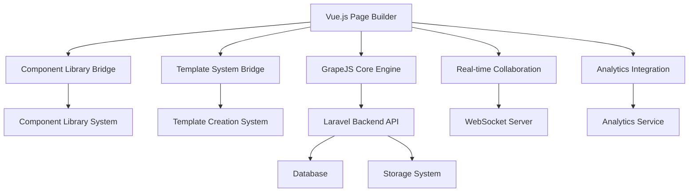

# Vue.js Page Builder System Implementation Plan

## Overview

This document outlines the comprehensive implementation plan for the Vue.js Page Builder System based on GrapeJS integration. The system will seamlessly integrate with the existing Component Library System and Template Creation System while leveraging GrapeJS as the core page building engine.

## Implementation Components

### 1. System Analysis and Requirements
- Analyze Vue.js Page Builder System requirements and existing implementations
- Identify integration points between GrapeJS and existing Component Library System
- Identify integration points between GrapeJS and Template Creation System
- Review existing GrapeJS integration infrastructure and services
- Document current system shortcomings and missing components

### 2. Core Architecture Design
- Create detailed implementation plan with phases
- Design core Vue components for GrapeJS integration
- Implement Component Library System integration bridge
- Implement Template Creation System integration bridge

### 3. Real-time Editing Capabilities
- Build real-time editing and preview capabilities
- Develop advanced styling and customization tools
- Implement form builder with CRM connectivity
- Build version control and collaboration features

### 4. Publishing and Testing Infrastructure
- Create preview, testing, and publishing system
- Implement SEO and performance optimization tools
- Develop analytics and tracking capabilities
- Build A/B testing integration system

### 5. Advanced Features and Extensibility
- Implement custom code integration and extensibility
- Build export, backup, and migration capabilities
- Develop multi-language support system
- Create comprehensive testing suite

### 6. Security and Deployment
- Implement security and access control measures
- Build deployment and production optimization
- Document implementation and create handoff materials

## Technical Integration Points

### Component Library System Integration
The Component Library System will be integrated through a bridge service that converts existing components to GrapeJS blocks with bidirectional sync capabilities. This includes:
- Component preview generation for GrapeJS block manager
- Automatic component synchronization from Component Library System
- Registration of all Component Library categories as GrapeJS block categories
- Component trait definitions for GrapeJS property panels

### Template Creation System Integration
The Template Creation System will be integrated through a bridge service that loads existing templates into GrapeJS while preserving all features:
- Template-to-GrapeJS conversion maintaining all Template Creation System features
- Save-as-template functionality that preserves GrapeJS data in Template Creation System format
- Template preview and metadata handling
- Real-time template synchronization

## Implementation Phases

### Phase 1: Foundation and Integration
1. Set up GrapeJS foundation and Laravel backend integration
2. Create ComponentLibraryBridge service to convert existing components to GrapeJS blocks
3. Create TemplateSystemBridge service to load existing templates into GrapeJS
4. Implement API endpoints for saving/loading GrapeJS configurations

### Phase 2: Core Functionality
1. Implement core page builder Vue components with GrapeJS integration
2. Develop real-time editing and preview capabilities
3. Build advanced styling and customization tools
4. Implement form builder integration with CRM connectivity

### Phase 3: Collaboration and Version Control
1. Develop version control and collaboration features
2. Build preview, testing, and publishing system
3. Implement SEO and performance optimization tools
4. Develop analytics and tracking capabilities

### Phase 4: Advanced Features
1. Build A/B testing integration system
2. Implement custom code integration and extensibility
3. Build export, backup, and migration capabilities
4. Develop multi-language support system

### Phase 5: Quality Assurance and Deployment
1. Create comprehensive testing suite
2. Implement security and access control measures
3. Build deployment and production optimization
4. Document implementation and create handoff materials

## System Architecture

## Key Features

### Drag-and-Drop Interface
- Intuitive visual editor with component library sidebar
- Real-time preview with device switching (desktop, tablet, mobile)
- Responsive design tools with Tailwind CSS integration
- Undo/redo functionality and auto-save mechanisms

### Component Library Integration
- Seamless integration with existing Component Library System
- Automatic conversion of components to GrapeJS blocks
- Component preview generation for GrapeJS Block Manager
- Real-time component synchronization

### Template System Integration
- Direct loading of Template Creation System templates into GrapeJS
- Preservation of all template features during conversion
- Save-as-template functionality with metadata handling
- Template preview and testing capabilities

### Advanced Styling Tools
- Integration with Tailwind CSS classes and Style Manager
- Custom styling controls for colors, fonts, spacing, and effects
- Brand guideline enforcement and design system integration
- Style preset saving and reuse functionality

### Collaboration Features
- Real-time collaboration using Laravel Echo and WebSockets
- Automatic version saving with rollback capabilities
- Change tracking and user activity logging
- Conflict resolution system with operational transformation

### Analytics and Testing
- Automatic analytics tracking configuration for all interactive elements
- Performance dashboard integration accessible from page builder
- Heat map and user behavior overlay functionality
- A/B test variant creation and management within page builder

## Security Considerations

- Tenant isolation for multi-tenant page and component access
- Role-based permissions for page builder access and functionality
- Input validation and sanitization for all user-generated content
- Audit logging for all page builder actions and changes
- Secure storage of page configurations and assets

## Performance Optimization

- GrapeJS bundle size optimization and code splitting
- Production caching strategies for components and templates
- CDN integration for page assets and media files
- Monitoring and error tracking for production page builder usage
- Lazy loading of components and templates

## Testing Strategy

- Unit tests for all GrapeJS integration services and Vue components
- Integration tests for Component Library and Template System bridges
- End-to-end tests for complete page building workflows
- Performance tests for large page handling and real-time collaboration
- Cross-browser compatibility testing

## Deployment Process

1. Code review and quality assurance
2. Automated testing suite execution
3. Staging environment deployment
4. Performance and security auditing
5. Production deployment with rollback capability
6. Post-deployment monitoring and optimization

## Handoff Materials

- Comprehensive developer documentation
- API endpoint specifications
- Component integration guides
- Template system integration guides
- Deployment and maintenance procedures
- Troubleshooting guides
- Best practices and coding standards

This implementation plan ensures a robust, scalable, and maintainable Vue.js Page Builder System that leverages the power of GrapeJS while maintaining full compatibility with existing systems.