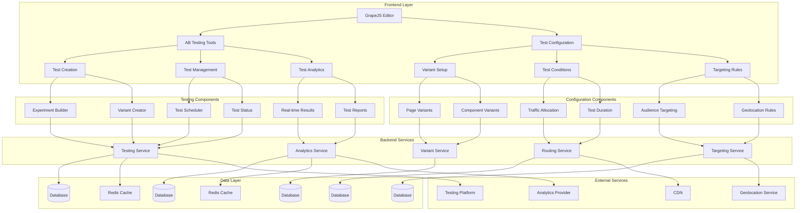

# A/B Testing Integration System Design

## Overview

This document outlines the design for implementing a comprehensive A/B testing integration system in the Vue.js Page Builder System. This system will enable marketing administrators to create, manage, and analyze A/B tests to optimize their pages for better conversion rates and user engagement.

## Architecture

### A/B Testing System Architecture



## Core Components

### 1. A/B Testing Tools

```typescript
interface ABTestingTools {
  // Experiment management
  createExperiment(config: ExperimentConfig): Promise<Experiment>
  updateExperiment(experimentId: string, config: ExperimentConfig): Promise<Experiment>
  deleteExperiment(experimentId: string): Promise<void>
  getExperiment(experimentId: string): Promise<Experiment>
  getExperiments(options?: ExperimentQueryOptions): Promise<Experiment[]>
  
  // Test scheduling
  scheduleExperiment(experimentId: string, startTime: Date, endTime?: Date): Promise<void>
  pauseExperiment(experimentId: string): Promise<void>
  resumeExperiment(experimentId: string): Promise<void>
  endExperiment(experimentId: string): Promise<void>
  
  // Variant management
  createVariant(experimentId: string, config: VariantConfig): Promise<Variant>
  updateVariant(variantId: string, config: VariantConfig): Promise<Variant>
  deleteVariant(variantId: string): Promise<void>
  getVariants(experimentId: string): Promise<Variant[]>
  
  // Test analytics
  getTestResults(experimentId: string): Promise<TestResults>
  getRealTimeResults(experimentId: string): Promise<RealTimeResults>
  generateTestReport(experimentId: string, options?: ReportOptions): Promise<TestReport>
}

interface ExperimentConfig {
  name: string
  description?: string
  hypothesis: string
  goal: TestGoal
  variants: VariantConfig[]
  trafficAllocation: number[]
  duration: number // in days
  startDate?: Date
  endDate?: Date
  targeting?: TargetingRules
  status: ExperimentStatus
}

interface Experiment {
  id: string
  config: ExperimentConfig
  status: ExperimentStatus
  variants: Variant[]
  results?: TestResults
  createdAt: Date
  updatedAt: Date
  createdBy: string
}

type ExperimentStatus = 'draft' | 'scheduled' | 'running' | 'paused' | 'completed' | 'archived'

interface VariantConfig {
  id?: string
  name: string
  description?: string
  changes: VariantChange[]
  weight: number
}

interface VariantChange {
  type: ChangeType
  targetId: string
  property: string
  value: any
}

type ChangeType = 'content' | 'style' | 'component' | 'layout'

interface Variant {
  id: string
  experimentId: string
  config: VariantConfig
  visitors: number
  conversions: number
  conversionRate: number
  createdAt: Date
  updatedAt: Date
}

interface TestGoal {
  type: GoalType
  selector?: string
  eventName?: string
  customFunction?: string
  value?: number
}

type GoalType = 'conversion' | 'engagement' | 'clicks' | 'custom'

interface TargetingRules {
  audienceSegments?: string[]
  geolocation?: GeolocationRule[]
  deviceTypes?: string[]
  browsers?: string[]
  customRules?: CustomRule[]
}

interface GeolocationRule {
  country?: string
  region?: string
  city?: string
  include: boolean
}

interface CustomRule {
  condition: string
  value: any
}

interface ExperimentQueryOptions {
  status?: ExperimentStatus
  limit?: number
  offset?: number
  sortBy?: 'createdAt' | 'updatedAt' | 'name'
  sortOrder?: 'asc' | 'desc'
  startDate?: Date
  endDate?: Date
}
```

### 2. Test Analytics

```typescript
interface TestAnalytics {
  // Results management
  getTestResults(experimentId: string): Promise<TestResults>
  getRealTimeResults(experimentId: string): Promise<RealTimeResults>
  getHistoricalResults(experimentId: string, options?: HistoryOptions): Promise<HistoricalResult[]>
  
  // Statistical analysis
  calculateStatisticalSignificance(results: TestResults): Promise<StatisticalAnalysis>
  getConfidenceInterval(results: TestResults, confidenceLevel?: number): ConfidenceInterval
  
  // Reporting
  generateTestReport(experimentId: string, options?: ReportOptions): Promise<TestReport>
  exportTestResults(experimentId: string, format: ExportFormat): Promise<Blob>
  
  // Notifications
  setupAlerts(experimentId: string, alerts: TestAlert[]): Promise<void>
  getAlerts(experimentId: string): Promise<TestAlert[]>
}

interface TestResults {
  experimentId: string
  startDate: Date
  endDate: Date
  totalVisitors: number
  variantResults: VariantResult[]
  winner?: string
  confidence: number
  statisticalSignificance: boolean
  updatedAt: Date
}

interface VariantResult {
  variantId: string
  name: string
  visitors: number
  conversions: number
  conversionRate: number
  engagement: number
  revenue?: number
  statisticalSignificance: boolean
}

interface RealTimeResults {
  experimentId: string
  currentVisitors: number
  currentConversions: number
  variantMetrics: RealTimeMetric[]
  lastUpdated: Date
}

interface RealTimeMetric {
  variantId: string
  visitorsPerMinute: number
  conversionsPerMinute: number
  currentConversionRate: number
}

interface HistoricalResult {
  timestamp: Date
  visitors: number
  conversions: number
  conversionRate: number
}

interface StatisticalAnalysis {
  pValue: number
  confidenceInterval: ConfidenceInterval
  effectSize: number
  power: number
  significance: boolean
}

interface ConfidenceInterval {
  lowerBound: number
  upperBound: number
  confidenceLevel: number
}

interface TestReport {
  experimentId: string
  title: string
  executiveSummary: string
  methodology: string
  results: TestResults
  conclusions: string[]
  recommendations: string[]
  charts: ReportChart[]
  createdAt: Date
}

interface ReportChart {
  type: ChartType
  title: string
  data: any
  options?: ChartOptions
}

type ChartType = 'bar' | 'line' | 'pie' | 'scatter'

interface ReportOptions {
  format?: ReportFormat
  includeCharts?: boolean
  includeRawData?: boolean
  customSections?: ReportSection[]
}

type ReportFormat = 'pdf' | 'csv' | 'xlsx' | 'html'

interface ReportSection {
  title: string
  content: string
  order: number
}

interface TestAlert {
  id: string
  experimentId: string
  type: AlertType
  threshold: number
  currentValue: number
  triggered: boolean
  lastTriggered?: Date
  recipients: string[]
}

type AlertType = 'conversion_drop' | 'traffic_spike' | 'statistical_significance' | 'winner_declared'

interface HistoryOptions {
  startDate?: Date
  endDate?: Date
  granularity?: 'hourly' | 'daily' | 'weekly'
}
```

## Implementation Details

### 1. Experiment Management

#### Experiment Creation

```typescript
class ExperimentManager {
  private experiments: Map<string, Experiment> = new Map()
  
  async createExperiment(config: ExperimentConfig): Promise<Experiment> {
    // Validate experiment configuration
    this.validateExperimentConfig(config)
    
    const experiment: Experiment = {
      id: this.generateId(),
      config: {
        ...config,
        status: config.status || 'draft'
      },
      status: config.status || 'draft',
      variants: config.variants.map(variantConfig => ({
        id: this.generateId(),
        experimentId: '', // Will be set below
        config: variantConfig,
        visitors: 0,
        conversions: 0,
        conversionRate: 0,
        createdAt: new Date(),
        updatedAt: new Date()
      })),
      createdAt: new Date(),
      updatedAt: new Date(),
      createdBy: 'current-user' // Would come from auth context
    }
    
    // Set experiment ID on variants
    experiment.variants = experiment.variants.map(variant => ({
      ...variant,
      experimentId: experiment.id
    }))
    
    this.experiments.set(experiment.id, experiment)
    
    // Save to backend
    try {
      const response = await fetch('/api/experiments', {
        method: 'POST',
        headers: {
          'Content-Type': 'application/json',
        },
        body: JSON.stringify(experiment)
      })
      
      if (!response.ok) {
        throw new Error('Failed to create experiment')
      }
      
      console.log(`Experiment ${config.name} created successfully`)
      return experiment
    } catch (error) {
      console.error('Failed to create experiment:', error)
      throw error
    }
  }
  
  async updateExperiment(experimentId: string, config: ExperimentConfig): Promise<Experiment> {
    const experiment = this.experiments.get(experimentId)
    if (!experiment) {
      throw new Error(`Experiment with ID ${experimentId} not found`)
    }
    
    const updatedExperiment: Experiment = {
      ...experiment,
      config: { ...experiment.config, ...config },
      updatedAt: new Date()
    }
    
    this.experiments.set(experimentId, updatedExperiment)
    
    // Update in backend
    try {
      const response = await fetch(`/api/experiments/${experimentId}`, {
        method: 'PUT',
        headers: {
          'Content-Type': 'application/json',
        },
        body: JSON.stringify(updatedExperiment)
      })
      
      if (!response.ok) {
        throw new Error('Failed to update experiment')
      }
      
      console.log(`Experiment ${experimentId} updated successfully`)
      return updatedExperiment
    } catch (error) {
      console.error('Failed to update experiment:', error)
      throw error
    }
  }
  
  async deleteExperiment(experimentId: string): Promise<void> {
    this.experiments.delete(experimentId)
    
    // Delete from backend
    try {
      const response = await fetch(`/api/experiments/${experimentId}`, {
        method: 'DELETE'
      })
      
      if (!response.ok) {
        throw new Error('Failed to delete experiment')
      }
      
      console.log(`Experiment ${experimentId} deleted successfully`)
    } catch (error) {
      console.error('Failed to delete experiment:', error)
      throw error
    }
  }
  
  async getExperiment(experimentId: string): Promise<Experiment> {
    const experiment = this.experiments.get(experimentId)
    if (experiment) {
      return experiment
    }
    
    // Fetch from backend
    try {
      const response = await fetch(`/api/experiments/${experimentId}`)
      if (!response.ok) {
        throw new Error('Failed to fetch experiment')
      }
      
      const experimentData = await response.json()
      this.experiments.set(experimentId, experimentData)
      return experimentData
    } catch (error) {
      console.error('Failed to fetch experiment:', error)
      throw error
    }
  }
  
  async getExperiments(options?: ExperimentQueryOptions): Promise<Experiment[]> {
    try {
      const params = new URLSearchParams()
      if (options?.status) params.append('status', options.status)
      if (options?.limit) params.append('limit', options.limit.toString())
      if (options?.offset) params.append('offset', options.offset.toString())
      if (options?.sortBy) params.append('sortBy', options.sortBy)
      if (options?.sortOrder) params.append('sortOrder', options.sortOrder)
      if (options?.startDate) params.append('startDate', options.startDate.toISOString())
      if (options?.endDate) params.append('endDate', options.endDate.toISOString())
      
      const response = await fetch(`/api/experiments?${params.toString()}`)
      if (!response.ok) {
        throw new Error('Failed to fetch experiments')
      }
      
      const experiments = await response.json()
      
      // Cache experiments
      experiments.forEach((exp: Experiment) => {
        this.experiments.set(exp.id, exp)
      })
      
      return experiments
    } catch (error) {
      console.error('Failed to fetch experiments:', error)
      throw error
    }
  }
  
  private validateExperimentConfig(config: ExperimentConfig): void {
    if (!config.name || config.name.trim() === '') {
      throw new Error('Experiment name is required')
    }
    
    if (!config.hypothesis || config.hypothesis.trim() === '') {
      throw new Error('Experiment hypothesis is required')
    }
    
    if (!config.goal) {
      throw new Error('Experiment goal is required')
    }
    
    if (!config.variants || config.variants.length < 2) {
      throw new Error('At least 2 variants are required for A/B testing')
    }
    
    // Validate traffic allocation sums to 100%
    const totalAllocation = config.trafficAllocation.reduce((sum, alloc) => sum + alloc, 0)
    if (Math.abs(totalAllocation - 100) > 0.01) {
      throw new Error('Traffic allocation must sum to 100%')
    }
    
    // Validate variant weights sum to 100%
    const totalWeight = config.variants.reduce((sum, variant) => sum + variant.weight, 0)
    if (Math.abs(totalWeight - 100) > 0.01) {
      throw new Error('Variant weights must sum to 100%')
    }
  }
  
  private generateId(): string {
    return 'exp-' + Math.random().toString(36).substr(2, 9)
  }
}
```

#### Test Scheduling

```typescript
class TestScheduler {
  private scheduledTests: Map<string, ScheduledTest> = new Map()
  
  async scheduleExperiment(experimentId: string, startTime: Date, endTime?: Date): Promise<void> {
    const scheduledTest: ScheduledTest = {
      id: this.generateId(),
      experimentId,
      startTime,
      endTime,
      status: 'scheduled',
      createdAt: new Date()
    }
    
    this.scheduledTests.set(scheduledTest.id, scheduledTest)
    
    // Save to backend
    try {
      const response = await fetch('/api/scheduled-tests', {
        method: 'POST',
        headers: {
          'Content-Type': 'application/json',
        },
        body: JSON.stringify(scheduledTest)
      })
      
      if (!response.ok) {
        throw new Error('Failed to schedule experiment')
      }
      
      // Set up timers for start/end
      this.setupTestTimers(scheduledTest)
      
      console.log(`Experiment ${experimentId} scheduled for ${startTime}`)
    } catch (error) {
      console.error('Failed to schedule experiment:', error)
      throw error
    }
  }
  
  async pauseExperiment(experimentId: string): Promise<void> {
    try {
      const response = await fetch(`/api/experiments/${experimentId}/pause`, {
        method: 'POST'
      })
      
      if (!response.ok) {
        throw new Error('Failed to pause experiment')
      }
      
      console.log(`Experiment ${experimentId} paused`)
    } catch (error) {
      console.error('Failed to pause experiment:', error)
      throw error
    }
  }
  
  async resumeExperiment(experimentId: string): Promise<void> {
    try {
      const response = await fetch(`/api/experiments/${experimentId}/resume`, {
        method: 'POST'
      })
      
      if (!response.ok) {
        throw new Error('Failed to resume experiment')
      }
      
      console.log(`Experiment ${experimentId} resumed`)
    } catch (error) {
      console.error('Failed to resume experiment:', error)
      throw error
    }
  }
  
  async endExperiment(experimentId: string): Promise<void> {
    try {
      const response = await fetch(`/api/experiments/${experimentId}/end`, {
        method: 'POST'
      })
      
      if (!response.ok) {
        throw new Error('Failed to end experiment')
      }
      
      console.log(`Experiment ${experimentId} ended`)
    } catch (error) {
      console.error('Failed to end experiment:', error)
      throw error
    }
  }
  
  private setupTestTimers(scheduledTest: ScheduledTest): void {
    // Set up timer to start test
    const startDelay = scheduledTest.startTime.getTime() - Date.now()
    if (startDelay > 0) {
      setTimeout(() => {
        this.startScheduledTest(scheduledTest.experimentId)
      }, startDelay)
    }
    
    // Set up timer to end test if end time is specified
    if (scheduledTest.endTime) {
      const endDelay = scheduledTest.endTime.getTime() - Date.now()
      if (endDelay > 0) {
        setTimeout(() => {
          this.endScheduledTest(scheduledTest.experimentId)
        }, endDelay)
      }
    }
  }
  
  private async startScheduledTest(experimentId: string): Promise<void> {
    try {
      await fetch(`/api/experiments/${experimentId}/start`, {
        method: 'POST'
      })
      console.log(`Scheduled test ${experimentId} started`)
    } catch (error) {
      console.error(`Failed to start scheduled test ${experimentId}:`, error)
    }
  }
  
  private async endScheduledTest(experimentId: string): Promise<void> {
    try {
      await fetch(`/api/experiments/${experimentId}/end`, {
        method: 'POST'
      })
      console.log(`Scheduled test ${experimentId} ended`)
    } catch (error) {
      console.error(`Failed to end scheduled test ${experimentId}:`, error)
    }
  }
  
  private generateId(): string {
    return 'sched-' + Math.random().toString(36).substr(2, 9)
  }
}

interface ScheduledTest {
  id: string
  experimentId: string
  startTime: Date
  endTime?: Date
  status: 'scheduled' | 'active' | 'completed' | 'cancelled'
  createdAt: Date
}
```

### 2. Variant Management

#### Variant Creation and Management

```typescript
class VariantManager {
  private variants: Map<string, Variant> = new Map()
  
  async createVariant(experimentId: string, config: VariantConfig): Promise<Variant> {
    const variant: Variant = {
      id: this.generateId(),
      experimentId,
      config,
      visitors: 0,
      conversions: 0,
      conversionRate: 0,
      createdAt: new Date(),
      updatedAt: new Date()
    }
    
    this.variants.set(variant.id, variant)
    
    // Save to backend
    try {
      const response = await fetch('/api/variants', {
        method: 'POST',
        headers: {
          'Content-Type': 'application/json',
        },
        body: JSON.stringify(variant)
      })
      
      if (!response.ok) {
        throw new Error('Failed to create variant')
      }
      
      console.log(`Variant ${config.name} created for experiment ${experimentId}`)
      return variant
    } catch (error) {
      console.error('Failed to create variant:', error)
      throw error
    }
  }
  
  async updateVariant(variantId: string, config: VariantConfig): Promise<Variant> {
    const variant = this.variants.get(variantId)
    if (!variant) {
      throw new Error(`Variant with ID ${variantId} not found`)
    }
    
    const updatedVariant: Variant = {
      ...variant,
      config: { ...variant.config, ...config },
      updatedAt: new Date()
    }
    
    this.variants.set(variantId, updatedVariant)
    
    // Update in backend
    try {
      const response = await fetch(`/api/variants/${variantId}`, {
        method: 'PUT',
        headers: {
          'Content-Type': 'application/json',
        },
        body: JSON.stringify(updatedVariant)
      })
      
      if (!response.ok) {
        throw new Error('Failed to update variant')
      }
      
      console.log(`Variant ${variantId} updated successfully`)
      return updatedVariant
    } catch (error) {
      console.error('Failed to update variant:', error)
      throw error
    }
  }
  
  async deleteVariant(variantId: string): Promise<void> {
    this.variants.delete(variantId)
    
    // Delete from backend
    try {
      const response = await fetch(`/api/variants/${variantId}`, {
        method: 'DELETE'
      })
      
      if (!response.ok) {
        throw new Error('Failed to delete variant')
      }
      
      console.log(`Variant ${variantId} deleted successfully`)
    } catch (error) {
      console.error('Failed to delete variant:', error)
      throw error
    }
  }
  
  async getVariants(experimentId: string): Promise<Variant[]> {
    try {
      const response = await fetch(`/api/experiments/${experimentId}/variants`)
      if (!response.ok) {
        throw new Error('Failed to fetch variants')
      }
      
      const variants = await response.json()
      
      // Cache variants
      variants.forEach((variant: Variant) => {
        this.variants.set(variant.id, variant)
      })
      
      return variants
    } catch (error) {
      console.error('Failed to fetch variants:', error)
      throw error
    }
  }
  
  async applyVariantChanges(variantId: string, pageId: string): Promise<void> {
    const variant = this.variants.get(variantId)
    if (!variant) {
      throw new Error(`Variant with ID ${variantId} not found`)
    }
    
    // Apply variant changes to the page
    for (const change of variant.config.changes) {
      await this.applyChange(change, pageId)
    }
    
    console.log(`Applied variant ${variantId} changes to page ${pageId}`)
  }
  
  private async applyChange(change: VariantChange, pageId: string): Promise<void> {
    try {
      const response = await fetch(`/api/pages/${pageId}/apply-change`, {
        method: 'POST',
        headers: {
          'Content-Type': 'application/json',
        },
        body: JSON.stringify({ change })
      })
      
      if (!response.ok) {
        throw new Error('Failed to apply change')
      }
      
      console.log(`Applied change ${change.type} to target ${change.targetId}`)
    } catch (error) {
      console.error('Failed to apply change:', error)
      throw error
    }
  }
  
  private generateId(): string {
    return 'var-' + Math.random().toString(36).substr(2, 9)
  }
}
```

### 3. Test Analytics

#### Results Management

```typescript
class TestAnalyticsManager {
  private resultsCache: Map<string, TestResults> = new Map()
  private cacheTimeout = 5 * 60 * 1000 // 5 minutes
  
  async getTestResults(experimentId: string): Promise<TestResults> {
    // Check cache first
    const cached = this.resultsCache.get(experimentId)
    if (cached && (Date.now() - cached.updatedAt.getTime()) < this.cacheTimeout) {
      return cached
    }
    
    try {
      const response = await fetch(`/api/experiments/${experimentId}/results`)
      if (!response.ok) {
        throw new Error('Failed to fetch test results')
      }
      
      const results = await response.json()
      
      // Cache results
      this.resultsCache.set(experimentId, results)
      
      return results
    } catch (error) {
      console.error('Failed to fetch test results:', error)
      throw error
    }
  }
  
  async getRealTimeResults(experimentId: string): Promise<RealTimeResults> {
    try {
      const response = await fetch(`/api/experiments/${experimentId}/real-time-results`)
      if (!response.ok) {
        throw new Error('Failed to fetch real-time results')
      }
      
      return await response.json()
    } catch (error) {
      console.error('Failed to fetch real-time results:', error)
      throw error
    }
  }
  
  async getHistoricalResults(experimentId: string, options?: HistoryOptions): Promise<HistoricalResult[]> {
    try {
      const params = new URLSearchParams()
      if (options?.startDate) params.append('startDate', options.startDate.toISOString())
      if (options?.endDate) params.append('endDate', options.endDate.toISOString())
      if (options?.granularity) params.append('granularity', options.granularity)
      
      const response = await fetch(`/api/experiments/${experimentId}/historical-results?${params.toString()}`)
      if (!response.ok) {
        throw new Error('Failed to fetch historical results')
      }
      
      return await response.json()
    } catch (error) {
      console.error('Failed to fetch historical results:', error)
      throw error
    }
  }
  
  async calculateStatisticalSignificance(results: TestResults): Promise<StatisticalAnalysis> {
    // Simplified statistical analysis
    // In a real implementation, this would use proper statistical tests
    
    // Calculate p-value using chi-square test approximation
    const pValue = this.calculatePValue(results)
    
    // Calculate confidence interval
    const confidenceInterval = this.calculateConfidenceInterval(results)
    
    // Determine significance
    const significance = pValue < 0.05
    
    return {
      pValue,
      confidenceInterval,
      effectSize: this.calculateEffectSize(results),
      power: this.calculatePower(results),
      significance
    }
  }
  
  async getConfidenceInterval(results: TestResults, confidenceLevel: number = 0.95): ConfidenceInterval {
    return this.calculateConfidenceInterval(results, confidenceLevel)
  }
  
  async generateTestReport(experimentId: string, options?: ReportOptions): Promise<TestReport> {
    const experiment = await experimentManager.getExperiment(experimentId)
    const results = await this.getTestResults(experimentId)
    const analysis = await this.calculateStatisticalSignificance(results)
    
    const report: TestReport = {
      experimentId,
      title: `A/B Test Report: ${experiment.config.name}`,
      executiveSummary: this.generateExecutiveSummary(experiment, results, analysis),
      methodology: this.generateMethodology(experiment),
      results,
      conclusions: this.generateConclusions(results, analysis),
      recommendations: this.generateRecommendations(experiment, results),
      charts: await this.generateCharts(experimentId, results),
      createdAt: new Date()
    }
    
    return report
  }
  
  async exportTestResults(experimentId: string, format: ExportFormat): Promise<Blob> {
    const results = await this.getTestResults(experimentId)
    
    // Generate export data based on format
    let exportData: string | ArrayBuffer
    
    switch (format) {
      case 'csv':
        exportData = this.generateCSVExport(results)
        break
      case 'xlsx':
        exportData = await this.generateExcelExport(results)
        break
      case 'pdf':
        exportData = await this.generatePDFExport(results)
        break
      case 'html':
        exportData = this.generateHTMLExport(results)
        break
      default:
        throw new Error(`Unsupported export format: ${format}`)
    }
    
    // Return as Blob
    return new Blob([exportData], { type: this.getMimeType(format) })
  }
  
  private calculatePValue(results: TestResults): number {
    // Simplified p-value calculation
    // In a real implementation, this would use proper statistical tests
    const controlVariant = results.variantResults[0]
    const treatmentVariant = results.variantResults[1]
    
    if (!controlVariant || !treatmentVariant) {
      return 1
    }
    
    // Simple z-test approximation
    const p1 = controlVariant.conversionRate
    const p2 = treatmentVariant.conversionRate
    const n1 = controlVariant.visitors
    const n2 = treatmentVariant.visitors
    
    const pooledP = (controlVariant.conversions + treatmentVariant.conversions) / (n1 + n2)
    const se = Math.sqrt(pooledP * (1 - pooledP) * (1/n1 + 1/n2))
    const z = Math.abs(p1 - p2) / se
    
    // Approximate p-value from z-score
    return 2 * (1 - this.normalCDF(z))
  }
  
  private calculateConfidenceInterval(results: TestResults, confidenceLevel: number = 0.95): ConfidenceInterval {
    // Calculate confidence interval for conversion rate difference
    const controlVariant = results.variantResults[0]
    const treatmentVariant = results.variantResults[1]
    
    if (!controlVariant || !treatmentVariant) {
      return { lowerBound: 0, upperBound: 0, confidenceLevel }
    }
    
    const p1 = controlVariant.conversionRate
    const p2 = treatmentVariant.conversionRate
    const n1 = controlVariant.visitors
    const n2 = treatmentVariant.visitors
    
    const diff = p2 - p1
    const se = Math.sqrt((p1 * (1 - p1) / n1) + (p2 * (1 - p2) / n2))
    
    // Z-score for 95% confidence level
    const z = 1.96
    const marginOfError = z * se
    
    return {
      lowerBound: diff - marginOfError,
      upperBound: diff + marginOfError,
      confidenceLevel
    }
  }
  
  private calculateEffectSize(results: TestResults): number {
    const controlVariant = results.variantResults[0]
    const treatmentVariant = results.variantResults[1]
    
    if (!controlVariant || !treatmentVariant) {
      return 0
    }
    
    // Cohen's h for proportions
    const p1 = controlVariant.conversionRate
    const p2 = treatmentVariant.conversionRate
    
    const h = 2 * (Math.asin(Math.sqrt(p2)) - Math.asin(Math.sqrt(p1)))
    return Math.abs(h)
  }
  
  private calculatePower(results: TestResults): number {
    // Simplified power calculation
    // In a real implementation, this would use proper statistical power analysis
    const analysis = this.calculateStatisticalSignificance(results)
    return analysis.pValue < 0.2 ? 0.8 : 0.5
  }
  
  private generateExecutiveSummary(experiment: Experiment, results: TestResults, analysis: StatisticalAnalysis): string {
    const winner = results.winner ? `Winner: ${results.winner}` : 'No clear winner'
    const significance = analysis.significance ? 'Statistically significant' : 'Not statistically significant'
    
    return `
      ${experiment.config.name}
      
      Hypothesis: ${experiment.config.hypothesis}
      
      Results Summary:
      - Total Visitors: ${results.totalVisitors}
      - ${winner}
      - ${significance}
      - Confidence Level: ${(results.confidence * 100).toFixed(1)}%
    `.trim()
  }
  
  private generateMethodology(experiment: Experiment): string {
    return `
      Test Methodology:
      
      Goal: ${experiment.config.goal.type}
      Duration: ${experiment.config.duration} days
      Traffic Allocation: ${experiment.config.trafficAllocation.join('-')}
      
      Variants:
      ${experiment.variants.map(v => `- ${v.config.name}: ${v.config.description || 'No description'}`).join('\n')}
    `.trim()
  }
  
  private generateConclusions(results: TestResults, analysis: StatisticalAnalysis): string[] {
    const conclusions: string[] = []
    
    if (analysis.significance) {
      conclusions.push('The test results are statistically significant.')
    } else {
      conclusions.push('The test results are not statistically significant.')
    }
    
    if (results.winner) {
      const winner = results.variantResults.find(v => v.name === results.winner)
      if (winner) {
        conclusions.push(`Variant "${winner.name}" performed best with a ${winner.conversionRate.toFixed(2)}% conversion rate.`)
      }
    }
    
    return conclusions
  }
  
  private generateRecommendations(experiment: Experiment, results: TestResults): string[] {
    const recommendations: string[] = []
    
    if (results.winner) {
      recommendations.push(`Implement the winning variant "${results.winner}" across all traffic.`)
    }
    
    if (experiment.config.duration < 7) {
      recommendations.push('Consider running longer tests for more reliable results.')
    }
    
    return recommendations
  }
  
  private async generateCharts(experimentId: string, results: TestResults): Promise<ReportChart[]> {
    // Generate chart data
    const charts: ReportChart[] = []
    
    // Conversion rate comparison chart
    charts.push({
      type: 'bar',
      title: 'Conversion Rate Comparison',
      data: {
        labels: results.variantResults.map(v => v.name),
        datasets: [{
          label: 'Conversion Rate (%)',
          data: results.variantResults.map(v => v.conversionRate * 100),
          backgroundColor: ['#3498db', '#2ecc71', '#e74c3c', '#f39c12']
        }]
      }
    })
    
    // Visitor distribution chart
    charts.push({
      type: 'pie',
      title: 'Visitor Distribution',
      data: {
        labels: results.variantResults.map(v => v.name),
        datasets: [{
          data: results.variantResults.map(v => v.visitors),
          backgroundColor: ['#3498db', '#2ecc71', '#e74c3c', '#f39c12']
        }]
      }
    })
    
    return charts
  }
  
  private generateCSVExport(results: TestResults): string {
    // Generate CSV content
    let csv = 'Variant,Visitors,Conversions,Conversion Rate (%)\n'
    
    results.variantResults.forEach(variant => {
      csv += `${variant.name},${variant.visitors},${variant.conversions},${(variant.conversionRate * 100).toFixed(2)}\n`
    })
    
    return csv
  }
  
  private async generateExcelExport(results: TestResults): Promise<ArrayBuffer> {
    // In a real implementation, this would use a library like SheetJS
    // For now, we'll return a mock Excel file
    console.log('Generating Excel export for results:', results)
    return new ArrayBuffer(0)
  }
  
  private async generatePDFExport(results: TestResults): Promise<ArrayBuffer> {
    // In a real implementation, this would use a library like jsPDF
    // For now, we'll return a mock PDF file
    console.log('Generating PDF export for results:', results)
    return new ArrayBuffer(0)
  }
  
  private generateHTMLExport(results: TestResults): string {
    // Generate HTML content
    let html = `
      <html>
        <head>
          <title>A/B Test Results</title>
          <style>
            body { font-family: Arial, sans-serif; }
            table { border-collapse: collapse; width: 100%; }
            th, td { border: 1px solid #ddd; padding: 8px; text-align: left; }
            th { background-color: #f2f2f2; }
          </style>
        </head>
        <body>
          <h1>A/B Test Results</h1>
          <table>
            <thead>
              <tr>
                <th>Variant</th>
                <th>Visitors</th>
                <th>Conversions</th>
                <th>Conversion Rate (%)</th>
              </tr>
            </thead>
            <tbody>
    `
    
    results.variantResults.forEach(variant => {
      html += `
        <tr>
          <td>${variant.name}</td>
          <td>${variant.visitors}</td>
          <td>${variant.conversions}</td>
          <td>${(variant.conversionRate * 100).toFixed(2)}</td>
        </tr>
      `
    })
    
    html += `
            </tbody>
          </table>
        </body>
      </html>
    `
    
    return html
  }
  
  private getMimeType(format: ExportFormat): string {
    const mimeTypes: Record<ExportFormat, string> = {
      'csv': 'text/csv',
      'xlsx': 'application/vnd.openxmlformats-officedocument.spreadsheetml.sheet',
      'pdf': 'application/pdf',
      'html': 'text/html'
    }
    
    return mimeTypes[format] || 'application/octet-stream'
  }
  
  private normalCDF(x: number): number {
    // Approximation of the standard normal CDF
    const a1 = 0.254829592
    const a2 = -0.284496736
    const a3 = 1.421413741
    const a4 = -1.453152027
    const a5 = 1.061405429
    const p = 0.3275911
    
    const sign = x < 0 ? -1 : 1
    x = Math.abs(x) / Math.sqrt(2.0)
    
    const t = 1.0 / (1.0 + p * x)
    const y = 1.0 - (((((a5 * t + a4) * t) + a3) * t + a2) * t + a1) * t * Math.exp(-x * x)
    
    return 0.5 * (1.0 + sign * y)
  }
}
```

## Integration with Vue Wrapper Component

### A/B Testing Tools Integration

```vue
<script setup lang="ts">
import { ref, computed, onMounted, watch } from 'vue'
import { useABTesting } from '@/composables/useABTesting'
import type { 
  Experiment, 
  ExperimentConfig, 
  Variant, 
  TestResults,
  RealTimeResults,
  TestReport
} from '@/types/ab-testing'

const { 
  createExperiment,
  updateExperiment,
  deleteExperiment,
  getExperiment,
  getExperiments,
  scheduleExperiment,
  pauseExperiment,
  resumeExperiment,
  endExperiment,
  createVariant,
  updateVariant,
  deleteVariant,
  getVariants,
  getTestResults,
  getRealTimeResults,
  generateTestReport,
  exportTestResults
} = useABTesting()

const selectedPageId = ref<string | null>(null)
const experiments = ref<Experiment[]>([])
const selectedExperimentId = ref<string | null>(null)
const selectedExperiment = ref<Experiment | null>(null)
const variants = ref<Variant[]>([])
const testResults = ref<TestResults | null>(null)
const realTimeResults = ref<RealTimeResults | null>(null)
const showTestingPanel = ref(true)
const isCreatingExperiment = ref(false)

// Form models
const newExperimentConfig = ref<ExperimentConfig>({
  name: '',
  hypothesis: '',
  goal: { type: 'conversion' },
  variants: [
    {
      name: 'Control',
      description: 'Original version',
      changes: [],
      weight: 50
    },
    {
      name: 'Variant A',
      description: 'Test variation',
      changes: [],
      weight: 50
    }
  ],
  trafficAllocation: [50, 50],
  duration: 7,
  status: 'draft'
})

// Computed properties
const experimentStatus = computed(() => {
  return selectedExperiment.value?.status || 'draft'
})

const experimentProgress = computed(() => {
  if (!selectedExperiment.value) return 0
  
  const now = new Date()
  const start = selectedExperiment.value.config.startDate
  const end = selectedExperiment.value.config.endDate
  
  if (!start || !end) return 0
  
  const totalDuration = end.getTime() - start.getTime()
  const elapsed = now.getTime() - start.getTime()
  
  return Math.min(100, Math.max(0, (elapsed / totalDuration) * 100))
})

const winningVariant = computed(() => {
  if (!testResults.value) return null
  
  return testResults.value.variantResults.find(v => v.name === testResults.value?.winner) || null
})

// Watchers
watch(selectedExperimentId, async (newId) => {
  if (newId) {
    await loadSelectedExperiment(newId)
    await loadVariants(newId)
    await loadTestResults(newId)
  } else {
    selectedExperiment.value = null
    variants.value = []
    testResults.value = null
  }
})

// Lifecycle
onMounted(() => {
  loadExperiments()
})

// Methods
const loadExperiments = async () => {
  try {
    experiments.value = await getExperiments()
  } catch (error) {
    console.error('Failed to load experiments:', error)
  }
}

const loadSelectedExperiment = async (experimentId: string) => {
  try {
    selectedExperiment.value = await getExperiment(experimentId)
  } catch (error) {
    console.error('Failed to load experiment:', error)
  }
}

const loadVariants = async (experimentId: string) => {
  try {
    variants.value = await getVariants(experimentId)
  } catch (error) {
    console.error('Failed to load variants:', error)
  }
}

const loadTestResults = async (experimentId: string) => {
  try {
    testResults.value = await getTestResults(experimentId)
  } catch (error) {
    console.error('Failed to load test results:', error)
  }
}

const loadRealTimeTestResults = async () => {
  if (!selectedExperimentId.value) return
  
  try {
    realTimeResults.value = await getRealTimeResults(selectedExperimentId.value)
  } catch (error) {
    console.error('Failed to load real-time results:', error)
  }
}

const createNewExperiment = async () => {
  if (!newExperimentConfig.value.name) {
    alert('Experiment name is required')
    return
  }
  
  try {
    const experiment = await createExperiment(newExperimentConfig.value)
    experiments.value.push(experiment)
    selectedExperimentId.value = experiment.id
    isCreatingExperiment.value = false
    resetExperimentForm()
    alert('Experiment created successfully!')
  } catch (error) {
    console.error('Failed to create experiment:', error)
    alert('Failed to create experiment')
  }
}

const updateSelectedExperiment = async () => {
  if (!selectedExperimentId.value || !selectedExperiment.value) return
  
  try {
    const updated = await updateExperiment(selectedExperimentId.value, selectedExperiment.value.config)
    selectedExperiment.value = updated
    
    // Update in experiments list
    const index = experiments.value.findIndex(e => e.id === selectedExperimentId.value)
    if (index !== -1) {
      experiments.value[index] = updated
    }
    
    alert('Experiment updated successfully!')
  } catch (error) {
    console.error('Failed to update experiment:', error)
    alert('Failed to update experiment')
  }
}

const deleteSelectedExperiment = async () => {
  if (!selectedExperimentId.value || !confirm('Are you sure you want to delete this experiment?')) return
  
  try {
    await deleteExperiment(selectedExperimentId.value)
    
    // Remove from experiments list
    experiments.value = experiments.value.filter(e => e.id !== selectedExperimentId.value)
    selectedExperimentId.value = null
    selectedExperiment.value = null
    
    alert('Experiment deleted successfully!')
  } catch (error) {
    console.error('Failed to delete experiment:', error)
    alert('Failed to delete experiment')
  }
}

const scheduleSelectedExperiment = async (startTime: Date, endTime?: Date) => {
  if (!selectedExperimentId.value) return
  
  try {
    await scheduleExperiment(selectedExperimentId.value, startTime, endTime)
    alert('Experiment scheduled successfully!')
    
    // Refresh experiment data
    await loadSelectedExperiment(selectedExperimentId.value)
  } catch (error) {
    console.error('Failed to schedule experiment:', error)
    alert('Failed to schedule experiment')
  }
}

const pauseSelectedExperiment = async () => {
  if (!selectedExperimentId.value) return
  
  try {
    await pauseExperiment(selectedExperimentId.value)
    alert('Experiment paused successfully!')
    
    // Refresh experiment data
    await loadSelectedExperiment(selectedExperimentId.value)
  } catch (error) {
    console.error('Failed to pause experiment:', error)
    alert('Failed to pause experiment')
  }
}

const resumeSelectedExperiment = async () => {
  if (!selectedExperimentId.value) return
  
  try {
    await resumeExperiment(selectedExperimentId.value)
    alert('Experiment resumed successfully!')
    
    // Refresh experiment data
    await loadSelectedExperiment(selectedExperimentId.value)
  } catch (error) {
    console.error('Failed to resume experiment:', error)
    alert('Failed to resume experiment')
  }
}

const endSelectedExperiment = async () => {
  if (!selectedExperimentId.value || !confirm('Are you sure you want to end this experiment?')) return
  
  try {
    await endExperiment(selectedExperimentId.value)
    alert('Experiment ended successfully!')
    
    // Refresh experiment data
    await loadSelectedExperiment(selectedExperimentId.value)
  } catch (error) {
    console.error('Failed to end experiment:', error)
    alert('Failed to end experiment')
  }
}

const addVariantToExperiment = async (variantConfig: any) => {
  if (!selectedExperimentId.value) return
  
  try {
    const variant = await createVariant(selectedExperimentId.value, variantConfig)
    variants.value.push(variant)
    alert('Variant added successfully!')
  } catch (error) {
    console.error('Failed to add variant:', error)
    alert('Failed to add variant')
  }
}

const updateExperimentVariant = async (variantId: string, variantConfig: any) => {
  try {
    const variant = await updateVariant(variantId, variantConfig)
    
    // Update in variants list
    const index = variants.value.findIndex(v => v.id === variantId)
    if (index !== -1) {
      variants.value[index] = variant
    }
    
    alert('Variant updated successfully!')
  } catch (error) {
    console.error('Failed to update variant:', error)
    alert('Failed to update variant')
  }
}

const removeExperimentVariant = async (variantId: string) => {
  if (!confirm('Are you sure you want to remove this variant?')) return
  
  try {
    await deleteVariant(variantId)
    
    // Remove from variants list
    variants.value = variants.value.filter(v => v.id !== variantId)
    
    alert('Variant removed successfully!')
  } catch (error) {
    console.error('Failed to remove variant:', error)
    alert('Failed to remove variant')
  }
}

const generateExperimentReport = async (options?: any) => {
  if (!selectedExperimentId.value) return
  
  try {
    const report = await generateTestReport(selectedExperimentId.value, options)
    console.log('Generated report:', report)
    alert('Report generated successfully!')
    return report
  } catch (error) {
    console.error('Failed to generate report:', error)
    alert('Failed to generate report')
  }
}

const exportExperimentResults = async (format: string) => {
  if (!selectedExperimentId.value) return
  
  try {
    const blob = await exportTestResults(selectedExperimentId.value, format as any)
    
    // Create download link
    const url = URL.createObjectURL(blob)
    const a = document.createElement('a')
    a.href = url
    a.download = `ab-test-results-${selectedExperimentId.value}.${format}`
    document.body.appendChild(a)
    a.click()
    document.body.removeChild(a)
    URL.revokeObjectURL(url)
    
    alert('Results exported successfully!')
  } catch (error) {
    console.error('Failed to export results:', error)
    alert('Failed to export results')
  }
}

const resetExperimentForm = () => {
  newExperimentConfig.value = {
    name: '',
    hypothesis: '',
    goal: { type: 'conversion' },
    variants: [
      {
        name: 'Control',
        description: 'Original version',
        changes: [],
        weight: 50
      },
      {
        name: 'Variant A',
        description: 'Test variation',
        changes: [],
        weight: 50
      }
    ],
    trafficAllocation: [50, 50],
    duration: 7,
    status: 'draft'
  }
}

const addNewVariant = () => {
  newExperimentConfig.value.variants.push({
    name: `Variant ${newExperimentConfig.value.variants.length}`,
    description: '',
    changes: [],
    weight: 0
  })
  
  // Recalculate weights
  const equalWeight = 100 / newExperimentConfig.value.variants.length
  newExperimentConfig.value.variants.forEach(variant => {
    variant.weight = equalWeight
  })
  
  // Recalculate traffic allocation
  newExperimentConfig.value.trafficAllocation = newExperimentConfig.value.variants.map(() => equalWeight)
}
</script>
```

## Performance Optimization

### 1. Test Results Caching

```typescript
class TestResultsCache {
  private cache: Map<string, { data: TestResults; timestamp: number }> = new Map()
  private cacheTimeout = 5 * 60 * 1000 // 5 minutes
  
  get(experimentId: string): TestResults | null {
    const cached = this.cache.get(experimentId)
    if (cached && (Date.now() - cached.timestamp) < this.cacheTimeout) {
      return cached.data
    }
    
    return null
  }
  
  set(experimentId: string, data: TestResults): void {
    this.cache.set(experimentId, {
      data,
      timestamp: Date.now()
    })
  }
  
  clear(experimentId: string): void {
    this.cache.delete(experimentId)
  }
  
  clearExpired(): void {
    const now = Date.now()
    for (const [key, value] of this.cache.entries()) {
      if ((now - value.timestamp) >= this.cacheTimeout) {
        this.cache.delete(key)
      }
    }
  }
  
  clearAll(): void {
    this.cache.clear()
  }
}
```

### 2. Real-time Results Streaming

```typescript
class RealTimeResultsStreamer {
  private eventSource: EventSource | null = null
  private listeners: Map<string, ((data: RealTimeResults) => void)[]> = new Map()
  
  subscribe(experimentId: string, callback: (data: RealTimeResults) => void): void {
    if (!this.listeners.has(experimentId)) {
      this.listeners.set(experimentId, [])
    }
    
    this.listeners.get(experimentId)!.push(callback)
    
    // Connect if not already connected
    if (!this.eventSource) {
      this.connect()
    }
  }
  
  unsubscribe(experimentId: string, callback: (data: RealTimeResults) => void): void {
    const listeners = this.listeners.get(experimentId)
    if (listeners) {
      const index = listeners.indexOf(callback)
      if (index !== -1) {
        listeners.splice(index, 1)
      }
      
      // Clean up if no more listeners for this experiment
      if (listeners.length === 0) {
        this.listeners.delete(experimentId)
      }
    }
    
    // Disconnect if no more listeners
    if (this.listeners.size === 0 && this.eventSource) {
      this.disconnect()
    }
  }
  
  private connect(): void {
    try {
      this.eventSource = new EventSource('/api/real-time-results/stream')
      
      this.eventSource.onmessage = (event) => {
        try {
          const data: RealTimeResults = JSON.parse(event.data)
          
          // Notify listeners for this experiment
          const listeners = this.listeners.get(data.experimentId)
          if (listeners) {
            listeners.forEach(callback => {
              try {
                callback(data)
              } catch (error) {
                console.error('Error in real-time results listener:', error)
              }
            })
          }
        } catch (error) {
          console.error('Failed to parse real-time results message:', error)
        }
      }
      
      this.eventSource.onerror = (error) => {
        console.error('Real-time results stream error:', error)
      }
    } catch (error) {
      console.error('Failed to connect to real-time results stream:', error)
    }
  }
  
  private disconnect(): void {
    if (this.eventSource) {
      this.eventSource.close()
      this.eventSource = null
    }
  }
}
```

## Error Handling and Recovery

### 1. Experiment Error Handling

```typescript
class ExperimentErrorHandler {
  handleExperimentCreationError(error: Error, config: ExperimentConfig): void {
    console.error(`Failed to create experiment ${config.name}:`, error)
    
    // Show user-friendly error message
    // Suggest validation or alternative configurations
  }
  
  handleExperimentUpdateError(error: Error, experimentId: string): void {
    console.error(`Failed to update experiment ${experimentId}:`, error)
    
    // Show error and suggest recovery actions
  }
  
  handleExperimentDeletionError(error: Error, experimentId: string): void {
    console.error(`Failed to delete experiment ${experimentId}:`, error)
    
    // Show error and suggest manual cleanup
  }
  
  handleExperimentSchedulingError(error: Error, experimentId: string): void {
    console.error(`Failed to schedule experiment ${experimentId}:`, error)
    
    // Show error and suggest alternative scheduling
  }
}
```

### 2. Variant Error Handling

```typescript
class VariantErrorHandler {
  handleVariantCreationError(error: Error, experimentId: string): void {
    console.error(`Failed to create variant for experiment ${experimentId}:`, error)
    
    // Show user-friendly error message
    // Suggest validation or alternative variant configurations
  }
  
  handleVariantUpdateError(error: Error, variantId: string): void {
    console.error(`Failed to update variant ${variantId}:`, error)
    
    // Show error and suggest recovery actions
  }
  
  handleVariantDeletionError(error: Error, variantId: string): void {
    console.error(`Failed to delete variant ${variantId}:`, error)
    
    // Show error and suggest manual cleanup
  }
  
  handleVariantApplicationError(error: Error, variantId: string, pageId: string): void {
    console.error(`Failed to apply variant ${variantId} to page ${pageId}:`, error)
    
    // Show error and suggest reverting changes
  }
}
```

### 3. Analytics Error Handling

```typescript
class AnalyticsErrorHandler {
  handleResultsFetchError(error: Error, experimentId: string): void {
    console.error(`Failed to fetch results for experiment ${experimentId}:`, error)
    
    // Show error and suggest retry or alternative data sources
  }
  
  handleRealTimeResultsError(error: Error, experimentId: string): void {
    console.error(`Failed to get real-time results for experiment ${experimentId}:`, error)
    
    // Show error and fall back to periodic polling
  }
  
  handleStatisticalAnalysisError(error: Error, results: TestResults): void {
    console.error('Failed to perform statistical analysis:', error)
    
    // Show error and provide basic results without statistical significance
  }
  
  handleReportGenerationError(error: Error, experimentId: string): void {
    console.error(`Failed to generate report for experiment ${experimentId}:`, error)
    
    // Show error and suggest alternative reporting methods
  }
}
```

## Testing Strategy

### Unit Tests

1. Experiment creation and management
2. Variant creation and modification
3. Test scheduling and lifecycle management
4. Statistical analysis functions
5. Results calculation and caching
6. Report generation and export
7. Real-time results streaming
8. Error handling and recovery

### Integration Tests

1. A/B testing tools with GrapeJS integration
2. Variant application with page content
3. Test scheduling with timing logic
4. Statistical analysis with real data
5. Results caching and invalidation
6. Report generation with charting
7. Real-time results with event streaming
8. Error handling with recovery scenarios

### End-to-End Tests

1. Complete A/B testing workflow from creation to analysis
2. Variant creation and application to pages
3. Test scheduling and automatic start/end
4. Real-time results monitoring
5. Statistical analysis and significance detection
6. Report generation and export in multiple formats
7. Error recovery and system resilience
8. Performance with concurrent experiments

## Implementation Plan

### Phase 1: Core Infrastructure
- Implement experiment management system
- Create variant management capabilities
- Set up test scheduling and lifecycle management
- Implement basic statistical analysis

### Phase 2: Analytics Features
- Create test results management
- Implement real-time results streaming
- Add statistical significance calculations
- Set up report generation and export

### Phase 3: Vue Integration
- Integrate A/B testing tools with Vue wrapper
- Add experiment management interface
- Implement variant configuration UI
- Add results visualization and reporting

### Phase 4: Performance Optimization
- Add test results caching
- Implement real-time results streaming
- Optimize statistical calculations
- Add lazy loading for historical data

### Phase 5: Error Handling and Testing
- Implement comprehensive error handling
- Add recovery mechanisms
- Create unit tests
- Add integration tests

### Phase 6: Advanced Features
- Add advanced statistical analysis
- Implement predictive test outcomes
- Add collaborative testing features
- Add test dashboard customization

## Dependencies

- `grapesjs` - Core page builder engine
- `vue` - Vue.js framework
- `pinia` - State management
- `chart.js` - Charting library for results visualization
- `jspdf` - PDF generation for reports
- `xlsx` - Excel export library
- `mathjs` - Mathematical functions for statistical analysis
- `eventsource` - Server-sent events for real-time results

## Security Considerations

- Validate all experiment configurations
- Implement proper access controls for A/B testing
- Sanitize variant changes and content modifications
- Encrypt sensitive test data and configurations
- Implement rate limiting for test operations
- Validate user permissions for experiment management
- Protect against XSS in test reports and exports
- Implement proper authentication for analytics APIs