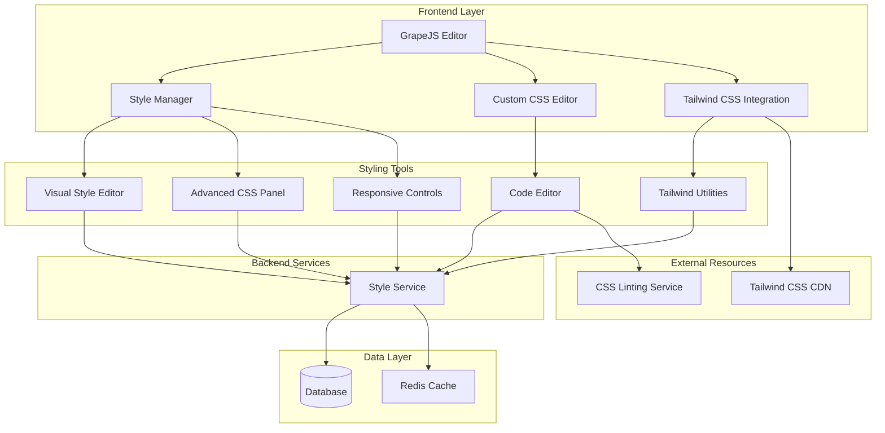

# Advanced Styling and Customization Tools Design

## Overview

This document outlines the design for implementing advanced styling and customization tools in the Vue.js Page Builder System. These tools will provide marketing administrators with powerful yet intuitive controls for customizing the appearance and behavior of their pages, with support for Tailwind CSS, custom CSS, and responsive design.

## Architecture

### Styling System Architecture



## Core Components

### 1. Visual Style Editor

```typescript
interface VisualStyleEditor {
  // Property management
  getPropertyGroups(): PropertyGroup[]
  getPropertyValues(componentId: string): Record<string, any>
  setPropertyValue(componentId: string, property: string, value: any): void
  
  // Style presets
  getStylePresets(category: string): StylePreset[]
  saveStylePreset(preset: StylePreset): Promise<string>
  applyStylePreset(componentId: string, presetId: string): void
  
  // Theme integration
  getCurrentTheme(): Theme
  applyTheme(theme: Theme): void
}

interface PropertyGroup {
  id: string
  name: string
  icon: string
  properties: StyleProperty[]
}

interface StyleProperty {
  id: string
  name: string
  type: 'color' | 'number' | 'text' | 'select' | 'toggle' | 'slider'
  value: any
  defaultValue: any
  options?: SelectOption[]
  min?: number
  max?: number
  step?: number
  unit?: string
  description?: string
}

interface StylePreset {
  id: string
  name: string
  category: string
  properties: Record<string, any>
  thumbnail?: string
  isPublic: boolean
}

interface Theme {
  id: string
  name: string
  colors: Record<string, string>
 typography: TypographySettings
  spacing: SpacingSettings
  borderRadius: BorderRadiusSettings
}
```

### 2. Advanced CSS Panel

```typescript
interface AdvancedCSSPanel {
  // CSS editing
  getCSS(componentId: string): string
  setCSS(componentId: string, css: string): void
  validateCSS(css: string): CSSValidationResult
  
  // CSS classes
  getCSSClasses(componentId: string): string[]
  addCSSClass(componentId: string, className: string): void
  removeCSSClass(componentId: string, className: string): void
  
  // CSS variables
  getCSSVariables(): Record<string, string>
  setCSSVariable(name: string, value: string): void
}

interface CSSValidationResult {
  isValid: boolean
 errors: CSSError[]
  warnings: CSSWarning[]
}

interface CSSError {
  line: number
  column: number
  message: string
  severity: 'error'
}

interface CSSWarning {
  line: number
  column: number
  message: string
  severity: 'warning'
}
```

### 3. Responsive Controls

```typescript
interface ResponsiveControls {
  // Device management
  getDevices(): DeviceBreakpoint[]
  getCurrentDevice(): DeviceBreakpoint
  setDevice(deviceId: string): void
  
  // Responsive properties
  getResponsiveProperty(componentId: string, property: string): ResponsiveValue
  setResponsiveProperty(componentId: string, property: string, value: any, deviceId?: string): void
  
  // Breakpoint management
  getBreakpoints(): Breakpoint[]
  addBreakpoint(breakpoint: Breakpoint): void
  removeBreakpoint(breakpointId: string): void
}

interface DeviceBreakpoint {
  id: string
  name: string
  minWidth: number
 maxWidth?: number
  icon: string
}

interface Breakpoint {
  id: string
  name: string
  minWidth: number
  maxWidth?: number
}

interface ResponsiveValue {
  default: any
  breakpoints: Record<string, any>
}
```

## Implementation Details

### 1. Visual Style Editor

#### Property Management

```typescript
class PropertyManager {
  private propertyGroups: PropertyGroup[] = [
    {
      id: 'layout',
      name: 'Layout',
      icon: 'layout',
      properties: [
        {
          id: 'display',
          name: 'Display',
          type: 'select',
          defaultValue: 'block',
          options: [
            { value: 'block', label: 'Block' },
            { value: 'inline', label: 'Inline' },
            { value: 'inline-block', label: 'Inline Block' },
            { value: 'flex', label: 'Flex' },
            { value: 'grid', label: 'Grid' }
          ]
        },
        {
          id: 'position',
          name: 'Position',
          type: 'select',
          defaultValue: 'static',
          options: [
            { value: 'static', label: 'Static' },
            { value: 'relative', label: 'Relative' },
            { value: 'absolute', label: 'Absolute' },
            { value: 'fixed', label: 'Fixed' }
          ]
        },
        {
          id: 'width',
          name: 'Width',
          type: 'text',
          defaultValue: 'auto',
          unit: 'px'
        },
        {
          id: 'height',
          name: 'Height',
          type: 'text',
          defaultValue: 'auto',
          unit: 'px'
        }
      ]
    },
    {
      id: 'typography',
      name: 'Typography',
      icon: 'type',
      properties: [
        {
          id: 'font-family',
          name: 'Font Family',
          type: 'select',
          defaultValue: 'Arial, sans-serif',
          options: [
            { value: 'Arial, sans-serif', label: 'Arial' },
            { value: "'Helvetica Neue', Helvetica, sans-serif", label: 'Helvetica' },
            { value: "'Times New Roman', Times, serif", label: 'Times New Roman' },
            { value: "'Courier New', Courier, monospace", label: 'Courier New' }
          ]
        },
        {
          id: 'font-size',
          name: 'Font Size',
          type: 'slider',
          defaultValue: 16,
          min: 8,
          max: 72,
          step: 1,
          unit: 'px'
        },
        {
          id: 'font-weight',
          name: 'Font Weight',
          type: 'select',
          defaultValue: 'normal',
          options: [
            { value: 'normal', label: 'Normal' },
            { value: 'bold', label: 'Bold' },
            { value: 'bolder', label: 'Bolder' },
            { value: 'lighter', label: 'Lighter' }
          ]
        },
        {
          id: 'color',
          name: 'Text Color',
          type: 'color',
          defaultValue: '#000000'
        }
      ]
    },
    {
      id: 'background',
      name: 'Background',
      icon: 'image',
      properties: [
        {
          id: 'background-color',
          name: 'Background Color',
          type: 'color',
          defaultValue: 'transparent'
        },
        {
          id: 'background-image',
          name: 'Background Image',
          type: 'text',
          defaultValue: ''
        },
        {
          id: 'background-repeat',
          name: 'Background Repeat',
          type: 'select',
          defaultValue: 'repeat',
          options: [
            { value: 'repeat', label: 'Repeat' },
            { value: 'repeat-x', label: 'Repeat X' },
            { value: 'repeat-y', label: 'Repeat Y' },
            { value: 'no-repeat', label: 'No Repeat' }
          ]
        }
      ]
    },
    {
      id: 'border',
      name: 'Border',
      icon: 'square',
      properties: [
        {
          id: 'border-width',
          name: 'Border Width',
          type: 'slider',
          defaultValue: 0,
          min: 0,
          max: 20,
          step: 1,
          unit: 'px'
        },
        {
          id: 'border-style',
          name: 'Border Style',
          type: 'select',
          defaultValue: 'solid',
          options: [
            { value: 'solid', label: 'Solid' },
            { value: 'dashed', label: 'Dashed' },
            { value: 'dotted', label: 'Dotted' },
            { value: 'double', label: 'Double' }
          ]
        },
        {
          id: 'border-color',
          name: 'Border Color',
          type: 'color',
          defaultValue: '#0000'
        },
        {
          id: 'border-radius',
          name: 'Border Radius',
          type: 'slider',
          defaultValue: 0,
          min: 0,
          max: 50,
          step: 1,
          unit: 'px'
        }
      ]
    }
  ]
  
  getPropertyGroups(): PropertyGroup[] {
    return this.propertyGroups
  }
  
  getPropertyValues(componentId: string): Record<string, any> {
    // Get current property values for a component
    // This would typically fetch from the component's style data
    return {}
  }
  
 setPropertyValue(componentId: string, property: string, value: any): void {
    // Set a property value for a component
    // This would update the component's style data
    console.log(`Setting ${property} to ${value} for component ${componentId}`)
  }
}
```

#### Style Presets

```typescript
class StylePresetManager {
 private presets: Map<string, StylePreset> = new Map()
  
  async getStylePresets(category: string): Promise<StylePreset[]> {
    // Fetch presets from backend or local storage
    const presets = Array.from(this.presets.values())
    return category ? presets.filter(p => p.category === category) : presets
  }
  
  async saveStylePreset(preset: StylePreset): Promise<string> {
    // Save preset to backend
    const presetId = preset.id || this.generateId()
    this.presets.set(presetId, { ...preset, id: presetId })
    
    // In a real implementation, this would save to a database
    try {
      const response = await fetch('/api/style-presets', {
        method: 'POST',
        headers: {
          'Content-Type': 'application/json',
        },
        body: JSON.stringify({ ...preset, id: presetId })
      })
      
      if (!response.ok) {
        throw new Error('Failed to save preset')
      }
      
      return presetId
    } catch (error) {
      console.error('Failed to save style preset:', error)
      throw error
    }
  }
  
  applyStylePreset(componentId: string, presetId: string): void {
    const preset = this.presets.get(presetId)
    if (preset) {
      // Apply preset properties to component
      Object.entries(preset.properties).forEach(([property, value]) => {
        // This would call the property manager to set the value
        console.log(`Applying ${property}: ${value} to component ${componentId}`)
      })
    }
 }
  
  private generateId(): string {
    return 'preset-' + Math.random().toString(36).substr(2, 9)
  }
}
```

### 2. Advanced CSS Panel

#### CSS Editing

```typescript
class CSSEditor {
  private cssCache: Map<string, string> = new Map()
  
  getCSS(componentId: string): string {
    // Get CSS for a component
    return this.cssCache.get(componentId) || ''
  }
  
  setCSS(componentId: string, css: string): void {
    // Set CSS for a component
    this.cssCache.set(componentId, css)
    
    // In a real implementation, this would update the component's style
    console.log(`Setting CSS for component ${componentId}: ${css}`)
  }
  
  async validateCSS(css: string): Promise<CSSValidationResult> {
    // Validate CSS syntax
    // In a real implementation, this might use a CSS linter service
    try {
      // Simple validation - check for balanced braces
      const openBraces = (css.match(/{/g) || []).length
      const closeBraces = (css.match(/}/g) || []).length
      
      if (openBraces !== closeBraces) {
        return {
          isValid: false,
          errors: [{
            line: 1,
            column: 1,
            message: 'Unbalanced braces',
            severity: 'error'
          }],
          warnings: []
        }
      }
      
      return {
        isValid: true,
        errors: [],
        warnings: []
      }
    } catch (error) {
      return {
        isValid: false,
        errors: [{
          line: 1,
          column: 1,
          message: 'CSS validation failed',
          severity: 'error'
        }],
        warnings: []
      }
    }
  }
  
  getCSSClasses(componentId: string): string[] {
    // Get CSS classes for a component
    // This would extract classes from the component's attributes
    return []
  }
  
 addCSSClass(componentId: string, className: string): void {
    // Add CSS class to a component
    console.log(`Adding class ${className} to component ${componentId}`)
  }
  
  removeCSSClass(componentId: string, className: string): void {
    // Remove CSS class from a component
    console.log(`Removing class ${className} from component ${componentId}`)
  }
}
```

#### CSS Variables

```typescript
class CSSVariableManager {
  private variables: Map<string, string> = new Map()
  
  getCSSVariables(): Record<string, string> {
    const result: Record<string, string> = {}
    this.variables.forEach((value, key) => {
      result[key] = value
    })
    return result
  }
  
  setCSSVariable(name: string, value: string): void {
    this.variables.set(name, value)
    
    // Update CSS variable in document
    const root = document.documentElement
    root.style.setProperty(name, value)
 }
  
  removeCSSVariable(name: string): void {
    this.variables.delete(name)
    
    // Remove CSS variable from document
    const root = document.documentElement
    root.style.removeProperty(name)
  }
}
```

### 3. Responsive Controls

#### Device Management

```typescript
class DeviceManager {
  private devices: DeviceBreakpoint[] = [
    {
      id: 'desktop',
      name: 'Desktop',
      minWidth: 1024,
      icon: 'monitor'
    },
    {
      id: 'tablet',
      name: 'Tablet',
      minWidth: 768,
      maxWidth: 1023,
      icon: 'tablet'
    },
    {
      id: 'mobile',
      name: 'Mobile',
      minWidth: 0,
      maxWidth: 767,
      icon: 'smartphone'
    }
  ]
  
  private currentDevice: string = 'desktop'
  private breakpoints: Breakpoint[] = [
    { id: 'sm', name: 'Small', minWidth: 640 },
    { id: 'md', name: 'Medium', minWidth: 768 },
    { id: 'lg', name: 'Large', minWidth: 1024 },
    { id: 'xl', name: 'Extra Large', minWidth: 1280 },
    { id: '2xl', name: '2X Large', minWidth: 1536 }
  ]
  
  getDevices(): DeviceBreakpoint[] {
    return this.devices
  }
  
  getCurrentDevice(): DeviceBreakpoint {
    return this.devices.find(d => d.id === this.currentDevice) || this.devices[0]
  }
  
  setDevice(deviceId: string): void {
    if (this.devices.some(d => d.id === deviceId)) {
      this.currentDevice = deviceId
      // Notify GrapeJS to update device preview
      console.log(`Switching to device: ${deviceId}`)
    }
  }
  
  getBreakpoints(): Breakpoint[] {
    return this.breakpoints
  }
  
  addBreakpoint(breakpoint: Breakpoint): void {
    this.breakpoints.push(breakpoint)
    // Update GrapeJS device manager
    console.log(`Added breakpoint: ${breakpoint.name}`)
  }
  
  removeBreakpoint(breakpointId: string): void {
    this.breakpoints = this.breakpoints.filter(b => b.id !== breakpointId)
    // Update GrapeJS device manager
    console.log(`Removed breakpoint: ${breakpointId}`)
  }
}
```

#### Responsive Properties

```typescript
class ResponsivePropertyManager {
  private responsiveValues: Map<string, Map<string, ResponsiveValue>> = new Map()
  
  getResponsiveProperty(componentId: string, property: string): ResponsiveValue {
    const componentProps = this.responsiveValues.get(componentId)
    if (componentProps) {
      const propValue = componentProps.get(property)
      if (propValue) {
        return propValue
      }
    }
    
    // Return default responsive value
    return {
      default: undefined,
      breakpoints: {}
    }
  }
  
  setResponsiveProperty(componentId: string, property: string, value: any, deviceId?: string): void {
    // Get or create component properties map
    let componentProps = this.responsiveValues.get(componentId)
    if (!componentProps) {
      componentProps = new Map()
      this.responsiveValues.set(componentId, componentProps)
    }
    
    // Get or create property value
    let propValue = componentProps.get(property)
    if (!propValue) {
      propValue = {
        default: undefined,
        breakpoints: {}
      }
      componentProps.set(property, propValue)
    }
    
    // Set value for specific device or default
    if (deviceId) {
      propValue.breakpoints[deviceId] = value
    } else {
      propValue.default = value
    }
    
    // Apply the value to the component
    console.log(`Setting responsive property ${property} for component ${componentId}:`, propValue)
  }
}
```

## Integration with Vue Wrapper Component

### Visual Style Editor Integration

```vue
<script setup lang="ts">
import { ref, computed, watch } from 'vue'
import { useStyleEditor } from '@/composables/useStyleEditor'
import type { PropertyGroup, StylePreset } from '@/types/styling'

const { 
  propertyGroups,
  getPropertyValues,
  setPropertyValue,
  stylePresets,
  saveStylePreset,
  applyStylePreset
} = useStyleEditor()

const selectedComponentId = ref<string | null>(null)
const componentProperties = ref<Record<string, any>>({})
const searchQuery = ref('')
const expandedGroups = ref<string[]>(['layout', 'typography'])

// Computed properties
const filteredPropertyGroups = computed(() => {
  if (!searchQuery.value) {
    return propertyGroups.value
  }
  
  return propertyGroups.value.map(group => ({
    ...group,
    properties: group.properties.filter(prop => 
      prop.name.toLowerCase().includes(searchQuery.value.toLowerCase())
    )
  })).filter(group => group.properties.length > 0)
})

// Watch for component selection changes
watch(selectedComponentId, (newId) => {
  if (newId) {
    componentProperties.value = getPropertyValues(newId)
  } else {
    componentProperties.value = {}
  }
})

// Methods
const handlePropertyChange = (propertyId: string, value: any) => {
  if (selectedComponentId.value) {
    setPropertyValue(selectedComponentId.value, propertyId, value)
    // Update local state
    componentProperties.value[propertyId] = value
  }
}

const toggleGroup = (groupId: string) => {
  const index = expandedGroups.value.indexOf(groupId)
  if (index >= 0) {
    expandedGroups.value.splice(index, 1)
  } else {
    expandedGroups.value.push(groupId)
  }
}

const saveCurrentAsPreset = async () => {
  if (!selectedComponentId.value) return
  
  const preset: StylePreset = {
    id: '',
    name: 'My Custom Style',
    category: 'custom',
    properties: componentProperties.value,
    isPublic: false
  }
  
  try {
    await saveStylePreset(preset)
    alert('Style preset saved successfully!')
  } catch (error) {
    console.error('Failed to save style preset:', error)
    alert('Failed to save style preset')
  }
}

const applyPreset = (presetId: string) => {
  if (selectedComponentId.value) {
    applyStylePreset(selectedComponentId.value, presetId)
  }
}
</script>
```

### Advanced CSS Panel Integration

```vue
<script setup lang="ts">
import { ref, watch } from 'vue'
import { useCSSEditor } from '@/composables/useCSSEditor'
import type { CSSValidationResult } from '@/types/styling'

const { 
  getCSS,
  setCSS,
  validateCSS,
  getCSSClasses,
  addCSSClass,
  removeCSSClass
} = useCSSEditor()

const selectedComponentId = ref<string | null>(null)
const cssContent = ref('')
const cssClasses = ref<string[]>([])
const validationResults = ref<CSSValidationResult | null>(null)
const isEditing = ref(false)

// Watch for component selection changes
watch(selectedComponentId, (newId) => {
  if (newId) {
    cssContent.value = getCSS(newId)
    cssClasses.value = getCSSClasses(newId)
  } else {
    cssContent.value = ''
    cssClasses.value = []
  }
  validationResults.value = null
})

// Methods
const saveCSS = () => {
  if (selectedComponentId.value) {
    setCSS(selectedComponentId.value, cssContent.value)
    isEditing.value = false
  }
}

const validateAndSave = async () => {
  validationResults.value = await validateCSS(cssContent.value)
  
  if (validationResults.value.isValid) {
    saveCSS()
  }
}

const addClass = (className: string) => {
  if (selectedComponentId.value && className) {
    addCSSClass(selectedComponentId.value, className)
    cssClasses.value.push(className)
  }
}

const removeClass = (className: string) => {
  if (selectedComponentId.value) {
    removeCSSClass(selectedComponentId.value, className)
    cssClasses.value = cssClasses.value.filter(c => c !== className)
  }
}

const startEditing = () => {
  isEditing.value = true
}

const cancelEditing = () => {
  if (selectedComponentId.value) {
    cssContent.value = getCSS(selectedComponentId.value)
  }
  isEditing.value = false
  validationResults.value = null
}
</script>
```

### Responsive Controls Integration

```vue
<script setup lang="ts">
import { ref, computed } from 'vue'
import { useResponsiveControls } from '@/composables/useResponsiveControls'
import type { DeviceBreakpoint, Breakpoint } from '@/types/styling'

const { 
  devices,
  currentDevice,
  setDevice,
  breakpoints,
  addBreakpoint,
  removeBreakpoint,
  getResponsiveProperty,
  setResponsiveProperty
} = useResponsiveControls()

const selectedComponentId = ref<string | null>(null)
const selectedProperty = ref<string | null>(null)
const newBreakpoint = ref<Omit<Breakpoint, 'id'>>({ name: '', minWidth: 0 })

// Computed properties
const devicePreviews = computed(() => {
  return devices.value.map(device => ({
    ...device,
    isActive: device.id === currentDevice.value.id
  }))
})

const responsiveValue = computed(() => {
  if (!selectedComponentId.value || !selectedProperty.value) {
    return null
  }
  
  return getResponsiveProperty(
    selectedComponentId.value,
    selectedProperty.value
 )
})

// Methods
const switchDevice = (deviceId: string) => {
  setDevice(deviceId)
}

const saveBreakpoint = () => {
  const breakpoint: Breakpoint = {
    ...newBreakpoint.value,
    id: this.generateId()
  }
  
  addBreakpoint(breakpoint)
  newBreakpoint.value = { name: '', minWidth: 0 }
}

const deleteBreakpoint = (breakpointId: string) => {
  removeBreakpoint(breakpointId)
}

const setResponsiveValue = (value: any, deviceId?: string) => {
  if (selectedComponentId.value && selectedProperty.value) {
    setResponsiveProperty(
      selectedComponentId.value,
      selectedProperty.value,
      value,
      deviceId
    )
  }
}

private generateId(): string {
  return 'bp-' + Math.random().toString(36).substr(2, 9)
}
</script>
```

## Tailwind CSS Integration

### Tailwind Utilities Manager

```typescript
class TailwindUtilitiesManager {
  private utilities: Record<string, string[]> = {
    'Layout': [
      'container', 'flex', 'grid', 'block', 'inline', 'inline-block',
      'hidden', 'float-right', 'float-left', 'clear-left', 'clear-right', 'clear-both'
    ],
    'Flexbox': [
      'flex-row', 'flex-col', 'flex-wrap', 'flex-nowrap', 'justify-start', 'justify-center',
      'justify-end', 'items-start', 'items-center', 'items-end', 'self-auto', 'self-start'
    ],
    'Spacing': [
      'p-0', 'p-1', 'p-2', 'p-3', 'p-4', 'p-5', 'p-6', 'p-8', 'p-10', 'p-12', 'p-16', 'p-20',
      'm-0', 'm-1', 'm-2', 'm-3', 'm-4', 'm-5', 'm-6', 'm-8', 'm-10', 'm-12', 'm-16', 'm-20'
    ],
    'Sizing': [
      'w-0', 'w-1', 'w-2', 'w-3', 'w-4', 'w-5', 'w-6', 'w-8', 'w-10', 'w-12', 'w-16', 'w-20',
      'h-0', 'h-1', 'h-2', 'h-3', 'h-4', 'h-5', 'h-6', 'h-8', 'h-10', 'h-12', 'h-16', 'h-20'
    ],
    'Typography': [
      'font-sans', 'font-serif', 'font-mono', 'text-xs', 'text-sm', 'text-base', 'text-lg',
      'text-xl', 'text-2xl', 'text-3xl', 'text-4xl', 'text-5xl', 'text-6xl', 'font-thin',
      'font-extralight', 'font-light', 'font-normal', 'font-medium', 'font-semibold'
    ],
    'Backgrounds': [
      'bg-transparent', 'bg-current', 'bg-black', 'bg-white', 'bg-gray-50', 'bg-gray-100',
      'bg-gray-200', 'bg-gray-300', 'bg-gray-400', 'bg-gray-500', 'bg-gray-600', 'bg-gray-700'
    ],
    'Borders': [
      'border', 'border-0', 'border-2', 'border-4', 'border-8', 'border-solid', 'border-dashed',
      'border-dotted', 'border-double', 'border-none', 'rounded-none', 'rounded-sm', 'rounded',
      'rounded-md', 'rounded-lg', 'rounded-xl', 'rounded-2xl', 'rounded-3xl', 'rounded-full'
    ],
    'Effects': [
      'shadow-sm', 'shadow', 'shadow-md', 'shadow-lg', 'shadow-xl', 'shadow-2xl', 'shadow-none',
      'opacity-0', 'opacity-5', 'opacity-10', 'opacity-20', 'opacity-25', 'opacity-30'
    ]
  }
  
  getUtilityCategories(): string[] {
    return Object.keys(this.utilities)
  }
  
  getUtilitiesForCategory(category: string): string[] {
    return this.utilities[category] || []
  }
  
  searchUtilities(query: string): string[] {
    const allUtilities = Object.values(this.utilities).flat()
    return allUtilities.filter(util => util.includes(query))
  }
  
  applyUtility(componentId: string, utility: string): void {
    // Apply Tailwind utility class to component
    console.log(`Applying Tailwind utility ${utility} to component ${componentId}`)
  }
  
  removeUtility(componentId: string, utility: string): void {
    // Remove Tailwind utility class from component
    console.log(`Removing Tailwind utility ${utility} from component ${componentId}`)
  }
}
```

## Performance Optimization

### 1. Property Value Caching

```typescript
class PropertyValueCache {
  private cache: Map<string, any> = new Map()
  private cacheTimeouts: Map<string, number> = new Map()
  private defaultTimeout = 30000 // 30 seconds
  
  get(componentId: string, property: string): any {
    const key = `${componentId}:${property}`
    return this.cache.get(key)
  }
  
  set(componentId: string, property: string, value: any, timeout?: number): void {
    const key = `${componentId}:${property}`
    this.cache.set(key, value)
    
    // Set timeout to clear cache entry
    const timer = setTimeout(() => {
      this.cache.delete(key)
      this.cacheTimeouts.delete(key)
    }, timeout || this.defaultTimeout)
    
    this.cacheTimeouts.set(key, timer)
  }
  
  clear(componentId: string, property: string): void {
    const key = `${componentId}:${property}`
    const timer = this.cacheTimeouts.get(key)
    if (timer) {
      clearTimeout(timer)
      this.cacheTimeouts.delete(key)
    }
    this.cache.delete(key)
  }
  
  clearAll(): void {
    this.cacheTimeouts.forEach(timer => clearTimeout(timer))
    this.cacheTimeouts.clear()
    this.cache.clear()
  }
}
```

### 2. Batch Property Updates

```typescript
class PropertyBatchUpdater {
  private pendingUpdates: Array<{ componentId: string; property: string; value: any }> = []
  private updateTimer: number | null = null
  private batchDelay = 100 // milliseconds
  
  queueUpdate(componentId: string, property: string, value: any): void {
    this.pendingUpdates.push({ componentId, property, value })
    
    if (this.updateTimer) {
      clearTimeout(this.updateTimer)
    }
    
    this.updateTimer = setTimeout(() => {
      this.processBatch()
    }, this.batchDelay)
  }
  
  private processBatch(): void {
    // Group updates by component
    const updatesByComponent: Record<string, Record<string, any>> = {}
    
    this.pendingUpdates.forEach(update => {
      if (!updatesByComponent[update.componentId]) {
        updatesByComponent[update.componentId] = {}
      }
      updatesByComponent[update.componentId][update.property] = update.value
    })
    
    // Apply all updates
    Object.entries(updatesByComponent).forEach(([componentId, properties]) => {
      // Apply properties to component
      Object.entries(properties).forEach(([property, value]) => {
        console.log(`Batch updating ${property} to ${value} for component ${componentId}`)
      })
    })
    
    // Clear pending updates
    this.pendingUpdates = []
    this.updateTimer = null
  }
}
```

## Error Handling and Validation

### 1. CSS Validation

```typescript
class CSSValidator {
  async validate(css: string): Promise<CSSValidationResult> {
    try {
      // In a real implementation, this would use a CSS parser or validation service
      const parser = new CSSParser()
      const ast = parser.parse(css)
      
      // Check for common errors
      const errors: CSSError[] = []
      const warnings: CSSWarning[] = []
      
      // Validate syntax
      if (!this.isValidSyntax(css)) {
        errors.push({
          line: 1,
          column: 1,
          message: 'Invalid CSS syntax',
          severity: 'error'
        })
      }
      
      // Check for deprecated properties
      this.checkDeprecatedProperties(ast, warnings)
      
      // Check for browser compatibility
      this.checkBrowserCompatibility(ast, warnings)
      
      return {
        isValid: errors.length === 0,
        errors,
        warnings
      }
    } catch (error) {
      return {
        isValid: false,
        errors: [{
          line: 1,
          column: 1,
          message: error instanceof Error ? error.message : 'Unknown error',
          severity: 'error'
        }],
        warnings: []
      }
    }
  }
  
  private isValidSyntax(css: string): boolean {
    // Simple syntax validation
    try {
      // Check for balanced braces
      const openBraces = (css.match(/{/g) || []).length
      const closeBraces = (css.match(/}/g) || []).length
      
      // Check for semicolons at end of declarations
      const declarations = css.match(/[^{]*{[^}]*}/g) || []
      const missingSemicolons = declarations.some(decl => {
        const content = decl.substring(decl.indexOf('{') + 1, decl.lastIndexOf('}'))
        return content.split(';').some(part => 
          part.trim() !== '' && !part.trim().endsWith(';')
        )
      })
      
      return openBraces === closeBraces && !missingSemicolons
    } catch {
      return false
    }
  }
  
  private checkDeprecatedProperties(ast: any, warnings: CSSWarning[]): void {
    // Check for deprecated CSS properties
    const deprecatedProps = ['box-shadow', 'border-radius']
    // Implementation would check AST for these properties
  }
  
  private checkBrowserCompatibility(ast: any, warnings: CSSWarning[]): void {
    // Check for browser compatibility issues
    // Implementation would analyze CSS features and check support
  }
}
```

### 2. Responsive Validation

```typescript
class ResponsiveValidator {
  validateResponsiveDesign(responsiveValues: Record<string, ResponsiveValue>): ValidationError[] {
    const errors: ValidationError[] = []
    
    // Check for conflicting breakpoints
    Object.entries(responsiveValues).forEach(([property, value]) => {
      const breakpoints = Object.keys(value.breakpoints)
      
      // Check for overlapping breakpoints
      for (let i = 0; i < breakpoints.length - 1; i++) {
        for (let j = i + 1; j < breakpoints.length; j++) {
          if (this.doBreakpointsOverlap(breakpoints[i], breakpoints[j])) {
            errors.push({
              property,
              message: `Overlapping breakpoints: ${breakpoints[i]} and ${breakpoints[j]}`,
              severity: 'warning'
            })
          }
        }
      }
      
      // Check for mobile-first consistency
      if (!value.default && Object.keys(value.breakpoints).length > 0) {
        errors.push({
          property,
          message: 'Missing default value for responsive property',
          severity: 'warning'
        })
      }
    })
    
    return errors
  }
  
  private doBreakpointsOverlap(bp1: string, bp2: string): boolean {
    // Implementation would check if two breakpoints overlap
    // This is a simplified version
    return false
  }
}

interface ValidationError {
  property: string
  message: string
  severity: 'error' | 'warning'
}
```

## Testing Strategy

### Unit Tests

1. Property management functions
2. Style preset creation and application
3. CSS validation logic
4. Responsive property handling
5. Tailwind utility integration

### Integration Tests

1. Visual style editor with GrapeJS
2. Advanced CSS panel functionality
3. Responsive controls with device switching
4. Style preset saving and loading
5. Tailwind CSS utility application

### End-to-End Tests

1. Complete styling workflow
2. Responsive design implementation
3. Cross-browser compatibility
4. Performance with complex styles
5. Error handling scenarios

## Implementation Plan

### Phase 1: Core Infrastructure
- Implement property management system
- Create style preset manager
- Set up CSS editing capabilities
- Implement responsive controls

### Phase 2: Vue Integration
- Integrate visual style editor with Vue wrapper
- Add advanced CSS panel to Vue component
- Implement responsive controls in Vue
- Add Tailwind CSS integration

### Phase 3: Performance Optimization
- Add property value caching
- Implement batch updates
- Optimize CSS validation
- Add lazy loading for utilities

### Phase 4: Error Handling
- Implement CSS validation
- Add responsive design validation
- Create recovery mechanisms
- Add comprehensive error handling

### Phase 5: Testing and Refinement
- Implement unit tests
- Add integration tests
- Perform performance testing
- Optimize user experience

## Dependencies

- `grapesjs` - Core page builder engine
- `tailwindcss` - Utility-first CSS framework
- `vue` - Vue.js framework
- `pinia` - State management
- `codemirror` - Code editor component (for CSS editor)

## Security Considerations

- Sanitize CSS before applying
- Validate Tailwind utility classes
- Implement proper access controls
- Prevent CSS injection attacks
- Validate user input for style properties