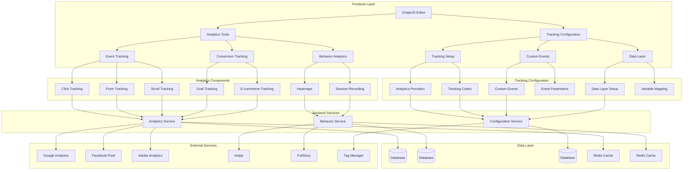

# Analytics and Tracking Capabilities Design

## Overview

This document outlines the design for implementing comprehensive analytics and tracking capabilities in the Vue.js Page Builder System. These features will enable marketing administrators to track user behavior, measure engagement, and gain insights into page performance to optimize their content and improve conversion rates.

## Architecture

### Analytics and Tracking System Architecture



## Core Components

### 1. Analytics Tools

```typescript
interface AnalyticsTools {
  // Event tracking
  trackEvent(eventName: string, properties?: Record<string, any>): Promise<void>
  trackPageView(pageUrl: string, properties?: Record<string, any>): Promise<void>
  trackClick(elementId: string, properties?: Record<string, any>): Promise<void>
  trackFormSubmission(formId: string, properties?: Record<string, any>): Promise<void>
  trackScroll(depth: number, properties?: Record<string, any>): Promise<void>
  
  // Conversion tracking
  trackConversion(goalId: string, value?: number, properties?: Record<string, any>): Promise<void>
  trackEcommerceTransaction(transaction: EcommerceTransaction): Promise<void>
  
  // Behavior analytics
  enableHeatmaps(pageId: string): Promise<void>
  disableHeatmaps(pageId: string): Promise<void>
  getSessionRecordingUrl(sessionId: string): Promise<string>
  
  // Analytics data
  getAnalyticsData(pageId: string, options?: AnalyticsQueryOptions): Promise<AnalyticsData>
  getRealTimeData(pageId: string): Promise<RealTimeData>
}

interface EcommerceTransaction {
  transactionId: string
  affiliation?: string
  value: number
  currency: string
  tax?: number
  shipping?: number
  items: EcommerceItem[]
}

interface EcommerceItem {
  itemId: string
  name: string
  category?: string
  price: number
  quantity: number
  currency: string
}

interface AnalyticsQueryOptions {
  startDate?: Date
  endDate?: Date
  metrics?: string[]
  dimensions?: string[]
  filters?: Record<string, any>
  limit?: number
}

interface AnalyticsData {
  pageViews: number
  uniqueVisitors: number
  bounceRate: number
  averageSessionDuration: number
  conversionRate: number
  topEvents: AnalyticsEvent[]
  trafficSources: TrafficSource[]
  demographics: DemographicsData
}

interface AnalyticsEvent {
  name: string
  count: number
  value?: number
}

interface TrafficSource {
  source: string
  medium: string
  campaign?: string
  sessions: number
}

interface DemographicsData {
  ageGroups: Record<string, number>
  genders: Record<string, number>
  locations: Record<string, number>
}

interface RealTimeData {
  activeUsers: number
  currentEvents: RealTimeEvent[]
  pageViewsPerMinute: number
}
```

### 2. Tracking Configuration

```typescript
interface TrackingConfiguration {
  // Analytics providers
  setupProvider(provider: AnalyticsProvider, config: ProviderConfig): Promise<void>
  removeProvider(providerId: string): Promise<void>
  getActiveProviders(): Promise<AnalyticsProvider[]>
  
  // Custom events
  createCustomEvent(event: CustomEventConfig): Promise<CustomEvent>
  updateCustomEvent(eventId: string, config: CustomEventConfig): Promise<CustomEvent>
 deleteCustomEvent(eventId: string): Promise<void>
  getCustomEvents(pageId: string): Promise<CustomEvent[]>
  
  // Data layer
  setupDataLayer(mapping: DataLayerMapping): Promise<void>
  updateDataLayerVariable(variable: string, value: any): Promise<void>
  getDataLayerSnapshot(): Promise<Record<string, any>>
  
  // Tracking codes
  addTrackingCode(code: TrackingCode): Promise<void>
  removeTrackingCode(codeId: string): Promise<void>
  getTrackingCodes(pageId: string): Promise<TrackingCode[]>
}

interface AnalyticsProvider {
  id: string
  name: string
  type: ProviderType
  config: ProviderConfig
  status: 'active' | 'inactive' | 'error'
  lastConnected?: Date
}

type ProviderType = 
  'google-analytics' | 'facebook-pixel' | 'adobe-analytics' | 
  'mixpanel' | 'segment' | 'custom'

interface ProviderConfig {
  trackingId?: string
  accountId?: string
  propertyId?: string
 customScript?: string
  [key: string]: any
}

interface CustomEventConfig {
  id?: string
  name: string
  description?: string
  trigger: EventTrigger
  properties: EventProperty[]
  pageId: string
}

interface EventTrigger {
  type: TriggerType
  selector?: string
  elementId?: string
 formId?: string
  customCondition?: string
}

type TriggerType = 
  'click' | 'form_submit' | 'page_view' | 'scroll' | 
  'custom' | 'timer' | 'exit_intent'

interface EventProperty {
  name: string
  value: string | number | boolean
  source: PropertySource
}

type PropertySource = 'static' | 'element_attribute' | 'data_layer' | 'custom'

interface CustomEvent {
  id: string
  config: CustomEventConfig
  createdAt: Date
  updatedAt: Date
}

interface DataLayerMapping {
  pageVariables: Record<string, string>
  eventVariables: Record<string, string>
  userVariables: Record<string, string>
}

interface TrackingCode {
  id: string
  name: string
  code: string
  type: 'header' | 'body' | 'footer'
  position: 'before' | 'after'
  status: 'active' | 'inactive'
  pageId?: string
  createdAt: Date
  updatedAt: Date
}
```

## Implementation Details

### 1. Analytics Tools Implementation

#### Event Tracking

```typescript
class EventTracker {
  private providers: Map<string, AnalyticsProvider> = new Map()
  private customEvents: Map<string, CustomEvent> = new Map()
  private dataLayer: Record<string, any> = {}
  
  async trackEvent(eventName: string, properties?: Record<string, any>): Promise<void> {
    try {
      // Send event to all active providers
      for (const provider of this.providers.values()) {
        if (provider.status === 'active') {
          await this.sendEventToProvider(provider, eventName, properties)
        }
      }
      
      // Update data layer
      this.updateDataLayer('lastEvent', { name: eventName, properties, timestamp: Date.now() })
      
      // Log event locally for debugging
      console.log(`Tracked event: ${eventName}`, properties)
    } catch (error) {
      console.error('Failed to track event:', error)
    }
  }
  
  async trackPageView(pageUrl: string, properties?: Record<string, any>): Promise<void> {
    const pageProperties = {
      url: pageUrl,
      title: document.title,
      referrer: document.referrer,
      ...properties
    }
    
    await this.trackEvent('page_view', pageProperties)
 }
  
  async trackClick(elementId: string, properties?: Record<string, any>): Promise<void> {
    const element = document.getElementById(elementId)
    if (!element) {
      console.warn(`Element with ID ${elementId} not found`)
      return
    }
    
    const clickProperties = {
      elementId,
      elementText: element.textContent || element.innerText,
      elementTag: element.tagName.toLowerCase(),
      ...properties
    }
    
    await this.trackEvent('element_click', clickProperties)
  }
  
  async trackFormSubmission(formId: string, properties?: Record<string, any>): Promise<void> {
    const form = document.getElementById(formId) as HTMLFormElement
    if (!form) {
      console.warn(`Form with ID ${formId} not found`)
      return
    }
    
    const formData = new FormData(form)
    const formProperties: Record<string, any> = {}
    
    for (const [key, value] of formData.entries()) {
      formProperties[key] = value
    }
    
    const submissionProperties = {
      formId,
      formName: form.name,
      fieldCount: form.elements.length,
      ...formProperties,
      ...properties
    }
    
    await this.trackEvent('form_submit', submissionProperties)
  }
  
  async trackScroll(depth: number, properties?: Record<string, any>): Promise<void> {
    const scrollProperties = {
      scrollDepth: depth,
      windowHeight: window.innerHeight,
      documentHeight: document.documentElement.scrollHeight,
      ...properties
    }
    
    await this.trackEvent('page_scroll', scrollProperties)
  }
  
  private async sendEventToProvider(provider: AnalyticsProvider, eventName: string, properties?: Record<string, any>): Promise<void> {
    // Implementation would depend on the specific provider
    switch (provider.type) {
      case 'google-analytics':
        await this.sendToGoogleAnalytics(provider, eventName, properties)
        break
      case 'facebook-pixel':
        await this.sendToFacebookPixel(provider, eventName, properties)
        break
      case 'adobe-analytics':
        await this.sendToAdobeAnalytics(provider, eventName, properties)
        break
      default:
        // Custom provider implementation
        await this.sendToCustomProvider(provider, eventName, properties)
    }
  }
  
  private async sendToGoogleAnalytics(provider: AnalyticsProvider, eventName: string, properties?: Record<string, any>): Promise<void> {
    // In a real implementation, this would use the Google Analytics gtag or analytics.js library
    console.log(`Sending event to Google Analytics: ${eventName}`, properties)
    
    // Example using gtag:
    // gtag('event', eventName, properties)
  }
  
 private async sendToFacebookPixel(provider: AnalyticsProvider, eventName: string, properties?: Record<string, any>): Promise<void> {
    // In a real implementation, this would use the Facebook Pixel fbq library
    console.log(`Sending event to Facebook Pixel: ${eventName}`, properties)
    
    // Example using fbq:
    // fbq('track', eventName, properties)
  }
  
  private async sendToAdobeAnalytics(provider: AnalyticsProvider, eventName: string, properties?: Record<string, any>): Promise<void> {
    // In a real implementation, this would use the Adobe Analytics AppMeasurement library
    console.log(`Sending event to Adobe Analytics: ${eventName}`, properties)
    
    // Example using AppMeasurement:
    // s.linkTrackVars = "events,eVar1";
    // s.events = eventName;
    // s.eVar1 = properties?.value;
    // s.tl(true, 'o', eventName);
  }
  
  private async sendToCustomProvider(provider: AnalyticsProvider, eventName: string, properties?: Record<string, any>): Promise<void> {
    // Execute custom script if provided
    if (provider.config.customScript) {
      try {
        // In a real implementation, this would safely execute the custom script
        // with the event data
        console.log(`Executing custom tracking script for ${provider.name}: ${eventName}`, properties)
      } catch (error) {
        console.error(`Failed to execute custom tracking script for ${provider.name}:`, error)
      }
    }
  
  private updateDataLayer(key: string, value: any): void {
    this.dataLayer[key] = value
    
    // In a real implementation, this would update the actual data layer
    // used by analytics providers
    console.log(`Updated data layer ${key}:`, value)
  }
}
```

#### Conversion Tracking

```typescript
class ConversionTracker {
  async trackConversion(goalId: string, value?: number, properties?: Record<string, any>): Promise<void> {
    try {
      // Track the conversion event
      await eventTracker.trackEvent('conversion', {
        goalId,
        value,
        ...properties
      })
      
      // Send to conversion-specific providers
      await this.sendConversionToProviders(goalId, value, properties)
      
      console.log(`Tracked conversion for goal ${goalId}`, { value, properties })
    } catch (error) {
      console.error('Failed to track conversion:', error)
    }
  }
  
  async trackEcommerceTransaction(transaction: EcommerceTransaction): Promise<void> {
    try {
      // Track the transaction event
      await eventTracker.trackEvent('ecommerce_purchase', {
        transaction_id: transaction.transactionId,
        value: transaction.value,
        currency: transaction.currency,
        ...transaction
      })
      
      // Send to ecommerce-specific providers
      await this.sendEcommerceToProviders(transaction)
      
      console.log(`Tracked ecommerce transaction ${transaction.transactionId}`, transaction)
    } catch (error) {
      console.error('Failed to track ecommerce transaction:', error)
    }
  }
  
  private async sendConversionToProviders(goalId: string, value?: number, properties?: Record<string, any>): Promise<void> {
    // Implementation would send conversion data to active providers
    console.log(`Sending conversion ${goalId} to providers`, { value, properties })
  }
  
  private async sendEcommerceToProviders(transaction: EcommerceTransaction): Promise<void> {
    // Implementation would send ecommerce data to active providers
    console.log(`Sending ecommerce transaction to providers`, transaction)
  }
}
```

#### Behavior Analytics

```typescript
class BehaviorAnalyzer {
  private heatmapsEnabled = false
  private sessionRecordingEnabled = false
  
  async enableHeatmaps(pageId: string): Promise<void> {
    this.heatmapsEnabled = true
    
    // In a real implementation, this would initialize heatmap tracking
    // using a service like Hotjar or Mouseflow
    console.log(`Heatmaps enabled for page ${pageId}`)
    
    // Start tracking mouse movements and clicks
    this.startHeatmapTracking()
  }
  
  async disableHeatmaps(pageId: string): Promise<void> {
    this.heatmapsEnabled = false
    
    // Stop heatmap tracking
    this.stopHeatmapTracking()
    
    console.log(`Heatmaps disabled for page ${pageId}`)
  }
  
  async getSessionRecordingUrl(sessionId: string): Promise<string> {
    // In a real implementation, this would return a URL to view the session recording
    // from a service like Hotjar or FullStory
    return `https://example-analytics.com/session/${sessionId}`
  }
  
  private startHeatmapTracking(): void {
    if (!this.heatmapsEnabled) return
    
    // Track mouse movements
    document.addEventListener('mousemove', this.handleMouseMove)
    
    // Track clicks
    document.addEventListener('click', this.handleMouseClick)
    
    // Track scrolls
    window.addEventListener('scroll', this.handleScroll)
 }
  
  private stopHeatmapTracking(): void {
    document.removeEventListener('mousemove', this.handleMouseMove)
    document.removeEventListener('click', this.handleMouseClick)
    window.removeEventListener('scroll', this.handleScroll)
 }
  
  private handleMouseMove = (event: MouseEvent): void => {
    // Record mouse position for heatmap
    console.log(`Mouse moved to (${event.clientX}, ${event.clientY})`)
  }
  
  private handleMouseClick = (event: MouseEvent): void => {
    // Record click for heatmap
    console.log(`Mouse clicked at (${event.clientX}, ${event.clientY})`)
  }
  
  private handleScroll = (): void => {
    // Record scroll position for heatmap
    console.log(`Page scrolled to ${window.scrollY}`)
  }
}
```

### 2. Tracking Configuration Implementation

#### Analytics Providers Management

```typescript
class ProviderManager {
  private providers: Map<string, AnalyticsProvider> = new Map()
  
  async setupProvider(provider: AnalyticsProvider, config: ProviderConfig): Promise<void> {
    const fullProvider: AnalyticsProvider = {
      ...provider,
      config,
      status: 'active',
      lastConnected: new Date()
    }
    
    this.providers.set(provider.id, fullProvider)
    
    // Save to backend
    try {
      const response = await fetch('/api/analytics-providers', {
        method: 'POST',
        headers: {
          'Content-Type': 'application/json',
        },
        body: JSON.stringify(fullProvider)
      })
      
      if (!response.ok) {
        throw new Error('Failed to save provider configuration')
      }
      
      console.log(`Provider ${provider.name} configured successfully`)
    } catch (error) {
      console.error('Failed to save provider configuration:', error)
      throw error
    }
  }
  
  async removeProvider(providerId: string): Promise<void> {
    this.providers.delete(providerId)
    
    // Remove from backend
    try {
      const response = await fetch(`/api/analytics-providers/${providerId}`, {
        method: 'DELETE'
      })
      
      if (!response.ok) {
        throw new Error('Failed to remove provider')
      }
      
      console.log(`Provider ${providerId} removed successfully`)
    } catch (error) {
      console.error('Failed to remove provider:', error)
      throw error
    }
  }
  
  async getActiveProviders(): Promise<AnalyticsProvider[]> {
    return Array.from(this.providers.values()).filter(p => p.status === 'active')
  }
  
  async validateProvider(provider: AnalyticsProvider): Promise<boolean> {
    try {
      // Test connection to the provider
      switch (provider.type) {
        case 'google-analytics':
          return await this.testGoogleAnalytics(provider.config.trackingId!)
        case 'facebook-pixel':
          return await this.testFacebookPixel(provider.config.trackingId!)
        case 'adobe-analytics':
          return await this.testAdobeAnalytics(provider.config)
        default:
          // For custom providers, assume valid if config exists
          return !!provider.config
      }
    } catch (error) {
      console.error(`Failed to validate provider ${provider.name}:`, error)
      return false
    }
  }
  
  private async testGoogleAnalytics(trackingId: string): Promise<boolean> {
    // In a real implementation, this would test the Google Analytics connection
    console.log(`Testing Google Analytics connection with tracking ID: ${trackingId}`)
    return true
  }
  
  private async testFacebookPixel(trackingId: string): Promise<boolean> {
    // In a real implementation, this would test the Facebook Pixel connection
    console.log(`Testing Facebook Pixel connection with tracking ID: ${trackingId}`)
    return true
  }
  
  private async testAdobeAnalytics(config: ProviderConfig): Promise<boolean> {
    // In a real implementation, this would test the Adobe Analytics connection
    console.log(`Testing Adobe Analytics connection with config:`, config)
    return true
  }
}
```

#### Custom Events Management

```typescript
class CustomEventManager {
  private customEvents: Map<string, CustomEvent> = new Map()
  
  async createCustomEvent(event: CustomEventConfig): Promise<CustomEvent> {
    const customEvent: CustomEvent = {
      id: this.generateId(),
      config: event,
      createdAt: new Date(),
      updatedAt: new Date()
    }
    
    this.customEvents.set(customEvent.id, customEvent)
    
    // Save to backend
    try {
      const response = await fetch('/api/custom-events', {
        method: 'POST',
        headers: {
          'Content-Type': 'application/json',
        },
        body: JSON.stringify(customEvent)
      })
      
      if (!response.ok) {
        throw new Error('Failed to create custom event')
      }
      
      // Set up event listeners
      this.setupEventListeners(customEvent)
      
      console.log(`Custom event ${event.name} created successfully`)
      return customEvent
    } catch (error) {
      console.error('Failed to create custom event:', error)
      throw error
    }
  }
  
  async updateCustomEvent(eventId: string, config: CustomEventConfig): Promise<CustomEvent> {
    const existingEvent = this.customEvents.get(eventId)
    if (!existingEvent) {
      throw new Error(`Custom event with ID ${eventId} not found`)
    }
    
    const updatedEvent: CustomEvent = {
      ...existingEvent,
      config,
      updatedAt: new Date()
    }
    
    this.customEvents.set(eventId, updatedEvent)
    
    // Update in backend
    try {
      const response = await fetch(`/api/custom-events/${eventId}`, {
        method: 'PUT',
        headers: {
          'Content-Type': 'application/json',
        },
        body: JSON.stringify(updatedEvent)
      })
      
      if (!response.ok) {
        throw new Error('Failed to update custom event')
      }
      
      // Update event listeners
      this.removeEventListeners(existingEvent)
      this.setupEventListeners(updatedEvent)
      
      console.log(`Custom event ${config.name} updated successfully`)
      return updatedEvent
    } catch (error) {
      console.error('Failed to update custom event:', error)
      throw error
    }
  }
  
  async deleteCustomEvent(eventId: string): Promise<void> {
    const event = this.customEvents.get(eventId)
    if (event) {
      // Remove event listeners
      this.removeEventListeners(event)
      
      this.customEvents.delete(eventId)
      
      // Remove from backend
      try {
        const response = await fetch(`/api/custom-events/${eventId}`, {
          method: 'DELETE'
        })
        
        if (!response.ok) {
          throw new Error('Failed to delete custom event')
        }
        
        console.log(`Custom event ${eventId} deleted successfully`)
      } catch (error) {
        console.error('Failed to delete custom event:', error)
        throw error
      }
    }
  }
  
  async getCustomEvents(pageId: string): Promise<CustomEvent[]> {
    try {
      const response = await fetch(`/api/pages/${pageId}/custom-events`)
      if (!response.ok) {
        throw new Error('Failed to fetch custom events')
      }
      
      const events = await response.json()
      
      // Cache events
      events.forEach((event: CustomEvent) => {
        this.customEvents.set(event.id, event)
      })
      
      return events
    } catch (error) {
      console.error('Failed to fetch custom events:', error)
      throw error
    }
  }
  
  private setupEventListeners(event: CustomEvent): void {
    const { trigger } = event.config
    
    switch (trigger.type) {
      case 'click':
        if (trigger.selector) {
          document.addEventListener('click', (e) => {
            const target = e.target as Element
            if (target.matches(trigger.selector!)) {
              this.handleCustomEvent(event, e)
            }
          })
        }
        break
      case 'form_submit':
        if (trigger.formId) {
          const form = document.getElementById(trigger.formId) as HTMLFormElement
          if (form) {
            form.addEventListener('submit', (e) => {
              this.handleCustomEvent(event, e)
            })
          }
        }
        break
      case 'page_view':
        // Page view events are handled separately
        break
      case 'scroll':
        // Set up scroll tracking
        window.addEventListener('scroll', () => {
          this.handleScrollEvent(event)
        })
        break
      case 'custom':
        // Custom events are triggered programmatically
        break
      case 'timer':
        // Set up timer-based event
        setTimeout(() => {
          this.handleCustomEvent(event)
        }, 3000) // Default 30 seconds
        break
      case 'exit_intent':
        // Set up exit intent detection
        document.addEventListener('mouseleave', (e) => {
          if (e.clientY <= 0) {
            this.handleCustomEvent(event, e)
          }
        })
        break
    }
  }
  
  private removeEventListeners(event: CustomEvent): void {
    // In a real implementation, we would need to keep track of event listeners
    // to properly remove them. For now, we'll just log the removal.
    console.log(`Removing event listeners for ${event.config.name}`)
  }
  
  private handleCustomEvent(event: CustomEvent, originalEvent?: Event): void {
    // Collect event properties
    const properties: Record<string, any> = {}
    
    event.config.properties.forEach(prop => {
      switch (prop.source) {
        case 'static':
          properties[prop.name] = prop.value
          break
        case 'element_attribute':
          if (originalEvent?.target) {
            const element = originalEvent.target as Element
            properties[prop.name] = element.getAttribute(prop.value as string)
          }
          break
        case 'data_layer':
          // Get value from data layer
          properties[prop.name] = dataLayerManager.getVariable(prop.value as string)
          break
        case 'custom':
          // Custom property handling
          properties[prop.name] = this.evaluateCustomProperty(prop.value as string, originalEvent)
          break
      }
    })
    
    // Track the custom event
    eventTracker.trackEvent(event.config.name, properties)
 }
  
  private handleScrollEvent(event: CustomEvent): void {
    // Calculate scroll depth
    const scrollDepth = (window.scrollY / (document.documentElement.scrollHeight - window.innerHeight)) * 100
    
    // Check if we should trigger the event
    // This is a simplified implementation
    if (scrollDepth >= 75) { // 75% scroll depth
      this.handleCustomEvent(event)
    }
  }
  
  private evaluateCustomProperty(expression: string, originalEvent?: Event): any {
    // In a real implementation, this would safely evaluate the expression
    // For now, we'll just return the expression as a string
    console.log(`Evaluating custom property expression: ${expression}`)
    return expression
  }
  
  private generateId(): string {
    return 'event-' + Math.random().toString(36).substr(2, 9)
  }
}
```

#### Data Layer Management

```typescript
class DataLayerManager {
  private dataLayer: Record<string, any> = {}
  
  async setupDataLayer(mapping: DataLayerMapping): Promise<void> {
    try {
      // Save mapping to backend
      const response = await fetch('/api/data-layer-mapping', {
        method: 'POST',
        headers: {
          'Content-Type': 'application/json',
        },
        body: JSON.stringify(mapping)
      })
      
      if (!response.ok) {
        throw new Error('Failed to save data layer mapping')
      }
      
      console.log('Data layer mapping configured successfully')
    } catch (error) {
      console.error('Failed to save data layer mapping:', error)
      throw error
    }
  }
  
  async updateDataLayerVariable(variable: string, value: any): Promise<void> {
    this.dataLayer[variable] = value
    
    // Update in analytics data layer
    if (typeof window !== 'undefined' && (window as any).dataLayer) {
      (window as any).dataLayer.push({ [variable]: value })
    }
    
    console.log(`Updated data layer variable ${variable}:`, value)
  }
  
  getVariable(variable: string): any {
    return this.dataLayer[variable]
  }
  
  async getDataLayerSnapshot(): Promise<Record<string, any>> {
    return { ...this.dataLayer }
  }
  
  async initializeDataLayer(): Promise<void> {
    try {
      // Fetch existing data layer mapping
      const response = await fetch('/api/data-layer-mapping')
      if (!response.ok) {
        throw new Error('Failed to fetch data layer mapping')
      }
      
      const mapping = await response.json()
      
      // Initialize data layer with mapped variables
      Object.entries(mapping.pageVariables).forEach(([key, value]) => {
        this.dataLayer[key] = this.extractPageVariable(value as string)
      })
      
      console.log('Data layer initialized with mapping:', mapping)
    } catch (error) {
      console.error('Failed to initialize data layer:', error)
    }
  }
  
  private extractPageVariable(mapping: string): any {
    // Extract variable value based on mapping
    // This is a simplified implementation
    switch (mapping) {
      case 'page.title':
        return document.title
      case 'page.url':
        return window.location.href
      case 'page.referrer':
        return document.referrer
      case 'user.agent':
        return navigator.userAgent
      default:
        return mapping // Return as static value
    }
  }
}
```

## Integration with Vue Wrapper Component

### Analytics Tools Integration

```vue
<script setup lang="ts">
import { ref, computed, onMounted } from 'vue'
import { useAnalytics } from '@/composables/useAnalytics'
import type { 
  AnalyticsData, 
  RealTimeData, 
  CustomEvent, 
  AnalyticsProvider 
} from '@/types/analytics'

const { 
  trackEvent,
  trackPageView,
  trackClick,
  trackFormSubmission,
  trackScroll,
  trackConversion,
  trackEcommerceTransaction,
  enableHeatmaps,
  disableHeatmaps,
  getSessionRecordingUrl,
  getAnalyticsData,
  getRealTimeData
} = useAnalytics()

const selectedPageId = ref<string | null>(null)
const analyticsData = ref<AnalyticsData | null>(null)
const realTimeData = ref<RealTimeData | null>(null)
const heatmapsEnabled = ref(false)
const showAnalyticsPanel = ref(true)

// Computed properties
const totalEvents = computed(() => {
  return analyticsData.value?.topEvents.reduce((sum, event) => sum + event.count, 0) || 0
})

const conversionRate = computed(() => {
 return analyticsData.value?.conversionRate || 0
})

const bounceRate = computed(() => {
 return analyticsData.value?.bounceRate || 0
})

// Lifecycle
onMounted(() => {
  if (selectedPageId.value) {
    loadAnalyticsData(selectedPageId.value)
    startRealTimeTracking()
  }
})

// Methods
const loadAnalyticsData = async (pageId: string) => {
  try {
    analyticsData.value = await getAnalyticsData(pageId, {
      startDate: new Date(Date.now() - 30 * 24 * 60 * 60 * 1000), // Last 30 days
      endDate: new Date()
    })
  } catch (error) {
    console.error('Failed to load analytics data:', error)
  }
}

const loadRealTimeData = async () => {
  if (!selectedPageId.value) return
  
  try {
    realTimeData.value = await getRealTimeData(selectedPageId.value)
 } catch (error) {
    console.error('Failed to load real-time data:', error)
  }
}

const startRealTimeTracking = () => {
  // Set up interval to refresh real-time data
  setInterval(() => {
    loadRealTimeData()
  }, 30000) // Refresh every 30 seconds
}

const toggleHeatmaps = async () => {
  if (!selectedPageId.value) return
  
  try {
    if (heatmapsEnabled.value) {
      await disableHeatmaps(selectedPageId.value)
      alert('Heatmaps disabled')
    } else {
      await enableHeatmaps(selectedPageId.value)
      alert('Heatmaps enabled')
    }
    heatmapsEnabled.value = !heatmapsEnabled.value
  } catch (error) {
    console.error('Failed to toggle heatmaps:', error)
    alert('Failed to toggle heatmaps')
  }
}

const viewSessionRecording = async (sessionId: string) => {
  try {
    const url = await getSessionRecordingUrl(sessionId)
    window.open(url, '_blank')
  } catch (error) {
    console.error('Failed to get session recording URL:', error)
    alert('Failed to get session recording URL')
  }
}

const trackCustomEvent = async (eventName: string, properties?: Record<string, any>) => {
  try {
    await trackEvent(eventName, properties)
    console.log(`Tracked custom event: ${eventName}`, properties)
  } catch (error) {
    console.error('Failed to track custom event:', error)
  }
}

const trackPageConversion = async (goalId: string, value?: number) => {
  try {
    await trackConversion(goalId, value)
    alert('Conversion tracked successfully!')
  } catch (error) {
    console.error('Failed to track conversion:', error)
    alert('Failed to track conversion')
  }
}
</script>
```

### Tracking Configuration Integration

```vue
<script setup lang="ts">
import { ref, computed } from 'vue'
import { useTrackingConfig } from '@/composables/useTrackingConfig'
import type { 
  AnalyticsProvider, 
  CustomEvent, 
  TrackingCode,
  CustomEventConfig,
  ProviderConfig
} from '@/types/analytics'

const { 
  setupProvider,
  removeProvider,
  getActiveProviders,
  createCustomEvent,
  updateCustomEvent,
  deleteCustomEvent,
  getCustomEvents,
  setupDataLayer,
  updateDataLayerVariable,
  getDataLayerSnapshot,
  addTrackingCode,
  removeTrackingCode,
  getTrackingCodes
} = useTrackingConfig()

const selectedPageId = ref<string | null>(null)
const providers = ref<AnalyticsProvider[]>([])
const customEvents = ref<CustomEvent[]>([])
const trackingCodes = ref<TrackingCode[]>([])
const dataLayerSnapshot = ref<Record<string, any>>({})
const showTrackingPanel = ref(true)

// Form models
const newProvider = ref({
 name: '',
  type: 'google-analytics' as const,
  config: {} as ProviderConfig
})

const newCustomEvent = ref<CustomEventConfig>({
  name: '',
  description: '',
  trigger: { type: 'click' as const },
  properties: [],
  pageId: ''
})

const newTrackingCode = ref({
  name: '',
  code: '',
  type: 'header' as const,
  position: 'before' as const,
  status: 'active' as const
})

// Computed properties
const activeProviders = computed(() => {
  return providers.value.filter(p => p.status === 'active')
})

const providerTypes = computed(() => {
  return [
    { value: 'google-analytics', label: 'Google Analytics' },
    { value: 'facebook-pixel', label: 'Facebook Pixel' },
    { value: 'adobe-analytics', label: 'Adobe Analytics' },
    { value: 'mixpanel', label: 'Mixpanel' },
    { value: 'segment', label: 'Segment' },
    { value: 'custom', label: 'Custom' }
  ]
})

// Methods
const loadProviders = async () => {
  try {
    providers.value = await getActiveProviders()
  } catch (error) {
    console.error('Failed to load providers:', error)
 }
}

const addProvider = async () => {
  if (!newProvider.value.name) return
  
  try {
    await setupProvider({
      id: this.generateId(),
      name: newProvider.value.name,
      type: newProvider.value.type,
      config: newProvider.value.config,
      status: 'active'
    }, newProvider.value.config)
    
    await loadProviders()
    resetProviderForm()
    alert('Provider added successfully!')
  } catch (error) {
    console.error('Failed to add provider:', error)
    alert('Failed to add provider')
  }
}

const removeSelectedProvider = async (providerId: string) => {
  if (!confirm('Are you sure you want to remove this provider?')) return
  
  try {
    await removeProvider(providerId)
    await loadProviders()
    alert('Provider removed successfully!')
  } catch (error) {
    console.error('Failed to remove provider:', error)
    alert('Failed to remove provider')
  }
}

const loadCustomEvents = async () => {
  if (!selectedPageId.value) return
  
  try {
    customEvents.value = await getCustomEvents(selectedPageId.value)
  } catch (error) {
    console.error('Failed to load custom events:', error)
  }
}

const addCustomEvent = async () => {
  if (!newCustomEvent.value.name || !selectedPageId.value) return
  
  try {
    newCustomEvent.value.pageId = selectedPageId.value
    await createCustomEvent(newCustomEvent.value)
    await loadCustomEvents()
    resetCustomEventForm()
    alert('Custom event created successfully!')
  } catch (error) {
    console.error('Failed to create custom event:', error)
    alert('Failed to create custom event')
  }
}

const updateSelectedCustomEvent = async (eventId: string, config: CustomEventConfig) => {
  try {
    await updateCustomEvent(eventId, config)
    await loadCustomEvents()
    alert('Custom event updated successfully!')
  } catch (error) {
    console.error('Failed to update custom event:', error)
    alert('Failed to update custom event')
  }
}

const removeCustomEvent = async (eventId: string) => {
  if (!confirm('Are you sure you want to remove this custom event?')) return
  
  try {
    await deleteCustomEvent(eventId)
    await loadCustomEvents()
    alert('Custom event removed successfully!')
  } catch (error) {
    console.error('Failed to remove custom event:', error)
    alert('Failed to remove custom event')
  }
}

const loadTrackingCodes = async () => {
  if (!selectedPageId.value) return
  
  try {
    trackingCodes.value = await getTrackingCodes(selectedPageId.value)
  } catch (error) {
    console.error('Failed to load tracking codes:', error)
  }
}

const addTrackingCodeSnippet = async () => {
  if (!newTrackingCode.value.name || !newTrackingCode.value.code) return
  
  try {
    await addTrackingCode({
      ...newTrackingCode.value,
      id: this.generateId(),
      createdAt: new Date(),
      updatedAt: new Date()
    })
    await loadTrackingCodes()
    resetTrackingCodeForm()
    alert('Tracking code added successfully!')
  } catch (error) {
    console.error('Failed to add tracking code:', error)
    alert('Failed to add tracking code')
  }
}

const removeTrackingCodeSnippet = async (codeId: string) => {
  if (!confirm('Are you sure you want to remove this tracking code?')) return
  
  try {
    await removeTrackingCode(codeId)
    await loadTrackingCodes()
    alert('Tracking code removed successfully!')
  } catch (error) {
    console.error('Failed to remove tracking code:', error)
    alert('Failed to remove tracking code')
  }
}

const loadDataLayer = async () => {
  try {
    dataLayerSnapshot.value = await getDataLayerSnapshot()
  } catch (error) {
    console.error('Failed to load data layer:', error)
  }
}

const updateDataLayerVar = async (variable: string, value: any) => {
  try {
    await updateDataLayerVariable(variable, value)
    await loadDataLayer()
    alert('Data layer variable updated successfully!')
  } catch (error) {
    console.error('Failed to update data layer variable:', error)
    alert('Failed to update data layer variable')
  }
}

const resetProviderForm = () => {
  newProvider.value = {
    name: '',
    type: 'google-analytics',
    config: {}
  }
}

const resetCustomEventForm = () => {
  newCustomEvent.value = {
    name: '',
    description: '',
    trigger: { type: 'click' },
    properties: [],
    pageId: selectedPageId.value || ''
  }
}

const resetTrackingCodeForm = () => {
  newTrackingCode.value = {
    name: '',
    code: '',
    type: 'header',
    position: 'before',
    status: 'active'
  }
}

private generateId(): string {
  return 'id-' + Math.random().toString(36).substr(2, 9)
}
</script>
```

## Performance Optimization

### 1. Analytics Data Caching

```typescript
class AnalyticsDataCache {
  private cache: Map<string, { data: any; timestamp: number }> = new Map()
  private cacheTimeout = 5 * 60 * 1000 // 5 minutes
  
  get(key: string): any {
    const cached = this.cache.get(key)
    if (cached && (Date.now() - cached.timestamp) < this.cacheTimeout) {
      return cached.data
    }
    
    return null
  }
  
  set(key: string, data: any): void {
    this.cache.set(key, {
      data,
      timestamp: Date.now()
    })
  }
  
  clear(key: string): void {
    this.cache.delete(key)
  }
  
  clearExpired(): void {
    const now = Date.now()
    for (const [key, value] of this.cache.entries()) {
      if ((now - value.timestamp) >= this.cacheTimeout) {
        this.cache.delete(key)
      }
    }
  }
  
  clearAll(): void {
    this.cache.clear()
  }
}
```

### 2. Event Batching

```typescript
class EventBatcher {
  private pendingEvents: Array<{ name: string; properties: Record<string, any> }> = []
  private batchTimer: number | null = null
  private batchSize = 10
  
  queueEvent(name: string, properties: Record<string, any>): void {
    this.pendingEvents.push({ name, properties })
    
    if (this.pendingEvents.length >= this.batchSize) {
      this.processBatch()
    } else if (!this.batchTimer) {
      this.batchTimer = setTimeout(() => {
        this.processBatch()
      }, 1000) // Process batch after 1 second of inactivity
    }
  }
  
  private async processBatch(): Promise<void> {
    if (this.batchTimer) {
      clearTimeout(this.batchTimer)
      this.batchTimer = null
    }
    
    if (this.pendingEvents.length === 0) return
    
    try {
      // Send batch to analytics service
      const response = await fetch('/api/analytics-events/batch', {
        method: 'POST',
        headers: {
          'Content-Type': 'application/json',
        },
        body: JSON.stringify({ events: this.pendingEvents })
      })
      
      if (!response.ok) {
        throw new Error('Failed to send event batch')
      }
      
      // Clear processed events
      this.pendingEvents = []
    } catch (error) {
      console.error('Failed to process event batch:', error)
      // In a real implementation, we might want to retry or queue failed batches
    }
  }
}
```

## Error Handling and Recovery

### 1. Analytics Error Handling

```typescript
class AnalyticsErrorHandler {
  handleEventTrackingError(error: Error, eventName: string): void {
    console.error(`Failed to track event ${eventName}:`, error)
    
    // Show user-friendly error message
    // Queue event for retry if it's a network error
  }
  
  handleProviderSetupError(error: Error, providerName: string): void {
    console.error(`Failed to setup analytics provider ${providerName}:`, error)
    
    // Show error and suggest validation or alternative providers
  }
  
  handleCustomEventError(error: Error, eventName: string): void {
    console.error(`Failed to handle custom event ${eventName}:`, error)
    
    // Log error and continue with other events
  }
}
```

### 2. Tracking Configuration Error Handling

```typescript
class TrackingConfigErrorHandler {
  handleProviderValidationError(error: Error, provider: AnalyticsProvider): void {
    console.error(`Failed to validate provider ${provider.name}:`, error)
    
    // Mark provider as error status
    // Show validation errors to user
  }
  
  handleCustomEventCreationError(error: Error, eventName: string): void {
    console.error(`Failed to create custom event ${eventName}:`, error)
    
    // Show user-friendly error message
    // Suggest corrections to event configuration
  }
  
  handleDataLayerError(error: Error, variable: string): void {
    console.error(`Failed to update data layer variable ${variable}:`, error)
    
    // Log error and continue with other updates
  }
}
```

## Testing Strategy

### Unit Tests

1. Event tracking functionality
2. Conversion tracking implementation
3. Behavior analytics features
4. Analytics provider management
5. Custom event handling
6. Data layer operations
7. Tracking code management
8. Analytics data caching

### Integration Tests

1. Analytics tools with GrapeJS integration
2. Tracking configuration with provider services
3. Event tracking with real analytics providers
4. Custom event triggers and handlers
5. Data layer synchronization
6. Heatmap and session recording integration
7. E-commerce tracking with transaction data
8. Real-time analytics data streaming

### End-to-End Tests

1. Complete analytics workflow from setup to reporting
2. Custom event creation and triggering
3. Provider configuration and validation
4. Data layer mapping and variable updates
5. Tracking code injection and execution
6. Heatmap generation and visualization
7. Session recording and playback
8. Performance with high-volume event tracking

## Implementation Plan

### Phase 1: Core Infrastructure
- Implement event tracking system
- Create analytics provider management
- Set up data layer functionality
- Implement basic tracking configuration

### Phase 2: Advanced Features
- Add conversion tracking capabilities
- Implement behavior analytics (heatmaps, session recording)
- Create custom event management
- Set up tracking code management

### Phase 3: Vue Integration
- Integrate analytics tools with Vue wrapper
- Add tracking configuration interface
- Implement real-time analytics display
- Add analytics visualization components

### Phase 4: Performance Optimization
- Add analytics data caching
- Implement event batching
- Optimize data layer updates
- Add lazy loading for analytics data

### Phase 5: Error Handling and Testing
- Implement comprehensive error handling
- Add recovery mechanisms
- Create unit tests
- Add integration tests

### Phase 6: Advanced Features
- Add advanced analytics algorithms
- Implement predictive analytics
- Add collaborative analytics features
- Add analytics dashboard customization

## Dependencies

- `grapesjs` - Core page builder engine
- `vue` - Vue.js framework
- `pinia` - State management
- `gtag` - Google Analytics library
- `fbq` - Facebook Pixel library
- `hotjar` - Heatmap and session recording
- `axios` - HTTP client for API calls
- `chart.js` - Charting library for analytics visualization

## Security Considerations

- Validate all analytics event data
- Implement proper access controls for tracking configuration
- Sanitize tracking code snippets
- Encrypt sensitive analytics configuration data
- Implement rate limiting for event tracking
- Validate user permissions for analytics tools
- Protect against XSS in tracking codes
- Implement proper authentication for analytics APIs