# Comprehensive Testing Suite Design

## Overview

This document outlines the design for implementing a comprehensive testing suite for the Vue.js Page Builder System. This testing suite will ensure the reliability, performance, and quality of all components, features, and integrations within the system.

## Architecture

### Testing Suite Architecture

```mermaid
graph TB
    subgraph "Testing Framework"
        A[Unit Testing] --> B[Test Runner]
        C[Integration Testing] --> B
        D[End-to-End Testing] --> B
        E[Performance Testing] --> B
        F[Accessibility Testing] --> B
        G[Security Testing] --> B
        H[Visual Regression Testing] --> B
    end
    
    subgraph "Test Execution"
        B --> I[Test Executor]
        I --> J[Local Testing]
        I --> K[CI/CD Pipeline]
        I --> L[Cloud Testing]
        I --> M[Browser Testing]
    end
    
    subgraph "Test Types"
        J --> N[Component Tests]
        J --> O[Service Tests]
        J --> P[Utility Tests]
        K --> Q[Regression Tests]
        K --> R[Smoke Tests]
        K --> S[Deployment Tests]
        L --> T[Cross-Browser Tests]
        L --> U[Device Tests]
        L --> V[Load Tests]
        M --> W[Browser Compatibility]
        M --> X[Responsive Tests]
    end
    
    subgraph "Test Reporting"
        B --> Y[Test Reporter]
        Y --> Z[JUnit Reports]
        Y --> AA[HTML Reports]
        Y --> AB[Dashboard]
        Y --> AC[Notifications]
    end
    
    subgraph "Test Management"
        B --> AD[Test Manager]
        AD --> AE[Test Suites]
        AD --> AF[Test Plans]
        AD --> AG[Test Environments]
        AD --> AH[Test Data]
    end
    
    subgraph "External Services"
        K --> AI[GitHub Actions]
        L --> AJ[BrowserStack]
        L --> AK[Sauce Labs]
        V --> AL[Load Testing Service]
        F --> AM[Accessibility Scanner]
        G --> AN[Security Scanner]
    end
```



## Core Components

### 1. Unit Testing Framework

```typescript
interface UnitTestingFramework {
  // Test runner
  runTests(pattern?: string, options?: TestRunnerOptions): Promise<TestRunResult>
  runTestSuite(suiteName: string, options?: TestSuiteOptions): Promise<TestSuiteResult>
  runTestCase(testName: string, options?: TestCaseOptions): Promise<TestCaseResult>
  
  // Test assertions
  expect(actual: any): AssertionChain
  assert(condition: boolean, message?: string): void
  fail(message?: string): void
  
  // Test fixtures
  beforeEach(hook: TestHook): void
  afterEach(hook: TestHook): void
  beforeAll(hook: TestHook): void
  afterAll(hook: TestHook): void
  
  // Test grouping
  describe(description: string, callback: () => void): void
  it(description: string, test: TestFunction): void
  test(description: string, test: TestFunction): void
  
  // Mocking
  mock(module: string, implementation?: any): MockInstance
  spy(object: any, method: string): SpyInstance
  stub(object: any, method: string, implementation?: any): StubInstance
  
  // Test data
  fixture(name: string, data: any): Fixture
  setupTestDatabase(): Promise<void>
  teardownTestDatabase(): Promise<void>
  
  // Test configuration
  configure(config: TestConfig): void
  getConfig(): TestConfig
}

interface TestRunnerOptions {
  bail?: boolean
  grep?: string
  invert?: boolean
  reporter?: string | string[]
  slow?: number
  timeout?: number
  ui?: string
  watch?: boolean
  retries?: number
  parallel?: boolean
  shard?: string
}

interface TestSuiteOptions {
  timeout?: number
  slow?: number
  bail?: boolean
  retries?: number
}

interface TestCaseOptions {
  timeout?: number
  slow?: number
  skip?: boolean
  only?: boolean
}

interface AssertionChain {
  // Equality assertions
  toBe(expected: any): AssertionChain
  toEqual(expected: any): AssertionChain
  toStrictEqual(expected: any): AssertionChain
  toBeTruthy(): AssertionChain
  toBeFalsy(): AssertionChain
  toBeNull(): AssertionChain
  toBeUndefined(): AssertionChain
  toBeDefined(): AssertionChain
  
  // Numeric assertions
  toBeGreaterThan(expected: number): AssertionChain
  toBeGreaterThanOrEqual(expected: number): AssertionChain
  toBeLessThan(expected: number): AssertionChain
  toBeLessThanOrEqual(expected: number): AssertionChain
  toBeCloseTo(expected: number, precision?: number): AssertionChain
  
  // String assertions
  toContain(expected: string): AssertionChain
  toMatch(expected: RegExp): AssertionChain
  toHaveLength(expected: number): AssertionChain
  
  // Object assertions
  toHaveProperty(property: string, value?: any): AssertionChain
  toMatchObject(expected: any): AssertionChain
  toHaveBeenCalled(): AssertionChain
  toHaveBeenCalledTimes(expected: number): AssertionChain
  toHaveBeenCalledWith(...args: any[]): AssertionChain
  
  // Negation
  not: AssertionChain
  
  // Async assertions
  resolves: AssertionChain
  rejects: AssertionChain
}

interface TestHook {
  (): void | Promise<void>
}

interface TestFunction {
  (done?: (error?: any) => void): void | Promise<void>
}

interface MockInstance {
  mockImplementation(fn: Function): MockInstance
  mockReturnValue(value: any): MockInstance
  mockResolvedValue(value: any): MockInstance
  mockRejectedValue(value: any): MockInstance
  mockClear(): MockInstance
  mockReset(): MockInstance
  mockRestore(): MockInstance
}

interface SpyInstance extends MockInstance {
  calls: CallTracker
}

interface StubInstance extends MockInstance {
  value: any
}

interface CallTracker {
  all(): any[][]
  count(): number
  first(): any[]
  last(): any[]
  nth(n: number): any[]
  reset(): void
}

interface Fixture {
  name: string
  data: any
  createdAt: Date
  updatedAt: Date
}

interface TestConfig {
  timeout?: number
  slow?: number
  bail?: boolean
  reporter?: string | string[]
  ui?: string
  retries?: number
  parallel?: boolean
  shard?: string
  setupFiles?: string[]
  teardownFiles?: string[]
  testEnvironment?: string
  testMatch?: string[]
  testPathIgnorePatterns?: string[]
  watchPlugins?: string[]
}

interface TestRunResult {
  passed: number
  failed: number
  skipped: number
  duration: number
  results: TestSuiteResult[]
  errors: TestError[]
}

interface TestSuiteResult {
  name: string
  passed: number
  failed: number
  skipped: number
  duration: number
  results: TestCaseResult[]
}

interface TestCaseResult {
  name: string
  status: TestStatus
  duration: number
  error?: TestError
  stdout?: string
  stderr?: string
}

type TestStatus = 'passed' | 'failed' | 'skipped' | 'pending'

interface TestError {
  message: string
  stack?: string
  code?: string
  location?: TestLocation
}

interface TestLocation {
  file: string
  line: number
  column: number
}
```

### 2. Integration Testing Framework

```typescript
interface IntegrationTestingFramework {
  // Service integration
  testServiceIntegration(serviceName: string, dependencies: string[]): Promise<ServiceIntegrationResult>
  testDatabaseIntegration(databaseConfig: DatabaseConfig): Promise<DatabaseIntegrationResult>
  testAPIIntegration(apiEndpoints: string[]): Promise<APIIntegrationResult>
  
  // Component integration
  testComponentIntegration(componentName: string, dependencies: string[]): Promise<ComponentIntegrationResult>
  testVueComponentIntegration(componentName: string, props: any): Promise<VueIntegrationResult>
  
  // External service integration
  testExternalServiceIntegration(serviceName: string, credentials: ServiceCredentials): Promise<ExternalServiceResult>
  testPaymentGatewayIntegration(gateway: PaymentGateway): Promise<PaymentGatewayResult>
  
  // Data integration
  testDataIntegration(source: DataSource, target: DataTarget): Promise<DataIntegrationResult>
  testCacheIntegration(cacheType: CacheType): Promise<CacheIntegrationResult>
  
  // Authentication integration
  testAuthenticationIntegration(authProvider: AuthProvider): Promise<AuthIntegrationResult>
  testAuthorizationIntegration(roles: string[], permissions: string[]): Promise<AuthzIntegrationResult>
  
  // Messaging integration
  testMessagingIntegration(messagingService: MessagingService): Promise<MessagingIntegrationResult>
  testEmailIntegration(emailProvider: EmailProvider): Promise<EmailIntegrationResult>
  
  // File storage integration
  testFileStorageIntegration(storageProvider: StorageProvider): Promise<FileStorageResult>
  testCDNIntegration(cdnProvider: CDNProvider): Promise<CDNIntegrationResult>
}

interface ServiceIntegrationResult {
  serviceName: string
  status: IntegrationStatus
  dependencies: DependencyResult[]
  latency: number
  throughput: number
  errorRate: number
  uptime: number
  lastTested: Date
}

interface DatabaseIntegrationResult {
  databaseType: string
  connectionString: string
  status: IntegrationStatus
  connectionLatency: number
  queryPerformance: QueryPerformance
  replicationStatus: ReplicationStatus
  backupStatus: BackupStatus
  lastTested: Date
}

interface APIIntegrationResult {
  endpoints: EndpointResult[]
  overallStatus: IntegrationStatus
  averageLatency: number
  errorRate: number
  uptime: number
  lastTested: Date
}

interface ComponentIntegrationResult {
  componentName: string
  dependencies: DependencyResult[]
  status: IntegrationStatus
  renderTime: number
  interactionLatency: number
  errorRate: number
  lastTested: Date
}

interface VueIntegrationResult {
  componentName: string
  props: any
  status: IntegrationStatus
  mountTime: number
  updateTime: number
  unmountTime: number
  errorRate: number
  lastTested: Date
}

interface ExternalServiceResult {
  serviceName: string
  status: IntegrationStatus
  responseTime: number
  errorRate: number
  uptime: number
  lastTested: Date
}

interface PaymentGatewayResult {
  gateway: PaymentGateway
  status: IntegrationStatus
  transactionSuccessRate: number
  averageTransactionTime: number
  refundSuccessRate: number
  lastTested: Date
}

interface DataIntegrationResult {
  source: DataSource
  target: DataTarget
  status: IntegrationStatus
  transferRate: number
  errorRate: number
  dataConsistency: number
  lastTested: Date
}

interface CacheIntegrationResult {
  cacheType: CacheType
  status: IntegrationStatus
  hitRate: number
  missRate: number
  evictionRate: number
  averageLatency: number
  lastTested: Date
}

interface AuthIntegrationResult {
  authProvider: AuthProvider
  status: IntegrationStatus
  loginSuccessRate: number
  tokenValidity: number
  sessionManagement: SessionManagementResult
  lastTested: Date
}

interface AuthzIntegrationResult {
  roles: string[]
  permissions: string[]
  status: IntegrationStatus
  authorizationSuccessRate: number
  policyEnforcement: PolicyEnforcementResult
  lastTested: Date
}

interface MessagingIntegrationResult {
  messagingService: MessagingService
  status: IntegrationStatus
  messageDeliveryRate: number
  averageDeliveryTime: number
  errorRate: number
  lastTested: Date
}

interface EmailIntegrationResult {
  emailProvider: EmailProvider
  status: IntegrationStatus
  deliverySuccessRate: number
  averageDeliveryTime: number
  spamRate: number
  lastTested: Date
}

interface FileStorageResult {
  storageProvider: StorageProvider
  status: IntegrationStatus
  uploadSuccessRate: number
  downloadSuccessRate: number
  averageUploadTime: number
  averageDownloadTime: number
  lastTested: Date
}

interface CDNIntegrationResult {
  cdnProvider: CDNProvider
  status: IntegrationStatus
  cacheHitRate: number
  averageResponseTime: number
  geographicPerformance: GeographicPerformanceResult
  lastTested: Date
}

type IntegrationStatus = 'passing' | 'failing' | 'degraded' | 'unknown'

interface DependencyResult {
  name: string
  version: string
  status: IntegrationStatus
  latency: number
  errorRate: number
}

interface QueryPerformance {
  averageQueryTime: number
  slowQueries: SlowQuery[]
  queryThroughput: number
}

interface SlowQuery {
  query: string
  executionTime: number
  timestamp: Date
}

interface ReplicationStatus {
  master: DatabaseNode
  slaves: DatabaseNode[]
  lag: number
  status: ReplicationHealth
}

interface DatabaseNode {
  host: string
  port: number
  status: NodeStatus
  lastPing: Date
}

type NodeStatus = 'online' | 'offline' | 'maintenance'

type ReplicationHealth = 'healthy' | 'degraded' | 'unhealthy'

interface BackupStatus {
  lastBackup: Date
  backupSize: number
  backupSuccessRate: number
  restoreSuccessRate: number
  retentionPolicy: RetentionPolicy
}

interface RetentionPolicy {
  daily: number
  weekly: number
  monthly: number
  yearly: number
}

interface EndpointResult {
  url: string
  method: string
  status: IntegrationStatus
  responseTime: number
  statusCode: number
  errorRate: number
}

interface SessionManagementResult {
  sessionCreationRate: number
  sessionTimeoutRate: number
  concurrentSessions: number
  sessionPersistence: boolean
}

interface PolicyEnforcementResult {
  policyEvaluationRate: number
  policyComplianceRate: number
  enforcementLatency: number
}

interface GeographicPerformanceResult {
  regions: RegionPerformance[]
  globalAverage: number
}

interface RegionPerformance {
  region: string
  responseTime: number
  availability: number
}

interface DatabaseConfig {
  host: string
  port: number
  database: string
  username: string
  password: string
  ssl?: boolean
  poolSize?: number
}

interface ServiceCredentials {
  apiKey?: string
  clientId?: string
  clientSecret?: string
  accessToken?: string
  refreshToken?: string
}

interface PaymentGateway {
  name: string
  provider: string
  credentials: ServiceCredentials
  testMode: boolean
}

interface DataSource {
  type: string
  connection: any
}

interface DataTarget {
  type: string
  connection: any
}

type CacheType = 'redis' | 'memcached' | 'in-memory' | 'distributed'

interface AuthProvider {
  name: string
  type: string
  config: any
}

interface MessagingService {
  name: string
  provider: string
  config: any
}

interface EmailProvider {
  name: string
  provider: string
  config: any
}

interface StorageProvider {
  name: string
  provider: string
  config: any
}

interface CDNProvider {
  name: string
  provider: string
  config: any
}
```

### 3. End-to-End Testing Framework

```typescript
interface EndToEndTestingFramework {
  // Page builder workflows
  testPageBuilderWorkflow(scenario: PageBuilderScenario): Promise<E2EResult>
  testTemplateCreationWorkflow(template: TemplateConfig): Promise<E2EResult>
  testComponentLibraryWorkflow(component: ComponentConfig): Promise<E2EResult>
  
  // Publishing workflows
  testPublishingWorkflow(pageId: string, options?: PublishOptions): Promise<E2EResult>
  testPreviewWorkflow(pageId: string): Promise<E2EResult>
  testSchedulingWorkflow(pageId: string, schedule: ScheduleConfig): Promise<E2EResult>
  
  // Collaboration workflows
  testCollaborationWorkflow(users: UserConfig[]): Promise<E2EResult>
  testRealTimeEditingWorkflow(pageId: string, edits: EditOperation[]): Promise<E2EResult>
  testVersionControlWorkflow(pageId: string, versions: VersionConfig[]): Promise<E2EResult>
  
  // Marketing workflows
  testABTestingWorkflow(testConfig: ABTestConfig): Promise<E2EResult>
  testAnalyticsWorkflow(analyticsConfig: AnalyticsConfig): Promise<E2EResult>
  testSEOWorkflow(pageId: string, seoConfig: SEOConfig): Promise<E2EResult>
  
  // User management workflows
  testUserManagementWorkflow(userActions: UserAction[]): Promise<E2EResult>
  testPermissionWorkflow(user: UserConfig, permissions: Permission[]): Promise<E2EResult>
  testRoleAssignmentWorkflow(role: Role, users: UserConfig[]): Promise<E2EResult>
  
  // Data management workflows
  testDataImportWorkflow(importConfig: DataImportConfig): Promise<E2EResult>
  testDataExportWorkflow(exportConfig: DataExportConfig): Promise<E2EResult>
  testDataBackupWorkflow(backupConfig: BackupConfig): Promise<E2EResult>
  
  // Browser automation
  launchBrowser(browser: BrowserType, options?: BrowserOptions): Promise<BrowserInstance>
  navigateTo(url: string): Promise<void>
  takeScreenshot(filename: string, options?: ScreenshotOptions): Promise<void>
  recordVideo(filename: string, options?: VideoOptions): Promise<VideoRecorder>
  
  // Element interaction
  click(selector: string, options?: ClickOptions): Promise<void>
  type(selector: string, text: string, options?: TypeOptions): Promise<void>
  selectOption(selector: string, value: string): Promise<void>
  waitForElement(selector: string, timeout?: number): Promise<ElementHandle>
  waitForNavigation(options?: NavigationOptions): Promise<void>
  
  // Assertions
  expectElement(selector: string): ElementAssertions
  expectUrl(): UrlAssertions
  expectTitle(): TitleAssertions
  expectCookie(name: string): CookieAssertions
  
  // Test data management
  setupTestData(data: TestData): Promise<void>
  teardownTestData(): Promise<void>
  resetDatabase(): Promise<void>
  seedDatabase(seedData: SeedData): Promise<void>
  
  // Reporting
  generateReport(options?: ReportOptions): Promise<TestReport>
  exportResults(format: ReportFormat): Promise<Blob>
  sendNotifications(recipients: string[], results: E2EResult): Promise<void>
}

interface PageBuilderScenario {
  name: string
  description: string
  steps: ScenarioStep[]
  expectedOutcome: ExpectedOutcome
  timeout?: number
}

interface ScenarioStep {
  action: StepAction
  selector?: string
  data?: any
  expectedState?: any
  timeout?: number
}

type StepAction = 
  'navigate' | 'click' | 'type' | 'drag_drop' | 'select_option' | 
  'upload_file' | 'wait_for_element' | 'assert_element' | 'execute_script'

interface ExpectedOutcome {
  success: boolean
  message?: string
  validationSteps?: ValidationStep[]
}

interface ValidationStep {
  selector: string
  assertion: AssertionType
  expectedValue: any
}

type AssertionType = 
  'exists' | 'not_exists' | 'text_equals' | 'text_contains' | 
  'attribute_equals' | 'css_property_equals' | 'visible' | 'hidden'

interface TemplateConfig {
  name: string
  category: string
  components: ComponentReference[]
  styles: StyleConfig[]
  metadata: TemplateMetadata
}

interface ComponentConfig {
  type: string
  name: string
  properties: Record<string, any>
  dependencies: string[]
}

interface PublishOptions {
  version?: string
  schedule?: ScheduleConfig
  notifications?: NotificationConfig[]
}

interface ScheduleConfig {
  type: 'immediate' | 'scheduled' | 'recurring'
  dateTime?: Date
  recurrence?: RecurrencePattern
}

interface RecurrencePattern {
  frequency: 'daily' | 'weekly' | 'monthly'
  interval: number
  daysOfWeek?: number[]
  daysOfMonth?: number[]
}

interface UserConfig {
  id: string
  name: string
  email: string
  role: string
  permissions: string[]
}

interface EditOperation {
  type: 'add' | 'modify' | 'delete'
  target: string
  data: any
  timestamp: Date
}

interface VersionConfig {
  id: string
  name: string
  description: string
  changes: ChangeLog[]
  createdAt: Date
}

interface ChangeLog {
  type: ChangeType
  description: string
  timestamp: Date
  user: string
}

type ChangeType = 'content' | 'style' | 'structure' | 'configuration'

interface ABTestConfig {
  name: string
  description: string
  variants: TestVariant[]
  trafficSplit: number[]
  duration: number
  goal: TestGoal
}

interface TestVariant {
  id: string
  name: string
  changes: TestChange[]
}

interface TestChange {
  type: 'content' | 'style' | 'component'
  target: string
  property: string
  value: any
}

interface TestGoal {
  type: 'conversion' | 'engagement' | 'clicks' | 'custom'
  selector?: string
  eventName?: string
  customFunction?: string
}

interface AnalyticsConfig {
  providers: AnalyticsProvider[]
  trackingEvents: TrackingEvent[]
  conversionGoals: ConversionGoal[]
}

interface AnalyticsProvider {
  name: string
  type: string
  config: any
}

interface TrackingEvent {
  name: string
  category: string
  action: string
  label?: string
  value?: number
}

interface ConversionGoal {
  name: string
  type: 'page_view' | 'event' | 'custom'
  selector?: string
  eventName?: string
  customFunction?: string
}

interface SEOConfig {
  title: string
  description: string
  keywords: string[]
  openGraph?: OpenGraphConfig
  twitter?: TwitterConfig
  structuredData?: StructuredDataConfig
}

interface OpenGraphConfig {
  title: string
  description: string
  image: string
  url: string
  type: string
  siteName: string
}

interface TwitterConfig {
  card: string
  site: string
  title: string
  description: string
  image: string
}

interface StructuredDataConfig {
  type: string
  data: any
}

interface Permission {
  resource: string
  actions: string[]
  conditions?: any
}

interface Role {
  name: string
  permissions: Permission[]
  description: string
}

interface DataImportConfig {
  source: DataSource
  target: DataTarget
  mapping: FieldMapping[]
  validationRules: ValidationRule[]
}

interface DataExportConfig {
  source: DataSource
  format: ExportFormat
  filters: ExportFilter[]
  destination?: DataTarget
}

interface BackupConfig {
  target: DataTarget
  schedule: ScheduleConfig
  retention: RetentionPolicy
  encryption: EncryptionConfig
}

interface EncryptionConfig {
  enabled: boolean
  algorithm: string
  keyManagement: KeyManagementConfig
}

interface KeyManagementConfig {
  type: 'local' | 'cloud' | 'hsm'
  rotationPolicy: RotationPolicy
}

interface RotationPolicy {
  frequency: 'daily' | 'weekly' | 'monthly' | 'yearly'
  retention: number
}

interface E2EResult {
  scenario: string
  status: TestStatus
  steps: StepResult[]
  duration: number
  screenshots: string[]
  videos: string[]
  errors: TestError[]
  performance: PerformanceMetrics
  createdAt: Date
}

interface StepResult {
  step: number
  action: StepAction
  status: TestStatus
  duration: number
  error?: TestError
  screenshot?: string
}

interface PerformanceMetrics {
  pageLoadTime: number
  firstContentfulPaint: number
  largestContentfulPaint: number
  cumulativeLayoutShift: number
  firstInputDelay: number
  speedIndex: number
  timeToInteractive: number
}

interface BrowserOptions {
  headless?: boolean
  devtools?: boolean
  viewport?: Viewport
  userAgent?: string
  javaScriptEnabled?: boolean
  bypassCSP?: boolean
  ignoreHTTPSErrors?: boolean
}

interface Viewport {
  width: number
  height: number
  deviceScaleFactor?: number
  isMobile?: boolean
  hasTouch?: boolean
  isLandscape?: boolean
}

type BrowserType = 'chromium' | 'firefox' | 'webkit' | 'edge' | 'safari'

interface BrowserInstance {
  page: PageInstance
  close(): Promise<void>
  newPage(): Promise<PageInstance>
}

interface PageInstance {
  goto(url: string, options?: NavigationOptions): Promise<Response>
  click(selector: string, options?: ClickOptions): Promise<void>
  type(selector: string, text: string, options?: TypeOptions): Promise<void>
  screenshot(options?: ScreenshotOptions): Promise<Buffer>
  close(): Promise<void>
}

interface NavigationOptions {
  timeout?: number
  waitUntil?: 'load' | 'domcontentloaded' | 'networkidle'
}

interface ClickOptions {
  button?: 'left' | 'right' | 'middle'
  clickCount?: number
  delay?: number
}

interface TypeOptions {
  delay?: number
}

interface ScreenshotOptions {
  path?: string
  type?: 'png' | 'jpeg'
  quality?: number
  fullPage?: boolean
  clip?: Clip
  omitBackground?: boolean
}

interface Clip {
  x: number
  y: number
  width: number
  height: number
}

interface VideoOptions {
  path: string
  size?: { width: number; height: number }
  fps?: number
}

interface VideoRecorder {
  start(): Promise<void>
  stop(): Promise<void>
  pause(): Promise<void>
  resume(): Promise<void>
}

interface ElementAssertions {
  toExist(): Promise<void>
  toNotExist(): Promise<void>
  toHaveText(text: string): Promise<void>
  toContainText(text: string): Promise<void>
  toHaveAttribute(name: string, value?: string): Promise<void>
  toHaveClass(className: string): Promise<void>
  toBeVisible(): Promise<void>
  toBeHidden(): Promise<void>
  toHaveCSS(property: string, value: string): Promise<void>
}

interface UrlAssertions {
  toEqual(expected: string): Promise<void>
  toContain(expected: string): Promise<void>
  toMatch(expected: RegExp): Promise<void>
}

interface TitleAssertions {
  toEqual(expected: string): Promise<void>
  toContain(expected: string): Promise<void>
}

interface CookieAssertions {
  toExist(): Promise<void>
  toHaveValue(value: string): Promise<void>
  toHaveProperty(property: string, value: any): Promise<void>
}

interface TestData {
  users: UserConfig[]
  pages: PageConfig[]
  templates: TemplateConfig[]
  components: ComponentConfig[]
  [key: string]: any
}

interface SeedData {
  tables: TableSeed[]
  relationships: RelationshipSeed[]
}

interface TableSeed {
  tableName: string
  data: any[]
  truncate?: boolean
}

interface RelationshipSeed {
  sourceTable: string
  targetTable: string
  sourceColumn: string
  targetColumn: string
  type: 'one-to-one' | 'one-to-many' | 'many-to-many'
}

interface ReportOptions {
  format?: ReportFormat
  includeScreenshots?: boolean
  includeVideos?: boolean
  includePerformance?: boolean
  includeAccessibility?: boolean
  includeSecurity?: boolean
  customSections?: ReportSection[]
}

type ReportFormat = 'html' | 'pdf' | 'json' | 'junit' | 'custom'

interface ReportSection {
  title: string
  content: any
  type: SectionType
}

type SectionType = 'summary' | 'details' | 'metrics' | 'screenshots' | 'videos' | 'logs'

interface TestReport {
  id: string
  title: string
  summary: ReportSummary
  details: ReportDetail[]
  metrics: TestMetrics
  screenshots: Screenshot[]
  videos: Video[]
  logs: TestLog[]
  createdAt: Date
  generatedBy: string
}

interface ReportSummary {
  totalTests: number
  passedTests: number
  failedTests: number
  skippedTests: number
  duration: number
  successRate: number
  environment: TestEnvironment
}

interface TestEnvironment {
  browser: string
  os: string
  device: string
  viewport: string
  testRunner: string
}

interface ReportDetail {
  testName: string
  status: TestStatus
  duration: number
  error?: TestError
  steps?: StepResult[]
}

interface TestMetrics {
  performance: PerformanceMetrics
  accessibility: AccessibilityMetrics
  security: SecurityMetrics
  coverage: CoverageMetrics
}

interface AccessibilityMetrics {
  score: number
  violations: AccessibilityViolation[]
  passes: number
  incomplete: number
}

interface AccessibilityViolation {
  id: string
  description: string
  help: string
  helpUrl: string
  nodes: ViolationNode[]
}

interface ViolationNode {
  target: string[]
  html: string
  any: CheckResult[]
  all: CheckResult[]
  none: CheckResult[]
}

interface CheckResult {
  id: string
  message: string
  data: any
}

interface SecurityMetrics {
  vulnerabilities: SecurityVulnerability[]
  score: number
  scannedUrls: number
  issuesFound: number
}

interface SecurityVulnerability {
  id: string
  title: string
  description: string
  severity: 'low' | 'medium' | 'high' | 'critical'
  url: string
  parameter?: string
  remediation?: string
}

interface CoverageMetrics {
  statements: CoveragePercentage
  branches: CoveragePercentage
  functions: CoveragePercentage
  lines: CoveragePercentage
  uncoveredLines: number[]
}

interface CoveragePercentage {
  covered: number
  total: number
  percentage: number
}

interface Screenshot {
  path: string
  timestamp: Date
  testName?: string
  step?: number
}

interface Video {
  path: string
  duration: number
  size: number
  testName?: string
}

interface TestLog {
  timestamp: Date
  level: LogLevel
  message: string
  source?: string
  stackTrace?: string
}

type LogLevel = 'debug' | 'info' | 'warn' | 'error' | 'fatal'

interface TestError {
  message: string
  stack?: string
  code?: string
  location?: TestLocation
  screenshot?: string
  video?: string
}
```

## Implementation Details

### 1. Unit Testing Implementation

#### Test Runner

```typescript
class UnitTestRunner {
  private testSuites: Map<string, TestSuite> = new Map()
  private testResults: TestRunResult[] = []
  private config: TestConfig = {
    timeout: 5000,
    slow: 75,
    bail: false,
    retries: 0,
    parallel: true
  }
  
  async runTests(pattern?: string, options?: TestRunnerOptions): Promise<TestRunResult> {
    // Merge options with config
    const mergedOptions = { ...this.config, ...options }
    
    // Find matching test files
    const testFiles = await this.findTestFiles(pattern)
    
    // Load test suites
    const testSuites = await this.loadTestSuites(testFiles)
    
    // Run tests
    const startTime = Date.now()
    const results: TestSuiteResult[] = []
    const errors: TestError[] = []
    
    // Run test suites in parallel if enabled
    if (mergedOptions.parallel) {
      const suitePromises = testSuites.map(suite => this.runTestSuite(suite, mergedOptions))
      const suiteResults = await Promise.allSettled(suitePromises)
      
      suiteResults.forEach((result, index) => {
        if (result.status === 'fulfilled') {
          results.push(result.value)
        } else {
          const error: TestError = {
            message: `Failed to run test suite ${testSuites[index].name}: ${result.reason}`,
            stack: result.reason.stack
          }
          errors.push(error)
        }
      })
    } else {
      // Run test suites sequentially
      for (const suite of testSuites) {
        try {
          const result = await this.runTestSuite(suite, mergedOptions)
          results.push(result)
        } catch (error) {
          const testError: TestError = {
            message: error instanceof Error ? error.message : 'Unknown error',
            stack: error instanceof Error ? error.stack : undefined
          }
          errors.push(testError)
        }
      }
    }
    
    // Calculate totals
    const passed = results.reduce((sum, suite) => sum + suite.passed, 0)
    const failed = results.reduce((sum, suite) => sum + suite.failed, 0)
    const skipped = results.reduce((sum, suite) => sum + suite.skipped, 0)
    const duration = Date.now() - startTime
    
    const testRunResult: TestRunResult = {
      passed,
      failed,
      skipped,
      duration,
      results,
      errors
    }
    
    // Store results
    this.testResults.push(testRunResult)
    
    // Generate report
    await this.generateReport(testRunResult, mergedOptions)
    
    return testRunResult
  }
  
  async runTestSuite(suite: TestSuite, options: TestRunnerOptions): Promise<TestSuiteResult> {
    console.log(`Running test suite: ${suite.name}`)
    
    const startTime = Date.now()
    const results: TestCaseResult[] = []
    
    // Run beforeAll hooks
    await this.runBeforeAllHooks(suite)
    
    try {
      // Run test cases
      for (const testCase of suite.testCases) {
        const testCaseResult = await this.runTestCase(testCase, options)
        results.push(testCaseResult)
      }
    } finally {
      // Run afterAll hooks
      await this.runAfterAllHooks(suite)
    }
    
    // Calculate suite results
    const passed = results.filter(r => r.status === 'passed').length
    const failed = results.filter(r => r.status === 'failed').length
    const skipped = results.filter(r => r.status === 'skipped').length
    const duration = Date.now() - startTime
    
    return {
      name: suite.name,
      passed,
      failed,
      skipped,
      duration,
      results
    }
  }
  
  private async runTestCase(testCase: TestCase, options: TestRunnerOptions): Promise<TestCaseResult> {
    console.log(`Running test case: ${testCase.name}`)
    
    const startTime = Date.now()
    
    // Skip test if marked as skipped
    if (testCase.options?.skip) {
      return {
        name: testCase.name,
        status: 'skipped',
        duration: 0
      }
    }
    
    try {
      // Run beforeEach hooks
      await this.runBeforeEachHooks(testCase.parentSuite)
      
      // Run test case
      await testCase.test()
      
      // Run afterEach hooks
      await this.runAfterEachHooks(testCase.parentSuite)
      
      const duration = Date.now() - startTime
      
      return {
        name: testCase.name,
        status: 'passed',
        duration
      }
    } catch (error) {
      const duration = Date.now() - startTime
      const testError: TestError = {
        message: error instanceof Error ? error.message : 'Unknown error',
        stack: error instanceof Error ? error.stack : undefined
      }
      
      return {
        name: testCase.name,
        status: 'failed',
        duration,
        error: testError
      }
    }
  }
  
  private async runBeforeAllHooks(suite: TestSuite): Promise<void> {
    for (const hook of suite.beforeAllHooks) {
      await hook()
    }
  }
  
  private async runAfterAllHooks(suite: TestSuite): Promise<void> {
    for (const hook of suite.afterAllHooks) {
      await hook()
    }
  }
  
  private async runBeforeEachHooks(suite: TestSuite): Promise<void> {
    for (const hook of suite.beforeEachHooks) {
      await hook()
    }
  }
  
  private async runAfterEachHooks(suite: TestSuite): Promise<void> {
    for (const hook of suite.afterEachHooks) {
      await hook()
    }
  }
  
  private async findTestFiles(pattern?: string): Promise<string[]> {
    // In a real implementation, this would search for test files
    // matching the pattern in the project directory
    console.log(`Finding test files with pattern: ${pattern}`)
    return []
  }
  
  private async loadTestSuites(files: string[]): Promise<TestSuite[]> {
    // In a real implementation, this would load and parse test files
    console.log(`Loading ${files.length} test suites`)
    return []
  }
  
  private async generateReport(result: TestRunResult, options: TestRunnerOptions): Promise<void> {
    // In a real implementation, this would generate test reports
    console.log(`Generating test report with ${result.passed} passed, ${result.failed} failed, ${result.skipped} skipped`)
  }
}

interface TestSuite {
  name: string
  testCases: TestCase[]
  beforeAllHooks: TestHook[]
  afterAllHooks: TestHook[]
  beforeEachHooks: TestHook[]
  afterEachHooks: TestHook[]
}

interface TestCase {
  name: string
  test: TestFunction
  options?: TestCaseOptions
  parentSuite: TestSuite
}
```

### 2. Integration Testing Implementation

#### Service Integration Testing

```typescript
class ServiceIntegrationTester {
  private testResults: ServiceIntegrationResult[] = []
  
  async testServiceIntegration(serviceName: string, dependencies: string[]): Promise<ServiceIntegrationResult> {
    console.log(`Testing service integration for ${serviceName}`)
    
    const startTime = Date.now()
    const dependencyResults: DependencyResult[] = []
    let overallStatus: IntegrationStatus = 'passing'
    
    try {
      // Test service connectivity
      const serviceStatus = await this.testServiceConnectivity(serviceName)
      
      // Test dependencies
      for (const dependency of dependencies) {
        const dependencyResult = await this.testDependency(dependency)
        dependencyResults.push(dependencyResult)
        
        if (dependencyResult.status !== 'passing') {
          overallStatus = 'failing'
        }
      }
      
      // Test service functionality
      const serviceLatency = await this.testServiceLatency(serviceName)
      const serviceThroughput = await this.testServiceThroughput(serviceName)
      const serviceErrorRate = await this.testServiceErrorRate(serviceName)
      const serviceUptime = await this.testServiceUptime(serviceName)
      
      const result: ServiceIntegrationResult = {
        serviceName,
        status: overallStatus,
        dependencies: dependencyResults,
        latency: serviceLatency,
        throughput: serviceThroughput,
        errorRate: serviceErrorRate,
        uptime: serviceUptime,
        lastTested: new Date()
      }
      
      this.testResults.push(result)
      
      return result
    } catch (error) {
      const result: ServiceIntegrationResult = {
        serviceName,
        status: 'failing',
        dependencies: dependencyResults,
        latency: 0,
        throughput: 0,
        errorRate: 1,
        uptime: 0,
        lastTested: new Date()
      }
      
      this.testResults.push(result)
      
      throw error
    }
  }
  
  private async testServiceConnectivity(serviceName: string): Promise<IntegrationStatus> {
    // In a real implementation, this would test service connectivity
    console.log(`Testing connectivity for service ${serviceName}`)
    return 'passing'
  }
  
  private async testDependency(dependencyName: string): Promise<DependencyResult> {
    // In a real implementation, this would test dependency connectivity and functionality
    console.log(`Testing dependency ${dependencyName}`)
    
    return {
      name: dependencyName,
      version: '1.0.0',
      status: 'passing',
      latency: 50,
      errorRate: 0
    }
  }
  
  private async testServiceLatency(serviceName: string): Promise<number> {
    // In a real implementation, this would measure service latency
    console.log(`Measuring latency for service ${serviceName}`)
    return 100 // milliseconds
  }
  
  private async testServiceThroughput(serviceName: string): Promise<number> {
    // In a real implementation, this would measure service throughput
    console.log(`Measuring throughput for service ${serviceName}`)
    return 1000 // requests per second
  }
  
  private async testServiceErrorRate(serviceName: string): Promise<number> {
    // In a real implementation, this would measure service error rate
    console.log(`Measuring error rate for service ${serviceName}`)
    return 0.01 // 1%
  }
  
  private async testServiceUptime(serviceName: string): Promise<number> {
    // In a real implementation, this would measure service uptime
    console.log(`Measuring uptime for service ${serviceName}`)
    return 99.9 // 99.9%
  }
}
```

### 3. End-to-End Testing Implementation

#### Browser Automation

```typescript
class BrowserAutomationTester {
  private browsers: Map<string, BrowserInstance> = new Map()
  private pages: Map<string, PageInstance> = new Map()
  
  async launchBrowser(browser: BrowserType, options?: BrowserOptions): Promise<BrowserInstance> {
    console.log(`Launching ${browser} browser`)
    
    // In a real implementation, this would launch a browser instance
    // using a library like Puppeteer or Playwright
    const browserInstance: BrowserInstance = {
      page: await this.createPageInstance(),
      close: async () => {
        console.log(`Closing ${browser} browser`)
      },
      newPage: async () => {
        return await this.createPageInstance()
      }
    }
    
    const browserId = this.generateId()
    this.browsers.set(browserId, browserInstance)
    
    return browserInstance
  }
  
  async navigateTo(url: string): Promise<void> {
    console.log(`Navigating to ${url}`)
    
    // In a real implementation, this would navigate to the URL
    // in the current page context
  }
  
  async takeScreenshot(filename: string, options?: ScreenshotOptions): Promise<void> {
    console.log(`Taking screenshot: ${filename}`)
    
    // In a real implementation, this would take a screenshot
    // and save it to the specified file
  }
  
  async recordVideo(filename: string, options?: VideoOptions): Promise<VideoRecorder> {
    console.log(`Recording video: ${filename}`)
    
    // In a real implementation, this would start video recording
    const recorder: VideoRecorder = {
      start: async () => {
        console.log('Starting video recording')
      },
      stop: async () => {
        console.log('Stopping video recording')
      },
      pause: async () => {
        console.log('Pausing video recording')
      },
      resume: async () => {
        console.log('Resuming video recording')
      }
    }
    
    return recorder
  }
  
  async click(selector: string, options?: ClickOptions): Promise<void> {
    console.log(`Clicking element: ${selector}`)
    
    // In a real implementation, this would click the element
    // matching the selector
  }
  
  async type(selector: string, text: string, options?: TypeOptions): Promise<void> {
    console.log(`Typing "${text}" into element: ${selector}`)
    
    // In a real implementation, this would type the text
    // into the element matching the selector
  }
  
  async selectOption(selector: string, value: string): Promise<void> {
    console.log(`Selecting option "${value}" in element: ${selector}`)
    
    // In a real implementation, this would select the option
    // in the element matching the selector
  }
  
  async waitForElement(selector: string, timeout?: number): Promise<ElementHandle> {
    console.log(`Waiting for element: ${selector}`)
    
    // In a real implementation, this would wait for the element
    // matching the selector to appear
    return {} as ElementHandle
  }
  
  async waitForNavigation(options?: NavigationOptions): Promise<void> {
    console.log('Waiting for navigation')
    
    // In a real implementation, this would wait for navigation to complete
  }
  
  private async createPageInstance(): Promise<PageInstance> {
    // In a real implementation, this would create a page instance
    const pageInstance: PageInstance = {
      goto: async (url: string, options?: NavigationOptions) => {
        console.log(`Navigating to ${url}`)
        return {} as Response
      },
      click: async (selector: string, options?: ClickOptions) => {
        console.log(`Clicking element: ${selector}`)
      },
      type: async (selector: string, text: string, options?: TypeOptions) => {
        console.log(`Typing "${text}" into element: ${selector}`)
      },
      screenshot: async (options?: ScreenshotOptions) => {
        console.log('Taking screenshot')
        return Buffer.from('')
      },
      close: async () => {
        console.log('Closing page')
      }
    }
    
    return pageInstance
  }
  
  private generateId(): string {
    return 'browser-' + Math.random().toString(36).substr(2, 9)
  }
}

interface ElementHandle {
  // In a real implementation, this would contain methods for interacting with elements
}

interface Response {
  // In a real implementation, this would contain response information
}
```

## Integration with Vue Wrapper Component

### Testing Tools Integration

```vue
<script setup lang="ts">
import { ref, computed, onMounted, watch } from 'vue'
import { useTesting } from '@/composables/useTesting'
import type { 
  TestRunResult, 
  ServiceIntegrationResult, 
  E2EResult,
  TestReport,
  TestConfig
} from '@/types/testing'

const { 
  runUnitTests,
  runIntegrationTests,
  runE2ETests,
  getServiceIntegrationResults,
  getTestReports,
  generateTestReport,
  exportTestResults,
  getTestHistory,
  getTestMetrics
} = useTesting()

const selectedProjectId = ref<string | null>(null)
const testResults = ref<TestRunResult[]>([])
const integrationResults = ref<ServiceIntegrationResult[]>([])
const e2eResults = ref<E2EResult[]>([])
const testReports = ref<TestReport[]>([])
const testHistory = ref<any[]>([])
const testMetrics = ref<any>({})
const showTestingPanel = ref(true)
const activeTab = ref<'unit' | 'integration' | 'e2e' | 'reports' | 'history'>('unit')

// Form models
const testConfig = ref<TestConfig>({
  timeout: 5000,
  slow: 75,
  bail: false,
  retries: 0,
  parallel: true,
  reporter: 'spec'
})

// Computed properties
const testSummary = computed(() => {
  const totalPassed = testResults.value.reduce((sum, result) => sum + result.passed, 0)
  const totalFailed = testResults.value.reduce((sum, result) => sum + result.failed, 0)
  const totalSkipped = testResults.value.reduce((sum, result) => sum + result.skipped, 0)
  const totalTests = totalPassed + totalFailed + totalSkipped
  
  return {
    totalTests,
    totalPassed,
    totalFailed,
    totalSkipped,
    successRate: totalTests > 0 ? (totalPassed / totalTests) * 100 : 0
  }
})

const integrationSummary = computed(() => {
  const passingServices = integrationResults.value.filter(r => r.status === 'passing').length
  const failingServices = integrationResults.value.filter(r => r.status === 'failing').length
  const degradedServices = integrationResults.value.filter(r => r.status === 'degraded').length
  const totalServices = integrationResults.value.length
  
  return {
    totalServices,
    passingServices,
    failingServices,
    degradedServices,
    healthRate: totalServices > 0 ? (passingServices / totalServices) * 100 : 0
  }
})

const e2eSummary = computed(() => {
  const passingWorkflows = e2eResults.value.filter(r => r.status === 'passed').length
  const failingWorkflows = e2eResults.value.filter(r => r.status === 'failed').length
  const totalWorkflows = e2eResults.value.length
  
  return {
    totalWorkflows,
    passingWorkflows,
    failingWorkflows,
    successRate: totalWorkflows > 0 ? (passingWorkflows / totalWorkflows) * 100 : 0
  }
})

// Lifecycle
onMounted(() => {
  loadTestHistory()
  loadTestMetrics()
})

// Methods
const loadTestHistory = async () => {
  try {
    testHistory.value = await getTestHistory()
  } catch (error) {
    console.error('Failed to load test history:', error)
  }
}

const loadTestMetrics = async () => {
  try {
    testMetrics.value = await getTestMetrics()
  } catch (error) {
    console.error('Failed to load test metrics:', error)
  }
}

const runAllTests = async () => {
  try {
    // Run unit tests
    const unitResults = await runUnitTests(undefined, testConfig.value)
    testResults.value.push(unitResults)
    
    // Run integration tests
    const integrationResults = await runIntegrationTests()
    this.integrationResults.value.push(...integrationResults)
    
    // Run E2E tests
    const e2eResults = await runE2ETests()
    this.e2eResults.value.push(...e2eResults)
    
    alert('All tests completed successfully!')
  } catch (error) {
    console.error('Failed to run all tests:', error)
    alert('Failed to run all tests')
  }
}

const runSelectedUnitTests = async (pattern?: string) => {
  try {
    const results = await runUnitTests(pattern, testConfig.value)
    testResults.value.push(results)
    alert('Unit tests completed successfully!')
  } catch (error) {
    console.error('Failed to run unit tests:', error)
    alert('Failed to run unit tests')
  }
}

const runSelectedIntegrationTests = async (serviceName?: string) => {
  try {
    const results = await runIntegrationTests(serviceName)
    integrationResults.value.push(...results)
    alert('Integration tests completed successfully!')
  } catch (error) {
    console.error('Failed to run integration tests:', error)
    alert('Failed to run integration tests')
  }
}

const runSelectedE2ETests = async (scenario?: string) => {
  try {
    const results = await runE2ETests(scenario)
    e2eResults.value.push(...results)
    alert('E2E tests completed successfully!')
  } catch (error) {
    console.error('Failed to run E2E tests:', error)
    alert('Failed to run E2E tests')
  }
}

const loadServiceIntegrationResults = async () => {
  try {
    integrationResults.value = await getServiceIntegrationResults()
  } catch (error) {
    console.error('Failed to load service integration results:', error)
  }
}

const loadTestReports = async () => {
  try {
    testReports.value = await getTestReports()
  } catch (error) {
    console.error('Failed to load test reports:', error)
  }
}

const generateNewTestReport = async (options?: any) => {
  try {
    const report = await generateTestReport(options)
    testReports.value.push(report)
    alert('Test report generated successfully!')
    return report
  } catch (error) {
    console.error('Failed to generate test report:', error)
    alert('Failed to generate test report')
  }
}

const exportSelectedTestResults = async (format: string) => {
  try {
    const blob = await exportTestResults(format)
    
    // Create download link
    const url = URL.createObjectURL(blob)
    const a = document.createElement('a')
    a.href = url
    a.download = `test-results-${Date.now()}.${format}`
    document.body.appendChild(a)
    a.click()
    document.body.removeChild(a)
    URL.revokeObjectURL(url)
    
    alert('Test results exported successfully!')
  } catch (error) {
    console.error('Failed to export test results:', error)
    alert('Failed to export test results')
  }
}

const clearTestResults = () => {
  testResults.value = []
  integrationResults.value = []
  e2eResults.value = []
  testReports.value = []
  testHistory.value = []
  testMetrics.value = {}
}

const resetTestConfig = () => {
  testConfig.value = {
    timeout: 5000,
    slow: 75,
    bail: false,
    retries: 0,
    parallel: true,
    reporter: 'spec'
  }
}

const updateTestConfig = (key: string, value: any) => {
  ;(testConfig.value as any)[key] = value
}
</script>
```

## Performance Optimization

### 1. Test Parallelization

```typescript
class TestParallelizer {
  private maxConcurrency = 4
  private runningTests = 0
  private testQueue: TestJob[] = []
  
  async runTestsInParallel(tests: TestJob[]): Promise<TestResult[]> {
    const results: TestResult[] = []
    const running: Promise<TestResult>[] = []
    
    // Process tests with controlled concurrency
    for (const test of tests) {
      // Wait if we've reached max concurrency
      if (running.length >= this.maxConcurrency) {
        const completed = await Promise.race(running)
        const index = running.indexOf(completed)
        if (index !== -1) {
          running.splice(index, 1)
          results.push(completed)
        }
      }
      
      // Start new test
      const testPromise = this.runTest(test)
      running.push(testPromise)
    }
    
    // Wait for remaining tests
    const remainingResults = await Promise.all(running)
    results.push(...remainingResults)
    
    return results
  }
  
  private async runTest(test: TestJob): Promise<TestResult> {
    try {
      this.runningTests++
      
      // Run the test
      const result = await test.run()
      
      this.runningTests--
      return result
    } catch (error) {
      this.runningTests--
      
      throw error
    }
  }
  
  setMaxConcurrency(concurrency: number): void {
    this.maxConcurrency = concurrency
  }
  
  getQueueSize(): number {
    return this.testQueue.length
  }
  
  getRunningCount(): number {
    return this.runningTests
  }
}

interface TestJob {
  name: string
  run(): Promise<TestResult>
  priority: number
  timeout: number
}

interface TestResult {
  name: string
  status: 'passed' | 'failed' | 'skipped'
  duration: number
  error?: TestError
  output?: string
}
```

### 2. Test Caching

```typescript
class TestCache {
  private cache: Map<string, CachedTestResult> = new Map()
  private cacheTimeout = 30 * 60 * 1000 // 30 minutes
  
  get(testId: string): CachedTestResult | null {
    const cached = this.cache.get(testId)
    if (cached && (Date.now() - cached.timestamp) < this.cacheTimeout) {
      return cached
    }
    
    return null
  }
  
  set(testId: string, result: TestResult): void {
    this.cache.set(testId, {
      result,
      timestamp: Date.now()
    })
  }
  
  clear(testId: string): void {
    this.cache.delete(testId)
  }
  
  clearExpired(): void {
    const now = Date.now()
    for (const [key, value] of this.cache.entries()) {
      if ((now - value.timestamp) >= this.cacheTimeout) {
        this.cache.delete(key)
      }
    }
  }
  
  clearAll(): void {
    this.cache.clear()
  }
  
  getStats(): CacheStats {
    return {
      size: this.cache.size,
      oldestEntry: this.getOldestTimestamp(),
      newestEntry: this.getNewestTimestamp()
    }
  }
  
  private getOldestTimestamp(): number {
    let oldest = Date.now()
    for (const value of this.cache.values()) {
      if (value.timestamp < oldest) {
        oldest = value.timestamp
      }
    }
    return oldest
  }
  
  private getNewestTimestamp(): number {
    let newest = 0
    for (const value of this.cache.values()) {
      if (value.timestamp > newest) {
        newest = value.timestamp
      }
    }
    return newest
  }
}

interface CachedTestResult {
  result: TestResult
  timestamp: number
}

interface CacheStats {
  size: number
  oldestEntry: number
  newestEntry: number
}
```

## Error Handling and Recovery

### 1. Test Error Handling

```typescript
class TestErrorHandler {
  handleTestRunnerError(error: Error, testSuite?: string): void {
    console.error(`Test runner error ${testSuite ? `in ${testSuite}` : ''}:`, error)
    
    // Show user-friendly error message
    // Suggest recovery actions or alternative test execution
  }
  
  handleTestFailure(error: Error, testId: string): void {
    console.error(`Test ${testId} failed:`, error)
    
    // Log failure and suggest debugging steps
    // Possibly retry test with different configuration
  }
  
  handleTestTimeout(error: Error, testId: string): void {
    console.error(`Test ${testId} timed out:`, error)
    
    // Log timeout and suggest increasing timeout or optimizing test
  }
  
  handleTestAssertionError(error: Error, testId: string): void {
    console.error(`Test ${testId} assertion failed:`, error)
    
    // Log assertion failure and suggest fixing test or implementation
  }
  
  handleTestSetupError(error: Error, testId: string): void {
    console.error(`Test ${testId} setup failed:`, error)
    
    // Log setup failure and suggest fixing test setup or dependencies
  }
  
  handleTestTeardownError(error: Error, testId: string): void {
    console.error(`Test ${testId} teardown failed:`, error)
    
    // Log teardown failure and suggest fixing test teardown or cleanup
  }
}
```

### 2. Integration Test Error Handling

```typescript
class IntegrationTestErrorHandler {
  handleServiceIntegrationError(error: Error, serviceName: string): void {
    console.error(`Service integration test for ${serviceName} failed:`, error)
    
    // Log integration failure and suggest checking service connectivity
    // Possibly retry with exponential backoff
  }
  
  handleDatabaseIntegrationError(error: Error, databaseType: string): Promise<void> {
    console.error(`Database integration test for ${databaseType} failed:`, error)
    
    // Log database failure and suggest checking database connectivity
    // Possibly retry with different connection parameters
  }
  
  handleAPIIntegrationError(error: Error, endpoint: string): void {
    console.error(`API integration test for ${endpoint} failed:`, error)
    
    // Log API failure and suggest checking API availability
    // Possibly retry with different authentication or headers
  }
  
  handleComponentIntegrationError(error: Error, componentName: string): void {
    console.error(`Component integration test for ${componentName} failed:`, error)
    
    // Log component failure and suggest checking component dependencies
    // Possibly retry with different component configuration
  }
  
  handleExternalServiceError(error: Error, serviceName: string): void {
    console.error(`External service integration test for ${serviceName} failed:`, error)
    
    // Log external service failure and suggest checking service credentials
    // Possibly retry with different service configuration
  }
  
  handleDataIntegrationError(error: Error, source: string, target: string): void {
    console.error(`Data integration test from ${source} to ${target} failed:`, error)
    
    // Log data integration failure and suggest checking data connectivity
    // Possibly retry with different data mapping or transformation
  }
}
```

### 3. E2E Test Error Handling

```typescript
class E2ETestErrorHandler {
  handleBrowserLaunchError(error: Error, browserType: string): void {
    console.error(`Failed to launch ${browserType} browser:`, error)
    
    // Log browser launch failure and suggest checking browser installation
    // Possibly retry with different browser or driver version
  }
  
  handleNavigationError(error: Error, url: string): void {
    console.error(`Failed to navigate to ${url}:`, error)
    
    // Log navigation failure and suggest checking URL or network connectivity
    // Possibly retry with different navigation strategy
  }
  
  handleElementInteractionError(error: Error, selector: string, action: string): void {
    console.error(`Failed to ${action} element ${selector}:`, error)
    
    // Log element interaction failure and suggest checking element visibility
    // Possibly retry with different selector or wait strategy
  }
  
  handleAssertionError(error: Error, assertion: string): void {
    console.error(`Assertion failed: ${assertion}:`, error)
    
    // Log assertion failure and suggest checking test expectations
    // Possibly retry with different test data or configuration
  }
  
  handleScreenshotError(error: Error, filename: string): void {
    console.error(`Failed to take screenshot ${filename}:`, error)
    
    // Log screenshot failure and suggest checking file permissions
    // Possibly retry with different screenshot configuration
  }
  
  handleVideoRecordingError(error: Error, filename: string): void {
    console.error(`Failed to record video ${filename}:`, error)
    
    // Log video recording failure and suggest checking recording permissions
    // Possibly retry with different recording configuration
  }
}
```

## Testing Strategy

### Unit Tests

1. Individual component functionality
2. Service layer logic
3. Utility functions
4. Data transformation functions
5. Validation and sanitization
6. Error handling and recovery
7. Configuration and setup
8. Performance-critical functions

### Integration Tests

1. Service integration with dependencies
2. Database integration with ORM
3. API integration with external services
4. Component integration with Vue framework
5. External service integration with third-party APIs
6. Data integration between systems
7. Authentication and authorization integration
8. Messaging and notification integration

### End-to-End Tests

1. Complete page builder workflows
2. Template creation and management
3. Component library integration
4. Publishing and scheduling workflows
5. Collaboration and real-time editing
6. Version control and rollback
7. Analytics and tracking workflows
8. A/B testing and experimentation

### Performance Tests

1. Page load performance
2. Component rendering performance
3. Database query performance
4. API response performance
5. File upload/download performance
6. Concurrent user performance
7. Memory usage and garbage collection
8. Network bandwidth and latency

### Security Tests

1. Authentication and authorization
2. Input validation and sanitization
3. Cross-site scripting (XSS) prevention
4. Cross-site request forgery (CSRF) protection
5. SQL injection prevention
6. File upload security
7. Session management
8. Data encryption and privacy

### Accessibility Tests

1. Screen reader compatibility
2. Keyboard navigation
3. Color contrast and visibility
4. Semantic HTML structure
5. ARIA attributes and landmarks
6. Focus management
7. Form accessibility
8. Error handling and announcements

## Implementation Plan

### Phase 1: Core Infrastructure
- Implement unit testing framework
- Create integration testing framework
- Set up end-to-end testing framework
- Configure test runners and reporters

### Phase 2: Test Coverage
- Add unit tests for core components
- Add integration tests for service layers
- Add end-to-end tests for main workflows
- Implement performance testing
- Add security testing
- Add accessibility testing

### Phase 3: Vue Integration
- Integrate testing tools with Vue wrapper
- Add test management interface
- Implement test result visualization
- Add performance metrics dashboard
- Add accessibility testing tools

### Phase 4: Performance Optimization
- Add test parallelization
- Implement test caching
- Optimize test execution
- Add test result compression
- Implement incremental testing

### Phase 5: Error Handling and Testing
- Implement comprehensive error handling
- Add recovery mechanisms
- Create unit tests
- Add integration tests
- Add end-to-end tests

### Phase 6: Advanced Features
- Add advanced testing algorithms
- Implement predictive test execution
- Add collaborative testing features
- Add test analytics and reporting
- Add continuous testing integration

## Dependencies

- `vitest` - Unit testing framework
- `playwright` - End-to-end testing framework
- `supertest` - HTTP testing utilities
- `faker` - Test data generation
- `sinon` - Mocking and stubbing
- `axe-core` - Accessibility testing
- `nyc` - Code coverage
- `mocha` - Test reporting
- `chai` - Assertion library
- `puppeteer` - Alternative browser automation

## Security Considerations

- Validate all test configurations
- Implement proper access controls for testing
- Sanitize test data and inputs
- Encrypt sensitive test configurations
- Implement rate limiting for test execution
- Validate user permissions for test management
- Protect against injection in test configurations
- Implement proper authentication for test APIs