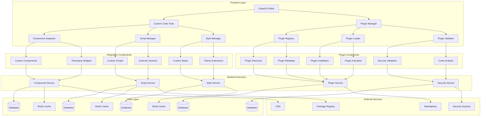

# Custom Code Integration and Extensibility System Design

## Overview

This document outlines the design for implementing a comprehensive custom code integration and extensibility system in the Vue.js Page Builder System. This system will enable developers and advanced users to extend the functionality of the page builder with custom components, plugins, and integrations while maintaining security and performance.

## Architecture

### Custom Code Integration System Architecture



## Core Components

### 1. Custom Code Tools

```typescript
interface CustomCodeTools {
  // Component integration
  registerCustomComponent(config: ComponentConfig): Promise<CustomComponent>
  unregisterCustomComponent(componentId: string): Promise<void>
  getCustomComponents(options?: ComponentQueryOptions): Promise<CustomComponent[]>
  updateCustomComponent(componentId: string, config: ComponentConfig): Promise<CustomComponent>
  
  // Script management
  addCustomScript(script: CustomScript): Promise<CustomScript>
  removeCustomScript(scriptId: string): Promise<void>
  getCustomScripts(options?: ScriptQueryOptions): Promise<CustomScript[]>
  updateCustomScript(scriptId: string, script: CustomScript): Promise<CustomScript>
  
  // Style management
  addCustomStyle(style: CustomStyle): Promise<CustomStyle>
  removeCustomStyle(styleId: string): Promise<void>
  getCustomStyles(options?: StyleQueryOptions): Promise<CustomStyle[]>
  updateCustomStyle(styleId: string, style: CustomStyle): Promise<CustomStyle>
  
  // Code validation
  validateCustomCode(code: string, type: CodeType): Promise<ValidationResult>
  lintCustomCode(code: string, type: CodeType): Promise<LintResult>
  analyzeCustomCode(code: string, type: CodeType): Promise<AnalysisResult>
}

interface ComponentConfig {
  id?: string
  name: string
  description?: string
  category: ComponentCategory
  template: string
  script?: string
  style?: string
  props?: ComponentProp[]
  slots?: ComponentSlot[]
  events?: ComponentEvent[]
  dependencies?: string[]
  version?: string
  author?: string
  license?: string
}

interface CustomComponent {
  id: string
  config: ComponentConfig
  compiledTemplate: string
  compiledScript?: string
  compiledStyle?: string
  dependencies: Dependency[]
  status: ComponentStatus
  createdAt: Date
  updatedAt: Date
  createdBy: string
}

type ComponentCategory = 
  'layout' | 'navigation' | 'media' | 'forms' | 
  'interactive' | 'ecommerce' | 'social' | 'utilities'

interface ComponentProp {
  name: string
  type: PropType
  required?: boolean
  default?: any
  validator?: string
}

type PropType = 'string' | 'number' | 'boolean' | 'array' | 'object' | 'function' | 'custom'

interface ComponentSlot {
  name: string
  description?: string
  props?: ComponentProp[]
}

interface ComponentEvent {
  name: string
  description?: string
  payload?: any
}

interface Dependency {
  name: string
  version: string
  type: DependencyType
}

type DependencyType = 'npm' | 'cdn' | 'local'

type ComponentStatus = 'active' | 'inactive' | 'deprecated' | 'error'

interface CustomScript {
  id: string
  name: string
  description?: string
  code: string
  type: ScriptType
  placement: ScriptPlacement
  dependencies?: string[]
  status: ScriptStatus
  createdAt: Date
  updatedAt: Date
  createdBy: string
}

type ScriptType = 'javascript' | 'typescript' | 'external'

type ScriptPlacement = 'head' | 'body' | 'footer'

type ScriptStatus = 'active' | 'inactive' | 'error'

interface CustomStyle {
  id: string
  name: string
  description?: string
  code: string
  type: StyleType
  placement: StylePlacement
  media?: string
  status: StyleStatus
  createdAt: Date
  updatedAt: Date
  createdBy: string
}

type StyleType = 'css' | 'scss' | 'sass' | 'less' | 'external'

type StylePlacement = 'head' | 'external'

type StyleStatus = 'active' | 'inactive' | 'error'

type CodeType = 'component' | 'script' | 'style' | 'plugin'

interface ValidationResult {
  isValid: boolean
  errors: ValidationError[]
  warnings: ValidationWarning[]
  info: ValidationInfo[]
}

interface ValidationError {
  line: number
  column: number
  message: string
  code: string
  severity: 'error'
}

interface ValidationWarning {
  line: number
  column: number
  message: string
  code: string
  severity: 'warning'
}

interface ValidationInfo {
  line: number
  column: number
  message: string
  code: string
  severity: 'info'
}

interface LintResult {
  isValid: boolean
  issues: LintIssue[]
  fixedCode?: string
}

interface LintIssue {
  line: number
  column: number
  message: string
  severity: 'error' | 'warning' | 'info'
  ruleId?: string
  fix?: {
    range: [number, number]
    text: string
  }
}

interface AnalysisResult {
  complexity: number
  maintainability: number
  securityIssues: SecurityIssue[]
  performanceIssues: PerformanceIssue[]
  dependencies: DependencyAnalysis[]
}

interface SecurityIssue {
  severity: 'low' | 'medium' | 'high' | 'critical'
  message: string
  line?: number
  column?: number
  remediation?: string
}

interface PerformanceIssue {
  type: 'memory' | 'cpu' | 'network' | 'rendering'
  message: string
  severity: 'low' | 'medium' | 'high'
  line?: number
  column?: number
  recommendation?: string
}

interface DependencyAnalysis {
  name: string
  version: string
  vulnerabilities: Vulnerability[]
  size: number
  license: string
}

interface Vulnerability {
  id: string
  title: string
  description: string
  severity: 'low' | 'medium' | 'high' | 'critical'
  cvssScore: number
  patchedVersions: string[]
  vulnerableVersions: string[]
}

interface ComponentQueryOptions {
  category?: ComponentCategory
  status?: ComponentStatus
  limit?: number
  offset?: number
  sortBy?: 'createdAt' | 'updatedAt' | 'name'
  sortOrder?: 'asc' | 'desc'
  search?: string
}

interface ScriptQueryOptions {
  type?: ScriptType
  status?: ScriptStatus
  limit?: number
  offset?: number
  sortBy?: 'createdAt' | 'updatedAt' | 'name'
  sortOrder?: 'asc' | 'desc'
  search?: string
}

interface StyleQueryOptions {
  type?: StyleType
  status?: StyleStatus
  limit?: number
  offset?: number
  sortBy?: 'createdAt' | 'updatedAt' | 'name'
  sortOrder?: 'asc' | 'desc'
  search?: string
}
```

### 2. Plugin Manager

```typescript
interface PluginManager {
  // Plugin registry
  registerPlugin(plugin: Plugin): Promise<PluginRegistration>
  unregisterPlugin(pluginId: string): Promise<void>
  getPlugins(options?: PluginQueryOptions): Promise<Plugin[]>
  getPlugin(pluginId: string): Promise<Plugin>
  updatePlugin(pluginId: string, plugin: Plugin): Promise<Plugin>
  
  // Plugin loading
  installPlugin(pluginId: string, options?: InstallOptions): Promise<PluginInstallation>
  uninstallPlugin(pluginId: string): Promise<void>
  activatePlugin(pluginId: string): Promise<void>
  deactivatePlugin(pluginId: string): Promise<void>
  loadPlugin(pluginId: string): Promise<LoadedPlugin>
  
  // Plugin discovery
  discoverPlugins(options?: DiscoveryOptions): Promise<DiscoveredPlugin[]>
  searchPlugins(query: string, options?: SearchOptions): Promise<DiscoveredPlugin[]>
  
  // Plugin validation
  validatePlugin(pluginId: string): Promise<PluginValidationResult>
  scanPluginSecurity(pluginId: string): Promise<SecurityScanResult>
  analyzePluginPerformance(pluginId: string): Promise<PerformanceAnalysis>
}

interface Plugin {
  id: string
  name: string
  description?: string
  version: string
  author: string
  license?: string
  homepage?: string
  repository?: string
  keywords?: string[]
  dependencies?: Record<string, string>
  devDependencies?: Record<string, string>
  peerDependencies?: Record<string, string>
  main?: string
  module?: string
  browser?: string
  scripts?: Record<string, string>
  config?: PluginConfig
  hooks?: PluginHooks
  assets?: PluginAsset[]
  createdAt: Date
  updatedAt: Date
  createdBy: string
}

interface PluginConfig {
  name: string
  description?: string
  version: string
  author: string
  license?: string
  homepage?: string
  repository?: string
  keywords?: string[]
  dependencies?: Record<string, string>
  devDependencies?: Record<string, string>
  peerDependencies?: Record<string, string>
  main?: string
  module?: string
  browser?: string
  scripts?: Record<string, string>
  [key: string]: any
}

interface PluginHooks {
  onInstall?: string
  onUninstall?: string
  onActivate?: string
  onDeactivate?: string
  onPageLoad?: string
  onComponentRender?: string
  onFormSubmit?: string
  [key: string]: string | undefined
}

interface PluginAsset {
  path: string
  type: AssetType
  content?: string
  url?: string
}

type AssetType = 'script' | 'style' | 'image' | 'font' | 'json' | 'other'

interface PluginRegistration {
  id: string
  pluginId: string
  status: RegistrationStatus
  registeredAt: Date
  registryEntry: PluginRegistryEntry
}

type RegistrationStatus = 'registered' | 'pending' | 'rejected'

interface PluginRegistryEntry {
  id: string
  name: string
  version: string
  source: PluginSource
  metadata: PluginMetadata
  registry: string
  verified: boolean
  createdAt: Date
}

type PluginSource = 'local' | 'npm' | 'github' | 'marketplace' | 'custom'

interface PluginMetadata {
  name: string
  version: string
  description?: string
  keywords?: string[]
  homepage?: string
  bugs?: BugInfo
  license?: string
  author?: Person | string
  contributors?: (Person | string)[]
  files?: string[]
  main?: string
  browser?: string
  bin?: Record<string, string> | string
  man?: string | string[]
  directories?: Directories
  repository?: Repository
  scripts?: Record<string, string>
  config?: Record<string, any>
  dependencies?: Record<string, string>
  devDependencies?: Record<string, string>
  peerDependencies?: Record<string, string>
  bundledDependencies?: string[]
  optionalDependencies?: Record<string, string>
  engines?: Record<string, string>
  os?: string[]
  cpu?: string[]
  private?: boolean
  publishConfig?: Record<string, any>
}

interface BugInfo {
  url?: string
  email?: string
}

interface Person {
  name: string
  email?: string
  url?: string
}

interface Directories {
  lib?: string
  bin?: string
  man?: string
  doc?: string
  example?: string
  test?: string
}

interface Repository {
  type: string
  url: string
  directory?: string
}

interface PluginInstallation {
  id: string
  pluginId: string
  status: InstallationStatus
  installedAt: Date
  installedBy: string
  config: InstallationConfig
}

type InstallationStatus = 'installed' | 'pending' | 'failed' | 'removed'

interface InstallationConfig {
  targetDirectory?: string
  environment?: 'development' | 'production'
  dependencies?: boolean
  devDependencies?: boolean
  peerDependencies?: boolean
  [key: string]: any
}

interface LoadedPlugin {
  id: string
  pluginId: string
  status: LoadStatus
  loadedAt: Date
  api?: PluginAPI
  hooks?: PluginHooks
}

type LoadStatus = 'loaded' | 'loading' | 'failed' | 'unloaded'

interface PluginAPI {
  [key: string]: Function
}

interface DiscoveredPlugin {
  id: string
  name: string
  description?: string
  version: string
  author: string
  license?: string
  downloads?: number
  rating?: number
  tags?: string[]
  source: PluginSource
  registryUrl?: string
  homepage?: string
  repository?: string
}

interface PluginQueryOptions {
  status?: 'active' | 'inactive' | 'installed' | 'available'
  limit?: number
  offset?: number
  sortBy?: 'createdAt' | 'updatedAt' | 'name' | 'downloads' | 'rating'
  sortOrder?: 'asc' | 'desc'
  search?: string
  category?: string
  source?: PluginSource
}

interface DiscoveryOptions {
  sources?: PluginSource[]
  categories?: string[]
  limit?: number
  offset?: number
}

interface SearchOptions {
  limit?: number
  offset?: number
  sortBy?: 'relevance' | 'downloads' | 'rating' | 'updated'
  sortOrder?: 'asc' | 'desc'
}

interface PluginValidationResult {
  isValid: boolean
  errors: ValidationError[]
  warnings: ValidationWarning[]
  recommendations: ValidationRecommendation[]
}

interface ValidationRecommendation {
  type: 'security' | 'performance' | 'compatibility' | 'best_practice'
  message: string
  severity: 'low' | 'medium' | 'high'
  remediation?: string
}

interface SecurityScanResult {
  vulnerabilities: Vulnerability[]
  securityScore: number
  recommendations: SecurityRecommendation[]
}

interface SecurityRecommendation {
  type: 'patch' | 'upgrade' | 'replace' | 'remove'
  message: string
  severity: 'low' | 'medium' | 'high' | 'critical'
  remediation: string
}

interface PerformanceAnalysis {
  loadTime: number
  memoryUsage: number
  cpuUsage: number
  networkRequests: number
  recommendations: PerformanceRecommendation[]
}

interface PerformanceRecommendation {
  type: 'optimization' | 'refactoring' | 'dependency'
  message: string
  severity: 'low' | 'medium' | 'high'
  impact: 'low' | 'medium' | 'high'
  remediation: string
}
```

## Implementation Details

### 1. Custom Component Integration

#### Component Registration

```typescript
class ComponentRegistrar {
  private components: Map<string, CustomComponent> = new Map()
  private componentCache: Map<string, CompiledComponent> = new Map()
  
  async registerCustomComponent(config: ComponentConfig): Promise<CustomComponent> {
    // Validate component configuration
    await this.validateComponentConfig(config)
    
    const component: CustomComponent = {
      id: config.id || this.generateId(),
      config,
      compiledTemplate: await this.compileTemplate(config.template),
      compiledScript: config.script ? await this.compileScript(config.script) : undefined,
      compiledStyle: config.style ? await this.compileStyle(config.style) : undefined,
      dependencies: await this.resolveDependencies(config.dependencies || []),
      status: 'active',
      createdAt: new Date(),
      updatedAt: new Date(),
      createdBy: 'current-user' // Would come from auth context
    }
    
    this.components.set(component.id, component)
    
    // Save to backend
    try {
      const response = await fetch('/api/custom-components', {
        method: 'POST',
        headers: {
          'Content-Type': 'application/json',
        },
        body: JSON.stringify(component)
      })
      
      if (!response.ok) {
        throw new Error('Failed to register custom component')
      }
      
      console.log(`Custom component ${config.name} registered successfully`)
      return component
    } catch (error) {
      console.error('Failed to register custom component:', error)
      throw error
    }
  }
  
  async unregisterCustomComponent(componentId: string): Promise<void> {
    const component = this.components.get(componentId)
    if (!component) {
      throw new Error(`Component with ID ${componentId} not found`)
    }
    
    // Remove from cache
    this.componentCache.delete(componentId)
    this.components.delete(componentId)
    
    // Remove from backend
    try {
      const response = await fetch(`/api/custom-components/${componentId}`, {
        method: 'DELETE'
      })
      
      if (!response.ok) {
        throw new Error('Failed to unregister custom component')
      }
      
      console.log(`Custom component ${componentId} unregistered successfully`)
    } catch (error) {
      console.error('Failed to unregister custom component:', error)
      throw error
    }
  }
  
  async getCustomComponents(options?: ComponentQueryOptions): Promise<CustomComponent[]> {
    try {
      const params = new URLSearchParams()
      if (options?.category) params.append('category', options.category)
      if (options?.status) params.append('status', options.status)
      if (options?.limit) params.append('limit', options.limit.toString())
      if (options?.offset) params.append('offset', options.offset.toString())
      if (options?.sortBy) params.append('sortBy', options.sortBy)
      if (options?.sortOrder) params.append('sortOrder', options.sortOrder)
      if (options?.search) params.append('search', options.search)
      
      const response = await fetch(`/api/custom-components?${params.toString()}`)
      if (!response.ok) {
        throw new Error('Failed to fetch custom components')
      }
      
      const components = await response.json()
      
      // Cache components
      components.forEach((comp: CustomComponent) => {
        this.components.set(comp.id, comp)
      })
      
      return components
    } catch (error) {
      console.error('Failed to fetch custom components:', error)
      throw error
    }
  }
  
  async updateCustomComponent(componentId: string, config: ComponentConfig): Promise<CustomComponent> {
    const component = this.components.get(componentId)
    if (!component) {
      throw new Error(`Component with ID ${componentId} not found`)
    }
    
    // Re-compile if template/script/style changed
    const updatedComponent: CustomComponent = {
      ...component,
      config: { ...component.config, ...config },
      compiledTemplate: config.template !== component.config.template ? 
        await this.compileTemplate(config.template) : component.compiledTemplate,
      compiledScript: config.script !== component.config.script ? 
        await this.compileScript(config.script) : component.compiledScript,
      compiledStyle: config.style !== component.config.style ? 
        await this.compileStyle(config.style) : component.compiledStyle,
      dependencies: config.dependencies !== component.config.dependencies ? 
        await this.resolveDependencies(config.dependencies || []) : component.dependencies,
      updatedAt: new Date()
    }
    
    this.components.set(componentId, updatedComponent)
    
    // Update in backend
    try {
      const response = await fetch(`/api/custom-components/${componentId}`, {
        method: 'PUT',
        headers: {
          'Content-Type': 'application/json',
        },
        body: JSON.stringify(updatedComponent)
      })
      
      if (!response.ok) {
        throw new Error('Failed to update custom component')
      }
      
      console.log(`Custom component ${componentId} updated successfully`)
      return updatedComponent
    } catch (error) {
      console.error('Failed to update custom component:', error)
      throw error
    }
  }
  
  private async validateComponentConfig(config: ComponentConfig): Promise<void> {
    if (!config.name || config.name.trim() === '') {
      throw new Error('Component name is required')
    }
    
    if (!config.category) {
      throw new Error('Component category is required')
    }
    
    if (!config.template || config.template.trim() === '') {
      throw new Error('Component template is required')
    }
    
    // Validate template syntax
    await this.validateTemplate(config.template)
    
    // Validate script if provided
    if (config.script) {
      await this.validateScript(config.script)
    }
    
    // Validate style if provided
    if (config.style) {
      await this.validateStyle(config.style)
    }
    
    // Validate props if provided
    if (config.props) {
      await this.validateProps(config.props)
    }
  }
  
  private async compileTemplate(template: string): Promise<string> {
    // In a real implementation, this would use a template compiler
    // For now, we'll just return the template as-is
    console.log('Compiling template:', template)
    return template
  }
  
  private async compileScript(script: string): Promise<string> {
    // In a real implementation, this would use a JavaScript/TypeScript compiler
    // For now, we'll just return the script as-is
    console.log('Compiling script:', script)
    return script
  }
  
  private async compileStyle(style: string): Promise<string> {
    // In a real implementation, this would use a CSS preprocessor
    // For now, we'll just return the style as-is
    console.log('Compiling style:', style)
    return style
  }
  
  private async resolveDependencies(dependencies: string[]): Promise<Dependency[]> {
    // Resolve dependency information
    const resolved: Dependency[] = []
    
    for (const dep of dependencies) {
      // In a real implementation, this would fetch dependency info from a registry
      resolved.push({
        name: dep,
        version: 'latest',
        type: 'npm'
      })
    }
    
    return resolved
  }
  
  private async validateTemplate(template: string): Promise<void> {
    // Validate template syntax
    console.log('Validating template:', template)
    // In a real implementation, this would use a proper template validator
  }
  
  private async validateScript(script: string): Promise<void> {
    // Validate script syntax
    console.log('Validating script:', script)
    // In a real implementation, this would use a JavaScript/TypeScript linter
  }
  
  private async validateStyle(style: string): Promise<void> {
    // Validate style syntax
    console.log('Validating style:', style)
    // In a real implementation, this would use a CSS linter
  }
  
  private async validateProps(props: ComponentProp[]): Promise<void> {
    // Validate prop definitions
    props.forEach(prop => {
      if (!prop.name || prop.name.trim() === '') {
        throw new Error('Prop name is required')
      }
      
      if (!prop.type) {
        throw new Error(`Prop ${prop.name} type is required`)
      }
    })
  }
  
  private generateId(): string {
    return 'comp-' + Math.random().toString(36).substr(2, 9)
  }
}

interface CompiledComponent {
  template: string
  script?: string
  style?: string
}
```

#### Component Integration with GrapeJS

```typescript
class GrapeJSComponentIntegrator {
  private editor: any = null // GrapeJS editor instance
  
  initialize(editor: any): void {
    this.editor = editor
    
    // Register custom component types with GrapeJS
    this.registerComponentTypes()
    
    // Set up event listeners for component interactions
    this.setupEventListeners()
  }
  
  registerCustomComponent(component: CustomComponent): void {
    if (!this.editor) {
      throw new Error('GrapeJS editor not initialized')
    }
    
    // Create GrapeJS component definition
    const grapeComponent = this.createGrapeComponent(component)
    
    // Register with GrapeJS DomComponents
    const domComponents = this.editor.DomComponents
    domComponents.addType(`custom-${component.id}`, grapeComponent)
    
    // Add to Block Manager for drag-and-drop
    const blockManager = this.editor.BlockManager
    blockManager.add(`custom-${component.id}`, {
      label: component.config.name,
      category: this.mapCategoryToGrapeJS(component.config.category),
      content: {
        type: `custom-${component.id}`,
        content: component.compiledTemplate
      },
      attributes: {
        class: 'gjs-block-fragment'
      }
    })
    
    console.log(`Registered custom component ${component.config.name} with GrapeJS`)
  }
  
  unregisterCustomComponent(componentId: string): void {
    if (!this.editor) return
    
    // Remove from Block Manager
    const blockManager = this.editor.BlockManager
    blockManager.remove(`custom-${componentId}`)
    
    console.log(`Unregistered custom component ${componentId} from GrapeJS`)
  }
  
  private createGrapeComponent(component: CustomComponent): any {
    return {
      // Extend default component
      extend: 'default',
      
      // Component model
      model: {
        // Default properties
        defaults: {
          tagName: 'div',
          draggable: true,
          droppable: true,
          ...this.extractDefaultProps(component)
        },
        
        // Initialize component
        init() {
          this.listenTo(this, 'change:customProps', this.handlePropChange)
        },
        
        // Handle property changes
        handlePropChange() {
          // Update component based on prop changes
          this.updateComponent()
        },
        
        // Update component rendering
        updateComponent() {
          // Apply compiled template with current props
          const props = this.get('customProps') || {}
          const renderedTemplate = this.renderTemplate(component.compiledTemplate, props)
          this.set('content', renderedTemplate)
        },
        
        // Render template with props
        renderTemplate(template: string, props: Record<string, any>): string {
          // Simple template rendering - in a real implementation, this would be more robust
          let rendered = template
          Object.entries(props).forEach(([key, value]) => {
            const regex = new RegExp(`{{\\s*${key}\\s*}}`, 'g')
            rendered = rendered.replace(regex, String(value))
          })
          return rendered
        }
      },
      
      // Component view
      view: {
        // Initialize view
        init() {
          // Set up event listeners
          this.listenTo(this.model, 'change:customProps', this.rerender)
        },
        
        // Render component
        render() {
          const props = this.model.get('customProps') || {}
          const renderedTemplate = this.model.renderTemplate(component.compiledTemplate, props)
          this.el.innerHTML = renderedTemplate
          return this
        },
        
        // Re-render component
        rerender() {
          this.render()
        }
      }
    }
  }
  
  private extractDefaultProps(component: CustomComponent): Record<string, any> {
    const defaultProps: Record<string, any> = {
      customProps: {}
    }
    
    // Extract default values from props
    if (component.config.props) {
      component.config.props.forEach(prop => {
        if (prop.default !== undefined) {
          defaultProps.customProps[prop.name] = prop.default
        }
      })
    }
    
    return defaultProps
  }
  
  private registerComponentTypes(): void {
    if (!this.editor) return
    
    // Register base custom component type
    const domComponents = this.editor.DomComponents
    domComponents.addType('custom-component', {
      isComponent: (el: HTMLElement) => {
        // Check if element is a custom component
        return el.classList.contains('custom-component')
      },
      
      model: {
        defaults: {
          tagName: 'div',
          draggable: true,
          droppable: true,
          traits: [
            {
              type: 'text',
              name: 'id',
              label: 'ID'
            }
          ]
        }
      },
      
      view: {
        // Base view implementation
      }
    })
  }
  
  private setupEventListeners(): void {
    if (!this.editor) return
    
    // Listen for component selection
    this.editor.on('component:selected', (component: any) => {
      // Handle component selection
      console.log('Component selected:', component)
    })
    
    // Listen for component updates
    this.editor.on('component:update', (component: any) => {
      // Handle component updates
      console.log('Component updated:', component)
    })
  }
  
  private mapCategoryToGrapeJS(category: ComponentCategory): string {
    const categoryMap: Record<ComponentCategory, string> = {
      'layout': 'Layout',
      'navigation': 'Navigation',
      'media': 'Media',
      'forms': 'Forms',
      'interactive': 'Interactive',
      'ecommerce': 'E-commerce',
      'social': 'Social',
      'utilities': 'Utilities'
    }
    
    return categoryMap[category] || 'Custom'
  }
}
```

### 2. Script and Style Management

#### Script Manager

```typescript
class ScriptManager {
  private scripts: Map<string, CustomScript> = new Map()
  
  async addCustomScript(script: CustomScript): Promise<CustomScript> {
    // Validate script
    await this.validateScript(script)
    
    this.scripts.set(script.id, script)
    
    // Save to backend
    try {
      const response = await fetch('/api/custom-scripts', {
        method: 'POST',
        headers: {
          'Content-Type': 'application/json',
        },
        body: JSON.stringify(script)
      })
      
      if (!response.ok) {
        throw new Error('Failed to add custom script')
      }
      
      console.log(`Custom script ${script.name} added successfully`)
      return script
    } catch (error) {
      console.error('Failed to add custom script:', error)
      throw error
    }
  }
  
  async removeCustomScript(scriptId: string): Promise<void> {
    this.scripts.delete(scriptId)
    
    // Remove from backend
    try {
      const response = await fetch(`/api/custom-scripts/${scriptId}`, {
        method: 'DELETE'
      })
      
      if (!response.ok) {
        throw new Error('Failed to remove custom script')
      }
      
      console.log(`Custom script ${scriptId} removed successfully`)
    } catch (error) {
      console.error('Failed to remove custom script:', error)
      throw error
    }
  }
  
  async getCustomScripts(options?: ScriptQueryOptions): Promise<CustomScript[]> {
    try {
      const params = new URLSearchParams()
      if (options?.type) params.append('type', options.type)
      if (options?.status) params.append('status', options.status)
      if (options?.limit) params.append('limit', options.limit.toString())
      if (options?.offset) params.append('offset', options.offset.toString())
      if (options?.sortBy) params.append('sortBy', options.sortBy)
      if (options?.sortOrder) params.append('sortOrder', options.sortOrder)
      if (options?.search) params.append('search', options.search)
      
      const response = await fetch(`/api/custom-scripts?${params.toString()}`)
      if (!response.ok) {
        throw new Error('Failed to fetch custom scripts')
      }
      
      const scripts = await response.json()
      
      // Cache scripts
      scripts.forEach((script: CustomScript) => {
        this.scripts.set(script.id, script)
      })
      
      return scripts
    } catch (error) {
      console.error('Failed to fetch custom scripts:', error)
      throw error
    }
  }
  
  async updateCustomScript(scriptId: string, script: CustomScript): Promise<CustomScript> {
    const existingScript = this.scripts.get(scriptId)
    if (!existingScript) {
      throw new Error(`Script with ID ${scriptId} not found`)
    }
    
    const updatedScript: CustomScript = {
      ...existingScript,
      ...script,
      updatedAt: new Date()
    }
    
    this.scripts.set(scriptId, updatedScript)
    
    // Update in backend
    try {
      const response = await fetch(`/api/custom-scripts/${scriptId}`, {
        method: 'PUT',
        headers: {
          'Content-Type': 'application/json',
        },
        body: JSON.stringify(updatedScript)
      })
      
      if (!response.ok) {
        throw new Error('Failed to update custom script')
      }
      
      console.log(`Custom script ${scriptId} updated successfully`)
      return updatedScript
    } catch (error) {
      console.error('Failed to update custom script:', error)
      throw error
    }
  }
  
  async injectScript(script: CustomScript): Promise<void> {
    try {
      switch (script.type) {
        case 'javascript':
        case 'typescript':
          await this.injectInlineScript(script)
          break
        case 'external':
          await this.injectExternalScript(script)
          break
        default:
          throw new Error(`Unsupported script type: ${script.type}`)
      }
    } catch (error) {
      console.error('Failed to inject script:', error)
      throw error
    }
  }
  
  private async injectInlineScript(script: CustomScript): Promise<void> {
    const scriptElement = document.createElement('script')
    scriptElement.type = 'text/javascript'
    scriptElement.textContent = script.code
    
    switch (script.placement) {
      case 'head':
        document.head.appendChild(scriptElement)
        break
      case 'body':
        document.body.appendChild(scriptElement)
        break
      case 'footer':
        document.body.appendChild(scriptElement)
        break
      default:
        document.head.appendChild(scriptElement)
    }
    
    console.log(`Injected inline script ${script.name}`)
  }
  
  private async injectExternalScript(script: CustomScript): Promise<void> {
    const scriptElement = document.createElement('script')
    scriptElement.src = script.code // For external scripts, code is the URL
    
    // Wait for script to load
    await new Promise((resolve, reject) => {
      scriptElement.onload = resolve
      scriptElement.onerror = reject
      document.head.appendChild(scriptElement)
    })
    
    console.log(`Injected external script ${script.name}`)
  }
  
  private async validateScript(script: CustomScript): Promise<void> {
    if (!script.name || script.name.trim() === '') {
      throw new Error('Script name is required')
    }
    
    if (!script.code || script.code.trim() === '') {
      throw new Error('Script code is required')
    }
    
    // Validate script syntax based on type
    switch (script.type) {
      case 'javascript':
        await this.validateJavaScript(script.code)
        break
      case 'typescript':
        await this.validateTypeScript(script.code)
        break
      case 'external':
        await this.validateExternalScript(script.code)
        break
    }
  }
  
  private async validateJavaScript(code: string): Promise<void> {
    // Validate JavaScript syntax
    console.log('Validating JavaScript:', code)
    // In a real implementation, this would use a JavaScript linter/parser
  }
  
  private async validateTypeScript(code: string): Promise<void> {
    // Validate TypeScript syntax
    console.log('Validating TypeScript:', code)
    // In a real implementation, this would use a TypeScript compiler/linter
  }
  
  private async validateExternalScript(url: string): Promise<void> {
    // Validate external script URL
    try {
      new URL(url) // This will throw if URL is invalid
    } catch (error) {
      throw new Error('Invalid external script URL')
    }
  }
}
```

#### Style Manager

```typescript
class StyleManager {
  private styles: Map<string, CustomStyle> = new Map()
  
  async addCustomStyle(style: CustomStyle): Promise<CustomStyle> {
    // Validate style
    await this.validateStyle(style)
    
    this.styles.set(style.id, style)
    
    // Save to backend
    try {
      const response = await fetch('/api/custom-styles', {
        method: 'POST',
        headers: {
          'Content-Type': 'application/json',
        },
        body: JSON.stringify(style)
      })
      
      if (!response.ok) {
        throw new Error('Failed to add custom style')
      }
      
      console.log(`Custom style ${style.name} added successfully`)
      return style
    } catch (error) {
      console.error('Failed to add custom style:', error)
      throw error
    }
  }
  
  async removeCustomStyle(styleId: string): Promise<void> {
    this.styles.delete(styleId)
    
    // Remove from backend
    try {
      const response = await fetch(`/api/custom-styles/${styleId}`, {
        method: 'DELETE'
      })
      
      if (!response.ok) {
        throw new Error('Failed to remove custom style')
      }
      
      console.log(`Custom style ${styleId} removed successfully`)
    } catch (error) {
      console.error('Failed to remove custom style:', error)
      throw error
    }
  }
  
  async getCustomStyles(options?: StyleQueryOptions): Promise<CustomStyle[]> {
    try {
      const params = new URLSearchParams()
      if (options?.type) params.append('type', options.type)
      if (options?.status) params.append('status', options.status)
      if (options?.limit) params.append('limit', options.limit.toString())
      if (options?.offset) params.append('offset', options.offset.toString())
      if (options?.sortBy) params.append('sortBy', options.sortBy)
      if (options?.sortOrder) params.append('sortOrder', options.sortOrder)
      if (options?.search) params.append('search', options.search)
      
      const response = await fetch(`/api/custom-styles?${params.toString()}`)
      if (!response.ok) {
        throw new Error('Failed to fetch custom styles')
      }
      
      const styles = await response.json()
      
      // Cache styles
      styles.forEach((style: CustomStyle) => {
        this.styles.set(style.id, style)
      })
      
      return styles
    } catch (error) {
      console.error('Failed to fetch custom styles:', error)
      throw error
    }
  }
  
  async updateCustomStyle(styleId: string, style: CustomStyle): Promise<CustomStyle> {
    const existingStyle = this.styles.get(styleId)
    if (!existingStyle) {
      throw new Error(`Style with ID ${styleId} not found`)
    }
    
    const updatedStyle: CustomStyle = {
      ...existingStyle,
      ...style,
      updatedAt: new Date()
    }
    
    this.styles.set(styleId, updatedStyle)
    
    // Update in backend
    try {
      const response = await fetch(`/api/custom-styles/${styleId}`, {
        method: 'PUT',
        headers: {
          'Content-Type': 'application/json',
        },
        body: JSON.stringify(updatedStyle)
      })
      
      if (!response.ok) {
        throw new Error('Failed to update custom style')
      }
      
      console.log(`Custom style ${styleId} updated successfully`)
      return updatedStyle
    } catch (error) {
      console.error('Failed to update custom style:', error)
      throw error
    }
  }
  
  async applyStyle(style: CustomStyle): Promise<void> {
    try {
      switch (style.type) {
        case 'css':
        case 'scss':
        case 'sass':
        case 'less':
          await this.applyInlineStyle(style)
          break
        case 'external':
          await this.applyExternalStyle(style)
          break
        default:
          throw new Error(`Unsupported style type: ${style.type}`)
      }
    } catch (error) {
      console.error('Failed to apply style:', error)
      throw error
    }
  }
  
  private async applyInlineStyle(style: CustomStyle): Promise<void> {
    const styleElement = document.createElement('style')
    styleElement.textContent = style.code
    styleElement.setAttribute('data-custom-style', style.id)
    
    if (style.media) {
      styleElement.media = style.media
    }
    
    document.head.appendChild(styleElement)
    console.log(`Applied inline style ${style.name}`)
  }
  
  private async applyExternalStyle(style: CustomStyle): Promise<void> {
    const linkElement = document.createElement('link')
    linkElement.rel = 'stylesheet'
    linkElement.href = style.code // For external styles, code is the URL
    linkElement.setAttribute('data-custom-style', style.id)
    
    if (style.media) {
      linkElement.media = style.media
    }
    
    document.head.appendChild(linkElement)
    console.log(`Applied external style ${style.name}`)
  }
  
  private async validateStyle(style: CustomStyle): Promise<void> {
    if (!style.name || style.name.trim() === '') {
      throw new Error('Style name is required')
    }
    
    if (!style.code || style.code.trim() === '') {
      throw new Error('Style code is required')
    }
    
    // Validate style syntax based on type
    switch (style.type) {
      case 'css':
        await this.validateCSS(style.code)
        break
      case 'scss':
        await this.validateSCSS(style.code)
        break
      case 'sass':
        await this.validateSASS(style.code)
        break
      case 'less':
        await this.validateLESS(style.code)
        break
      case 'external':
        await this.validateExternalStyle(style.code)
        break
    }
  }
  
  private async validateCSS(code: string): Promise<void> {
    // Validate CSS syntax
    console.log('Validating CSS:', code)
    // In a real implementation, this would use a CSS linter/parser
  }
  
  private async validateSCSS(code: string): Promise<void> {
    // Validate SCSS syntax
    console.log('Validating SCSS:', code)
    // In a real implementation, this would use a SCSS compiler/linter
  }
  
  private async validateSASS(code: string): Promise<void> {
    // Validate SASS syntax
    console.log('Validating SASS:', code)
    // In a real implementation, this would use a SASS compiler/linter
  }
  
  private async validateLESS(code: string): Promise<void> {
    // Validate LESS syntax
    console.log('Validating LESS:', code)
    // In a real implementation, this would use a LESS compiler/linter
  }
  
  private async validateExternalStyle(url: string): Promise<void> {
    // Validate external style URL
    try {
      new URL(url) // This will throw if URL is invalid
    } catch (error) {
      throw new Error('Invalid external style URL')
    }
  }
}
```

### 3. Plugin Management

#### Plugin Registration and Loading

```typescript
class PluginManager {
  private plugins: Map<string, Plugin> = new Map()
  private installedPlugins: Map<string, PluginInstallation> = new Map()
  private loadedPlugins: Map<string, LoadedPlugin> = new Map()
  private pluginRegistry: Map<string, PluginRegistryEntry> = new Map()
  
  async registerPlugin(plugin: Plugin): Promise<PluginRegistration> {
    // Validate plugin
    await this.validatePlugin(plugin)
    
    this.plugins.set(plugin.id, plugin)
    
    // Create registry entry
    const registryEntry: PluginRegistryEntry = {
      id: this.generateId(),
      name: plugin.name,
      version: plugin.version,
      source: 'local',
      metadata: this.extractPluginMetadata(plugin),
      registry: 'local',
      verified: true,
      createdAt: new Date()
    }
    
    this.pluginRegistry.set(registryEntry.id, registryEntry)
    
    const registration: PluginRegistration = {
      id: this.generateId(),
      pluginId: plugin.id,
      status: 'registered',
      registeredAt: new Date(),
      registryEntry
    }
    
    // Save to backend
    try {
      const response = await fetch('/api/plugins', {
        method: 'POST',
        headers: {
          'Content-Type': 'application/json',
        },
        body: JSON.stringify({ plugin, registration })
      })
      
      if (!response.ok) {
        throw new Error('Failed to register plugin')
      }
      
      console.log(`Plugin ${plugin.name} registered successfully`)
      return registration
    } catch (error) {
      console.error('Failed to register plugin:', error)
      throw error
    }
  }
  
  async unregisterPlugin(pluginId: string): Promise<void> {
    this.plugins.delete(pluginId)
    this.installedPlugins.delete(pluginId)
    this.loadedPlugins.delete(pluginId)
    
    // Remove from backend
    try {
      const response = await fetch(`/api/plugins/${pluginId}`, {
        method: 'DELETE'
      })
      
      if (!response.ok) {
        throw new Error('Failed to unregister plugin')
      }
      
      console.log(`Plugin ${pluginId} unregistered successfully`)
    } catch (error) {
      console.error('Failed to unregister plugin:', error)
      throw error
    }
  }
  
  async getPlugins(options?: PluginQueryOptions): Promise<Plugin[]> {
    try {
      const params = new URLSearchParams()
      if (options?.status) params.append('status', options.status)
      if (options?.limit) params.append('limit', options.limit.toString())
      if (options?.offset) params.append('offset', options.offset.toString())
      if (options?.sortBy) params.append('sortBy', options.sortBy)
      if (options?.sortOrder) params.append('sortOrder', options.sortOrder)
      if (options?.search) params.append('search', options.search)
      if (options?.category) params.append('category', options.category)
      if (options?.source) params.append('source', options.source)
      
      const response = await fetch(`/api/plugins?${params.toString()}`)
      if (!response.ok) {
        throw new Error('Failed to fetch plugins')
      }
      
      const plugins = await response.json()
      
      // Cache plugins
      plugins.forEach((plugin: Plugin) => {
        this.plugins.set(plugin.id, plugin)
      })
      
      return plugins
    } catch (error) {
      console.error('Failed to fetch plugins:', error)
      throw error
    }
  }
  
  async getPlugin(pluginId: string): Promise<Plugin> {
    const plugin = this.plugins.get(pluginId)
    if (plugin) {
      return plugin
    }
    
    // Fetch from backend
    try {
      const response = await fetch(`/api/plugins/${pluginId}`)
      if (!response.ok) {
        throw new Error('Failed to fetch plugin')
      }
      
      const pluginData = await response.json()
      this.plugins.set(pluginId, pluginData)
      return pluginData
    } catch (error) {
      console.error('Failed to fetch plugin:', error)
      throw error
    }
  }
  
  async installPlugin(pluginId: string, options?: InstallOptions): Promise<PluginInstallation> {
    const plugin = await this.getPlugin(pluginId)
    
    const installation: PluginInstallation = {
      id: this.generateId(),
      pluginId,
      status: 'installed',
      installedAt: new Date(),
      installedBy: 'current-user', // Would come from auth context
      config: options || {}
    }
    
    this.installedPlugins.set(pluginId, installation)
    
    // Save to backend
    try {
      const response = await fetch(`/api/plugins/${pluginId}/install`, {
        method: 'POST',
        headers: {
          'Content-Type': 'application/json',
        },
        body: JSON.stringify(installation)
      })
      
      if (!response.ok) {
        throw new Error('Failed to install plugin')
      }
      
      console.log(`Plugin ${plugin.name} installed successfully`)
      return installation
    } catch (error) {
      console.error('Failed to install plugin:', error)
      throw error
    }
  }
  
  async uninstallPlugin(pluginId: string): Promise<void> {
    this.installedPlugins.delete(pluginId)
    this.loadedPlugins.delete(pluginId)
    
    // Remove from backend
    try {
      const response = await fetch(`/api/plugins/${pluginId}/uninstall`, {
        method: 'POST'
      })
      
      if (!response.ok) {
        throw new Error('Failed to uninstall plugin')
      }
      
      console.log(`Plugin ${pluginId} uninstalled successfully`)
    } catch (error) {
      console.error('Failed to uninstall plugin:', error)
      throw error
    }
  }
  
  async activatePlugin(pluginId: string): Promise<void> {
    const installation = this.installedPlugins.get(pluginId)
    if (!installation) {
      throw new Error(`Plugin ${pluginId} is not installed`)
    }
    
    installation.status = 'installed'
    
    // Activate in backend
    try {
      const response = await fetch(`/api/plugins/${pluginId}/activate`, {
        method: 'POST'
      })
      
      if (!response.ok) {
        throw new Error('Failed to activate plugin')
      }
      
      console.log(`Plugin ${pluginId} activated successfully`)
    } catch (error) {
      console.error('Failed to activate plugin:', error)
      throw error
    }
  }
  
  async deactivatePlugin(pluginId: string): Promise<void> {
    const installation = this.installedPlugins.get(pluginId)
    if (!installation) {
      throw new Error(`Plugin ${pluginId} is not installed`)
    }
    
    installation.status = 'installed'
    
    // Deactivate in backend
    try {
      const response = await fetch(`/api/plugins/${pluginId}/deactivate`, {
        method: 'POST'
      })
      
      if (!response.ok) {
        throw new Error('Failed to deactivate plugin')
      }
      
      console.log(`Plugin ${pluginId} deactivated successfully`)
    } catch (error) {
      console.error('Failed to deactivate plugin:', error)
      throw error
    }
  }
  
  async loadPlugin(pluginId: string): Promise<LoadedPlugin> {
    const plugin = await this.getPlugin(pluginId)
    const installation = this.installedPlugins.get(pluginId)
    
    if (!installation) {
      throw new Error(`Plugin ${pluginId} is not installed`)
    }
    
    // Load plugin code
    const pluginAPI = await this.loadPluginCode(plugin)
    
    const loadedPlugin: LoadedPlugin = {
      id: this.generateId(),
      pluginId,
      status: 'loaded',
      loadedAt: new Date(),
      api: pluginAPI
    }
    
    this.loadedPlugins.set(pluginId, loadedPlugin)
    
    console.log(`Plugin ${plugin.name} loaded successfully`)
    return loadedPlugin
  }
  
  private async validatePlugin(plugin: Plugin): Promise<void> {
    if (!plugin.name || plugin.name.trim() === '') {
      throw new Error('Plugin name is required')
    }
    
    if (!plugin.version) {
      throw new Error('Plugin version is required')
    }
    
    if (!plugin.author) {
      throw new Error('Plugin author is required')
    }
    
    // Validate plugin configuration
    await this.validatePluginConfig(plugin.config)
  }
  
  private async validatePluginConfig(config?: PluginConfig): Promise<void> {
    if (!config) return
    
    // Validate required fields
    if (!config.name || config.name.trim() === '') {
      throw new Error('Plugin config name is required')
    }
    
    if (!config.version) {
      throw new Error('Plugin config version is required')
    }
    
    if (!config.author) {
      throw new Error('Plugin config author is required')
    }
  }
  
  private extractPluginMetadata(plugin: Plugin): PluginMetadata {
    return {
      name: plugin.name,
      version: plugin.version,
      description: plugin.description,
      keywords: plugin.keywords,
      homepage: plugin.homepage,
      license: plugin.license,
      author: plugin.author,
      repository: plugin.repository
    }
  }
  
  private async loadPluginCode(plugin: Plugin): Promise<PluginAPI> {
    // In a real implementation, this would load and execute plugin code
    // For now, we'll return a mock API
    console.log(`Loading plugin code for ${plugin.name}`)
    
    return {
      // Mock API methods
      initialize: () => console.log(`Initialized plugin ${plugin.name}`),
      destroy: () => console.log(`Destroyed plugin ${plugin.name}`),
      // Add other plugin-specific methods as needed
    }
  }
  
  private generateId(): string {
    return 'plugin-' + Math.random().toString(36).substr(2, 9)
  }
}

interface InstallOptions {
  targetDirectory?: string
  environment?: 'development' | 'production'
  dependencies?: boolean
  devDependencies?: boolean
  peerDependencies?: boolean
  [key: string]: any
}
```

## Integration with Vue Wrapper Component

### Custom Code Tools Integration

```vue
<script setup lang="ts">
import { ref, computed, onMounted, watch } from 'vue'
import { useCustomCode } from '@/composables/useCustomCode'
import type { 
  CustomComponent, 
  CustomScript, 
  CustomStyle, 
  Plugin,
  ComponentConfig,
  ValidationResult
} from '@/types/custom-code'

const { 
  registerCustomComponent,
  unregisterCustomComponent,
  getCustomComponents,
  updateCustomComponent,
  addCustomScript,
  removeCustomScript,
  getCustomScripts,
  updateCustomScript,
  addCustomStyle,
  removeCustomStyle,
  getCustomStyles,
  updateCustomStyle,
  validateCustomCode,
  lintCustomCode,
  analyzeCustomCode,
  registerPlugin,
  unregisterPlugin,
  getPlugins,
  getPlugin,
  installPlugin,
  uninstallPlugin,
  activatePlugin,
  deactivatePlugin,
  loadPlugin
} = useCustomCode()

const selectedPageId = ref<string | null>(null)
const customComponents = ref<CustomComponent[]>([])
const customScripts = ref<CustomScript[]>([])
const customStyles = ref<CustomStyle[]>([])
const plugins = ref<Plugin[]>([])
const showCustomCodePanel = ref(true)
const activeTab = ref<'components' | 'scripts' | 'styles' | 'plugins'>('components')

// Form models
const newComponentConfig = ref<ComponentConfig>({
  name: '',
  description: '',
  category: 'utilities',
  template: '',
  script: '',
  style: '',
  props: [],
  slots: [],
  events: [],
  dependencies: [],
  version: '1.0.0',
  author: '',
  license: ''
})

const newScript = ref<Omit<CustomScript, 'id' | 'createdAt' | 'updatedAt' | 'createdBy'>>({
  name: '',
  description: '',
  code: '',
  type: 'javascript',
  placement: 'head',
  dependencies: [],
  status: 'active'
})

const newStyle = ref<Omit<CustomStyle, 'id' | 'createdAt' | 'updatedAt' | 'createdBy'>>({
  name: '',
  description: '',
  code: '',
  type: 'css',
  placement: 'head',
  media: '',
  status: 'active'
})

// Computed properties
const componentCategories = computed(() => {
  return [
    { value: 'layout', label: 'Layout' },
    { value: 'navigation', label: 'Navigation' },
    { value: 'media', label: 'Media' },
    { value: 'forms', label: 'Forms' },
    { value: 'interactive', label: 'Interactive' },
    { value: 'ecommerce', label: 'E-commerce' },
    { value: 'social', label: 'Social' },
    { value: 'utilities', label: 'Utilities' }
  ]
})

const scriptTypes = computed(() => {
  return [
    { value: 'javascript', label: 'JavaScript' },
    { value: 'typescript', label: 'TypeScript' },
    { value: 'external', label: 'External' }
  ]
})

const styleTypes = computed(() => {
  return [
    { value: 'css', label: 'CSS' },
    { value: 'scss', label: 'SCSS' },
    { value: 'sass', label: 'SASS' },
    { value: 'less', label: 'LESS' },
    { value: 'external', label: 'External' }
  ]
})

const scriptPlacements = computed(() => {
  return [
    { value: 'head', label: 'Head' },
    { value: 'body', label: 'Body' },
    { value: 'footer', label: 'Footer' }
  ]
})

const stylePlacements = computed(() => {
  return [
    { value: 'head', label: 'Head' },
    { value: 'external', label: 'External' }
  ]
})

// Lifecycle
onMounted(() => {
  loadCustomComponents()
  loadCustomScripts()
  loadCustomStyles()
  loadPlugins()
})

// Methods
const loadCustomComponents = async () => {
  try {
    customComponents.value = await getCustomComponents()
  } catch (error) {
    console.error('Failed to load custom components:', error)
  }
}

const loadCustomScripts = async () => {
  try {
    customScripts.value = await getCustomScripts()
  } catch (error) {
    console.error('Failed to load custom scripts:', error)
  }
}

const loadCustomStyles = async () => {
  try {
    customStyles.value = await getCustomStyles()
  } catch (error) {
    console.error('Failed to load custom styles:', error)
  }
}

const loadPlugins = async () => {
  try {
    plugins.value = await getPlugins()
  } catch (error) {
    console.error('Failed to load plugins:', error)
  }
}

const createNewComponent = async () => {
  if (!newComponentConfig.value.name) {
    alert('Component name is required')
    return
  }
  
  try {
    const component = await registerCustomComponent(newComponentConfig.value)
    customComponents.value.push(component)
    resetComponentForm()
    alert('Custom component created successfully!')
  } catch (error) {
    console.error('Failed to create custom component:', error)
    alert('Failed to create custom component')
  }
}

const updateSelectedComponent = async (componentId: string, config: ComponentConfig) => {
  try {
    const component = await updateCustomComponent(componentId, config)
    
    // Update in components list
    const index = customComponents.value.findIndex(c => c.id === componentId)
    if (index !== -1) {
      customComponents.value[index] = component
    }
    
    alert('Custom component updated successfully!')
  } catch (error) {
    console.error('Failed to update custom component:', error)
    alert('Failed to update custom component')
  }
}

const removeCustomComponent = async (componentId: string) => {
  if (!confirm('Are you sure you want to remove this custom component?')) return
  
  try {
    await unregisterCustomComponent(componentId)
    
    // Remove from components list
    customComponents.value = customComponents.value.filter(c => c.id !== componentId)
    
    alert('Custom component removed successfully!')
  } catch (error) {
    console.error('Failed to remove custom component:', error)
    alert('Failed to remove custom component')
  }
}

const createNewScript = async () => {
  if (!newScript.value.name || !newScript.value.code) {
    alert('Script name and code are required')
    return
  }
  
  try {
    const script = await addCustomScript({
      ...newScript.value,
      id: this.generateId(),
      createdAt: new Date(),
      updatedAt: new Date(),
      createdBy: 'current-user'
    })
    
    customScripts.value.push(script)
    resetScriptForm()
    alert('Custom script added successfully!')
  } catch (error) {
    console.error('Failed to add custom script:', error)
    alert('Failed to add custom script')
  }
}

const updateSelectedScript = async (scriptId: string, script: CustomScript) => {
  try {
    const updated = await updateCustomScript(scriptId, script)
    
    // Update in scripts list
    const index = customScripts.value.findIndex(s => s.id === scriptId)
    if (index !== -1) {
      customScripts.value[index] = updated
    }
    
    alert('Custom script updated successfully!')
  } catch (error) {
    console.error('Failed to update custom script:', error)
    alert('Failed to update custom script')
  }
}

const removeCustomScript = async (scriptId: string) => {
  if (!confirm('Are you sure you want to remove this custom script?')) return
  
  try {
    await removeCustomScript(scriptId)
    
    // Remove from scripts list
    customScripts.value = customScripts.value.filter(s => s.id !== scriptId)
    
    alert('Custom script removed successfully!')
  } catch (error) {
    console.error('Failed to remove custom script:', error)
    alert('Failed to remove custom script')
  }
}

const createNewStyle = async () => {
  if (!newStyle.value.name || !newStyle.value.code) {
    alert('Style name and code are required')
    return
  }
  
  try {
    const style = await addCustomStyle({
      ...newStyle.value,
      id: this.generateId(),
      createdAt: new Date(),
      updatedAt: new Date(),
      createdBy: 'current-user'
    })
    
    customStyles.value.push(style)
    resetStyleForm()
    alert('Custom style added successfully!')
  } catch (error) {
    console.error('Failed to add custom style:', error)
    alert('Failed to add custom style')
  }
}

const updateSelectedStyle = async (styleId: string, style: CustomStyle) => {
  try {
    const updated = await updateCustomStyle(styleId, style)
    
    // Update in styles list
    const index = customStyles.value.findIndex(s => s.id === styleId)
    if (index !== -1) {
      customStyles.value[index] = updated
    }
    
    alert('Custom style updated successfully!')
  } catch (error) {
    console.error('Failed to update custom style:', error)
    alert('Failed to update custom style')
  }
}

const removeCustomStyle = async (styleId: string) => {
  if (!confirm('Are you sure you want to remove this custom style?')) return
  
  try {
    await removeCustomStyle(styleId)
    
    // Remove from styles list
    customStyles.value = customStyles.value.filter(s => s.id !== styleId)
    
    alert('Custom style removed successfully!')
  } catch (error) {
    console.error('Failed to remove custom style:', error)
    alert('Failed to remove custom style')
  }
}

const validateCode = async (code: string, type: 'component' | 'script' | 'style') => {
  try {
    const result = await validateCustomCode(code, type)
    if (result.isValid) {
      alert('Code is valid!')
    } else {
      alert(`Code has ${result.errors.length} errors and ${result.warnings.length} warnings`)
    }
    return result
  } catch (error) {
    console.error('Failed to validate code:', error)
    alert('Failed to validate code')
  }
}

const lintCode = async (code: string, type: 'component' | 'script' | 'style') => {
  try {
    const result = await lintCustomCode(code, type)
    if (result.isValid) {
      alert('Code is clean!')
    } else {
      alert(`Code has ${result.issues.length} issues`)
    }
    return result
  } catch (error) {
    console.error('Failed to lint code:', error)
    alert('Failed to lint code')
  }
}

const analyzeCode = async (code: string, type: 'component' | 'script' | 'style') => {
  try {
    const result = await analyzeCustomCode(code, type)
    alert(`Code analysis complete. Complexity: ${result.complexity}, Maintainability: ${result.maintainability}`)
    return result
  } catch (error) {
    console.error('Failed to analyze code:', error)
    alert('Failed to analyze code')
  }
}

const installSelectedPlugin = async (pluginId: string) => {
  try {
    const installation = await installPlugin(pluginId)
    alert('Plugin installed successfully!')
    
    // Refresh plugins list
    await loadPlugins()
    return installation
  } catch (error) {
    console.error('Failed to install plugin:', error)
    alert('Failed to install plugin')
  }
}

const uninstallSelectedPlugin = async (pluginId: string) => {
  if (!confirm('Are you sure you want to uninstall this plugin?')) return
  
  try {
    await uninstallPlugin(pluginId)
    alert('Plugin uninstalled successfully!')
    
    // Refresh plugins list
    await loadPlugins()
  } catch (error) {
    console.error('Failed to uninstall plugin:', error)
    alert('Failed to uninstall plugin')
  }
}

const activateSelectedPlugin = async (pluginId: string) => {
  try {
    await activatePlugin(pluginId)
    alert('Plugin activated successfully!')
    
    // Refresh plugins list
    await loadPlugins()
  } catch (error) {
    console.error('Failed to activate plugin:', error)
    alert('Failed to activate plugin')
  }
}

const deactivateSelectedPlugin = async (pluginId: string) => {
  try {
    await deactivatePlugin(pluginId)
    alert('Plugin deactivated successfully!')
    
    // Refresh plugins list
    await loadPlugins()
  } catch (error) {
    console.error('Failed to deactivate plugin:', error)
    alert('Failed to deactivate plugin')
  }
}

const loadSelectedPlugin = async (pluginId: string) => {
  try {
    const loaded = await loadPlugin(pluginId)
    alert('Plugin loaded successfully!')
    return loaded
  } catch (error) {
    console.error('Failed to load plugin:', error)
    alert('Failed to load plugin')
  }
}

const resetComponentForm = () => {
  newComponentConfig.value = {
    name: '',
    description: '',
    category: 'utilities',
    template: '',
    script: '',
    style: '',
    props: [],
    slots: [],
    events: [],
    dependencies: [],
    version: '1.0.0',
    author: '',
    license: ''
  }
}

const resetScriptForm = () => {
  newScript.value = {
    name: '',
    description: '',
    code: '',
    type: 'javascript',
    placement: 'head',
    dependencies: [],
    status: 'active'
  }
}

const resetStyleForm = () => {
  newStyle.value = {
    name: '',
    description: '',
    code: '',
    type: 'css',
    placement: 'head',
    media: '',
    status: 'active'
  }
}

private generateId(): string {
  return 'custom-' + Math.random().toString(36).substr(2, 9)
}
</script>
```

## Performance Optimization

### 1. Component Caching

```typescript
class ComponentCache {
  private cache: Map<string, { component: CustomComponent; timestamp: number }> = new Map()
  private cacheTimeout = 10 * 60 * 1000 // 10 minutes
  
  get(componentId: string): CustomComponent | null {
    const cached = this.cache.get(componentId)
    if (cached && (Date.now() - cached.timestamp) < this.cacheTimeout) {
      return cached.component
    }
    
    return null
  }
  
  set(componentId: string, component: CustomComponent): void {
    this.cache.set(componentId, {
      component,
      timestamp: Date.now()
    })
  }
  
  clear(componentId: string): void {
    this.cache.delete(componentId)
  }
  
  clearExpired(): void {
    const now = Date.now()
    for (const [key, value] of this.cache.entries()) {
      if ((now - value.timestamp) >= this.cacheTimeout) {
        this.cache.delete(key)
      }
    }
  }
  
  clearAll(): void {
    this.cache.clear()
  }
}
```

### 2. Script and Style Batching

```typescript
class CodeBatchProcessor {
  private pendingScripts: CustomScript[] = []
  private pendingStyles: CustomStyle[] = []
  private batchTimer: number | null = null
  private batchSize = 5
  
  queueScript(script: CustomScript): void {
    this.pendingScripts.push(script)
    
    if (this.pendingScripts.length >= this.batchSize) {
      this.processScriptBatch()
    } else if (!this.batchTimer) {
      this.batchTimer = setTimeout(() => {
        this.processScriptBatch()
      }, 1000) // Process batch after 1 second of inactivity
    }
  }
  
  queueStyle(style: CustomStyle): void {
    this.pendingStyles.push(style)
    
    if (this.pendingStyles.length >= this.batchSize) {
      this.processStyleBatch()
    } else if (!this.batchTimer) {
      this.batchTimer = setTimeout(() => {
        this.processStyleBatch()
      }, 1000) // Process batch after 1 second of inactivity
    }
  }
  
  private async processScriptBatch(): Promise<void> {
    if (this.batchTimer) {
      clearTimeout(this.batchTimer)
      this.batchTimer = null
    }
    
    if (this.pendingScripts.length === 0) return
    
    try {
      const response = await fetch('/api/custom-scripts/batch', {
        method: 'POST',
        headers: {
          'Content-Type': 'application/json',
        },
        body: JSON.stringify({ scripts: this.pendingScripts })
      })
      
      if (!response.ok) {
        throw new Error('Failed to process script batch')
      }
      
      // Clear processed scripts
      this.pendingScripts = []
    } catch (error) {
      console.error('Failed to process script batch:', error)
      // In a real implementation, we might want to retry or queue failed batches
    }
  }
  
  private async processStyleBatch(): Promise<void> {
    if (this.batchTimer) {
      clearTimeout(this.batchTimer)
      this.batchTimer = null
    }
    
    if (this.pendingStyles.length === 0) return
    
    try {
      const response = await fetch('/api/custom-styles/batch', {
        method: 'POST',
        headers: {
          'Content-Type': 'application/json',
        },
        body: JSON.stringify({ styles: this.pendingStyles })
      })
      
      if (!response.ok) {
        throw new Error('Failed to process style batch')
      }
      
      // Clear processed styles
      this.pendingStyles = []
    } catch (error) {
      console.error('Failed to process style batch:', error)
      // In a real implementation, we might want to retry or queue failed batches
    }
  }
}
```

## Error Handling and Recovery

### 1. Custom Code Error Handling

```typescript
class CustomCodeErrorHandler {
  handleComponentRegistrationError(error: Error, config: ComponentConfig): void {
    console.error(`Failed to register component ${config.name}:`, error)
    
    // Show user-friendly error message
    // Suggest validation or alternative configurations
  }
  
  handleScriptInjectionError(error: Error, script: CustomScript): void {
    console.error(`Failed to inject script ${script.name}:`, error)
    
    // Show error and suggest recovery actions
    // Possibly roll back script injection
  }
  
  handleStyleApplicationError(error: Error, style: CustomStyle): void {
    console.error(`Failed to apply style ${style.name}:`, error)
    
    // Show error and suggest recovery actions
    // Possibly roll back style application
  }
  
  handlePluginInstallationError(error: Error, pluginId: string): void {
    console.error(`Failed to install plugin ${pluginId}:`, error)
    
    // Show error and suggest alternative installation methods
  }
  
  handlePluginLoadingError(error: Error, pluginId: string): void {
    console.error(`Failed to load plugin ${pluginId}:`, error)
    
    // Show error and suggest recovery actions
    // Possibly unload the plugin
  }
}
```

### 2. Code Validation Error Handling

```typescript
class CodeValidationErrorHandler {
  handleSyntaxValidationError(error: Error, code: string, type: CodeType): void {
    console.error(`Syntax validation failed for ${type}:`, error)
    
    // Show detailed error information to user
    // Highlight problematic lines in code editor
  }
  
  handleLintingError(error: Error, code: string, type: CodeType): void {
    console.error(`Linting failed for ${type}:`, error)
    
    // Show linting error and suggest fixes
  }
  
  handleAnalysisError(error: Error, code: string, type: CodeType): void {
    console.error(`Analysis failed for ${type}:`, error)
    
    // Show analysis error and provide basic feedback
  }
  
  handleSecurityScanError(error: Error, code: string, type: CodeType): void {
    console.error(`Security scan failed for ${type}:`, error)
    
    // Show security warning and recommend manual review
  }
}
```

## Testing Strategy

### Unit Tests

1. Component registration and management
2. Script injection and management
3. Style application and management
4. Plugin registration and loading
5. Code validation and linting
6. Code analysis and performance evaluation
7. Security scanning and vulnerability detection
8. Error handling and recovery mechanisms

### Integration Tests

1. Custom code tools with GrapeJS integration
2. Script and style injection with page rendering
3. Plugin installation and activation workflows
4. Component integration with GrapeJS components
5. Code validation with real-world code samples
6. Performance testing with complex custom components
7. Security scanning with known vulnerable code patterns
8. Error recovery with failing custom code

### End-to-End Tests

1. Complete custom code workflow from creation to deployment
2. Plugin marketplace discovery and installation
3. Component integration with existing page builder components
4. Script and style optimization for performance
5. Security hardening with code scanning
6. Error recovery scenarios with broken custom code
7. Performance benchmarking with custom components
8. Compatibility testing with different browsers and devices

## Implementation Plan

### Phase 1: Core Infrastructure
- Implement component registration system
- Create script and style management
- Set up plugin registry and loading
- Implement basic code validation

### Phase 2: Integration Features
- Integrate custom components with GrapeJS
- Add script and style injection capabilities
- Implement plugin installation and activation
- Add advanced code validation and linting

### Phase 3: Vue Integration
- Integrate custom code tools with Vue wrapper
- Add plugin management interface
- Implement code editor with syntax highlighting
- Add validation and analysis results display

### Phase 4: Performance Optimization
- Add component caching
- Implement script and style batching
- Optimize plugin loading and execution
- Add lazy loading for custom components

### Phase 5: Error Handling and Testing
- Implement comprehensive error handling
- Add recovery mechanisms
- Create unit tests
- Add integration tests

### Phase 6: Advanced Features
- Add advanced code analysis
- Implement predictive performance optimization
- Add collaborative code editing features
- Add custom code marketplace integration

## Dependencies

- `grapesjs` - Core page builder engine
- `vue` - Vue.js framework
- `pinia` - State management
- `monaco-editor` - Code editor with syntax highlighting
- `eslint` - JavaScript/TypeScript linter
- `stylelint` - CSS/SCSS/SASS/LESS linter
- `webpack` - Module bundler for plugin loading
- `babel` - JavaScript transpiler for older browser support

## Security Considerations

- Validate all custom code before execution
- Implement proper access controls for custom code management
- Sanitize custom component templates and scripts
- Encrypt sensitive custom code configurations
- Implement rate limiting for code registration operations
- Validate user permissions for plugin installation
- Protect against XSS in custom components and scripts
- Implement proper authentication for plugin APIs
- Scan custom code for known vulnerabilities
- Implement sandboxing for unsafe custom code execution