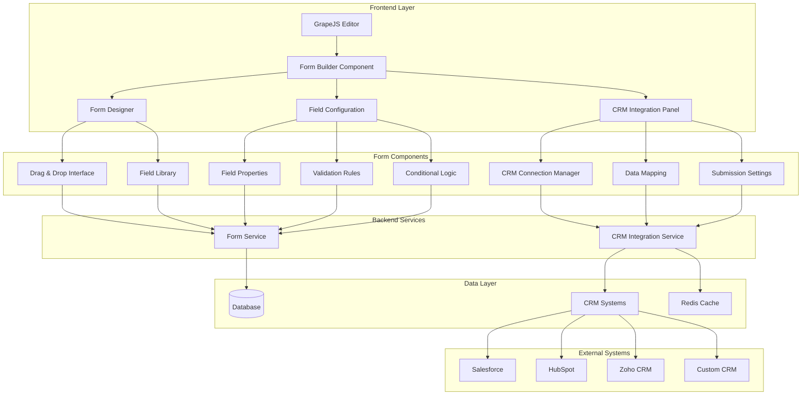

# Form Builder with CRM Connectivity Design

## Overview

This document outlines the design for implementing a form builder with CRM connectivity in the Vue.js Page Builder System. This feature will enable marketing administrators to create sophisticated forms that automatically integrate with CRM systems for lead capture, customer management, and data synchronization.

## Architecture

### Form Builder System Architecture



## Core Components

### 1. Form Builder Component

```typescript
interface FormBuilder {
  // Form management
  createForm(config: FormConfig): Promise<Form>
  updateForm(formId: string, config: FormConfig): Promise<Form>
  deleteForm(formId: string): Promise<void>
  getForm(formId: string): Promise<Form>
  
  // Field management
  addField(formId: string, field: FormField): Promise<FormField>
  updateField(formId: string, fieldId: string, field: FormField): Promise<FormField>
  removeField(formId: string, fieldId: string): Promise<void>
  reorderFields(formId: string, fieldOrder: string[]): Promise<void>
  
  // Validation
  addValidationRule(formId: string, fieldId: string, rule: ValidationRule): Promise<ValidationRule>
  removeValidationRule(formId: string, ruleId: string): Promise<void>
  
  // Conditional logic
  addConditionalLogic(formId: string, logic: ConditionalLogic): Promise<ConditionalLogic>
  removeConditionalLogic(formId: string, logicId: string): Promise<void>
  
  // CRM integration
  connectCRM(formId: string, crmConfig: CRMConfig): Promise<void>
  disconnectCRM(formId: string): Promise<void>
  mapFields(formId: string, mapping: FieldMapping): Promise<void>
}

interface FormConfig {
  id?: string
  name: string
  description?: string
  submitButtonText: string
  successMessage: string
 errorMessage: string
 redirectUrl?: string
  theme: FormTheme
  layout: FormLayout
}

interface Form {
  id: string
  config: FormConfig
  fields: FormField[]
  validationRules: ValidationRule[]
  conditionalLogic: ConditionalLogic[]
  crmIntegration?: CRMIntegration
  createdAt: Date
  updatedAt: Date
}

interface FormField {
  id: string
  type: FieldType
  label: string
  placeholder?: string
  required: boolean
  defaultValue?: any
  options?: FieldOption[]
  validation?: FieldValidation
  conditionalLogicId?: string
  styling?: FieldStyling
}

type FieldType = 
  'text' | 'email' | 'password' | 'textarea' | 'select' | 'checkbox' | 'radio' | 
  'date' | 'number' | 'phone' | 'url' | 'file' | 'hidden' | 'rating' | 'signature'

interface FieldOption {
  value: string
  label: string
  selected?: boolean
}

interface FieldValidation {
  minLength?: number
  maxLength?: number
  pattern?: string
  customValidation?: string
}

interface ValidationRule {
  id: string
  fieldId: string
  type: ValidationType
  config: any
  errorMessage: string
}

type ValidationType = 
  'required' | 'email' | 'minLength' | 'maxLength' | 'pattern' | 'custom'

interface ConditionalLogic {
  id: string
  name: string
 conditions: Condition[]
  actions: Action[]
}

interface Condition {
  fieldId: string
  operator: 'equals' | 'notEquals' | 'contains' | 'greaterThan' | 'lessThan'
  value: any
}

interface Action {
  type: 'show' | 'hide' | 'enable' | 'disable' | 'setValue'
  targetFieldId: string
  value?: any
}

interface CRMIntegration {
  crmType: CRMType
  connectionId: string
  fieldMapping: FieldMapping[]
  submissionSettings: SubmissionSettings
}

type CRMType = 'salesforce' | 'hubspot' | 'zoho' | 'custom'

interface FieldMapping {
  formFieldId: string
  crmFieldId: string
  crmFieldName: string
  transform?: (value: any) => any
}

interface SubmissionSettings {
  createNewRecord: boolean
  updateExistingRecord: boolean
  deduplicationField?: string
  tags?: string[]
  assignTo?: string
}
```

### 2. CRM Connection Manager

```typescript
interface CRMConnectionManager {
  // Connection management
  connectCRM(crmType: CRMType, credentials: CRMCredentials): Promise<CRMConnection>
  disconnectCRM(connectionId: string): Promise<void>
  getConnections(): Promise<CRMConnection[]>
  getConnection(connectionId: string): Promise<CRMConnection>
  
  // CRM operations
  getCRMFields(connectionId: string, objectType: string): Promise<CRMField[]>
  createRecord(connectionId: string, objectType: string, data: Record<string, any>): Promise<string>
  updateRecord(connectionId: string, objectType: string, recordId: string, data: Record<string, any>): Promise<void>
  findRecord(connectionId: string, objectType: string, criteria: Record<string, any>): Promise<string | null>
  
  // Authentication
  refreshConnection(connectionId: string): Promise<void>
  validateConnection(connectionId: string): Promise<boolean>
}

interface CRMConnection {
  id: string
  crmType: CRMType
  name: string
  status: 'connected' | 'disconnected' | 'error'
  lastConnected?: Date
  error?: string
}

interface CRMCredentials {
  apiKey?: string
  clientId?: string
  clientSecret?: string
  accessToken?: string
  refreshToken?: string
 instanceUrl?: string
  username?: string
  password?: string
}

interface CRMField {
  id: string
  name: string
  label: string
 type: CRMFieldType
  required: boolean
  options?: CRMFieldOption[]
}

type CRMFieldType = 
  'string' | 'email' | 'phone' | 'number' | 'date' | 'picklist' | 'boolean' | 'reference'

interface CRMFieldOption {
  value: string
  label: string
}
```

## Implementation Details

### 1. Form Builder Component

#### Form Management

```typescript
class FormManager {
  private forms: Map<string, Form> = new Map()
  
  async createForm(config: FormConfig): Promise<Form> {
    const form: Form = {
      id: this.generateId(),
      config: {
        ...config,
        submitButtonText: config.submitButtonText || 'Submit',
        successMessage: config.successMessage || 'Form submitted successfully!',
        errorMessage: config.errorMessage || 'There was an error submitting the form.'
      },
      fields: [],
      validationRules: [],
      conditionalLogic: [],
      createdAt: new Date(),
      updatedAt: new Date()
    }
    
    this.forms.set(form.id, form)
    
    // Save to backend
    try {
      const response = await fetch('/api/forms', {
        method: 'POST',
        headers: {
          'Content-Type': 'application/json',
        },
        body: JSON.stringify(form)
      })
      
      if (!response.ok) {
        throw new Error('Failed to create form')
      }
      
      return form
    } catch (error) {
      console.error('Failed to create form:', error)
      throw error
    }
  }
  
  async updateForm(formId: string, config: FormConfig): Promise<Form> {
    const form = this.forms.get(formId)
    if (!form) {
      throw new Error(`Form with ID ${formId} not found`)
    }
    
    form.config = { ...form.config, ...config }
    form.updatedAt = new Date()
    
    this.forms.set(formId, form)
    
    // Update in backend
    try {
      const response = await fetch(`/api/forms/${formId}`, {
        method: 'PUT',
        headers: {
          'Content-Type': 'application/json',
        },
        body: JSON.stringify(form)
      })
      
      if (!response.ok) {
        throw new Error('Failed to update form')
      }
      
      return form
    } catch (error) {
      console.error('Failed to update form:', error)
      throw error
    }
  }
  
  async deleteForm(formId: string): Promise<void> {
    this.forms.delete(formId)
    
    // Delete from backend
    try {
      const response = await fetch(`/api/forms/${formId}`, {
        method: 'DELETE'
      })
      
      if (!response.ok) {
        throw new Error('Failed to delete form')
      }
    } catch (error) {
      console.error('Failed to delete form:', error)
      throw error
    }
  }
  
  async getForm(formId: string): Promise<Form> {
    const form = this.forms.get(formId)
    if (form) {
      return form
    }
    
    // Fetch from backend
    try {
      const response = await fetch(`/api/forms/${formId}`)
      if (!response.ok) {
        throw new Error('Failed to fetch form')
      }
      
      const formData = await response.json()
      this.forms.set(formId, formData)
      return formData
    } catch (error) {
      console.error('Failed to fetch form:', error)
      throw error
    }
  }
  
  private generateId(): string {
    return 'form-' + Math.random().toString(36).substr(2, 9)
  }
}
```

#### Field Management

```typescript
class FieldManager {
  async addField(formId: string, field: FormField): Promise<FormField> {
    // Validate field type
    if (!this.isValidFieldType(field.type)) {
      throw new Error(`Invalid field type: ${field.type}`)
    }
    
    // Add field to form
    const form = await formManager.getForm(formId)
    form.fields.push(field)
    form.updatedAt = new Date()
    
    // Update form
    await formManager.updateForm(formId, form.config)
    
    return field
  }
  
  async updateField(formId: string, fieldId: string, field: FormField): Promise<FormField> {
    const form = await formManager.getForm(formId)
    const fieldIndex = form.fields.findIndex(f => f.id === fieldId)
    
    if (fieldIndex === -1) {
      throw new Error(`Field with ID ${fieldId} not found in form ${formId}`)
    }
    
    form.fields[fieldIndex] = { ...form.fields[fieldIndex], ...field }
    form.updatedAt = new Date()
    
    // Update form
    await formManager.updateForm(formId, form.config)
    
    return form.fields[fieldIndex]
  }
  
  async removeField(formId: string, fieldId: string): Promise<void> {
    const form = await formManager.getForm(formId)
    form.fields = form.fields.filter(f => f.id !== fieldId)
    form.updatedAt = new Date()
    
    // Update form
    await formManager.updateForm(formId, form.config)
  }
  
  async reorderFields(formId: string, fieldOrder: string[]): Promise<void> {
    const form = await formManager.getForm(formId)
    
    // Reorder fields based on provided order
    form.fields.sort((a, b) => {
      const indexA = fieldOrder.indexOf(a.id)
      const indexB = fieldOrder.indexOf(b.id)
      return indexA - indexB
    })
    
    form.updatedAt = new Date()
    
    // Update form
    await formManager.updateForm(formId, form.config)
  }
  
  private isValidFieldType(type: FieldType): boolean {
    const validTypes: FieldType[] = [
      'text', 'email', 'password', 'textarea', 'select', 'checkbox', 'radio',
      'date', 'number', 'phone', 'url', 'file', 'hidden', 'rating', 'signature'
    ]
    
    return validTypes.includes(type)
  }
}
```

#### Validation Management

```typescript
class ValidationManager {
  async addValidationRule(formId: string, fieldId: string, rule: ValidationRule): Promise<ValidationRule> {
    const form = await formManager.getForm(formId)
    
    // Validate that field exists
    const field = form.fields.find(f => f.id === fieldId)
    if (!field) {
      throw new Error(`Field with ID ${fieldId} not found in form ${formId}`)
    }
    
    // Add validation rule
    form.validationRules.push(rule)
    form.updatedAt = new Date()
    
    // Update form
    await formManager.updateForm(formId, form.config)
    
    return rule
  }
  
  async removeValidationRule(formId: string, ruleId: string): Promise<void> {
    const form = await formManager.getForm(formId)
    form.validationRules = form.validationRules.filter(r => r.id !== ruleId)
    form.updatedAt = new Date()
    
    // Update form
    await formManager.updateForm(formId, form.config)
  }
}
```

#### Conditional Logic Management

```typescript
class ConditionalLogicManager {
  async addConditionalLogic(formId: string, logic: ConditionalLogic): Promise<ConditionalLogic> {
    const form = await formManager.getForm(formId)
    
    // Validate conditions and actions
    this.validateConditions(logic.conditions)
    this.validateActions(logic.actions)
    
    // Add conditional logic
    form.conditionalLogic.push(logic)
    form.updatedAt = new Date()
    
    // Update form
    await formManager.updateForm(formId, form.config)
    
    return logic
  }
  
  async removeConditionalLogic(formId: string, logicId: string): Promise<void> {
    const form = await formManager.getForm(formId)
    form.conditionalLogic = form.conditionalLogic.filter(l => l.id !== logicId)
    form.updatedAt = new Date()
    
    // Update form
    await formManager.updateForm(formId, form.config)
  }
  
  private validateConditions(conditions: Condition[]): void {
    // Validate condition operators
    const validOperators = ['equals', 'notEquals', 'contains', 'greaterThan', 'lessThan']
    
    for (const condition of conditions) {
      if (!validOperators.includes(condition.operator)) {
        throw new Error(`Invalid operator: ${condition.operator}`)
      }
    }
  }
  
  private validateActions(actions: Action[]): void {
    // Validate action types
    const validActionTypes = ['show', 'hide', 'enable', 'disable', 'setValue']
    
    for (const action of actions) {
      if (!validActionTypes.includes(action.type)) {
        throw new Error(`Invalid action type: ${action.type}`)
      }
    }
  }
}
```

### 2. CRM Connection Manager

#### Connection Management

```typescript
class CRMConnectionManager {
  private connections: Map<string, CRMConnection> = new Map()
  private credentials: Map<string, CRMCredentials> = new Map()
  
  async connectCRM(crmType: CRMType, credentials: CRMCredentials): Promise<CRMConnection> {
    // Validate credentials based on CRM type
    await this.validateCredentials(crmType, credentials)
    
    const connection: CRMConnection = {
      id: this.generateId(),
      crmType,
      name: this.getConnectionName(crmType),
      status: 'connected',
      lastConnected: new Date()
    }
    
    this.connections.set(connection.id, connection)
    this.credentials.set(connection.id, credentials)
    
    // Save to backend
    try {
      const response = await fetch('/api/crm-connections', {
        method: 'POST',
        headers: {
          'Content-Type': 'application/json',
        },
        body: JSON.stringify({ connection, credentials })
      })
      
      if (!response.ok) {
        throw new Error('Failed to save CRM connection')
      }
      
      return connection
    } catch (error) {
      console.error('Failed to save CRM connection:', error)
      throw error
    }
  }
  
  async disconnectCRM(connectionId: string): Promise<void> {
    const connection = this.connections.get(connectionId)
    if (connection) {
      connection.status = 'disconnected'
      this.connections.set(connectionId, connection)
    }
    
    this.credentials.delete(connectionId)
    
    // Update in backend
    try {
      const response = await fetch(`/api/crm-connections/${connectionId}`, {
        method: 'DELETE'
      })
      
      if (!response.ok) {
        throw new Error('Failed to disconnect CRM')
      }
    } catch (error) {
      console.error('Failed to disconnect CRM:', error)
      throw error
    }
  }
  
  async getConnections(): Promise<CRMConnection[]> {
    return Array.from(this.connections.values())
  }
  
  async getConnection(connectionId: string): Promise<CRMConnection> {
    const connection = this.connections.get(connectionId)
    if (!connection) {
      throw new Error(`CRM connection with ID ${connectionId} not found`)
    }
    
    return connection
  }
  
  private async validateCredentials(crmType: CRMType, credentials: CRMCredentials): Promise<void> {
    // Implementation would validate credentials with the specific CRM
    // This is a placeholder implementation
    console.log(`Validating credentials for ${crmType}`)
  }
  
  private getConnectionName(crmType: CRMType): string {
    const names: Record<CRMType, string> = {
      'salesforce': 'Salesforce',
      'hubspot': 'HubSpot',
      'zoho': 'Zoho CRM',
      'custom': 'Custom CRM'
    }
    
    return names[crmType]
  }
  
  private generateId(): string {
    return 'crm-' + Math.random().toString(36).substr(2, 9)
  }
}
```

#### CRM Operations

```typescript
class CRMOperations {
  async getCRMFields(connectionId: string, objectType: string): Promise<CRMField[]> {
    const connection = await crmConnectionManager.getConnection(connectionId)
    
    // Implementation would fetch fields from the specific CRM
    // This is a placeholder implementation
    return [
      {
        id: 'first_name',
        name: 'FirstName',
        label: 'First Name',
        type: 'string',
        required: true
      },
      {
        id: 'last_name',
        name: 'LastName',
        label: 'Last Name',
        type: 'string',
        required: true
      },
      {
        id: 'email',
        name: 'Email',
        label: 'Email',
        type: 'email',
        required: true
      },
      {
        id: 'phone',
        name: 'Phone',
        label: 'Phone',
        type: 'phone',
        required: false
      }
    ]
  }
  
  async createRecord(connectionId: string, objectType: string, data: Record<string, any>): Promise<string> {
    const connection = await crmConnectionManager.getConnection(connectionId)
    const credentials = await this.getCredentials(connectionId)
    
    // Implementation would create a record in the specific CRM
    // This is a placeholder implementation
    console.log(`Creating ${objectType} record in ${connection.crmType}:`, data)
    
    // Return a mock record ID
    return 'record-' + Math.random().toString(36).substr(2, 9)
  }
  
  async updateRecord(connectionId: string, objectType: string, recordId: string, data: Record<string, any>): Promise<void> {
    const connection = await crmConnectionManager.getConnection(connectionId)
    const credentials = await this.getCredentials(connectionId)
    
    // Implementation would update a record in the specific CRM
    // This is a placeholder implementation
    console.log(`Updating ${objectType} record ${recordId} in ${connection.crmType}:`, data)
  }
  
  async findRecord(connectionId: string, objectType: string, criteria: Record<string, any>): Promise<string | null> {
    const connection = await crmConnectionManager.getConnection(connectionId)
    const credentials = await this.getCredentials(connectionId)
    
    // Implementation would search for a record in the specific CRM
    // This is a placeholder implementation
    console.log(`Finding ${objectType} record in ${connection.crmType} with criteria:`, criteria)
    
    // Return a mock record ID or null
    return Math.random() > 0.5 ? 'record-' + Math.random().toString(36).substr(2, 9) : null
  }
  
  private async getCredentials(connectionId: string): Promise<CRMCredentials> {
    // Implementation would retrieve credentials from secure storage
    // This is a placeholder implementation
    return {
      apiKey: 'mock-api-key',
      clientId: 'mock-client-id',
      clientSecret: 'mock-client-secret'
    }
  }
}
```

### 3. Form Submission Handler

```typescript
class FormSubmissionHandler {
  async submitForm(formId: string, formData: Record<string, any>): Promise<SubmissionResult> {
    try {
      // Get form configuration
      const form = await formManager.getForm(formId)
      
      // Validate form data
      const validationErrors = this.validateFormData(form, formData)
      if (validationErrors.length > 0) {
        return {
          success: false,
          errors: validationErrors
        }
      }
      
      // Process conditional logic
      const processedData = this.processConditionalLogic(form, formData)
      
      // Handle CRM integration if configured
      if (form.crmIntegration) {
        await this.handleCRMIntegration(form, processedData)
      }
      
      // Save form submission
      await this.saveFormSubmission(formId, processedData)
      
      return {
        success: true,
        message: form.config.successMessage
      }
    } catch (error) {
      console.error('Form submission failed:', error)
      
      return {
        success: false,
        errors: [{
          field: 'general',
          message: 'Form submission failed. Please try again.'
        }]
      }
    }
  }
  
  private validateFormData(form: Form, formData: Record<string, any>): ValidationError[] {
    const errors: ValidationError[] = []
    
    // Check required fields
    for (const field of form.fields) {
      if (field.required && (!formData[field.id] || formData[field.id] === '')) {
        errors.push({
          field: field.id,
          message: `${field.label} is required`
        })
      }
    }
    
    // Check validation rules
    for (const rule of form.validationRules) {
      const fieldValue = formData[rule.fieldId]
      if (fieldValue !== undefined) {
        const isValid = this.validateField(rule, fieldValue)
        if (!isValid) {
          errors.push({
            field: rule.fieldId,
            message: rule.errorMessage
          })
        }
      }
    }
    
    return errors
  }
  
  private validateField(rule: ValidationRule, value: any): boolean {
    switch (rule.type) {
      case 'required':
        return value !== null && value !== undefined && value !== ''
      case 'email':
        return typeof value === 'string' && /^[^\s@]+@[^\s@]+\.[^\s@]+$/.test(value)
      case 'minLength':
        return typeof value === 'string' && value.length >= rule.config.minLength
      case 'maxLength':
        return typeof value === 'string' && value.length <= rule.config.maxLength
      case 'pattern':
        return typeof value === 'string' && new RegExp(rule.config.pattern).test(value)
      case 'custom':
        // Custom validation would be implemented here
        return true
      default:
        return true
    }
  }
  
  private processConditionalLogic(form: Form, formData: Record<string, any>): Record<string, any> {
    // Process conditional logic on form data
    // This is a simplified implementation
    return { ...formData }
 }
  
  private async handleCRMIntegration(form: Form, formData: Record<string, any>): Promise<void> {
    if (!form.crmIntegration) return
    
    const { crmIntegration } = form
    
    // Map form fields to CRM fields
    const crmData: Record<string, any> = {}
    for (const mapping of crmIntegration.fieldMapping) {
      const formValue = formData[mapping.formFieldId]
      const transformedValue = mapping.transform ? mapping.transform(formValue) : formValue
      crmData[mapping.crmFieldId] = transformedValue
    }
    
    // Submit to CRM
    const crmOps = new CRMOperations()
    
    if (crmIntegration.submissionSettings.createNewRecord) {
      await crmOps.createRecord(
        crmIntegration.connectionId,
        'Contact', // or Lead, depending on CRM
        crmData
      )
    }
    
    // Handle update logic if needed
    if (crmIntegration.submissionSettings.updateExistingRecord) {
      // Find existing record and update
      const recordId = await crmOps.findRecord(
        crmIntegration.connectionId,
        'Contact',
        { email: formData.email } // Assuming email is used for deduplication
      )
      
      if (recordId) {
        await crmOps.updateRecord(
          crmIntegration.connectionId,
          'Contact',
          recordId,
          crmData
        )
      }
    }
  }
  
  private async saveFormSubmission(formId: string, formData: Record<string, any>): Promise<void> {
    // Save form submission to database
    try {
      const response = await fetch(`/api/forms/${formId}/submissions`, {
        method: 'POST',
        headers: {
          'Content-Type': 'application/json',
        },
        body: JSON.stringify({ formData, submittedAt: new Date() })
      })
      
      if (!response.ok) {
        throw new Error('Failed to save form submission')
      }
    } catch (error) {
      console.error('Failed to save form submission:', error)
      throw error
    }
  }
}

interface SubmissionResult {
  success: boolean
  message?: string
 errors?: ValidationError[]
}

interface ValidationError {
  field: string
  message: string
}
```

## Integration with Vue Wrapper Component

### Form Builder Integration

```vue
<script setup lang="ts">
import { ref, computed, watch } from 'vue'
import { useFormBuilder } from '@/composables/useFormBuilder'
import type { Form, FormField, FormConfig } from '@/types/forms'

const { 
  forms,
  createForm,
  updateForm,
  deleteForm,
  getForm,
  addField,
  updateField,
  removeField,
  reorderFields
} = useFormBuilder()

const selectedFormId = ref<string | null>(null)
const selectedForm = ref<Form | null>(null)
const isEditing = ref(false)
const formConfig = ref<FormConfig>({
  name: '',
  submitButtonText: 'Submit',
  successMessage: 'Form submitted successfully!',
  errorMessage: 'There was an error submitting the form.',
 theme: 'default',
  layout: 'vertical'
})

// Computed properties
const formFields = computed(() => {
  return selectedForm.value?.fields || []
})

// Watch for form selection changes
watch(selectedFormId, async (newId) => {
  if (newId) {
    selectedForm.value = await getForm(newId)
    if (selectedForm.value) {
      formConfig.value = selectedForm.value.config
    }
  } else {
    selectedForm.value = null
    resetFormConfig()
  }
})

// Methods
const saveForm = async () => {
  if (selectedFormId.value) {
    // Update existing form
    await updateForm(selectedFormId.value, formConfig.value)
  } else {
    // Create new form
    const newForm = await createForm(formConfig.value)
    selectedFormId.value = newForm.id
 }
  
  isEditing.value = false
}

const resetFormConfig = () => {
  formConfig.value = {
    name: '',
    submitButtonText: 'Submit',
    successMessage: 'Form submitted successfully!',
    errorMessage: 'There was an error submitting the form.',
    theme: 'default',
    layout: 'vertical'
  }
}

const addNewField = async (fieldType: string) => {
  if (!selectedFormId.value) return
  
  const field: FormField = {
    id: this.generateFieldId(),
    type: fieldType as any,
    label: this.getDefaultLabel(fieldType),
    required: false
  }
  
  await addField(selectedFormId.value, field)
  
  // Refresh form data
  selectedForm.value = await getForm(selectedFormId.value)
}

const updateFormField = async (field: FormField) => {
  if (!selectedFormId.value) return
  
  await updateField(selectedFormId.value, field.id, field)
  
  // Refresh form data
  selectedForm.value = await getForm(selectedFormId.value)
}

const removeFormField = async (fieldId: string) => {
  if (!selectedFormId.value) return
  
  await removeField(selectedFormId.value, fieldId)
  
  // Refresh form data
  selectedForm.value = await getForm(selectedFormId.value)
}

const reorderFormFields = async (newOrder: string[]) => {
  if (!selectedFormId.value) return
  
  await reorderFields(selectedFormId.value, newOrder)
  
  // Refresh form data
  selectedForm.value = await getForm(selectedFormId.value)
}

private generateFieldId(): string {
  return 'field-' + Math.random().toString(36).substr(2, 9)
}

private getDefaultLabel(fieldType: string): string {
  const labels: Record<string, string> = {
    'text': 'Text Field',
    'email': 'Email Address',
    'password': 'Password',
    'textarea': 'Text Area',
    'select': 'Select Field',
    'checkbox': 'Checkbox',
    'radio': 'Radio Button',
    'date': 'Date',
    'number': 'Number',
    'phone': 'Phone Number',
    'url': 'Website URL',
    'file': 'File Upload',
    'hidden': 'Hidden Field',
    'rating': 'Rating',
    'signature': 'Signature'
  }
  
  return labels[fieldType] || 'New Field'
}
</script>
```

### CRM Integration Panel

```vue
<script setup lang="ts">
import { ref, computed } from 'vue'
import { useCRMIntegration } from '@/composables/useCRMIntegration'
import type { CRMConnection, CRMField, FieldMapping } from '@/types/crm'

const { 
  connections,
  connectCRM,
  disconnectCRM,
  getConnections,
  getCRMFields
} = useCRMIntegration()

const selectedFormId = ref<string | null>(null)
const selectedConnectionId = ref<string | null>(null)
const crmFields = ref<CRMField[]>([])
const fieldMappings = ref<FieldMapping[]>([])
const isConnecting = ref(false)

// Computed properties
const selectedConnection = computed(() => {
  return connections.value.find(c => c.id === selectedConnectionId.value) || null
})

// Methods
const loadCRMFields = async () => {
  if (selectedConnectionId.value) {
    try {
      crmFields.value = await getCRMFields(selectedConnectionId.value, 'Contact')
    } catch (error) {
      console.error('Failed to load CRM fields:', error)
    }
  }
}

const addFieldMapping = (formFieldId: string, crmFieldId: string) => {
 const crmField = crmFields.value.find(f => f.id === crmFieldId)
  if (crmField) {
    fieldMappings.value.push({
      formFieldId,
      crmFieldId,
      crmFieldName: crmField.label
    })
  }
}

const removeFieldMapping = (mappingIndex: number) => {
  fieldMappings.value.splice(mappingIndex, 1)
}

const saveCRMIntegration = async () => {
  if (!selectedFormId.value || !selectedConnectionId.value) return
  
  try {
    // Save CRM integration to form
    await fetch(`/api/forms/${selectedFormId.value}/crm-integration`, {
      method: 'POST',
      headers: {
        'Content-Type': 'application/json',
      },
      body: JSON.stringify({
        connectionId: selectedConnectionId.value,
        fieldMappings: fieldMappings.value
      })
    })
    
    alert('CRM integration saved successfully!')
  } catch (error) {
    console.error('Failed to save CRM integration:', error)
    alert('Failed to save CRM integration')
  }
}

const connectNewCRM = async (crmType: string, credentials: any) => {
  isConnecting.value = true
  
  try {
    const connection = await connectCRM(crmType as any, credentials)
    selectedConnectionId.value = connection.id
    
    // Load CRM fields
    await loadCRMFields()
 } catch (error) {
    console.error('Failed to connect CRM:', error)
    alert('Failed to connect CRM')
  } finally {
    isConnecting.value = false
  }
}
</script>
```

## Performance Optimization

### 1. Form Data Caching

```typescript
class FormDataCache {
  private cache: Map<string, { data: any; timestamp: number }> = new Map()
  private cacheTimeout = 5 * 60 * 1000 // 5 minutes
  
  get(formId: string): any {
    const cached = this.cache.get(formId)
    if (cached && (Date.now() - cached.timestamp) < this.cacheTimeout) {
      return cached.data
    }
    
    return null
  }
  
  set(formId: string, data: any): void {
    this.cache.set(formId, {
      data,
      timestamp: Date.now()
    })
  }
  
  clear(formId: string): void {
    this.cache.delete(formId)
  }
  
  clearAll(): void {
    this.cache.clear()
  }
}
```

### 2. Batch Form Operations

```typescript
class FormBatchProcessor {
  private pendingOperations: FormOperation[] = []
  private batchTimer: number | null = null
  private batchSize = 10
  
  queueOperation(operation: FormOperation): void {
    this.pendingOperations.push(operation)
    
    if (this.pendingOperations.length >= this.batchSize) {
      this.processBatch()
    } else if (!this.batchTimer) {
      this.batchTimer = setTimeout(() => {
        this.processBatch()
      }, 1000) // Process batch after 1 second of inactivity
    }
  }
  
  private async processBatch(): Promise<void> {
    if (this.batchTimer) {
      clearTimeout(this.batchTimer)
      this.batchTimer = null
    }
    
    if (this.pendingOperations.length === 0) return
    
    // Group operations by form ID
    const operationsByForm: Record<string, FormOperation[]> = {}
    
    this.pendingOperations.forEach(op => {
      if (!operationsByForm[op.formId]) {
        operationsByForm[op.formId] = []
      }
      operationsByForm[op.formId].push(op)
    })
    
    // Process operations for each form
    for (const [formId, operations] of Object.entries(operationsByForm)) {
      try {
        await this.processFormOperations(formId, operations)
      } catch (error) {
        console.error(`Failed to process operations for form ${formId}:`, error)
      }
    }
    
    // Clear pending operations
    this.pendingOperations = []
  }
  
  private async processFormOperations(formId: string, operations: FormOperation[]): Promise<void> {
    // Implementation would process multiple operations for a form in a single request
    console.log(`Processing ${operations.length} operations for form ${formId}`)
  }
}

interface FormOperation {
  formId: string
  type: 'addField' | 'updateField' | 'removeField' | 'reorderFields'
  data: any
}
```

## Error Handling and Validation

### 1. Form Validation

```typescript
class FormValidator {
  validateFormConfig(config: FormConfig): ValidationError[] {
    const errors: ValidationError[] = []
    
    if (!config.name || config.name.trim() === '') {
      errors.push({
        field: 'name',
        message: 'Form name is required'
      })
    }
    
    if (!config.submitButtonText || config.submitButtonText.trim() === '') {
      errors.push({
        field: 'submitButtonText',
        message: 'Submit button text is required'
      })
    }
    
    return errors
  }
  
  validateFormField(field: FormField): ValidationError[] {
    const errors: ValidationError[] = []
    
    if (!field.label || field.label.trim() === '') {
      errors.push({
        field: field.id,
        message: 'Field label is required'
      })
    }
    
    if (!this.isValidFieldType(field.type)) {
      errors.push({
        field: field.id,
        message: `Invalid field type: ${field.type}`
      })
    }
    
    return errors
  }
  
  private isValidFieldType(type: FieldType): boolean {
    const validTypes: FieldType[] = [
      'text', 'email', 'password', 'textarea', 'select', 'checkbox', 'radio',
      'date', 'number', 'phone', 'url', 'file', 'hidden', 'rating', 'signature'
    ]
    
    return validTypes.includes(type)
  }
}
```

### 2. CRM Connection Validation

```typescript
class CRMConnectionValidator {
  async validateConnection(connection: CRMConnection, credentials: CRMCredentials): Promise<ValidationError[]> {
    const errors: ValidationError[] = []
    
    try {
      // Test connection to CRM
      switch (connection.crmType) {
        case 'salesforce':
          await this.testSalesforceConnection(credentials)
          break
        case 'hubspot':
          await this.testHubSpotConnection(credentials)
          break
        case 'zoho':
          await this.testZohoConnection(credentials)
          break
        case 'custom':
          await this.testCustomConnection(credentials)
          break
      }
    } catch (error) {
      errors.push({
        field: 'connection',
        message: error instanceof Error ? error.message : 'Failed to connect to CRM'
      })
    }
    
    return errors
  }
  
  private async testSalesforceConnection(credentials: CRMCredentials): Promise<void> {
    // Implementation would test Salesforce connection
    console.log('Testing Salesforce connection')
  }
  
  private async testHubSpotConnection(credentials: CRMCredentials): Promise<void> {
    // Implementation would test HubSpot connection
    console.log('Testing HubSpot connection')
  }
  
  private async testZohoConnection(credentials: CRMCredentials): Promise<void> {
    // Implementation would test Zoho connection
    console.log('Testing Zoho connection')
  }
  
  private async testCustomConnection(credentials: CRMCredentials): Promise<void> {
    // Implementation would test custom CRM connection
    console.log('Testing custom CRM connection')
  }
}
```

## Testing Strategy

### Unit Tests

1. Form creation and management
2. Field addition and configuration
3. Validation rule implementation
4. Conditional logic processing
5. CRM connection management
6. Form submission handling

### Integration Tests

1. Form builder with GrapeJS integration
2. CRM integration with different CRM systems
3. Form validation and error handling
4. Conditional logic execution
5. Data mapping between forms and CRM
6. Form submission to CRM systems

### End-to-End Tests

1. Complete form building workflow
2. CRM integration setup and testing
3. Form submission and CRM record creation
4. Error handling and recovery scenarios
5. Performance with complex forms
6. Cross-browser compatibility

## Implementation Plan

### Phase 1: Core Infrastructure
- Implement form management system
- Create field management capabilities
- Set up validation framework
- Implement conditional logic engine

### Phase 2: CRM Integration
- Create CRM connection manager
- Implement CRM operations service
- Add field mapping capabilities
- Set up submission handling

### Phase 3: Vue Integration
- Integrate form builder with Vue wrapper
- Add CRM integration panel
- Implement form preview functionality
- Add form submission handling

### Phase 4: Performance Optimization
- Add form data caching
- Implement batch operations
- Optimize CRM connection handling
- Add lazy loading for CRM fields

### Phase 5: Error Handling and Testing
- Implement comprehensive validation
- Add error handling and recovery
- Create unit tests
- Add integration tests

### Phase 6: Advanced Features
- Add form analytics and reporting
- Implement A/B testing for forms
- Add multi-step form support
- Add form templates

## Dependencies

- `grapesjs` - Core page builder engine
- `vue` - Vue.js framework
- `pinia` - State management
- `axios` - HTTP client for CRM APIs
- `jsforce` - Salesforce API client
- `hubspot-api` - HubSpot API client
- `zoho-crm` - Zoho CRM API client

## Security Considerations

- Encrypt CRM credentials in storage
- Validate all form submissions
- Implement rate limiting for form submissions
- Sanitize form data before CRM submission
- Use secure authentication for CRM connections
- Implement proper access controls for form management
- Protect against CSRF attacks in form submissions