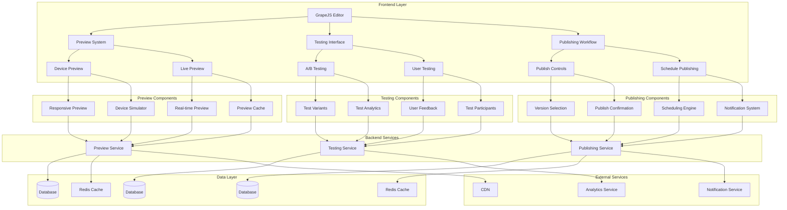

# Preview, Testing, and Publishing System Design

## Overview

This document outlines the design for implementing a comprehensive preview, testing, and publishing system in the Vue.js Page Builder System. This system will enable marketing administrators to preview their pages in real-time, conduct A/B testing, and manage the publishing workflow with version control and scheduling capabilities.

## Architecture

### Preview, Testing, and Publishing System Architecture



## Core Components

### 1. Preview System

```typescript
interface PreviewSystem {
  // Device preview
  getAvailableDevices(): Device[]
  setPreviewDevice(deviceId: string): void
  getPreviewUrl(pageId: string, options?: PreviewOptions): Promise<string>
  
  // Live preview
  enableLivePreview(pageId: string): void
  disableLivePreview(pageId: string): void
  updateLivePreview(change: PreviewChange): void
  
  // Preview cache
  cachePreview(pageId: string, previewData: PreviewData): Promise<void>
  getCachedPreview(pageId: string): Promise<PreviewData | null>
  clearPreviewCache(pageId: string): Promise<void>
}

interface Device {
  id: string
  name: string
  width: number
  height: number
  userAgent: string
  pixelRatio: number
  icon: string
}

interface PreviewOptions {
  device?: string
  includeDrafts?: boolean
  previewToken?: string
}

interface PreviewChange {
  type: 'content' | 'style' | 'component'
  targetId: string
  property: string
  oldValue: any
  newValue: any
}

interface PreviewData {
  html: string
  css: string
  components: any[]
  styles: any[]
  metadata: PageMetadata
  generatedAt: Date
}
```

### 2. Testing System

```typescript
interface TestingSystem {
  // A/B testing
  createTest(pageId: string, config: TestConfig): Promise<Test>
  getTest(testId: string): Promise<Test>
  getTestsForPage(pageId: string): Promise<Test[]>
  startTest(testId: string): Promise<void>
  stopTest(testId: string): Promise<void>
  getTestResults(testId: string): Promise<TestResults>
  
  // User testing
  createUserTest(pageId: string, config: UserTestConfig): Promise<UserTest>
  inviteTestParticipants(testId: string, participants: string[]): Promise<void>
  collectUserFeedback(feedback: UserFeedback): Promise<void>
  getUserTestResults(testId: string): Promise<UserTestResults>
}

interface TestConfig {
  name: string
  description?: string
  variants: TestVariant[]
  trafficSplit: number[]
  duration: number // in days
  goal: TestGoal
  startDate?: Date
}

interface TestVariant {
  id: string
  name: string
  pageId: string
  changes: TestChange[]
}

interface TestChange {
  type: 'content' | 'style' | 'component'
  targetId: string
  property: string
  value: any
}

interface TestGoal {
  type: 'conversion' | 'engagement' | 'clicks' | 'custom'
  selector?: string
  eventName?: string
  customFunction?: string
}

interface Test {
  id: string
  pageId: string
  config: TestConfig
  status: 'draft' | 'running' | 'paused' | 'completed'
  startDate?: Date
  endDate?: Date
  results?: TestResults
  createdAt: Date
  updatedAt: Date
}

interface TestResults {
  startDate: Date
  endDate: Date
  totalVisitors: number
  variantResults: VariantResult[]
  winner?: string
  confidence: number
}

interface VariantResult {
  variantId: string
 visitors: number
  conversions: number
  conversionRate: number
  engagement: number
}

interface UserTestConfig {
  name: string
  description?: string
  instructions: string
  duration: number // in days
  participantLimit?: number
  feedbackTypes: FeedbackType[]
}

type FeedbackType = 'rating' | 'comments' | 'annotations' | 'tasks'

interface UserTest {
  id: string
  pageId: string
  config: UserTestConfig
  status: 'draft' | 'recruiting' | 'running' | 'completed'
  participants: TestParticipant[]
  startDate?: Date
  endDate?: Date
  feedback: UserFeedback[]
  createdAt: Date
  updatedAt: Date
}

interface TestParticipant {
  id: string
  userId?: string
  email: string
  status: 'invited' | 'accepted' | 'completed'
  joinedAt?: Date
}

interface UserFeedback {
  participantId: string
  type: FeedbackType
  content: any
  timestamp: Date
}

interface UserTestResults {
  totalParticipants: number
  completedParticipants: number
  feedbackSummary: FeedbackSummary
  ratings?: RatingSummary
  comments?: CommentSummary
}

interface FeedbackSummary {
  ratingCount: number
  commentCount: number
  annotationCount: number
  taskCompletionCount: number
}

interface RatingSummary {
  average: number
  distribution: Record<number, number> // 1-5 star ratings
}

interface CommentSummary {
  total: number
  commonThemes: string[]
}
```

### 3. Publishing System

```typescript
interface PublishingSystem {
  // Publishing workflow
  publishPage(pageId: string, options?: PublishOptions): Promise<PublishResult>
  unpublishPage(pageId: string): Promise<void>
  schedulePublish(pageId: string, publishAt: Date, options?: PublishOptions): Promise<ScheduledPublish>
  cancelScheduledPublish(scheduleId: string): Promise<void>
  
  // Version management
  getPublishedVersion(pageId: string): Promise<PageVersion | null>
  rollbackToVersion(pageId: string, versionId: string): Promise<void>
  
  // Status and history
  getPublishingStatus(pageId: string): Promise<PublishingStatus>
  getPublishingHistory(pageId: string, options?: HistoryOptions): Promise<PublishEvent[]>
}

interface PublishOptions {
  versionId?: string
  createNewVersion?: boolean
  notifySubscribers?: boolean
  clearCache?: boolean
 customDomain?: string
}

interface PublishResult {
  success: boolean
  pageId: string
  versionId: string
  publishedAt: Date
  url: string
  message?: string
}

interface ScheduledPublish {
  id: string
  pageId: string
  scheduledAt: Date
  options: PublishOptions
  status: 'scheduled' | 'published' | 'cancelled'
  createdAt: Date
}

interface PublishingStatus {
  isPublished: boolean
  publishedVersionId?: string
  publishedAt?: Date
  scheduledPublish?: ScheduledPublish
  lastPublishedAt?: Date
  publishCount: number
}

interface PublishEvent {
  id: string
  pageId: string
  type: 'publish' | 'unpublish' | 'schedule' | 'rollback'
  versionId?: string
  userId: string
  timestamp: Date
  details?: any
}

interface HistoryOptions {
  limit?: number
  offset?: number
  startDate?: Date
  endDate?: Date
}
```

## Implementation Details

### 1. Preview System

#### Device Preview Management

```typescript
class DevicePreviewManager {
  private devices: Device[] = [
    {
      id: 'desktop',
      name: 'Desktop',
      width: 1200,
      height: 800,
      userAgent: '',
      pixelRatio: 1,
      icon: 'monitor'
    },
    {
      id: 'laptop',
      name: 'Laptop',
      width: 1024,
      height: 768,
      userAgent: '',
      pixelRatio: 1,
      icon: 'laptop'
    },
    {
      id: 'tablet',
      name: 'Tablet',
      width: 768,
      height: 1024,
      userAgent: 'Mozilla/5.0 (iPad; CPU OS 13_2_3 like Mac OS X)',
      pixelRatio: 2,
      icon: 'tablet'
    },
    {
      id: 'mobile',
      name: 'Mobile',
      width: 375,
      height: 667,
      userAgent: 'Mozilla/5.0 (iPhone; CPU iPhone OS 13_2_3 like Mac OS X)',
      pixelRatio: 2,
      icon: 'smartphone'
    }
  ]
  
  getAvailableDevices(): Device[] {
    return [...this.devices]
  }
  
  setPreviewDevice(deviceId: string): void {
    const device = this.devices.find(d => d.id === deviceId)
    if (device) {
      // Apply device settings to preview
      this.applyDeviceSettings(device)
    }
  }
  
  async getPreviewUrl(pageId: string, options?: PreviewOptions): Promise<string> {
    // Generate a unique preview URL with optional parameters
    const params = new URLSearchParams()
    
    if (options?.device) params.append('device', options.device)
    if (options?.includeDrafts) params.append('drafts', 'true')
    if (options?.previewToken) params.append('token', options.previewToken)
    
    // In a real implementation, this would generate a secure preview URL
    return `/preview/${pageId}?${params.toString()}`
  }
  
  private applyDeviceSettings(device: Device): void {
    // Apply device-specific settings to the preview iframe
    const previewFrame = document.getElementById('preview-frame') as HTMLIFrameElement
    if (previewFrame) {
      previewFrame.style.width = `${device.width}px`
      previewFrame.style.height = `${device.height}px`
      
      // Set device pixel ratio
      previewFrame.style.transform = `scale(${1 / device.pixelRatio})`
      previewFrame.style.transformOrigin = 'top left'
    }
  }
}
```

#### Live Preview Engine

```typescript
class LivePreviewEngine {
  private isEnabled = false
  private previewCache: Map<string, PreviewData> = new Map()
  private cacheTimeout = 5 * 60 * 1000 // 5 minutes
  
  enableLivePreview(pageId: string): void {
    this.isEnabled = true
    console.log(`Live preview enabled for page ${pageId}`)
  }
  
  disableLivePreview(pageId: string): void {
    this.isEnabled = false
    console.log(`Live preview disabled for page ${pageId}`)
  }
  
  updateLivePreview(change: PreviewChange): void {
    if (!this.isEnabled) return
    
    // Update preview based on change
    console.log('Updating live preview with change:', change)
    
    // In a real implementation, this would update the preview iframe
    // with the specific change rather than re-rendering the entire page
  }
  
  async cachePreview(pageId: string, previewData: PreviewData): Promise<void> {
    this.previewCache.set(pageId, {
      ...previewData,
      generatedAt: new Date()
    })
    
    // Set timeout to clear cache entry
    setTimeout(() => {
      this.previewCache.delete(pageId)
    }, this.cacheTimeout)
  }
  
  async getCachedPreview(pageId: string): Promise<PreviewData | null> {
    const cached = this.previewCache.get(pageId)
    if (cached && (Date.now() - cached.generatedAt.getTime()) < this.cacheTimeout) {
      return cached
    }
    return null
  }
  
  async clearPreviewCache(pageId: string): Promise<void> {
    this.previewCache.delete(pageId)
  }
}
```

### 2. Testing System

#### A/B Testing Management

```typescript
class ABTestManager {
  private tests: Map<string, Test> = new Map()
  
  async createTest(pageId: string, config: TestConfig): Promise<Test> {
    const test: Test = {
      id: this.generateId(),
      pageId,
      config,
      status: 'draft',
      createdAt: new Date(),
      updatedAt: new Date()
    }
    
    this.tests.set(test.id, test)
    
    // Save to backend
    try {
      const response = await fetch('/api/tests', {
        method: 'POST',
        headers: {
          'Content-Type': 'application/json',
        },
        body: JSON.stringify(test)
      })
      
      if (!response.ok) {
        throw new Error('Failed to create test')
      }
      
      return test
    } catch (error) {
      console.error('Failed to create test:', error)
      throw error
    }
  }
  
  async getTest(testId: string): Promise<Test> {
    const test = this.tests.get(testId)
    if (test) {
      return test
    }
    
    // Fetch from backend
    try {
      const response = await fetch(`/api/tests/${testId}`)
      if (!response.ok) {
        throw new Error('Failed to fetch test')
      }
      
      const testData = await response.json()
      this.tests.set(testId, testData)
      return testData
    } catch (error) {
      console.error('Failed to fetch test:', error)
      throw error
    }
  }
  
  async startTest(testId: string): Promise<void> {
    const test = await this.getTest(testId)
    test.status = 'running'
    test.startDate = new Date()
    test.updatedAt = new Date()
    
    this.tests.set(testId, test)
    
    // Update in backend
    try {
      const response = await fetch(`/api/tests/${testId}/start`, {
        method: 'POST'
      })
      
      if (!response.ok) {
        throw new Error('Failed to start test')
      }
    } catch (error) {
      console.error('Failed to start test:', error)
      throw error
    }
  }
  
  async stopTest(testId: string): Promise<void> {
    const test = await this.getTest(testId)
    test.status = 'completed'
    test.endDate = new Date()
    test.updatedAt = new Date()
    
    this.tests.set(testId, test)
    
    // Update in backend
    try {
      const response = await fetch(`/api/tests/${testId}/stop`, {
        method: 'POST'
      })
      
      if (!response.ok) {
        throw new Error('Failed to stop test')
      }
    } catch (error) {
      console.error('Failed to stop test:', error)
      throw error
    }
  }
  
  async getTestResults(testId: string): Promise<TestResults> {
    // In a real implementation, this would fetch results from analytics service
    // For now, we'll return mock data
    return {
      startDate: new Date(),
      endDate: new Date(),
      totalVisitors: 1000,
      variantResults: [
        {
          variantId: 'variant-a',
          visitors: 500,
          conversions: 50,
          conversionRate: 0.1,
          engagement: 0.75
        },
        {
          variantId: 'variant-b',
          visitors: 500,
          conversions: 75,
          conversionRate: 0.15,
          engagement: 0.8
        }
      ],
      winner: 'variant-b',
      confidence: 0.95
    }
  }
  
  private generateId(): string {
    return 'test-' + Math.random().toString(36).substr(2, 9)
  }
}
```

#### User Testing Management

```typescript
class UserTestManager {
  private userTests: Map<string, UserTest> = new Map()
  
  async createUserTest(pageId: string, config: UserTestConfig): Promise<UserTest> {
    const userTest: UserTest = {
      id: this.generateId(),
      pageId,
      config,
      status: 'draft',
      participants: [],
      feedback: [],
      createdAt: new Date(),
      updatedAt: new Date()
    }
    
    this.userTests.set(userTest.id, userTest)
    
    // Save to backend
    try {
      const response = await fetch('/api/user-tests', {
        method: 'POST',
        headers: {
          'Content-Type': 'application/json',
        },
        body: JSON.stringify(userTest)
      })
      
      if (!response.ok) {
        throw new Error('Failed to create user test')
      }
      
      return userTest
    } catch (error) {
      console.error('Failed to create user test:', error)
      throw error
    }
  }
  
  async inviteTestParticipants(testId: string, participants: string[]): Promise<void> {
    const userTest = await this.getUserTest(testId)
    
    // Add participants
    participants.forEach(email => {
      userTest.participants.push({
        id: this.generateId(),
        email,
        status: 'invited'
      })
    })
    
    userTest.updatedAt = new Date()
    this.userTests.set(testId, userTest)
    
    // Send invitations
    try {
      const response = await fetch(`/api/user-tests/${testId}/invite`, {
        method: 'POST',
        headers: {
          'Content-Type': 'application/json',
        },
        body: JSON.stringify({ participants })
      })
      
      if (!response.ok) {
        throw new Error('Failed to invite participants')
      }
    } catch (error) {
      console.error('Failed to invite participants:', error)
      throw error
    }
  }
  
  async collectUserFeedback(feedback: UserFeedback): Promise<void> {
    // In a real implementation, this would save feedback to the backend
    console.log('Collecting user feedback:', feedback)
  }
  
  async getUserTestResults(testId: string): Promise<UserTestResults> {
    // In a real implementation, this would aggregate feedback from participants
    // For now, we'll return mock data
    return {
      totalParticipants: 10,
      completedParticipants: 8,
      feedbackSummary: {
        ratingCount: 5,
        commentCount: 3,
        annotationCount: 2,
        taskCompletionCount: 7
      },
      ratings: {
        average: 4.2,
        distribution: {
          1: 0,
          2: 0,
          3: 1,
          4: 2,
          5: 2
        }
      },
      comments: {
        total: 3,
        commonThemes: ['Navigation', 'Content clarity', 'Visual design']
      }
    }
  }
  
  private async getUserTest(testId: string): Promise<UserTest> {
    const userTest = this.userTests.get(testId)
    if (userTest) {
      return userTest
    }
    
    // Fetch from backend
    try {
      const response = await fetch(`/api/user-tests/${testId}`)
      if (!response.ok) {
        throw new Error('Failed to fetch user test')
      }
      
      const userTestData = await response.json()
      this.userTests.set(testId, userTestData)
      return userTestData
    } catch (error) {
      console.error('Failed to fetch user test:', error)
      throw error
    }
  }
  
  private generateId(): string {
    return 'usertest-' + Math.random().toString(36).substr(2, 9)
  }
}
```

### 3. Publishing System

#### Publishing Workflow Management

```typescript
class PublishingManager {
  private scheduledPublishes: Map<string, ScheduledPublish> = new Map()
  
  async publishPage(pageId: string, options?: PublishOptions): Promise<PublishResult> {
    // Validate page before publishing
    const isValid = await this.validatePage(pageId)
    if (!isValid) {
      return {
        success: false,
        pageId,
        versionId: '',
        publishedAt: new Date(),
        url: '',
        message: 'Page validation failed'
      }
    }
    
    // Create new version if requested
    let versionId = options?.versionId
    if (options?.createNewVersion) {
      versionId = await this.createVersion(pageId)
    }
    
    // Publish the page
    const publishResult = await this.executePublish(pageId, versionId)
    
    // Clear cache if requested
    if (options?.clearCache) {
      await this.clearPageCache(pageId)
    }
    
    // Notify subscribers if requested
    if (options?.notifySubscribers) {
      await this.notifySubscribers(pageId)
    }
    
    return publishResult
  }
  
  async unpublishPage(pageId: string): Promise<void> {
    // Unpublish the page
    try {
      const response = await fetch(`/api/pages/${pageId}/unpublish`, {
        method: 'POST'
      })
      
      if (!response.ok) {
        throw new Error('Failed to unpublish page')
      }
      
      // Log the unpublish event
      await this.logPublishEvent(pageId, 'unpublish')
    } catch (error) {
      console.error('Failed to unpublish page:', error)
      throw error
    }
  }
  
  async schedulePublish(pageId: string, publishAt: Date, options?: PublishOptions): Promise<ScheduledPublish> {
    const scheduledPublish: ScheduledPublish = {
      id: this.generateId(),
      pageId,
      scheduledAt: publishAt,
      options: options || {},
      status: 'scheduled',
      createdAt: new Date()
    }
    
    this.scheduledPublishes.set(scheduledPublish.id, scheduledPublish)
    
    // Save to backend
    try {
      const response = await fetch('/api/scheduled-publishes', {
        method: 'POST',
        headers: {
          'Content-Type': 'application/json',
        },
        body: JSON.stringify(scheduledPublish)
      })
      
      if (!response.ok) {
        throw new Error('Failed to schedule publish')
      }
      
      // Set up timer to execute the publish
      const delay = publishAt.getTime() - Date.now()
      if (delay > 0) {
        setTimeout(() => {
          this.executeScheduledPublish(scheduledPublish.id)
        }, delay)
      }
      
      return scheduledPublish
    } catch (error) {
      console.error('Failed to schedule publish:', error)
      throw error
    }
  }
  
  async cancelScheduledPublish(scheduleId: string): Promise<void> {
    const scheduledPublish = this.scheduledPublishes.get(scheduleId)
    if (scheduledPublish) {
      scheduledPublish.status = 'cancelled'
      this.scheduledPublishes.set(scheduleId, scheduledPublish)
      
      // Update in backend
      try {
        const response = await fetch(`/api/scheduled-publishes/${scheduleId}`, {
          method: 'DELETE'
        })
        
        if (!response.ok) {
          throw new Error('Failed to cancel scheduled publish')
        }
      } catch (error) {
        console.error('Failed to cancel scheduled publish:', error)
        throw error
      }
    }
  }
  
  async getPublishingStatus(pageId: string): Promise<PublishingStatus> {
    try {
      const response = await fetch(`/api/pages/${pageId}/publishing-status`)
      if (!response.ok) {
        throw new Error('Failed to fetch publishing status')
      }
      
      return await response.json()
    } catch (error) {
      console.error('Failed to fetch publishing status:', error)
      throw error
    }
  }
  
  async getPublishingHistory(pageId: string, options?: HistoryOptions): Promise<PublishEvent[]> {
    try {
      const params = new URLSearchParams()
      if (options?.limit) params.append('limit', options.limit.toString())
      if (options?.offset) params.append('offset', options.offset.toString())
      if (options?.startDate) params.append('startDate', options.startDate.toISOString())
      if (options?.endDate) params.append('endDate', options.endDate.toISOString())
      
      const response = await fetch(`/api/pages/${pageId}/publish-history?${params.toString()}`)
      if (!response.ok) {
        throw new Error('Failed to fetch publishing history')
      }
      
      return await response.json()
    } catch (error) {
      console.error('Failed to fetch publishing history:', error)
      throw error
    }
  }
  
  private async validatePage(pageId: string): Promise<boolean> {
    // Validate page content, metadata, and other requirements
    // This is a simplified implementation
    console.log(`Validating page ${pageId}`)
    return true
  }
  
  private async createVersion(pageId: string): Promise<string> {
    // Create a new version of the page
    // This would typically involve calling the version control system
    console.log(`Creating new version for page ${pageId}`)
    return 'version-' + Math.random().toString(36).substr(2, 9)
  }
  
  private async executePublish(pageId: string, versionId?: string): Promise<PublishResult> {
    try {
      const response = await fetch(`/api/pages/${pageId}/publish`, {
        method: 'POST',
        headers: {
          'Content-Type': 'application/json',
        },
        body: JSON.stringify({ versionId })
      })
      
      if (!response.ok) {
        throw new Error('Failed to publish page')
      }
      
      const result = await response.json()
      
      // Log the publish event
      await this.logPublishEvent(pageId, 'publish', versionId)
      
      return result
    } catch (error) {
      console.error('Failed to publish page:', error)
      throw error
    }
  }
  
  private async executeScheduledPublish(scheduleId: string): Promise<void> {
    const scheduledPublish = this.scheduledPublishes.get(scheduleId)
    if (scheduledPublish && scheduledPublish.status === 'scheduled') {
      try {
        await this.publishPage(scheduledPublish.pageId, scheduledPublish.options)
        scheduledPublish.status = 'published'
        this.scheduledPublishes.set(scheduleId, scheduledPublish)
      } catch (error) {
        console.error('Failed to execute scheduled publish:', error)
      }
    }
  }
  
  private async clearPageCache(pageId: string): Promise<void> {
    // Clear CDN and other caches for the page
    console.log(`Clearing cache for page ${pageId}`)
  }
  
  private async notifySubscribers(pageId: string): Promise<void> {
    // Notify subscribers about the page update
    console.log(`Notifying subscribers about page ${pageId} update`)
  }
  
  private async logPublishEvent(pageId: string, type: string, versionId?: string): Promise<void> {
    try {
      const response = await fetch('/api/publish-events', {
        method: 'POST',
        headers: {
          'Content-Type': 'application/json',
        },
        body: JSON.stringify({
          pageId,
          type,
          versionId,
          userId: 'current-user', // This would come from auth context
          timestamp: new Date()
        })
      })
      
      if (!response.ok) {
        throw new Error('Failed to log publish event')
      }
    } catch (error) {
      console.error('Failed to log publish event:', error)
    }
  }
  
  private generateId(): string {
    return 'publish-' + Math.random().toString(36).substr(2, 9)
  }
}
```

## Integration with Vue Wrapper Component

### Preview System Integration

```vue
<script setup lang="ts">
import { ref, computed, watch, onMounted } from 'vue'
import { usePreview } from '@/composables/usePreview'
import type { Device, PreviewOptions } from '@/types/preview'

const { 
  devices,
  setPreviewDevice,
  getPreviewUrl,
  enableLivePreview,
  disableLivePreview
} = usePreview()

const selectedPageId = ref<string | null>(null)
const selectedDeviceId = ref('desktop')
const previewUrl = ref('')
const isLivePreviewEnabled = ref(false)
const showDeviceSelector = ref(true)

// Computed properties
const selectedDevice = computed(() => {
  return devices.value.find(d => d.id === selectedDeviceId.value) || devices.value[0]
})

// Watch for page selection changes
watch(selectedPageId, async (newId) => {
  if (newId) {
    await updatePreviewUrl(newId)
 }
})

// Watch for device changes
watch(selectedDeviceId, async (newDeviceId) => {
  setPreviewDevice(newDeviceId)
  if (selectedPageId.value) {
    await updatePreviewUrl(selectedPageId.value)
  }
})

// Lifecycle
onMounted(() => {
  if (selectedPageId.value) {
    enableLivePreview(selectedPageId.value)
    isLivePreviewEnabled.value = true
  }
})

// Methods
const updatePreviewUrl = async (pageId: string) => {
  const options: PreviewOptions = {
    device: selectedDeviceId.value,
    includeDrafts: true
  }
  
  try {
    previewUrl.value = await getPreviewUrl(pageId, options)
  } catch (error) {
    console.error('Failed to get preview URL:', error)
  }
}

const toggleLivePreview = () => {
  if (!selectedPageId.value) return
  
  if (isLivePreviewEnabled.value) {
    disableLivePreview(selectedPageId.value)
  } else {
    enableLivePreview(selectedPageId.value)
  }
  
  isLivePreviewEnabled.value = !isLivePreviewEnabled.value
}

const switchDevice = (deviceId: string) => {
  selectedDeviceId.value = deviceId
}

const toggleDeviceSelector = () => {
  showDeviceSelector.value = !showDeviceSelector.value
}
</script>
```

### Testing Interface Integration

```vue
<script setup lang="ts">
import { ref, computed } from 'vue'
import { useTesting } from '@/composables/useTesting'
import type { Test, UserTest, TestConfig, UserTestConfig } from '@/types/testing'

const { 
  createTest,
  getTest,
  startTest,
  stopTest,
  getTestResults,
  createUserTest,
  inviteTestParticipants,
  getUserTestResults
} = useTesting()

const selectedPageId = ref<string | null>(null)
const activeTests = ref<Test[]>([])
const activeUserTests = ref<UserTest[]>([])
const showCreateTestModal = ref(false)
const showCreateUserTestModal = ref(false)
const newTestConfig = ref<TestConfig>({
  name: '',
  variants: [],
  trafficSplit: [50, 50],
  duration: 7,
  goal: { type: 'conversion' }
})
const newUserTestConfig = ref<UserTestConfig>({
  name: '',
  instructions: '',
  duration: 7,
  feedbackTypes: ['rating', 'comments']
})

// Computed properties
const runningTests = computed(() => {
  return activeTests.value.filter(t => t.status === 'running')
})

const completedTests = computed(() => {
  return activeTests.value.filter(t => t.status === 'completed')
})

// Methods
const createNewTest = async () => {
  if (!selectedPageId.value) return
  
  try {
    const test = await createTest(selectedPageId.value, newTestConfig.value)
    activeTests.value.push(test)
    showCreateTestModal.value = false
    resetTestConfig()
  } catch (error) {
    console.error('Failed to create test:', error)
  }
}

const createNewUserTest = async () => {
  if (!selectedPageId.value) return
  
  try {
    const userTest = await createUserTest(selectedPageId.value, newUserTestConfig.value)
    activeUserTests.value.push(userTest)
    showCreateUserTestModal.value = false
    resetUserTestConfig()
  } catch (error) {
    console.error('Failed to create user test:', error)
  }
}

const startSelectedTest = async (testId: string) => {
  try {
    await startTest(testId)
    // Update local state
    const test = activeTests.value.find(t => t.id === testId)
    if (test) {
      test.status = 'running'
      test.startDate = new Date()
    }
  } catch (error) {
    console.error('Failed to start test:', error)
 }
}

const stopSelectedTest = async (testId: string) => {
  try {
    await stopTest(testId)
    // Update local state
    const test = activeTests.value.find(t => t.id === testId)
    if (test) {
      test.status = 'completed'
      test.endDate = new Date()
    }
  } catch (error) {
    console.error('Failed to stop test:', error)
  }
}

const loadTestResults = async (testId: string) => {
  try {
    const results = await getTestResults(testId)
    // Update test with results
    const test = activeTests.value.find(t => t.id === testId)
    if (test) {
      test.results = results
    }
  } catch (error) {
    console.error('Failed to load test results:', error)
  }
}

const inviteParticipants = async (testId: string, emails: string[]) => {
  try {
    await inviteTestParticipants(testId, emails)
    alert('Participants invited successfully!')
  } catch (error) {
    console.error('Failed to invite participants:', error)
    alert('Failed to invite participants')
  }
}

const loadUserTestResults = async (testId: string) => {
  try {
    const results = await getUserTestResults(testId)
    // Update user test with results
    const userTest = activeUserTests.value.find(t => t.id === testId)
    if (userTest) {
      // Handle results update
      console.log('User test results:', results)
    }
  } catch (error) {
    console.error('Failed to load user test results:', error)
  }
}

const resetTestConfig = () => {
  newTestConfig.value = {
    name: '',
    variants: [],
    trafficSplit: [50, 50],
    duration: 7,
    goal: { type: 'conversion' }
  }
}

const resetUserTestConfig = () => {
  newUserTestConfig.value = {
    name: '',
    instructions: '',
    duration: 7,
    feedbackTypes: ['rating', 'comments']
  }
}
</script>
```

### Publishing Workflow Integration

```vue
<script setup lang="ts">
import { ref, computed } from 'vue'
import { usePublishing } from '@/composables/usePublishing'
import type { PublishOptions, ScheduledPublish, PublishingStatus } from '@/types/publishing'

const { 
  publishPage,
  unpublishPage,
  schedulePublish,
  cancelScheduledPublish,
  getPublishingStatus,
  getPublishingHistory
} = usePublishing()

const selectedPageId = ref<string | null>(null)
const publishingStatus = ref<PublishingStatus | null>(null)
const publishHistory = ref<any[]>([])
const scheduledPublishes = ref<ScheduledPublish[]>([])
const showScheduleModal = ref(false)
const scheduleDate = ref('')
const publishOptions = ref<PublishOptions>({
 createNewVersion: true,
  notifySubscribers: true,
  clearCache: true
})

// Computed properties
const isPagePublished = computed(() => {
  return publishingStatus.value?.isPublished || false
})

const nextScheduledPublish = computed(() => {
  return scheduledPublishes.value.find(sp => sp.status === 'scheduled') || null
})

// Methods
const publishCurrentPage = async () => {
  if (!selectedPageId.value) return
  
  try {
    const result = await publishPage(selectedPageId.value, publishOptions.value)
    if (result.success) {
      alert('Page published successfully!')
      await loadPublishingStatus()
    } else {
      alert(`Publish failed: ${result.message || 'Unknown error'}`)
    }
  } catch (error) {
    console.error('Failed to publish page:', error)
    alert('Failed to publish page')
  }
}

const unpublishCurrentPage = async () => {
  if (!selectedPageId.value) return
  
  if (confirm('Are you sure you want to unpublish this page?')) {
    try {
      await unpublishPage(selectedPageId.value)
      alert('Page unpublished successfully!')
      await loadPublishingStatus()
    } catch (error) {
      console.error('Failed to unpublish page:', error)
      alert('Failed to unpublish page')
    }
  }
}

const schedulePagePublish = async () => {
  if (!selectedPageId.value || !scheduleDate.value) return
  
  try {
    const publishAt = new Date(scheduleDate.value)
    const scheduled = await schedulePublish(selectedPageId.value, publishAt, publishOptions.value)
    scheduledPublishes.value.push(scheduled)
    showScheduleModal.value = false
    scheduleDate.value = ''
    alert('Page scheduled for publishing!')
  } catch (error) {
    console.error('Failed to schedule publish:', error)
    alert('Failed to schedule publish')
  }
}

const cancelScheduled = async (scheduleId: string) => {
  try {
    await cancelScheduledPublish(scheduleId)
    // Update local state
    const index = scheduledPublishes.value.findIndex(sp => sp.id === scheduleId)
    if (index !== -1) {
      scheduledPublishes.value.splice(index, 1)
    }
    alert('Scheduled publish cancelled!')
  } catch (error) {
    console.error('Failed to cancel scheduled publish:', error)
    alert('Failed to cancel scheduled publish')
  }
}

const loadPublishingStatus = async () => {
  if (!selectedPageId.value) return
  
  try {
    publishingStatus.value = await getPublishingStatus(selectedPageId.value)
 } catch (error) {
    console.error('Failed to load publishing status:', error)
  }
}

const loadPublishingHistory = async () => {
  if (!selectedPageId.value) return
  
  try {
    publishHistory.value = await getPublishingHistory(selectedPageId.value)
  } catch (error) {
    console.error('Failed to load publishing history:', error)
  }
}

const loadScheduledPublishes = async () => {
  // In a real implementation, this would fetch scheduled publishes from backend
  console.log('Loading scheduled publishes')
}
</script>
```

## Performance Optimization

### 1. Preview Caching

```typescript
class PreviewCacheManager {
  private cache: Map<string, { data: any; timestamp: number }> = new Map()
  private cacheTimeout = 5 * 60 * 1000 // 5 minutes
  
  get(key: string): any {
    const cached = this.cache.get(key)
    if (cached && (Date.now() - cached.timestamp) < this.cacheTimeout) {
      return cached.data
    }
    
    return null
  }
  
  set(key: string, data: any): void {
    this.cache.set(key, {
      data,
      timestamp: Date.now()
    })
  }
  
  clear(key: string): void {
    this.cache.delete(key)
  }
  
  clearExpired(): void {
    const now = Date.now()
    for (const [key, value] of this.cache.entries()) {
      if ((now - value.timestamp) >= this.cacheTimeout) {
        this.cache.delete(key)
      }
    }
  }
  
  clearAll(): void {
    this.cache.clear()
  }
}
```

### 2. Lazy Loading for Testing Data

```typescript
class TestDataManager {
  private loadedTests: Map<string, Test[]> = new Map()
  private pageSize = 10
  
  async loadTestsIncrementally(pageId: string, offset: number): Promise<Test[]> {
    // Check if we already have these tests cached
    const cacheKey = `${pageId}-${offset}`
    const cached = testCache.get(cacheKey)
    if (cached) {
      return cached
    }
    
    // Load from backend
    try {
      const response = await fetch(`/api/pages/${pageId}/tests?limit=${this.pageSize}&offset=${offset}`)
      if (!response.ok) {
        throw new Error('Failed to load tests')
      }
      
      const tests = await response.json()
      testCache.set(cacheKey, tests)
      return tests
    } catch (error) {
      console.error('Failed to load tests:', error)
      throw error
    }
  }
  
  async loadAllTests(pageId: string): Promise<Test[]> {
    // Check if we already have all tests cached
    const cached = this.loadedTests.get(pageId)
    if (cached) {
      return cached
    }
    
    // Load all tests incrementally
    const allTests: Test[] = []
    let offset = 0
    let hasMore = true
    
    while (hasMore) {
      const tests = await this.loadTestsIncrementally(pageId, offset)
      allTests.push(...tests)
      
      if (tests.length < this.pageSize) {
        hasMore = false
      } else {
        offset += this.pageSize
      }
    }
    
    this.loadedTests.set(pageId, allTests)
    return allTests
  }
}
```

## Error Handling and Recovery

### 1. Preview Error Handling

```typescript
class PreviewErrorHandler {
  handlePreviewGenerationError(error: Error, pageId: string): void {
    console.error(`Failed to generate preview for page ${pageId}:`, error)
    
    // Show user-friendly error message
    // Suggest retry or alternative actions
  }
  
  handleDevicePreviewError(error: Error, deviceId: string): void {
    console.error(`Failed to generate device preview for ${deviceId}:`, error)
    
    // Show user-friendly error message
    // Fallback to default device or show error state
  }
  
  handleLivePreviewError(error: Error, pageId: string): void {
    console.error(`Failed to update live preview for page ${pageId}:`, error)
    
    // Disable live preview and show error message
    // Suggest manual refresh
  }
}
```

### 2. Testing Error Handling

```typescript
class TestingErrorHandler {
  handleTestCreationError(error: Error, pageId: string): void {
    console.error(`Failed to create test for page ${pageId}:`, error)
    
    // Show user-friendly error message
    // Suggest validation or alternative test configurations
  }
  
  handleTestExecutionError(error: Error, testId: string): void {
    console.error(`Failed to execute test ${testId}:`, error)
    
    // Pause test and show error message
    // Suggest corrective actions
  }
  
  handleParticipantInvitationError(error: Error, testId: string): void {
    console.error(`Failed to invite participants for test ${testId}:`, error)
    
    // Show error and suggest retry or manual invitation
 }
}
```

### 3. Publishing Error Handling

```typescript
class PublishingErrorHandler {
  handlePublishError(error: Error, pageId: string): void {
    console.error(`Failed to publish page ${pageId}:`, error)
    
    // Show user-friendly error message
    // Suggest validation or alternative publishing options
  }
  
  handleScheduleError(error: Error, pageId: string): void {
    console.error(`Failed to schedule publish for page ${pageId}:`, error)
    
    // Show error and suggest alternative scheduling
  }
  
  handleUnpublishError(error: Error, pageId: string): void {
    console.error(`Failed to unpublish page ${pageId}:`, error)
    
    // Show error and suggest manual unpublishing
  }
}
```

## Testing Strategy

### Unit Tests

1. Preview generation and device simulation
2. A/B test creation and management
3. User testing workflow
4. Publishing workflow and scheduling
5. Version management and rollback
6. Cache management and optimization

### Integration Tests

1. Preview system with GrapeJS integration
2. Testing system with analytics integration
3. Publishing workflow with version control
4. Device preview across different screen sizes
5. Test result aggregation and reporting
6. Scheduled publishing execution

### End-to-End Tests

1. Complete preview workflow
2. A/B testing from creation to results
3. User testing with participant feedback
4. Publishing with scheduling and rollback
5. Performance with large pages
6. Error recovery scenarios

## Implementation Plan

### Phase 1: Core Infrastructure
- Implement preview generation system
- Create device simulation capabilities
- Set up live preview engine
- Implement preview caching

### Phase 2: Testing System
- Create A/B testing framework
- Implement user testing capabilities
- Set up test result aggregation
- Add participant management

### Phase 3: Publishing System
- Implement publishing workflow
- Create version management
- Set up scheduling engine
- Add publishing history tracking

### Phase 4: Vue Integration
- Integrate preview system with Vue wrapper
- Add testing interface to Vue component
- Implement publishing controls
- Add real-time status updates

### Phase 5: Performance Optimization
- Add advanced preview caching
- Implement lazy loading for test data
- Optimize publishing workflow
- Add performance monitoring

### Phase 6: Error Handling and Testing
- Implement comprehensive error handling
- Add recovery mechanisms
- Create unit tests
- Add integration tests

### Phase 7: Advanced Features
- Add advanced A/B testing algorithms
- Implement multi-variate testing
- Add collaborative testing features
- Add publishing analytics

## Dependencies

- `grapesjs` - Core page builder engine
- `vue` - Vue.js framework
- `pinia` - State management
- `date-fns` - Date utility library
- `uuid` - Library for generating unique IDs
- `axios` - HTTP client for API calls
- `chart.js` - Charting library for test results

## Security Considerations

- Validate all preview requests
- Implement proper access controls for testing
- Sanitize test data and feedback
- Encrypt sensitive publishing information
- Implement rate limiting for preview generation
- Validate user permissions for publishing actions
- Protect against CSRF attacks in publishing endpoints
- Implement proper authentication for scheduled publishes