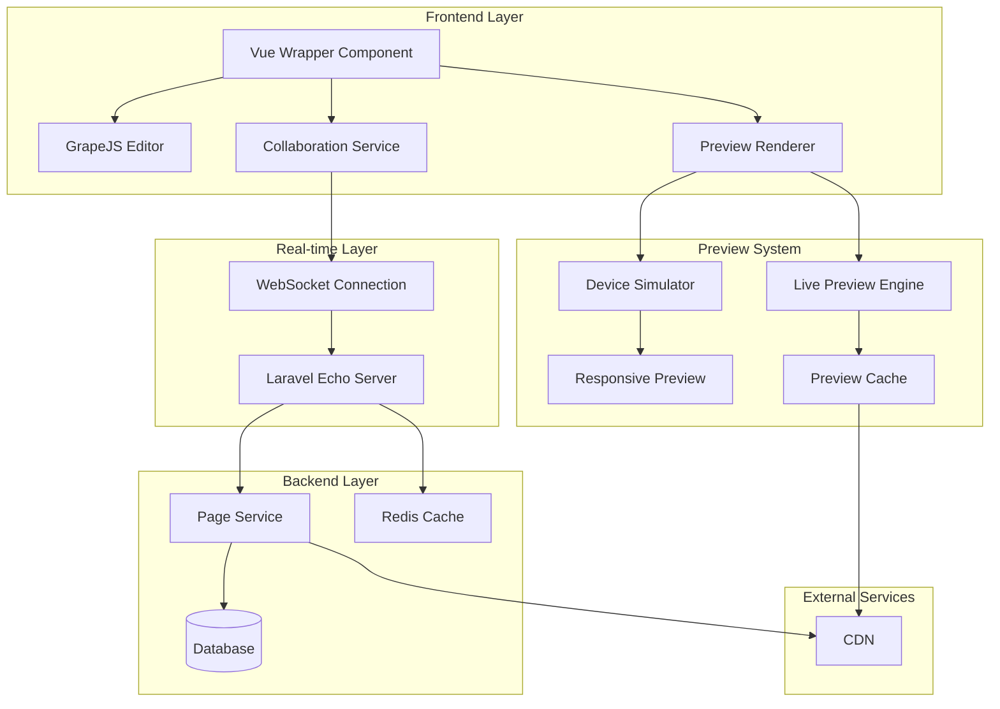

# Real-time Editing and Preview Capabilities Design

## Overview

This document outlines the design for implementing real-time editing and preview capabilities in the Vue.js Page Builder System. This feature will enable marketing administrators to see changes instantly as they build pages, with support for multiple device previews and collaborative editing.

## Architecture

### Real-time Editing System



## Core Components

### 1. Real-time Collaboration Service

```typescript
interface CollaborationService {
  // User presence management
  joinPage(pageId: string, userId: string): Promise<void>
  leavePage(pageId: string, userId: string): Promise<void>
  getActiveUsers(pageId: string): Promise<User[]>
  
  // Change synchronization
  broadcastChange(change: EditorChange): void
  applyRemoteChange(change: EditorChange): void
  
  // Conflict resolution
  resolveConflict(localChange: EditorChange, remoteChange: EditorChange): EditorChange
  
  // Connection management
  connect(): Promise<void>
 disconnect(): void
  isConnected(): boolean
}

interface EditorChange {
  id: string
  type: 'component_add' | 'component_update' | 'component_delete' | 'style_update'
  timestamp: number
  userId: string
  data: any
  clientId: string
}

interface User {
  id: string
  name: string
  avatar?: string
  lastActive: Date
  cursorPosition?: { x: number; y: number }
}
```

### 2. Live Preview Engine

```typescript
interface LivePreviewEngine {
  // Preview rendering
  renderPreview(content: any, device: DeviceType): Promise<string>
  updatePreview(change: EditorChange): void
  
  // Device simulation
  setDevice(device: DeviceType): void
  getAvailableDevices(): DeviceType[]
  
  // Performance optimization
  enableCaching(enabled: boolean): void
  clearCache(): void
  getCacheStats(): CacheStats
}

interface DeviceType {
  id: string
  name: string
  width: number
  height: number
  userAgent: string
  pixelRatio: number
}

interface CacheStats {
  hits: number
  misses: number
  size: number
  maxSize: number
}
```

## Implementation Details

### 1. Real-time Collaboration

#### WebSocket Connection Management

```typescript
class WebSocketManager {
  private socket: WebSocket | null = null
  private reconnectAttempts = 0
  private maxReconnectAttempts = 5
  private reconnectDelay = 1000
  
  connect(url: string): Promise<void> {
    return new Promise((resolve, reject) => {
      try {
        this.socket = new WebSocket(url)
        
        this.socket.onopen = () => {
          console.log('WebSocket connected')
          this.reconnectAttempts = 0
          resolve()
        }
        
        this.socket.onclose = () => {
          console.log('WebSocket disconnected')
          this.handleDisconnect()
        }
        
        this.socket.onerror = (error) => {
          console.error('WebSocket error:', error)
          reject(error)
        }
      } catch (error) {
        reject(error)
      }
    })
  }
  
  private handleDisconnect(): void {
    if (this.reconnectAttempts < this.maxReconnectAttempts) {
      this.reconnectAttempts++
      setTimeout(() => {
        this.connect(this.getWebSocketUrl())
      }, this.reconnectDelay * this.reconnectAttempts)
    }
  }
  
  send(message: any): void {
    if (this.socket && this.socket.readyState === WebSocket.OPEN) {
      this.socket.send(JSON.stringify(message))
    }
  }
  
  onMessage(callback: (message: any) => void): void {
    if (this.socket) {
      this.socket.onmessage = (event) => {
        try {
          const message = JSON.parse(event.data)
          callback(message)
        } catch (error) {
          console.error('Failed to parse WebSocket message:', error)
        }
      }
    }
  }
  
  private getWebSocketUrl(): string {
    const protocol = window.location.protocol === 'https:' ? 'wss:' : 'ws:'
    return `${protocol}//${window.location.host}/ws/page-builder`
  }
}
```

#### Operational Transformation

```typescript
class OperationalTransformation {
  // Transform operations to resolve conflicts
  transform(operation: EditorChange, against: EditorChange): EditorChange {
    // Implementation depends on the type of operations
    switch (operation.type) {
      case 'component_add':
        return this.transformComponentAdd(operation, against)
      case 'component_update':
        return this.transformComponentUpdate(operation, against)
      case 'component_delete':
        return this.transformComponentDelete(operation, against)
      case 'style_update':
        return this.transformStyleUpdate(operation, against)
      default:
        return operation
    }
  
  private transformComponentAdd(operation: EditorChange, against: EditorChange): EditorChange {
    // Adjust component positions based on concurrent changes
    // This is a simplified example - real implementation would be more complex
    const transformed = { ...operation }
    
    if (against.type === 'component_add' && against.timestamp < operation.timestamp) {
      // Adjust position if another component was added before this one
      transformed.data.position = this.adjustPosition(transformed.data.position, against.data)
    }
    
    return transformed
  }
  
  private transformComponentUpdate(operation: EditorChange, against: EditorChange): EditorChange {
    // Handle concurrent updates to the same component
    if (operation.data.componentId === against.data.componentId) {
      // Merge changes or apply the most recent one
      if (against.timestamp > operation.timestamp) {
        return against
      }
    
    return operation
  }
  
  private transformComponentDelete(operation: EditorChange, against: EditorChange): EditorChange {
    // Prevent deletion of components that were concurrently modified
    if (operation.data.componentId === against.data.componentId) {
      // Cancel the deletion if the component was updated more recently
      if (against.timestamp > operation.timestamp) {
        return { ...operation, cancelled: true }
      }
    }
    
    return operation
  }
  
  private transformStyleUpdate(operation: EditorChange, against: EditorChange): EditorChange {
    // Handle concurrent style updates
    if (operation.data.componentId === against.data.componentId) {
      // Merge style changes
      const mergedStyles = { ...against.data.styles, ...operation.data.styles }
      return { ...operation, data: { ...operation.data, styles: mergedStyles } }
    }
    
    return operation
  }
  
  private adjustPosition(position: any, otherComponent: any): any {
    // Adjust position based on other component's dimensions and position
    // This is a placeholder implementation
    return position
  }
}
```

### 2. Live Preview System

#### Device Simulation

```typescript
class DeviceSimulator {
  private currentDevice: DeviceType = {
    id: 'desktop',
    name: 'Desktop',
    width: 120,
    height: 800,
    userAgent: '',
    pixelRatio: 1
  }
  
  private availableDevices: DeviceType[] = [
    {
      id: 'desktop',
      name: 'Desktop',
      width: 1200,
      height: 800,
      userAgent: '',
      pixelRatio: 1
    },
    {
      id: 'tablet',
      name: 'Tablet',
      width: 768,
      height: 1024,
      userAgent: 'Mozilla/5.0 (iPad; CPU OS 13_2_3 like Mac OS X)',
      pixelRatio: 2
    },
    {
      id: 'mobile',
      name: 'Mobile',
      width: 375,
      height: 667,
      userAgent: 'Mozilla/5.0 (iPhone; CPU iPhone OS 13_2_3 like Mac OS X)',
      pixelRatio: 2
    }
  ]
  
  setDevice(deviceId: string): void {
    const device = this.availableDevices.find(d => d.id === deviceId)
    if (device) {
      this.currentDevice = device
      this.applyDeviceSettings()
    }
  }
  
  private applyDeviceSettings(): void {
    // Apply device-specific settings to the preview iframe
    const previewFrame = document.getElementById('preview-frame') as HTMLIFrameElement
    if (previewFrame) {
      previewFrame.style.width = `${this.currentDevice.width}px`
      previewFrame.style.height = `${this.currentDevice.height}px`
      
      // Set device pixel ratio
      previewFrame.style.transform = `scale(${1 / this.currentDevice.pixelRatio})`
      previewFrame.style.transformOrigin = 'top left'
    }
  }
  
  getDevice(): DeviceType {
    return this.currentDevice
  }
  
  getAvailableDevices(): DeviceType[] {
    return this.availableDevices
  }
}
```

#### Preview Rendering

```typescript
class PreviewRenderer {
  private cache: Map<string, string> = new Map()
  private cacheTimeout = 5 * 60 * 100 // 5 minutes
  private enableCaching = true
  
  async renderPreview(content: any, device: DeviceType): Promise<string> {
    const cacheKey = this.generateCacheKey(content, device)
    
    // Check cache first
    if (this.enableCaching && this.cache.has(cacheKey)) {
      const cached = this.cache.get(cacheKey)
      if (cached) {
        return cached
      }
    }
    
    // Generate preview
    const previewHtml = this.generatePreviewHtml(content, device)
    
    // Cache the result
    if (this.enableCaching) {
      this.cache.set(cacheKey, previewHtml)
      // Set timeout to clear cache entry
      setTimeout(() => {
        this.cache.delete(cacheKey)
      }, this.cacheTimeout)
    }
    
    return previewHtml
  }
  
  private generatePreviewHtml(content: any, device: DeviceType): string {
    // Generate complete HTML document for preview
    return `
      <!DOCTYPE html>
      <html>
        <head>
          <meta charset="utf-8">
          <meta name="viewport" content="width=device-width, initial-scale=1">
          <title>Page Preview</title>
          <style>
            body {
              margin: 0;
              padding: 0;
              font-family: -apple-system, BlinkMacSystemFont, 'Segoe UI', Roboto, sans-serif;
            }
            
            /* Apply device-specific styles */
            @media (max-width: ${device.width}px) {
              body {
                width: ${device.width}px;
              }
            }
          </style>
        </head>
        <body>
          ${content.html}
          <style>${content.css}</style>
        </body>
      </html>
    `
  }
  
  private generateCacheKey(content: any, device: DeviceType): string {
    // Generate unique cache key based on content and device
    const contentHash = this.hashContent(content)
    return `${contentHash}-${device.id}`
  }
  
  private hashContent(content: any): string {
    // Simple hash function - in production, use a proper hashing library
    const str = JSON.stringify(content)
    let hash = 0
    for (let i = 0; i < str.length; i++) {
      const char = str.charCodeAt(i)
      hash = ((hash << 5) - hash) + char
      hash = hash & hash // Convert to 32bit integer
    }
    return hash.toString()
  }
  
  updatePreview(change: EditorChange): void {
    // Update preview based on editor change
    // This would involve partial updates rather than full re-renders
    console.log('Updating preview with change:', change)
  }
  
  enableCaching(enabled: boolean): void {
    this.enableCaching = enabled
  }
  
  clearCache(): void {
    this.cache.clear()
  }
  
  getCacheStats(): { size: number; maxSize: number } {
    return {
      size: this.cache.size,
      maxSize: Infinity // In a real implementation, this would be configurable
    }
  }
}
```

## Integration with Vue Wrapper Component

### Real-time Collaboration Integration

```vue
<script setup lang="ts">
import { ref, onMounted, onUnmounted } from 'vue'
import { useCollaboration } from '@/composables/useCollaboration'
import type { EditorChange, User } from '@/types/collaboration'

const { 
  joinPage, 
  leavePage, 
  broadcastChange, 
  activeUsers,
  isConnected
} = useCollaboration()

const collaborators = ref<User[]>([])
const isOnline = ref(false)

onMounted(async () => {
  try {
    // Join the current page for collaboration
    await joinPage(getCurrentPageId(), getCurrentUserId())
    isOnline.value = isConnected.value
    
    // Listen for active users updates
    activeUsers.value.subscribe((users) => {
      collaborators.value = users
    })
  } catch (error) {
    console.error('Failed to join collaboration session:', error)
  }
})

onUnmounted(() => {
  // Leave the page when component is destroyed
  leavePage(getCurrentPageId(), getCurrentUserId())
})

// Handle editor changes
const handleEditorChange = (change: EditorChange) => {
  // Broadcast change to other collaborators
  broadcastChange(change)
}

// Handle remote changes
const handleRemoteChange = (change: EditorChange) => {
  // Apply remote change to local editor
  applyRemoteChange(change)
}

// Helper functions
const getCurrentPageId = (): string => {
  // Extract page ID from route or props
  return 'page-123' // Placeholder
}

const getCurrentUserId = (): string => {
  // Get current user ID from auth system
  return 'user-456' // Placeholder
}

const applyRemoteChange = (change: EditorChange) => {
  // Apply remote change to GrapeJS editor
  // This would depend on the specific change type
  console.log('Applying remote change:', change)
}
</script>
```

### Live Preview Integration

```vue
<script setup lang="ts">
import { ref, watch, onMounted } from 'vue'
import { usePreview } from '@/composables/usePreview'
import type { DeviceType } from '@/types/preview'

const { 
  renderPreview, 
  setDevice, 
  getAvailableDevices,
  previewUrl
} = usePreview()

const currentDevice = ref<DeviceType>('desktop')
const devices = ref<DeviceType[]>([])
const previewContent = ref('')

onMounted(async () => {
  // Load available devices
  devices.value = getAvailableDevices()
  
  // Set initial device
  await setDevice(currentDevice.value)
})

// Watch for editor content changes
watch(() => editorContent.value, async (newContent) => {
  if (newContent) {
    // Render new preview
    previewContent.value = await renderPreview(newContent, currentDevice.value)
  }
})

// Switch device
const switchDevice = async (device: DeviceType) => {
  currentDevice.value = device
  await setDevice(device)
  
  // Re-render preview for new device
  if (editorContent.value) {
    previewContent.value = await renderPreview(editorContent.value, device)
  }
}

// Reactive editor content (this would come from the GrapeJS editor)
const editorContent = ref({
  html: '',
  css: '',
  components: [],
  styles: []
})
</script>
```

## Performance Optimization

### 1. Debouncing Updates

```typescript
class UpdateDebouncer {
  private debounceTimers: Map<string, number> = new Map()
  private debounceDelay = 300 // milliseconds
  
  debounce(key: string, callback: () => void): void {
    // Clear existing timer
    const existingTimer = this.debounceTimers.get(key)
    if (existingTimer) {
      clearTimeout(existingTimer)
    }
    
    // Set new timer
    const timer = setTimeout(() => {
      callback()
      this.debounceTimers.delete(key)
    }, this.debounceDelay)
    
    this.debounceTimers.set(key, timer)
  }
  
  cancel(key: string): void {
    const timer = this.debounceTimers.get(key)
    if (timer) {
      clearTimeout(timer)
      this.debounceTimers.delete(key)
    }
  
  setDelay(delay: number): void {
    this.debounceDelay = delay
  }
}
```

### 2. Selective Updates

```typescript
class SelectiveUpdater {
  private lastContentHash: string = ''
  
  shouldUpdate(content: any): boolean {
    const currentHash = this.hashContent(content)
    
    if (currentHash !== this.lastContentHash) {
      this.lastContentHash = currentHash
      return true
    }
    
    return false
  }
  
  private hashContent(content: any): string {
    // Hash only the parts that affect the preview
    const previewData = {
      html: content.html,
      css: content.css
    }
    
    return JSON.stringify(previewData).split('').reduce((a, b) => {
      a = ((a << 5) - a) + b.charCodeAt(0)
      return a & a
    }, 0).toString()
  }
}
```

## Error Handling and Recovery

### 1. Connection Resilience

```typescript
class ConnectionManager {
  private connectionState: 'connected' | 'disconnected' | 'reconnecting' = 'disconnected'
 private retryCount = 0
  private maxRetries = 5
  
  async connectWithRetry(): Promise<boolean> {
    while (this.retryCount < this.maxRetries) {
      try {
        await this.connect()
        this.connectionState = 'connected'
        this.retryCount = 0
        return true
      } catch (error) {
        this.connectionState = 'reconnecting'
        this.retryCount++
        
        // Exponential backoff
        const delay = Math.pow(2, this.retryCount) * 1000
        await this.sleep(delay)
      }
    }
    
    this.connectionState = 'disconnected'
    return false
  }
  
  private async connect(): Promise<void> {
    // Connection logic here
    return Promise.resolve()
  }
  
  private sleep(ms: number): Promise<void> {
    return new Promise(resolve => setTimeout(resolve, ms))
  }
  
  getConnectionState(): string {
    return this.connectionState
  }
}
```

### 2. Data Synchronization

```typescript
class DataSynchronizer {
 private pendingChanges: EditorChange[] = []
  private isSyncing = false
  
  queueChange(change: EditorChange): void {
    this.pendingChanges.push(change)
    this.syncChanges()
  }
  
  private async syncChanges(): Promise<void> {
    if (this.isSyncing || this.pendingChanges.length === 0) {
      return
    }
    
    this.isSyncing = true
    
    try {
      // Send all pending changes
      await this.sendChanges(this.pendingChanges)
      this.pendingChanges = []
    } catch (error) {
      console.error('Failed to sync changes:', error)
      // Keep changes in queue for retry
    } finally {
      this.isSyncing = false
    }
  }
  
  private async sendChanges(changes: EditorChange[]): Promise<void> {
    // Send changes to backend
    const response = await fetch('/api/page-changes', {
      method: 'POST',
      headers: {
        'Content-Type': 'application/json',
      },
      body: JSON.stringify({ changes })
    })
    
    if (!response.ok) {
      throw new Error('Failed to send changes')
    }
  }
}
```

## Testing Strategy

### Unit Tests

1. WebSocket connection management
2. Operational transformation functions
3. Device simulation logic
4. Preview rendering
5. Caching mechanisms

### Integration Tests

1. Real-time collaboration between multiple users
2. Preview updates with device switching
3. Conflict resolution scenarios
4. Offline/online transition handling
5. Performance with large pages

### End-to-End Tests

1. Complete collaborative editing workflow
2. Device preview switching
3. Error recovery scenarios
4. Performance under load
5. Cross-browser compatibility

## Implementation Plan

### Phase 1: Core Infrastructure
- Implement WebSocket connection management
- Create operational transformation system
- Set up device simulation
- Implement preview rendering

### Phase 2: Vue Integration
- Integrate collaboration service with Vue wrapper
- Add live preview to Vue component
- Implement device switching
- Add user presence indicators

### Phase 3: Performance Optimization
- Add debouncing for updates
- Implement selective rendering
- Add caching mechanisms
- Optimize for large pages

### Phase 4: Error Handling
- Implement connection resilience
- Add data synchronization
- Create recovery mechanisms
- Add comprehensive error handling

### Phase 5: Testing and Refinement
- Implement unit tests
- Add integration tests
- Perform load testing
- Optimize performance

## Dependencies

- `grapesjs` - Core page builder engine
- `laravel-echo` - WebSocket client
- `pusher-js` - WebSocket provider
- `vue` - Vue.js framework
- `pinia` - State management

## Security Considerations

- Validate all incoming changes
- Implement proper authentication
- Sanitize content before rendering
- Rate limit change broadcasts
- Encrypt sensitive data in transit