# Security and Access Control Measures Design

## Overview

This document outlines the design for implementing comprehensive security and access control measures in the Vue.js Page Builder System. These measures will ensure that only authorized users can access and modify page builder content, protect against common web vulnerabilities, and maintain tenant data isolation.

## Architecture

### Security and Access Control System Architecture

```mermaid
graph TB
    subgraph "Frontend Layer"
        A[GrapeJS Editor] --> B[Security Tools]
        A --> C[Access Control]
        B --> D[Authentication]
        B --> E[Authorization]
        B --> F[Vulnerability Scanning]
        C --> G[Role Management]
        C --> H[Permission System]
        C --> I[Tenant Isolation]
    end
    
    subgraph "Security Components"
        D --> J[User Authentication]
        D --> K[Session Management]
        D --> L[Token Management]
        E --> M[Role-Based Access]
        E --> N[Permission Checking]
        E --> O[Resource Protection]
        F --> P[XSS Prevention]
        F --> Q[CSRF Protection]
        F --> R[SQL Injection]
        F --> S[Input Validation]
    end
    
    subgraph "Access Control Components"
        G --> T[Role Definition]
        G --> U[Role Assignment]
        H --> V[Permission Definition]
        H --> W[Permission Assignment]
        I --> X[Tenant Context]
        I --> Y[Tenant Isolation]
        I --> Z[Data Segregation]
    end
    
    subgraph "Backend Services"
        J --> AA[Auth Service]
        K --> AA
        L --> AA
        M --> AB[RBAC Service]
        N --> AB
        O --> AB
        P --> AC[Security Service]
        Q --> AC
        R --> AC
        S --> AC
        T --> AD[Role Service]
        U --> AD
        V --> AE[Permission Service]
        W --> AE
        X --> AF[Tenant Service]
        Y --> AF
        Z --> AF
    end
    
    subgraph "Data Layer"
        AA --> AG[(Database)]
        AB --> AH[(Database)]
        AC --> AI[(Database)]
        AD --> AJ[(Database)]
        AE --> AK[(Database)]
        AF --> AL[(Database)]
        AA --> AM[Redis Cache]
        AB --> AN[Redis Cache]
        AC --> AO[Redis Cache]
        AF --> AP[Redis Cache]
    end
    
    subgraph "External Services"
        AA --> AQ[Identity Provider]
        AC --> AR[Security Scanner]
        AF --> AS[Tenant Registry]
        AA --> AT[OAuth Provider]
        AC --> AU[WAF]
    end
```



## Core Components

### 1. Authentication System

```typescript
interface AuthenticationSystem {
  // User authentication
  authenticateUser(credentials: UserCredentials): Promise<AuthenticationResult>
  logoutUser(): Promise<void>
  refreshToken(): Promise<TokenRefreshResult>
  validateToken(token: string): Promise<TokenValidationResult>
  
  // Session management
  createSession(userId: string, tenantId: string): Promise<Session>
  destroySession(sessionId: string): Promise<void>
  validateSession(sessionId: string): Promise<SessionValidationResult>
  extendSession(sessionId: string): Promise<SessionExtensionResult>
  
  // Token management
  generateAccessToken(userId: string, tenantId: string, permissions: string[]): Promise<AccessToken>
  generateRefreshToken(userId: string, tenantId: string): Promise<RefreshToken>
  revokeToken(token: string): Promise<void>
  validateAccessToken(token: string): Promise<TokenValidationResult>
  validateRefreshToken(token: string): Promise<TokenValidationResult>
  
  // Multi-factor authentication
  enableMFA(userId: string, method: MFAMethod): Promise<MFASetupResult>
  disableMFA(userId: string): Promise<void>
  verifyMFA(userId: string, code: string): Promise<MFAResult>
  generateMFAChallenge(userId: string, method: MFAMethod): Promise<MFAChallenge>
  
  // Password management
  resetPassword(userId: string, newPassword: string): Promise<PasswordResetResult>
  changePassword(userId: string, oldPassword: string, newPassword: string): Promise<PasswordChangeResult>
  validatePassword(password: string): Promise<PasswordValidationResult>
  
  // User management
  registerUser(userData: UserRegistrationData): Promise<UserRegistrationResult>
  deleteUser(userId: string): Promise<void>
  getUser(userId: string): Promise<User>
  updateUser(userId: string, userData: Partial<User>): Promise<User>
}

interface UserCredentials {
  username: string
  password: string
  mfaCode?: string
  rememberMe?: boolean
}

interface AuthenticationResult {
  success: boolean
  user?: User
  accessToken?: AccessToken
  refreshToken?: RefreshToken
  sessionId?: string
  mfaRequired?: boolean
  mfaMethods?: MFAMethod[]
  error?: AuthenticationError
}

interface TokenRefreshResult {
  success: boolean
  accessToken?: AccessToken
  error?: TokenError
}

interface TokenValidationResult {
  isValid: boolean
  userId?: string
  tenantId?: string
  permissions?: string[]
  expiresAt?: Date
  error?: TokenError
}

interface Session {
  id: string
  userId: string
  tenantId: string
  createdAt: Date
  expiresAt: Date
  lastActivity: Date
  ipAddress?: string
  userAgent?: string
  isActive: boolean
}

interface SessionValidationResult {
  isValid: boolean
  sessionId?: string
  userId?: string
  tenantId?: string
  error?: SessionError
}

interface SessionExtensionResult {
  success: boolean
  newExpiration?: Date
  error?: SessionError
}

interface AccessToken {
  token: string
  userId: string
  tenantId: string
  permissions: string[]
  issuedAt: Date
  expiresAt: Date
  issuer: string
}

interface RefreshToken {
  token: string
  userId: string
  tenantId: string
  issuedAt: Date
  expiresAt: Date
  issuer: string
}

interface TokenError {
  code: TokenErrorCode
  message: string
  details?: any
}

type TokenErrorCode = 
  'invalid_token' | 'expired_token' | 'revoked_token' | 
  'malformed_token' | 'unsupported_token' | 'token_validation_failed'

interface SessionError {
  code: SessionErrorCode
  message: string
  details?: any
}

type SessionErrorCode = 
  'invalid_session' | 'expired_session' | 'revoked_session' | 
  'session_not_found' | 'session_validation_failed'

interface AuthenticationError {
  code: AuthErrorCode
  message: string
  details?: any
}

type AuthErrorCode = 
  'invalid_credentials' | 'user_not_found' | 'account_locked' | 
  'account_disabled' | 'password_expired' | 'mfa_required' | 
  'mfa_invalid' | 'auth_failed'

interface MFAMethod {
  type: 'totp' | 'sms' | 'email' | 'hardware'
  phoneNumber?: string
  emailAddress?: string
  secret?: string
  backupCodes?: string[]
  isEnabled: boolean
  lastVerified?: Date
}

interface MFASetupResult {
  success: boolean
  method: MFAMethod
  qrCode?: string
  backupCodes?: string[]
  error?: MFAError
}

interface MFAResult {
  success: boolean
  error?: MFAError
}

interface MFAChallenge {
  method: MFAMethod
  challenge: string
  expiresAt: Date
  error?: MFAError
}

interface MFAError {
  code: MFACode
  message: string
  details?: any
}

type MFACode = 
  'mfa_setup_failed' | 'mfa_verification_failed' | 
  'mfa_challenge_expired' | 'mfa_method_not_enabled'

interface PasswordResetResult {
  success: boolean
  error?: PasswordError
}

interface PasswordChangeResult {
  success: boolean
  error?: PasswordError
}

interface PasswordValidationResult {
  isValid: boolean
  errors: PasswordValidationError[]
  strength: PasswordStrength
}

interface PasswordValidationError {
  code: PasswordValidationCode
  message: string
}

type PasswordValidationCode = 
  'too_short' | 'too_long' | 'missing_uppercase' | 
  'missing_lowercase' | 'missing_number' | 'missing_special_char' | 
  'common_password' | 'reused_password'

type PasswordStrength = 'very_weak' | 'weak' | 'moderate' | 'strong' | 'very_strong'

interface UserRegistrationData {
  username: string
  email: string
  password: string
  firstName: string
  lastName: string
  tenantId?: string
  role?: string
  permissions?: string[]
}

interface UserRegistrationResult {
  success: boolean
  user?: User
  error?: RegistrationError
}

interface RegistrationError {
  code: RegistrationErrorCode
  message: string
  details?: any
}

type RegistrationErrorCode = 
  'username_taken' | 'email_taken' | 'invalid_email' | 
  'weak_password' | 'registration_failed'

interface User {
  id: string
  username: string
  email: string
  firstName: string
  lastName: string
  tenantId: string
  roleId?: string
  permissions: string[]
  isActive: boolean
  isVerified: boolean
  lastLogin?: Date
  createdAt: Date
  updatedAt: Date
}
```

### 2. Authorization System

```typescript
interface AuthorizationSystem {
  // Role-based access control
  createRole(role: Role): Promise<Role>
  updateRole(roleId: string, role: Role): Promise<Role>
  deleteRole(roleId: string): Promise<void>
  getRole(roleId: string): Promise<Role>
  getRoles(): Promise<Role[]>
  
  // Permission management
  createPermission(permission: Permission): Promise<Permission>
  updatePermission(permissionId: string, permission: Permission): Promise<Permission>
  deletePermission(permissionId: string): Promise<void>
  getPermission(permissionId: string): Promise<Permission>
  getPermissions(): Promise<Permission[]>
  
  // Role-permission assignment
  assignPermissionToRole(roleId: string, permissionId: string): Promise<void>
  removePermissionFromRole(roleId: string, permissionId: string): Promise<void>
  getRolePermissions(roleId: string): Promise<Permission[]>
  getPermissionRoles(permissionId: string): Promise<Role[]>
  
  // User-role assignment
  assignRoleToUser(userId: string, roleId: string): Promise<void>
  removeRoleFromUser(userId: string, roleId: string): Promise<void>
  getUserRoles(userId: string): Promise<Role[]>
  getUserPermissions(userId: string): Promise<Permission[]>
  
  // Access control checks
  checkPermission(userId: string, permission: string): Promise<boolean>
  checkRole(userId: string, role: string): Promise<boolean>
  enforcePermission(userId: string, permission: string): Promise<void>
  enforceRole(userId: string, role: string): Promise<void>
  
  // Resource-based access control
  createResource(resource: Resource): Promise<Resource>
  updateResource(resourceId: string, resource: Resource): Promise<Resource>
  deleteResource(resourceId: string): Promise<void>
  getResource(resourceId: string): Promise<Resource>
  getResources(): Promise<Resource[]>
  
  // Resource permissions
  grantResourcePermission(resourceId: string, userId: string, permission: string): Promise<void>
  revokeResourcePermission(resourceId: string, userId: string, permission: string): Promise<void>
  checkResourcePermission(userId: string, resourceId: string, permission: string): Promise<boolean>
  enforceResourcePermission(userId: string, resourceId: string, permission: string): Promise<void>
  
  // Tenant isolation
  checkTenantAccess(userId: string, tenantId: string): Promise<boolean>
  enforceTenantAccess(userId: string, tenantId: string): Promise<void>
  getTenantUsers(tenantId: string): Promise<User[]>
  getTenantRoles(tenantId: string): Promise<Role[]>
}

interface Role {
  id: string
  name: string
  description?: string
  permissions: string[]
  tenantId?: string
  isSystemRole: boolean
  createdAt: Date
  updatedAt: Date
  createdBy: string
}

interface Permission {
  id: string
  name: string
  description?: string
  category: string
  tenantId?: string
  isSystemPermission: boolean
  createdAt: Date
  updatedAt: Date
  createdBy: string
}

interface Resource {
  id: string
  name: string
  type: ResourceType
  tenantId: string
  ownerId: string
  permissions: ResourcePermission[]
  createdAt: Date
  updatedAt: Date
}

type ResourceType = 
  'page' | 'template' | 'component' | 'asset' | 
  'style' | 'script' | 'form' | 'user' | 'role' | 'permission'

interface ResourcePermission {
  userId: string
  permission: string
  grantedAt: Date
  grantedBy: string
}

interface RBACResult {
  success: boolean
  data?: any
  error?: RBACError
}

interface RBACError {
  code: RBACErrorCode
  message: string
  details?: any
}

type RBACErrorCode = 
  'role_not_found' | 'permission_not_found' | 'resource_not_found' | 
  'access_denied' | 'invalid_permission' | 'invalid_role' | 
  'tenant_access_denied' | 'rbac_operation_failed'
}
```

### 3. Vulnerability Scanning System

```typescript
interface VulnerabilityScanningSystem {
  // XSS prevention
  sanitizeInput(input: string, options?: SanitizationOptions): Promise<string>
  validateInput(input: string, type: InputType): Promise<InputValidationResult>
  escapeOutput(output: string, context: OutputContext): Promise<string>
  
  // CSRF protection
  generateCSRFToken(): Promise<string>
  validateCSRFToken(token: string): Promise<boolean>
  rotateCSRFToken(): Promise<string>
  
  // SQL injection prevention
  validateSQLQuery(query: string): Promise<SQLValidationResult>
  sanitizeSQLInput(input: string): Promise<string>
  escapeSQLIdentifier(identifier: string): Promise<string>
  
  // Input validation
  validateEmail(email: string): Promise<EmailValidationResult>
  validateURL(url: string): Promise<URLValidationResult>
  validatePhoneNumber(phone: string): Promise<PhoneValidationResult>
  validateJSON(json: string): Promise<JSONValidationResult>
  
  // File upload security
  validateFileUpload(file: UploadedFile): Promise<FileValidationResult>
  scanFileForMalware(file: UploadedFile): Promise<MalwareScanResult>
  sanitizeUploadedFile(file: UploadedFile): Promise<SanitizedFile>
  
  // Security headers
  setSecurityHeaders(response: Response): void
  validateSecurityHeaders(request: Request): SecurityHeaderValidation
  
  // Rate limiting
  checkRateLimit(identifier: string, limit: number, window: number): Promise<RateLimitResult>
  resetRateLimit(identifier: string): Promise<void>
  
  // Security logging
  logSecurityEvent(event: SecurityEvent): Promise<void>
  getSecurityLogs(options?: SecurityLogOptions): Promise<SecurityLog[]>
  alertOnSuspiciousActivity(activity: SuspiciousActivity): Promise<void>
}

interface SanitizationOptions {
  allowedTags?: string[]
  allowedAttributes?: Record<string, string[]>
  stripDisallowed?: boolean
  escapeDisallowed?: boolean
}

type InputType = 
  'text' | 'html' | 'url' | 'email' | 'phone' | 
  'number' | 'date' | 'json' | 'custom'

interface InputValidationResult {
  isValid: boolean
  sanitizedValue?: string
  errors: ValidationError[]
  warnings: ValidationWarning[]
}

interface ValidationError {
  code: ValidationErrorCode
  message: string
  field?: string
  value?: any
}

type ValidationErrorCode = 
  'invalid_input' | 'malicious_content' | 'format_mismatch' | 
  'length_exceeded' | 'pattern_mismatch' | 'required_field_missing'

interface ValidationWarning {
  code: WarningCode
  message: string
  field?: string
  value?: any
}

type WarningCode = 
  'potential_xss' | 'unsafe_html' | 'suspicious_content' | 
  'deprecated_format' | 'non_standard_input'

type OutputContext = 'html' | 'attribute' | 'javascript' | 'css' | 'url' | 'json'

interface SQLValidationResult {
  isValid: boolean
  errors: SQLError[]
  warnings: SQLWarning[]
}

interface SQLError {
  code: SQLErrorCode
  message: string
  query?: string
  position?: number
}

type SQLErrorCode = 
  'sql_injection_attempt' | 'malformed_query' | 'unauthorized_operation' | 
  'invalid_syntax' | 'reserved_word_usage'

interface SQLWarning {
  code: SQLWarningCode
  message: string
  query?: string
  position?: number
}

type SQLWarningCode = 
  'complex_query' | 'potential_performance_issue' | 
  'deprecated_syntax' | 'non_standard_sql'

interface EmailValidationResult {
  isValid: boolean
  normalizedEmail?: string
  errors: EmailError[]
  warnings: EmailWarning[]
}

interface EmailError {
  code: EmailErrorCode
  message: string
  email?: string
}

type EmailErrorCode = 
  'invalid_format' | 'domain_not_found' | 'mx_record_missing' | 
  'disposable_email' | 'blacklisted_domain'

interface EmailWarning {
  code: EmailWarningCode
  message: string
  email?: string
}

type EmailWarningCode = 
  'suspicious_domain' | 'free_email_provider' | 'recently_registered'

interface URLValidationResult {
  isValid: boolean
  normalizedURL?: string
  errors: URLError[]
  warnings: URLWarning[]
}

interface URLError {
  code: URLErrorCode
  message: string
  url?: string
}

type URLErrorCode = 
  'invalid_format' | 'malformed_url' | 'scheme_not_allowed' | 
  'domain_blacklisted' | 'ip_address_blocked'

interface URLWarning {
  code: URLWarningCode
  message: string
  url?: string
}

type URLWarningCode = 
  'shortened_url' | 'suspicious_domain' | 'non_https' | 
  'redirect_chain_detected'

interface PhoneValidationResult {
  isValid: boolean
  normalizedPhone?: string
  errors: PhoneError[]
  warnings: PhoneWarning[]
}

interface PhoneError {
  code: PhoneErrorCode
  message: string
  phone?: string
}

type PhoneErrorCode = 
  'invalid_format' | 'country_not_supported' | 'area_code_invalid' | 
  'number_blacklisted' | 'carrier_not_found'

interface PhoneWarning {
  code: PhoneWarningCode
  message: string
  phone?: string
}

type PhoneWarningCode = 
  'premium_rate' | 'shared_cost' | 'personal_number' | 
  'voicemail' | 'pager'

interface JSONValidationResult {
  isValid: boolean
  parsedJSON?: any
  errors: JSONError[]
  warnings: JSONWarning[]
}

interface JSONError {
  code: JSONErrorCode
  message: string
  position?: number
}

type JSONErrorCode = 
  'malformed_json' | 'excessive_nesting' | 'size_limit_exceeded' | 
  'invalid_character' | 'unexpected_token'

interface JSONWarning {
  code: JSONWarningCode
  message: string
  position?: number
}

type JSONWarningCode = 
  'large_object' | 'deep_nesting' | 'duplicate_key' | 
  'deprecated_format'

interface UploadedFile {
  name: string
  size: number
  type: string
  lastModified: number
  content: Buffer | Blob
}

interface FileValidationResult {
  isValid: boolean
  errors: FileError[]
  warnings: FileWarning[]
  sanitizedFile?: SanitizedFile
}

interface FileError {
  code: FileErrorCode
  message: string
  fileName?: string
}

type FileErrorCode = 
  'file_too_large' | 'invalid_file_type' | 'malicious_content' | 
  'corrupted_file' | 'upload_failed'

interface FileWarning {
  code: FileWarningCode
  message: string
  fileName?: string
}

type FileWarningCode = 
  'executable_file' | 'script_content' | 'suspicious_extension' | 
  'large_dimensions' | 'low_quality'

interface SanitizedFile {
  name: string
  size: number
  type: string
  content: Buffer | Blob
  sanitized: boolean
  threatsRemoved: number
}

interface MalwareScanResult {
  isInfected: boolean
  threats: Threat[]
  scanTime: number
  scannerVersion: string
}

interface Threat {
  name: string
  type: ThreatType
  severity: ThreatSeverity
  description: string
  remediation: string
}

type ThreatType = 
  'virus' | 'trojan' | 'worm' | 'ransomware' | 
  'spyware' | 'adware' | 'rootkit' | 'other'

type ThreatSeverity = 'low' | 'medium' | 'high' | 'critical'

interface SecurityHeaderValidation {
  isValid: boolean
  missingHeaders: string[]
  invalidHeaders: InvalidHeader[]
  recommendations: SecurityRecommendation[]
}

interface InvalidHeader {
  name: string
  expectedValue: string
  actualValue: string
}

interface SecurityRecommendation {
  header: string
  recommendedValue: string
  description: string
  priority: SecurityPriority
}

type SecurityPriority = 'low' | 'medium' | 'high' | 'critical'

interface RateLimitResult {
  isAllowed: boolean
  remaining: number
  resetTime: Date
  limit: number
}

interface SecurityEvent {
  id: string
  type: SecurityEventType
  severity: SecuritySeverity
  message: string
  userId?: string
  ipAddress?: string
  userAgent?: string
  timestamp: Date
  details?: any
}

type SecurityEventType = 
  'login_attempt' | 'failed_login' | 'suspicious_activity' | 
  'xss_attempt' | 'csrf_attempt' | 'sql_injection' | 
  'file_upload' | 'rate_limit_exceeded' | 'access_denied'

type SecuritySeverity = 'low' | 'medium' | 'high' | 'critical'

interface SecurityLogOptions {
  limit?: number
  offset?: number
  startDate?: Date
  endDate?: Date
  eventType?: SecurityEventType
  severity?: SecuritySeverity
  userId?: string
  ipAddress?: string
}

interface SecurityLog {
  id: string
  eventType: SecurityEventType
  severity: SecuritySeverity
  message: string
  userId?: string
  ipAddress?: string
  userAgent?: string
  timestamp: Date
  details?: any
}

interface SuspiciousActivity {
  type: SuspiciousActivityType
  userId?: string
  ipAddress?: string
  userAgent?: string
  timestamp: Date
  details?: any
}

type SuspiciousActivityType = 
  'multiple_failed_logins' | 'unusual_location' | 
  'rapid_requests' | 'suspicious_content' | 
  'unauthorized_access_attempt' | 'data_export'

interface SecurityAlert {
  id: string
  type: AlertType
  severity: AlertSeverity
  message: string
  timestamp: Date
  acknowledged: boolean
  acknowledgedBy?: string
  acknowledgedAt?: Date
}

type AlertType = 
  'security_breach' | 'suspicious_activity' | 'vulnerability_detected' | 
  'compliance_violation' | 'system_compromise'

type AlertSeverity = 'low' | 'medium' | 'high' | 'critical'
}
```

## Implementation Details

### 1. Authentication Implementation

#### User Authentication

```typescript
class AuthenticationService {
  private sessions: Map<string, Session> = new Map()
  private tokens: Map<string, AccessToken | RefreshToken> = new Map()
  private mfaMethods: Map<string, MFAMethod> = new Map()
  
  async authenticateUser(credentials: UserCredentials): Promise<AuthenticationResult> {
    try {
      // Validate credentials format
      await this.validateCredentials(credentials)
      
      // Authenticate user with backend
      const response = await fetch('/api/auth/login', {
        method: 'POST',
        headers: {
          'Content-Type': 'application/json',
        },
        body: JSON.stringify(credentials)
      })
      
      if (!response.ok) {
        const errorData = await response.json()
        throw new Error(errorData.message || 'Authentication failed')
      }
      
      const authData = await response.json()
      
      // Create session
      const session: Session = {
        id: this.generateId(),
        userId: authData.user.id,
        tenantId: authData.user.tenantId,
        createdAt: new Date(),
        expiresAt: new Date(Date.now() + 24 * 60 * 1000), // 24 hours
        lastActivity: new Date(),
        ipAddress: this.getClientIP(),
        userAgent: navigator.userAgent,
        isActive: true
      }
      
      this.sessions.set(session.id, session)
      
      // Store tokens
      if (authData.accessToken) {
        this.tokens.set(authData.accessToken.token, authData.accessToken)
      }
      
      if (authData.refreshToken) {
        this.tokens.set(authData.refreshToken.token, authData.refreshToken)
      }
      
      const result: AuthenticationResult = {
        success: true,
        user: authData.user,
        accessToken: authData.accessToken,
        refreshToken: authData.refreshToken,
        sessionId: session.id
      }
      
      // Check for MFA requirement
      if (authData.mfaRequired) {
        result.mfaRequired = true
        result.mfaMethods = authData.mfaMethods
      }
      
      console.log(`User ${authData.user.username} authenticated successfully`)
      return result
    } catch (error) {
      console.error('Authentication failed:', error)
      
      const authError: AuthenticationError = {
        code: 'auth_failed',
        message: error instanceof Error ? error.message : 'Authentication failed'
      }
      
      return {
        success: false,
        error: authError
      }
    }
  }
  
  async logoutUser(): Promise<void> {
    try {
      // Get current session
      const sessionId = this.getCurrentSessionId()
      if (sessionId) {
        // Destroy session
        this.sessions.delete(sessionId)
        
        // Clear tokens
        this.clearTokens()
      }
      
      // Logout from backend
      const response = await fetch('/api/auth/logout', {
        method: 'POST',
        headers: {
          'Authorization': `Bearer ${this.getAccessToken()}`
        }
      })
      
      if (!response.ok) {
        throw new Error('Logout failed')
      }
      
      console.log('User logged out successfully')
    } catch (error) {
      console.error('Logout failed:', error)
      throw error
    }
  }
  
  async refreshToken(): Promise<TokenRefreshResult> {
    try {
      const refreshToken = this.getRefreshToken()
      if (!refreshToken) {
        throw new Error('No refresh token available')
      }
      
      // Refresh token with backend
      const response = await fetch('/api/auth/refresh', {
        method: 'POST',
        headers: {
          'Content-Type': 'application/json',
        },
        body: JSON.stringify({ refreshToken: refreshToken.token })
      })
      
      if (!response.ok) {
        const errorData = await response.json()
        throw new Error(errorData.message || 'Token refresh failed')
      }
      
      const refreshData = await response.json()
      
      // Store new access token
      this.tokens.set(refreshData.accessToken.token, refreshData.accessToken)
      
      const result: TokenRefreshResult = {
        success: true,
        accessToken: refreshData.accessToken
      }
      
      console.log('Token refreshed successfully')
      return result
    } catch (error) {
      console.error('Token refresh failed:', error)
      
      const tokenError: TokenError = {
        code: 'token_validation_failed',
        message: error instanceof Error ? error.message : 'Token refresh failed'
      }
      
      return {
        success: false,
        error: tokenError
      }
    }
  }
  
  async validateToken(token: string): Promise<TokenValidationResult> {
    try {
      // Check if token is stored locally
      const storedToken = this.tokens.get(token)
      if (storedToken) {
        // Check expiration
        if (storedToken.expiresAt > new Date()) {
          const result: TokenValidationResult = {
            isValid: true,
            userId: storedToken.userId,
            tenantId: storedToken.tenantId,
            permissions: storedToken.permissions,
            expiresAt: storedToken.expiresAt
          }
          
          return result
        } else {
          // Remove expired token
          this.tokens.delete(token)
        }
      }
      
      // Validate with backend
      const response = await fetch('/api/auth/validate-token', {
        method: 'POST',
        headers: {
          'Content-Type': 'application/json',
        },
        body: JSON.stringify({ token })
      })
      
      if (!response.ok) {
        const errorData = await response.json()
        throw new Error(errorData.message || 'Token validation failed')
      }
      
      const validationData = await response.json()
      
      const result: TokenValidationResult = {
        isValid: validationData.isValid,
        userId: validationData.userId,
        tenantId: validationData.tenantId,
        permissions: validationData.permissions,
        expiresAt: validationData.expiresAt ? new Date(validationData.expiresAt) : undefined
      }
      
      // Cache valid token
      if (result.isValid && result.expiresAt) {
        this.tokens.set(token, {
          token,
          userId: result.userId!,
          tenantId: result.tenantId!,
          permissions: result.permissions!,
          issuedAt: new Date(),
          expiresAt: result.expiresAt,
          issuer: 'backend'
        })
      }
      
      return result
    } catch (error) {
      console.error('Token validation failed:', error)
      
      const tokenError: TokenError = {
        code: 'token_validation_failed',
        message: error instanceof Error ? error.message : 'Token validation failed'
      }
      
      return {
        isValid: false,
        error: tokenError
      }
    }
  }
  
  private async validateCredentials(credentials: UserCredentials): Promise<void> {
    if (!credentials.username || credentials.username.trim() === '') {
      throw new Error('Username is required')
    }
    
    if (!credentials.password || credentials.password.trim() === '') {
      throw new Error('Password is required')
    }
    
    // Additional validation rules
    if (credentials.username.length < 3) {
      throw new Error('Username must be at least 3 characters long')
    }
    
    if (credentials.password.length < 8) {
      throw new Error('Password must be at least 8 characters long')
    }
  }
  
  private generateId(): string {
    return 'sess-' + Math.random().toString(36).substr(2, 9)
  }
  
  private getClientIP(): string {
    // In a real implementation, this would get the client IP from headers
    return '127.0.0.1' // Placeholder
  }
  
  private getCurrentSessionId(): string | null {
    // Get current session ID from storage or cookie
    return localStorage.getItem('sessionId') || null
  }
  
  private getAccessToken(): AccessToken | null {
    // Get access token from storage or cookie
    const token = localStorage.getItem('accessToken')
    return token ? JSON.parse(token) : null
  }
  
  private getRefreshToken(): RefreshToken | null {
    // Get refresh token from storage or cookie
    const token = localStorage.getItem('refreshToken')
    return token ? JSON.parse(token) : null
  }
  
  private clearTokens(): void {
    // Clear tokens from storage
    localStorage.removeItem('accessToken')
    localStorage.removeItem('refreshToken')
    localStorage.removeItem('sessionId')
  }
}
```

#### Session Management

```typescript
class SessionManager {
  private sessions: Map<string, Session> = new Map()
  private sessionTimeout = 24 * 60 * 1000 // 24 hours
  
  async createSession(userId: string, tenantId: string): Promise<Session> {
    const session: Session = {
      id: this.generateId(),
      userId,
      tenantId,
      createdAt: new Date(),
      expiresAt: new Date(Date.now() + this.sessionTimeout),
      lastActivity: new Date(),
      ipAddress: this.getClientIP(),
      userAgent: navigator.userAgent,
      isActive: true
    }
    
    this.sessions.set(session.id, session)
    
    // Save to backend
    try {
      const response = await fetch('/api/sessions', {
        method: 'POST',
        headers: {
          'Content-Type': 'application/json',
          'Authorization': `Bearer ${this.getAccessToken()}`
        },
        body: JSON.stringify(session)
      })
      
      if (!response.ok) {
        throw new Error('Failed to create session')
      }
      
      // Store session ID in localStorage
      localStorage.setItem('sessionId', session.id)
      
      console.log(`Session ${session.id} created for user ${userId}`)
      return session
    } catch (error) {
      console.error('Failed to create session:', error)
      throw error
    }
  }
  
  async destroySession(sessionId: string): Promise<void> {
    const session = this.sessions.get(sessionId)
    if (!session) {
      throw new Error(`Session ${sessionId} not found`)
    }
    
    // Mark session as inactive
    session.isActive = false
    this.sessions.set(sessionId, session)
    
    // Remove from localStorage
    localStorage.removeItem('sessionId')
    
    // Destroy on backend
    try {
      const response = await fetch(`/api/sessions/${sessionId}`, {
        method: 'DELETE',
        headers: {
          'Authorization': `Bearer ${this.getAccessToken()}`
        }
      })
      
      if (!response.ok) {
        throw new Error('Failed to destroy session')
      }
      
      // Remove from local cache
      this.sessions.delete(sessionId)
      
      console.log(`Session ${sessionId} destroyed`)
    } catch (error) {
      console.error('Failed to destroy session:', error)
      throw error
    }
  }
  
  async validateSession(sessionId: string): Promise<SessionValidationResult> {
    const session = this.sessions.get(sessionId)
    if (!session) {
      return {
        isValid: false,
        error: {
          code: 'session_not_found',
          message: `Session ${sessionId} not found`
        }
      }
    }
    
    // Check if session is active
    if (!session.isActive) {
      return {
        isValid: false,
        error: {
          code: 'invalid_session',
          message: 'Session is not active'
        }
      }
    }
    
    // Check if session is expired
    if (session.expiresAt < new Date()) {
      // Remove expired session
      this.sessions.delete(sessionId)
      
      return {
        isValid: false,
        error: {
          code: 'expired_session',
          message: 'Session has expired'
        }
      }
    }
    
    // Update last activity
    session.lastActivity = new Date()
    this.sessions.set(sessionId, session)
    
    const result: SessionValidationResult = {
      isValid: true,
      sessionId: session.id,
      userId: session.userId,
      tenantId: session.tenantId
    }
    
    return result
  }
  
  async extendSession(sessionId: string): Promise<SessionExtensionResult> {
    const session = this.sessions.get(sessionId)
    if (!session) {
      return {
        success: false,
        error: {
          code: 'session_not_found',
          message: `Session ${sessionId} not found`
        }
      }
    }
    
    // Extend session expiration
    session.expiresAt = new Date(Date.now() + this.sessionTimeout)
    session.lastActivity = new Date()
    this.sessions.set(sessionId, session)
    
    // Update on backend
    try {
      const response = await fetch(`/api/sessions/${sessionId}/extend`, {
        method: 'POST',
        headers: {
          'Authorization': `Bearer ${this.getAccessToken()}`
        }
      })
      
      if (!response.ok) {
        throw new Error('Failed to extend session')
      }
      
      const result: SessionExtensionResult = {
        success: true,
        newExpiration: session.expiresAt
      }
      
      console.log(`Session ${sessionId} extended`)
      return result
    } catch (error) {
      console.error('Failed to extend session:', error)
      
      return {
        success: false,
        error: {
          code: 'session_validation_failed',
          message: error instanceof Error ? error.message : 'Failed to extend session'
        }
      }
    }
  }
  
  private generateId(): string {
    return 'sess-' + Math.random().toString(36).substr(2, 9)
  }
  
  private getClientIP(): string {
    // In a real implementation, this would get the client IP from headers
    return '127.0.0.1' // Placeholder
  }
  
  private getAccessToken(): string {
    // Get access token from storage or cookie
    return localStorage.getItem('accessToken') || ''
  }
}
```

### 2. Authorization Implementation

#### Role-Based Access Control

```typescript
class RoleBasedAccessControl {
  private roles: Map<string, Role> = new Map()
  private permissions: Map<string, Permission> = new Map()
  private userRoles: Map<string, string[]> = new Map()
  private rolePermissions: Map<string, string[]> = new Map()
  
  async createRole(role: Role): Promise<Role> {
    // Validate role
    await this.validateRole(role)
    
    // Add to local cache
    this.roles.set(role.id, role)
    
    // Save to backend
    try {
      const response = await fetch('/api/roles', {
        method: 'POST',
        headers: {
          'Content-Type': 'application/json',
          'Authorization': `Bearer ${this.getAccessToken()}`
        },
        body: JSON.stringify(role)
      })
      
      if (!response.ok) {
        throw new Error('Failed to create role')
      }
      
      const createdRole = await response.json()
      
      console.log(`Role ${role.name} created successfully`)
      return createdRole
    } catch (error) {
      console.error('Failed to create role:', error)
      throw error
    }
  }
  
  async updateRole(roleId: string, role: Role): Promise<Role> {
    const existingRole = this.roles.get(roleId)
    if (!existingRole) {
      throw new Error(`Role ${roleId} not found`)
    }
    
    // Validate role
    await this.validateRole(role)
    
    // Update in local cache
    this.roles.set(roleId, { ...existingRole, ...role, updatedAt: new Date() })
    
    // Update on backend
    try {
      const response = await fetch(`/api/roles/${roleId}`, {
        method: 'PUT',
        headers: {
          'Content-Type': 'application/json',
          'Authorization': `Bearer ${this.getAccessToken()}`
        },
        body: JSON.stringify(role)
      })
      
      if (!response.ok) {
        throw new Error('Failed to update role')
      }
      
      const updatedRole = await response.json()
      
      console.log(`Role ${roleId} updated successfully`)
      return updatedRole
    } catch (error) {
      console.error('Failed to update role:', error)
      throw error
    }
  }
  
  async deleteRole(roleId: string): Promise<void> {
    const role = this.roles.get(roleId)
    if (!role) {
      throw new Error(`Role ${roleId} not found`)
    }
    
    // Prevent deletion of system roles
    if (role.isSystemRole) {
      throw new Error('Cannot delete system roles')
    }
    
    // Remove from local cache
    this.roles.delete(roleId)
    this.rolePermissions.delete(roleId)
    
    // Remove role assignments for users
    for (const [userId, userRoles] of this.userRoles.entries()) {
      const updatedRoles = userRoles.filter(r => r !== roleId)
      this.userRoles.set(userId, updatedRoles)
    }
    
    // Delete on backend
    try {
      const response = await fetch(`/api/roles/${roleId}`, {
        method: 'DELETE',
        headers: {
          'Authorization': `Bearer ${this.getAccessToken()}`
        }
      })
      
      if (!response.ok) {
        throw new Error('Failed to delete role')
      }
      
      console.log(`Role ${roleId} deleted successfully`)
    } catch (error) {
      console.error('Failed to delete role:', error)
      throw error
    }
  }
  
  async getRole(roleId: string): Promise<Role> {
    const role = this.roles.get(roleId)
    if (role) {
      return role
    }
    
    // Fetch from backend
    try {
      const response = await fetch(`/api/roles/${roleId}`, {
        headers: {
          'Authorization': `Bearer ${this.getAccessToken()}`
        }
      })
      
      if (!response.ok) {
        throw new Error('Failed to fetch role')
      }
      
      const fetchedRole = await response.json()
      
      // Cache role
      this.roles.set(roleId, fetchedRole)
      
      return fetchedRole
    } catch (error) {
      console.error('Failed to fetch role:', error)
      throw error
    }
  }
  
  async getRoles(): Promise<Role[]> {
    try {
      const response = await fetch('/api/roles', {
        headers: {
          'Authorization': `Bearer ${this.getAccessToken()}`
        }
      })
      
      if (!response.ok) {
        throw new Error('Failed to fetch roles')
      }
      
      const roles = await response.json()
      
      // Cache roles
      roles.forEach((role: Role) => {
        this.roles.set(role.id, role)
      })
      
      return roles
    } catch (error) {
      console.error('Failed to fetch roles:', error)
      throw error
    }
  }
  
  async assignRoleToUser(userId: string, roleId: string): Promise<void> {
    // Check if role exists
    const role = await this.getRole(roleId)
    if (!role) {
      throw new Error(`Role ${roleId} not found`)
    }
    
    // Get current user roles
    let userRoles = this.userRoles.get(userId) || []
    
    // Add role if not already assigned
    if (!userRoles.includes(roleId)) {
      userRoles.push(roleId)
      this.userRoles.set(userId, userRoles)
    }
    
    // Update on backend
    try {
      const response = await fetch(`/api/users/${userId}/roles`, {
        method: 'POST',
        headers: {
          'Content-Type': 'application/json',
          'Authorization': `Bearer ${this.getAccessToken()}`
        },
        body: JSON.stringify({ roleId })
      })
      
      if (!response.ok) {
        throw new Error('Failed to assign role to user')
      }
      
      console.log(`Role ${roleId} assigned to user ${userId}`)
    } catch (error) {
      console.error('Failed to assign role to user:', error)
      throw error
    }
  }
  
  async removeRoleFromUser(userId: string, roleId: string): Promise<void> {
    // Get current user roles
    let userRoles = this.userRoles.get(userId) || []
    
    // Remove role
    userRoles = userRoles.filter(r => r !== roleId)
    this.userRoles.set(userId, userRoles)
    
    // Update on backend
    try {
      const response = await fetch(`/api/users/${userId}/roles/${roleId}`, {
        method: 'DELETE',
        headers: {
          'Authorization': `Bearer ${this.getAccessToken()}`
        }
      })
      
      if (!response.ok) {
        throw new Error('Failed to remove role from user')
      }
      
      console.log(`Role ${roleId} removed from user ${userId}`)
    } catch (error) {
      console.error('Failed to remove role from user:', error)
      throw error
    }
  }
  
  async getUserRoles(userId: string): Promise<Role[]> {
    // Get role IDs for user
    const roleIds = this.userRoles.get(userId) || []
    
    // Fetch roles
    const roles: Role[] = []
    for (const roleId of roleIds) {
      try {
        const role = await this.getRole(roleId)
        roles.push(role)
      } catch (error) {
        console.error(`Failed to fetch role ${roleId}:`, error)
      }
    }
    
    return roles
  }
  
  async checkPermission(userId: string, permission: string): Promise<boolean> {
    try {
      // Get user roles
      const roles = await this.getUserRoles(userId)
      
      // Check if any role has the permission
      for (const role of roles) {
        if (role.permissions.includes(permission)) {
          return true
        }
      }
      
      return false
    } catch (error) {
      console.error('Failed to check permission:', error)
      return false
    }
  }
  
  async checkRole(userId: string, roleName: string): Promise<boolean> {
    try {
      // Get user roles
      const roles = await this.getUserRoles(userId)
      
      // Check if user has the specified role
      return roles.some(role => role.name === roleName)
    } catch (error) {
      console.error('Failed to check role:', error)
      return false
    }
  }
  
  async enforcePermission(userId: string, permission: string): Promise<void> {
    const hasPermission = await this.checkPermission(userId, permission)
    if (!hasPermission) {
      throw new Error(`User ${userId} does not have permission ${permission}`)
    }
  }
  
  async enforceRole(userId: string, roleName: string): Promise<void> {
    const hasRole = await this.checkRole(userId, roleName)
    if (!hasRole) {
      throw new Error(`User ${userId} does not have role ${roleName}`)
    }
  }
  
  private async validateRole(role: Role): Promise<void> {
    if (!role.name || role.name.trim() === '') {
      throw new Error('Role name is required')
    }
    
    if (!role.description || role.description.trim() === '') {
      throw new Error('Role description is required')
    }
    
    // Validate permissions
    for (const permission of role.permissions) {
      if (!await this.permissionExists(permission)) {
        throw new Error(`Permission ${permission} does not exist`)
      }
    }
  }
  
  private async permissionExists(permissionId: string): Promise<boolean> {
    try {
      const response = await fetch(`/api/permissions/${permissionId}`, {
        headers: {
          'Authorization': `Bearer ${this.getAccessToken()}`
        }
      })
      
      return response.ok
    } catch (error) {
      console.error('Failed to check permission existence:', error)
      return false
    }
  }
  
  private getAccessToken(): string {
    // Get access token from storage or cookie
    return localStorage.getItem('accessToken') || ''
  }
}
```

### 3. Vulnerability Scanning Implementation

#### XSS Prevention

```typescript
class XSSPrevention {
  private allowedTags: string[] = [
    'div', 'span', 'p', 'h1', 'h2', 'h3', 'h4', 'h5', 'h6',
    'ul', 'ol', 'li', 'a', 'img', 'br', 'hr', 'strong', 'em',
    'blockquote', 'code', 'pre', 'table', 'thead', 'tbody',
    'tr', 'td', 'th', 'dl', 'dt', 'dd'
  ]
  
  private allowedAttributes: Record<string, string[]> = {
    'a': ['href', 'title'],
    'img': ['src', 'alt', 'title'],
    'div': ['class', 'id'],
    'span': ['class', 'id'],
    'p': ['class'],
    'h1': ['class'],
    'h2': ['class'],
    'h3': ['class'],
    'h4': ['class'],
    'h5': ['class'],
    'h6': ['class']
  }
  
  async sanitizeInput(input: string, options?: SanitizationOptions): Promise<string> {
    try {
      // Use DOMPurify or similar library for sanitization
      // For this example, we'll implement a basic sanitizer
      
      // Strip script tags
      let sanitized = input.replace(/<script\b[^<]*(?:(?!<\/script>)<[^<]*)*<\/script>/gi, '')
      
      // Strip event handlers
      sanitized = sanitized.replace(/on\w+="[^"]*"/gi, '')
      sanitized = sanitized.replace(/on\w+='[^']*'/gi, '')
      sanitized = sanitized.replace(/on\w+=[^>\s]*/gi, '')
      
      // Strip javascript: URLs
      sanitized = sanitized.replace(/javascript:/gi, '')
      
      // Strip data: URLs
      sanitized = sanitized.replace(/data:/gi, '')
      
      // Apply custom sanitization options
      if (options?.stripDisallowed) {
        sanitized = this.stripDisallowedTags(sanitized, options.allowedTags || this.allowedTags)
      }
      
      if (options?.escapeDisallowed) {
        sanitized = this.escapeDisallowedTags(sanitized, options.allowedTags || this.allowedTags)
      }
      
      console.log('Input sanitized successfully')
      return sanitized
    } catch (error) {
      console.error('Failed to sanitize input:', error)
      throw error
    }
  }
  
  async validateInput(input: string, type: InputType): Promise<InputValidationResult> {
    try {
      // Validate based on input type
      switch (type) {
        case 'text':
          return this.validateTextInput(input)
        case 'html':
          return this.validateHTMLInput(input)
        case 'url':
          return this.validateURLInput(input)
        case 'email':
          return this.validateEmailInput(input)
        case 'phone':
          return this.validatePhoneInput(input)
        case 'number':
          return this.validateNumberInput(input)
        case 'date':
          return this.validateDateInput(input)
        case 'json':
          return this.validateJSONInput(input)
        case 'custom':
          return this.validateCustomInput(input)
        default:
          return {
            isValid: true,
            sanitizedValue: input,
            errors: [],
            warnings: []
          }
      }
    } catch (error) {
      console.error('Failed to validate input:', error)
      
      return {
        isValid: false,
        errors: [{
          code: 'invalid_input',
          message: error instanceof Error ? error.message : 'Input validation failed'
        }],
        warnings: []
      }
    }
  }
  
  async escapeOutput(output: string, context: OutputContext): Promise<string> {
    try {
      // Escape based on output context
      switch (context) {
        case 'html':
          return this.escapeHTML(output)
        case 'attribute':
          return this.escapeAttribute(output)
        case 'javascript':
          return this.escapeJavaScript(output)
        case 'css':
          return this.escapeCSS(output)
        case 'url':
          return this.escapeURL(output)
        case 'json':
          return this.escapeJSON(output)
        default:
          return this.escapeHTML(output)
      }
    } catch (error) {
      console.error('Failed to escape output:', error)
      throw error
    }
  }
  
  private validateTextInput(input: string): InputValidationResult {
    // Basic text validation
    const errors: ValidationError[] = []
    const warnings: ValidationWarning[] = []
    
    // Check for length
    if (input.length > 10000) {
      errors.push({
        code: 'length_exceeded',
        message: 'Text input exceeds maximum length of 10,000 characters'
      })
    }
    
    // Check for potential XSS
    if (this.containsPotentialXSS(input)) {
      warnings.push({
        code: 'potential_xss',
        message: 'Input contains potential XSS patterns'
      })
    }
    
    return {
      isValid: errors.length === 0,
      sanitizedValue: this.sanitizeInputSync(input),
      errors,
      warnings
    }
  }
  
  private validateHTMLInput(input: string): InputValidationResult {
    // HTML validation
    const errors: ValidationError[] = []
    const warnings: ValidationWarning[] = []
    
    // Check for script tags
    if (/<script\b/i.test(input)) {
      errors.push({
        code: 'malicious_content',
        message: 'HTML input contains script tags'
      })
    }
    
    // Check for event handlers
    if (/on\w+=/i.test(input)) {
      errors.push({
        code: 'malicious_content',
        message: 'HTML input contains event handlers'
      })
    }
    
    // Check for javascript: URLs
    if (/javascript:/i.test(input)) {
      errors.push({
        code: 'malicious_content',
        message: 'HTML input contains javascript: URLs'
      })
    }
    
    return {
      isValid: errors.length === 0,
      sanitizedValue: this.sanitizeInputSync(input),
      errors,
      warnings
    }
  }
  
  private validateURLInput(input: string): InputValidationResult {
    // URL validation
    const errors: ValidationError[] = []
    const warnings: ValidationWarning[] = []
    
    try {
      new URL(input)
    } catch (error) {
      errors.push({
        code: 'invalid_format',
        message: 'Invalid URL format'
      })
    }
    
    // Check for suspicious URLs
    if (this.isSuspiciousURL(input)) {
      warnings.push({
        code: 'suspicious_content',
        message: 'URL appears suspicious'
      })
    }
    
    return {
      isValid: errors.length === 0,
      sanitizedValue: input,
      errors,
      warnings
    }
  }
  
  private validateEmailInput(input: string): InputValidationResult {
    // Email validation
    const errors: ValidationError[] = []
    const warnings: ValidationWarning[] = []
    
    // Basic email regex
    const emailRegex = /^[^\s@]+@[^\s@]+\.[^\s@]+$/
    if (!emailRegex.test(input)) {
      errors.push({
        code: 'invalid_format',
        message: 'Invalid email format'
      })
    }
    
    return {
      isValid: errors.length === 0,
      sanitizedValue: input,
      errors,
      warnings
    }
  }
  
  private validatePhoneInput(input: string): InputValidationResult {
    // Phone validation
    const errors: ValidationError[] = []
    const warnings: ValidationWarning[] = []
    
    // Basic phone regex (international format)
    const phoneRegex = /^\+?[1-9]\d{1,14}$/
    if (!phoneRegex.test(input)) {
      errors.push({
        code: 'invalid_format',
        message: 'Invalid phone number format'
      })
    }
    
    return {
      isValid: errors.length === 0,
      sanitizedValue: input,
      errors,
      warnings
    }
  }
  
  private validateNumberInput(input: string): InputValidationResult {
    // Number validation
    const errors: ValidationError[] = []
    const warnings: ValidationWarning[] = []
    
    // Check if it's a valid number
    const num = parseFloat(input)
    if (isNaN(num)) {
      errors.push({
        code: 'invalid_format',
        message: 'Invalid number format'
      })
    }
    
    return {
      isValid: errors.length === 0,
      sanitizedValue: input,
      errors,
      warnings
    }
  }
  
  private validateDateInput(input: string): InputValidationResult {
    // Date validation
    const errors: ValidationError[] = []
    const warnings: ValidationWarning[] = []
    
    // Try to parse date
    const date = new Date(input)
    if (isNaN(date.getTime())) {
      errors.push({
        code: 'invalid_format',
        message: 'Invalid date format'
      })
    }
    
    return {
      isValid: errors.length === 0,
      sanitizedValue: input,
      errors,
      warnings
    }
  }
  
  private validateJSONInput(input: string): InputValidationResult {
    // JSON validation
    const errors: ValidationError[] = []
    const warnings: ValidationWarning[] = []
    
    try {
      JSON.parse(input)
    } catch (error) {
      errors.push({
        code: 'invalid_format',
        message: 'Invalid JSON format'
      })
    }
    
    return {
      isValid: errors.length === 0,
      sanitizedValue: input,
      errors,
      warnings
    }
  }
  
  private validateCustomInput(input: string): InputValidationResult {
    // Custom validation - for now, just basic checks
    const errors: ValidationError[] = []
    const warnings: ValidationWarning[] = []
    
    // Check for length
    if (input.length > 100000) {
      errors.push({
        code: 'length_exceeded',
        message: 'Custom input exceeds maximum length of 100,000 characters'
      })
    }
    
    return {
      isValid: errors.length === 0,
      sanitizedValue: input,
      errors,
      warnings
    }
  }
  
  private stripDisallowedTags(input: string, allowedTags: string[]): string {
    // Strip disallowed HTML tags
    const tagRegex = /<\/?([a-z][a-z0-9]*)\b[^>]*>/gi
    return input.replace(tagRegex, (match, tagName) => {
      return allowedTags.includes(tagName.toLowerCase()) ? match : ''
    })
  }
  
  private escapeDisallowedTags(input: string, allowedTags: string[]): string {
    // Escape disallowed HTML tags
    const tagRegex = /<\/?([a-z][a-z0-9]*)\b[^>]*>/gi
    return input.replace(tagRegex, (match, tagName) => {
      return allowedTags.includes(tagName.toLowerCase()) ? match : this.escapeHTML(match)
    })
  }
  
  private sanitizeInputSync(input: string): string {
    // Synchronous input sanitization
    return input
      .replace(/<script\b[^<]*(?:(?!<\/script>)<[^<]*)*<\/script>/gi, '')
      .replace(/on\w+="[^"]*"/gi, '')
      .replace(/on\w+='[^']*'/gi, '')
      .replace(/on\w+=[^>\s]*/gi, '')
      .replace(/javascript:/gi, '')
      .replace(/data:/gi, '')
  }
  
  private containsPotentialXSS(input: string): boolean {
    // Check for potential XSS patterns
    const xssPatterns = [
      /<script/i,
      /on\w+=/i,
      /javascript:/i,
      /data:/i,
      /vbscript:/i,
      /<iframe/i,
      /<object/i,
      /<embed/i
    ]
    
    return xssPatterns.some(pattern => pattern.test(input))
  }
  
  private isSuspiciousURL(url: string): boolean {
    // Check for suspicious URL patterns
    const suspiciousPatterns = [
      /short\.ly/i,
      /bit\.ly/i,
      /tinyurl\.com/i,
      /javascript:/i,
      /data:/i
    ]
    
    return suspiciousPatterns.some(pattern => pattern.test(url))
  }
  
  private escapeHTML(str: string): string {
    // Escape HTML entities
    return str
      .replace(/&/g, '&')
      .replace(/</g, '<')
      .replace(/>/g, '>')
      .replace(/"/g, '"')
      .replace(/'/g, '&#x27;')
  }
  
  private escapeAttribute(str: string): string {
    // Escape attribute values
    return str
      .replace(/&/g, '&')
      .replace(/"/g, '"')
      .replace(/'/g, '&#x27;')
      .replace(/</g, '<')
      .replace(/>/g, '>')
  }
  
  private escapeJavaScript(str: string): string {
    // Escape JavaScript strings
    return str
      .replace(/\\/g, '\\\\')
      .replace(/'/g, "\\'")
      .replace(/"/g, '\\"')
      .replace(/\n/g, '\\n')
      .replace(/\r/g, '\\r')
      .replace(/\t/g, '\\t')
  }
  
  private escapeCSS(str: string): string {
    // Escape CSS strings
    return str
      .replace(/\\/g, '\\\\')
      .replace(/'/g, "\\'")
      .replace(/"/g, '\\"')
  }
  
  private escapeURL(str: string): string {
    // Encode URL components
    return encodeURIComponent(str)
  }
  
  private escapeJSON(str: string): string {
    // Escape JSON strings
    return JSON.stringify(str).slice(1, -1) // Remove surrounding quotes
  }
}
```

#### CSRF Protection

```typescript
class CSRFProtection {
  private csrfToken: string | null = null
  private tokenExpiry: Date | null = null
  private tokenLifetime = 2 * 60 * 60 * 1000 // 2 hours
  
  async generateCSRFToken(): Promise<string> {
    try {
      // Check if we have a valid token
      if (this.csrfToken && this.tokenExpiry && this.tokenExpiry > new Date()) {
        return this.csrfToken
      }
      
      // Generate new token from backend
      const response = await fetch('/api/csrf-token', {
        method: 'GET',
        headers: {
          'Authorization': `Bearer ${this.getAccessToken()}`
        }
      })
      
      if (!response.ok) {
        throw new Error('Failed to generate CSRF token')
      }
      
      const tokenData = await response.json()
      
      // Store token
      this.csrfToken = tokenData.token
      this.tokenExpiry = new Date(Date.now() + this.tokenLifetime)
      
      // Set token in meta tag for forms
      this.setMetaToken(tokenData.token)
      
      console.log('CSRF token generated successfully')
      return tokenData.token
    } catch (error) {
      console.error('Failed to generate CSRF token:', error)
      throw error
    }
  }
  
  async validateCSRFToken(token: string): Promise<boolean> {
    try {
      // Validate token with backend
      const response = await fetch('/api/csrf-token/validate', {
        method: 'POST',
        headers: {
          'Content-Type': 'application/json',
          'Authorization': `Bearer ${this.getAccessToken()}`
        },
        body: JSON.stringify({ token })
      })
      
      if (!response.ok) {
        return false
      }
      
      const validationData = await response.json()
      return validationData.valid
    } catch (error) {
      console.error('Failed to validate CSRF token:', error)
      return false
    }
  }
  
  async rotateCSRFToken(): Promise<string> {
    try {
      // Invalidate current token
      if (this.csrfToken) {
        await fetch('/api/csrf-token/invalidate', {
          method: 'POST',
          headers: {
            'Content-Type': 'application/json',
            'Authorization': `Bearer ${this.getAccessToken()}`
          },
          body: JSON.stringify({ token: this.csrfToken })
        })
      }
      
      // Generate new token
      return await this.generateCSRFToken()
    } catch (error) {
      console.error('Failed to rotate CSRF token:', error)
      throw error
    }
  }
  
  setCSRFHeader(headers: Headers): void {
    if (this.csrfToken) {
      headers.set('X-CSRF-TOKEN', this.csrfToken)
    }
  }
  
  setCSRFMetaTag(): void {
    if (this.csrfToken) {
      this.setMetaToken(this.csrfToken)
    }
  }
  
  private setMetaToken(token: string): void {
    // Set CSRF token in meta tag
    let metaTag = document.querySelector('meta[name="csrf-token"]') as HTMLMetaElement
    if (!metaTag) {
      metaTag = document.createElement('meta')
      metaTag.name = 'csrf-token'
      document.head.appendChild(metaTag)
    }
    metaTag.content = token
  }
  
  private getAccessToken(): string {
    // Get access token from storage or cookie
    return localStorage.getItem('accessToken') || ''
  }
}
```

## Integration with Vue Wrapper Component

### Security and Access Control Integration

```vue
<script setup lang="ts">
import { ref, computed, onMounted, watch } from 'vue'
import { useSecurity } from '@/composables/useSecurity'
import { useAuthorization } from '@/composables/useAuthorization'
import { useVulnerabilityScanning } from '@/composables/useVulnerabilityScanning'
import type { 
  User, 
  Role, 
  Permission, 
  Session, 
  ExportResult, 
  BackupResult, 
  MigrationResult,
  SecurityEvent,
  SecurityLog
} from '@/types/security'

const { 
  authenticateUser,
  logoutUser,
  refreshToken,
  validateToken,
  createSession,
  destroySession,
  validateSession,
  extendSession,
  enableMFA,
  disableMFA,
  verifyMFA,
  generateMFAChallenge,
  resetPassword,
  changePassword,
  validatePassword,
  registerUser,
  deleteUser,
  getUser,
  updateUser
} = useSecurity()

const { 
  createRole,
  updateRole,
  deleteRole,
  getRole,
  getRoles,
  createPermission,
  updatePermission,
  deletePermission,
  getPermission,
  getPermissions,
  assignPermissionToRole,
  removePermissionFromRole,
  getRolePermissions,
  getPermissionRoles,
  assignRoleToUser,
  removeRoleFromUser,
  getUserRoles,
  getUserPermissions,
  checkPermission,
  checkRole,
  enforcePermission,
  enforceRole,
  createResource,
  updateResource,
  deleteResource,
  getResource,
  getResources,
  grantResourcePermission,
  revokeResourcePermission,
  checkResourcePermission,
  enforceResourcePermission,
  checkTenantAccess,
  enforceTenantAccess,
  getTenantUsers,
  getTenantRoles
} = useAuthorization()

const { 
  sanitizeInput,
  validateInput,
  escapeOutput,
  generateCSRFToken,
  validateCSRFToken,
  rotateCSRFToken,
  validateSQLQuery,
  sanitizeSQLInput,
  escapeSQLIdentifier,
  validateEmail,
  validateURL,
  validatePhoneNumber,
  validateJSON,
  validateFileUpload,
  scanFileForMalware,
  sanitizeUploadedFile,
  setSecurityHeaders,
  validateSecurityHeaders,
  checkRateLimit,
  resetRateLimit,
  logSecurityEvent,
  getSecurityLogs,
  alertOnSuspiciousActivity
} = useVulnerabilityScanning()

const currentUser = ref<User | null>(null)
const currentSession = ref<Session | null>(null)
const userRoles = ref<Role[]>([])
const userPermissions = ref<Permission[]>([])
const securityLogs = ref<SecurityLog[]>([])
const showSecurityPanel = ref(true)
const activeTab = ref<'authentication' | 'authorization' | 'vulnerability_scanning' | 'logs'>('authentication')

// Form models
const loginForm = ref({
  username: '',
  password: '',
  rememberMe: false,
  mfaCode: ''
})

const registrationForm = ref({
  username: '',
  email: '',
  password: '',
  confirmPassword: '',
  firstName: '',
  lastName: ''
})

const roleForm = ref({
  name: '',
  description: '',
  permissions: [] as string[]
})

const permissionForm = ref({
  name: '',
  description: '',
  category: ''
})

const exportForm = ref({
  format: 'json' as ExportFormat,
  includeDependencies: true,
  includeAssets: true,
  compress: true,
  encryption: {
    enabled: false,
    algorithm: 'AES-256' as 'AES-256' | 'RSA-2048' | 'RSA-4096',
    password: ''
  }
})

const backupForm = ref({
  name: '',
  description: '',
  targets: [
    { type: 'all_pages' as BackupTargetType },
    { type: 'all_templates' as BackupTargetType },
    { type: 'component_library' as BackupTargetType }
  ],
  compression: true,
  encryption: {
    enabled: false,
    algorithm: 'AES-256' as 'AES-256' | 'RSA-2048' | 'RSA-4096',
    password: ''
  }
})

// Computed properties
const isAuthenticated = computed(() => {
  return !!currentUser.value && !!currentSession.value
})

const hasPermission = computed(() => {
  return (permission: string) => {
    return userPermissions.value.some(p => p.name === permission)
  }
})

const hasRole = computed(() => {
  return (roleName: string) => {
    return userRoles.value.some(r => r.name === roleName)
  }
})

const securityLevel = computed(() => {
  if (!currentUser.value) return 'none'
  
  // Calculate security level based on user permissions and roles
  const adminRoles = userRoles.value.filter(r => r.name.includes('admin')).length
  const securityRoles = userRoles.value.filter(r => r.name.includes('security')).length
  const elevatedPermissions = userPermissions.value.filter(p => 
    p.name.includes('manage') || p.name.includes('admin')
  ).length
  
  if (adminRoles > 0 || securityRoles > 0) {
    return 'high'
  } else if (elevatedPermissions > 3) {
    return 'medium'
  } else {
    return 'basic'
  }
})

const recentSecurityEvents = computed(() => {
  return securityLogs.value.slice(0, 10)
})

const securityAlerts = computed(() => {
  return securityLogs.value.filter(log => 
    log.severity === 'high' || log.severity === 'critical'
  )
})

// Lifecycle
onMounted(() => {
  checkAuthenticationStatus()
  loadSecurityLogs()
})

// Watchers
watch(currentUser, (newUser) => {
  if (newUser) {
    loadUserRoles(newUser.id)
    loadUserPermissions(newUser.id)
  } else {
    userRoles.value = []
    userPermissions.value = []
  }
})

// Methods
const checkAuthenticationStatus = async () => {
  try {
    // Check if we have a valid session
    const sessionId = localStorage.getItem('sessionId')
    if (sessionId) {
      const sessionValidation = await validateSession(sessionId)
      if (sessionValidation.isValid) {
        currentSession.value = {
          id: sessionId,
          userId: sessionValidation.userId!,
          tenantId: sessionValidation.tenantId!,
          createdAt: new Date(),
          expiresAt: new Date(Date.now() + 24 * 60 * 1000),
          lastActivity: new Date(),
          isActive: true
        }
        
        // Load user data
        currentUser.value = await getUser(sessionValidation.userId!)
      } else {
        // Session invalid, clear local storage
        localStorage.removeItem('sessionId')
        localStorage.removeItem('accessToken')
        localStorage.removeItem('refreshToken')
      }
    }
  } catch (error) {
    console.error('Failed to check authentication status:', error)
  }
}

const handleLogin = async () => {
  if (!loginForm.value.username || !loginForm.value.password) {
    alert('Username and password are required')
    return
  }
  
  try {
    const authResult = await authenticateUser({
      username: loginForm.value.username,
      password: loginForm.value.password,
      rememberMe: loginForm.value.rememberMe,
      mfaCode: loginForm.value.mfaCode || undefined
    })
    
    if (authResult.success) {
      currentUser.value = authResult.user!
      currentSession.value = {
        id: authResult.sessionId!,
        userId: authResult.user!.id,
        tenantId: authResult.user!.tenantId,
        createdAt: new Date(),
        expiresAt: new Date(Date.now() + 24 * 60 * 1000),
        lastActivity: new Date(),
        isActive: true
      }
      
      // Store session ID
      localStorage.setItem('sessionId', authResult.sessionId!)
      
      alert('Login successful!')
      resetLoginForm()
    } else {
      alert(`Login failed: ${authResult.error?.message || 'Unknown error'}`)
    }
  } catch (error) {
    console.error('Login failed:', error)
    alert('Login failed')
  }
}

const handleLogout = async () => {
  if (!confirm('Are you sure you want to logout?')) return
  
  try {
    await logoutUser()
    
    // Clear local state
    currentUser.value = null
    currentSession.value = null
    
    // Clear local storage
    localStorage.removeItem('sessionId')
    localStorage.removeItem('accessToken')
    localStorage.removeItem('refreshToken')
    
    alert('Logged out successfully!')
  } catch (error) {
    console.error('Logout failed:', error)
    alert('Logout failed')
  }
}

const handleRegister = async () => {
  if (!registrationForm.value.username || !registrationForm.value.email || 
      !registrationForm.value.password || !registrationForm.value.confirmPassword) {
    alert('All fields are required')
    return
  }
  
  if (registrationForm.value.password !== registrationForm.value.confirmPassword) {
    alert('Passwords do not match')
    return
  }
  
  try {
    const validationResult = await validatePassword(registrationForm.value.password)
    if (!validationResult.isValid) {
      const errorMessages = validationResult.errors.map(e => e.message).join(', ')
      alert(`Password validation failed: ${errorMessages}`)
      return
    }
    
    const registrationResult = await registerUser({
      username: registrationForm.value.username,
      email: registrationForm.value.email,
      password: registrationForm.value.password,
      firstName: registrationForm.value.firstName,
      lastName: registrationForm.value.lastName
    })
    
    if (registrationResult.success) {
      alert('Registration successful! Please check your email for verification.')
      resetRegistrationForm()
    } else {
      alert(`Registration failed: ${registrationResult.error?.message || 'Unknown error'}`)
    }
  } catch (error) {
    console.error('Registration failed:', error)
    alert('Registration failed')
  }
}

const loadUserRoles = async (userId: string) => {
  try {
    userRoles.value = await getUserRoles(userId)
  } catch (error) {
    console.error('Failed to load user roles:', error)
  }
}

const loadUserPermissions = async (userId: string) => {
  try {
    userPermissions.value = await getUserPermissions(userId)
  } catch (error) {
    console.error('Failed to load user permissions:', error)
  }
}

const createNewRole = async () => {
  if (!roleForm.value.name || !roleForm.value.description) {
    alert('Role name and description are required')
    return
  }
  
  try {
    const role: Role = {
      id: this.generateId(),
      name: roleForm.value.name,
      description: roleForm.value.description,
      permissions: roleForm.value.permissions,
      tenantId: currentUser.value?.tenantId || '',
      isSystemRole: false,
      createdAt: new Date(),
      updatedAt: new Date(),
      createdBy: currentUser.value?.id || ''
    }
    
    const createdRole = await createRole(role)
    alert('Role created successfully!')
    resetRoleForm()
    return createdRole
  } catch (error) {
    console.error('Failed to create role:', error)
    alert('Failed to create role')
  }
}

const updateSelectedRole = async (roleId: string, roleData: Partial<Role>) => {
  try {
    const updatedRole = await updateRole(roleId, {
      ...roleData,
      updatedAt: new Date(),
      createdBy: currentUser.value?.id || ''
    } as Role)
    
    alert('Role updated successfully!')
    return updatedRole
  } catch (error) {
    console.error('Failed to update role:', error)
    alert('Failed to update role')
  }
}

const deleteSelectedRole = async (roleId: string) => {
  if (!confirm('Are you sure you want to delete this role?')) return
  
  try {
    await deleteRole(roleId)
    alert('Role deleted successfully!')
  } catch (error) {
    console.error('Failed to delete role:', error)
    alert('Failed to delete role')
  }
}

const createNewPermission = async () => {
  if (!permissionForm.value.name || !permissionForm.value.description || 
      !permissionForm.value.category) {
    alert('Permission name, description, and category are required')
    return
  }
  
  try {
    const permission: Permission = {
      id: this.generateId(),
      name: permissionForm.value.name,
      description: permissionForm.value.description,
      category: permissionForm.value.category,
      tenantId: currentUser.value?.tenantId || '',
      isSystemPermission: false,
      createdAt: new Date(),
      updatedAt: new Date(),
      createdBy: currentUser.value?.id || ''
    }
    
    const createdPermission = await createPermission(permission)
    alert('Permission created successfully!')
    resetPermissionForm()
    return createdPermission
  } catch (error) {
    console.error('Failed to create permission:', error)
    alert('Failed to create permission')
  }
}

const updateSelectedPermission = async (permissionId: string, permissionData: Partial<Permission>) => {
  try {
    const updatedPermission = await updatePermission(permissionId, {
      ...permissionData,
      updatedAt: new Date(),
      createdBy: currentUser.value?.id || ''
    } as Permission)
    
    alert('Permission updated successfully!')
    return updatedPermission
  } catch (error) {
    console.error('Failed to update permission:', error)
    alert('Failed to update permission')
  }
}

const deleteSelectedPermission = async (permissionId: string) => {
  if (!confirm('Are you sure you want to delete this permission?')) return
  
  try {
    await deletePermission(permissionId)
    alert('Permission deleted successfully!')
  } catch (error) {
    console.error('Failed to delete permission:', error)
    alert('Failed to delete permission')
  }
}

const assignRoleToCurrentUser = async (roleId: string) => {
  if (!currentUser.value) {
    alert('No user logged in')
    return
  }
  
  try {
    await assignRoleToUser(currentUser.value.id, roleId)
    alert('Role assigned successfully!')
    await loadUserRoles(currentUser.value.id)
  } catch (error) {
    console.error('Failed to assign role:', error)
    alert('Failed to assign role')
  }
}

const removeRoleFromCurrentUser = async (roleId: string) => {
  if (!currentUser.value) {
    alert('No user logged in')
    return
  }
  
  if (!confirm('Are you sure you want to remove this role?')) return
  
  try {
    await removeRoleFromUser(currentUser.value.id, roleId)
    alert('Role removed successfully!')
    await loadUserRoles(currentUser.value.id)
  } catch (error) {
    console.error('Failed to remove role:', error)
    alert('Failed to remove role')
  }
}

const checkUserPermission = async (permission: string) => {
  if (!currentUser.value) {
    return false
  }
  
  try {
    return await checkPermission(currentUser.value.id, permission)
  } catch (error) {
    console.error('Failed to check permission:', error)
    return false
  }
}

const enforceUserPermission = async (permission: string) => {
  if (!currentUser.value) {
    throw new Error('No user logged in')
  }
  
  try {
    await enforcePermission(currentUser.value.id, permission)
  } catch (error) {
    console.error('Permission enforcement failed:', error)
    throw error
  }
}

const loadSecurityLogs = async () => {
  try {
    securityLogs.value = await getSecurityLogs({
      limit: 50,
      startDate: new Date(Date.now() - 7 * 24 * 60 * 1000) // Last 7 days
    })
  } catch (error) {
    console.error('Failed to load security logs:', error)
  }
}

const logSecurityEventManually = async (eventType: SecurityEventType, message: string) => {
  try {
    await logSecurityEvent({
      id: this.generateId(),
      type: eventType,
      severity: 'medium',
      message,
      userId: currentUser.value?.id,
      ipAddress: this.getClientIP(),
      userAgent: navigator.userAgent,
      timestamp: new Date(),
      details: {}
    })
    
    alert('Security event logged successfully!')
    await loadSecurityLogs()
  } catch (error) {
    console.error('Failed to log security event:', error)
    alert('Failed to log security event')
  }
}

const sanitizeUserInput = async (input: string, type: InputType) => {
  try {
    const sanitized = await sanitizeInput(input, {
      allowedTags: ['div', 'span', 'p', 'strong', 'em', 'a'],
      allowedAttributes: { 'a': ['href', 'title'] },
      stripDisallowed: true
    })
    
    const validation = await validateInput(sanitized, type)
    
    if (validation.isValid) {
      return sanitized
    } else {
      const errorMessages = validation.errors.map(e => e.message).join(', ')
      throw new Error(`Input validation failed: ${errorMessages}`)
    }
  } catch (error) {
    console.error('Failed to sanitize input:', error)
    throw error
  }
}

const generateCSRFProtection = async () => {
  try {
    const token = await generateCSRFToken()
    return token
  } catch (error) {
    console.error('Failed to generate CSRF token:', error)
    throw error
  }
}

const validateCSRFProtection = async (token: string) => {
  try {
    const isValid = await validateCSRFToken(token)
    return isValid
  } catch (error) {
    console.error('Failed to validate CSRF token:', error)
    return false
  }
}

const rotateCSRFProtection = async () => {
  try {
    const newToken = await rotateCSRFToken()
    return newToken
  } catch (error) {
    console.error('Failed to rotate CSRF token:', error)
    throw error
  }
}

const resetLoginForm = () => {
  loginForm.value = {
    username: '',
    password: '',
    rememberMe: false,
    mfaCode: ''
  }
}

const resetRegistrationForm = () => {
  registrationForm.value = {
    username: '',
    email: '',
    password: '',
    confirmPassword: '',
    firstName: '',
    lastName: ''
  }
}

const resetRoleForm = () => {
  roleForm.value = {
    name: '',
    description: '',
    permissions: []
  }
}

const resetPermissionForm = () => {
  permissionForm.value = {
    name: '',
    description: '',
    category: ''
  }
}

const resetExportForm = () => {
  exportForm.value = {
    format: 'json',
    includeDependencies: true,
    includeAssets: true,
    compress: true,
    encryption: {
      enabled: false,
      algorithm: 'AES-256',
      password: ''
    }
  }
}

const resetBackupForm = () => {
  backupForm.value = {
    name: '',
    description: '',
    targets: [
      { type: 'all_pages' },
      { type: 'all_templates' },
      { type: 'component_library' }
    ],
    compression: true,
    encryption: {
      enabled: false,
      algorithm: 'AES-256',
      password: ''
    }
  }
}

private generateId(): string {
  return 'sec-' + Math.random().toString(36).substr(2, 9)
}

private getClientIP(): string {
  // In a real implementation, this would get the client IP from headers
  return '127.0.0.1' // Placeholder
}
</script>
```

## Performance Optimization

### 1. Caching Strategies

```typescript
class SecurityCache {
  private cache: Map<string, { data: any; timestamp: number }> = new Map()
  private cacheTimeout = 5 * 60 * 1000 // 5 minutes
  
  get(key: string): any {
    const cached = this.cache.get(key)
    if (cached && (Date.now() - cached.timestamp) < this.cacheTimeout) {
      return cached.data
    }
    
    return null
  }
  
  set(key: string, data: any): void {
    this.cache.set(key, {
      data,
      timestamp: Date.now()
    })
  }
  
  clear(key: string): void {
    this.cache.delete(key)
  }
  
  clearExpired(): void {
    const now = Date.now()
    for (const [key, value] of this.cache.entries()) {
      if ((now - value.timestamp) >= this.cacheTimeout) {
        this.cache.delete(key)
      }
    }
  }
  
  clearAll(): void {
    this.cache.clear()
  }
}
```

### 2. Rate Limiting

```typescript
class RateLimiter {
  private limits: Map<string, RateLimit> = new Map()
  private windowSize = 60 * 1000 // 1 minute
  
  async checkRateLimit(identifier: string, limit: number): Promise<RateLimitResult> {
    const now = Date.now()
    const key = `${identifier}-${Math.floor(now / this.windowSize)}`
    
    let rateLimit = this.limits.get(key)
    if (!rateLimit) {
      rateLimit = {
        key,
        count: 0,
        resetTime: new Date(now + this.windowSize),
        limit
      }
      this.limits.set(key, rateLimit)
    }
    
    rateLimit.count++
    
    const result: RateLimitResult = {
      isAllowed: rateLimit.count <= rateLimit.limit,
      remaining: Math.max(0, rateLimit.limit - rateLimit.count),
      resetTime: rateLimit.resetTime,
      limit: rateLimit.limit
    }
    
    return result
  }
  
  async resetRateLimit(identifier: string): Promise<void> {
    const now = Date.now()
    const keysToRemove: string[] = []
    
    for (const [key, rateLimit] of this.limits.entries()) {
      if (key.startsWith(identifier) && rateLimit.resetTime < new Date(now)) {
        keysToRemove.push(key)
      }
    }
    
    keysToRemove.forEach(key => this.limits.delete(key))
  }
  
  cleanup(): void {
    const now = Date.now()
    const keysToRemove: string[] = []
    
    for (const [key, rateLimit] of this.limits.entries()) {
      if (rateLimit.resetTime < new Date(now)) {
        keysToRemove.push(key)
      }
    }
    
    keysToRemove.forEach(key => this.limits.delete(key))
  }
}

interface RateLimit {
  key: string
  count: number
  resetTime: Date
  limit: number
}
```

## Error Handling and Recovery

### 1. Security Error Handling

```typescript
class SecurityErrorHandler {
  handleAuthenticationError(error: Error, credentials: UserCredentials): void {
    console.error(`Authentication failed for user ${credentials.username}:`, error)
    
    // Show user-friendly error message
    // Suggest password reset or account recovery
  }
  
  handleAuthorizationError(error: Error, userId: string, permission: string): void {
    console.error(`Authorization failed for user ${userId} on permission ${permission}:`, error)
    
    // Log unauthorized access attempt
    // Show access denied message
  }
  
  handleVulnerabilityError(error: Error, input: string, context: string): void {
    console.error(`Vulnerability scan failed for ${context}:`, error)
    
    // Log security incident
    // Show security warning
  }
  
  handleBackupError(error: Error, backupId: string): void {
    console.error(`Backup failed for backup ${backupId}:`, error)
    
    // Log backup failure
    // Show backup error message
    // Suggest manual backup
  }
  
  handleExportError(error: Error, exportId: string): void {
    console.error(`Export failed for export ${exportId}:`, error)
    
    // Log export failure
    // Show export error message
    // Suggest retry or alternative export
  }
  
  handleMigrationError(error: Error, migrationId: string): void {
    console.error(`Migration failed for migration ${migrationId}:`, error)
    
    // Log migration failure
    // Show migration error message
    // Suggest rollback or alternative migration
  }
}
```

### 2. Recovery Mechanisms

```typescript
class RecoveryMechanism {
  async recoverFromAuthenticationFailure(error: Error): Promise<void> {
    try {
      // Attempt to refresh token
      const authService = new AuthenticationService()
      const refreshResult = await authService.refreshToken()
      
      if (refreshResult.success) {
        console.log('Recovered from authentication failure using token refresh')
        return
      }
      
      // Fall back to re-authentication
      console.log('Recovery requires re-authentication')
      // Redirect to login page or show login modal
    } catch (recoveryError) {
      console.error('Failed to recover from authentication failure:', recoveryError)
      // Show critical error and suggest manual login
    }
  }
  
  async recoverFromAuthorizationFailure(error: Error, userId: string, permission: string): Promise<void> {
    try {
      // Check if user has been granted the permission since last check
      const authzService = new RoleBasedAccessControl()
      const hasPermission = await authzService.checkPermission(userId, permission)
      
      if (hasPermission) {
        console.log('Recovered from authorization failure - permission granted')
        return
      }
      
      // Suggest requesting permission
      console.log('Recovery requires permission request')
      // Show permission request form or contact admin message
    } catch (recoveryError) {
      console.error('Failed to recover from authorization failure:', recoveryError)
      // Show access denied message
    }
  }
  
  async recoverFromVulnerabilityFailure(error: Error, input: string): Promise<void> {
    try {
      // Retry with stricter sanitization
      const xssPrevention = new XSSPrevention()
      const sanitizedInput = await xssPrevention.sanitizeInput(input, {
        stripDisallowed: true,
        escapeDisallowed: true
      })
      
      console.log('Recovered from vulnerability failure with stricter sanitization')
      return sanitizedInput as any
    } catch (recoveryError) {
      console.error('Failed to recover from vulnerability failure:', recoveryError)
      // Reject input and show security warning
    }
  }
  
  async recoverFromBackupFailure(error: Error, backupId: string): Promise<void> {
    try {
      // Retry backup with reduced scope
      const backupManager = new BackupManager()
      // Implementation would depend on specific backup failure
      console.log('Attempting backup recovery')
    } catch (recoveryError) {
      console.error('Failed to recover from backup failure:', recoveryError)
      // Show backup error and suggest manual backup
    }
  }
  
  async recoverFromExportFailure(error: Error, exportId: string): Promise<void> {
    try {
      // Retry export with different format
      const exporter = new PageExporter()
      // Implementation would depend on specific export failure
      console.log('Attempting export recovery')
    } catch (recoveryError) {
      console.error('Failed to recover from export failure:', recoveryError)
      // Show export error and suggest alternative export
    }
  }
  
  async recoverFromMigrationFailure(error: Error, migrationId: string): Promise<void> {
    try {
      // Attempt rollback
      const migrationService = new MigrationService()
      await migrationService.rollbackMigration(migrationId)
      
      console.log('Recovered from migration failure with rollback')
    } catch (recoveryError) {
      console.error('Failed to recover from migration failure:', recoveryError)
      // Show migration error and suggest manual intervention
    }
  }
}
```

## Testing Strategy

### Unit Tests

1. Authentication and session management
2. Authorization and role-based access control
3. Vulnerability scanning and prevention
4. Backup and export functionality
5. Migration tools and data transfer
6. Security logging and monitoring
7. Rate limiting and throttling
8. Error handling and recovery mechanisms

### Integration Tests

1. Security tools with GrapeJS integration
2. Authentication with tenant isolation
3. Authorization with role-based access
4. Vulnerability scanning with real content
5. Backup and export with large datasets
6. Migration tools with different environments
7. Security logging with audit trails
8. Rate limiting with concurrent users

### End-to-End Tests

1. Complete security workflow from login to logout
2. Authorization scenarios with different user roles
3. Vulnerability prevention with malicious input
4. Backup and restore with data integrity
5. Migration between environments with tenant isolation
6. Security incident response and recovery
7. Performance with security measures enabled
8. Compliance with security standards and regulations

## Implementation Plan

### Phase 1: Core Infrastructure
- Implement authentication system
- Create authorization framework
- Set up vulnerability scanning
- Implement basic backup and export

### Phase 2: Advanced Features
- Add multi-factor authentication
- Implement role-based access control
- Add advanced vulnerability prevention
- Create migration tools

### Phase 3: Vue Integration
- Integrate security tools with Vue wrapper
- Add authorization controls to UI
- Implement vulnerability scanning in editor
- Add backup and export interfaces

### Phase 4: Performance Optimization
- Add security data caching
- Implement rate limiting
- Optimize backup and export processes
- Add lazy loading for security data

### Phase 5: Error Handling and Testing
- Implement comprehensive error handling
- Add recovery mechanisms
- Create unit tests
- Add integration tests

### Phase 6: Advanced Features
- Add advanced authentication methods
- Implement predictive security analysis
- Add collaborative security features
- Add security analytics and reporting

## Dependencies

- `grapesjs` - Core page builder engine
- `vue` - Vue.js framework
- `pinia` - State management
- `dompurify` - HTML sanitization library
- `bcrypt` - Password hashing
- `jsonwebtoken` - JWT token management
- `csurf` - CSRF protection middleware
- `helmet` - Security headers middleware
- `rate-limiter-flexible` - Rate limiting library
- `multer` - File upload handling
- `clamscan` - Malware scanning
- `express-rate-limit` - Express rate limiting
- `cors` - CORS middleware
- `helmet-csp` - Content Security Policy middleware

## Security Considerations

- Validate all user inputs
- Implement proper authentication and authorization
- Sanitize all content before rendering
- Encrypt sensitive data in transit and at rest
- Implement rate limiting for all endpoints
- Use secure HTTP headers
- Implement proper CSRF protection
- Validate file uploads and scan for malware
- Implement proper session management
- Use environment variables for secrets
- Implement proper logging and monitoring
- Follow OWASP security guidelines
- Implement proper error handling without exposing sensitive information
- Use secure coding practices
- Regularly update dependencies
- Implement security audits
- Follow principle of least privilege
- Implement proper input validation
- Use parameterized queries to prevent SQL injection
- Implement proper access controls
- Use secure communication protocols (HTTPS)
- Implement proper password policies
- Use secure random number generation
- Implement proper error logging
- Follow security best practices for Vue.js and Laravel