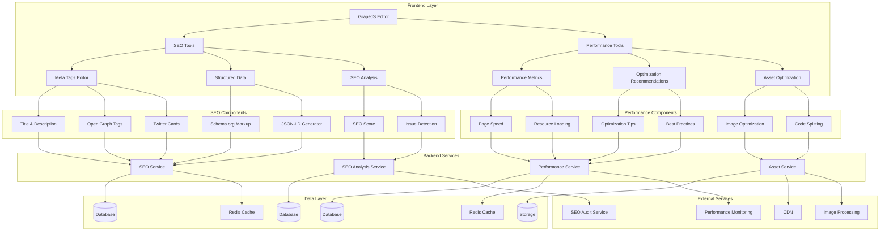

# SEO and Performance Optimization Tools Design

## Overview

This document outlines the design for implementing comprehensive SEO and performance optimization tools in the Vue.js Page Builder System. These tools will enable marketing administrators to optimize their pages for search engines, improve loading times, and ensure optimal user experience across devices.

## Architecture

### SEO and Performance Optimization System Architecture



## Core Components

### 1. SEO Tools

```typescript
interface SEOTools {
  // Meta tags management
  updateMetaTags(pageId: string, metaTags: MetaTags): Promise<void>
  getMetaTags(pageId: string): Promise<MetaTags>
  
  // Structured data
  generateStructuredData(pageId: string, type: StructuredDataType, data: any): Promise<string>
  validateStructuredData(jsonLd: string): Promise<ValidationResult>
  
  // SEO analysis
  analyzePageSEO(pageId: string): Promise<SEOAnalysis>
  getSEOScore(pageId: string): Promise<number>
  getSEOIssues(pageId: string): Promise<SEOIssue[]>
  
  // Sitemap integration
  addToSitemap(pageId: string): Promise<void>
  removeFromSitemap(pageId: string): Promise<void>
}

interface MetaTags {
  title: string
  description: string
  keywords: string[]
  author?: string
  robots?: string
  canonical?: string
  openGraph?: OpenGraphTags
  twitter?: TwitterTags
}

interface OpenGraphTags {
  title: string
  description: string
  image: string
  url: string
  type: string
  siteName: string
}

interface TwitterTags {
  card: string
  site: string
  title: string
  description: string
  image: string
}

type StructuredDataType = 
 'organization' | 'person' | 'article' | 'blogPosting' | 
  'product' | 'event' | 'review' | 'recipe' | 'faq'

interface SEOAnalysis {
  score: number
  issues: SEOIssue[]
  recommendations: Recommendation[]
  lastAnalyzed: Date
}

interface SEOIssue {
  id: string
  type: SEOIssueType
  severity: 'low' | 'medium' | 'high'
  message: string
  element?: string
  suggestions: string[]
}

type SEOIssueType = 
  'missing_title' | 'missing_description' | 'duplicate_content' | 
  'broken_links' | 'missing_alt_text' | 'slow_loading' | 
  'mobile_unfriendly' | 'missing_structured_data'

interface Recommendation {
  id: string
  title: string
  description: string
  priority: 'low' | 'medium' | 'high'
  implementation?: string
}

interface ValidationResult {
  isValid: boolean
  errors: ValidationError[]
  warnings: ValidationWarning[]
}

interface ValidationError {
  field: string
  message: string
  line?: number
}

interface ValidationWarning {
  field: string
  message: string
  line?: number
}
```

### 2. Performance Tools

```typescript
interface PerformanceTools {
  // Performance metrics
  measurePagePerformance(pageId: string): Promise<PerformanceMetrics>
  getPerformanceHistory(pageId: string, options?: HistoryOptions): Promise<PerformanceMetrics[]>
  
  // Optimization recommendations
  getOptimizationRecommendations(pageId: string): Promise<OptimizationRecommendation[]>
  applyOptimization(pageId: string, recommendationId: string): Promise<OptimizationResult>
  
  // Asset optimization
  optimizeImages(pageId: string, options?: ImageOptimizationOptions): Promise<OptimizationResult>
  minifyCSS(pageId: string): Promise<OptimizationResult>
  minifyJS(pageId: string): Promise<OptimizationResult>
  
  // Performance monitoring
  startPerformanceMonitoring(pageId: string): Promise<void>
  stopPerformanceMonitoring(pageId: string): Promise<void>
  getPerformanceAlerts(pageId: string): Promise<PerformanceAlert[]>
}

interface PerformanceMetrics {
  pageLoadTime: number
  firstContentfulPaint: number
  largestContentfulPaint: number
  cumulativeLayoutShift: number
  firstInputDelay: number
  speedIndex: number
  timeToInteractive: number
  resources: ResourceMetrics[]
  timestamp: Date
}

interface ResourceMetrics {
  url: string
  type: ResourceType
  size: number
  loadTime: number
  status: number
}

type ResourceType = 'script' | 'stylesheet' | 'image' | 'font' | 'other'

interface HistoryOptions {
  limit?: number
  startDate?: Date
  endDate?: Date
}

interface OptimizationRecommendation {
  id: string
  type: OptimizationType
  title: string
  description: string
 estimatedImprovement: number // percentage improvement
 effort: 'low' | 'medium' | 'high'
  priority: 'low' | 'medium' | 'high'
  implementation?: string
}

type OptimizationType = 
  'image_optimization' | 'code_splitting' | 'lazy_loading' | 
  'caching' | 'compression' | 'critical_css' | 'font_optimization'

interface OptimizationResult {
  success: boolean
  improvements: PerformanceImprovement[]
  errors: string[]
}

interface PerformanceImprovement {
  metric: string
  before: number
  after: number
  improvement: number
}

interface ImageOptimizationOptions {
  quality?: number
  format?: 'webp' | 'avif' | 'jpeg' | 'png'
  resize?: { width: number; height: number }
  compression?: 'lossy' | 'lossless'
}

interface PerformanceAlert {
  id: string
  type: AlertType
  severity: 'low' | 'medium' | 'high'
  message: string
  timestamp: Date
  recommendation?: string
}

type AlertType = 
  'slow_loading' | 'large_assets' | 'render_blocking' | 
  'unused_css' | 'unused_js' | 'poor_core_web_vitals'
}
```

## Implementation Details

### 1. SEO Tools Implementation

#### Meta Tags Management

```typescript
class MetaTagsManager {
  async updateMetaTags(pageId: string, metaTags: MetaTags): Promise<void> {
    try {
      const response = await fetch(`/api/pages/${pageId}/meta-tags`, {
        method: 'PUT',
        headers: {
          'Content-Type': 'application/json',
        },
        body: JSON.stringify(metaTags)
      })
      
      if (!response.ok) {
        throw new Error('Failed to update meta tags')
      }
      
      // Update page metadata in the editor
      this.updateEditorMetadata(pageId, metaTags)
    } catch (error) {
      console.error('Failed to update meta tags:', error)
      throw error
    }
  }
  
  async getMetaTags(pageId: string): Promise<MetaTags> {
    try {
      const response = await fetch(`/api/pages/${pageId}/meta-tags`)
      if (!response.ok) {
        throw new Error('Failed to fetch meta tags')
      }
      
      return await response.json()
    } catch (error) {
      console.error('Failed to fetch meta tags:', error)
      throw error
    }
  }
  
  private updateEditorMetadata(pageId: string, metaTags: MetaTags): void {
    // Update the GrapeJS editor with the new meta tags
    // This would typically involve updating the page's HTML head section
    console.log(`Updating meta tags for page ${pageId}:`, metaTags)
  }
}
```

#### Structured Data Generation

```typescript
class StructuredDataManager {
  async generateStructuredData(pageId: string, type: StructuredDataType, data: any): Promise<string> {
    try {
      const response = await fetch(`/api/pages/${pageId}/structured-data`, {
        method: 'POST',
        headers: {
          'Content-Type': 'application/json',
        },
        body: JSON.stringify({ type, data })
      })
      
      if (!response.ok) {
        throw new Error('Failed to generate structured data')
      }
      
      const result = await response.json()
      return result.jsonLd
    } catch (error) {
      console.error('Failed to generate structured data:', error)
      throw error
    }
  }
  
  async validateStructuredData(jsonLd: string): Promise<ValidationResult> {
    try {
      const response = await fetch('/api/structured-data/validate', {
        method: 'POST',
        headers: {
          'Content-Type': 'application/json',
        },
        body: JSON.stringify({ jsonLd })
      })
      
      if (!response.ok) {
        throw new Error('Failed to validate structured data')
      }
      
      return await response.json()
    } catch (error) {
      console.error('Failed to validate structured data:', error)
      throw error
    }
  }
  
  getSchemaTemplate(type: StructuredDataType): any {
    // Return a template for the specified schema type
    const templates: Record<StructuredDataType, any> = {
      organization: {
        '@context': 'https://schema.org',
        '@type': 'Organization',
        name: '',
        url: '',
        logo: '',
        sameAs: []
      },
      person: {
        '@context': 'https://schema.org',
        '@type': 'Person',
        name: '',
        jobTitle: '',
        worksFor: {
          '@type': 'Organization',
          name: ''
        }
      },
      article: {
        '@context': 'https://schema.org',
        '@type': 'Article',
        headline: '',
        description: '',
        author: {
          '@type': 'Person',
          name: ''
        },
        datePublished: '',
        dateModified: '',
        image: ''
      },
      blogPosting: {
        '@context': 'https://schema.org',
        '@type': 'BlogPosting',
        headline: '',
        description: '',
        author: {
          '@type': 'Person',
          name: ''
        },
        datePublished: '',
        dateModified: '',
        image: '',
        articleBody: ''
      },
      product: {
        '@context': 'https://schema.org',
        '@type': 'Product',
        name: '',
        description: '',
        image: '',
        offers: {
          '@type': 'Offer',
          price: '',
          priceCurrency: 'USD',
          availability: 'https://schema.org/InStock'
        }
      },
      event: {
        '@context': 'https://schema.org',
        '@type': 'Event',
        name: '',
        startDate: '',
        endDate: '',
        location: {
          '@type': 'Place',
          name: '',
          address: {
            '@type': 'PostalAddress',
            streetAddress: '',
            addressLocality: '',
            postalCode: '',
            addressRegion: '',
            addressCountry: ''
          }
        }
      },
      review: {
        '@context': 'https://schema.org',
        '@type': 'Review',
        itemReviewed: {
          '@type': 'Product',
          name: ''
        },
        reviewRating: {
          '@type': 'Rating',
          ratingValue: '',
          bestRating: '5'
        },
        author: {
          '@type': 'Person',
          name: ''
        },
        reviewBody: ''
      },
      recipe: {
        '@context': 'https://schema.org',
        '@type': 'Recipe',
        name: '',
        image: '',
        description: '',
        recipeIngredient: [],
        recipeInstructions: []
      },
      faq: {
        '@context': 'https://schema.org',
        '@type': 'FAQPage',
        mainEntity: []
      }
    }
    
    return templates[type] || {}
  }
}
```

#### SEO Analysis

```typescript
class SEOAnalyzer {
  async analyzePageSEO(pageId: string): Promise<SEOAnalysis> {
    try {
      const response = await fetch(`/api/pages/${pageId}/seo-analysis`, {
        method: 'POST'
      })
      
      if (!response.ok) {
        throw new Error('Failed to analyze page SEO')
      }
      
      return await response.json()
    } catch (error) {
      console.error('Failed to analyze page SEO:', error)
      throw error
    }
  }
  
  async getSEOScore(pageId: string): Promise<number> {
    try {
      const response = await fetch(`/api/pages/${pageId}/seo-score`)
      if (!response.ok) {
        throw new Error('Failed to get SEO score')
      }
      
      const result = await response.json()
      return result.score
    } catch (error) {
      console.error('Failed to get SEO score:', error)
      throw error
    }
  }
  
  async getSEOIssues(pageId: string): Promise<SEOIssue[]> {
    try {
      const response = await fetch(`/api/pages/${pageId}/seo-issues`)
      if (!response.ok) {
        throw new Error('Failed to get SEO issues')
      }
      
      return await response.json()
    } catch (error) {
      console.error('Failed to get SEO issues:', error)
      throw error
    }
  }
  
  private detectSEOIssues(pageData: any): SEOIssue[] {
    const issues: SEOIssue[] = []
    
    // Check for missing title
    if (!pageData.metaTags?.title) {
      issues.push({
        id: 'missing-title-' + Date.now(),
        type: 'missing_title',
        severity: 'high',
        message: 'Page is missing a title tag',
        suggestions: ['Add a descriptive title tag to improve SEO']
      })
    }
    
    // Check for missing description
    if (!pageData.metaTags?.description) {
      issues.push({
        id: 'missing-description-' + Date.now(),
        type: 'missing_description',
        severity: 'high',
        message: 'Page is missing a meta description',
        suggestions: ['Add a compelling meta description to improve click-through rates']
      })
    }
    
    // Check for images without alt text
    const imagesWithoutAlt = this.findImagesWithoutAltText(pageData.html)
    if (imagesWithoutAlt.length > 0) {
      issues.push({
        id: 'missing-alt-text-' + Date.now(),
        type: 'missing_alt_text',
        severity: 'medium',
        message: `${imagesWithoutAlt.length} images are missing alt text`,
        suggestions: ['Add descriptive alt text to all images for accessibility and SEO']
      })
    }
    
    // Check for broken links
    const brokenLinks = this.findBrokenLinks(pageData.html)
    if (brokenLinks.length > 0) {
      issues.push({
        id: 'broken-links-' + Date.now(),
        type: 'broken_links',
        severity: 'medium',
        message: `${brokenLinks.length} links appear to be broken`,
        suggestions: ['Fix or remove broken links to improve user experience']
      })
    }
    
    return issues
  }
  
  private findImagesWithoutAltText(html: string): string[] {
    // Simple regex to find images without alt attributes
    // In a real implementation, this would use a proper HTML parser
    const imgRegex = /]*\balt\b)[^>]*>/gi
    const matches = html.match(imgRegex) || []
    return matches
  }
  
  private findBrokenLinks(html: string): string[] {
    // Simple regex to find links
    // In a real implementation, this would check link status
    const linkRegex = /<a\s+(?:[^>]*?\s+)?href=(["'])(.*?)\1/gi
    const matches = []
    let match
    while ((match = linkRegex.exec(html)) !== null) {
      matches.push(match[2])
    }
    return matches
  }
}
```

### 2. Performance Tools Implementation

#### Performance Metrics Collection

```typescript
class PerformanceMetricsCollector {
  async measurePagePerformance(pageId: string): Promise<PerformanceMetrics> {
    try {
      // In a real implementation, this would use the Navigation Timing API
      // and Resource Timing API to collect actual performance metrics
      // For now, we'll return mock data
      
      return {
        pageLoadTime: Math.random() * 3000 + 1000, // 1-4 seconds
        firstContentfulPaint: Math.random() * 2000 + 500, // 0.5-2.5 seconds
        largestContentfulPaint: Math.random() * 3000 + 1000, // 1-4 seconds
        cumulativeLayoutShift: Math.random() * 0.1, // 0-0.1
        firstInputDelay: Math.random() * 50, // 0-50ms
        speedIndex: Math.random() * 2000 + 1000, // 1-3 seconds
        timeToInteractive: Math.random() * 3000 + 1000, // 1-4 seconds
        resources: this.generateMockResources(),
        timestamp: new Date()
      }
    } catch (error) {
      console.error('Failed to measure page performance:', error)
      throw error
    }
  }
  
  async getPerformanceHistory(pageId: string, options?: HistoryOptions): Promise<PerformanceMetrics[]> {
    try {
      const params = new URLSearchParams()
      if (options?.limit) params.append('limit', options.limit.toString())
      if (options?.startDate) params.append('startDate', options.startDate.toISOString())
      if (options?.endDate) params.append('endDate', options.endDate.toISOString())
      
      const response = await fetch(`/api/pages/${pageId}/performance-history?${params.toString()}`)
      if (!response.ok) {
        throw new Error('Failed to fetch performance history')
      }
      
      return await response.json()
    } catch (error) {
      console.error('Failed to fetch performance history:', error)
      throw error
    }
  }
  
  private generateMockResources(): ResourceMetrics[] {
    const types: ResourceType[] = ['script', 'stylesheet', 'image', 'font', 'other']
    const resources: ResourceMetrics[] = []
    
    for (let i = 0; i < 10; i++) {
      resources.push({
        url: `https://example.com/resource-${i}.${this.getRandomExtension()}`,
        type: types[Math.floor(Math.random() * types.length)],
        size: Math.floor(Math.random() * 1000000), // 0-1MB
        loadTime: Math.random() * 1000, // 0-1 second
        status: Math.random() > 0.1 ? 200 : 404 // 90% success rate
      })
    }
    
    return resources
  }
  
  private getRandomExtension(): string {
    const extensions = ['js', 'css', 'png', 'jpg', 'gif', 'woff', 'woff2']
    return extensions[Math.floor(Math.random() * extensions.length)]
  }
}
```

#### Optimization Recommendations

```typescript
class OptimizationRecommender {
  async getOptimizationRecommendations(pageId: string): Promise<OptimizationRecommendation[]> {
    try {
      const response = await fetch(`/api/pages/${pageId}/optimization-recommendations`)
      if (!response.ok) {
        throw new Error('Failed to get optimization recommendations')
      }
      
      return await response.json()
    } catch (error) {
      console.error('Failed to get optimization recommendations:', error)
      throw error
    }
  }
  
  async applyOptimization(pageId: string, recommendationId: string): Promise<OptimizationResult> {
    try {
      const response = await fetch(`/api/pages/${pageId}/apply-optimization`, {
        method: 'POST',
        headers: {
          'Content-Type': 'application/json',
        },
        body: JSON.stringify({ recommendationId })
      })
      
      if (!response.ok) {
        throw new Error('Failed to apply optimization')
      }
      
      return await response.json()
    } catch (error) {
      console.error('Failed to apply optimization:', error)
      throw error
    }
  }
  
  private generateRecommendations(pageData: any): OptimizationRecommendation[] {
    const recommendations: OptimizationRecommendation[] = []
    
    // Check for large images
    const largeImages = this.findLargeImages(pageData.resources)
    if (largeImages.length > 0) {
      recommendations.push({
        id: 'optimize-images-' + Date.now(),
        type: 'image_optimization',
        title: 'Optimize Images',
        description: `${largeImages.length} images are larger than 500KB and could be compressed`,
        estimatedImprovement: 15,
        effort: 'low',
        priority: 'high'
      })
    }
    
    // Check for render-blocking resources
    const blockingResources = this.findRenderBlockingResources(pageData.resources)
    if (blockingResources.length > 0) {
      recommendations.push({
        id: 'defer-resources-' + Date.now(),
        type: 'code_splitting',
        title: 'Defer Non-Critical Resources',
        description: `${blockingResources.length} resources are blocking page render`,
        estimatedImprovement: 20,
        effort: 'medium',
        priority: 'high'
      })
    }
    
    // Check for unused CSS/JS
    recommendations.push({
      id: 'remove-unused-code-' + Date.now(),
      type: 'code_splitting',
      title: 'Remove Unused CSS/JS',
      description: 'Analyze and remove unused CSS and JavaScript to reduce bundle size',
      estimatedImprovement: 10,
      effort: 'high',
      priority: 'medium'
    })
    
    return recommendations
  }
  
  private findLargeImages(resources: ResourceMetrics[]): ResourceMetrics[] {
    return resources.filter(r => r.type === 'image' && r.size > 500000) // 500KB
  }
  
  private findRenderBlockingResources(resources: ResourceMetrics[]): ResourceMetrics[] {
    // In a real implementation, this would analyze resource loading behavior
    // For now, we'll just return scripts loaded in the head
    return resources.filter(r => r.type === 'script' && r.loadTime > 100)
  }
}
```

#### Asset Optimization

```typescript
class AssetOptimizer {
  async optimizeImages(pageId: string, options?: ImageOptimizationOptions): Promise<OptimizationResult> {
    try {
      const response = await fetch(`/api/pages/${pageId}/optimize-images`, {
        method: 'POST',
        headers: {
          'Content-Type': 'application/json',
        },
        body: JSON.stringify({ options })
      })
      
      if (!response.ok) {
        throw new Error('Failed to optimize images')
      }
      
      return await response.json()
    } catch (error) {
      console.error('Failed to optimize images:', error)
      throw error
    }
  }
  
  async minifyCSS(pageId: string): Promise<OptimizationResult> {
    try {
      const response = await fetch(`/api/pages/${pageId}/minify-css`, {
        method: 'POST'
      })
      
      if (!response.ok) {
        throw new Error('Failed to minify CSS')
      }
      
      return await response.json()
    } catch (error) {
      console.error('Failed to minify CSS:', error)
      throw error
    }
  }
  
  async minifyJS(pageId: string): Promise<OptimizationResult> {
    try {
      const response = await fetch(`/api/pages/${pageId}/minify-js`, {
        method: 'POST'
      })
      
      if (!response.ok) {
        throw new Error('Failed to minify JS')
      }
      
      return await response.json()
    } catch (error) {
      console.error('Failed to minify JS:', error)
      throw error
    }
  }
  
  private async processImage(imageUrl: string, options: ImageOptimizationOptions): Promise<Blob> {
    // In a real implementation, this would call an image processing service
    // For now, we'll just return a mock blob
    console.log(`Processing image ${imageUrl} with options:`, options)
    return new Blob(['optimized-image-data'], { type: 'image/webp' })
  }
  
  private async minifyCSSContent(css: string): Promise<string> {
    // In a real implementation, this would use a CSS minification library
    // For now, we'll just remove extra whitespace
    return css.replace(/\s+/g, ').trim()
  }
  
  private async minifyJSContent(js: string): Promise<string> {
    // In a real implementation, this would use a JS minification library
    // For now, we'll just remove extra whitespace
    return js.replace(/\s+/g, ' ').trim()
  }
}
```

## Integration with Vue Wrapper Component

### SEO Tools Integration

```vue
<script setup lang="ts">
import { ref, computed, watch } from 'vue'
import { useSEO } from '@/composables/useSEO'
import type { MetaTags, SEOAnalysis, SEOIssue } from '@/types/seo'

const { 
  updateMetaTags,
  getMetaTags,
  generateStructuredData,
  validateStructuredData,
  analyzePageSEO,
  getSEOScore,
  getSEOIssues
} = useSEO()

const selectedPageId = ref<string | null>(null)
const metaTags = ref<MetaTags>({
  title: '',
  description: '',
  keywords: [],
  author: '',
  robots: 'index, follow'
})
const seoScore = ref(0)
const seoIssues = ref<SEOIssue[]>([])
const seoAnalysis = ref<SEOAnalysis | null>(null)
const showSEOPanel = ref(true)

// Computed properties
const seoGrade = computed(() => {
  if (seoScore.value >= 90) return 'A'
 if (seoScore.value >= 80) return 'B'
  if (seoScore.value >= 70) return 'C'
  if (seoScore.value >= 60) return 'D'
  return 'F'
})

const criticalIssues = computed(() => {
  return seoIssues.value.filter(issue => issue.severity === 'high')
})

// Watch for page selection changes
watch(selectedPageId, async (newId) => {
  if (newId) {
    await loadSEOMetaTags(newId)
    await loadSEOAnalysis(newId)
 }
})

// Methods
const loadSEOMetaTags = async (pageId: string) => {
  try {
    metaTags.value = await getMetaTags(pageId)
  } catch (error) {
    console.error('Failed to load SEO meta tags:', error)
  }
}

const saveSEOMetaTags = async () => {
 if (!selectedPageId.value) return
  
  try {
    await updateMetaTags(selectedPageId.value, metaTags.value)
    alert('SEO meta tags saved successfully!')
  } catch (error) {
    console.error('Failed to save SEO meta tags:', error)
    alert('Failed to save SEO meta tags')
  }
}

const generatePageSchema = async (schemaType: string, schemaData: any) => {
  if (!selectedPageId.value) return
  
  try {
    const jsonLd = await generateStructuredData(selectedPageId.value, schemaType as any, schemaData)
    // Add the JSON-LD to the page
    console.log('Generated structured data:', jsonLd)
    alert('Structured data generated successfully!')
  } catch (error) {
    console.error('Failed to generate structured data:', error)
    alert('Failed to generate structured data')
  }
}

const validatePageSchema = async (jsonLd: string) => {
  try {
    const result = await validateStructuredData(jsonLd)
    if (result.isValid) {
      alert('Structured data is valid!')
    } else {
      alert(`Structured data has ${result.errors.length} errors and ${result.warnings.length} warnings`)
    }
    return result
  } catch (error) {
    console.error('Failed to validate structured data:', error)
    alert('Failed to validate structured data')
  }
}

const loadSEOAnalysis = async (pageId: string) => {
  try {
    seoAnalysis.value = await analyzePageSEO(pageId)
    seoScore.value = await getSEOScore(pageId)
    seoIssues.value = await getSEOIssues(pageId)
  } catch (error) {
    console.error('Failed to load SEO analysis:', error)
  }
}

const refreshSEOAnalysis = async () => {
  if (!selectedPageId.value) return
  
  try {
    await loadSEOAnalysis(selectedPageId.value)
    alert('SEO analysis refreshed!')
  } catch (error) {
    console.error('Failed to refresh SEO analysis:', error)
    alert('Failed to refresh SEO analysis')
  }
}

const fixSEOIssue = async (issueId: string) => {
  // Implementation would depend on the specific issue
  console.log(`Fixing SEO issue ${issueId}`)
  // After fixing, refresh the analysis
  if (selectedPageId.value) {
    await loadSEOAnalysis(selectedPageId.value)
  }
}
</script>
```

### Performance Tools Integration

```vue
<script setup lang="ts">
import { ref, computed } from 'vue'
import { usePerformance } from '@/composables/usePerformance'
import type { 
  PerformanceMetrics, 
  OptimizationRecommendation, 
 PerformanceAlert 
} from '@/types/performance'

const { 
  measurePagePerformance,
  getPerformanceHistory,
  getOptimizationRecommendations,
  applyOptimization,
  optimizeImages,
  minifyCSS,
  minifyJS,
  startPerformanceMonitoring,
  stopPerformanceMonitoring,
  getPerformanceAlerts
} = usePerformance()

const selectedPageId = ref<string | null>(null)
const currentMetrics = ref<PerformanceMetrics | null>(null)
const performanceHistory = ref<PerformanceMetrics[]>([])
const optimizationRecommendations = ref<OptimizationRecommendation[]>([])
const performanceAlerts = ref<PerformanceAlert[]>([])
const isMonitoring = ref(false)
const showPerformancePanel = ref(true)

// Computed properties
const overallPerformanceScore = computed(() => {
  if (!currentMetrics.value) return 0
  
  // Simple scoring based on Core Web Vitals
  const lcpScore = Math.max(0, 100 - (currentMetrics.value.largestContentfulPaint / 25))
  const clsScore = Math.max(0, 100 - (currentMetrics.value.cumulativeLayoutShift * 1000))
  const fidScore = Math.max(0, 100 - (currentMetrics.value.firstInputDelay / 0.1))
  
  return Math.round((lcpScore + clsScore + fidScore) / 3)
})

const performanceGrade = computed(() => {
  const score = overallPerformanceScore.value
  if (score >= 90) return 'A'
  if (score >= 80) return 'B'
  if (score >= 70) return 'C'
  if (score >= 60) return 'D'
  return 'F'
})

const highPriorityRecommendations = computed(() => {
  return optimizationRecommendations.value.filter(r => r.priority === 'high')
})

// Methods
const measureCurrentPerformance = async () => {
  if (!selectedPageId.value) return
  
  try {
    currentMetrics.value = await measurePagePerformance(selectedPageId.value)
    alert('Performance metrics measured successfully!')
  } catch (error) {
    console.error('Failed to measure performance:', error)
    alert('Failed to measure performance')
  }
}

const loadPerformanceHistory = async () => {
  if (!selectedPageId.value) return
  
  try {
    performanceHistory.value = await getPerformanceHistory(selectedPageId.value, { limit: 20 })
  } catch (error) {
    console.error('Failed to load performance history:', error)
  }
}

const loadOptimizationRecommendations = async () => {
  if (!selectedPageId.value) return
  
  try {
    optimizationRecommendations.value = await getOptimizationRecommendations(selectedPageId.value)
 } catch (error) {
    console.error('Failed to load optimization recommendations:', error)
  }
}

const applyOptimizationRecommendation = async (recommendationId: string) => {
  if (!selectedPageId.value) return
  
  try {
    const result = await applyOptimization(selectedPageId.value, recommendationId)
    if (result.success) {
      alert('Optimization applied successfully!')
      // Refresh metrics and recommendations
      await measureCurrentPerformance()
      await loadOptimizationRecommendations()
    } else {
      alert(`Optimization failed: ${result.errors.join(', ')}`)
    }
  } catch (error) {
    console.error('Failed to apply optimization:', error)
    alert('Failed to apply optimization')
  }
}

const optimizePageImages = async () => {
  if (!selectedPageId.value) return
  
  try {
    const result = await optimizeImages(selectedPageId.value, {
      quality: 80,
      format: 'webp'
    })
    if (result.success) {
      alert('Images optimized successfully!')
    } else {
      alert(`Image optimization failed: ${result.errors.join(', ')}`)
    }
  } catch (error) {
    console.error('Failed to optimize images:', error)
    alert('Failed to optimize images')
  }
}

const minifyPageAssets = async () => {
  if (!selectedPageId.value) return
  
  try {
    const cssResult = await minifyCSS(selectedPageId.value)
    const jsResult = await minifyJS(selectedPageId.value)
    
    if (cssResult.success && jsResult.success) {
      alert('CSS and JS minified successfully!')
    } else {
      const errors = [...cssResult.errors, ...jsResult.errors]
      alert(`Asset minification failed: ${errors.join(', ')}`)
    }
  } catch (error) {
    console.error('Failed to minify assets:', error)
    alert('Failed to minify assets')
  }
}

const togglePerformanceMonitoring = async () => {
  if (!selectedPageId.value) return
  
  try {
    if (isMonitoring.value) {
      await stopPerformanceMonitoring(selectedPageId.value)
      alert('Performance monitoring stopped')
    } else {
      await startPerformanceMonitoring(selectedPageId.value)
      alert('Performance monitoring started')
    }
    isMonitoring.value = !isMonitoring.value
  } catch (error) {
    console.error('Failed to toggle performance monitoring:', error)
    alert('Failed to toggle performance monitoring')
  }
}

const loadPerformanceAlerts = async () => {
  if (!selectedPageId.value) return
  
  try {
    performanceAlerts.value = await getPerformanceAlerts(selectedPageId.value)
 } catch (error) {
    console.error('Failed to load performance alerts:', error)
  }
}
</script>
```

## Performance Optimization

### 1. SEO Data Caching

```typescript
class SEODataCache {
 private cache: Map<string, { data: any; timestamp: number }> = new Map()
  private cacheTimeout = 10 * 60 * 1000 // 10 minutes
  
  get(key: string): any {
    const cached = this.cache.get(key)
    if (cached && (Date.now() - cached.timestamp) < this.cacheTimeout) {
      return cached.data
    }
    
    return null
  }
  
  set(key: string, data: any): void {
    this.cache.set(key, {
      data,
      timestamp: Date.now()
    })
  }
  
  clear(key: string): void {
    this.cache.delete(key)
  }
  
  clearExpired(): void {
    const now = Date.now()
    for (const [key, value] of this.cache.entries()) {
      if ((now - value.timestamp) >= this.cacheTimeout) {
        this.cache.delete(key)
      }
    }
  }
  
  clearAll(): void {
    this.cache.clear()
  }
}
```

### 2. Performance Metrics Batching

```typescript
class PerformanceMetricsBatcher {
  private pendingMetrics: PerformanceMetrics[] = []
  private batchTimer: number | null = null
  private batchSize = 5
  
  queueMetrics(metrics: PerformanceMetrics): void {
    this.pendingMetrics.push(metrics)
    
    if (this.pendingMetrics.length >= this.batchSize) {
      this.processBatch()
    } else if (!this.batchTimer) {
      this.batchTimer = setTimeout(() => {
        this.processBatch()
      }, 5000) // Process batch after 5 seconds of inactivity
    }
  }
  
  private async processBatch(): Promise<void> {
    if (this.batchTimer) {
      clearTimeout(this.batchTimer)
      this.batchTimer = null
    }
    
    if (this.pendingMetrics.length === 0) return
    
    try {
      const response = await fetch('/api/performance-metrics/batch', {
        method: 'POST',
        headers: {
          'Content-Type': 'application/json',
        },
        body: JSON.stringify({ metrics: this.pendingMetrics })
      })
      
      if (!response.ok) {
        throw new Error('Failed to save performance metrics batch')
      }
      
      // Clear processed metrics
      this.pendingMetrics = []
    } catch (error) {
      console.error('Failed to process performance metrics batch:', error)
      // In a real implementation, we might want to retry or queue failed batches
    }
  }
}
```

## Error Handling and Recovery

### 1. SEO Error Handling

```typescript
class SEOErrorHandler {
  handleMetaTagsError(error: Error, pageId: string): void {
    console.error(`Failed to update meta tags for page ${pageId}:`, error)
    
    // Show user-friendly error message
    // Suggest validation or alternative actions
  }
  
  handleStructuredDataError(error: Error, pageId: string): void {
    console.error(`Failed to generate structured data for page ${pageId}:`, error)
    
    // Show user-friendly error message
    // Suggest schema validation or template usage
  }
  
  handleSEOAnalysisError(error: Error, pageId: string): void {
    console.error(`Failed to analyze SEO for page ${pageId}:`, error)
    
    // Show error and suggest manual analysis
  }
}
```

### 2. Performance Error Handling

```typescript
class PerformanceErrorHandler {
  handleMetricsCollectionError(error: Error, pageId: string): void {
    console.error(`Failed to collect performance metrics for page ${pageId}:`, error)
    
    // Show user-friendly error message
    // Suggest manual testing or alternative metrics
  }
  
  handleOptimizationError(error: Error, pageId: string, optimizationType: string): void {
    console.error(`Failed to apply ${optimizationType} optimization for page ${pageId}:`, error)
    
    // Show error and suggest alternative optimizations
  }
  
  handleAssetOptimizationError(error: Error, pageId: string, assetType: string): void {
    console.error(`Failed to optimize ${assetType} for page ${pageId}:`, error)
    
    // Show error and suggest manual optimization
  }
}
```

## Testing Strategy

### Unit Tests

1. Meta tags management and validation
2. Structured data generation and validation
3. SEO analysis and issue detection
4. Performance metrics collection
5. Optimization recommendation generation
6. Asset optimization functions
7. SEO and performance data caching

### Integration Tests

1. SEO tools with GrapeJS integration
2. Performance tools with asset processing
3. SEO analysis with page content
4. Performance optimization with real assets
5. Structured data validation with schema.org
6. Meta tags rendering in page head
7. Performance monitoring integration

### End-to-End Tests

1. Complete SEO workflow from analysis to optimization
2. Performance optimization from metrics to improvements
3. Structured data implementation and validation
4. Meta tags management and rendering
5. Performance monitoring with alerts
6. SEO issue resolution and re-analysis
7. Asset optimization with before/after comparison

## Implementation Plan

### Phase 1: Core Infrastructure
- Implement meta tags management system
- Create structured data generation capabilities
- Set up SEO analysis engine
- Implement performance metrics collection

### Phase 2: Optimization Features
- Create optimization recommendation system
- Implement asset optimization tools
- Set up performance monitoring
- Add SEO issue detection and resolution

### Phase 3: Vue Integration
- Integrate SEO tools with Vue wrapper
- Add performance tools to Vue component
- Implement real-time SEO analysis
- Add performance visualization

### Phase 4: Performance Optimization
- Add SEO data caching
- Implement performance metrics batching
- Optimize asset processing
- Add lazy loading for analysis data

### Phase 5: Error Handling and Testing
- Implement comprehensive error handling
- Add recovery mechanisms
- Create unit tests
- Add integration tests

### Phase 6: Advanced Features
- Add advanced SEO algorithms
- Implement predictive performance optimization
- Add collaborative SEO features
- Add performance analytics dashboard

## Dependencies

- `grapesjs` - Core page builder engine
- `vue` - Vue.js framework
- `pinia` - State management
- `schema-dts` - TypeScript definitions for Schema.org
- `lighthouse` - Web performance auditing
- `imagemin` - Image optimization library
- `terser` - JavaScript minification
- `clean-css` - CSS minification

## Security Considerations

- Validate all SEO meta tag inputs
- Sanitize structured data content
- Implement proper access controls for SEO tools
- Protect against XSS in meta tags
- Validate performance metrics data
- Implement rate limiting for optimization requests
- Encrypt sensitive SEO configuration data
- Validate user permissions for performance tools