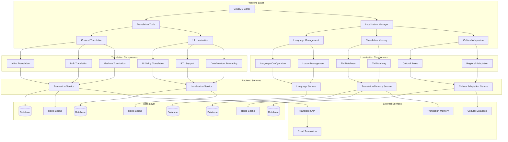

# Multi-Language Support System Design

## Overview

This document outlines the design for implementing a comprehensive multi-language support system in the Vue.js Page Builder System. This system will enable marketing administrators to create, manage, and publish content in multiple languages, supporting global marketing campaigns and internationalization efforts.

## Architecture

### Multi-Language Support System Architecture



## Core Components

### 1. Translation Tools

```typescript
interface TranslationTools {
  // Content translation
  translateContent(contentId: string, targetLanguage: string, options?: TranslationOptions): Promise<TranslationResult>
  translateMultipleContents(contentIds: string[], targetLanguage: string, options?: TranslationOptions): Promise<TranslationResult[]>
  getTranslationStatus(contentId: string): Promise<TranslationStatus>
  updateTranslation(contentId: string, language: string, translation: TranslationUpdate): Promise<void>
  
  // UI localization
  translateUIString(stringId: string, targetLanguage: string, options?: TranslationOptions): Promise<UITranslationResult>
  getUISupportedLanguages(): Promise<SupportedLanguage[]>
  setUILanguage(language: string): Promise<void>
  
  // Machine translation
  requestMachineTranslation(text: string, sourceLanguage: string, targetLanguage: string): Promise<MachineTranslationResult>
  getTranslationSuggestions(text: string, sourceLanguage: string, targetLanguages: string[]): Promise<TranslationSuggestion[]>
  
  // Translation memory
  addToTranslationMemory(entry: TranslationMemoryEntry): Promise<void>
  searchTranslationMemory(query: string, languagePair: LanguagePair): Promise<TranslationMemoryMatch[]>
  getTranslationMemoryStats(): Promise<TranslationMemoryStats>
}

interface TranslationOptions {
  preserveFormatting?: boolean
  preservePlaceholders?: boolean
  useTranslationMemory?: boolean
  useMachineTranslation?: boolean
  qualityThreshold?: number
  context?: TranslationContext
}

interface TranslationContext {
  domain?: string
  industry?: string
  tone?: TranslationTone
  audience?: string
}

type TranslationTone = 'formal' | 'casual' | 'technical' | 'marketing' | 'creative'

interface TranslationResult {
  contentId: string
  sourceLanguage: string
  targetLanguage: string
  translatedContent: string
  qualityScore: number
  sourceWordCount: number
  translatedWordCount: number
  translationMethod: TranslationMethod
  suggestions?: TranslationSuggestion[]
  createdAt: Date
  updatedAt: Date
}

type TranslationMethod = 'human' | 'machine' | 'tm_match' | 'hybrid'

interface TranslationStatus {
  contentId: string
  languages: LanguageStatus[]
  overallProgress: number
  lastUpdated: Date
}

interface LanguageStatus {
  language: string
  status: TranslationStatusType
  progress: number
  wordCount: number
  lastTranslated: Date
  translator?: string
}

type TranslationStatusType = 'not_started' | 'in_progress' | 'completed' | 'needs_review'

interface TranslationUpdate {
  content: string
  status?: TranslationStatusType
  notes?: string
  reviewedBy?: string
  reviewedAt?: Date
}

interface UITranslationResult {
  stringId: string
  translations: Record<string, string>
  defaultLanguage: string
  supportedLanguages: string[]
}

interface SupportedLanguage {
  code: string
  name: string
  nativeName: string
  direction: TextDirection
  dateFormat: string
  numberFormat: NumberFormat
}

type TextDirection = 'ltr' | 'rtl'

interface NumberFormat {
  decimalSeparator: string
  thousandsSeparator: string
  currencySymbol: string
  currencyPosition: 'before' | 'after'
}

interface MachineTranslationResult {
  sourceText: string
  translatedText: string
  sourceLanguage: string
  targetLanguage: string
  qualityScore: number
  confidence: number
  detectedLanguage?: string
  alternatives?: TranslationAlternative[]
}

interface TranslationAlternative {
  text: string
  qualityScore: number
  confidence: number
}

interface TranslationSuggestion {
  text: string
  language: string
  qualityScore: number
  source: TranslationSource
  matchPercentage?: number
}

type TranslationSource = 'translation_memory' | 'machine_translation' | 'crowdsourced' | 'professional'

interface TranslationMemoryEntry {
  sourceText: string
  targetText: string
  sourceLanguage: string
  targetLanguage: string
  context?: string
  domain?: string
  createdAt: Date
  createdBy: string
  qualityScore: number
  usageCount: number
}

interface LanguagePair {
  source: string
  target: string
}

interface TranslationMemoryMatch {
  sourceText: string
  targetText: string
  qualityScore: number
  matchPercentage: number
  context?: string
  createdAt: Date
}

interface TranslationMemoryStats {
  totalEntries: number
  languagesSupported: number
  lastUpdated: Date
  topLanguages: LanguageUsage[]
  qualityDistribution: QualityDistribution
}

interface LanguageUsage {
  language: string
  entryCount: number
  usagePercentage: number
}

interface QualityDistribution {
  high: number // 90-100%
  medium: number // 70-89%
  low: number // 0-69%
}
```

### 2. Localization Manager

```typescript
interface LocalizationManager {
  // Language management
  addLanguage(language: LanguageConfig): Promise<Language>
  removeLanguage(languageCode: string): Promise<void>
  getLanguages(): Promise<Language[]>
  getLanguage(languageCode: string): Promise<Language>
  updateLanguage(languageCode: string, config: LanguageConfig): Promise<Language>
  setDefaultLanguage(languageCode: string): Promise<void>
  getDefaultLanguage(): Promise<Language>
  
  // Locale management
  configureLocale(locale: LocaleConfig): Promise<Locale>
  getLocale(localeCode: string): Promise<Locale>
  getLocales(): Promise<Locale[]>
  updateLocale(localeCode: string, config: LocaleConfig): Promise<Locale>
  
  // Cultural adaptation
  applyCulturalRules(content: string, targetLocale: string): Promise<string>
  getCulturalAdaptationRules(locale: string): Promise<CulturalRule[]>
  addCulturalRule(rule: CulturalRule): Promise<void>
  
  // Regional adaptation
  adaptForRegion(content: string, region: string): Promise<string>
  getRegionalAdaptations(region: string): Promise<RegionalAdaptation[]>
  addRegionalAdaptation(adaptation: RegionalAdaptation): Promise<void>
}

interface LanguageConfig {
  code: string
  name: string
  nativeName: string
  direction: TextDirection
  dateFormat: string
  timeFormat: string
  numberFormat: NumberFormat
  currency: CurrencyConfig
  isActive: boolean
  isDefault: boolean
}

interface CurrencyConfig {
  code: string
  symbol: string
  name: string
  decimalPlaces: number
  position: 'before' | 'after'
}

interface Language {
  id: string
  config: LanguageConfig
  createdAt: Date
  updatedAt: Date
  createdBy: string
  updatedBy: string
}

interface LocaleConfig {
  code: string
  language: string
  country: string
  region?: string
  variant?: string
  displayName: string
  isActive: boolean
}

interface Locale {
  id: string
  config: LocaleConfig
  language: Language
  culturalRules: CulturalRule[]
  regionalAdaptations: RegionalAdaptation[]
  createdAt: Date
  updatedAt: Date
  createdBy: string
  updatedBy: string
}

interface CulturalRule {
  id: string
  locale: string
  type: CulturalRuleType
  pattern: string
  replacement: string
  priority: number
  isActive: boolean
  createdAt: Date
  updatedAt: Date
}

type CulturalRuleType = 
  'date_format' | 'number_format' | 'currency_format' | 
  'text_direction' | 'color_preference' | 'image_style' | 
  'layout_preference' | 'content_structure' | 'tone_adaptation'

interface RegionalAdaptation {
  id: string
  locale: string
  region: string
  adaptations: AdaptationRule[]
  isActive: boolean
  createdAt: Date
  updatedAt: Date
}

interface AdaptationRule {
  type: AdaptationType
  selector: string
  properties: Record<string, any>
  condition?: string
}

type AdaptationType = 
  'style_override' | 'content_replacement' | 'layout_adjustment' | 
  'image_swap' | 'color_scheme' | 'typography_change'
}
```

## Implementation Details

### 1. Content Translation Implementation

#### Inline Translation

```typescript
class InlineTranslator {
  private translationCache: Map<string, TranslationCacheEntry> = new Map()
  private translationQueue: TranslationRequest[] = []
  private isProcessing = false
  
  async translateContent(contentId: string, targetLanguage: string, options?: TranslationOptions): Promise<TranslationResult> {
    // Check cache first
    const cacheKey = `${contentId}-${targetLanguage}`
    const cached = this.translationCache.get(cacheKey)
    if (cached && !this.isCacheExpired(cached)) {
      return cached.result
    }
    
    // Get content to translate
    const content = await this.getContent(contentId)
    if (!content) {
      throw new Error(`Content with ID ${contentId} not found`)
    }
    
    // Prepare translation request
    const translationRequest: TranslationRequest = {
      id: this.generateId(),
      contentId,
      sourceText: content.text,
      sourceLanguage: content.language,
      targetLanguage,
      options: options || {},
      status: 'pending',
      createdAt: new Date(),
      requestedBy: 'current-user' // Would come from auth context
    }
    
    this.translationQueue.push(translationRequest)
    
    // Process translation asynchronously
    this.processTranslationQueue()
    
    // Create translation result
    const translationResult: TranslationResult = {
      contentId,
      sourceLanguage: content.language,
      targetLanguage,
      translatedContent: '', // Will be filled later
      qualityScore: 0,
      sourceWordCount: this.getWordCount(content.text),
      translatedWordCount: 0,
      translationMethod: 'machine',
      createdAt: new Date(),
      updatedAt: new Date()
    }
    
    // Save to backend
    try {
      const response = await fetch('/api/translations', {
        method: 'POST',
        headers: {
          'Content-Type': 'application/json',
        },
        body: JSON.stringify(translationResult)
      })
      
      if (!response.ok) {
        throw new Error('Failed to create translation record')
      }
      
      console.log(`Translation request created for content ${contentId} to ${targetLanguage}`)
      return translationResult
    } catch (error) {
      console.error('Failed to create translation record:', error)
      throw error
    }
  }
  
  async translateMultipleContents(contentIds: string[], targetLanguage: string, options?: TranslationOptions): Promise<TranslationResult[]> {
    const results: TranslationResult[] = []
    
    // Process translations in parallel with controlled concurrency
    const concurrencyLimit = 5
    const batches = this.createBatches(contentIds, concurrencyLimit)
    
    for (const batch of batches) {
      const batchPromises = batch.map(id => 
        this.translateContent(id, targetLanguage, options)
      )
      
      try {
        const batchResults = await Promise.all(batchPromises)
        results.push(...batchResults)
      } catch (error) {
        console.error('Failed to translate batch:', error)
        // Continue with other batches
      }
    }
    
    return results
  }
  
  async getTranslationStatus(contentId: string): Promise<TranslationStatus> {
    try {
      const response = await fetch(`/api/content/${contentId}/translation-status`)
      if (!response.ok) {
        throw new Error('Failed to fetch translation status')
      }
      
      return await response.json()
    } catch (error) {
      console.error('Failed to fetch translation status:', error)
      throw error
    }
  }
  
  async updateTranslation(contentId: string, language: string, translation: TranslationUpdate): Promise<void> {
    try {
      const response = await fetch(`/api/content/${contentId}/translations/${language}`, {
        method: 'PUT',
        headers: {
          'Content-Type': 'application/json',
        },
        body: JSON.stringify(translation)
      })
      
      if (!response.ok) {
        throw new Error('Failed to update translation')
      }
      
      // Update cache
      const cacheKey = `${contentId}-${language}`
      this.translationCache.delete(cacheKey)
      
      console.log(`Translation updated for content ${contentId} in ${language}`)
    } catch (error) {
      console.error('Failed to update translation:', error)
      throw error
    }
  }
  
  private async processTranslationQueue(): Promise<void> {
    if (this.isProcessing || this.translationQueue.length === 0) {
      return
    }
    
    this.isProcessing = true
    
    try {
      while (this.translationQueue.length > 0) {
        const request = this.translationQueue.shift()
        if (request) {
          await this.processTranslationRequest(request)
        }
        
        // Small delay to prevent overwhelming the system
        await new Promise(resolve => setTimeout(resolve, 100))
      }
    } catch (error) {
      console.error('Failed to process translation queue:', error)
    } finally {
      this.isProcessing = false
    }
  }
  
  private async processTranslationRequest(request: TranslationRequest): Promise<void> {
    try {
      request.status = 'processing'
      
      // Use translation memory first
      let translationResult: TranslationResult
      let usedTM = false
      
      if (request.options?.useTranslationMemory !== false) {
        const tmMatches = await this.searchTranslationMemory(
          request.sourceText, 
          { source: request.sourceLanguage, target: request.targetLanguage }
        )
        
        if (tmMatches.length > 0 && tmMatches[0].matchPercentage >= 90) {
          // Use high-quality TM match
          translationResult = {
            contentId: request.contentId,
            sourceLanguage: request.sourceLanguage,
            targetLanguage: request.targetLanguage,
            translatedContent: tmMatches[0].targetText,
            qualityScore: tmMatches[0].qualityScore,
            sourceWordCount: this.getWordCount(request.sourceText),
            translatedWordCount: this.getWordCount(tmMatches[0].targetText),
            translationMethod: 'tm_match',
            createdAt: new Date(),
            updatedAt: new Date()
          }
          usedTM = true
        }
      }
      
      // Use machine translation if no TM match or TM disabled
      if (!usedTM) {
        const machineResult = await this.requestMachineTranslation(
          request.sourceText,
          request.sourceLanguage,
          request.targetLanguage
        )
        
        translationResult = {
          contentId: request.contentId,
          sourceLanguage: request.sourceLanguage,
          targetLanguage: request.targetLanguage,
          translatedContent: machineResult.translatedText,
          qualityScore: machineResult.qualityScore,
          sourceWordCount: this.getWordCount(request.sourceText),
          translatedWordCount: this.getWordCount(machineResult.translatedText),
          translationMethod: 'machine',
          createdAt: new Date(),
          updatedAt: new Date()
        }
      }
      
      // Save translation result
      await this.saveTranslationResult(translationResult)
      
      // Cache result
      const cacheKey = `${request.contentId}-${request.targetLanguage}`
      this.translationCache.set(cacheKey, {
        result: translationResult,
        timestamp: Date.now()
      })
      
      request.status = 'completed'
      console.log(`Translation completed for content ${request.contentId}`)
    } catch (error) {
      console.error(`Translation failed for content ${request.contentId}:`, error)
      request.status = 'failed'
    }
  }
  
  private async getContent(contentId: string): Promise<Content | null> {
    try {
      const response = await fetch(`/api/content/${contentId}`)
      if (!response.ok) {
        return null
      }
      
      return await response.json()
    } catch (error) {
      console.error(`Failed to fetch content ${contentId}:`, error)
      return null
    }
  }
  
  private async searchTranslationMemory(query: string, languagePair: LanguagePair): Promise<TranslationMemoryMatch[]> {
    try {
      const response = await fetch('/api/translation-memory/search', {
        method: 'POST',
        headers: {
          'Content-Type': 'application/json',
        },
        body: JSON.stringify({ query, languagePair })
      })
      
      if (!response.ok) {
        throw new Error('Failed to search translation memory')
      }
      
      return await response.json()
    } catch (error) {
      console.error('Failed to search translation memory:', error)
      return []
    }
  }
  
  private async requestMachineTranslation(text: string, sourceLanguage: string, targetLanguage: string): Promise<MachineTranslationResult> {
    try {
      const response = await fetch('/api/machine-translation', {
        method: 'POST',
        headers: {
          'Content-Type': 'application/json',
        },
        body: JSON.stringify({ text, sourceLanguage, targetLanguage })
      })
      
      if (!response.ok) {
        throw new Error('Failed to request machine translation')
      }
      
      return await response.json()
    } catch (error) {
      console.error('Failed to request machine translation:', error)
      throw error
    }
  }
  
  private async saveTranslationResult(result: TranslationResult): Promise<void> {
    try {
      const response = await fetch('/api/translations', {
        method: 'POST',
        headers: {
          'Content-Type': 'application/json',
        },
        body: JSON.stringify(result)
      })
      
      if (!response.ok) {
        throw new Error('Failed to save translation result')
      }
    } catch (error) {
      console.error('Failed to save translation result:', error)
      throw error
    }
  }
  
  private getWordCount(text: string): number {
    return text.trim().split(/\s+/).filter(word => word.length > 0).length
  }
  
  private createBatches<T>(items: T[], batchSize: number): T[][] {
    const batches: T[][] = []
    for (let i = 0; i < items.length; i += batchSize) {
      batches.push(items.slice(i, i + batchSize))
    }
    return batches
  }
  
  private isCacheExpired(cacheEntry: TranslationCacheEntry): boolean {
    const cacheTimeout = 24 * 60 * 1000 // 24 hours
    return (Date.now() - cacheEntry.timestamp) > cacheTimeout
  }
  
  private generateId(): string {
    return 'trans-' + Math.random().toString(36).substr(2, 9)
  }
}

interface TranslationRequest {
  id: string
  contentId: string
  sourceText: string
  sourceLanguage: string
  targetLanguage: string
  options: TranslationOptions
  status: TranslationRequestStatus
  createdAt: Date
  requestedBy: string
}

type TranslationRequestStatus = 'pending' | 'processing' | 'completed' | 'failed'

interface TranslationCacheEntry {
  result: TranslationResult
  timestamp: number
}

interface Content {
  id: string
  text: string
  language: string
  metadata: Record<string, any>
  createdAt: Date
  updatedAt: Date
}
```

#### Bulk Translation

```typescript
class BulkTranslator {
  private batchSize = 10
  private maxConcurrentBatches = 3
  
  async translateBulkContents(contents: BulkTranslationContent[], targetLanguage: string, options?: TranslationOptions): Promise<BulkTranslationResult> {
    // Validate contents
    if (contents.length === 0) {
      throw new Error('No contents to translate')
    }
    
    // Create bulk translation job
    const jobId = this.generateId()
    const job: BulkTranslationJob = {
      id: jobId,
      contents: contents.map(c => c.id),
      targetLanguage,
      options: options || {},
      status: 'pending',
      progress: {
        total: contents.length,
        completed: 0,
        failed: 0,
        percentage: 0
      },
      createdAt: new Date(),
      initiatedBy: 'current-user'
    }
    
    // Process in batches
    const results: TranslationResult[] = []
    const errors: BulkTranslationError[] = []
    
    // Create batches
    const batches = this.createBatches(contents, this.batchSize)
    let completedBatches = 0
    
    // Process batches with concurrency control
    const batchPromises = batches.map(async (batch, batchIndex) => {
      try {
        const batchResults = await this.processBatch(batch, targetLanguage, options)
        results.push(...batchResults)
        
        // Update progress
        completedBatches++
        job.progress.completed += batch.length
        job.progress.percentage = Math.round((completedBatches / batches.length) * 100)
        
        console.log(`Completed batch ${batchIndex + 1}/${batches.length}`)
      } catch (error) {
        console.error(`Failed to process batch ${batchIndex + 1}:`, error)
        errors.push({
          batchIndex,
          error: error instanceof Error ? error.message : 'Unknown error',
          failedContents: batch.map(c => c.id)
        })
        
        // Update progress for failed batch
        completedBatches++
        job.progress.failed += batch.length
        job.progress.percentage = Math.round((completedBatches / batches.length) * 100)
      }
    })
    
    // Wait for all batches to complete
    await Promise.all(batchPromises)
    
    // Create final result
    const bulkResult: BulkTranslationResult = {
      jobId,
      targetLanguage,
      results,
      errors,
      summary: {
        totalContents: contents.length,
        successfulTranslations: results.length,
        failedTranslations: errors.reduce((sum, error) => sum + error.failedContents.length, 0),
        averageQualityScore: this.calculateAverageQuality(results),
        completionTime: Date.now() - job.createdAt.getTime()
      },
      createdAt: new Date()
    }
    
    // Save to backend
    try {
      const response = await fetch('/api/bulk-translations', {
        method: 'POST',
        headers: {
          'Content-Type': 'application/json',
        },
        body: JSON.stringify(bulkResult)
      })
      
      if (!response.ok) {
        throw new Error('Failed to save bulk translation result')
      }
      
      console.log(`Bulk translation job ${jobId} completed`)
      return bulkResult
    } catch (error) {
      console.error('Failed to save bulk translation result:', error)
      throw error
    }
  }
  
  private async processBatch(contents: BulkTranslationContent[], targetLanguage: string, options?: TranslationOptions): Promise<TranslationResult[]> {
    // Process contents in parallel within the batch
    const translationPromises = contents.map(content => 
      this.translateContent(content, targetLanguage, options)
    )
    
    // Wait for all translations in the batch
    const results = await Promise.allSettled(translationPromises)
    
    // Separate successful and failed translations
    const successful: TranslationResult[] = []
    const failed: TranslationResult[] = []
    
    results.forEach((result, index) => {
      if (result.status === 'fulfilled') {
        successful.push(result.value)
      } else {
        console.error(`Translation failed for content ${contents[index].id}:`, result.reason)
        // Create a failed result entry
        failed.push({
          contentId: contents[index].id,
          sourceLanguage: contents[index].language,
          targetLanguage,
          translatedContent: '',
          qualityScore: 0,
          sourceWordCount: 0,
          translatedWordCount: 0,
          translationMethod: 'machine',
          createdAt: new Date(),
          updatedAt: new Date()
        })
      }
    })
    
    return successful
  }
  
  private async translateContent(content: BulkTranslationContent, targetLanguage: string, options?: TranslationOptions): Promise<TranslationResult> {
    // Use inline translator for individual content translation
    const inlineTranslator = new InlineTranslator()
    return await inlineTranslator.translateContent(content.id, targetLanguage, options)
  }
  
  private createBatches<T>(items: T[], batchSize: number): T[][] {
    const batches: T[][] = []
    for (let i = 0; i < items.length; i += batchSize) {
      batches.push(items.slice(i, i + batchSize))
    }
    return batches
  }
  
  private calculateAverageQuality(results: TranslationResult[]): number {
    if (results.length === 0) return 0
    
    const totalQuality = results.reduce((sum, result) => sum + result.qualityScore, 0)
    return totalQuality / results.length
  }
  
  private generateId(): string {
    return 'bulk-trans-' + Math.random().toString(36).substr(2, 9)
  }
}

interface BulkTranslationContent {
  id: string
  text: string
  language: string
  metadata?: Record<string, any>
}

interface BulkTranslationJob {
  id: string
  contents: string[]
  targetLanguage: string
  options: TranslationOptions
  status: BulkTranslationStatus
  progress: TranslationProgress
  createdAt: Date
  initiatedBy: string
  completedAt?: Date
  error?: string
}

type BulkTranslationStatus = 'pending' | 'processing' | 'completed' | 'failed'

interface TranslationProgress {
  total: number
  completed: number
  failed: number
  percentage: number
}

interface BulkTranslationResult {
  jobId: string
  targetLanguage: string
  results: TranslationResult[]
  errors: BulkTranslationError[]
  summary: TranslationSummary
  createdAt: Date
}

interface BulkTranslationError {
  batchIndex: number
  error: string
  failedContents: string[]
}

interface TranslationSummary {
  totalContents: number
  successfulTranslations: number
  failedTranslations: number
  averageQualityScore: number
  completionTime: number // in milliseconds
}
```

### 2. UI Localization Implementation

#### UI String Translation

```typescript
class UILocalizer {
  private currentLanguage = 'en'
  private supportedLanguages: SupportedLanguage[] = []
  private uiStrings: Map<string, Record<string, string>> = new Map()
  private localizationCache: Map<string, string> = new Map()
  
  async initialize(): Promise<void> {
    // Load supported languages
    this.supportedLanguages = await this.loadSupportedLanguages()
    
    // Load default language strings
    await this.loadLanguageStrings(this.currentLanguage)
    
    // Set up language change listener
    this.setupLanguageChangeListener()
    
    console.log('UI Localizer initialized')
  }
  
  async translateUIString(stringId: string, targetLanguage: string, options?: TranslationOptions): Promise<UITranslationResult> {
    // Check if we already have the translation
    const cacheKey = `${stringId}-${targetLanguage}`
    const cached = this.localizationCache.get(cacheKey)
    if (cached) {
      return {
        stringId,
        translations: { [targetLanguage]: cached },
        defaultLanguage: this.currentLanguage,
        supportedLanguages: this.supportedLanguages.map(lang => lang.code)
      }
    }
    
    // Get source string
    const sourceString = this.uiStrings.get(stringId)?.[this.currentLanguage] || stringId
    
    // Translate string
    let translatedString = sourceString
    
    if (targetLanguage !== this.currentLanguage) {
      // Use machine translation for UI strings
      const machineResult = await this.requestMachineTranslation(
        sourceString,
        this.currentLanguage,
        targetLanguage
      )
      
      translatedString = machineResult.translatedText
      
      // Cache the translation
      this.localizationCache.set(cacheKey, translatedString)
    }
    
    return {
      stringId,
      translations: { [targetLanguage]: translatedString },
      defaultLanguage: this.currentLanguage,
      supportedLanguages: this.supportedLanguages.map(lang => lang.code)
    }
  }
  
  async getUISupportedLanguages(): Promise<SupportedLanguage[]> {
    return this.supportedLanguages
  }
  
  async setUILanguage(language: string): Promise<void> {
    if (!this.supportedLanguages.some(lang => lang.code === language)) {
      throw new Error(`Language ${language} is not supported`)
    }
    
    // Load language strings
    await this.loadLanguageStrings(language)
    
    // Update current language
    this.currentLanguage = language
    
    // Update document language attribute
    document.documentElement.lang = language
    
    // Apply RTL support if needed
    await this.applyTextDirection(language)
    
    // Apply date/number formatting
    await this.applyFormatting(language)
    
    // Emit language change event
    this.emitLanguageChangeEvent(language)
    
    console.log(`UI language changed to ${language}`)
  }
  
  async loadLanguageStrings(language: string): Promise<void> {
    try {
      const response = await fetch(`/api/ui-strings/${language}`)
      if (!response.ok) {
        throw new Error(`Failed to load UI strings for language ${language}`)
      }
      
      const strings = await response.json()
      this.uiStrings.set(language, strings)
      
      console.log(`Loaded UI strings for language ${language}`)
    } catch (error) {
      console.error(`Failed to load UI strings for language ${language}:`, error)
      throw error
    }
  }
  
  getString(stringId: string, language?: string): string {
    const targetLanguage = language || this.currentLanguage
    const strings = this.uiStrings.get(targetLanguage)
    
    if (strings && strings[stringId]) {
      return strings[stringId]
    }
    
    // Return default language string or string ID
    const defaultStrings = this.uiStrings.get(this.currentLanguage)
    return (defaultStrings && defaultStrings[stringId]) || stringId
  }
  
  async applyTextDirection(language: string): Promise<void> {
    const languageConfig = this.supportedLanguages.find(lang => lang.code === language)
    if (!languageConfig) return
    
    const direction = languageConfig.direction || 'ltr'
    document.documentElement.dir = direction
    
    // Apply RTL-specific styles if needed
    if (direction === 'rtl') {
      document.body.classList.add('rtl')
      document.body.classList.remove('ltr')
    } else {
      document.body.classList.add('ltr')
      document.body.classList.remove('rtl')
    }
  }
  
  async applyFormatting(language: string): Promise<void> {
    const languageConfig = this.supportedLanguages.find(lang => lang.code === language)
    if (!languageConfig) return
    
    // Apply date formatting
    this.applyDateFormatting(languageConfig.dateFormat)
    
    // Apply number formatting
    this.applyNumberFormatting(languageConfig.numberFormat)
    
    // Apply currency formatting
    this.applyCurrencyFormatting(languageConfig.currency)
  }
  
  private async loadSupportedLanguages(): Promise<SupportedLanguage[]> {
    try {
      const response = await fetch('/api/supported-languages')
      if (!response.ok) {
        throw new Error('Failed to load supported languages')
      }
      
      return await response.json()
    } catch (error) {
      console.error('Failed to load supported languages:', error)
      
      // Return default languages
      return [
        {
          code: 'en',
          name: 'English',
          nativeName: 'English',
          direction: 'ltr',
          dateFormat: 'MM/DD/YYYY',
          numberFormat: {
            decimalSeparator: '.',
            thousandsSeparator: ',',
            currencySymbol: '$',
            currencyPosition: 'before'
          }
        },
        {
          code: 'es',
          name: 'Spanish',
          nativeName: 'Español',
          direction: 'ltr',
          dateFormat: 'DD/MM/YYYY',
          numberFormat: {
            decimalSeparator: ',',
            thousandsSeparator: '.',
            currencySymbol: '€',
            currencyPosition: 'after'
          }
        }
      ]
    }
  }
  
  private async requestMachineTranslation(text: string, sourceLanguage: string, targetLanguage: string): Promise<MachineTranslationResult> {
    try {
      const response = await fetch('/api/machine-translation', {
        method: 'POST',
        headers: {
          'Content-Type': 'application/json',
        },
        body: JSON.stringify({ text, sourceLanguage, targetLanguage })
      })
      
      if (!response.ok) {
        throw new Error('Failed to request machine translation')
      }
      
      return await response.json()
    } catch (error) {
      console.error('Failed to request machine translation:', error)
      throw error
    }
  }
  
  private applyDateFormatting(format: string): void {
    // In a real implementation, this would configure date formatting libraries
    console.log(`Applying date format: ${format}`)
  }
  
  private applyNumberFormatting(format: NumberFormat): void {
    // In a real implementation, this would configure number formatting
    console.log(`Applying number format:`, format)
  }
  
  private applyCurrencyFormatting(currency: CurrencyConfig): void {
    // In a real implementation, this would configure currency formatting
    console.log(`Applying currency format:`, currency)
  }
  
  private setupLanguageChangeListener(): void {
    // Set up event listener for language changes
    window.addEventListener('languagechange', () => {
      const newLanguage = navigator.language.split('-')[0]
      if (this.supportedLanguages.some(lang => lang.code === newLanguage)) {
        this.setUILanguage(newLanguage)
      }
    })
  }
  
  private emitLanguageChangeEvent(language: string): void {
    // Emit custom event for language change
    const event = new CustomEvent('uilanguagechange', { detail: { language } })
    window.dispatchEvent(event)
  }
  
  private generateId(): string {
    return 'ui-localizer-' + Math.random().toString(36).substr(2, 9)
  }
}
```

### 3. Language Management Implementation

#### Language Configuration

```typescript
class LanguageManager {
  private languages: Map<string, Language> = new Map()
  private defaultLanguage = 'en'
  
  async addLanguage(language: LanguageConfig): Promise<Language> {
    // Validate language configuration
    await this.validateLanguageConfig(language)
    
    const newLanguage: Language = {
      id: this.generateId(),
      config: language,
      createdAt: new Date(),
      updatedAt: new Date(),
      createdBy: 'current-user', // Would come from auth context
      updatedBy: 'current-user'
    }
    
    this.languages.set(language.code, newLanguage)
    
    // Save to backend
    try {
      const response = await fetch('/api/languages', {
        method: 'POST',
        headers: {
          'Content-Type': 'application/json',
        },
        body: JSON.stringify(newLanguage)
      })
      
      if (!response.ok) {
        throw new Error('Failed to add language')
      }
      
      console.log(`Language ${language.name} added successfully`)
      return newLanguage
    } catch (error) {
      console.error('Failed to add language:', error)
      throw error
    }
  }
  
  async removeLanguage(languageCode: string): Promise<void> {
    const language = this.languages.get(languageCode)
    if (!language) {
      throw new Error(`Language ${languageCode} not found`)
    }
    
    // Prevent removing default language
    if (language.config.isDefault) {
      throw new Error('Cannot remove default language')
    }
    
    // Remove from memory
    this.languages.delete(languageCode)
    
    // Remove from backend
    try {
      const response = await fetch(`/api/languages/${languageCode}`, {
        method: 'DELETE'
      })
      
      if (!response.ok) {
        throw new Error('Failed to remove language')
      }
      
      console.log(`Language ${languageCode} removed successfully`)
    } catch (error) {
      console.error('Failed to remove language:', error)
      throw error
    }
  }
  
  async getLanguages(): Promise<Language[]> {
    try {
      const response = await fetch('/api/languages')
      if (!response.ok) {
        throw new Error('Failed to fetch languages')
      }
      
      const languages = await response.json()
      
      // Cache languages
      languages.forEach((lang: Language) => {
        this.languages.set(lang.config.code, lang)
      })
      
      return languages
    } catch (error) {
      console.error('Failed to fetch languages:', error)
      throw error
    }
  }
  
  async getLanguage(languageCode: string): Promise<Language> {
    const language = this.languages.get(languageCode)
    if (language) {
      return language
    }
    
    // Fetch from backend
    try {
      const response = await fetch(`/api/languages/${languageCode}`)
      if (!response.ok) {
        throw new Error(`Failed to fetch language ${languageCode}`)
      }
      
      const languageData = await response.json()
      this.languages.set(languageCode, languageData)
      return languageData
    } catch (error) {
      console.error(`Failed to fetch language ${languageCode}:`, error)
      throw error
    }
  }
  
  async updateLanguage(languageCode: string, config: LanguageConfig): Promise<Language> {
    const language = this.languages.get(languageCode)
    if (!language) {
      throw new Error(`Language ${languageCode} not found`)
    }
    
    const updatedLanguage: Language = {
      ...language,
      config: { ...language.config, ...config },
      updatedAt: new Date(),
      updatedBy: 'current-user'
    }
    
    this.languages.set(languageCode, updatedLanguage)
    
    // Update in backend
    try {
      const response = await fetch(`/api/languages/${languageCode}`, {
        method: 'PUT',
        headers: {
          'Content-Type': 'application/json',
        },
        body: JSON.stringify(updatedLanguage)
      })
      
      if (!response.ok) {
        throw new Error('Failed to update language')
      }
      
      console.log(`Language ${languageCode} updated successfully`)
      return updatedLanguage
    } catch (error) {
      console.error('Failed to update language:', error)
      throw error
    }
  }
  
  async setDefaultLanguage(languageCode: string): Promise<void> {
    // First, unset current default language
    const currentDefault = Array.from(this.languages.values()).find(lang => lang.config.isDefault)
    if (currentDefault) {
      await this.updateLanguage(currentDefault.config.code, {
        ...currentDefault.config,
        isDefault: false
      })
    }
    
    // Set new default language
    const newDefault = this.languages.get(languageCode)
    if (!newDefault) {
      throw new Error(`Language ${languageCode} not found`)
    }
    
    await this.updateLanguage(languageCode, {
      ...newDefault.config,
      isDefault: true
    })
    
    this.defaultLanguage = languageCode
    console.log(`Default language set to ${languageCode}`)
  }
  
  async getDefaultLanguage(): Promise<Language> {
    const defaultLang = Array.from(this.languages.values()).find(lang => lang.config.isDefault)
    if (defaultLang) {
      return defaultLang
    }
    
    // If no default set, return English or first available language
    const english = this.languages.get('en')
    if (english) {
      return english
    }
    
    const firstLang = Array.from(this.languages.values())[0]
    if (firstLang) {
      return firstLang
    }
    
    throw new Error('No languages available')
  }
  
  private async validateLanguageConfig(config: LanguageConfig): Promise<void> {
    if (!config.code || config.code.trim() === '') {
      throw new Error('Language code is required')
    }
    
    if (!config.name || config.name.trim() === '') {
      throw new Error('Language name is required')
    }
    
    if (!config.nativeName || config.nativeName.trim() === '') {
      throw new Error('Native language name is required')
    }
    
    // Validate language code format (ISO 639-1)
    const languageCodeRegex = /^[a-z]{2}$/
    if (!languageCodeRegex.test(config.code)) {
      throw new Error('Invalid language code format')
    }
    
    // Validate direction
    if (config.direction && !['ltr', 'rtl'].includes(config.direction)) {
      throw new Error('Invalid text direction')
    }
  }
  
  private generateId(): string {
    return 'lang-' + Math.random().toString(36).substr(2, 9)
  }
}
```

## Integration with Vue Wrapper Component

### Multi-Language Support Integration

```vue
<script setup lang="ts">
import { ref, computed, onMounted, watch } from 'vue'
import { useMultiLanguage } from '@/composables/useMultiLanguage'
import type { 
  Language, 
  TranslationResult, 
  SupportedLanguage,
  TranslationStatus,
  UITranslationResult
} from '@/types/multi-language'

const { 
  addLanguage,
  removeLanguage,
  getLanguages,
  getLanguage,
  updateLanguage,
  setDefaultLanguage,
  getDefaultLanguage,
  translateContent,
  translateMultipleContents,
  getTranslationStatus,
  updateTranslation,
  translateUIString,
  getUISupportedLanguages,
  setUILanguage,
  getString
} = useMultiLanguage()

const selectedPageId = ref<string | null>(null)
const languages = ref<Language[]>([])
const supportedUILanguages = ref<SupportedLanguage[]>([])
const currentUILanguage = ref('en')
const translationStatus = ref<TranslationStatus | null>(null)
const showLanguagePanel = ref(true)
const activeTab = ref<'languages' | 'translations' | 'ui_localization'>('languages')

// Form models
const newLanguageConfig = ref({
  code: '',
  name: '',
  nativeName: '',
  direction: 'ltr' as 'ltr' | 'rtl',
  dateFormat: 'MM/DD/YYYY',
  timeFormat: 'HH:mm:ss',
  numberFormat: {
    decimalSeparator: '.',
    thousandsSeparator: ',',
    currencySymbol: '$',
    currencyPosition: 'before' as 'before' | 'after'
  },
  currency: {
    code: 'USD',
    symbol: '$',
    name: 'US Dollar',
    decimalPlaces: 2,
    position: 'before' as 'before' | 'after'
  },
  isActive: true,
  isDefault: false
})

// Computed properties
const languageDirections = computed(() => {
  return [
    { value: 'ltr', label: 'Left to Right' },
    { value: 'rtl', label: 'Right to Left' }
  ]
})

const currencyPositions = computed(() => {
  return [
    { value: 'before', label: 'Before Amount' },
    { value: 'after', label: 'After Amount' }
  ]
})

const supportedLanguages = computed(() => {
  return languages.value.map(lang => ({
    value: lang.config.code,
    label: `${lang.config.name} (${lang.config.nativeName})`
  }))
})

// Lifecycle
onMounted(() => {
  loadLanguages()
  loadSupportedUILanguages()
})

// Watchers
watch(currentUILanguage, (newLanguage) => {
  if (newLanguage) {
    applyUILanguage(newLanguage)
  }
})

// Methods
const loadLanguages = async () => {
  try {
    languages.value = await getLanguages()
  } catch (error) {
    console.error('Failed to load languages:', error)
  }
}

const loadSupportedUILanguages = async () => {
  try {
    supportedUILanguages.value = await getUISupportedLanguages()
  } catch (error) {
    console.error('Failed to load supported UI languages:', error)
  }
}

const addNewLanguage = async () => {
  if (!newLanguageConfig.value.code || !newLanguageConfig.value.name) {
    alert('Language code and name are required')
    return
  }
  
  try {
    const language = await addLanguage(newLanguageConfig.value)
    languages.value.push(language)
    resetLanguageForm()
    alert('Language added successfully!')
  } catch (error) {
    console.error('Failed to add language:', error)
    alert('Failed to add language')
  }
}

const removeSelectedLanguage = async (languageCode: string) => {
  if (!confirm(`Are you sure you want to remove language ${languageCode}?`)) return
  
  try {
    await removeLanguage(languageCode)
    languages.value = languages.value.filter(lang => lang.config.code !== languageCode)
    alert('Language removed successfully!')
  } catch (error) {
    console.error('Failed to remove language:', error)
    alert('Failed to remove language')
  }
}

const updateSelectedLanguage = async (languageCode: string, config: any) => {
  try {
    const language = await updateLanguage(languageCode, config)
    
    // Update in languages list
    const index = languages.value.findIndex(lang => lang.config.code === languageCode)
    if (index !== -1) {
      languages.value[index] = language
    }
    
    alert('Language updated successfully!')
  } catch (error) {
    console.error('Failed to update language:', error)
    alert('Failed to update language')
  }
}

const setLanguageAsDefault = async (languageCode: string) => {
  try {
    await setDefaultLanguage(languageCode)
    
    // Refresh languages list
    await loadLanguages()
    
    alert('Default language set successfully!')
  } catch (error) {
    console.error('Failed to set default language:', error)
    alert('Failed to set default language')
  }
}

const translateSelectedContent = async (contentId: string, targetLanguage: string) => {
  if (!contentId || !targetLanguage) {
    alert('Content and target language are required')
    return
  }
  
  try {
    const result = await translateContent(contentId, targetLanguage, {
      preserveFormatting: true,
      useTranslationMemory: true,
      useMachineTranslation: true
    })
    
    alert('Content translated successfully!')
    return result
  } catch (error) {
    console.error('Failed to translate content:', error)
    alert('Failed to translate content')
  }
}

const translateMultipleSelectedContents = async (contentIds: string[], targetLanguage: string) => {
  if (contentIds.length === 0 || !targetLanguage) {
    alert('Contents and target language are required')
    return
  }
  
  try {
    const results = await translateMultipleContents(contentIds, targetLanguage, {
      preserveFormatting: true,
      useTranslationMemory: true,
      useMachineTranslation: true
    })
    
    alert(`${results.length} contents translated successfully!`)
    return results
  } catch (error) {
    console.error('Failed to translate contents:', error)
    alert('Failed to translate contents')
  }
}

const loadTranslationStatus = async (contentId: string) => {
  if (!contentId) return
  
  try {
    translationStatus.value = await getTranslationStatus(contentId)
  } catch (error) {
    console.error('Failed to load translation status:', error)
  }
}

const updateContentTranslation = async (contentId: string, language: string, translation: any) => {
  try {
    await updateTranslation(contentId, language, translation)
    alert('Translation updated successfully!')
  } catch (error) {
    console.error('Failed to update translation:', error)
    alert('Failed to update translation')
  }
}

const translateSelectedUIString = async (stringId: string, targetLanguage: string) => {
  if (!stringId || !targetLanguage) {
    alert('String ID and target language are required')
    return
  }
  
  try {
    const result = await translateUIString(stringId, targetLanguage)
    alert('UI string translated successfully!')
    return result
  } catch (error) {
    console.error('Failed to translate UI string:', error)
    alert('Failed to translate UI string')
  }
}

const applyUILanguage = async (languageCode: string) => {
  try {
    await setUILanguage(languageCode)
    currentUILanguage.value = languageCode
    alert('UI language changed successfully!')
  } catch (error) {
    console.error('Failed to change UI language:', error)
    alert('Failed to change UI language')
  }
}

const getLocalizedString = (stringId: string, language?: string): string => {
  return getString(stringId, language)
}

const resetLanguageForm = () => {
  newLanguageConfig.value = {
    code: '',
    name: '',
    nativeName: '',
    direction: 'ltr',
    dateFormat: 'MM/DD/YYYY',
    timeFormat: 'HH:mm:ss',
    numberFormat: {
      decimalSeparator: '.',
      thousandsSeparator: ',',
      currencySymbol: '$',
      currencyPosition: 'before'
    },
    currency: {
      code: 'USD',
      symbol: '$',
      name: 'US Dollar',
      decimalPlaces: 2,
      position: 'before'
    },
    isActive: true,
    isDefault: false
  }
}
</script>
```

## Performance Optimization

### 1. Translation Caching

```typescript
class TranslationCache {
  private cache: Map<string, CachedTranslation> = new Map()
  private cacheTimeout = 24 * 60 * 1000 // 24 hours
  
  get(key: string): TranslationResult | null {
    const cached = this.cache.get(key)
    if (cached && (Date.now() - cached.timestamp) < this.cacheTimeout) {
      return cached.data
    }
    
    return null
  }
  
  set(key: string, data: TranslationResult): void {
    this.cache.set(key, {
      data,
      timestamp: Date.now()
    })
  }
  
  clear(key: string): void {
    this.cache.delete(key)
  }
  
  clearExpired(): void {
    const now = Date.now()
    for (const [key, value] of this.cache.entries()) {
      if ((now - value.timestamp) >= this.cacheTimeout) {
        this.cache.delete(key)
      }
    }
  }
  
  clearAll(): void {
    this.cache.clear()
  }
  
  getStats(): CacheStats {
    return {
      size: this.cache.size,
      oldestEntry: this.getOldestTimestamp(),
      newestEntry: this.getNewestTimestamp()
    }
  }
  
  private getOldestTimestamp(): number {
    let oldest = Date.now()
    for (const value of this.cache.values()) {
      if (value.timestamp < oldest) {
        oldest = value.timestamp
      }
    }
    return oldest
  }
  
  private getNewestTimestamp(): number {
    let newest = 0
    for (const value of this.cache.values()) {
      if (value.timestamp > newest) {
        newest = value.timestamp
      }
    }
    return newest
  }
}

interface CachedTranslation {
  data: TranslationResult
  timestamp: number
}

interface CacheStats {
  size: number
  oldestEntry: number
  newestEntry: number
}
```

### 2. Batch Translation Processing

```typescript
class BatchTranslationProcessor {
  private pendingTranslations: TranslationBatch[] = []
  private batchTimer: number | null = null
  private batchSize = 10
  
  queueTranslation(contentId: string, targetLanguage: string, options?: TranslationOptions): void {
    // Find existing batch for this language
    let batch = this.pendingTranslations.find(b => b.targetLanguage === targetLanguage)
    
    if (!batch) {
      // Create new batch
      batch = {
        id: this.generateId(),
        targetLanguage,
        translations: [],
        createdAt: new Date(),
        status: 'pending'
      }
      this.pendingTranslations.push(batch)
    }
    
    // Add translation to batch
    batch.translations.push({
      contentId,
      options: options || {}
    })
    
    // Check if batch is ready to process
    if (batch.translations.length >= this.batchSize) {
      this.processBatch(batch.id)
    } else if (!this.batchTimer) {
      // Set timer to process batch after delay
      this.batchTimer = setTimeout(() => {
        this.processReadyBatches()
      }, 5000) // Process after 5 seconds of inactivity
    }
  }
  
  private async processReadyBatches(): Promise<void> {
    if (this.batchTimer) {
      clearTimeout(this.batchTimer)
      this.batchTimer = null
    }
    
    // Process all ready batches
    const readyBatches = this.pendingTranslations.filter(
      batch => batch.translations.length > 0
    )
    
    const processPromises = readyBatches.map(batch => this.processBatch(batch.id))
    await Promise.all(processPromises)
  }
  
  private async processBatch(batchId: string): Promise<void> {
    const batch = this.pendingTranslations.find(b => b.id === batchId)
    if (!batch) return
    
    try {
      batch.status = 'processing'
      
      // Process translations in batch
      const translationPromises = batch.translations.map(translation => 
        this.translateContent(translation.contentId, batch.targetLanguage, translation.options)
      )
      
      await Promise.all(translationPromises)
      
      // Remove processed batch
      this.pendingTranslations = this.pendingTranslations.filter(b => b.id !== batchId)
      
      batch.status = 'completed'
      console.log(`Batch ${batchId} processed successfully`)
    } catch (error) {
      console.error(`Batch ${batchId} processing failed:`, error)
      batch.status = 'failed'
    }
  }
  
  private async translateContent(contentId: string, targetLanguage: string, options?: TranslationOptions): Promise<void> {
    // In a real implementation, this would call the translation service
    console.log(`Translating content ${contentId} to ${targetLanguage}`)
    
    // Simulate translation processing
    await new Promise(resolve => setTimeout(resolve, 1000))
  }
  
  private generateId(): string {
    return 'batch-' + Math.random().toString(36).substr(2, 9)
  }
}

interface TranslationBatch {
  id: string
  targetLanguage: string
  translations: BatchTranslation[]
  createdAt: Date
  status: 'pending' | 'processing' | 'completed' | 'failed'
}

interface BatchTranslation {
  contentId: string
  options: TranslationOptions
}
```

## Error Handling and Recovery

### 1. Translation Error Handling

```typescript
class TranslationErrorHandler {
  handleTranslationCreationError(error: Error, contentId: string, targetLanguage: string): void {
    console.error(`Failed to create translation for content ${contentId} to ${targetLanguage}:`, error)
    
    // Show user-friendly error message
    // Suggest alternative translation methods or manual translation
  }
  
  handleTranslationProcessingError(error: Error, contentId: string, targetLanguage: string): void {
    console.error(`Failed to process translation for content ${contentId} to ${targetLanguage}:`, error)
    
    // Show error and suggest retry or alternative translation methods
  }
  
  handleTranslationUpdateError(error: Error, contentId: string, language: string): void {
    console.error(`Failed to update translation for content ${contentId} in ${language}:`, error)
    
    // Show error and suggest recovery actions
  }
  
  handleBulkTranslationError(error: Error, contentIds: string[], targetLanguage: string): void {
    console.error(`Failed to translate ${contentIds.length} contents to ${targetLanguage}:`, error)
    
    // Show error and suggest partial translation or alternative methods
  }
}
```

### 2. Localization Error Handling

```typescript
class LocalizationErrorHandler {
  handleLanguageConfigurationError(error: Error, languageCode: string): void {
    console.error(`Failed to configure language ${languageCode}:`, error)
    
    // Show error and suggest validation or alternative configuration
  }
  
  handleLanguageRemovalError(error: Error, languageCode: string): void {
    console.error(`Failed to remove language ${languageCode}:`, error)
    
    // Show error and suggest manual cleanup or alternative removal
  }
  
  handleUILocalizationError(error: Error, languageCode: string): void {
    console.error(`Failed to localize UI to ${languageCode}:`, error)
    
    // Show error and suggest fallback to default language or manual localization
  }
  
  handleCulturalAdaptationError(error: Error, locale: string): void {
    console.error(`Failed to apply cultural adaptation for ${locale}:`, error)
    
    // Show error and suggest default cultural rules or manual adaptation
  }
}
```

## Testing Strategy

### Unit Tests

1. Translation functionality for different content types
2. Language management and configuration
3. UI localization and string translation
4. Cultural adaptation and regional adjustments
5. Translation memory and machine translation integration
6. Cache management and optimization
7. Error handling and recovery mechanisms
8. Performance optimization with large content sets

### Integration Tests

1. Translation tools with GrapeJS integration
2. Language management with tenant isolation
3. UI localization with Vue component integration
4. Cultural adaptation with content rendering
5. Translation memory with machine translation
6. Cache synchronization with distributed systems
7. Error recovery with backup translation methods
8. Performance with concurrent translation requests

### End-to-End Tests

1. Complete translation workflow from content to publication
2. Language management with configuration and activation
3. UI localization with language switching
4. Cultural adaptation with regional content adjustments
5. Translation memory utilization with quality matching
6. Performance with large-scale translation projects
7. Error recovery with fallback translation methods
8. Security with language configuration validation

## Implementation Plan

### Phase 1: Core Infrastructure
- Implement translation functionality for content
- Create language management system
- Set up UI localization framework
- Implement basic translation memory

### Phase 2: Advanced Features
- Add machine translation integration
- Implement cultural adaptation rules
- Create regional content adjustment system
- Add translation quality assessment

### Phase 3: Vue Integration
- Integrate translation tools with Vue wrapper
- Add language management interface
- Implement UI localization controls
- Add cultural adaptation configuration

### Phase 4: Performance Optimization
- Add translation caching
- Implement batch translation processing
- Optimize translation memory queries
- Add lazy loading for translation data

### Phase 5: Error Handling and Testing
- Implement comprehensive error handling
- Add recovery mechanisms
- Create unit tests
- Add integration tests

### Phase 6: Advanced Features
- Add advanced translation algorithms
- Implement predictive translation quality
- Add collaborative translation features
- Add translation analytics and reporting

## Dependencies

- `grapesjs` - Core page builder engine
- `vue` - Vue.js framework
- `pinia` - State management
- `i18next` - Internationalization framework
- `date-fns` - Date utility library with locale support
- `numeral` - Number formatting library
- `axios` - HTTP client for translation APIs
- `lodash` - Utility functions for text processing

## Security Considerations

- Validate all translation requests
- Implement proper access controls for language management
- Sanitize translated content
- Encrypt sensitive translation data
- Implement rate limiting for translation requests
- Validate user permissions for translation operations
- Protect against injection attacks in translated content
- Implement proper authentication for translation APIs