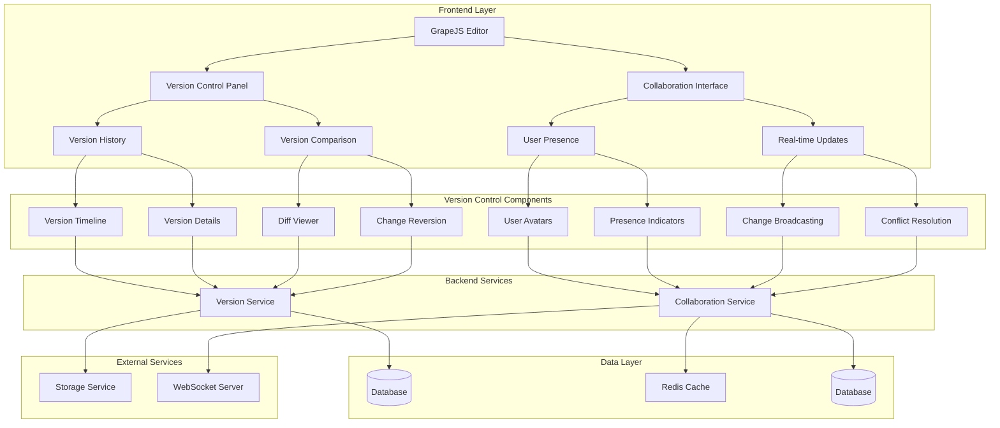

# Version Control and Collaboration Features Design

## Overview

This document outlines the design for implementing version control and collaboration features in the Vue.js Page Builder System. These features will enable marketing administrators to track changes to their pages, collaborate with team members, and maintain a history of all modifications with the ability to revert to previous versions.

## Architecture

### Version Control System Architecture



## Core Components

### 1. Version Control System

```typescript
interface VersionControlSystem {
  // Version management
  createVersion(pageId: string, changes: PageChanges, userId: string): Promise<PageVersion>
  getVersion(versionId: string): Promise<PageVersion>
  getVersions(pageId: string, options?: VersionQueryOptions): Promise<PageVersion[]>
  compareVersions(versionId1: string, versionId2: string): Promise<VersionDiff>
  revertToVersion(pageId: string, versionId: string): Promise<Page>
  
  // Branching and merging
  createBranch(pageId: string, branchName: string, fromVersionId?: string): Promise<Branch>
  mergeBranch(pageId: string, sourceBranchId: string, targetBranchId: string): Promise<MergeResult>
  deleteBranch(branchId: string): Promise<void>
  
  // Version tagging
  tagVersion(versionId: string, tagName: string, description?: string): Promise<VersionTag>
  getTags(versionId: string): Promise<VersionTag[]>
}

interface PageVersion {
  id: string
  pageId: string
  versionNumber: number
  name?: string
  description?: string
  createdBy: string
  createdAt: Date
  changes: PageChanges
  snapshot: PageSnapshot
  tags: VersionTag[]
  branchId?: string
}

interface PageChanges {
  addedComponents: ComponentChange[]
  modifiedComponents: ComponentChange[]
  deletedComponents: ComponentChange[]
  styleChanges: StyleChange[]
  contentChanges: ContentChange[]
}

interface ComponentChange {
  componentId: string
  type: 'add' | 'modify' | 'delete'
  before?: any
  after?: any
}

interface StyleChange {
  componentId: string
  property: string
  before: any
  after: any
}

interface ContentChange {
  elementId: string
  before: string
  after: string
}

interface VersionDiff {
  added: any[]
  removed: any[]
  modified: ModifiedItem[]
}

interface ModifiedItem {
  path: string
  before: any
 after: any
}

interface PageSnapshot {
  html: string
  css: string
  components: any[]
  styles: any[]
  metadata: PageMetadata
}

interface VersionQueryOptions {
  limit?: number
  offset?: number
  sortBy?: 'createdAt' | 'versionNumber'
  sortOrder?: 'asc' | 'desc'
  branchId?: string
  tag?: string
}

interface Branch {
  id: string
  pageId: string
  name: string
 createdAt: Date
  createdBy: string
  parentVersionId?: string
}

interface MergeResult {
  success: boolean
  mergedVersionId?: string
  conflicts?: MergeConflict[]
  message?: string
}

interface MergeConflict {
  path: string
  localValue: any
  remoteValue: any
  resolution?: 'local' | 'remote' | 'custom'
}

interface VersionTag {
  id: string
  versionId: string
  name: string
  description?: string
  createdAt: Date
  createdBy: string
}
```

### 2. Collaboration System

```typescript
interface CollaborationSystem {
  // User presence
  joinPage(pageId: string, userId: string, userInfo: UserInfo): Promise<void>
  leavePage(pageId: string, userId: string): Promise<void>
  getActiveUsers(pageId: string): Promise<UserInfo[]>
  
  // Real-time changes
  broadcastChange(pageId: string, change: EditorChange, userId: string): Promise<void>
  applyRemoteChange(change: EditorChange): Promise<void>
  
  // Conflict resolution
  detectConflict(localChange: EditorChange, remoteChange: EditorChange): boolean
  resolveConflict(localChange: EditorChange, remoteChange: EditorChange): EditorChange
  
  // Comments and annotations
  addComment(pageId: string, comment: Comment): Promise<Comment>
  getComments(pageId: string, elementId?: string): Promise<Comment[]>
  resolveComment(commentId: string): Promise<void>
}

interface UserInfo {
  id: string
  name: string
  avatar?: string
  color: string
  lastActive: Date
  cursorPosition?: { x: number; y: number }
  selectedElementId?: string
}

interface EditorChange {
  id: string
  type: ChangeType
  timestamp: number
  userId: string
  data: any
  clientId: string
}

type ChangeType = 
  'component_add' | 'component_update' | 'component_delete' | 
  'style_update' | 'content_update' | 'selection_change'

interface Comment {
  id: string
  pageId: string
  elementId?: string
  authorId: string
 content: string
  createdAt: Date
  resolved: boolean
  resolvedAt?: Date
  resolvedBy?: string
  replies: CommentReply[]
}

interface CommentReply {
  id: string
  authorId: string
  content: string
  createdAt: Date
}
```

## Implementation Details

### 1. Version Control System

#### Version Management

```typescript
class VersionManager {
  private versions: Map<string, PageVersion> = new Map()
  private snapshots: Map<string, PageSnapshot> = new Map()
  
  async createVersion(pageId: string, changes: PageChanges, userId: string): Promise<PageVersion> {
    // Get the latest version number for this page
    const latestVersion = await this.getLatestVersion(pageId)
    const versionNumber = latestVersion ? latestVersion.versionNumber + 1 : 1
    
    // Create snapshot of current page state
    const snapshot = await this.createSnapshot(pageId)
    
    const version: PageVersion = {
      id: this.generateId(),
      pageId,
      versionNumber,
      createdBy: userId,
      createdAt: new Date(),
      changes,
      snapshot,
      tags: []
    }
    
    this.versions.set(version.id, version)
    
    // Save to backend
    try {
      const response = await fetch('/api/page-versions', {
        method: 'POST',
        headers: {
          'Content-Type': 'application/json',
        },
        body: JSON.stringify(version)
      })
      
      if (!response.ok) {
        throw new Error('Failed to create version')
      }
      
      return version
    } catch (error) {
      console.error('Failed to create version:', error)
      throw error
    }
  }
  
  async getVersion(versionId: string): Promise<PageVersion> {
    const version = this.versions.get(versionId)
    if (version) {
      return version
    }
    
    // Fetch from backend
    try {
      const response = await fetch(`/api/page-versions/${versionId}`)
      if (!response.ok) {
        throw new Error('Failed to fetch version')
      }
      
      const versionData = await response.json()
      this.versions.set(versionId, versionData)
      return versionData
    } catch (error) {
      console.error('Failed to fetch version:', error)
      throw error
    }
  }
  
  async getVersions(pageId: string, options?: VersionQueryOptions): Promise<PageVersion[]> {
    // Build query parameters
    const params = new URLSearchParams()
    if (options?.limit) params.append('limit', options.limit.toString())
    if (options?.offset) params.append('offset', options.offset.toString())
    if (options?.sortBy) params.append('sortBy', options.sortBy)
    if (options?.sortOrder) params.append('sortOrder', options.sortOrder)
    if (options?.branchId) params.append('branchId', options.branchId)
    if (options?.tag) params.append('tag', options.tag)
    
    try {
      const response = await fetch(`/api/pages/${pageId}/versions?${params.toString()}`)
      if (!response.ok) {
        throw new Error('Failed to fetch versions')
      }
      
      const versions = await response.json()
      // Cache versions
      versions.forEach((version: PageVersion) => {
        this.versions.set(version.id, version)
      })
      
      return versions
    } catch (error) {
      console.error('Failed to fetch versions:', error)
      throw error
    }
  }
  
  async compareVersions(versionId1: string, versionId2: string): Promise<VersionDiff> {
    const version1 = await this.getVersion(versionId1)
    const version2 = await this.getVersion(versionId2)
    
    // Compare snapshots
    const diff = this.computeDiff(version1.snapshot, version2.snapshot)
    
    return diff
  }
  
  async revertToVersion(pageId: string, versionId: string): Promise<Page> {
    const version = await this.getVersion(versionId)
    
    // Apply snapshot to current page
    const page = await this.applySnapshot(pageId, version.snapshot)
    
    // Create a new version to record the reversion
    const changes: PageChanges = {
      addedComponents: [],
      modifiedComponents: [],
      deletedComponents: [],
      styleChanges: [],
      contentChanges: []
    }
    
    await this.createVersion(pageId, changes, 'system')
    
    return page
  }
  
  private async getLatestVersion(pageId: string): Promise<PageVersion | null> {
    try {
      const response = await fetch(`/api/pages/${pageId}/versions?limit=1&sortBy=versionNumber&sortOrder=desc`)
      if (!response.ok) {
        return null
      }
      
      const versions = await response.json()
      return versions.length > 0 ? versions[0] : null
    } catch (error) {
      console.error('Failed to get latest version:', error)
      return null
    }
  }
  
  private async createSnapshot(pageId: string): Promise<PageSnapshot> {
    // Get current page state from GrapeJS editor
    // This would typically involve getting the HTML, CSS, components, and styles
    // from the GrapeJS editor instance
    
    // Placeholder implementation
    return {
      html: '',
      css: '',
      components: [],
      styles: [],
      metadata: {
        title: '',
        description: '',
        status: 'draft'
      }
    }
  }
  
  private async applySnapshot(pageId: string, snapshot: PageSnapshot): Promise<Page> {
    // Apply snapshot to current page
    // This would update the GrapeJS editor with the snapshot data
    
    // Placeholder implementation
    return {
      id: pageId,
      title: snapshot.metadata.title,
      slug: '',
      description: snapshot.metadata.description,
      status: snapshot.metadata.status,
      templateId: '',
      configuration: {},
      styles: {},
      publishedAt: null,
      tenantId: '',
      createdAt: new Date(),
      updatedAt: new Date()
    }
  }
  
  private computeDiff(snapshot1: PageSnapshot, snapshot2: PageSnapshot): VersionDiff {
    // Compute differences between two snapshots
    // This is a simplified implementation
    
    return {
      added: [],
      removed: [],
      modified: []
    }
  }
  
  private generateId(): string {
    return 'version-' + Math.random().toString(36).substr(2, 9)
  }
}
```

#### Branching and Merging

```typescript
class BranchManager {
  private branches: Map<string, Branch> = new Map()
  
  async createBranch(pageId: string, branchName: string, fromVersionId?: string): Promise<Branch> {
    const branch: Branch = {
      id: this.generateId(),
      pageId,
      name: branchName,
      createdAt: new Date(),
      createdBy: 'current-user', // This would come from auth context
      parentVersionId: fromVersionId
    }
    
    this.branches.set(branch.id, branch)
    
    // Save to backend
    try {
      const response = await fetch('/api/branches', {
        method: 'POST',
        headers: {
          'Content-Type': 'application/json',
        },
        body: JSON.stringify(branch)
      })
      
      if (!response.ok) {
        throw new Error('Failed to create branch')
      }
      
      return branch
    } catch (error) {
      console.error('Failed to create branch:', error)
      throw error
    }
  }
  
  async mergeBranch(pageId: string, sourceBranchId: string, targetBranchId: string): Promise<MergeResult> {
    try {
      // Get latest versions from both branches
      const sourceVersions = await versionManager.getVersions(pageId, { branchId: sourceBranchId })
      const targetVersions = await versionManager.getVersions(pageId, { branchId: targetBranchId })
      
      // Check for conflicts
      const conflicts = this.detectConflicts(sourceVersions, targetVersions)
      
      if (conflicts.length > 0) {
        return {
          success: false,
          conflicts
        }
      }
      
      // Perform merge
      const mergedVersion = await this.performMerge(sourceVersions, targetVersions)
      
      return {
        success: true,
        mergedVersionId: mergedVersion.id
      }
    } catch (error) {
      console.error('Failed to merge branches:', error)
      return {
        success: false,
        message: error instanceof Error ? error.message : 'Unknown error'
      }
    }
  }
  
  async deleteBranch(branchId: string): Promise<void> {
    this.branches.delete(branchId)
    
    // Delete from backend
    try {
      const response = await fetch(`/api/branches/${branchId}`, {
        method: 'DELETE'
      })
      
      if (!response.ok) {
        throw new Error('Failed to delete branch')
      }
    } catch (error) {
      console.error('Failed to delete branch:', error)
      throw error
    }
  }
  
  private detectConflicts(sourceVersions: PageVersion[], targetVersions: PageVersion[]): MergeConflict[] {
    // Detect conflicts between source and target versions
    // This is a simplified implementation
    
    const conflicts: MergeConflict[] = []
    
    // Compare changes in the versions
    sourceVersions.forEach(sourceVersion => {
      targetVersions.forEach(targetVersion => {
        // Check for conflicting changes to the same components
        sourceVersion.changes.modifiedComponents.forEach(sourceChange => {
          targetVersion.changes.modifiedComponents.forEach(targetChange => {
            if (sourceChange.componentId === targetChange.componentId) {
              conflicts.push({
                path: `components.${sourceChange.componentId}`,
                localValue: sourceChange.after,
                remoteValue: targetChange.after
              })
            }
          })
        })
      })
    })
    
    return conflicts
  }
  
  private async performMerge(sourceVersions: PageVersion[], targetVersions: PageVersion[]): Promise<PageVersion> {
    // Perform the actual merge of versions
    // This would combine changes from both branches
    
    // For simplicity, we'll just take the latest version from the source branch
    const latestSourceVersion = sourceVersions[sourceVersions.length - 1]
    
    // Create a new version that represents the merge
    const changes: PageChanges = {
      addedComponents: latestSourceVersion.changes.addedComponents,
      modifiedComponents: latestSourceVersion.changes.modifiedComponents,
      deletedComponents: latestSourceVersion.changes.deletedComponents,
      styleChanges: latestSourceVersion.changes.styleChanges,
      contentChanges: latestSourceVersion.changes.contentChanges
    }
    
    return await versionManager.createVersion(
      latestSourceVersion.pageId,
      changes,
      'system'
    )
  }
  
  private generateId(): string {
    return 'branch-' + Math.random().toString(36).substr(2, 9)
  }
}
```

#### Version Tagging

```typescript
class TagManager {
  private tags: Map<string, VersionTag> = new Map()
  
  async tagVersion(versionId: string, tagName: string, description?: string): Promise<VersionTag> {
    const tag: VersionTag = {
      id: this.generateId(),
      versionId,
      name: tagName,
      description,
      createdAt: new Date(),
      createdBy: 'current-user' // This would come from auth context
    }
    
    this.tags.set(tag.id, tag)
    
    // Save to backend
    try {
      const response = await fetch('/api/version-tags', {
        method: 'POST',
        headers: {
          'Content-Type': 'application/json',
        },
        body: JSON.stringify(tag)
      })
      
      if (!response.ok) {
        throw new Error('Failed to create tag')
      }
      
      return tag
    } catch (error) {
      console.error('Failed to create tag:', error)
      throw error
    }
  }
  
  async getTags(versionId: string): Promise<VersionTag[]> {
    try {
      const response = await fetch(`/api/versions/${versionId}/tags`)
      if (!response.ok) {
        throw new Error('Failed to fetch tags')
      }
      
      const tags = await response.json()
      // Cache tags
      tags.forEach((tag: VersionTag) => {
        this.tags.set(tag.id, tag)
      })
      
      return tags
    } catch (error) {
      console.error('Failed to fetch tags:', error)
      throw error
    }
  }
  
  private generateId(): string {
    return 'tag-' + Math.random().toString(36).substr(2, 9)
  }
}
```

### 2. Collaboration System

#### User Presence Management

```typescript
class PresenceManager {
  private activeUsers: Map<string, Map<string, UserInfo>> = new Map() // pageId -> userId -> UserInfo
  private presenceTimeouts: Map<string, number> = new Map() // userId -> timeoutId
  
  async joinPage(pageId: string, userId: string, userInfo: UserInfo): Promise<void> {
    // Initialize page users map if it doesn't exist
    if (!this.activeUsers.has(pageId)) {
      this.activeUsers.set(pageId, new Map())
    }
    
    const pageUsers = this.activeUsers.get(pageId)!
    pageUsers.set(userId, { ...userInfo, lastActive: new Date() })
    
    // Clear any existing timeout for this user
    const existingTimeout = this.presenceTimeouts.get(userId)
    if (existingTimeout) {
      clearTimeout(existingTimeout)
    }
    
    // Set timeout to remove user after inactivity
    const timeoutId = setTimeout(() => {
      this.leavePage(pageId, userId)
    }, 30000) // 30 seconds of inactivity
    
    this.presenceTimeouts.set(userId, timeoutId)
    
    // Notify other users
    this.broadcastPresenceUpdate(pageId, userId, 'joined')
  }
  
  async leavePage(pageId: string, userId: string): Promise<void> {
    const pageUsers = this.activeUsers.get(pageId)
    if (pageUsers) {
      pageUsers.delete(userId)
      
      // Clear timeout
      const timeoutId = this.presenceTimeouts.get(userId)
      if (timeoutId) {
        clearTimeout(timeoutId)
        this.presenceTimeouts.delete(userId)
      }
      
      // Notify other users
      this.broadcastPresenceUpdate(pageId, userId, 'left')
    }
  }
  
  getActiveUsers(pageId: string): UserInfo[] {
    const pageUsers = this.activeUsers.get(pageId)
    if (pageUsers) {
      return Array.from(pageUsers.values()).map(user => ({
        ...user,
        lastActive: new Date(user.lastActive)
      }))
    }
    return []
  }
  
  updateUserActivity(pageId: string, userId: string, activity: Partial<UserInfo>): void {
    const pageUsers = this.activeUsers.get(pageId)
    if (pageUsers) {
      const user = pageUsers.get(userId)
      if (user) {
        pageUsers.set(userId, { ...user, ...activity, lastActive: new Date() })
        
        // Reset inactivity timeout
        const timeoutId = this.presenceTimeouts.get(userId)
        if (timeoutId) {
          clearTimeout(timeoutId)
        }
        
        const newTimeoutId = setTimeout(() => {
          this.leavePage(pageId, userId)
        }, 30000)
        
        this.presenceTimeouts.set(userId, newTimeoutId)
      }
    }
  }
  
  private broadcastPresenceUpdate(pageId: string, userId: string, action: 'joined' | 'left'): void {
    // In a real implementation, this would broadcast to other users via WebSocket
    console.log(`User ${userId} ${action} page ${pageId}`)
 }
}
```

#### Real-time Change Broadcasting

```typescript
class ChangeBroadcaster {
  private pendingChanges: Map<string, EditorChange[]> = new Map() // pageId -> changes
  private broadcastTimers: Map<string, number> = new Map() // pageId -> timerId
  
  async broadcastChange(pageId: string, change: EditorChange, userId: string): Promise<void> {
    // Add user ID to change
    const changeWithUser = { ...change, userId }
    
    // Queue change for broadcast
    if (!this.pendingChanges.has(pageId)) {
      this.pendingChanges.set(pageId, [])
    }
    
    this.pendingChanges.get(pageId)!.push(changeWithUser)
    
    // Clear existing timer
    const existingTimer = this.broadcastTimers.get(pageId)
    if (existingTimer) {
      clearTimeout(existingTimer)
    }
    
    // Set new timer to broadcast changes after a short delay
    const timerId = setTimeout(() => {
      this.broadcastPendingChanges(pageId)
    }, 100) // 100ms delay for batching
    
    this.broadcastTimers.set(pageId, timerId)
  }
  
  async applyRemoteChange(change: EditorChange): Promise<void> {
    // Apply remote change to local editor
    // This would depend on the specific change type
    console.log('Applying remote change:', change)
  }
  
  private async broadcastPendingChanges(pageId: string): Promise<void> {
    const changes = this.pendingChanges.get(pageId)
    if (!changes || changes.length === 0) {
      return
    }
    
    // Clear pending changes and timer
    this.pendingChanges.delete(pageId)
    this.broadcastTimers.delete(pageId)
    
    // Broadcast changes to other users
    try {
      const response = await fetch(`/api/pages/${pageId}/changes`, {
        method: 'POST',
        headers: {
          'Content-Type': 'application/json',
        },
        body: JSON.stringify({ changes })
      })
      
      if (!response.ok) {
        throw new Error('Failed to broadcast changes')
      }
    } catch (error) {
      console.error('Failed to broadcast changes:', error)
      // In a real implementation, we might want to retry or queue failed broadcasts
    }
  }
}
```

#### Conflict Detection and Resolution

```typescript
class ConflictResolver {
  detectConflict(localChange: EditorChange, remoteChange: EditorChange): boolean {
    // Simple conflict detection based on same component and recent timestamps
    if (localChange.userId === remoteChange.userId) {
      return false // Same user, not a conflict
    }
    
    // Check if changes affect the same component/element
    const localTarget = this.getChangeTarget(localChange)
    const remoteTarget = this.getChangeTarget(remoteChange)
    
    if (localTarget === remoteTarget) {
      // Check if changes are close in time (within 5 seconds)
      const timeDiff = Math.abs(localChange.timestamp - remoteChange.timestamp)
      return timeDiff < 5000
    }
    
    return false
  }
  
  resolveConflict(localChange: EditorChange, remoteChange: EditorChange): EditorChange {
    // Simple resolution: prefer the most recent change
    if (localChange.timestamp > remoteChange.timestamp) {
      return localChange
    } else {
      return remoteChange
    }
  }
  
  private getChangeTarget(change: EditorChange): string {
    // Extract target component/element from change data
    switch (change.type) {
      case 'component_add':
      case 'component_update':
      case 'component_delete':
        return change.data.componentId || 'unknown'
      case 'style_update':
        return change.data.componentId || 'unknown'
      case 'content_update':
        return change.data.elementId || 'unknown'
      case 'selection_change':
        return change.data.elementId || 'unknown'
      default:
        return 'unknown'
    }
  }
}
```

#### Comments and Annotations

```typescript
class CommentManager {
  private comments: Map<string, Comment> = new Map()
  
  async addComment(pageId: string, comment: Omit<Comment, 'id' | 'createdAt'>): Promise<Comment> {
    const fullComment: Comment = {
      id: this.generateId(),
      pageId,
      authorId: comment.authorId,
      content: comment.content,
      elementId: comment.elementId,
      createdAt: new Date(),
      resolved: false,
      replies: []
    }
    
    this.comments.set(fullComment.id, fullComment)
    
    // Save to backend
    try {
      const response = await fetch('/api/comments', {
        method: 'POST',
        headers: {
          'Content-Type': 'application/json',
        },
        body: JSON.stringify(fullComment)
      })
      
      if (!response.ok) {
        throw new Error('Failed to add comment')
      }
      
      return fullComment
    } catch (error) {
      console.error('Failed to add comment:', error)
      throw error
    }
  }
  
  async getComments(pageId: string, elementId?: string): Promise<Comment[]> {
    try {
      let url = `/api/pages/${pageId}/comments`
      if (elementId) {
        url += `?elementId=${elementId}`
      }
      
      const response = await fetch(url)
      if (!response.ok) {
        throw new Error('Failed to fetch comments')
      }
      
      const comments = await response.json()
      // Cache comments
      comments.forEach((comment: Comment) => {
        this.comments.set(comment.id, comment)
      })
      
      return comments
    } catch (error) {
      console.error('Failed to fetch comments:', error)
      throw error
    }
  }
  
  async resolveComment(commentId: string): Promise<void> {
    const comment = this.comments.get(commentId)
    if (comment) {
      comment.resolved = true
      comment.resolvedAt = new Date()
      comment.resolvedBy = 'current-user' // This would come from auth context
      
      this.comments.set(commentId, comment)
      
      // Update in backend
      try {
        const response = await fetch(`/api/comments/${commentId}`, {
          method: 'PATCH',
          headers: {
            'Content-Type': 'application/json',
          },
          body: JSON.stringify({ resolved: true, resolvedAt: comment.resolvedAt, resolvedBy: comment.resolvedBy })
        })
        
        if (!response.ok) {
          throw new Error('Failed to resolve comment')
        }
      } catch (error) {
        console.error('Failed to resolve comment:', error)
        throw error
      }
    }
  }
  
  private generateId(): string {
    return 'comment-' + Math.random().toString(36).substr(2, 9)
  }
}
```

## Integration with Vue Wrapper Component

### Version Control Panel Integration

```vue
<script setup lang="ts">
import { ref, computed, watch } from 'vue'
import { useVersionControl } from '@/composables/useVersionControl'
import type { PageVersion, VersionDiff } from '@/types/version-control'

const { 
  versions,
  getVersion,
  getVersions,
  compareVersions,
  revertToVersion,
  createBranch,
  mergeBranch,
  tagVersion
} = useVersionControl()

const selectedPageId = ref<string | null>(null)
const versionHistory = ref<PageVersion[]>([])
const selectedVersionId = ref<string | null>(null)
const comparedVersionId = ref<string | null>(null)
const versionDiff = ref<VersionDiff | null>(null)
const isReverting = ref(false)

// Computed properties
const selectedVersion = computed(() => {
  return versionHistory.value.find(v => v.id === selectedVersionId.value) || null
})

const comparedVersion = computed(() => {
  return versionHistory.value.find(v => v.id === comparedVersionId.value) || null
})

// Watch for page selection changes
watch(selectedPageId, async (newId) => {
  if (newId) {
    await loadVersionHistory(newId)
 } else {
    versionHistory.value = []
    selectedVersionId.value = null
  }
})

// Methods
const loadVersionHistory = async (pageId: string) => {
  try {
    versionHistory.value = await getVersions(pageId, { 
      limit: 50, 
      sortBy: 'createdAt', 
      sortOrder: 'desc' 
    })
    
    // Select the latest version by default
    if (versionHistory.value.length > 0) {
      selectedVersionId.value = versionHistory.value[0].id
    }
  } catch (error) {
    console.error('Failed to load version history:', error)
  }
}

const compareSelectedVersions = async () => {
  if (selectedVersionId.value && comparedVersionId.value) {
    try {
      versionDiff.value = await compareVersions(selectedVersionId.value, comparedVersionId.value)
    } catch (error) {
      console.error('Failed to compare versions:', error)
    }
  }
}

const revertToSelectedVersion = async () => {
  if (!selectedPageId.value || !selectedVersionId.value) return
  
  isReverting.value = true
  
  try {
    await revertToVersion(selectedPageId.value, selectedVersionId.value)
    alert('Successfully reverted to selected version!')
    
    // Reload version history
    await loadVersionHistory(selectedPageId.value)
 } catch (error) {
    console.error('Failed to revert to version:', error)
    alert('Failed to revert to version')
  } finally {
    isReverting.value = false
  }
}

const createNewBranch = async (branchName: string) => {
 if (!selectedPageId.value) return
  
  try {
    await createBranch(selectedPageId.value, branchName, selectedVersionId.value)
    alert('Branch created successfully!')
  } catch (error) {
    console.error('Failed to create branch:', error)
    alert('Failed to create branch')
  }
}

const mergeSelectedBranch = async (sourceBranchId: string, targetBranchId: string) => {
  if (!selectedPageId.value) return
  
  try {
    const result = await mergeBranch(selectedPageId.value, sourceBranchId, targetBranchId)
    if (result.success) {
      alert('Branch merged successfully!')
    } else {
      alert(`Merge failed: ${result.message || 'Unknown error'}`)
    }
  } catch (error) {
    console.error('Failed to merge branches:', error)
    alert('Failed to merge branches')
  }
}

const tagSelectedVersion = async (tagName: string, description?: string) => {
  if (!selectedVersionId.value) return
  
  try {
    await tagVersion(selectedVersionId.value, tagName, description)
    alert('Version tagged successfully!')
  } catch (error) {
    console.error('Failed to tag version:', error)
    alert('Failed to tag version')
  }
}
</script>
```

### Collaboration Interface Integration

```vue
<script setup lang="ts">
import { ref, computed, onMounted, onUnmounted } from 'vue'
import { useCollaboration } from '@/composables/useCollaboration'
import type { UserInfo, EditorChange, Comment } from '@/types/collaboration'

const { 
  activeUsers,
  joinPage,
  leavePage,
  broadcastChange,
  addComment,
  getComments
} = useCollaboration()

const selectedPageId = ref<string | null>(null)
const currentUser = ref<UserInfo | null>(null)
const comments = ref<Comment[]>([])
const newComment = ref({ content: '', elementId: '' })

// Computed properties
const userColors = computed(() => {
  return activeUsers.value.map(user => ({
    userId: user.id,
    color: user.color
  }))
})

// Lifecycle
onMounted(async () => {
  if (selectedPageId.value && currentUser.value) {
    await joinPage(selectedPageId.value, currentUser.value.id, currentUser.value)
  }
})

onUnmounted(async () => {
  if (selectedPageId.value && currentUser.value) {
    await leavePage(selectedPageId.value, currentUser.value.id)
  }
})

// Methods
const handleEditorChange = async (change: EditorChange) => {
  if (selectedPageId.value && currentUser.value) {
    await broadcastChange(selectedPageId.value, change, currentUser.value.id)
  }
}

const handleUserActivity = (activity: Partial<UserInfo>) => {
  // Update user activity (cursor position, selection, etc.)
  console.log('User activity:', activity)
}

const addNewComment = async () => {
  if (!selectedPageId.value || !currentUser.value) return
  
  try {
    const comment = await addComment(selectedPageId.value, {
      authorId: currentUser.value.id,
      content: newComment.value.content,
      elementId: newComment.value.elementId
    })
    
    comments.value.push(comment)
    newComment.value = { content: '', elementId: '' }
  } catch (error) {
    console.error('Failed to add comment:', error)
  }
}

const loadComments = async (elementId?: string) => {
  if (!selectedPageId.value) return
  
  try {
    comments.value = await getComments(selectedPageId.value, elementId)
 } catch (error) {
    console.error('Failed to load comments:', error)
  }
}

const resolveComment = async (commentId: string) => {
  try {
    // In a real implementation, this would call a resolveComment function
    const comment = comments.value.find(c => c.id === commentId)
    if (comment) {
      comment.resolved = true
      comment.resolvedAt = new Date()
    }
  } catch (error) {
    console.error('Failed to resolve comment:', error)
  }
}
</script>
```

## Performance Optimization

### 1. Version Data Caching

```typescript
class VersionDataCache {
  private cache: Map<string, { data: any; timestamp: number }> = new Map()
  private cacheTimeout = 10 * 60 * 1000 // 10 minutes
  
  get(key: string): any {
    const cached = this.cache.get(key)
    if (cached && (Date.now() - cached.timestamp) < this.cacheTimeout) {
      return cached.data
    }
    
    return null
  }
  
  set(key: string, data: any): void {
    this.cache.set(key, {
      data,
      timestamp: Date.now()
    })
  }
  
  clear(key: string): void {
    this.cache.delete(key)
  }
  
  clearExpired(): void {
    const now = Date.now()
    for (const [key, value] of this.cache.entries()) {
      if ((now - value.timestamp) >= this.cacheTimeout) {
        this.cache.delete(key)
      }
    }
  }
  
  clearAll(): void {
    this.cache.clear()
  }
}
```

### 2. Incremental Version Loading

```typescript
class IncrementalVersionLoader {
  private loadedVersions: Map<string, PageVersion[]> = new Map()
  private pageSize = 20
  
  async loadVersionsIncrementally(pageId: string, offset: number): Promise<PageVersion[]> {
    // Check if we already have these versions cached
    const cacheKey = `${pageId}-${offset}`
    const cached = versionCache.get(cacheKey)
    if (cached) {
      return cached
    }
    
    // Load from backend
    try {
      const response = await fetch(`/api/pages/${pageId}/versions?limit=${this.pageSize}&offset=${offset}`)
      if (!response.ok) {
        throw new Error('Failed to load versions')
      }
      
      const versions = await response.json()
      versionCache.set(cacheKey, versions)
      return versions
    } catch (error) {
      console.error('Failed to load versions:', error)
      throw error
    }
  }
  
  async loadAllVersions(pageId: string): Promise<PageVersion[]> {
    // Check if we already have all versions cached
    const cached = this.loadedVersions.get(pageId)
    if (cached) {
      return cached
    }
    
    // Load all versions incrementally
    const allVersions: PageVersion[] = []
    let offset = 0
    let hasMore = true
    
    while (hasMore) {
      const versions = await this.loadVersionsIncrementally(pageId, offset)
      allVersions.push(...versions)
      
      if (versions.length < this.pageSize) {
        hasMore = false
      } else {
        offset += this.pageSize
      }
    }
    
    this.loadedVersions.set(pageId, allVersions)
    return allVersions
  }
}
```

## Error Handling and Recovery

### 1. Version Control Error Handling

```typescript
class VersionControlErrorHandler {
  handleVersionCreationError(error: Error, pageId: string): void {
    console.error(`Failed to create version for page ${pageId}:`, error)
    
    // Show user-friendly error message
    // Depending on error type, suggest recovery actions
  }
  
  handleVersionRetrievalError(error: Error, versionId: string): void {
    console.error(`Failed to retrieve version ${versionId}:`, error)
    
    // Show user-friendly error message
    // Suggest retry or alternative actions
  }
  
  handleVersionRevertError(error: Error, pageId: string, versionId: string): void {
    console.error(`Failed to revert page ${pageId} to version ${versionId}:`, error)
    
    // Show user-friendly error message
    // Attempt to restore previous state
  }
  
  handleBranchError(error: Error, branchId: string): void {
    console.error(`Failed to operate on branch ${branchId}:`, error)
    
    // Show user-friendly error message
    // Suggest branch recovery actions
  }
}
```

### 2. Collaboration Error Handling

```typescript
class CollaborationErrorHandler {
  handlePresenceError(error: Error, pageId: string, userId: string): void {
    console.error(`Failed to update presence for user ${userId} on page ${pageId}:`, error)
    
    // Attempt to reconnect or show offline status
 }
  
  handleChangeBroadcastError(error: Error, pageId: string): void {
    console.error(`Failed to broadcast changes for page ${pageId}:`, error)
    
    // Queue changes for retry and show connection issues
  }
  
  handleConflictError(error: Error, localChange: EditorChange, remoteChange: EditorChange): void {
    console.error('Failed to resolve conflict:', error)
    
    // Show conflict resolution interface to user
  }
  
  handleCommentError(error: Error, commentId?: string): void {
    console.error(`Failed to handle comment ${commentId || 'new comment'}:`, error)
    
    // Show error and suggest retry
  }
}
```

## Testing Strategy

### Unit Tests

1. Version creation and management
2. Version comparison and diff computation
3. Branch creation and merging
4. Version tagging functionality
5. User presence management
6. Change broadcasting and conflict resolution
7. Comment and annotation features

### Integration Tests

1. Version control with GrapeJS integration
2. Collaboration features with real-time updates
3. Branching and merging workflows
4. Version comparison and reversion
5. Comment system with user interactions
6. Conflict resolution scenarios
7. Performance with large version histories

### End-to-End Tests

1. Complete version control workflow
2. Multi-user collaboration scenarios
3. Branching and merging with conflicts
4. Version tagging and retrieval
5. Comment and annotation workflows
6. Error recovery and resilience
7. Performance under load

## Implementation Plan

### Phase 1: Core Infrastructure
- Implement version management system
- Create snapshot and diff capabilities
- Set up branching and merging functionality
- Implement version tagging

### Phase 2: Collaboration Features
- Create user presence management
- Implement real-time change broadcasting
- Add conflict detection and resolution
- Set up comment and annotation system

### Phase 3: Vue Integration
- Integrate version control panel with Vue wrapper
- Add collaboration interface to Vue component
- Implement version history timeline
- Add real-time user presence indicators

### Phase 4: Performance Optimization
- Add version data caching
- Implement incremental version loading
- Optimize change broadcasting
- Add lazy loading for version details

### Phase 5: Error Handling and Testing
- Implement comprehensive error handling
- Add recovery mechanisms
- Create unit tests
- Add integration tests

### Phase 6: Advanced Features
- Add version comparison visualization
- Implement advanced branching strategies
- Add collaboration analytics
- Add notification system for collaboration events

## Dependencies

- `grapesjs` - Core page builder engine
- `vue` - Vue.js framework
- `pinia` - State management
- `laravel-echo` - WebSocket client
- `pusher-js` - WebSocket provider
- `diff` - Library for computing differences
- `uuid` - Library for generating unique IDs

## Security Considerations

- Validate all version operations
- Implement proper access controls for version history
- Sanitize version data before storage
- Encrypt sensitive version information
- Implement rate limiting for version operations
- Validate user permissions for collaboration features
- Protect against CSRF attacks in collaboration endpoints
- Implement proper authentication for WebSocket connections