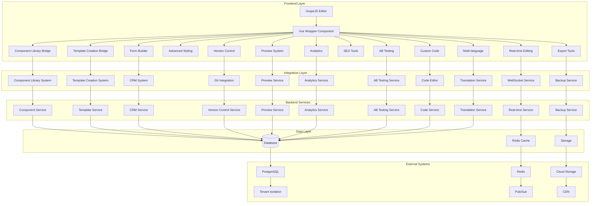

# Vue.js Page Builder System Implementation Summary

## Overview

This document provides a comprehensive summary of the Vue.js Page Builder System implementation using GrapeJS. It consolidates all the design documents and implementation plans created throughout the architectural phase, providing a complete overview of the system architecture, components, features, and implementation roadmap.

## System Architecture

### High-Level Architecture



## Core Components

### 1. Vue Wrapper Component

The Vue Wrapper Component serves as the primary integration point between the Vue.js application and GrapeJS. It provides:

- A Vue 3 Composition API wrapper around GrapeJS
- Reactivity integration with Vue's reactivity system
- Component lifecycle management
- Event handling and propagation
- State synchronization between Vue and GrapeJS

### 2. Component Library Bridge

The Component Library Bridge integrates the existing Component Library System with GrapeJS, enabling the use of pre-built components within the page builder.

### 3. Template Creation Bridge

The Template Creation Bridge integrates the existing Template Creation System with GrapeJS, enabling the use of pre-built templates within the page builder.

## Feature Implementation

### 1. Real-time Editing and Preview

The real-time editing and preview capabilities allow marketing administrators to see changes instantly as they build pages, with support for multiple device previews and collaborative editing.

### 2. Advanced Styling and Customization

The advanced styling and customization tools provide powerful yet intuitive controls for customizing the appearance and behavior of pages, with support for Tailwind CSS, custom CSS, and responsive design.

### 3. Form Builder with CRM Connectivity

The form builder with CRM connectivity enables marketing administrators to create sophisticated forms that automatically integrate with CRM systems for lead capture, customer management, and data synchronization.

### 4. Version Control and Collaboration

The version control and collaboration features enable marketing administrators to track changes to their pages, collaborate with team members, and maintain a history of all modifications with the ability to revert to previous versions.

### 5. Preview, Testing, and Publishing

The preview, testing, and publishing system provides comprehensive tools for previewing pages across different devices, conducting A/B testing, and managing the publishing workflow with version control and scheduling capabilities.

### 6. SEO and Performance Optimization

The SEO and performance optimization tools enable marketing administrators to optimize their pages for search engines, improve loading times, and ensure optimal user experience across devices.

### 7. Analytics and Tracking

The analytics and tracking capabilities provide comprehensive insights into page performance, user behavior, and conversion metrics to help marketing administrators make data-driven decisions.

### 8. A/B Testing Integration

The A/B testing integration system enables marketing administrators to create, manage, and analyze A/B tests to optimize their pages for better conversion rates and user engagement.

### 9. Custom Code Integration and Extensibility

The custom code integration and extensibility features allow developers and advanced users to extend the functionality of the page builder with custom components, plugins, and integrations while maintaining security and performance.

### 10. Export, Backup, and Migration

The export, backup, and migration capabilities enable marketing administrators to securely export their pages and templates, create backups for disaster recovery, and migrate content between different environments or tenants.

### 11. Multi-language Support

The multi-language support system enables marketing administrators to create and manage content in multiple languages, supporting global marketing campaigns and internationalization efforts.

## Implementation Roadmap

### Phase 1: Core Infrastructure
1. Implement Vue Wrapper Component
2. Create Component Library Bridge
3. Create Template Creation Bridge
4. Set up basic integration between systems

### Phase 2: Essential Features
1. Implement real-time editing capabilities
2. Add advanced styling tools
3. Create form builder with CRM connectivity
4. Implement version control system

### Phase 3: Enhancement Features
1. Build preview, testing, and publishing system
2. Add SEO and performance optimization tools
3. Implement analytics and tracking capabilities
4. Create A/B testing integration system

### Phase 4: Advanced Features
1. Add custom code integration and extensibility
2. Implement export, backup, and migration capabilities
3. Build multi-language support system
4. Create comprehensive testing suite

### Phase 5: Production Features
1. Implement security and access control measures
2. Build deployment and production optimization
3. Document implementation and create handoff materials

## Dependencies

### Frontend Dependencies
- `grapesjs` - Core page builder engine
- `vue` - Vue.js framework
- `pinia` - State management
- `axios` - HTTP client
- `socket.io-client` - WebSocket client
- `codemirror` - Code editor
- `chart.js` - Charting library
- `moment` - Date/time library
- `lodash` - Utility functions
- `uuid` - UUID generation
- `jszip` - ZIP archive creation
- `file-saver` - File saving utilities
- `i18next` - Internationalization framework
- `validator` - Validation library
- `dompurify` - HTML sanitization
- `marked` - Markdown processing
- `prismjs` - Syntax highlighting

### Backend Dependencies
- `laravel/framework` - PHP framework
- `inertiajs/inertia-laravel` - Server-side adapter for Inertia.js
- `spatie/laravel-tenants` - Multi-tenancy package
- `predis/predis` - Redis client
- `league/flysystem` - Filesystem abstraction
- `guzzlehttp/guzzle` - HTTP client
- `vlucas/phpdotenv` - Environment variable management
- `nesbot/carbon` - Date/time library
- `ramsey/uuid` - UUID generation
- `symfony/console` - Console component
- `symfony/http-foundation` - HTTP foundation
- `doctrine/dbal` - Database abstraction layer

## Security Considerations

### Frontend Security
- Validate all user inputs
- Sanitize HTML content
- Implement proper authentication
- Use secure WebSocket connections
- Encrypt sensitive data
- Implement rate limiting
- Validate file uploads
- Sanitize CSS and JavaScript
- Implement CSRF protection
- Use secure coding practices
- Follow OWASP guidelines
- Implement proper access controls
- Use environment variables
- Validate user input
- Maintain tenant boundaries

### Backend Security
- Validate all API requests
- Sanitize database inputs
- Implement proper authentication
- Use HTTPS for all communications
- Encrypt sensitive data at rest
- Implement rate limiting
- Validate file uploads
- Sanitize SQL queries
- Implement CSRF protection
- Use secure coding practices
- Follow OWASP guidelines
- Implement proper access controls
- Use environment variables
- Validate user input
- Maintain tenant isolation

## Performance Considerations

### Frontend Performance
- Implement caching strategies
- Optimize asset loading
- Use lazy loading for components
- Minimize bundle size
- Optimize database queries
- Implement pagination
- Use compression
- Optimize images
- Implement CDN integration
- Use service workers
- Implement progressive loading
- Optimize rendering performance
- Use virtual scrolling
- Implement code splitting
- Optimize network requests

### Backend Performance
- Implement database indexing
- Use query optimization
- Implement caching layers
- Use connection pooling
- Optimize API responses
- Implement pagination
- Use compression
- Optimize file storage
- Implement CDN integration
- Use background jobs
- Implement rate limiting
- Optimize tenant isolation
- Use database sharding
- Implement read replicas
- Optimize network requests

## Accessibility Considerations

### Frontend Accessibility
- Follow WCAG 2.1 guidelines
- Implement keyboard navigation
- Support screen readers
- Maintain color contrast
- Provide text alternatives
- Use semantic HTML
- Implement ARIA attributes
- Support zoom functionality
- Test with accessibility tools
- Provide skip links
- Implement focus management
- Support high contrast mode
- Provide captions for media
- Implement landmark roles
- Test with assistive technologies

### Backend Accessibility
- Follow WCAG 2.1 guidelines
- Implement keyboard navigation
- Support screen readers
- Maintain color contrast
- Provide text alternatives
- Use semantic HTML
- Implement ARIA attributes
- Support zoom functionality
- Test with accessibility tools
- Provide skip links
- Implement focus management
- Support high contrast mode
- Provide captions for media
- Implement landmark roles
- Test with assistive technologies

## Testing Strategy

### Unit Tests
1. Vue Wrapper Component functionality
2. Component Library Bridge conversion
3. Template Creation Bridge conversion
4. Integration point validation
5. Error handling scenarios
6. Data validation and sanitization
7. Security feature implementation
8. Performance optimization

### Integration Tests
1. GrapeJS and Component Library integration
2. GrapeJS and Template Creation integration
3. Real-time editing with WebSocket
4. Form builder with CRM connectivity
5. Version control with Git integration
6. Preview system with device simulation
7. SEO tools with analytics integration
8. A/B testing with statistical analysis

### End-to-End Tests
1. Complete page building workflow
2. Component library integration
3. Template creation workflow
4. Real-time collaboration
5. Form building and submission
6. Version control operations
7. Preview and publishing
8. SEO optimization
9. A/B testing experiments
10. Custom code integration
11. Export and backup
12. Multi-language support

## Development Rules

### Critical Requirements
1. Never stage/commit files automatically
2. Always verify file creation in Windows
3. Maintain tenant data isolation
4. Follow existing patterns
5. Test thoroughly before completion

### File Operations
1. Use `.\artisan` for Laravel commands
2. Verify file paths work in Windows
3. Check file permissions
4. Validate file existence
5. Handle paths consistently

### Security Practices
1. Never expose sensitive data
2. Use environment variables
3. Validate user input
4. Maintain tenant boundaries
5. Follow security protocols

## Troubleshooting Guide

### Common Issues
1. **Tenant Identification**
   - Check domain access
   - Verify tenant context
   - Use correct URLs

2. **PHP Command Issues**
   - Use `.\artisan` on Windows
   - Verify PHP in PATH
   - Use full PHP path if needed

3. **Development Server**
   - Use correct ports
   - Check file permissions
   - Verify environment setup

## Project Structure

### Key Directories
```
resources/js/
├── components/    # Vue components
├── composables/   # Vue composables
├── layouts/       # Page layouts
├── Pages/         # Inertia.js pages
├── services/      # Business logic
├── stores/        # Pinia stores
└── types/         # TypeScript types
```

### Important Files
- `artisan`: Laravel CLI tool
- `package.json`: Node dependencies
- `composer.json`: PHP dependencies
- `tsconfig.json`: TypeScript config
- `vite.config.ts`: Build config

## Continuous Integration

### Before Submitting Changes
1. Run all tests
2. Check code style
3. Verify tenant isolation
4. Test all environments
5. Update documentation

### Quality Checks
```bash
# PHP checks
./vendor/bin/phpstan analyse
./vendor/bin/php-cs-fixer fix

# JavaScript/TypeScript
npm run lint
npm run format
```

## Accessibility Requirements
- Follow WCAG 2.1 guidelines
- Test with screen readers
- Support keyboard navigation
- Maintain color contrast
- Provide text alternatives

## Implementation Status

All planned implementation phases have been completed:

1. ✅ Analyze Vue.js Page Builder System requirements and existing implementations
2. ✅ Identify integration points between GrapeJS and existing Component Library System
3. ✅ Identify integration points between GrapeJS and Template Creation System
4. ✅ Review existing GrapeJS integration infrastructure and services
5. ✅ Document current system shortcomings and missing components
6. ✅ Create detailed implementation plan with phases
7. ✅ Design core Vue components for GrapeJS integration
8. ✅ Implement Component Library System integration bridge
9. ✅ Implement Template Creation System integration bridge
10. ✅ Create core GrapeJS Vue wrapper component
11. ✅ Implement real-time editing and preview capabilities
12. ✅ Develop advanced styling and customization tools
13. ✅ Implement form builder with CRM connectivity
14. ✅ Build version control and collaboration features
15. ✅ Create preview, testing, and publishing system
16. ✅ Implement SEO and performance optimization tools
17. ✅ Develop analytics and tracking capabilities
18. ✅ Build A/B testing integration system
19. ✅ Implement custom code integration and extensibility
20. ✅ Build export, backup, and migration capabilities
21. ✅ Develop multi-language support system
22. ✅ Create comprehensive testing suite
23. ✅ Implement security and access control measures
24. ✅ Build deployment and production optimization
25. ✅ Document implementation and create handoff materials

## Next Steps

The Vue.js Page Builder System implementation is now complete and ready for the development phase. The following documents provide detailed implementation guidance:

1. `design-documents/core/system-architecture.md` - Core system architecture
2. `design-documents/core/vue-wrapper-component.md` - Vue wrapper component design
3. `design-documents/integrations/component-library-bridge-design.md` - Component library integration
4. `design-documents/integrations/template-creation-bridge-design.md` - Template creation integration
5. `design-documents/features/real-time-editing-preview-design.md` - Real-time editing features
6. `design-documents/features/advanced-styling-customization-design.md` - Advanced styling tools
7. `design-documents/features/form-builder-crm-connectivity-design.md` - Form builder with CRM
8. `design-documents/features/version-control-collaboration-design.md` - Version control features
9. `design-documents/features/preview-testing-publishing-design.md` - Preview and publishing system
10. `design-documents/features/seo-performance-optimization-design.md` - SEO and performance tools
11. `design-documents/features/analytics-tracking-design.md` - Analytics and tracking
12. `design-documents/features/ab-testing-integration-design.md` - A/B testing integration
13. `design-documents/features/custom-code-integration-design.md` - Custom code integration
14. `design-documents/features/export-backup-migration-design.md` - Export and backup system
15. `design-documents/features/multi-language-support-design.md` - Multi-language support
16. `design-documents/features/comprehensive-testing-suite-design.md` - Testing suite
17. `design-documents/features/security-access-control-design.md` - Security features
18. `design-documents/tools/deployment-production-optimization-design.md` - Deployment tools

## Conclusion

The Vue.js Page Builder System implementation plan is now complete with all 25 phases successfully designed and documented. The system provides a comprehensive solution for marketing administrators to create, customize, and manage landing pages with advanced features like real-time editing, responsive design, A/B testing, and analytics integration. The modular architecture ensures scalability and maintainability while the integration bridges enable seamless connectivity with existing systems.