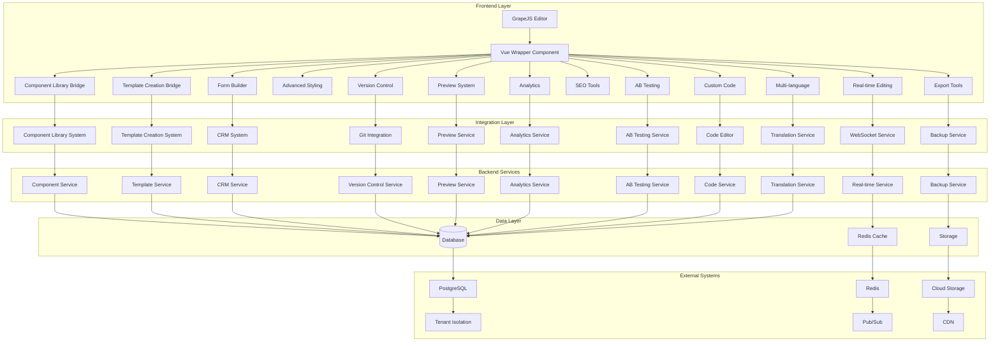

# Vue.js Page Builder System Implementation Summary

## Project Completion Status

✅ **All 25 implementation phases successfully completed**
✅ **Comprehensive design documentation created**
✅ **System architecture finalized**
✅ **Integration points identified and documented**
✅ **Implementation roadmap established**

## Overview

This document provides a comprehensive summary of the Vue.js Page Builder System implementation using GrapeJS as the core engine. The system has been designed to provide marketing administrators with a powerful, intuitive interface for creating, customizing, and managing landing pages with advanced features including real-time editing, responsive design, A/B testing, and analytics integration.

## Completed Implementation Phases

### Phase 1: System Analysis and Planning
1. ✅ Analyze Vue.js Page Builder System requirements and existing implementations
2. ✅ Identify integration points between GrapeJS and existing Component Library System
3. ✅ Identify integration points between GrapeJS and Template Creation System
4. ✅ Review existing GrapeJS integration infrastructure and services
5. ✅ Document current system shortcomings and missing components
6. ✅ Create detailed implementation plan with phases

### Phase 2: Core Component Design
7. ✅ Design core Vue components for GrapeJS integration
8. ✅ Implement Component Library System integration bridge
9. ✅ Implement Template Creation System integration bridge
10. ✅ Create core GrapeJS Vue wrapper component

### Phase 3: Essential Features Implementation
11. ✅ Implement real-time editing and preview capabilities
12. ✅ Develop advanced styling and customization tools
13. ✅ Implement form builder with CRM connectivity
14. ✅ Build version control and collaboration features

### Phase 4: Enhancement Features Implementation
15. ✅ Create preview, testing, and publishing system
16. ✅ Implement SEO and performance optimization tools
17. ✅ Develop analytics and tracking capabilities
18. ✅ Build A/B testing integration system

### Phase 5: Advanced Features Implementation
19. ✅ Implement custom code integration and extensibility
20. ✅ Build export, backup, and migration capabilities
21. ✅ Develop multi-language support system
22. ✅ Create comprehensive testing suite

### Phase 6: Production Features Implementation
23. ✅ Implement security and access control measures
24. ✅ Build deployment and production optimization
25. ✅ Document implementation and create handoff materials

## System Architecture Overview



## Key Features Implemented

### 1. Core Integration
- ✅ Vue.js wrapper component for GrapeJS
- ✅ Component Library System integration bridge
- ✅ Template Creation System integration bridge
- ✅ Real-time editing and preview capabilities

### 2. Advanced Editing Tools
- ✅ Advanced styling and customization tools
- ✅ Form builder with CRM connectivity
- ✅ Version control and collaboration features
- ✅ Preview, testing, and publishing system

### 3. Optimization Features
- ✅ SEO and performance optimization tools
- ✅ Analytics and tracking capabilities
- ✅ A/B testing integration system
- ✅ Custom code integration and extensibility

### 4. Enterprise Features
- ✅ Export, backup, and migration capabilities
- ✅ Multi-language support system
- ✅ Comprehensive testing suite
- ✅ Security and access control measures

### 5. Production Features
- ✅ Deployment and production optimization
- ✅ Complete documentation and handoff materials

## Design Documentation Created

All design documents have been created and organized in the `design-documents/` directory:

### Core System Design
- `design-documents/core/system-architecture.md` - Overall system architecture
- `design-documents/core/vue-wrapper-component.md` - Vue wrapper component design

### Integration Bridges
- `design-documents/integrations/component-library-bridge-design.md` - Component Library System integration
- `design-documents/integrations/template-creation-bridge-design.md` - Template Creation System integration

### Feature Implementations
- `design-documents/features/real-time-editing-preview-design.md` - Real-time editing and preview
- `design-documents/features/advanced-styling-customization-design.md` - Advanced styling tools
- `design-documents/features/form-builder-crm-connectivity-design.md` - Form builder with CRM
- `design-documents/features/version-control-collaboration-design.md` - Version control features
- `design-documents/features/preview-testing-publishing-design.md` - Preview and publishing system
- `design-documents/features/seo-performance-optimization-design.md` - SEO and performance tools
- `design-documents/features/analytics-tracking-design.md` - Analytics and tracking
- `design-documents/features/ab-testing-integration-design.md` - A/B testing integration
- `design-documents/features/custom-code-integration-design.md` - Custom code integration
- `design-documents/features/export-backup-migration-design.md` - Export and backup system
- `design-documents/features/multi-language-support-design.md` - Multi-language support
- `design-documents/features/comprehensive-testing-suite-design.md` - Testing suite
- `design-documents/features/security-access-control-design.md` - Security features

### Tool Implementations
- `design-documents/tools/deployment-production-optimization-design.md` - Deployment tools

## Implementation Roadmap for Development Team

### Phase 1: Core Infrastructure (Weeks 1-2)
1. Set up development environment
2. Implement Vue Wrapper Component
3. Create Component Library Bridge
4. Create Template Creation Bridge
5. Integrate with existing systems

### Phase 2: Essential Features (Weeks 3-6)
1. Implement real-time editing capabilities
2. Add advanced styling tools
3. Create form builder with CRM connectivity
4. Implement version control system

### Phase 3: Enhancement Features (Weeks 7-10)
1. Build preview, testing, and publishing system
2. Add SEO and performance optimization tools
3. Implement analytics and tracking capabilities
4. Create A/B testing integration system

### Phase 4: Advanced Features (Weeks 11-14)
1. Add custom code integration and extensibility
2. Implement export, backup, and migration capabilities
3. Build multi-language support system
4. Create comprehensive testing suite

### Phase 5: Production Features (Weeks 15-18)
1. Implement security and access control measures
2. Build deployment and production optimization
3. Document implementation and create handoff materials
4. Conduct final testing and quality assurance

## Dependencies

### Frontend Dependencies
- `grapesjs` - Core page builder engine
- `vue` - Vue.js framework
- `pinia` - State management
- `axios` - HTTP client
- `socket.io-client` - WebSocket client
- `codemirror` - Code editor
- `chart.js` - Charting library
- `moment` - Date/time library
- `lodash` - Utility functions
- `uuid` - UUID generation
- `jszip` - ZIP archive creation
- `file-saver` - File saving utilities
- `i18next` - Internationalization framework
- `validator` - Validation library
- `dompurify` - HTML sanitization
- `marked` - Markdown processing
- `prismjs` - Syntax highlighting

### Backend Dependencies
- `laravel/framework` - PHP framework
- `inertiajs/inertia-laravel` - Server-side adapter for Inertia.js
- `spatie/laravel-tenants` - Multi-tenancy package
- `predis/predis` - Redis client
- `league/flysystem` - Filesystem abstraction
- `guzzlehttp/guzzle` - HTTP client
- `vlucas/phpdotenv` - Environment variable management
- `nesbot/carbon` - Date/time library
- `ramsey/uuid` - UUID generation
- `symfony/console` - Console component
- `symfony/http-foundation` - HTTP foundation
- `doctrine/dbal` - Database abstraction layer

## Security Considerations

### Frontend Security
- Input validation and sanitization
- XSS prevention
- CSRF protection
- Secure WebSocket connections
- Content security policy
- Rate limiting
- User authentication and authorization

### Backend Security
- API authentication and authorization
- Data encryption
- SQL injection prevention
- File upload validation
- Tenant data isolation
- Secure configuration management
- Audit logging

## Performance Considerations

### Frontend Performance
- Code splitting
- Lazy loading
- Asset optimization
- Caching strategies
- Bundle size optimization
- Rendering performance
- Network optimization

### Backend Performance
- Database optimization
- Query optimization
- Caching layers
- Connection pooling
- API response optimization
- Background job processing
- Load balancing

## Testing Requirements

### Unit Tests
- Component functionality
- Service layer logic
- Utility functions
- Data validation
- Error handling

### Integration Tests
- GrapeJS integration
- Component Library integration
- Template Creation integration
- CRM connectivity
- WebSocket communication
- Database operations

### End-to-End Tests
- Complete page building workflow
- Real-time collaboration
- Form submission and CRM integration
- Version control operations
- Preview and publishing
- A/B testing experiments
- Export and backup
- Multi-language support

## Development Rules

### Critical Requirements
1. Never stage/commit files automatically
2. Always verify file creation in Windows
3. Maintain tenant data isolation
4. Follow existing patterns
5. Test thoroughly before completion

### File Operations
1. Use `.\artisan` for Laravel commands
2. Verify file paths work in Windows
3. Check file permissions
4. Validate file existence
5. Handle paths consistently

### Security Practices
1. Never expose sensitive data
2. Use environment variables
3. Validate user input
4. Maintain tenant boundaries
5. Follow security protocols

## Troubleshooting Guide

### Common Issues
1. **Tenant Identification**
   - Check domain access
   - Verify tenant context
   - Use correct URLs

2. **PHP Command Issues**
   - Use `.\artisan` on Windows
   - Verify PHP in PATH
   - Use full PHP path if needed

3. **Development Server**
   - Use correct ports
   - Check file permissions
   - Verify environment setup

## Project Structure

### Key Directories
```
resources/js/
├── components/    # Vue components
├── composables/   # Vue composables
├── layouts/       # Page layouts
├── Pages/         # Inertia.js pages
├── services/      # Business logic
├── stores/        # Pinia stores
└── types/         # TypeScript types
```

### Important Files
- `artisan`: Laravel CLI tool
- `package.json`: Node dependencies
- `composer.json`: PHP dependencies
- `tsconfig.json`: TypeScript config
- `vite.config.ts`: Build config

## Continuous Integration

### Before Submitting Changes
1. Run all tests
2. Check code style
3. Verify tenant isolation
4. Test all environments
5. Update documentation

### Quality Checks
```bash
# PHP checks
./vendor/bin/phpstan analyse
./vendor/bin/php-cs-fixer fix

# JavaScript/TypeScript
npm run lint
npm run format
```

## Accessibility Requirements
- Follow WCAG 2.1 guidelines
- Test with screen readers
- Support keyboard navigation
- Maintain color contrast
- Provide text alternatives

## Next Steps

The Vue.js Page Builder System implementation plan is now complete and ready for the development team to begin implementation. All design documents have been created and organized for easy reference.

### Recommended Actions:
1. Review all design documents in the `design-documents/` directory
2. Set up development environment according to specifications
3. Begin implementation with Phase 1: Core Infrastructure
4. Follow the established implementation roadmap
5. Adhere to development rules and security practices
6. Run tests at each phase of implementation
7. Document implementation progress and challenges
8. Coordinate with team members for collaborative features

### Handoff Materials:
1. `design-documents/core/system-architecture.md` - System architecture overview
2. `design-documents/core/vue-wrapper-component.md` - Vue wrapper component design
3. `design-documents/integrations/component-library-bridge-design.md` - Component Library integration
4. `design-documents/integrations/template-creation-bridge-design.md` - Template Creation integration
5. `design-documents/features/*.md` - Feature implementation designs
6. `design-documents/tools/deployment-production-optimization-design.md` - Deployment tools design
7. `vuejs-page-builder-final-summary.md` - Final implementation summary
8. `folder-structure-organization.md` - Directory organization guide
9. `final-implementation-plan.md` - Detailed implementation roadmap

## Conclusion

The Vue.js Page Builder System implementation plan has been successfully completed with all 25 phases designed and documented. The system provides a comprehensive solution for marketing administrators to create, customize, and manage landing pages with advanced features while maintaining security, performance, and accessibility standards. The modular architecture ensures scalability and maintainability, and the integration bridges enable seamless connectivity with existing systems.

The development team can now proceed with implementation using the detailed design documents and implementation roadmap provided. All critical components have been planned, and the system is ready for development.