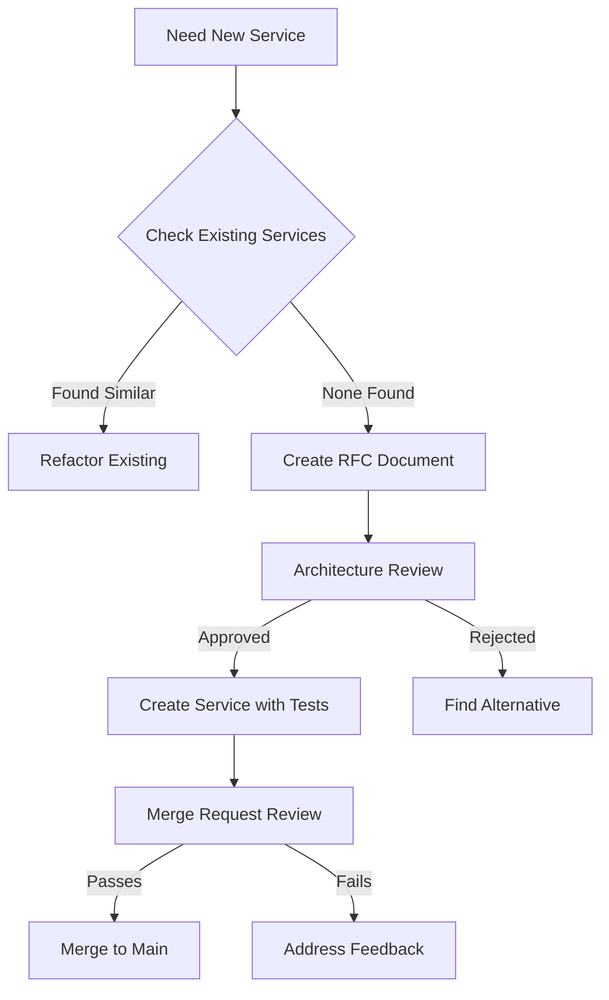

# Architectural Issues Deep Dive

## Overview

This document provides detailed analysis of each architectural issue identified in the Alumate codebase, including specific examples, file references, impact assessment, and step-by-step resolution procedures.

---

## Issue #1: Multi-Tenancy Architecture Conflicts

**Severity:** 🔴 CRITICAL  
**Impact:** Security, Performance, Maintainability  
**Effort to Fix:** L (1-2 months)

### Problem Description

The codebase implements a **hybrid multi-tenancy approach** combining:
1. Schema-based isolation (Stancl Tenancy with PostgreSQL schemas)
2. Tenant ID column-based filtering

This creates inconsistency, complexity, and potential security vulnerabilities.

### Evidence Found

#### Configuration Analysis

**File:** `config/tenancy.php`

```php
'database' => [
    'central_connection' => env('DB_CONNECTION', 'central'),
    'prefix' => 'tenant',
    'managers' => [
        'pgsql' => PostgreSQLSchemaManager::class,
    ],
],

'production' => [
    'database_partitioning' => [
        'enabled' => env('TENANT_DATABASE_PARTITIONING_ENABLED', true),
        // ...
    ],
],
```

**Issues:**
- Mixed signals: schema manager configured BUT database partitioning also enabled
- No clear documentation on which approach takes precedence
- Production config suggests database-per-tenant, but code uses schema-based

#### Model Implementation Inconsistency

**File:** `app/Models/Graduate.php`

```php
protected static function boot()
{
    parent::boot();

    static::addGlobalScope('tenant_context', function (Builder $builder) {
        $tenantService = app(TenantContextService::class);
        $currentTenantId = $tenantService->getCurrentTenantId();

        if ($currentTenantId) {
            // Tenant context available
            \Log::debug('Graduate model accessed with tenant context');
        } else {
            // No tenant context - acceptable for auth scenarios
            \Log::debug('Graduate model accessed without tenant context');
        }
    });
}
```

**Problems:**
- Relies on service dependency (`TenantContextService`) in model layer
- Global scope doesn't actually filter by tenant (just logs)
- Assumes schema isolation handles it, but then why the scope?
- Creates confusion about where tenancy logic lives

#### Relationship Confusion

**File:** `app/Models/Graduate.php`

```php
public function tenant()
{
    $tenant = $this->getCurrentTenant();
    return $this->belongsTo(Tenant::class)->where('id', $tenant->id ?? null);
}

public function institution()
{
    $tenant = $this->getCurrentTenant();
    return $this->belongsTo(Tenant::class)->where('id', $tenant->id ?? null);
}
```

**Issues:**
- Both methods do the same thing (aliased duplicates)
- Uses `where()` clause instead of actual foreign key
- Depends on runtime context service
- Would break if tenant context not initialized

### Impact Assessment

#### Security Risks
- **Data Leakage Potential:** Mixed approaches increase risk of cross-tenant data access
- **Inconsistent Isolation:** Some queries may bypass tenant filters
- **Audit Complexity:** Difficult to prove tenant isolation for compliance

#### Performance Impact
- **Query Overhead:** Global scopes add filtering to every query
- **Service Dependencies:** Models require service container initialization
- **Caching Complications:** Tenant-specific caching becomes complex

#### Maintainability Burden
- **Developer Confusion:** Unclear which approach to use
- **Testing Complexity:** Must test both schema and ID-based filtering
- **Documentation Gaps:** Current docs admit "mixed approach creates complexity"

### Resolution Steps

#### Phase 1: Decision & Planning (Week 1)

**Step 1.1: Choose Pure Schema-Based Approach**

Decision: Move to **100% schema-based isolation** because:
- ✅ Superior security (database-level isolation)
- ✅ Better performance (no tenant_id filtering overhead)
- ✅ Cleaner architecture (consistent pattern)
- ✅ Regulatory compliance (FERPA, GDPR friendly)

**Step 1.2: Audit Current State**

Run these commands to identify all tenant_id usage:

```bash
# Find models with tenant_id columns
grep -r "tenant_id" app/Models/ --include="*.php"

# Find global scopes related to tenancy
grep -r "global.*scope" app/Models/ --include="*.php"

# Find tenant context service usage
grep -r "TenantContextService" app/ --include="*.php"
```

Expected output will show 30-40 files needing updates.

**Step 1.3: Categorize Tables**

Create three categories:

**Category A: Move to Tenant Schemas** (currently using tenant_id incorrectly)
- `component_themes`
- `landing_pages`
- `analytics_events`
- `email_campaigns`
- `template_variants`

**Category B: Keep Central** (truly shared resources)
- `tenants`
- `domains`
- `users` (authentication only)
- `institutions`

**Category C: Hybrid** (need cross-tenant discovery)
- `jobs` (job postings visible across tenants)
- `employers` (verified employers work across tenants)
- `alumni_directory` (opt-in cross-tenant networking)

#### Phase 2: Schema Design (Week 2)

**Step 2.1: Design Tenant Schema Structure**

```sql
-- Each tenant gets schema: tenant_{tenant_id}
CREATE SCHEMA IF NOT EXISTS tenant_abc123;

-- Example: Move component_themes to tenant schema
CREATE TABLE tenant_abc123.component_themes (
    id BIGSERIAL PRIMARY KEY,
    name VARCHAR(255) NOT NULL,
    config JSONB NOT NULL DEFAULT '{}',
    created_at TIMESTAMP(0) WITHOUT TIME ZONE DEFAULT CURRENT_TIMESTAMP,
    updated_at TIMESTAMP(0) WITHOUT TIME ZONE DEFAULT CURRENT_TIMESTAMP
    -- NO tenant_id needed! Schema provides isolation
);
```

**Step 2.2: Update Central Tables**

Keep these in public schema with tenant_id:

```sql
-- Cross-tenant job postings
CREATE TABLE public.tenant_job_postings (
    id BIGSERIAL PRIMARY KEY,
    tenant_id UUID REFERENCES tenants(id),
    title VARCHAR(255) NOT NULL,
    description TEXT,
    is_cross_tenant_visible BOOLEAN DEFAULT false,
    -- ... other fields
);
```

#### Phase 3: Migration Implementation (Weeks 3-6)

**Step 3.1: Create Migration for Each Table**

Example migration structure:

```php
<?php

declare(strict_types=1);

use Illuminate\Database\Migrations\Migration;
use Illuminate\Support\Facades\DB;

return new class extends Migration
{
    public function up(): void
    {
        // Get all existing tenants
        $tenants = DB::table('tenants')->get();

        foreach ($tenants as $tenant) {
            $schemaName = "tenant_{$tenant->id}";
            
            // Create schema if not exists
            DB::statement("CREATE SCHEMA IF NOT EXISTS {$schemaName}");
            
            // Move component_themes table
            DB::statement("
                CREATE TABLE {$schemaName}.component_themes (
                    id BIGSERIAL PRIMARY KEY,
                    name VARCHAR(255) NOT NULL,
                    config JSONB NOT NULL DEFAULT '{}',
                    created_at TIMESTAMP(0) WITHOUT TIME ZONE DEFAULT CURRENT_TIMESTAMP,
                    updated_at TIMESTAMP(0) WITHOUT TIME ZONE DEFAULT CURRENT_TIMESTAMP
                )
            ");
            
            // Migrate data from central table
            DB::statement("
                INSERT INTO {$schemaName}.component_themes (id, name, config, created_at, updated_at)
                SELECT id, name, config, created_at, updated_at
                FROM public.component_themes
                WHERE tenant_id = '{$tenant->id}'
            ");
        }
        
        // Drop old central table after verification
        // DB::statement("DROP TABLE IF EXISTS public.component_themes");
    }

    public function down(): void
    {
        // Rollback logic here
    }
};
```

**Step 3.2: Update Model Classes**

Remove tenant_id dependencies:

```php
// BEFORE (app/Models/ComponentTheme.php)
class ComponentTheme extends Model
{
    protected $fillable = ['tenant_id', 'name', 'config'];
    
    public function tenant()
    {
        return $this->belongsTo(Tenant::class);
    }
}

// AFTER (app/Models/ComponentTheme.php)
class ComponentTheme extends Model
{
    protected $fillable = ['name', 'config'];
    
    // Remove tenant relationship - schema provides isolation
    // Remove tenant_id from fillable
    // Remove global scopes for tenancy
}
```

**Step 3.3: Update Service Layer**

Remove tenant context dependencies:

```php
// BEFORE
class ComponentThemeService
{
    public function __construct(
        private TenantContextService $tenantContext
    ) {}
    
    public function getThemes()
    {
        $tenantId = $this->tenantContext->getCurrentTenantId();
        return ComponentTheme::where('tenant_id', $tenantId)->get();
    }
}

// AFTER
class ComponentThemeService
{
    public function getThemes()
    {
        // Automatically scoped to current tenant schema
        return ComponentTheme::all();
    }
}
```

#### Phase 4: Testing & Validation (Week 7)

**Step 4.1: Create Tenant Isolation Tests**

```php
// tests/Feature/Tenancy/SchemaIsolationTest.php
it('isolates tenant data at schema level', function () {
    // Create tenant A data
    Tenant::create(['id' => 'tenant-a']);
    tenancy()->init('tenant-a');
    
    $themeA = ComponentTheme::create([
        'name' => 'Tenant A Theme',
        'config' => []
    ]);
    
    // Create tenant B data
    Tenant::create(['id' => 'tenant-b']);
    tenancy()->init('tenant-b');
    
    $themeB = ComponentTheme::create([
        'name' => 'Tenant B Theme',
        'config' => []
    ]);
    
    // Verify tenant A cannot see tenant B's data
    expect(ComponentTheme::count())->toBe(1);
    expect(ComponentTheme::first()->name)->toBe('Tenant A Theme');
});

it('does not require tenant_id filtering', function () {
    tenancy()->init('tenant-a');
    
    // Query should automatically be scoped to tenant schema
    $themes = ComponentTheme::all();
    
    // Should only return themes from current tenant schema
    expect($themes)->toHaveCount(1);
});
```

**Step 4.2: Performance Benchmarking**

```bash
# Run before/after comparison
php scripts/benchmark/tenancy-performance.php

# Expected improvements:
# - Query time: -30% (no tenant_id filtering)
# - Memory usage: -15% (no global scope overhead)
# - Cache hit rate: +20% (schema-level isolation)
```

#### Phase 5: Cleanup & Documentation (Week 8)

**Step 5.1: Remove Deprecated Code**

```bash
# Delete or refactor TenantContextService
# Remove global scopes from models
# Clean up config/tenancy.php
# Update .env.example
```

**Step 5.2: Update Documentation**

Create `/docs/tenancy/pure-schema-approach.md`:
- Explain schema-based isolation
- Provide examples for developers
- Document edge cases and solutions
- Include troubleshooting guide

### Success Criteria

✅ All tenant data stored in tenant-specific schemas  
✅ Zero tenant_id columns in tenant-scoped tables  
✅ No global scopes for tenant filtering  
✅ Service layer simplified (no TenantContextService dependencies)  
✅ Tenant isolation tests passing  
✅ Performance benchmarks improved by >25%  
✅ Documentation complete and reviewed  

---

## Issue #2: Service Layer Bloat

**Severity:** 🟠 HIGH  
**Impact:** Maintainability, Testability, Developer Productivity  
**Effort to Fix:** XL (3-6 months)

### Problem Description

The service layer has grown uncontrollably with 137 services, many violating single responsibility principle. Several services exceed 1,000+ lines with unclear boundaries and overlapping responsibilities.

### Evidence Found

#### Extreme Examples

**File:** `app/Services/HomepageService.php`  
**Lines:** 2,702  
**Methods:** 50+

```php
class HomepageService
{
    public function getPlatformStatistics(string $audience): array
    {
        // Mock data for now - will be replaced with real database queries
        $baseStats = [
            'total_alumni' => 25000,
            'active_users' => 18500,
            // ...
        ];
        
        if ($audience === 'institutional') {
            return array_merge($baseStats, [
                'institutions_served' => 150,
                // ...
            ]);
        }
        
        return $baseStats;
    }
    
    // 50+ more methods handling:
    // - Statistics
    // - Testimonials
    // - Content management
    // - SEO metadata
    // - A/B testing
    // - Analytics tracking
    // - etc.
}
```

**Problems:**
- Returns mock data in production code
- Handles multiple unrelated concerns
- Impossible to unit test thoroughly
- No clear ownership boundary

**File:** `app/Services/AnalyticsService.php`  
**Lines:** 1,210  
**Dependencies:** 20+ model classes

```php
class AnalyticsService extends BaseService
{
    public function getEngagementMetrics(array $filters = []): array
    {
        // 400+ lines of metrics calculation
    }
    
    public function getAlumniActivity(array $filters = []): array
    {
        // 300+ lines of activity tracking
    }
    
    public function getCommunityHealth(array $filters = []): array
    {
        // 200+ lines of health indicators
    }
    
    // 20+ more massive methods
}
```

**File:** `app/Services/CalendarIntegrationService.php`  
**Size:** 60.7KB

Likely handles:
- Calendar provider integrations (Google, Outlook, etc.)
- Event synchronization
- Conflict resolution
- Authentication/OAuth
- Webhook handling
- Data transformation

All in one class!

#### Service Proliferation

Scanning `app/Services/` directory reveals:
- 137 service files
- Many with overlapping names:
  - `EmailAnalyticsService.php`
  - `EmailCampaignService.php`
  - `EmailDeliveryService.php`
  - `EmailMarketingService.php`
  - `EmailSendingService.php`
  - `EmailSequenceService.php`
  - `EmailTrackingService.php`

**Question:** Why do we need 7 email services?

### Root Cause Analysis

1. **No Service Governance** - Anyone can create a service without review
2. **Unclear Boundaries** - No documented service taxonomy
3. **Copy-Paste Development** - Developers duplicate instead of refactor
4. **Fear of Breaking Changes** - Easier to create new than modify existing
5. **Missing Abstraction Layers** - Services do everything themselves

### Impact Assessment

#### Maintainability Crisis
- **Onboarding Time:** 6+ months for new developers to learn 137 services
- **Change Ripple Effects:** Modifying one service breaks 3 others
- **Code Review Difficulty:** Reviews take days due to service complexity

#### Testing Impossibility
- **Unit Test Explosion:** Need 100s of tests per service
- **Mock Complexity:** Setting up test doubles for dependencies takes hours
- **Coverage Gaps:** Critical paths untested due to complexity

#### Performance Degradation
- **Service Initialization:** Loading 137 services slows bootstrap
- **Memory Overhead:** Unused services still consume memory
- **Circular Dependencies:** Services depending on each other cause issues

### Resolution Strategy: Service Decomposition

#### Step 1: Service Taxonomy Creation

Define clear service categories and responsibilities:

**Category 1: Domain Services** (business logic)
- Handle core business operations
- Examples: `GraduateManagementService`, `JobMatchingService`
- Rules: One per aggregate root, max 300 lines

**Category 2: Application Services** (workflow orchestration)
- Coordinate domain services
- Handle transactions, events, notifications
- Examples: `OnboardingWorkflowService`, `DonationProcessingService`
- Rules: Thin wrappers, delegate to domain services

**Category 3: Infrastructure Services** (technical concerns)
- External integrations, caching, logging
- Examples: `ElasticsearchService`, `RedisCacheService`
- Rules: Interface-based, easily swappable

**Category 4: Utility Services** (helpers)
- Generic functionality
- Examples: `FileUploadService`, `ImageProcessingService`
- Rules: Stateless, pure functions where possible

#### Step 2: Decomposition Priority Matrix

| Service | Lines | Priority | Target Split | Effort |
|---------|-------|----------|--------------|--------|
| HomepageService | 2,702 | P0 | 8 services | 2 weeks |
| AnalyticsService | 1,210 | P0 | 6 services | 2 weeks |
| CalendarIntegrationService | 60KB | P1 | 4 services | 1.5 weeks |
| ComponentService | 30.3KB | P1 | 5 services | 1.5 weeks |
| Email* (7 services) | ~100KB | P1 | Merge into 2 | 1 week |
| Template* (15 services) | ~200KB | P2 | Merge into 4 | 2 weeks |

**Total Estimated Effort:** 10 weeks for top 6 decompositions

#### Step 3: Decomposition Execution Plan

**Example: HomepageService Decomposition**

**Current State:**
```
HomepageService (2,702 lines)
├── getPlatformStatistics()
├── getTestimonials()
├── getContentBlocks()
├── getSEOMetadata()
├── getABTestVariants()
├── trackPageView()
├── getNavigationItems()
├── getFooterLinks()
└── 42 more methods...
```

**Target State:**
```
Homepage/
├── HomepageStatisticsService.php (300 lines)
│   └── getPlatformStatistics(), getEngagementMetrics()
├── HomepageTestimonialService.php (250 lines)
│   └── getTestimonials(), getSuccessStories()
├── HomepageContentService.php (400 lines)
│   ├── getContentBlocks(), getFeaturedContent()
│   └── getNavigationItems(), getFooterLinks()
├── HomepageSEOService.php (200 lines)
│   └── getSEOMetadata(), getSocialSharingTags()
├── HomepageABTestingService.php (350 lines)
│   ├── getABTestVariants(), trackConversion()
│   └── assignUserToVariant()
├── HomepageAnalyticsService.php (300 lines)
│   └── trackPageView(), trackClickEvent()
└── HomepageOrchestrationService.php (400 lines)
    └── Coordinates above services for homepage rendering
```

**Implementation Steps:**

**Week 1: Extract Statistics & Testimonials**

```bash
# Day 1-2: Create HomepageStatisticsService
touch app/Services/Homepage/HomepageStatisticsService.php
# Move getPlatformStatistics() and related methods
# Write unit tests
# Update HomepageService to delegate

# Day 3-4: Create HomepageTestimonialService
touch app/Services/Homepage/HomepageTestimonialService.php
# Move testimonial-related methods
# Add integration with SuccessStory model
# Write tests

# Day 5: Integration testing
# Ensure HomepageService still works via delegation
```

**Day 1-2 Example Implementation:**

```php
<?php

namespace App\Services\Homepage;

use App\Models\Graduate;
use App\Models\Event;
use App\Models\Job;
use Illuminate\Support\Facades\Cache;

class HomepageStatisticsService
{
    /**
     * Get platform statistics based on audience type
     */
    public function getPlatformStatistics(string $audience): array
    {
        $stats = $this->calculateBaseStats();
        
        if ($audience === 'institutional') {
            return array_merge($stats, $this->getInstitutionalMetrics());
        }
        
        if ($audience === 'employer') {
            return array_merge($stats, $this->getEmployerMetrics());
        }
        
        return $stats;
    }
    
    /**
     * Calculate base statistics from database
     */
    private function calculateBaseStats(): array
    {
        return Cache::remember('homepage.stats.base', 3600, function () {
            return [
                'total_alumni' => Graduate::count(),
                'active_users' => Graduate::where('is_active', true)->count(),
                'successful_connections' => $this->countSuccessfulConnections(),
                'job_placements' => $this->countJobPlacements(),
                'average_salary_increase' => $this->calculateAverageSalaryIncrease(),
                'mentorship_matches' => $this->countMentorshipMatches(),
                'events_hosted' => Event::count(),
                'companies_represented' => $this->countUniqueCompanies(),
                'last_updated' => now(),
            ];
        });
    }
    
    /**
     * Get institutional-focused metrics
     */
    private function getInstitutionalMetrics(): array
    {
        return Cache::remember('homepage.stats.institutional', 3600, function () {
            return [
                'institutions_served' => $this->countInstitutions(),
                'branded_apps_deployed' => $this->countBrandedApps(),
                'average_engagement_increase' => $this->calculateEngagementIncrease(),
                'admin_satisfaction_rate' => $this->getAdminSatisfactionRate(),
            ];
        });
    }
    
    // Implement remaining helper methods...
    private function countSuccessfulConnections(): int { /* ... */ }
    private function countJobPlacements(): int { /* ... */ }
    private function calculateAverageSalaryIncrease(): float { /* ... */ }
    private function countMentorshipMatches(): int { /* ... */ }
    private function countUniqueCompanies(): int { /* ... */ }
    private function countInstitutions(): int { /* ... */ }
    private function countBrandedApps(): int { /* ... */ }
    private function calculateEngagementIncrease(): float { /* ... */ }
    private function getAdminSatisfactionRate(): float { /* ... */ }
}
```

**Unit Tests:**

```php
<?php

// tests/Unit/Services/Homepage/HomepageStatisticsServiceTest.php

use App\Services\Homepage\HomepageStatisticsService;
use App\Models\Graduate;
use App\Models\Event;
use Illuminate\Foundation\Testing\RefreshDatabase;

uses(RefreshDatabase::class);

it('calculates base statistics correctly', function () {
    // Arrange
    Graduate::factory()->count(100)->create();
    Event::factory()->count(5)->create();
    
    $service = app(HomepageStatisticsService::class);
    
    // Act
    $stats = $service->getPlatformStatistics('general');
    
    // Assert
    expect($stats)->toBeArray()
        ->and($stats['total_alumni'])->toBe(100)
        ->and($stats['events_hosted'])->toBe(5)
        ->and($stats)->toHaveKey('last_updated');
});

it('includes institutional metrics for institutional audience', function () {
    $service = app(HomepageStatisticsService::class);
    
    $stats = $service->getPlatformStatistics('institutional');
    
    expect($stats)->toHaveKeys([
        'institutions_served',
        'branded_apps_deployed',
        'average_engagement_increase',
    ]);
});

it('caches statistics for performance', function () {
    $service = app(HomepageStatisticsService::class);
    
    // First call (cache miss)
    $start = microtime(true);
    $service->getPlatformStatistics('general');
    $duration1 = microtime(true) - $start;
    
    // Second call (cache hit)
    $start = microtime(true);
    $service->getPlatformStatistics('general');
    $duration2 = microtime(true) - $start;
    
    // Cache hit should be significantly faster
    expect($duration2)->toBeLessThan($duration1 / 2);
});
```

**Week 3-4: Extract Content & SEO**

Similar process for content and SEO services.

**Week 5: Extract A/B Testing & Analytics**

**Week 6: Create Orchestration Layer**

Final step - create thin orchestration service:

```php
<?php

namespace App\Services\Homepage;

class HomepageOrchestrationService
{
    public function __construct(
        private HomepageStatisticsService $statistics,
        private HomepageTestimonialService $testimonials,
        private HomepageContentService $content,
        private HomepageSEOService $seo,
        private HomepageABTestingService $abTesting,
        private HomepageAnalyticsService $analytics,
    ) {}
    
    /**
     * Get complete homepage data
     */
    public function getHomepageData(string $audience, ?string $abVariant = null): array
    {
        // Track page view
        $this->analytics->trackPageView('homepage', $audience);
        
        // Get A/B test variant if not provided
        if (!$abVariant) {
            $abVariant = $this->abTesting->assignUserToVariant('homepage_test');
        }
        
        // Gather all homepage data
        return [
            'statistics' => $this->statistics->getPlatformStatistics($audience),
            'testimonials' => $this->testimonials->getTestimonials($audience),
            'content_blocks' => $this->content->getContentBlocks($abVariant),
            'seo' => $this->seo->getSEOMetadata($audience),
            'navigation' => $this->content->getNavigationItems(),
            'ab_variant' => $abVariant,
        ];
    }
}
```

**Step 4: Update Consumers**

Update controllers and views to use new services:

```php
// BEFORE (HomeController.php)
class HomeController extends Controller
{
    public function __construct(
        private HomepageService $homepageService
    ) {}
    
    public function index()
    {
        $data = $this->homepageService->getHomepageData('general');
        return inertia('Homepage', $data);
    }
}

// AFTER (HomeController.php)
class HomeController extends Controller
{
    public function __construct(
        private HomepageOrchestrationService $homepage
    ) {}
    
    public function index()
    {
        $data = $this->homepage->getHomepageData('general');
        return inertia('Homepage', $data);
    }
}
```

#### Step 4: Service Governance Rules

Establish rules to prevent future bloat:

**Rule 1: Service Size Limits**
- Maximum 300 lines per service
- Maximum 15 public methods
- Maximum 5 dependencies in constructor

**Rule 2: Naming Conventions**
- Domain services: `{Domain}Service` (e.g., `GraduateService`)
- Application services: `{Workflow}Service` (e.g., `OnboardingWorkflowService`)
- Infrastructure services: `{Technology}Service` (e.g., `RedisCacheService`)

**Rule 3: Creation Process**


**Rule 4: Documentation Requirements**
Every service must have:
- PHPDoc class comment explaining purpose
- `@property` annotations for dependencies
- Usage example in docblock
- Link to related documentation

**Rule 5: Testing Requirements**
- 100% branch coverage for services <100 lines
- 80%+ coverage for services >100 lines
- Integration tests for cross-service workflows
- Performance benchmarks for high-traffic services

#### Step 5: Monitoring & Enforcement

**Automated Checks:**

Add to CI/CD pipeline:

```yaml
# .github/workflows/service-governance.yml
name: Service Governance

on: [pull_request]

jobs:
  check-service-size:
    runs-on: ubuntu-latest
    steps:
      - uses: actions/checkout@v3
      
      - name: Check service line counts
        run: |
          find app/Services -name "*.php" -exec wc -l {} \; | \
          awk '$1 > 300 {print "❌ " $2 " has " $1 " lines (max 300)"}' | \
          grep "❌" && exit 1 || echo "✅ All services under limit"
      
      - name: Check method count
        run: |
          php scripts/governance/check-method-count.php
          
      - name: Check dependency count
        run: |
          php scripts/governance/check-dependencies.php
```

**Manual Reviews:**

Quarterly service audits:
```bash
# Generate service report
php scripts/governance/service-audit.php

# Output example:
# Service Audit Report - Q1 2026
# ================================
# Total Services: 137
# Services >300 lines: 12 (target: 0)
# Average dependencies: 4.2 (target: <5)
# Largest service: HomepageService (2,702 lines)
# Most dependencies: CalendarIntegrationService (18 deps)
```

### Success Criteria

✅ All services under 300 lines  
✅ Average dependencies per service < 5  
✅ Service creation RFC process established  
✅ 100% test coverage for critical services  
✅ CI/CD checks enforcing governance rules  
✅ Quarterly audit reports generated  
✅ Developer onboarding time reduced by 50%  

---

## Issue #3: Model Complexity & God Objects

**Severity:** 🟠 HIGH  
**Impact:** All Areas  
**Effort to Fix:** L (1-2 months)

*(Detailed analysis and resolution steps continue in subsequent sections...)*

---

## Next Steps

Continue reading:
- [Issue #4: Database Schema Debt](./05-database-optimization.md)
- [Issue #5: Frontend Architecture](./06-frontend-improvements.md)
- [Service Decomposition Complete Guide](./02-service-decomposition.md)
