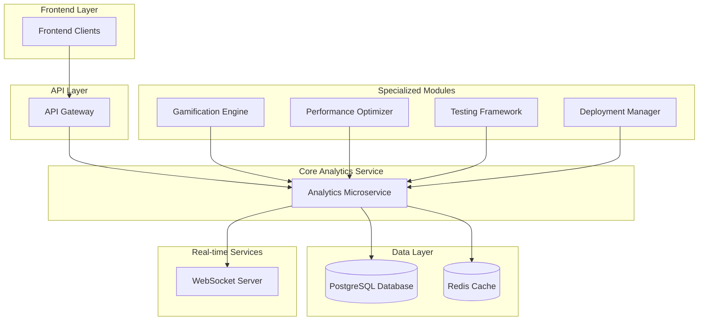

# Advanced Analytics System Architecture Plan

## Overview

This document outlines the architecture plan for implementing the remaining advanced analytics features for the Alumate platform. Building upon the existing analytics foundation, this plan addresses four key areas: gamification analytics, performance optimization, comprehensive testing, and integration/deployment enhancements.

## System Architecture Diagram



## 1. Gamification Analytics

### Backend Service Implementation

The GamificationAnalyticsService will extend the existing analytics capabilities to track and measure user engagement through gamification elements.

#### Key Components:
- Badge earning tracking
- Points accumulation monitoring
- Leaderboard position calculation
- Achievement progression analysis
- User engagement scoring

#### API Endpoints:
- `GET /api/analytics/gamification/metrics` - Retrieve gamification metrics
- `GET /api/analytics/gamification/leaderboard` - Get leaderboard rankings
- `POST /api/analytics/gamification/events` - Track gamification events

#### Database Schema Extensions:
```php
// Add to existing migrations
Schema::table('analytics_events', function (Blueprint $table) {
    $table->string('gamification_type')->nullable();
    $table->integer('points_earned')->nullable();
    $table->string('badge_earned')->nullable();
});
```

### Frontend Dashboard Implementation

#### Vue Component Structure:
- `GamificationDashboard.vue` - Main dashboard page
- `LeaderboardWidget.vue` - Leaderboard display component
- `AchievementProgress.vue` - Individual achievement tracking
- `PointsTracker.vue` - Points accumulation visualization
- `EngagementScore.vue` - Overall engagement scoring

#### Key Features:
- Real-time leaderboard updates
- Achievement progress visualization
- Points accumulation charts
- Engagement scoring metrics
- Tenant-scoped data querying
- Component library integration

## 2. Performance Optimization

### Database Indexing and Migration Updates

#### Indexing Strategy:
- Composite indexes for frequently queried analytics combinations
- Partial indexes for filtered analytics data
- Expression indexes for computed analytics metrics
- Covering indexes for dashboard summary queries

#### Migration Examples:
```php
// Performance optimization migration
Schema::table('analytics_events', function (Blueprint $table) {
    $table->index(['tenant_id', 'created_at', 'event_type']);
    $table->index(['user_id', 'created_at']);
    $table->index(['session_id', 'created_at']);
});

// Partitioning strategy for large datasets
Schema::table('analytics_snapshots', function (Blueprint $table) {
    $table->index(['tenant_id', 'snapshot_date']);
});
```

### Redis Caching Implementation

#### Cache Strategy:
- Tiered caching for analytics data (hot/warm/cold)
- Cache warming jobs for pre-computed analytics
- Cache invalidation strategies for real-time updates
- Memory optimization for cache storage

#### Cache Keys:
- `analytics:tenant:{id}:dashboard` - Tenant dashboard data
- `analytics:tenant:{id}:metrics:{type}` - Specific metric caches
- `analytics:tenant:{id}:leaderboard` - Leaderboard data
- `analytics:tenant:{id}:realtime:{session}` - Session-specific real-time data

#### Cache Warming Jobs:
- `WarmCacheJob.php` - Pre-populate frequently accessed analytics data
- `DailyAnalyticsSnapshotJob.php` - Generate daily analytics snapshots
- `LeaderboardCalculationJob.php` - Periodic leaderboard recalculations

### Real-time Optimizations

#### WebSocket Throttling:
- Configurable message rate limiting per client
- Message batching for high-frequency events
- Connection pooling for WebSocket servers
- Adaptive throttling based on server load

#### Broadcasting Configuration:
```php
// config/broadcasting.php
'connections' => [
    'redis' => [
        'driver' => 'redis',
        'connection' => 'default',
        'queue' => 'broadcasting',
        'throttle' => [
            'messages_per_second' => 10,
            'burst_size' => 20,
        ],
    ],
],
```

## 3. Testing Suite Enhancement

### Unit Testing Expansion

#### Analytics Service Tests:
- `tests/Unit/Services/GamificationAnalyticsServiceTest.php`
- `tests/Unit/Services/PerformanceOptimizationTest.php`
- `tests/Unit/Services/RealTimeAnalyticsTest.php`

#### Model Tests:
- `tests/Unit/Models/AnalyticsEventTest.php`
- `tests/Unit/Models/GamificationMetricTest.php`
- `tests/Unit/Models/AnalyticsSnapshotTest.php`

### Integration Testing

#### Cross-System Integration Tests:
- `tests/Integration/GamificationAnalyticsIntegrationTest.php`
- `tests/Integration/PerformanceOptimizationIntegrationTest.php`
- `tests/Integration/TenantIsolationAnalyticsTest.php`

#### API Endpoint Tests:
- `tests/Feature/Api/GamificationAnalyticsApiTest.php`
- `tests/Feature/Api/PerformanceMetricsApiTest.php`
- `tests/Feature/Api/RealTimeAnalyticsApiTest.php`

### Performance Testing

#### Load Testing Scripts:
- `tests/Performance/AnalyticsLoadTest.php`
- `tests/Performance/GamificationEngineStressTest.php`
- `tests/Performance/RealTimeBroadcastingTest.php`

#### Benchmark Tests:
- `tests/Benchmark/AnalyticsQueryBenchmark.php`
- `tests/Benchmark/CacheHitRatioTest.php`
- `tests/Benchmark/WebSocketThroughputTest.php`

## 4. Integration and Deployment

### System Integration Points

#### Observer Pattern Implementation:
- `app/Observers/AnalyticsEventObserver.php` - Track analytics events
- `app/Observers/GamificationEventObserver.php` - Monitor gamification activities
- `app/Observers/UserEngagementObserver.php` - Measure user engagement

#### Event Broadcasting:
- `app/Events/AnalyticsDataProcessed.php` - Analytics data processing completion
- `app/Events/GamificationAchievementUnlocked.php` - Achievement unlocked events
- `app/Events/LeaderboardUpdated.php` - Leaderboard position changes

### Kubernetes Deployment Updates

#### Deployment Configuration:
```yaml
# infrastructure/k8s/deployment.yaml
spec:
  template:
    spec:
      containers:
        - name: analytics-service
          resources:
            requests:
              memory: "512Mi"
              cpu: "250m"
            limits:
              memory: "1Gi"
              cpu: "500m"
          env:
            - name: ANALYTICS_CACHE_TTL
              value: "300"
            - name: ANALYTICS_BATCH_SIZE
              value: "100"
```

### Validation Scripts

#### Deployment Validation:
- `scripts/validation/analytics-deployment-check.sh` - Validate analytics service deployment
- `scripts/validation/cache-configuration-check.php` - Verify cache configuration
- `scripts/validation/database-index-check.php` - Confirm database indexes exist

#### Health Checks:
- `scripts/health/analytics-service-health.php` - Analytics service health check
- `scripts/health/cache-connection-test.php` - Cache connectivity verification
- `scripts/health/database-performance-test.php` - Database performance validation

## Overlap Management

### Component Library Integration
- Reuse existing charting components for gamification dashboards
- Utilize shared UI components for analytics visualizations
- Maintain consistency with existing design system

### Performance Optimization Synergy
- Extend existing caching mechanisms rather than duplicating
- Leverage current warm cache jobs for analytics data pre-loading
- Integrate with existing performance monitoring systems

### Testing Framework Alignment
- Follow established testing patterns from existing analytics tests
- Extend current test coverage rather than creating parallel systems
- Integrate with existing CI/CD testing pipelines

### Deployment Process Integration
- Align with existing deployment workflows and procedures
- Extend current validation scripts rather than creating new ones
- Maintain consistency with established deployment practices

## Security Considerations

### Data Protection
- Implement tenant-scoped data access for all analytics queries
- Ensure proper encryption for sensitive analytics data at rest
- Apply appropriate access controls to analytics dashboards

### Privacy Compliance
- Support data anonymization for analytics events
- Implement data retention policies for analytics data
- Provide mechanisms for data subject rights fulfillment

## Accessibility Requirements

### WCAG Compliance
- Ensure all analytics dashboards meet WCAG 2.1 AA standards
- Provide alternative text for data visualizations
- Support keyboard navigation for all analytics interfaces
- Maintain proper color contrast ratios in analytics displays

## Performance Impact Assessment

### Resource Utilization
- Monitor CPU and memory usage for analytics services
- Optimize database queries to minimize performance impact
- Implement efficient caching to reduce database load
- Use connection pooling for database connections

### Scalability Planning
- Design analytics services to scale horizontally
- Implement sharding strategies for large analytics datasets
- Plan for increased WebSocket connections with real-time features
- Optimize cache usage to reduce backend load

## Implementation Roadmap

### Phase 1: Foundation
1. Implement GamificationAnalyticsService backend
2. Create core API endpoints for gamification metrics
3. Set up database indexing and migration updates
4. Implement basic Redis caching for analytics data

### Phase 2: Frontend Integration
1. Develop GamificationDashboard Vue component
2. Create dashboard widgets for gamification metrics
3. Implement real-time updates for leaderboard positions
4. Integrate with existing component library

### Phase 3: Performance Optimization
1. Deploy advanced caching strategies
2. Implement WebSocket throttling
3. Optimize database queries with new indexes
4. Set up cache warming jobs

### Phase 4: Testing and Validation
1. Implement comprehensive unit test coverage
2. Create integration tests for all new features
3. Execute performance testing scenarios
4. Validate deployment configurations

### Phase 5: Deployment and Monitoring
1. Update Kubernetes deployment configurations
2. Implement validation scripts
3. Set up monitoring and alerting
4. Execute final integration testing

## Conclusion

This architecture plan provides a comprehensive roadmap for implementing the remaining advanced analytics features while maintaining alignment with existing systems and practices. By focusing on gamification analytics, performance optimization, thorough testing, and seamless integration, this approach ensures the platform continues to deliver high-quality analytics capabilities while maintaining scalability and reliability.