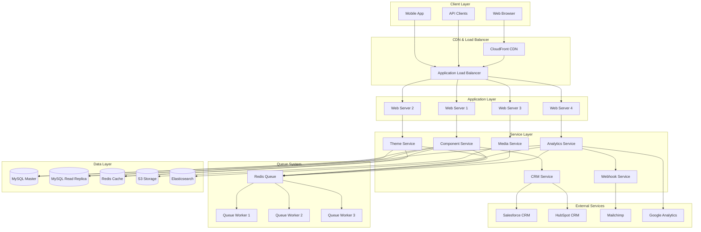

# Architecture Guide

## Overview

The Component Library System follows a modular, scalable architecture designed for multi-tenant SaaS applications. This guide covers the system architecture, design patterns, extension mechanisms, and best practices for maintaining and extending the system.

## System Architecture

### High-Level Architecture



### Multi-Tenant Architecture

The system implements a multi-tenant architecture with tenant isolation at multiple levels:

#### Database-Level Isolation

```php
<?php
// app/Models/Concerns/BelongsToTenant.php

namespace App\Models\Concerns;

use App\Models\Tenant;
use Illuminate\Database\Eloquent\Builder;
use Illuminate\Database\Eloquent\Relations\BelongsTo;

trait BelongsToTenant
{
    protected static function bootBelongsToTenant(): void
    {
        static::addGlobalScope('tenant', function (Builder $builder) {
            if (auth()->check() && auth()->user()->tenant_id) {
                $builder->where('tenant_id', auth()->user()->tenant_id);
            }
        });
        
        static::creating(function ($model) {
            if (auth()->check() && auth()->user()->tenant_id) {
                $model->tenant_id = auth()->user()->tenant_id;
            }
        });
    }
    
    public function tenant(): BelongsTo
    {
        return $this->belongsTo(Tenant::class);
    }
    
    public function scopeForTenant(Builder $query, int $tenantId): Builder
    {
        return $query->where('tenant_id', $tenantId);
    }
}
```

#### Middleware-Level Isolation

```php
<?php
// app/Http/Middleware/EnsureTenantAccess.php

namespace App\Http\Middleware;

use Closure;
use Illuminate\Http\Request;
use Symfony\Component\HttpFoundation\Response;

class EnsureTenantAccess
{
    public function handle(Request $request, Closure $next): Response
    {
        $user = $request->user();
        
        if (!$user || !$user->tenant_id) {
            return response()->json(['error' => 'Tenant access required'], 403);
        }
        
        // Set tenant context for the request
        app()->instance('current_tenant', $user->tenant);
        
        // Add tenant ID to all database queries
        config(['database.connections.mysql.tenant_id' => $user->tenant_id]);
        
        return $next($request);
    }
}
```

#### Cache-Level Isolation

```php
<?php
// app/Services/TenantCacheService.php

namespace App\Services;

use Illuminate\Support\Facades\Cache;

class TenantCacheService
{
    private int $tenantId;
    
    public function __construct(?int $tenantId = null)
    {
        $this->tenantId = $tenantId ?? auth()->user()?->tenant_id ?? 0;
    }
    
    public function get(string $key, $default = null)
    {
        return Cache::get($this->getTenantKey($key), $default);
    }
    
    public function put(string $key, $value, $ttl = null): bool
    {
        return Cache::put($this->getTenantKey($key), $value, $ttl);
    }
    
    public function forget(string $key): bool
    {
        return Cache::forget($this->getTenantKey($key));
    }
    
    public function flush(): bool
    {
        $pattern = "tenant_{$this->tenantId}_*";
        
        // For Redis
        if (Cache::getStore() instanceof \Illuminate\Cache\RedisStore) {
            $redis = Cache::getStore()->getRedis();
            $keys = $redis->keys($pattern);
            
            if (!empty($keys)) {
                return $redis->del($keys) > 0;
            }
        }
        
        return true;
    }
    
    private function getTenantKey(string $key): string
    {
        return "tenant_{$this->tenantId}_{$key}";
    }
}
```

## Design Patterns

### Service Layer Pattern

The system uses a service layer to encapsulate business logic and provide a clean API for controllers:

```php
<?php
// app/Services/ComponentService.php

namespace App\Services;

use App\Models\Component;
use App\Models\ComponentInstance;
use App\Contracts\ComponentServiceInterface;
use App\Events\ComponentCreated;
use App\Events\ComponentUpdated;
use App\Exceptions\ComponentValidationException;
use Illuminate\Support\Facades\DB;
use Illuminate\Support\Facades\Validator;

class ComponentService implements ComponentServiceInterface
{
    public function __construct(
        private TenantCacheService $cache,
        private ComponentValidationService $validator
    ) {}
    
    public function create(array $data): Component
    {
        $this->validator->validateCreate($data);
        
        return DB::transaction(function () use ($data) {
            $component = Component::create([
                'name' => $data['name'],
                'slug' => $this->generateSlug($data['name']),
                'category' => $data['category'],
                'type' => $data['type'],
                'description' => $data['description'] ?? null,
                'config' => $data['config'],
                'metadata' => $data['metadata'] ?? [],
                'version' => '1.0.0',
                'is_active' => $data['is_active'] ?? true,
            ]);
            
            // Clear relevant caches
            $this->cache->forget("components_category_{$component->category}");
            $this->cache->forget('components_all');
            
            // Dispatch event
            ComponentCreated::dispatch($component);
            
            return $component;
        });
    }
    
    public function update(Component $component, array $data): Component
    {
        $this->validator->validateUpdate($component, $data);
        
        return DB::transaction(function () use ($component, $data) {
            $oldVersion = $component->version;
            
            $component->update([
                'name' => $data['name'] ?? $component->name,
                'category' => $data['category'] ?? $component->category,
                'type' => $data['type'] ?? $component->type,
                'description' => $data['description'] ?? $component->description,
                'config' => $data['config'] ?? $component->config,
                'metadata' => $data['metadata'] ?? $component->metadata,
                'version' => $this->incrementVersion($oldVersion),
                'is_active' => $data['is_active'] ?? $component->is_active,
            ]);
            
            // Update slug if name changed
            if (isset($data['name']) && $data['name'] !== $component->getOriginal('name')) {
                $component->update(['slug' => $this->generateSlug($data['name'])]);
            }
            
            // Clear caches
            $this->clearComponentCaches($component);
            
            // Dispatch event
            ComponentUpdated::dispatch($component, $oldVersion);
            
            return $component->fresh();
        });
    }
    
    public function duplicate(Component $component, array $modifications = []): Component
    {
        $data = array_merge([
            'name' => "Copy of {$component->name}",
            'category' => $component->category,
            'type' => $component->type,
            'description' => $component->description,
            'config' => $component->config,
            'metadata' => $component->metadata,
        ], $modifications);
        
        return $this->create($data);
    }
    
    public function search(array $criteria): \Illuminate\Contracts\Pagination\LengthAwarePaginator
    {
        $cacheKey = 'components_search_' . md5(serialize($criteria));
        
        return $this->cache->remember($cacheKey, 300, function () use ($criteria) {
            $query = Component::query();
            
            if (!empty($criteria['category'])) {
                $query->where('category', $criteria['category']);
            }
            
            if (!empty($criteria['search'])) {
                $query->where(function ($q) use ($criteria) {
                    $q->where('name', 'like', "%{$criteria['search']}%")
                      ->orWhere('description', 'like', "%{$criteria['search']}%");
                });
            }
            
            if (isset($criteria['is_active'])) {
                $query->where('is_active', $criteria['is_active']);
            }
            
            $sortField = $criteria['sort'] ?? 'created_at';
            $sortDirection = $criteria['direction'] ?? 'desc';
            $query->orderBy($sortField, $sortDirection);
            
            return $query->paginate($criteria['per_page'] ?? 15);
        });
    }
    
    private function generateSlug(string $name): string
    {
        $baseSlug = \Str::slug($name);
        $slug = $baseSlug;
        $counter = 1;
        
        while (Component::where('slug', $slug)->exists()) {
            $slug = $baseSlug . '-' . $counter;
            $counter++;
        }
        
        return $slug;
    }
    
    private function incrementVersion(string $version): string
    {
        $parts = explode('.', $version);
        $parts[2] = (int)$parts[2] + 1;
        return implode('.', $parts);
    }
    
    private function clearComponentCaches(Component $component): void
    {
        $this->cache->forget("component_{$component->id}");
        $this->cache->forget("components_category_{$component->category}");
        $this->cache->forget('components_all');
        
        // Clear instance caches
        $component->instances->each(function ($instance) {
            $this->cache->forget("component_instance_{$instance->id}");
        });
    }
}
```

### Repository Pattern

For complex data access patterns, the system uses repositories:

```php
<?php
// app/Repositories/ComponentRepository.php

namespace App\Repositories;

use App\Models\Component;
use App\Contracts\ComponentRepositoryInterface;
use Illuminate\Database\Eloquent\Collection;

class ComponentRepository implements ComponentRepositoryInterface
{
    public function __construct(private Component $model) {}
    
    public function findById(int $id): ?Component
    {
        return $this->model->find($id);
    }
    
    public function findBySlug(string $slug): ?Component
    {
        return $this->model->where('slug', $slug)->first();
    }
    
    public function findByCategory(string $category): Collection
    {
        return $this->model->where('category', $category)
                          ->where('is_active', true)
                          ->orderBy('name')
                          ->get();
    }
    
    public function findPopular(int $limit = 10): Collection
    {
        return $this->model->select('components.*')
                          ->join('component_instances', 'components.id', '=', 'component_instances.component_id')
                          ->selectRaw('COUNT(component_instances.id) as usage_count')
                          ->where('components.is_active', true)
                          ->groupBy('components.id')
                          ->orderByDesc('usage_count')
                          ->limit($limit)
                          ->get();
    }
    
    public function findWithAnalytics(int $id): ?Component
    {
        return $this->model->with([
            'instances.analytics' => function ($query) {
                $query->where('created_at', '>=', now()->subDays(30));
            }
        ])->find($id);
    }
    
    public function create(array $data): Component
    {
        return $this->model->create($data);
    }
    
    public function update(Component $component, array $data): bool
    {
        return $component->update($data);
    }
    
    public function delete(Component $component): bool
    {
        return $component->delete();
    }
}
```

### Event-Driven Architecture

The system uses Laravel events for decoupled communication:

```php
<?php
// app/Events/ComponentCreated.php

namespace App\Events;

use App\Models\Component;
use Illuminate\Broadcasting\InteractsWithSockets;
use Illuminate\Foundation\Events\Dispatchable;
use Illuminate\Queue\SerializesModels;

class ComponentCreated
{
    use Dispatchable, InteractsWithSockets, SerializesModels;
    
    public function __construct(public Component $component) {}
}
```

```php
<?php
// app/Listeners/ComponentCreatedListener.php

namespace App\Listeners;

use App\Events\ComponentCreated;
use App\Services\WebhookService;
use App\Services\AnalyticsService;
use App\Jobs\GenerateComponentThumbnail;

class ComponentCreatedListener
{
    public function __construct(
        private WebhookService $webhookService,
        private AnalyticsService $analyticsService
    ) {}
    
    public function handle(ComponentCreated $event): void
    {
        $component = $event->component;
        
        // Send webhook notification
        $this->webhookService->dispatch('component.created', [
            'component' => $component->toArray(),
            'tenant_id' => $component->tenant_id,
            'created_by' => auth()->id()
        ], $component->tenant_id);
        
        // Track analytics event
        $this->analyticsService->track('component_created', [
            'component_id' => $component->id,
            'category' => $component->category,
            'type' => $component->type,
            'tenant_id' => $component->tenant_id
        ]);
        
        // Generate thumbnail asynchronously
        GenerateComponentThumbnail::dispatch($component);
    }
}
```

### Factory Pattern

For creating different types of components:

```php
<?php
// app/Factories/ComponentFactory.php

namespace App\Factories;

use App\Models\Component;
use App\Contracts\ComponentFactoryInterface;

class ComponentFactory implements ComponentFactoryInterface
{
    private array $builders = [];
    
    public function __construct()
    {
        $this->registerBuilders();
    }
    
    public function create(string $category, string $type, array $config): Component
    {
        $builder = $this->getBuilder($category, $type);
        
        if (!$builder) {
            throw new \InvalidArgumentException("No builder found for {$category}:{$type}");
        }
        
        return $builder->build($config);
    }
    
    public function registerBuilder(string $category, string $type, ComponentBuilderInterface $builder): void
    {
        $this->builders[$category][$type] = $builder;
    }
    
    private function registerBuilders(): void
    {
        // Hero components
        $this->registerBuilder('hero', 'individual', new HeroIndividualBuilder());
        $this->registerBuilder('hero', 'institution', new HeroInstitutionBuilder());
        $this->registerBuilder('hero', 'employer', new HeroEmployerBuilder());
        
        // Form components
        $this->registerBuilder('forms', 'lead_capture', new LeadCaptureFormBuilder());
        $this->registerBuilder('forms', 'demo_request', new DemoRequestFormBuilder());
        $this->registerBuilder('forms', 'contact', new ContactFormBuilder());
        
        // Testimonial components
        $this->registerBuilder('testimonials', 'single', new SingleTestimonialBuilder());
        $this->registerBuilder('testimonials', 'carousel', new TestimonialCarouselBuilder());
        $this->registerBuilder('testimonials', 'grid', new TestimonialGridBuilder());
    }
    
    private function getBuilder(string $category, string $type): ?ComponentBuilderInterface
    {
        return $this->builders[$category][$type] ?? null;
    }
}
```

```php
<?php
// app/Builders/HeroIndividualBuilder.php

namespace App\Builders;

use App\Models\Component;
use App\Contracts\ComponentBuilderInterface;

class HeroIndividualBuilder implements ComponentBuilderInterface
{
    public function build(array $config): Component
    {
        $defaultConfig = [
            'headline' => 'Welcome Back, Alumni',
            'subheading' => 'Reconnect with your network and advance your career',
            'cta_text' => 'Join Network',
            'cta_url' => '/register',
            'background_type' => 'gradient',
            'gradient_colors' => ['#3B82F6', '#1E40AF'],
            'text_alignment' => 'center',
            'show_statistics' => true,
            'statistics' => [
                ['label' => 'Alumni Connected', 'value' => 10000, 'suffix' => '+'],
                ['label' => 'Job Opportunities', 'value' => 500, 'suffix' => '+'],
                ['label' => 'Success Stories', 'value' => 1200, 'suffix' => ''],
                ['label' => 'Years of Impact', 'value' => 25, 'suffix' => '']
            ]
        ];
        
        $mergedConfig = array_merge($defaultConfig, $config);
        
        return Component::create([
            'name' => $config['name'] ?? 'Hero Section - Individual Alumni',
            'category' => 'hero',
            'type' => 'individual',
            'description' => 'Hero section optimized for individual alumni engagement',
            'config' => $mergedConfig,
            'metadata' => [
                'tags' => ['hero', 'alumni', 'individual', 'conversion'],
                'target_audience' => 'individual_alumni',
                'conversion_optimized' => true
            ],
            'version' => '1.0.0',
            'is_active' => true
        ]);
    }
}
```

## Extension Mechanisms

### Plugin System

The system supports plugins for extending functionality:

```php
<?php
// app/Contracts/PluginInterface.php

namespace App\Contracts;

interface PluginInterface
{
    public function getName(): string;
    public function getVersion(): string;
    public function getDescription(): string;
    public function getDependencies(): array;
    public function install(): bool;
    public function uninstall(): bool;
    public function activate(): bool;
    public function deactivate(): bool;
    public function isActive(): bool;
}
```

```php
<?php
// app/Services/PluginManager.php

namespace App\Services;

use App\Contracts\PluginInterface;
use Illuminate\Support\Facades\File;

class PluginManager
{
    private array $plugins = [];
    private array $activePlugins = [];
    
    public function __construct()
    {
        $this->loadPlugins();
        $this->loadActivePlugins();
    }
    
    public function register(PluginInterface $plugin): void
    {
        $this->plugins[$plugin->getName()] = $plugin;
    }
    
    public function activate(string $pluginName): bool
    {
        if (!isset($this->plugins[$pluginName])) {
            return false;
        }
        
        $plugin = $this->plugins[$pluginName];
        
        // Check dependencies
        foreach ($plugin->getDependencies() as $dependency) {
            if (!$this->isActive($dependency)) {
                throw new \Exception("Plugin {$pluginName} requires {$dependency} to be active");
            }
        }
        
        if ($plugin->activate()) {
            $this->activePlugins[$pluginName] = $plugin;
            $this->saveActivePlugins();
            return true;
        }
        
        return false;
    }
    
    public function deactivate(string $pluginName): bool
    {
        if (!isset($this->activePlugins[$pluginName])) {
            return false;
        }
        
        $plugin = $this->activePlugins[$pluginName];
        
        if ($plugin->deactivate()) {
            unset($this->activePlugins[$pluginName]);
            $this->saveActivePlugins();
            return true;
        }
        
        return false;
    }
    
    public function getActivePlugins(): array
    {
        return $this->activePlugins;
    }
    
    public function isActive(string $pluginName): bool
    {
        return isset($this->activePlugins[$pluginName]);
    }
    
    private function loadPlugins(): void
    {
        $pluginDirs = File::directories(app_path('Plugins'));
        
        foreach ($pluginDirs as $dir) {
            $pluginFile = $dir . '/Plugin.php';
            
            if (File::exists($pluginFile)) {
                require_once $pluginFile;
                
                $className = 'App\\Plugins\\' . basename($dir) . '\\Plugin';
                
                if (class_exists($className)) {
                    $plugin = new $className();
                    $this->register($plugin);
                }
            }
        }
    }
    
    private function loadActivePlugins(): void
    {
        $activePlugins = config('plugins.active', []);
        
        foreach ($activePlugins as $pluginName) {
            if (isset($this->plugins[$pluginName])) {
                $this->activePlugins[$pluginName] = $this->plugins[$pluginName];
            }
        }
    }
    
    private function saveActivePlugins(): void
    {
        $activePluginNames = array_keys($this->activePlugins);
        
        $configPath = config_path('plugins.php');
        $config = "<?php\n\nreturn [\n    'active' => " . var_export($activePluginNames, true) . "\n];\n";
        
        File::put($configPath, $config);
    }
}
```

### Hook System

For extending functionality at specific points:

```php
<?php
// app/Services/HookManager.php

namespace App\Services;

class HookManager
{
    private array $hooks = [];
    
    public function addHook(string $name, callable $callback, int $priority = 10): void
    {
        if (!isset($this->hooks[$name])) {
            $this->hooks[$name] = [];
        }
        
        $this->hooks[$name][] = [
            'callback' => $callback,
            'priority' => $priority
        ];
        
        // Sort by priority
        usort($this->hooks[$name], fn($a, $b) => $a['priority'] <=> $b['priority']);
    }
    
    public function executeHook(string $name, ...$args)
    {
        if (!isset($this->hooks[$name])) {
            return $args[0] ?? null;
        }
        
        $result = $args[0] ?? null;
        
        foreach ($this->hooks[$name] as $hook) {
            $result = call_user_func($hook['callback'], $result, ...$args);
        }
        
        return $result;
    }
    
    public function hasHook(string $name): bool
    {
        return isset($this->hooks[$name]) && !empty($this->hooks[$name]);
    }
    
    public function removeHook(string $name, callable $callback): void
    {
        if (!isset($this->hooks[$name])) {
            return;
        }
        
        $this->hooks[$name] = array_filter(
            $this->hooks[$name],
            fn($hook) => $hook['callback'] !== $callback
        );
    }
}
```

Usage example:

```php
<?php
// In a service provider or plugin

app(HookManager::class)->addHook('component.before_render', function ($component, $config) {
    // Modify component configuration before rendering
    if ($component->category === 'hero') {
        $config['custom_class'] = 'enhanced-hero';
    }
    
    return $config;
});

// In the component rendering service
$config = app(HookManager::class)->executeHook('component.before_render', $component, $config);
```

### Custom Component Types

System for registering custom component types:

```php
<?php
// app/Services/ComponentTypeRegistry.php

namespace App\Services;

use App\Contracts\ComponentTypeInterface;

class ComponentTypeRegistry
{
    private array $types = [];
    
    public function register(string $category, string $type, ComponentTypeInterface $handler): void
    {
        if (!isset($this->types[$category])) {
            $this->types[$category] = [];
        }
        
        $this->types[$category][$type] = $handler;
    }
    
    public function get(string $category, string $type): ?ComponentTypeInterface
    {
        return $this->types[$category][$type] ?? null;
    }
    
    public function getAll(): array
    {
        return $this->types;
    }
    
    public function getByCategory(string $category): array
    {
        return $this->types[$category] ?? [];
    }
    
    public function exists(string $category, string $type): bool
    {
        return isset($this->types[$category][$type]);
    }
}
```

```php
<?php
// app/ComponentTypes/CustomHeroType.php

namespace App\ComponentTypes;

use App\Contracts\ComponentTypeInterface;
use App\Models\Component;

class CustomHeroType implements ComponentTypeInterface
{
    public function getName(): string
    {
        return 'Custom Hero';
    }
    
    public function getDescription(): string
    {
        return 'A customizable hero section with advanced features';
    }
    
    public function getConfigSchema(): array
    {
        return [
            'type' => 'object',
            'properties' => [
                'headline' => ['type' => 'string', 'required' => true],
                'subheading' => ['type' => 'string'],
                'background_video' => ['type' => 'string', 'format' => 'uri'],
                'parallax_effect' => ['type' => 'boolean', 'default' => false],
                'animation_type' => [
                    'type' => 'string',
                    'enum' => ['fade', 'slide', 'zoom'],
                    'default' => 'fade'
                ]
            ]
        ];
    }
    
    public function render(Component $component, array $config = []): string
    {
        $mergedConfig = array_merge($component->config, $config);
        
        return view('components.hero.custom', [
            'component' => $component,
            'config' => $mergedConfig
        ])->render();
    }
    
    public function validate(array $config): array
    {
        $validator = validator($config, [
            'headline' => 'required|string|max:100',
            'subheading' => 'nullable|string|max:200',
            'background_video' => 'nullable|url',
            'parallax_effect' => 'boolean',
            'animation_type' => 'in:fade,slide,zoom'
        ]);
        
        return $validator->errors()->toArray();
    }
}
```

## Performance Optimization

### Caching Strategy

Multi-level caching for optimal performance:

```php
<?php
// app/Services/ComponentCacheService.php

namespace App\Services;

use App\Models\Component;
use Illuminate\Support\Facades\Cache;

class ComponentCacheService
{
    private const CACHE_TTL = 3600; // 1 hour
    private const RENDER_CACHE_TTL = 86400; // 24 hours
    
    public function getCachedComponent(int $id): ?Component
    {
        return Cache::remember(
            "component_{$id}",
            self::CACHE_TTL,
            fn() => Component::with(['theme', 'instances'])->find($id)
        );
    }
    
    public function getCachedRender(Component $component, array $config, string $variant = 'default'): string
    {
        $cacheKey = $this->getRenderCacheKey($component, $config, $variant);
        
        return Cache::remember($cacheKey, self::RENDER_CACHE_TTL, function () use ($component, $config, $variant) {
            return $this->renderComponent($component, $config, $variant);
        });
    }
    
    public function invalidateComponent(Component $component): void
    {
        Cache::forget("component_{$component->id}");
        Cache::forget("components_category_{$component->category}");
        
        // Clear render cache for all variants
        $patterns = [
            "render_component_{$component->id}_*",
            "render_preview_{$component->id}_*"
        ];
        
        foreach ($patterns as $pattern) {
            $this->clearCachePattern($pattern);
        }
    }
    
    public function warmupCache(Component $component): void
    {
        // Pre-cache component data
        $this->getCachedComponent($component->id);
        
        // Pre-render common variants
        $variants = ['default', 'mobile', 'preview'];
        $configs = [$component->config];
        
        foreach ($variants as $variant) {
            foreach ($configs as $config) {
                $this->getCachedRender($component, $config, $variant);
            }
        }
    }
    
    private function getRenderCacheKey(Component $component, array $config, string $variant): string
    {
        $configHash = md5(serialize($config));
        return "render_component_{$component->id}_{$variant}_{$configHash}";
    }
    
    private function renderComponent(Component $component, array $config, string $variant): string
    {
        // Actual rendering logic here
        return app(ComponentRenderService::class)->render($component, $config, $variant);
    }
    
    private function clearCachePattern(string $pattern): void
    {
        if (Cache::getStore() instanceof \Illuminate\Cache\RedisStore) {
            $redis = Cache::getStore()->getRedis();
            $keys = $redis->keys($pattern);
            
            if (!empty($keys)) {
                $redis->del($keys);
            }
        }
    }
}
```

### Database Optimization

Query optimization and indexing strategies:

```sql
-- Component table indexes
CREATE INDEX idx_components_tenant_category ON components(tenant_id, category);
CREATE INDEX idx_components_tenant_active ON components(tenant_id, is_active);
CREATE INDEX idx_components_slug ON components(slug);
CREATE INDEX idx_components_created_at ON components(created_at);

-- Component instances indexes
CREATE INDEX idx_component_instances_component_id ON component_instances(component_id);
CREATE INDEX idx_component_instances_page ON component_instances(page_type, page_id);
CREATE INDEX idx_component_instances_position ON component_instances(page_type, page_id, position);

-- Analytics indexes
CREATE INDEX idx_component_analytics_instance_event ON component_analytics(component_instance_id, event_type);
CREATE INDEX idx_component_analytics_created_at ON component_analytics(created_at);
CREATE INDEX idx_component_analytics_user_session ON component_analytics(user_id, session_id);

-- Composite indexes for common queries
CREATE INDEX idx_components_tenant_category_active ON components(tenant_id, category, is_active);
CREATE INDEX idx_analytics_instance_event_date ON component_analytics(component_instance_id, event_type, created_at);
```

### Asset Optimization

```php
<?php
// app/Services/AssetOptimizationService.php

namespace App\Services;

use Illuminate\Support\Facades\Storage;
use Intervention\Image\Facades\Image;

class AssetOptimizationService
{
    public function optimizeImage(string $path, array $options = []): array
    {
        $image = Image::make(Storage::path($path));
        $optimized = [];
        
        // Generate WebP version
        $webpPath = $this->changeExtension($path, 'webp');
        $image->encode('webp', $options['webp_quality'] ?? 85)
              ->save(Storage::path($webpPath));
        $optimized['webp'] = $webpPath;
        
        // Generate AVIF version (if supported)
        if (extension_loaded('imagick')) {
            $avifPath = $this->changeExtension($path, 'avif');
            $image->encode('avif', $options['avif_quality'] ?? 80)
                  ->save(Storage::path($avifPath));
            $optimized['avif'] = $avifPath;
        }
        
        // Generate responsive sizes
        $sizes = $options['sizes'] ?? [320, 640, 768, 1024, 1280, 1920];
        
        foreach ($sizes as $width) {
            if ($image->width() > $width) {
                $resizedPath = $this->addSuffix($path, "_w{$width}");
                $image->resize($width, null, function ($constraint) {
                    $constraint->aspectRatio();
                    $constraint->upsize();
                })->save(Storage::path($resizedPath));
                
                $optimized["w{$width}"] = $resizedPath;
                
                // WebP version of resized image
                $resizedWebpPath = $this->changeExtension($resizedPath, 'webp');
                $image->encode('webp', $options['webp_quality'] ?? 85)
                      ->save(Storage::path($resizedWebpPath));
                $optimized["w{$width}_webp"] = $resizedWebpPath;
            }
        }
        
        return $optimized;
    }
    
    public function generateSrcSet(array $optimizedImages, string $baseUrl): string
    {
        $srcSet = [];
        
        foreach ($optimizedImages as $key => $path) {
            if (preg_match('/^w(\d+)$/', $key, $matches)) {
                $width = $matches[1];
                $srcSet[] = "{$baseUrl}/{$path} {$width}w";
            }
        }
        
        return implode(', ', $srcSet);
    }
    
    private function changeExtension(string $path, string $extension): string
    {
        return preg_replace('/\.[^.]+$/', ".{$extension}", $path);
    }
    
    private function addSuffix(string $path, string $suffix): string
    {
        $info = pathinfo($path);
        return $info['dirname'] . '/' . $info['filename'] . $suffix . '.' . $info['extension'];
    }
}
```

This comprehensive architecture guide provides the foundation for understanding, maintaining, and extending the Component Library System. The modular design, clear separation of concerns, and extensibility mechanisms ensure the system can evolve with changing requirements while maintaining performance and reliability.