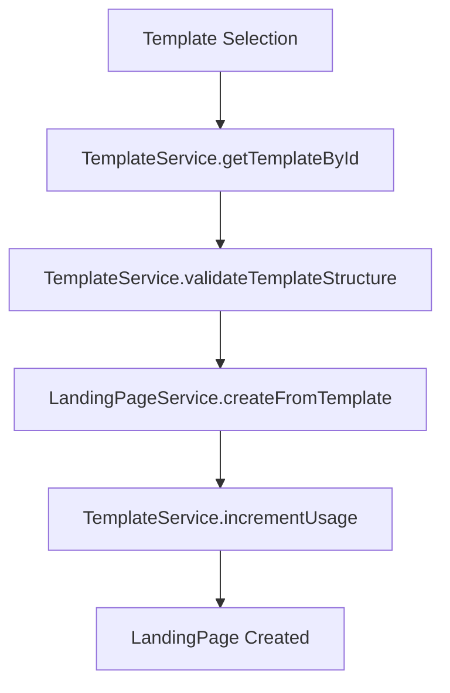
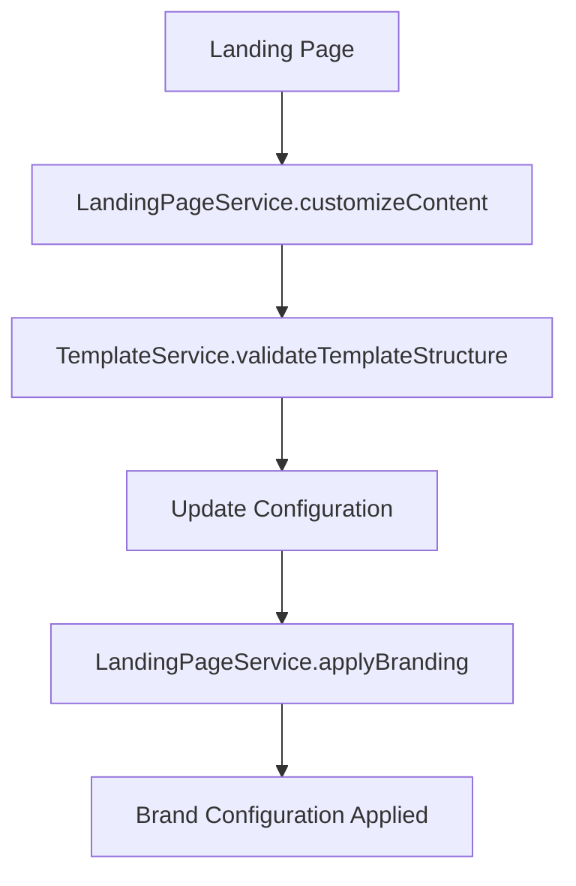
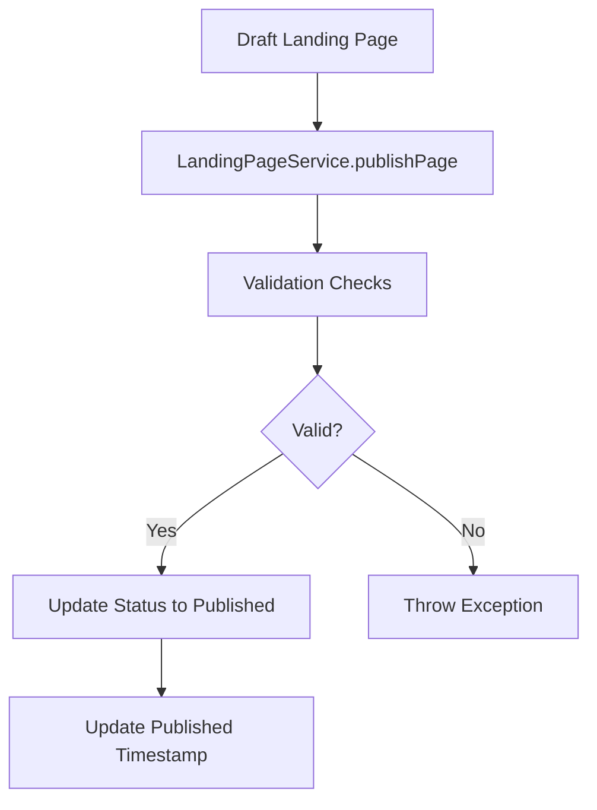

# Template Creation Services - Technical Specification

## Overview

The Template Creation System provides a comprehensive set of services for managing templates, landing pages, and related business logic. This document outlines the architecture, functionality, and technical specifications for the service layer.

## Service Architecture

### Core Services

#### 1. TemplateService
**Location:** `app/Services/TemplateService.php`

**Purpose:** Core business logic for template management, filtering, and validation.

**Key Features:**
- Template retrieval with advanced filtering
- Search functionality with keyword matching
- Category and audience-based filtering
- Usage tracking and analytics
- Template structure validation and security
- Performance metrics management
- Multi-tenant isolation support

**Main Methods:**
- `getAllTemplates($filters, $options)` - Retrieve templates with filtering and pagination
- `getTemplateById($templateId)` - Get specific template with tenant validation
- `searchTemplates($query, $filters, $options)` - Keyword-based template search
- `getTemplatesByCategory($category, $filters)` - Category-based template retrieval
- `getTemplatesByAudience($audienceType, $filters)` - Audience-based template retrieval
- `getPremiumTemplates($filters)` - Premium template retrieval
- `getPopularTemplates($limit)` - Most used templates
- `getRecentlyUsedTemplates($limit)` - Recently accessed templates
- `validateTemplateStructure($structure)` - Security and schema validation
- `incrementUsage($templateId)` - Track template usage statistics
- `updatePerformanceMetrics($templateId, $metrics)` - Update performance data
- `getTemplateStats($templateId)` - Comprehensive template analytics

#### 2. LandingPageService
**Location:** `app/Services/LandingPageService.php` (Enhanced)

**Purpose:** Landing page creation, customization, branding, and publishing workflow.

**Key Features:**
- Template instantiation into landing pages
- Content customization and modification
- Brand configuration and application
- Publishing workflow management
- Performance analytics and metrics
- Form submission handling and lead generation
- Duplicate and archive functionality

**Main Methods:**
- `createFromTemplate($templateId, $customizations)` - Instantiate landing page from template
- `applyBranding($landingPageId, $brandConfig, $save)` - Apply brand configurations
- `customizeContent($landingPageId, $customizations, $save)` - Modify landing page content
- `publishPage($landingPageId, $options)` - Handle publishing workflow
- `getPerformanceMetrics($landingPageId, $timeframe)` - Retrieve performance analytics
- `duplicate($landingPageId, $overrides)` - Duplicate existing landing page
- `archive($landingPageId)` - Archive landing page
- `handleFormSubmission($landingPage, $formData, $request)` - Process form submissions

### Supporting Services

#### 3. TemplateStructureSanitizer
**Location:** `app/Services/TemplateStructureSanitizer.php`

**Purpose:** Clean and sanitize template structures to prevent XSS and security vulnerabilities.

**Key Features:**
- HTML sanitization
- XSS prevention
- Structured data validation
- Security pattern detection

**Methods:**
- `sanitize($structure)` - Main sanitization method
- `sanitizeString($string)` - String-level sanitization
- `detectSecurityIssues($string)` - Security issue detection

#### 4. TemplateSecurityValidator
**Location:** `app/Services/TemplateSecurityValidator.php`

**Purpose:** Comprehensive security validation for template structures.

**Key Features:**
- XSS pattern detection
- JavaScript injection prevention
- Event handler validation
- Security best practices enforcement

**Methods:**
- `validate($structure)` - Main validation method
- `validateSection($section, $index)` - Section validation
- `isDangerousContext($string, $keyword)` - Context-aware security checking

### Custom Exceptions

#### 1. TemplateNotFoundException
**Location:** `app/Exceptions/TemplateNotFoundException.php`

Thrown when requested template is not found or accessible.

#### 2. TemplateValidationException
**Location:** `app/Exceptions/TemplateValidationException.php`

Thrown when template structure validation fails.

#### 3. TemplateSecurityException
**Location:** `app/Exceptions/TemplateSecurityException.php`

Thrown when template security validation fails (XSS, injection attacks, etc.).

## Data Flow

### Template Instantiation Flow



### Content Customization Flow



### Publishing Flow



## Security Features

### Input Validation
- Template structure JSON schema validation
- XSS prevention through content sanitization
- SQL injection prevention through parameterized queries
- Input length and format validation

### Multi-Tenant Isolation
- Automatic tenant scope application
- Tenant ID validation in all operations
- Context-aware data access
- Cross-tenant data leakage prevention

### Authentication & Authorization
- User permission validation
- Role-based access control
- Audit trail for all operations
- Session-based security

## Performance Optimizations

### Caching Strategy
- Redis-backed caching for template data
- Intelligent cache invalidation
- Sliding window caching for popular templates
- TTL-based cache expiration

### Database Optimization
- Efficient query construction
- Indexed fields for common searches
- Lazy loading for relationships
- Database connection pooling

### Code Optimizations
- PSR-12 compliant code structure
- Strict type hinting
- Memory-efficient data handling
- Optimized loop structures

## Testing Strategy

### Unit Tests
- PHPUnit-based test suite
- 100% method coverage target
- Mock-based dependency isolation
- Edge case and error scenario testing

### Integration Tests
- Full workflow testing
- Cross-service interaction validation
- Database integration testing
- API endpoint testing

### Performance Testing
- Load testing for high-traffic scenarios
- Memory usage monitoring
- Query performance analysis
- Caching effectiveness validation

## API Reference

### TemplateService API

```php
// Get all templates with filters
$templates = $templateService->getAllTemplates([
    'category' => 'landing',
    'audience_type' => 'individual',
    'is_premium' => false
], ['paginate' => true, 'per_page' => 20]);

// Search templates
$results = $templateService->searchTemplates('hero section', [
    'category' => 'landing'
]);

// Validate template structure
$isValid = $templateService->validateTemplateStructure($structure);
```

### LandingPageService API

```php
// Create from template
$landingPage = $landingPageService->createFromTemplate($templateId, [
    'name' => 'My Landing Page',
    'audience_type' => 'individual'
]);

// Apply branding
$brandedConfig = $landingPageService->applyBranding($landingPageId, $brandConfig);

// Publish page
$success = $landingPageService->publishPage($landingPageId, [
    'publish_at' => now()->addDays(1)
]);
```

## Error Handling

### Exception Hierarchy
```
Exception
├── TemplateNotFoundException
├── TemplateValidationException
└── TemplateSecurityException
```

### Error Responses
All services return standardized error responses:
- TemplateNotFoundException: 404 with template_not_found error
- TemplateValidationException: 422 with template_validation_failed error
- TemplateSecurityException: 422 with template_security_violation error

### Logging
- All exceptions are logged with full context
- Performance metrics are tracked
- Security violations are logged with alerts
- Business operations are logged for audit trails

## Configuration

### Environment Variables
```env
TEMPLATE_CACHE_DURATION=300
TEMPLATE_SECURITY_ENABLED=true
MAX_TEMPLATE_SIZE=1048576
TEMPLATE_VALIDATION_STRICT=true
```

### Database Configuration
- Multi-tenant setup support
- Redis cache configuration
- Database connection pooling
- Query optimization settings

## Monitoring & Analytics

### Built-in Metrics
- Template usage statistics
- Performance metrics tracking
- Error rate monitoring
- Cache hit/miss ratios
- Security violation tracking

### External Integration
- Integration with existing analytics systems
- Real-time monitoring dashboards
- Automated alerting for critical issues
- Performance trend analysis

## Maintenance & Operations

### Database Migrations
- Template table structure updates
- Performance indexes creation
- Data migration scripts
- Rollback procedures

### Cache Management
- Cache warming procedures
- Cache invalidation strategies
- Memory usage monitoring
- Cache key management

### Security Updates
- Regular security scanning
- Dependency vulnerability checks
- Security patch procedures
- Compliance audits

## Future Enhancements

### Planned Features
- Advanced template versioning
- A/B testing framework integration
- Machine learning-based template recommendations
- Advanced personalization engine
- Multi-language template support
- Real-time collaboration features

### Scalability Improvements
- Distributed caching strategies
- Database sharding support
- CDN integration for assets
- Microservices architecture evaluation

---

This specification provides a comprehensive overview of the Template Creation Services implementation. All services follow Laravel best practices and maintain consistency with the existing application architecture.