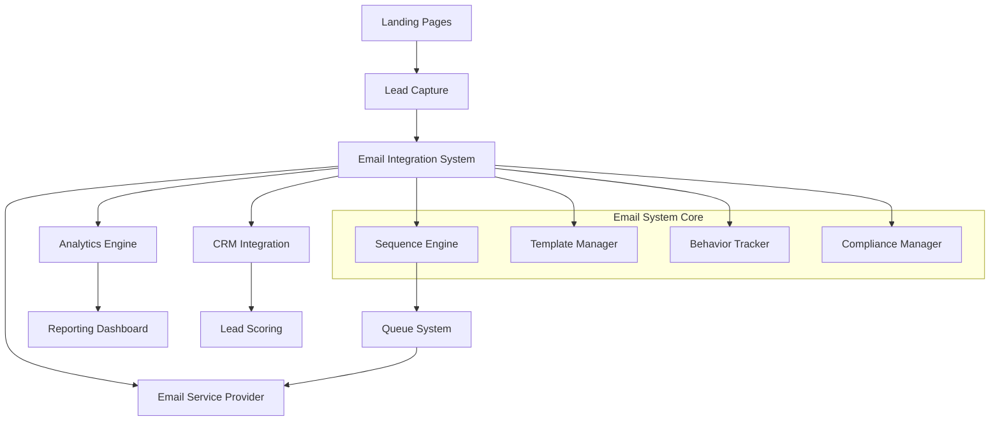
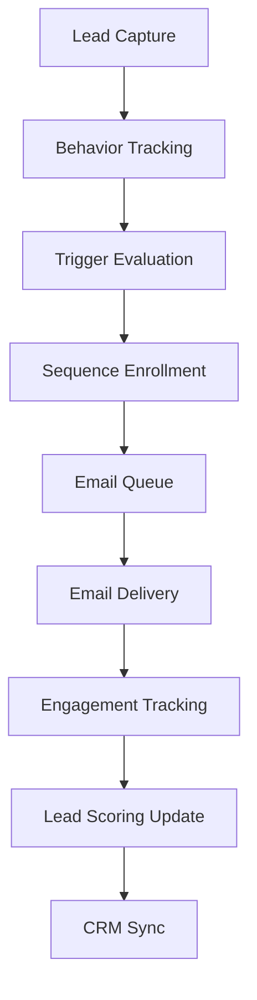

# Email Integration System Implementation Plan

## Overview

This document outlines the implementation plan for the Email Integration System as specified in the requirements located in `.kiro/specs/email-integration-system/`. The system will provide automated follow-up sequences and email marketing capabilities for leads captured through landing pages, enabling personalized, audience-specific email campaigns that nurture leads through the conversion funnel.

This implementation follows the specifications detailed in:
- Requirements: `.kiro/specs/email-integration-system/requirements.md`
- Design: `.kiro/specs/email-integration-system/design.md`
- Implementation Tasks: `.kiro/specs/email-integration-system/tasks.md`

## System Analysis

### Existing System Capabilities

The current system already has:
- Email campaign management with `EmailCampaign`, `EmailTemplate`, and `EmailAutomationRule` models
- Email marketing service with provider integration support
- Basic automation rules for triggering emails based on events
- Email tracking and analytics capabilities
- Multi-tenant architecture support

### Gaps to Address

The new requirements introduce several capabilities not fully covered by the existing system:

1. **Email Sequences**: Automated drip campaigns with timing controls (Requirement 1, 7)
2. **Lead Enrollment Management**: Tracking individual lead progress through sequences
3. **Behavior-Based Triggers**: Page visits, form abandonment, resource downloads (Requirement 3)
4. **Advanced Personalization**: Dynamic content based on lead data and behavior (Requirement 2)
5. **Compliance Management**: Enhanced unsubscribe and preference handling (Requirement 6)
6. **CRM Integration**: Deeper lead synchronization and scoring (Requirement 5)
7. **Advanced Analytics**: Funnel tracking from email to conversion (Requirement 4, 9)

## Database Schema Design

Based on the design specification in `.kiro/specs/email-integration-system/design.md`, the following tables are required:

### New Tables

#### email_sequences
```sql
CREATE TABLE email_sequences (
    id BIGINT PRIMARY KEY,
    tenant_id BIGINT NOT NULL,
    name VARCHAR(255) NOT NULL,
    description TEXT,
    audience_type ENUM('individual', 'institutional', 'employer'),
    trigger_type ENUM('form_submission', 'page_visit', 'behavior', 'manual'),
    trigger_conditions JSON,
    is_active BOOLEAN DEFAULT true,
    created_at TIMESTAMP,
    updated_at TIMESTAMP,
    INDEX idx_tenant_audience (tenant_id, audience_type),
    INDEX idx_active (is_active)
);
```

#### sequence_emails
```sql
CREATE TABLE sequence_emails (
    id BIGINT PRIMARY KEY,
    sequence_id BIGINT NOT NULL,
    template_id BIGINT NOT NULL,
    subject_line VARCHAR(25),
    delay_hours INT DEFAULT 0,
    send_order INT NOT NULL,
    trigger_conditions JSON,
    created_at TIMESTAMP,
    updated_at TIMESTAMP,
    FOREIGN KEY (sequence_id) REFERENCES email_sequences(id) ON DELETE CASCADE,
    INDEX idx_sequence_order (sequence_id, send_order)
);
```

#### sequence_enrollments
```sql
CREATE TABLE sequence_enrollments (
    id BIGINT PRIMARY KEY,
    sequence_id BIGINT NOT NULL,
    lead_id BIGINT NOT NULL,
    current_step INT DEFAULT 0,
    status ENUM('active', 'completed', 'paused', 'unsubscribed') DEFAULT 'active',
    enrolled_at TIMESTAMP,
    completed_at TIMESTAMP NULL,
    created_at TIMESTAMP,
    updated_at TIMESTAMP,
    FOREIGN KEY (sequence_id) REFERENCES email_sequences(id),
    FOREIGN KEY (lead_id) REFERENCES leads(id),
    UNIQUE KEY unique_enrollment (sequence_id, lead_id),
    INDEX idx_status (status),
    INDEX idx_next_send (status, current_step)
);
```

#### email_sends
```sql
CREATE TABLE email_sends (
    id BIGINT PRIMARY KEY,
    enrollment_id BIGINT NOT NULL,
    sequence_email_id BIGINT NOT NULL,
    lead_id BIGINT NOT NULL,
    subject VARCHAR(255),
    status ENUM('queued', 'sent', 'delivered', 'bounced', 'failed'),
    sent_at TIMESTAMP NULL,
    delivered_at TIMESTAMP NULL,
    opened_at TIMESTAMP NULL,
    clicked_at TIMESTAMP NULL,
    unsubscribed_at TIMESTAMP NULL,
    created_at TIMESTAMP,
    updated_at TIMESTAMP,
    FOREIGN KEY (enrollment_id) REFERENCES sequence_enrollments(id),
    INDEX idx_lead_status (lead_id, status),
    INDEX idx_performance (sent_at, opened_at, clicked_at)
);
```

## Database Migrations

The following migration files need to be created according to the implementation tasks in `.kiro/specs/email-integration-system/tasks.md`:

1. `2025_09_05_0000_create_email_sequences_table.php` - Creates the email_sequences table
2. `2025_09_05_0001_create_sequence_emails_table.php` - Creates the sequence_emails table
3. `2025_09_05_0002_create_sequence_enrollments_table.php` - Creates the sequence_enrollments table
4. `2025_09_05_0003_create_email_sends_table.php` - Creates the email_sends table

Each migration will follow Laravel's migration pattern with proper up() and down() methods for installation and rollback.

## Model Implementations

Following the design patterns in `.kiro/specs/email-integration-system/design.md`:

### EmailSequence Model

The `EmailSequence` model will represent an email sequence with the following key features:
- Tenant scoping for multi-tenant isolation
- Relationship methods for associated emails and enrollments
- Scopes for filtering by audience type, trigger type, and active status
- Validation rules for required fields
- Methods for sequence management

### SequenceEmail Model

The `SequenceEmail` model will represent individual emails within a sequence:
- Belongs to an EmailSequence
- References an EmailTemplate
- Contains timing and ordering information
- Supports trigger conditions for conditional sending
- Validation for proper ordering and timing

### SequenceEnrollment Model

The `SequenceEnrollment` model will track individual lead progress through sequences:
- Links leads to sequences
- Tracks current position in the sequence
- Manages enrollment status (active, completed, paused, unsubscribed)
- Records enrollment and completion timestamps
- Provides methods for enrollment management

### EmailSend Model

The `EmailSend` model will track individual email sends:
- Links to enrollments and sequence emails
- Tracks delivery status and engagement metrics
- Records timestamps for all engagement events
- Provides analytics data for performance tracking

## Factory Implementations

Following the testing requirements in `.kiro/specs/email-integration-system/tasks.md`:

### EmailSequenceFactory

The `EmailSequenceFactory` will generate test data for email sequences:
- Random names and descriptions
- Random audience types from the defined enum
- Random trigger types
- Tenant association for multi-tenant testing
- Active status with appropriate timestamps

### SequenceEmailFactory

The `SequenceEmailFactory` will generate test data for sequence emails:
- Association with email sequences
- References to email templates
- Random subject lines
- Variable delay hours and send orders
- Trigger conditions for testing conditional logic

### SequenceEnrollmentFactory

The `SequenceEnrollmentFactory` will generate test data for sequence enrollments:
- Association with sequences and leads
- Random current steps and statuses
- Enrollment timestamps
- Completion timestamps for completed enrollments

### EmailSendFactory

The `EmailSendFactory` will generate test data for email sends:
- Association with enrollments and sequence emails
- Random subjects and statuses
- Engagement timestamps for testing analytics
- Lead associations for tracking

## Implementation Phases

Based on the task breakdown in `.kiro/specs/email-integration-system/tasks.md`:

### Phase 1: Core Infrastructure (Database and Models) - Task 1

1. Create database migrations for new tables
2. Implement Eloquent models with relationships
3. Create model factories for testing
4. Add tenant scoping and validation rules

### Phase 2: Template and Sequence Management - Task 2

1. Enhance EmailTemplateService for sequence-specific templates
2. Implement EmailSequenceService for sequence operations
3. Create enrollment and progression logic
4. Build sequence creation and management APIs

### Phase 3: Behavior Tracking and Automation - Task 4

1. Create BehaviorTrackingService for user action monitoring
2. Implement trigger evaluation logic
3. Connect behavior triggers to automatic sequence enrollment
4. Build lead scoring updates based on email engagement

### Phase 4: Email Delivery and Queue System - Task 5

1. Implement queued jobs for email delivery
2. Create email engagement tracking mechanisms
3. Build retry logic and failure handling
4. Implement webhook handlers for email provider callbacks

### Phase 5: Compliance and Preference Management - Task 6

1. Build unsubscribe link generation and processing
2. Create double opt-in workflow for new subscriptions
3. Implement preference center for granular subscription controls
4. Add compliance validation to email sending process

### Phase 6: CRM Integration - Task 7

1. Create CRM synchronization service
2. Implement lead score updates based on email engagement
3. Build dynamic content based on CRM lead data
4. Add automatic sequence updates when CRM data changes

### Phase 7: Analytics and Reporting - Task 8

1. Build email performance analytics
2. Create funnel analysis from email open to final conversion
3. Implement attribution tracking from email clicks to landing page conversions
4. Build A/B testing capabilities for email variants

### Phase 8: Administrative Interfaces - Task 9

1. Create sequence management API endpoints
2. Build analytics dashboard API
3. Implement administrative UI components
4. Add monitoring and alerting for system health

### Phase 9: Automated Workflows - Task 10

1. Create lead nurturing automation engine
2. Implement automatic lead qualification and sales team notifications
3. Build re-engagement campaigns for inactive leads
4. Create institutional lead handling workflows

### Phase 10: Testing and Documentation - Task 11

1. Develop comprehensive test suite
2. Create API documentation
3. Write user guides and administrator documentation
4. Perform performance and security testing

## Integration with Existing Systems

### Template System Integration

The email integration will leverage the existing `Template` model and `TemplateService`:
- Use existing template categories and audience types
- Extend template structure for email-specific components
- Leverage existing validation and security features
- Utilize existing caching mechanisms

### Component System Integration

The system will integrate with the existing component system:
- Use existing component categories for email content blocks
- Leverage component configuration patterns
- Utilize existing responsive design capabilities
- Apply existing accessibility standards

### Email Marketing System Integration

The new system will extend the existing email marketing capabilities:
- Build upon existing `EmailCampaign` and `EmailTemplate` models
- Extend the `EmailMarketingService` with sequence functionality
- Utilize existing provider integration patterns
- Leverage existing analytics and tracking infrastructure

## Technical Architecture

Based on the architecture diagram in `.kiro/specs/email-integration-system/design.md`:

### High-Level Architecture



### Service Layer Architecture

The implementation will follow the existing service-oriented architecture pattern:

1. **EmailSequenceService**: Core business logic for sequence management
2. **BehaviorTrackingService**: User action monitoring and trigger evaluation
3. **EmailTemplateService**: Template management and personalization
4. **ComplianceService**: Unsubscribe and preference management
5. **CrmIntegrationService**: Lead synchronization and scoring
6. **AnalyticsService**: Performance tracking and reporting

### Data Flow



## Security and Compliance Considerations

Based on Requirement 6 in `.kiro/specs/email-integration-system/requirements.md`:

### GDPR Compliance
- Implement double opt-in for new email subscriptions
- Provide comprehensive data export capabilities
- Enable complete data erasure functionality
- Maintain detailed consent records

### Email Security
- Validate all template content for security vulnerabilities
- Implement proper email header injection prevention
- Use secure unsubscribe mechanisms
- Maintain proper SPF/DKIM/DMARC records

### Data Protection
- Apply tenant isolation to all data operations
- Implement proper access controls and permissions
- Encrypt sensitive data at rest
- Use secure communication protocols

## Performance Optimization

### Database Optimization
- Implement proper indexing strategies
- Use efficient query patterns
- Apply database connection pooling
- Implement read replicas for analytics queries

### Caching Strategy
- Cache frequently accessed sequences and templates
- Implement Redis-based caching for performance-critical operations
- Use intelligent cache invalidation
- Apply TTL-based cache expiration

### Queue Management
- Implement Redis-backed queues for email delivery
- Use job batching for high-volume sends
- Implement rate limiting to respect provider constraints
- Add monitoring and alerting for queue health

## Testing Strategy

Following the testing requirements in `.kiro/specs/email-integration-system/tasks.md`:

### Unit Testing
- Test all service methods with comprehensive coverage
- Validate model relationships and scopes
- Test validation and security features
- Verify tenant isolation functionality

### Integration Testing
- Test end-to-end sequence enrollment and email delivery
- Validate CRM synchronization workflows
- Test analytics data collection and reporting
- Verify multi-tenant data isolation

### Performance Testing
- Load test high-volume email queue processing
- Test template rendering with large datasets
- Verify analytics query performance
- Test concurrent enrollment processing

### Feature Testing
- Test API endpoints for sequence and template management
- Validate webhook handling for email provider callbacks
- Test user preference and unsubscribe workflows
- Verify performance analytics calculations

## Deployment Considerations

### Environment Setup
- Configure email service provider credentials
- Set up queue workers for email processing
- Configure webhook endpoints for provider callbacks
- Set up monitoring and alerting systems

### Migration Strategy
- Implement database migrations with proper rollback procedures
- Migrate existing email campaigns to new sequence format
- Update existing automation rules to use new system
- Provide backward compatibility during transition

### Monitoring and Maintenance
- Implement comprehensive logging for all operations
- Set up performance monitoring and alerting
- Schedule regular maintenance tasks
- Implement automated backup and recovery procedures

## Timeline and Milestones

Based on the implementation plan in `.kiro/specs/email-integration-system/tasks.md`:

### Week 1-2: Core Infrastructure
- Database schema design and implementation
- Model creation and relationship mapping
- Basic factory and seeder creation

### Week 3-4: Sequence Management
- EmailSequenceService implementation
- Template integration and personalization
- Basic API endpoint creation

### Week 5-6: Behavior Tracking
- BehaviorTrackingService development
- Trigger evaluation logic
- Lead enrollment automation

### Week 7-8: Email Delivery
- Queue system implementation
- Email sending infrastructure
- Engagement tracking mechanisms

### Week 9-10: Compliance and CRM
- Unsubscribe and preference management
- CRM integration layer
- Lead scoring updates

### Week 11-12: Analytics and UI
- Performance analytics implementation
- Administrative interfaces
- Dashboard development

### Week 13-14: Testing and Documentation
- Comprehensive test suite development
- Documentation creation
- Performance and security testing

### Week 15: Deployment and Launch
- Production deployment
- Monitoring setup
- User training and support

## Success Metrics

Based on the requirements in `.kiro/specs/email-integration-system/requirements.md`:

### Technical Metrics
- Email delivery success rate > 98%
- System response time < 200ms for API calls
- Queue processing capacity > 10,000 emails/hour
- Database query performance < 100ms for common operations

### Business Metrics
- Email open rates > 25% industry average
- Click-through rates > 5% industry average
- Lead conversion rates improvement > 15%
- User engagement scores improvement > 20%

### Operational Metrics
- System uptime > 99.9%
- Error rates < 0.1%
- Support ticket reduction > 30%
- User satisfaction scores > 4.5/5

## Risk Mitigation

### Technical Risks
- **Email deliverability issues**: Implement proper SPF/DKIM/DMARC and monitor reputation
- **Queue processing delays**: Implement monitoring and auto-scaling for queue workers
- **Database performance**: Use proper indexing and query optimization
- **Provider integration failures**: Implement fallback mechanisms and retry logic

### Business Risks
- **Low user adoption**: Provide comprehensive training and documentation
- **Compliance violations**: Implement thorough compliance checking and auditing
- **Data quality issues**: Implement data validation and cleansing processes
- **Integration failures**: Provide clear error handling and fallback mechanisms

### Operational Risks
- **Security breaches**: Implement comprehensive security measures and monitoring
- **System downtime**: Implement proper redundancy and failover mechanisms
- **Performance degradation**: Implement continuous monitoring and optimization
- **Data loss**: Implement regular backups and disaster recovery procedures