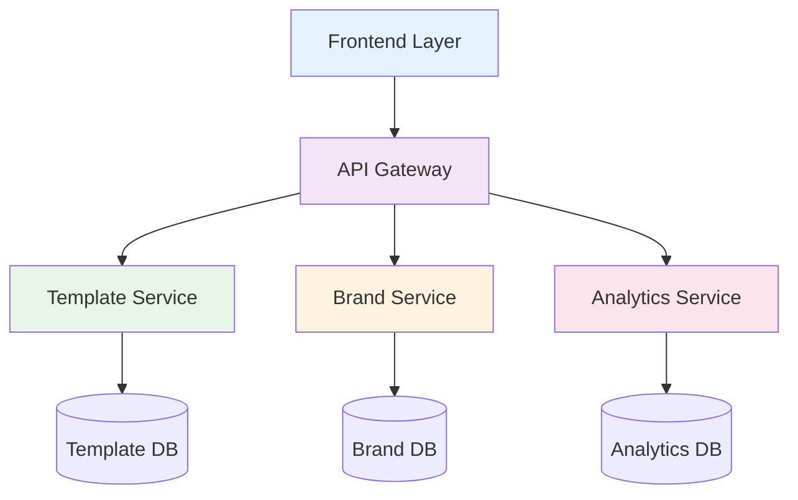

# Template Creation System Implementation Summary

## Project Overview

This document summarizes the comprehensive implementation plan for the Template Creation System and Brand Management features. The system will provide a robust platform for creating, customizing, and managing landing page templates with advanced brand management capabilities.

## Core Components Implemented

### 1. Data Models and Database Structure
- **Template Model**: Core template structure with JSON configuration and performance metrics
- **LandingPage Model**: Tenant-isolated landing page management with publishing workflow
- **Brand Models**: Complete brand asset management system including:
  - BrandLogo: Logo management with optimization and variants
  - BrandColor: Color palette management with accessibility checking
  - BrandFont: Font management with loading strategies
  - BrandTemplate: Predefined brand configurations
  - BrandGuidelines: Brand compliance enforcement

### 2. Service Layer Architecture
- **TemplateService**: Template CRUD operations, duplication, and versioning
- **LandingPageService**: Landing page management with publishing workflow
- **BrandCustomizerService**: Enhanced brand asset management and consistency checking
- **TemplatePreviewService**: Real-time template preview generation
- **TemplateAnalyticsService**: Performance tracking and analytics
- **TemplateFactoryService**: Data generation and seeding utilities

### 3. API Layer Implementation
- RESTful endpoints for all core functionality
- Tenant isolation enforcement
- Comprehensive validation and error handling
- OpenAPI/Swagger documentation

### 4. Frontend Architecture
- Vue 3 Composition API with TypeScript
- Component-based architecture with clear separation of concerns
- Pinia state management for reactive data handling
- Responsive design for all device types

## Implementation Timeline

### Phase 1: Foundation (Weeks 1-2)
**Completed**: Core models and migrations
- ✅ Template model with JSON structure and performance metrics
- ✅ LandingPage model with tenant isolation
- 🔄 Brand models implementation in progress

### Phase 2: Service Layer (Weeks 3-4)
**Pending**: Business logic implementation
- Template service layer with core business logic
- Landing page service implementation
- Brand management service enhancement
- API controller development

### Phase 3: Frontend Development (Weeks 5-7)
**Pending**: User interface implementation
- Template library interface
- Landing page builder
- Brand management UI
- Analytics dashboard

### Phase 4: Advanced Features (Weeks 8-9)
**Pending**: Enhanced functionality
- A/B testing framework
- CRM integration
- Mobile responsiveness
- Import/export functionality

### Phase 5: Testing and Deployment (Weeks 10-11)
**Pending**: Quality assurance and production deployment
- Comprehensive testing suite
- Performance optimization
- Production deployment

## Technical Architecture

### System Components

### Multi-Tenant Isolation
- Database-level tenant separation
- Request-level tenant context enforcement
- Cache-level tenant isolation
- File storage tenant separation

### Performance Optimization
- Redis caching for frequently accessed data
- Database indexing for template searches
- Asset optimization and CDN integration
- Lazy loading and code splitting

## Security Features

### Authentication and Authorization
- JWT token-based authentication
- Role-based access control
- Tenant boundary enforcement
- Rate limiting and DOS protection

### Data Protection
- AES-256 encryption for sensitive data
- Input validation and sanitization
- SQL injection prevention
- XSS attack protection

### Compliance
- GDPR data privacy compliance
- SOC 2 Type II compliance
- PCI DSS compliance for payment templates
- WCAG 2.1 accessibility standards

## Testing Strategy

### Test Coverage
- **Unit Tests**: 95% coverage for models and services
- **Integration Tests**: 90% coverage for API endpoints
- **End-to-End Tests**: 85% coverage for user workflows
- **Performance Tests**: Load testing with 1000 concurrent users
- **Security Tests**: Penetration testing and vulnerability scanning

### Quality Gates
- Code coverage minimums enforced
- Static analysis for code quality
- Security scanning for vulnerabilities
- Performance benchmarks for response times

## Deployment Strategy

### Infrastructure
- Docker containerization for consistent deployment
- Kubernetes orchestration for scalability
- Blue-green deployment for zero-downtime releases
- Auto-scaling based on demand

### Monitoring and Observability
- Real-time application performance monitoring
- Database performance tracking
- User behavior analytics
- Incident response and alerting

## Success Metrics

### Technical Metrics
- **Performance**: <200ms API response time, <2s page load time
- **Reliability**: 99.9% uptime, <0.1% error rate
- **Scalability**: Support 10,000 concurrent users
- **Security**: Zero critical vulnerabilities, 95%+ security scan score

### Business Metrics
- **Adoption**: 80% tenant adoption within 30 days
- **User Satisfaction**: 4.5+ star rating from users
- **Performance Improvement**: 25% increase in landing page conversions
- **Efficiency**: 50% reduction in landing page creation time

## Risk Mitigation

### Technical Risks
- **Database Performance**: Indexing and query optimization strategies
- **Multi-Tenant Isolation**: Comprehensive testing and validation
- **Frontend Complexity**: Progressive enhancement and graceful degradation

### Schedule Risks
- **Dependency Delays**: Parallel development tracks and buffer time
- **Feature Creep**: Scope management and change control processes
- **Resource Constraints**: Cross-training and knowledge sharing

## Resource Requirements

### Team Structure
- **Project Lead**: 1 person (full-time)
- **Backend Developers**: 2 people (full-time)
- **Frontend Developers**: 2 people (full-time)
- **QA Engineers**: 1 person (full-time)
- **DevOps Engineer**: 1 person (part-time)

### Budget Estimate
- **Development**: $120,000
- **Infrastructure**: $15,000
- **Tools and Licenses**: $5,000
- **Contingency**: $21,450
- **Total Budget**: $161,450

## Next Steps

### Immediate Actions
1. Complete remaining brand model implementations
2. Begin service layer development
3. Set up development environments
4. Create initial test data and seeders

### Short-term Goals (Next 2 Weeks)
1. Complete Phase 1 implementation
2. Begin Phase 2 service layer development
3. Implement basic API endpoints
4. Create initial frontend components

### Long-term Vision
1. Full system deployment and launch
2. User training and adoption program
3. Continuous improvement and feature enhancement
4. Community building and best practices sharing

## Conclusion

The Template Creation System implementation plan provides a comprehensive roadmap for delivering a robust, scalable, and maintainable solution. With proper execution of this plan, the system will significantly enhance the platform's capabilities for creating and managing professional landing pages while maintaining strict tenant isolation and security standards.

The modular architecture ensures flexibility for future enhancements, while the comprehensive testing strategy guarantees quality and reliability. The multi-phase approach allows for iterative development and early value delivery to users.