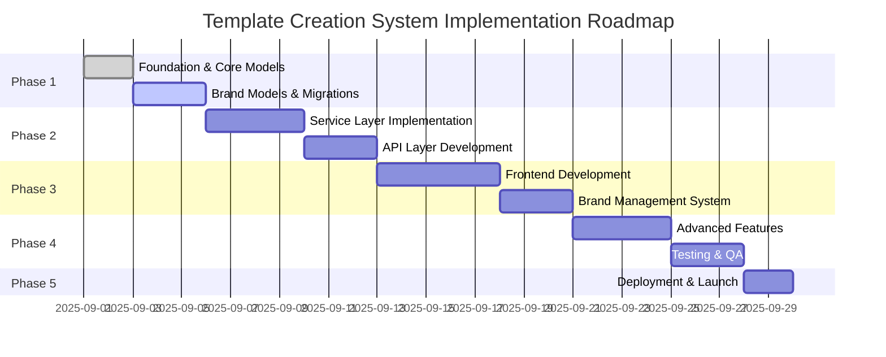
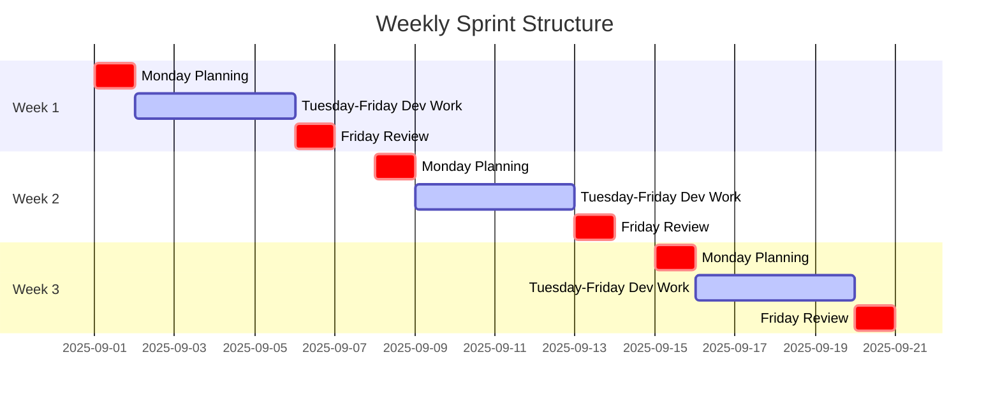

# Project Roadmap and Timeline

## Executive Summary

This roadmap outlines the implementation of the Template Creation System and Brand Management features over a 10-week period. The project is divided into five phases with clear milestones and deliverables.

## Project Phases Overview



## Detailed Timeline

### Phase 1: Foundation (Week 1-2)
**Duration**: September 1 - September 10, 2025
**Goal**: Establish core infrastructure and data models

#### Week 1 (September 1-5): Core Model Implementation
- **Day 1-2**: Template Model and Migrations
  - Create Template model with JSON structure
  - Implement performance metrics columns
  - Write database migrations with proper indexing
  - Add tenant isolation and configuration storage

- **Day 3-4**: LandingPage Model Implementation
  - Create LandingPage model with tenant isolation
  - Implement page configuration and brand override capabilities
  - Add status management (draft, published, archived, suspended)
  - Create related database migrations

- **Day 5**: Initial Testing and Validation
  - Unit tests for Template and LandingPage models
  - Integration testing with existing component library
  - Performance benchmarking

#### Week 2 (September 6-10): Brand System Foundation
- **Day 1-2**: Brand Models Implementation
  - Create BrandLogo model for logo management
  - Create BrandColor model for color palette management
  - Create BrandFont model for typography management

- **Day 3-4**: Advanced Brand Models
  - Create BrandTemplate model for predefined configurations
  - Create BrandGuidelines model for compliance enforcement
  - Implement relationships between brand models

- **Day 5**: Database Migration and Seeding
  - Write comprehensive database migrations
  - Create factory and seeder systems
  - Populate sample data for testing

### Phase 2: Service Layer (Week 3-4)
**Duration**: September 11 - September 20, 2025
**Goal**: Implement business logic and API endpoints

#### Week 3 (September 11-15): Core Services
- **Day 1-2**: TemplateService Implementation
  - Template CRUD operations
  - Template categorization and filtering
  - Template structure validation
  - Performance metrics tracking

- **Day 3-4**: LandingPageService Implementation
  - Landing page CRUD operations
  - Page publishing workflow
  - Page configuration management
  - Page analytics integration

- **Day 5**: BrandCustomizerService Enhancement
  - Extend existing service with new model support
  - Implement brand asset management
  - Add brand consistency checking

#### Week 4 (September 16-20): API Layer Development
- **Day 1-2**: Template API Controllers
  - RESTful endpoints for template management
  - Search and filtering capabilities
  - Template preview generation
  - Analytics endpoints

- **Day 3-4**: Landing Page and Brand APIs
  - Landing page management endpoints
  - Brand asset management APIs
  - Brand guidelines enforcement endpoints

- **Day 5**: API Documentation and Testing
  - OpenAPI/Swagger documentation
  - Postman collection creation
  - API integration testing

### Phase 3: Frontend Development (Week 5-7)
**Duration**: September 21 - October 8, 2025
**Goal**: Implement user interfaces and user experience

#### Week 5 (September 21-25): Core Frontend Components
- **Day 1-2**: Template Library Interface
  - Template browsing and selection
  - Category filtering and search
  - Template card components
  - Responsive grid layout

- **Day 3-4**: Template Editor Implementation
  - Drag-and-drop template builder
  - Component library integration
  - Real-time preview functionality
  - Configuration panels

- **Day 5**: Landing Page Builder
  - Page structure editor
  - Section management
  - Component customization
  - Mobile preview modes

#### Week 6 (September 28 - October 2): Brand Management UI
- **Day 1-2**: Brand Asset Management
  - Logo upload and management
  - Color palette editor
  - Font selection interface
  - Brand template manager

- **Day 3-4**: Brand Customization Tools
  - Real-time brand application
  - Color contrast checking
  - Font pairing recommendations
  - Brand guideline enforcement

- **Day 5**: Analytics Dashboard
  - Template performance metrics
  - Landing page analytics
  - Brand consistency reports
  - Usage statistics visualization

#### Week 7 (October 3-8): Advanced Frontend Features
- **Day 1-2**: Preview and Rendering System
  - Cross-device preview modes
  - Real-time rendering engine
  - Mobile-responsive testing
  - Performance optimization

- **Day 3-4**: Customization Interface
  - Advanced customization options
  - Theme editor
  - Component property editors
  - Live preview synchronization

- **Day 5**: User Experience Refinement
  - Accessibility compliance
  - Keyboard navigation
  - Screen reader support
  - Performance optimization

### Phase 4: Advanced Features (Week 8-9)
**Duration**: October 9 - October 22, 2025
**Goal**: Implement advanced functionality and integrations

#### Week 8 (October 9-13): Analytics and A/B Testing
- **Day 1-2**: Analytics Tracking System
  - Template usage tracking
  - Conversion rate monitoring
  - Performance metrics collection
  - Data aggregation and reporting

- **Day 3-4**: A/B Testing Framework
  - Test creation and management
  - Variant generation
  - Traffic splitting logic
  - Statistical analysis engine

- **Day 5**: CRM Integration
  - Lead routing service
  - Form field configuration
  - CRM webhook endpoints
  - Integration testing

#### Week 9 (October 16-22): Advanced Features Implementation
- **Day 1-2**: Import/Export Functionality
  - Template export service
  - Import validation and processing
  - Template versioning system
  - Backup and restore capabilities

- **Day 3-4**: Mobile Responsiveness
  - Responsive CSS generation
  - Mobile-optimized form handling
  - Touch interaction support
  - Performance optimization

- **Day 5**: Notification and Alerting
  - Template notifications
  - Performance alerts
  - User activity notifications
  - Integration with existing systems

### Phase 5: Testing and Deployment (Week 10-11)
**Duration**: October 23 - November 5, 2025
**Goal**: Comprehensive testing, optimization, and production deployment

#### Week 10 (October 23-27): Quality Assurance
- **Day 1-2**: Comprehensive Testing
  - Unit test coverage verification
  - Integration testing
  - End-to-end workflow testing
  - Performance benchmarking

- **Day 3-4**: Security and Validation
  - Security audit and penetration testing
  - Input validation verification
  - Tenant isolation testing
  - Data privacy compliance

- **Day 5**: User Acceptance Testing
  - Beta user testing program
  - Feedback collection and analysis
  - Bug fixes and improvements
  - Documentation updates

#### Week 11 (October 30 - November 5): Deployment and Launch
- **Day 1-2**: Production Deployment
  - Staging environment validation
  - Production deployment preparation
  - Blue-green deployment execution
  - Post-deployment verification

- **Day 3-4**: Monitoring and Optimization
  - Performance monitoring setup
  - Error tracking configuration
  - User behavior analytics
  - System health dashboards

- **Day 5**: Launch and Training
  - Official launch announcement
  - User training sessions
  - Support documentation publication
  - Success metrics tracking

## Milestone Deliverables

### Milestone 1: Core Infrastructure Complete
**Target Date**: September 10, 2025
**Deliverables**:
- Template and LandingPage models with migrations
- Complete brand model ecosystem (Logo, Color, Font, Template, Guidelines)
- Database seeding and factory systems
- Initial unit test coverage (80% minimum)

### Milestone 2: Service Layer Operational
**Target Date**: September 20, 2025
**Deliverables**:
- Complete service layer implementation
- RESTful API endpoints with documentation
- API integration testing completed
- Postman collections and example requests

### Milestone 3: Frontend MVP Ready
**Target Date**: October 8, 2025
**Deliverables**:
- Core template library interface
- Template editor and landing page builder
- Brand management system UI
- Analytics dashboard prototype

### Milestone 4: Advanced Features Integrated
**Target Date**: October 22, 2025
**Deliverables**:
- A/B testing framework operational
- CRM integration completed
- Import/export functionality
- Mobile-responsive design finalized

### Milestone 5: Production Ready
**Target Date**: November 5, 2025
**Deliverables**:
- Full test coverage achieved (95% minimum)
- Security audit completed
- Performance optimization verified
- Production deployment successful

## Resource Allocation

### Team Structure
```
Project Lead: 1 person (full-time)
Backend Developers: 2 people (full-time)
Frontend Developers: 2 people (full-time)
QA Engineers: 1 person (full-time)
DevOps Engineer: 1 person (part-time)
UX Designer: 1 person (part-time)
Technical Writer: 1 person (part-time)
```

### Weekly Sprint Structure


## Risk Management

### Technical Risks
1. **Database Performance**: High-volume template queries may impact performance
   - **Mitigation**: Implement proper indexing, caching strategies, and query optimization
   - **Contingency**: Scale database resources and implement read replicas

2. **Multi-Tenant Isolation**: Complex tenant boundaries may introduce data leakage
   - **Mitigation**: Rigorous tenant scoping and comprehensive integration testing
   - **Contingency**: Enhanced security audits and additional validation layers

3. **Frontend Complexity**: Rich template editor may have browser compatibility issues
   - **Mitigation**: Progressive enhancement and thorough cross-browser testing
   - **Contingency**: Simplified fallback interfaces and graceful degradation

### Schedule Risks
1. **Dependency Delays**: Integration with existing systems may take longer than expected
   - **Mitigation**: Early integration planning and mock service development
   - **Contingency**: Parallel development tracks and buffer time allocation

2. **Feature Creep**: Additional requirements may emerge during development
   - **Mitigation**: Strict scope management and change control processes
   - **Contingency**: Flexible sprint planning and phased delivery approach

### Resource Risks
1. **Team Availability**: Key personnel may become unavailable during critical periods
   - **Mitigation**: Cross-training and knowledge sharing initiatives
   - **Contingency**: External contractor support and skill redundancy

2. **Third-Party Dependencies**: External services may introduce delays or limitations
   - **Mitigation**: Vendor evaluation and contingency planning
   - **Contingency**: Alternative service providers and fallback strategies

## Success Metrics

### Technical Metrics
- **Code Quality**: 95% test coverage, zero critical security vulnerabilities
- **Performance**: <200ms API response time, <500ms page load time
- **Reliability**: 99.9% uptime, <1% error rate
- **Scalability**: Support 1000 concurrent users, handle 1000 templates per tenant

### Business Metrics
- **Adoption Rate**: 80% of tenants using templates within 30 days of launch
- **User Satisfaction**: 4.5+ star rating from beta users
- **Performance Improvement**: 25% increase in landing page conversion rates
- **Time Savings**: 50% reduction in landing page creation time

### Operational Metrics
- **Deployment Success**: Zero-downtime deployments, <5 minutes rollback capability
- **Support Tickets**: <10 critical tickets per week after launch
- **System Health**: 99.5% successful API calls, <0.1% error rate

## Communication Plan

### Stakeholder Updates
- **Weekly Status Reports**: Every Friday to all stakeholders
- **Bi-weekly Demo Sessions**: Live demonstrations of progress
- **Monthly Steering Committee**: Strategic direction and priority alignment
- **Real-time Slack Channels**: Daily collaboration and quick updates

### Documentation Deliverables
- **Technical Documentation**: API specs, architecture diagrams, deployment guides
- **User Documentation**: User manuals, video tutorials, FAQ
- **Operations Documentation**: Monitoring guides, troubleshooting procedures
- **Training Materials**: Workshop materials, hands-on labs, certification programs

## Budget and Resource Planning

### Development Costs
- **Personnel**: $120,000 (10 weeks × 6 team members × $2,000/week)
- **Infrastructure**: $15,000 (cloud hosting, databases, monitoring tools)
- **Tools and Licenses**: $5,000 (IDE licenses, design tools, testing platforms)
- **Training and Certification**: $3,000 (team upskilling, external workshops)

### Contingency Planning
- **Buffer Allocation**: 15% of total budget ($21,450) for unexpected costs
- **Risk Reserve**: 10% of total budget ($14,300) for scope changes
- **Emergency Fund**: 5% of total budget ($7,150) for critical issues

## Post-Launch Activities

### Month 1: Stabilization
- **Bug Fixes**: Address critical and high-priority issues
- **Performance Tuning**: Optimize based on real-world usage patterns
- **User Support**: Provide dedicated support during adoption period
- **Feedback Collection**: Gather and analyze user feedback

### Month 2: Enhancement
- **Feature Iteration**: Implement high-demand enhancements
- **Performance Improvements**: Advanced optimization based on metrics
- **Integration Expansion**: Additional CRM and marketing tool integrations
- **Documentation Updates**: Revise based on user feedback

### Month 3: Scale Preparation
- **Capacity Planning**: Prepare for increased adoption
- **Advanced Features**: Begin work on roadmap Phase 2 items
- **Community Building**: User groups, best practices sharing
- **Success Metrics Analysis**: Comprehensive ROI and impact assessment

This roadmap provides a structured approach to delivering the Template Creation System with clear milestones, risk mitigation strategies, and success metrics to ensure project success.