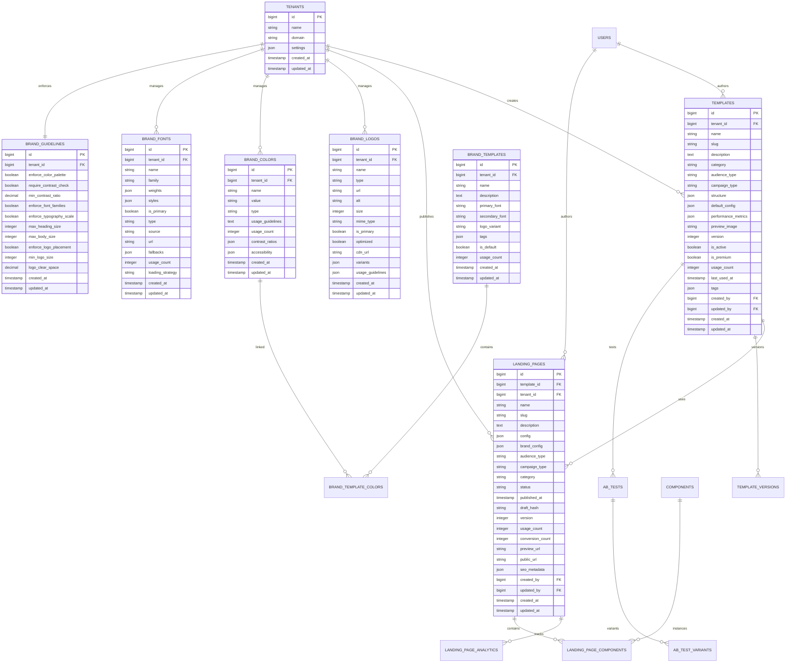

# Technical Specification

## Overview
This document provides the complete technical specification for the Template Creation System and Brand Management features, integrating all previously created architectural documents into a cohesive implementation plan.

## System Architecture

### High-Level Architecture Diagram


### Multi-Tenant Architecture


## Data Models

### Core Models Relationship Diagram


## API Specification

### RESTful Endpoints Structure

#### Template Management API
```
GET    /api/v1/tenants/{tenant_id}/templates
POST   /api/v1/tenants/{tenant_id}/templates
GET    /api/v1/tenants/{tenant_id}/templates/{template_id}
PUT    /api/v1/tenants/{tenant_id}/templates/{template_id}
DELETE /api/v1/tenants/{tenant_id}/templates/{template_id}
POST   /api/v1/tenants/{tenant_id}/templates/{template_id}/duplicate
POST   /api/v1/tenants/{tenant_id}/templates/{template_id}/version
GET    /api/v1/tenants/{tenant_id}/templates/{template_id}/preview
GET    /api/v1/tenants/{tenant_id}/templates/categories
GET    /api/v1/tenants/{tenant_id}/templates/audience-types
GET    /api/v1/tenants/{tenant_id}/templates/campaign-types
GET    /api/v1/tenants/{tenant_id}/templates/search?q={query}
```

#### Landing Page Management API
```
GET    /api/v1/tenants/{tenant_id}/landing-pages
POST   /api/v1/tenants/{tenant_id}/landing-pages
GET    /api/v1/tenants/{tenant_id}/landing-pages/{page_id}
PUT    /api/v1/tenants/{tenant_id}/landing-pages/{page_id}
DELETE /api/v1/tenants/{tenant_id}/landing-pages/{page_id}
POST   /api/v1/tenants/{tenant_id}/landing-pages/{page_id}/publish
POST   /api/v1/tenants/{tenant_id}/landing-pages/{page_id}/unpublish
POST   /api/v1/tenants/{tenant_id}/landing-pages/{page_id}/archive
POST   /api/v1/tenants/{tenant_id}/landing-pages/{page_id}/suspend
GET    /api/v1/tenants/{tenant_id}/landing-pages/{page_id}/preview
GET    /api/v1/tenants/{tenant_id}/landing-pages/{page_id}/analytics
```

#### Brand Management API
```
GET    /api/v1/tenants/{tenant_id}/brand/logos
POST   /api/v1/tenants/{tenant_id}/brand/logos
GET    /api/v1/tenants/{tenant_id}/brand/logos/{logo_id}
PUT    /api/v1/tenants/{tenant_id}/brand/logos/{logo_id}
DELETE /api/v1/tenants/{tenant_id}/brand/logos/{logo_id}
POST   /api/v1/tenants/{tenant_id}/brand/logos/{logo_id}/optimize
POST   /api/v1/tenants/{tenant_id}/brand/logos/{logo_id}/set-primary

GET    /api/v1/tenants/{tenant_id}/brand/colors
POST   /api/v1/tenants/{tenant_id}/brand/colors
GET    /api/v1/tenants/{tenant_id}/brand/colors/{color_id}
PUT    /api/v1/tenants/{tenant_id}/brand/colors/{color_id}
DELETE /api/v1/tenants/{tenant_id}/brand/colors/{color_id}

GET    /api/v1/tenants/{tenant_id}/brand/fonts
POST   /api/v1/tenants/{tenant_id}/brand/fonts
GET    /api/v1/tenants/{tenant_id}/brand/fonts/{font_id}
PUT    /api/v1/tenants/{tenant_id}/brand/fonts/{font_id}
DELETE /api/v1/tenants/{tenant_id}/brand/fonts/{font_id}
POST   /api/v1/tenants/{tenant_id}/brand/fonts/{font_id}/set-primary

GET    /api/v1/tenants/{tenant_id}/brand/templates
POST   /api/v1/tenants/{tenant_id}/brand/templates
GET    /api/v1/tenants/{tenant_id}/brand/templates/{template_id}
PUT    /api/v1/tenants/{tenant_id}/brand/templates/{template_id}
DELETE /api/v1/tenants/{tenant_id}/brand/templates/{template_id}
POST   /api/v1/tenants/{tenant_id}/brand/templates/{template_id}/duplicate
POST   /api/v1/tenants/{tenant_id}/brand/templates/{template_id}/apply

GET    /api/v1/tenants/{tenant_id}/brand/guidelines
PUT    /api/v1/tenants/{tenant_id}/brand/guidelines
POST   /api/v1/tenants/{tenant_id}/brand/consistency-check
```

### Request/Response Examples

#### Template Creation Request
```json
{
  "name": "Corporate Landing Page",
  "description": "Professional landing page for corporate communications",
  "category": "landing",
  "audience_type": "institution",
  "campaign_type": "onboarding",
  "structure": {
    "sections": [
      {
        "type": "hero",
        "config": {
          "title": "Welcome to Our Platform",
          "subtitle": "Transform your digital experience",
          "cta_text": "Get Started",
          "background_type": "image",
          "background_image": "/images/hero-bg.jpg"
        }
      },
      {
        "type": "features",
        "config": {
          "title": "Key Features",
          "features": [
            {
              "icon": "star",
              "title": "Easy Setup",
              "description": "Get started in minutes"
            },
            {
              "icon": "rocket",
              "title": "Fast Performance",
              "description": "Optimized for speed"
            }
          ]
        }
      }
    ]
  },
  "default_config": {
    "colors": {
      "primary": "#007bff",
      "secondary": "#6c757d",
      "accent": "#28a745"
    },
    "typography": {
      "font_family": "Inter, sans-serif",
      "heading_size": "2.5rem",
      "body_size": "1rem"
    }
  },
  "tags": ["corporate", "professional", "modern"]
}
```

#### Template Creation Response
```json
{
  "success": true,
  "data": {
    "id": "12345",
    "tenant_id": "1",
    "name": "Corporate Landing Page",
    "slug": "corporate-landing-page",
    "description": "Professional landing page for corporate communications",
    "category": "landing",
    "audience_type": "institution",
    "campaign_type": "onboarding",
    "structure": {
      "sections": [
        {
          "type": "hero",
          "config": {
            "title": "Welcome to Our Platform",
            "subtitle": "Transform your digital experience",
            "cta_text": "Get Started",
            "background_type": "image",
            "background_image": "/images/hero-bg.jpg"
          }
        }
      ]
    },
    "default_config": {
      "colors": {
        "primary": "#007bff",
        "secondary": "#6c757d",
        "accent": "#28a745"
      },
      "typography": {
        "font_family": "Inter, sans-serif",
        "heading_size": "2.5rem",
        "body_size": "1rem"
      }
    },
    "performance_metrics": {
      "conversion_rate": 0,
      "avg_load_time": 0,
      "bounce_rate": 0,
      "engagement_score": 0
    },
    "version": 1,
    "is_active": true,
    "is_premium": false,
    "usage_count": 0,
    "tags": ["corporate", "professional", "modern"],
    "created_at": "2025-09-03T12:00:00Z",
    "updated_at": "2025-09-03T12:00:00Z"
  },
  "message": "Template created successfully"
}
```

## Service Layer Implementation

### Core Service Classes

#### TemplateService Class
```php
class TemplateService
{
    protected TemplateRepository $repository;
    protected ComponentService $componentService;
    protected AnalyticsService $analyticsService;

    public function __construct(
        TemplateRepository $repository,
        ComponentService $componentService,
        AnalyticsService $analyticsService
    ) {
        $this->repository = $repository;
        $this->componentService = $componentService;
        $this->analyticsService = $analyticsService;
    }

    public function create(array $data, string $tenantId): Template
    {
        // Validate input data
        $this->validateTemplateData($data);
        
        // Generate unique slug
        $data['slug'] = $this->generateUniqueSlug($data['name'], $tenantId);
        
        // Set default values
        $data['tenant_id'] = $tenantId;
        $data['version'] = 1;
        $data['is_active'] = true;
        
        // Create template
        $template = $this->repository->create($data);
        
        // Log creation event
        $this->analyticsService->logTemplateEvent($template, 'created');
        
        return $template;
    }

    public function update(Template $template, array $data): Template
    {
        // Validate update data
        $this->validateTemplateData($data, true);
        
        // Update template
        $updatedTemplate = $this->repository->update($template, $data);
        
        // Log update event
        $this->analyticsService->logTemplateEvent($updatedTemplate, 'updated');
        
        return $updatedTemplate;
    }

    public function duplicate(Template $template, array $modifications = []): Template
    {
        $duplicateData = $template->toArray();
        
        // Remove auto-generated fields
        unset($duplicateData['id'], $duplicateData['created_at'], $duplicateData['updated_at']);
        
        // Apply modifications
        $duplicateData = array_merge($duplicateData, $modifications);
        
        // Generate new name if not provided
        if (!isset($modifications['name'])) {
            $duplicateData['name'] = $template->name . ' (Copy)';
        }
        
        // Generate unique slug
        $duplicateData['slug'] = $this->generateUniqueSlug($duplicateData['name'], $template->tenant_id);
        
        // Increment version
        $duplicateData['version'] = $template->version + 1;
        
        // Create duplicate
        return $this->create($duplicateData, $template->tenant_id);
    }

    public function search(array $filters = [], ?string $tenantId = null): LengthAwarePaginator
    {
        return $this->repository->search($filters, $tenantId);
    }

    public function generatePreview(Template $template, array $customConfig = []): array
    {
        $config = array_merge($template->default_config ?? [], $customConfig);
        
        return [
            'id' => $template->id,
            'name' => $template->name,
            'category' => $template->category,
            'structure' => $template->structure,
            'config' => $config,
            'preview_url' => $template->preview_url,
            'components' => $this->componentService->getComponentsForTemplate($template)
        ];
    }

    protected function validateTemplateData(array $data, bool $isUpdate = false): void
    {
        $rules = $isUpdate ? Template::getUniqueValidationRules() : Template::getValidationRules();
        
        $validator = Validator::make($data, $rules);
        
        if ($validator->fails()) {
            throw new ValidationException($validator);
        }
    }

    protected function generateUniqueSlug(string $name, string $tenantId): string
    {
        $baseSlug = Str::slug($name);
        $slug = $baseSlug;
        $counter = 1;
        
        while ($this->repository->slugExists($slug, $tenantId)) {
            $slug = $baseSlug . '-' . $counter;
            $counter++;
        }
        
        return $slug;
    }
}
```

#### BrandCustomizerService Class
```php
class BrandCustomizerService
{
    protected BrandLogoRepository $logoRepository;
    protected BrandColorRepository $colorRepository;
    protected BrandFontRepository $fontRepository;
    protected BrandTemplateRepository $templateRepository;
    protected BrandGuidelinesRepository $guidelinesRepository;

    public function __construct(
        BrandLogoRepository $logoRepository,
        BrandColorRepository $colorRepository,
        BrandFontRepository $fontRepository,
        BrandTemplateRepository $templateRepository,
        BrandGuidelinesRepository $guidelinesRepository
    ) {
        $this->logoRepository = $logoRepository;
        $this->colorRepository = $colorRepository;
        $this->fontRepository = $fontRepository;
        $this->templateRepository = $templateRepository;
        $this->guidelinesRepository = $guidelinesRepository;
    }

    public function createLogo(array $data, string $tenantId): BrandLogo
    {
        $data['tenant_id'] = $tenantId;
        return $this->logoRepository->create($data);
    }

    public function createColor(array $data, string $tenantId): BrandColor
    {
        $data['tenant_id'] = $tenantId;
        $data['contrast_ratios'] = $this->calculateContrastRatios($data['value']);
        $data['accessibility'] = $this->checkAccessibility($data['value']);
        return $this->colorRepository->create($data);
    }

    public function createFont(array $data, string $tenantId): BrandFont
    {
        $data['tenant_id'] = $tenantId;
        return $this->fontRepository->create($data);
    }

    public function createTemplate(array $data, string $tenantId): BrandTemplate
    {
        $data['tenant_id'] = $tenantId;
        $template = $this->templateRepository->create($data);
        
        // Attach colors if provided
        if (isset($data['color_ids'])) {
            $template->colors()->attach($data['color_ids']);
        }
        
        return $template->load('colors');
    }

    public function updateGuidelines(array $data, string $tenantId): BrandGuidelines
    {
        return $this->guidelinesRepository->updateOrCreate(
            ['tenant_id' => $tenantId],
            $data
        );
    }

    public function runConsistencyCheck(string $tenantId): array
    {
        $guidelines = $this->guidelinesRepository->findByTenant($tenantId);
        $assets = $this->getAllBrandAssets($tenantId);
        
        $issues = [];
        
        // Check color palette consistency
        if ($guidelines->enforce_color_palette) {
            $issues = array_merge($issues, $this->checkColorPaletteConsistency($assets['colors'], $guidelines));
        }
        
        // Check font family consistency
        if ($guidelines->enforce_font_families) {
            $issues = array_merge($issues, $this->checkFontFamilyConsistency($assets['fonts'], $guidelines));
        }
        
        // Check logo placement consistency
        if ($guidelines->enforce_logo_placement) {
            $issues = array_merge($issues, $this->checkLogoPlacementConsistency($assets['logos'], $guidelines));
        }
        
        return [
            'compliant_assets' => count($assets['all']) - count($issues),
            'total_assets' => count($assets['all']),
            'issues' => $issues,
            'score' => $this->calculateConsistencyScore(count($assets['all']), count($issues))
        ];
    }

    protected function calculateContrastRatios(string $color): array
    {
        $backgrounds = ['#FFFFFF', '#000000', '#F3F4F6', '#374151'];
        $ratios = [];
        
        foreach ($backgrounds as $bg) {
            $ratio = $this->calculateContrastRatio($color, $bg);
            $ratios[] = [
                'background' => $bg,
                'ratio' => $ratio,
                'level' => $this->getWCAGLevel($ratio)
            ];
        }
        
        return $ratios;
    }

    protected function checkAccessibility(string $color): array
    {
        $contrastRatios = $this->calculateContrastRatios($color);
        $issues = [];
        
        foreach ($contrastRatios as $ratio) {
            if ($ratio['ratio'] < 4.5) {
                $issues[] = "Poor contrast against {$ratio['background']} background";
            }
        }
        
        return [
            'wcag_compliant' => empty($issues),
            'contrast_issues' => $issues
        ];
    }

    protected function getAllBrandAssets(string $tenantId): array
    {
        return [
            'logos' => $this->logoRepository->findByTenant($tenantId),
            'colors' => $this->colorRepository->findByTenant($tenantId),
            'fonts' => $this->fontRepository->findByTenant($tenantId),
            'templates' => $this->templateRepository->findByTenant($tenantId),
            'all' => array_merge(
                $this->logoRepository->findByTenant($tenantId)->toArray(),
                $this->colorRepository->findByTenant($tenantId)->toArray(),
                $this->fontRepository->findByTenant($tenantId)->toArray(),
                $this->templateRepository->findByTenant($tenantId)->toArray()
            )
        ];
    }

    protected function calculateConsistencyScore(int $totalAssets, int $issueCount): float
    {
        if ($totalAssets === 0) {
            return 100.0;
        }
        
        return round(((($totalAssets - $issueCount) / $totalAssets) * 100), 2);
    }
}
```

## Frontend Architecture

### Component Hierarchy


### State Management Structure


## Database Schema

### Core Tables Structure

#### templates Table
```sql
CREATE TABLE templates (
    id BIGSERIAL PRIMARY KEY,
    tenant_id BIGINT NOT NULL REFERENCES tenants(id) ON DELETE CASCADE,
    name VARCHAR(255) NOT NULL,
    slug VARCHAR(255) NOT NULL UNIQUE,
    description TEXT,
    category VARCHAR(50) NOT NULL,
    audience_type VARCHAR(50) NOT NULL,
    campaign_type VARCHAR(50) NOT NULL,
    structure JSONB,
    default_config JSONB,
    performance_metrics JSONB,
    preview_image VARCHAR(255),
    preview_url VARCHAR(255),
    version INTEGER DEFAULT 1,
    is_active BOOLEAN DEFAULT true,
    is_premium BOOLEAN DEFAULT false,
    usage_count INTEGER DEFAULT 0,
    last_used_at TIMESTAMP,
    tags JSONB,
    created_by BIGINT REFERENCES users(id) ON DELETE SET NULL,
    updated_by BIGINT REFERENCES users(id) ON DELETE SET NULL,
    created_at TIMESTAMP DEFAULT CURRENT_TIMESTAMP,
    updated_at TIMESTAMP DEFAULT CURRENT_TIMESTAMP,
    
    -- Indexes
    INDEX idx_templates_tenant_category (tenant_id, category),
    INDEX idx_templates_tenant_audience (tenant_id, audience_type),
    INDEX idx_templates_tenant_campaign (tenant_id, campaign_type),
    INDEX idx_templates_active_created (is_active, created_at),
    INDEX idx_templates_usage_count (usage_count),
    INDEX idx_templates_slug (slug),
    UNIQUE INDEX idx_templates_tenant_slug (tenant_id, slug)
);
```

#### landing_pages Table
```sql
CREATE TABLE landing_pages (
    id BIGSERIAL PRIMARY KEY,
    template_id BIGINT NOT NULL REFERENCES templates(id) ON DELETE CASCADE,
    tenant_id BIGINT NOT NULL REFERENCES tenants(id) ON DELETE CASCADE,
    name VARCHAR(255) NOT NULL,
    slug VARCHAR(255) NOT NULL UNIQUE,
    description TEXT,
    config JSONB,
    brand_config JSONB,
    audience_type VARCHAR(50) NOT NULL,
    campaign_type VARCHAR(50) NOT NULL,
    category VARCHAR(50) NOT NULL,
    status VARCHAR(20) DEFAULT 'draft',
    published_at TIMESTAMP,
    draft_hash VARCHAR(255),
    version INTEGER DEFAULT 1,
    usage_count INTEGER DEFAULT 0,
    conversion_count INTEGER DEFAULT 0,
    preview_url VARCHAR(255),
    public_url VARCHAR(255),
    seo_metadata JSONB,
    created_by BIGINT REFERENCES users(id) ON DELETE SET NULL,
    updated_by BIGINT REFERENCES users(id) ON DELETE SET NULL,
    created_at TIMESTAMP DEFAULT CURRENT_TIMESTAMP,
    updated_at TIMESTAMP DEFAULT CURRENT_TIMESTAMP,
    
    -- Indexes
    INDEX idx_landing_pages_tenant_status (tenant_id, status),
    INDEX idx_landing_pages_tenant_category (tenant_id, category),
    INDEX idx_landing_pages_tenant_audience (tenant_id, audience_type),
    INDEX idx_landing_pages_tenant_campaign (tenant_id, campaign_type),
    INDEX idx_landing_pages_published_at (published_at),
    INDEX idx_landing_pages_usage_count (usage_count),
    INDEX idx_landing_pages_slug (slug),
    UNIQUE INDEX idx_landing_pages_tenant_slug (tenant_id, slug)
);
```

#### brand_logos Table
```sql
CREATE TABLE brand_logos (
    id BIGSERIAL PRIMARY KEY,
    tenant_id BIGINT NOT NULL REFERENCES tenants(id) ON DELETE CASCADE,
    name VARCHAR(255) NOT NULL,
    type VARCHAR(50) NOT NULL,
    url VARCHAR(255) NOT NULL,
    alt VARCHAR(255),
    size INTEGER,
    mime_type VARCHAR(100),
    is_primary BOOLEAN DEFAULT false,
    optimized BOOLEAN DEFAULT false,
    cdn_url VARCHAR(255),
    variants JSONB,
    usage_guidelines JSONB,
    created_at TIMESTAMP DEFAULT CURRENT_TIMESTAMP,
    updated_at TIMESTAMP DEFAULT CURRENT_TIMESTAMP,
    
    -- Indexes
    INDEX idx_brand_logos_tenant_primary (tenant_id, is_primary),
    INDEX idx_brand_logos_tenant_type (tenant_id, type),
    INDEX idx_brand_logos_created_at (created_at)
);
```

#### brand_colors Table
```sql
CREATE TABLE brand_colors (
    id BIGSERIAL PRIMARY KEY,
    tenant_id BIGINT NOT NULL REFERENCES tenants(id) ON DELETE CASCADE,
    name VARCHAR(100) NOT NULL,
    value VARCHAR(7) NOT NULL, -- Hex color code
    type VARCHAR(50) NOT NULL,
    usage_guidelines TEXT,
    usage_count INTEGER DEFAULT 0,
    contrast_ratios JSONB,
    accessibility JSONB,
    created_at TIMESTAMP DEFAULT CURRENT_TIMESTAMP,
    updated_at TIMESTAMP DEFAULT CURRENT_TIMESTAMP,
    
    -- Indexes
    INDEX idx_brand_colors_tenant_type (tenant_id, type),
    INDEX idx_brand_colors_usage_count (usage_count),
    INDEX idx_brand_colors_created_at (created_at),
    INDEX idx_brand_colors_value (value)
);
```

#### brand_fonts Table
```sql
CREATE TABLE brand_fonts (
    id BIGSERIAL PRIMARY KEY,
    tenant_id BIGINT NOT NULL REFERENCES tenants(id) ON DELETE CASCADE,
    name VARCHAR(100) NOT NULL,
    family VARCHAR(255) NOT NULL,
    weights JSONB, -- Array of available weights
    styles JSONB, -- Array of available styles
    is_primary BOOLEAN DEFAULT false,
    type VARCHAR(50) NOT NULL,
    source VARCHAR(255),
    url VARCHAR(255),
    fallbacks JSONB,
    usage_count INTEGER DEFAULT 0,
    loading_strategy VARCHAR(20) DEFAULT 'swap',
    created_at TIMESTAMP DEFAULT CURRENT_TIMESTAMP,
    updated_at TIMESTAMP DEFAULT CURRENT_TIMESTAMP,
    
    -- Indexes
    INDEX idx_brand_fonts_tenant_primary (tenant_id, is_primary),
    INDEX idx_brand_fonts_tenant_type (tenant_id, type),
    INDEX idx_brand_fonts_usage_count (usage_count),
    INDEX idx_brand_fonts_created_at (created_at)
);
```

#### brand_templates Table
```sql
CREATE TABLE brand_templates (
    id BIGSERIAL PRIMARY KEY,
    tenant_id BIGINT NOT NULL REFERENCES tenants(id) ON DELETE CASCADE,
    name VARCHAR(255) NOT NULL,
    description TEXT,
    primary_font VARCHAR(255),
    secondary_font VARCHAR(255),
    logo_variant VARCHAR(50),
    tags JSONB,
    is_default BOOLEAN DEFAULT false,
    usage_count INTEGER DEFAULT 0,
    created_at TIMESTAMP DEFAULT CURRENT_TIMESTAMP,
    updated_at TIMESTAMP DEFAULT CURRENT_TIMESTAMP,
    
    -- Indexes
    INDEX idx_brand_templates_tenant_default (tenant_id, is_default),
    INDEX idx_brand_templates_usage_count (usage_count),
    INDEX idx_brand_templates_created_at (created_at)
);
```

#### brand_guidelines Table
```sql
CREATE TABLE brand_guidelines (
    id BIGSERIAL PRIMARY KEY,
    tenant_id BIGINT NOT NULL REFERENCES tenants(id) ON DELETE CASCADE,
    enforce_color_palette BOOLEAN DEFAULT true,
    require_contrast_check BOOLEAN DEFAULT true,
    min_contrast_ratio DECIMAL(3,1) DEFAULT 4.5,
    enforce_font_families BOOLEAN DEFAULT true,
    enforce_typography_scale BOOLEAN DEFAULT true,
    max_heading_size INTEGER DEFAULT 48,
    max_body_size INTEGER DEFAULT 18,
    enforce_logo_placement BOOLEAN DEFAULT true,
    min_logo_size INTEGER DEFAULT 32,
    logo_clear_space DECIMAL(3,1) DEFAULT 1.5,
    created_at TIMESTAMP DEFAULT CURRENT_TIMESTAMP,
    updated_at TIMESTAMP DEFAULT CURRENT_TIMESTAMP,
    
    -- Constraints
    UNIQUE (tenant_id)
);
```

## Performance Optimization

### Caching Strategy


### Database Optimization
```sql
-- Performance indexes for template queries
CREATE INDEX CONCURRENTLY idx_templates_search_gin 
ON templates USING gin(to_tsvector('english', name || ' ' || coalesce(description, '')));

CREATE INDEX CONCURRENTLY idx_landing_pages_search_gin 
ON landing_pages USING gin(to_tsvector('english', name || ' ' || coalesce(description, '')));

-- Composite indexes for common queries
CREATE INDEX CONCURRENTLY idx_templates_composite 
ON templates (tenant_id, category, audience_type, campaign_type, is_active);

CREATE INDEX CONCURRENTLY idx_landing_pages_composite 
ON landing_pages (tenant_id, status, category, audience_type, campaign_type);

-- Partial indexes for active records
CREATE INDEX CONCURRENTLY idx_templates_active 
ON templates (tenant_id, created_at DESC) 
WHERE is_active = true;

CREATE INDEX CONCURRENTLY idx_landing_pages_published 
ON landing_pages (tenant_id, published_at DESC) 
WHERE status = 'published';

-- Materialized view for analytics
CREATE MATERIALIZED VIEW template_analytics_summary AS
SELECT 
    tenant_id,
    category,
    COUNT(*) as total_templates,
    AVG(usage_count) as avg_usage,
    AVG(performance_metrics->>'conversion_rate')::DECIMAL as avg_conversion_rate
FROM templates 
GROUP BY tenant_id, category;

REFRESH MATERIALIZED VIEW CONCURRENTLY template_analytics_summary;
```

## Security Implementation

### Authentication and Authorization


### Data Protection
```php
class DataProtectionService
{
    public function encryptSensitiveData(array $data): array
    {
        $encrypted = [];
        $sensitiveFields = ['config', 'brand_config', 'seo_metadata'];
        
        foreach ($data as $key => $value) {
            if (in_array($key, $sensitiveFields) && is_array($value)) {
                $encrypted[$key] = Crypt::encryptString(json_encode($value));
            } else {
                $encrypted[$key] = $value;
            }
        }
        
        return $encrypted;
    }

    public function decryptSensitiveData(array $data): array
    {
        $decrypted = [];
        $sensitiveFields = ['config', 'brand_config', 'seo_metadata'];
        
        foreach ($data as $key => $value) {
            if (in_array($key, $sensitiveFields) && is_string($value)) {
                try {
                    $decrypted[$key] = json_decode(Crypt::decryptString($value), true);
                } catch (DecryptException $e) {
                    $decrypted[$key] = $value; // Return as-is if decryption fails
                }
            } else {
                $decrypted[$key] = $value;
            }
        }
        
        return $decrypted;
    }

    public function sanitizeOutput(array $data): array
    {
        $sensitiveKeys = ['password', 'secret', 'token', 'api_key'];
        
        foreach ($sensitiveKeys as $key) {
            if (array_key_exists($key, $data)) {
                unset($data[$key]);
            }
        }
        
        return $data;
    }
}
```

## Testing Strategy Integration

### Test Coverage Matrix


### Quality Gate Requirements
```yaml
# Code quality gates
quality_gates:
  unit_test_coverage: 90%
  integration_test_coverage: 85%
  end_to_end_test_coverage: 80%
  code_complexity:
    max_ccn: 10
    max_npath: 200
  security_scan:
    critical_vulnerabilities: 0
    high_vulnerabilities: 0
    medium_vulnerabilities: 5
  performance_benchmarks:
    api_response_time: 200ms
    database_query_time: 100ms
    page_load_time: 2000ms
  code_style:
    psr12_compliance: 100%
    eslint_compliance: 100%
```

## Deployment Architecture

### Infrastructure as Code
```yaml
# Docker Compose for staging environment
version: '3.8'

services:
  app:
    build: .
    environment:
      - APP_ENV=staging
      - DB_HOST=db
      - REDIS_HOST=cache
    depends_on:
      - db
      - cache
    deploy:
      replicas: 2
      resources:
        limits:
          cpus: '0.5'
          memory: 512M

  db:
    image: postgres:13
    environment:
      - POSTGRES_DB=template_staging
      - POSTGRES_USER=template_user
    volumes:
      - db_data:/var/lib/postgresql/data
    deploy:
      resources:
        limits:
          cpus: '1.0'
          memory: 1G

  cache:
    image: redis:7-alpine
    deploy:
      resources:
        limits:
          cpus: '0.25'
          memory: 256M

  queue:
    build: .
    command: ['php', 'artisan', 'queue:work', '--tries=3']
    deploy:
      replicas: 2
      resources:
        limits:
          cpus: '0.5'
          memory: 512M

volumes:
  db_data:
```

## Monitoring and Observability

### Observability Stack


### Health Check Endpoints
```php
class HealthCheckController extends Controller
{
    public function index(): JsonResponse
    {
        $checks = [
            'application' => $this->checkApplicationHealth(),
            'database' => $this->checkDatabaseHealth(),
            'cache' => $this->checkCacheHealth(),
            'queue' => $this->checkQueueHealth(),
            'storage' => $this->checkStorageHealth(),
            'external_services' => $this->checkExternalServicesHealth()
        ];

        $overallHealth = collect($checks)->every(fn($check) => $check['status'] === 'healthy');

        return response()->json([
            'status' => $overallHealth ? 'healthy' : 'degraded',
            'timestamp' => now()->toISOString(),
            'checks' => $checks,
            'version' => config('app.version')
        ]);
    }

    private function checkApplicationHealth(): array
    {
        return [
            'status' => 'healthy',
            'details' => [
                'php_version' => phpversion(),
                'laravel_version' => app()->version(),
                'uptime' => now()->diffInSeconds(app()->startTime())
            ]
        ];
    }

    private function checkDatabaseHealth(): array
    {
        try {
            DB::connection()->getPdo();
            $queryTime = DB::select('SELECT EXTRACT(EPOCH FROM NOW() - NOW()) as latency')[0]->latency ?? 0;
            
            return [
                'status' => 'healthy',
                'details' => [
                    'latency_ms' => $queryTime * 1000,
                    'connection_pool' => DB::connection()->getPdo() ? 'active' : 'inactive'
                ]
            ];
        } catch (Exception $e) {
            return [
                'status' => 'unhealthy',
                'details' => [
                    'error' => $e->getMessage()
                ]
            ];
        }
    }

    private function checkCacheHealth(): array
    {
        $startTime = microtime(true);
        $testKey = 'health_check_' . uniqid();
        $testValue = 'test_value';
        
        try {
            Cache::put($testKey, $testValue, 60);
            $retrievedValue = Cache::get($testKey);
            Cache::forget($testKey);
            
            $latency = (microtime(true) - $startTime) * 1000;
            
            return [
                'status' => $retrievedValue === $testValue ? 'healthy' : 'degraded',
                'details' => [
                    'latency_ms' => $latency,
                    'driver' => config('cache.default')
                ]
            ];
        } catch (Exception $e) {
            return [
                'status' => 'unhealthy',
                'details' => [
                    'error' => $e->getMessage()
                ]
            ];
        }
    }
}
```

This technical specification provides a comprehensive blueprint for implementing the Template Creation System with all integrated components, ensuring a robust, scalable, and maintainable solution.